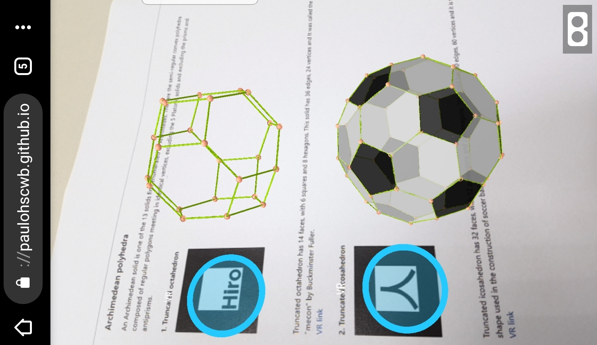
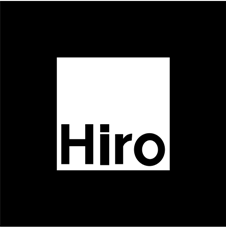
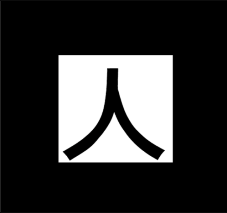
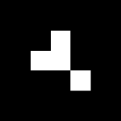
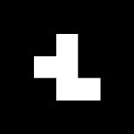
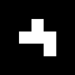

# polyhedra
 <b>Show polyhedra in Augmented Reality and Virtual Reality</b>
 
 The Archimedean and Plato polyhedra can be viewed in AR with the indicated markers, and through the links created on the markers, the polyhedra can be seen in VR.
 The RA environment was created with the <b>Jerome Etienne</b> scripts.
 The orbit scripts developed by <b>Till Hinrichs</b> were used on the VR pages.
  To view the polyhedra in AR, simply visit <a href="https://paulohscwb.github.io/polyhedra/archimedes.html">https://paulohscwb.github.io/polyhedra/archimedes.html</a> with any browser with a webcam device (smartphone, tablet or notebook). 
 Access to the VR sites is done by clicking on the blue circle that appears on top of the marker.

 <h3>Archimedean polyhedra</h3>
 An Archimedean solid is one of the 13 solids first enumerated by Archimedes. They are the semi-regular convex polyhedra composed of regular polygons meeting in identical vertices, excluding the 5 Platonic solids and excluding the prisms and antiprisms.
 <h4>1. Truncated octahedron</h4>
 
   Truncated octahedron has 14 faces, with 6 squares and 8 hexagons. This solid has 36 edges, 24 vertices and It was called the "mecon" by Buckminster Fuller.
  <a href="https://paulohscwb.github.io/polyhedra/vr/truncated_octahedron.html">VR link</a>
 <h4>2. Truncated icosahedron</h4>
 
   Truncated icosahedron has 32 faces, with 12 pentagons and 20 hexagons. This solid has 90 edges, 60 vertices and it is the shape used in the construction of soccer balls.
  <a href="https://paulohscwb.github.io/polyhedra/vr/truncated_icosahedron.html">VR link</a>
 <h4>3. Truncated icosidodecahedron</h4>
 
   Truncated icosidodecahedron has 62 faces, with 30 squares, 20 hexagons and 12 decagons. This solid has 180 edges, 120 vertices and It is also known as the great rhombicosidodecahedron.
  <a href="https://paulohscwb.github.io/polyhedra/vr/truncated_icosidodecahedron.html">VR link</a>
 <h4>4. Rhombicosidodecahedron</h4>
 
   Rhombicosidodecahedron has 62 faces, with 20 triangles, 30 squares and 12 pentagons. This solid has 120 edges, 60 vertices and it is also known as the small rhombicosidodecahedron or small dodecicosidodecahedron.
  <a href="https://paulohscwb.github.io/polyhedra/vr/rhombicosidodecahedron.html">VR link</a>
 <h4>5. Snub dodecahedron</h4>
 
   Snub dodecahedron has 92 faces, with 80 triangles and 12 pentagons. This solid has 150 edges, 60 vertices and it is a chiral solid, and therefore exists in two enantiomorphous forms, commonly called laevo (left-handed) and dextro (right-handed).
  <a href="https://paulohscwb.github.io/polyhedra/vr/snub_dodecahedron.html">VR link</a>
 snub_dodecahedron
