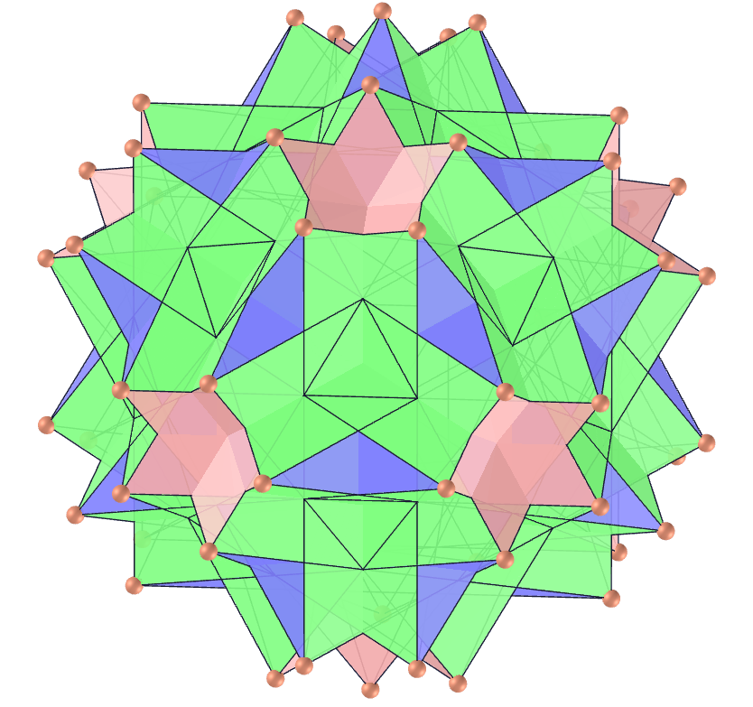

<link rel="stylesheet" href="scripts/style.css">
<h2>Visualization of polyhedra with Augmented Reality (AR) and Virtual Reality (VR) in A-frame</h2>
 <b>author:</b> Paulo Henrique Siqueira - Universidade Federal do Paraná
  <b>contact:</b> <a href="#">paulohscwb@gmail.com</a>
  <a href="https://paulohscwb.github.io/polyhedra/pt-br/">versão em português</a>
   The Archimedean, Plato, Catalan, non convex, self-intersecting and quasi regular polyhedra can be viewed in AR with the indicated markers, and through the links created on the markers, the polyhedra can be seen in VR.
  A <b>uniform polyhedron</b> has regular polygons as faces and is isogonal, that is, it has an isometry that allows the set of its vertices to correspond to each other through symmetry relations. The notation used for the <b>nth</b> uniform polyhedron is <b>Un</b>.
 The AR environment was created with the <b>Jerome Etienne</b> scripts: <a href="https://github.com/jeromeetienne/AR.js" target="_blank">AR.js - Augmented Reality for the Web</a>.
 The orbit scripts developed by <b>Kevin Ngo</b> were used on the VR pages: <a href="https://github.com/supermedium/superframe/tree/master/components/orbit-controls/" target="_blank"> Orbit controls for A-Frame</a>.
 

<h3 style="margin-bottom:3px"><a target="_blank" href="archimedes/"> Archimedean polyhedra</a></h3>
<h3 style="margin-bottom:3px"><a target="_blank" href="platonic/"> Platonic polyhedra</a></h3>
<h3 style="margin-bottom:3px"><a target="_blank" href="catalan/"> Catalan polyhedra</a></h3>
<h3 style="margin-bottom:3px"><a target="_blank" href="nonconvex/"> Nonconvex polyhedra</a></h3>
<h3 style="margin-bottom:3px"><a target="_blank" href="selfintersect/"> Self-intersecting polyhedra</a></h3>
<h3 style="margin-bottom:3px"><a target="_blank" href="quasiregular/"> Quasi regular polyhedra</a></h3>
<h3 style="margin-bottom:3px"><a target="_blank" href="selfintersecttruncated/"> Self-intersecting truncated polyhedra</a></h3>
<h3 style="margin-bottom:3px"><a target="_blank" href="selfintersectsnub/"> Self-intersecting snub polyhedra</a></h3>
<h3 style="margin-bottom:3px"><a target="_blank" href="polyhedron/"> Pyramids, tetrahedrons, prisms and antiprisms</a></h3>
<h3 style="margin-bottom:3px"><a target="_blank" href="johnson1/"> Johnson solids 1: J1 - J32</a></h3>
<h3 style="margin-bottom:3px"><a target="_blank" href="johnson2/"> Johnson solids 2: J33 - J62</a></h3>
<h3 style="margin-bottom:3px"><a target="_blank" href="johnson3/"> Johnson solids 3: J63 - J92</a></h3>

  Polyhedra by <a xmlns:cc="http://creativecommons.org/ns#" href="https://paulohscwb.github.io/polyhedra/" property="cc:attributionName" rel="cc:attributionURL">Paulo Henrique Siqueira</a> is licensed with a license <a rel="license" href="http://creativecommons.org/licenses/by-nc-nd/4.0/">Creative Commons Attribution-NonCommercial-NoDerivatives 4.0 International</a>.

<h4>How to cite this work:</h4> 

Siqueira, P.H., "Polyhedra". Available in: <https://paulohscwb.github.io/polyhedra/>, September 2019.

 <b>References:</b>
 Weisstein, Eric W. "Archimedean Solid" From MathWorld-A Wolfram Web Resource. <a href="http://mathworld.wolfram.com/ArchimedeanSolid.html" target="_blank">http://mathworld.wolfram.com/ArchimedeanSolid.html</a>
 Weisstein, Eric W. "Platonic Solid" From MathWorld-A Wolfram Web Resource. <a href="http://mathworld.wolfram.com/PlatonicSolid.html" target="_blank">http://mathworld.wolfram.com/PlatonicSolid.html</a>
 Weisstein, Eric W. "Archimedean Dual" From MathWorld-A Wolfram Web Resource. <a href="https://mathworld.wolfram.com/ArchimedeanDual.html" target="_blank">https://mathworld.wolfram.com/ArchimedeanDual.html</a>
 Weisstein, Eric W. "Uniform Polyhedron." From MathWorld--A Wolfram Web Resource. <a href="https://mathworld.wolfram.com/UniformPolyhedron.html" target="_blank">https://mathworld.wolfram.com/UniformPolyhedron.html</a>
 Wikipedia <a href="https://en.wikipedia.org/wiki/Archimedean_solid" target="_blank">https://en.wikipedia.org/wiki/Archimedean_solid</a>
 Wikipedia <a href="https://en.wikipedia.org/wiki/en.wikipedia.org/wiki/Platonic_solid" target="_blank">https://en.wikipedia.org/wiki/Platonic_solid</a>
 McCooey, David I. "Visual Polyhedra". <a href="http://dmccooey.com/polyhedra/" target="_blank">http://dmccooey.com/polyhedra/</a>
