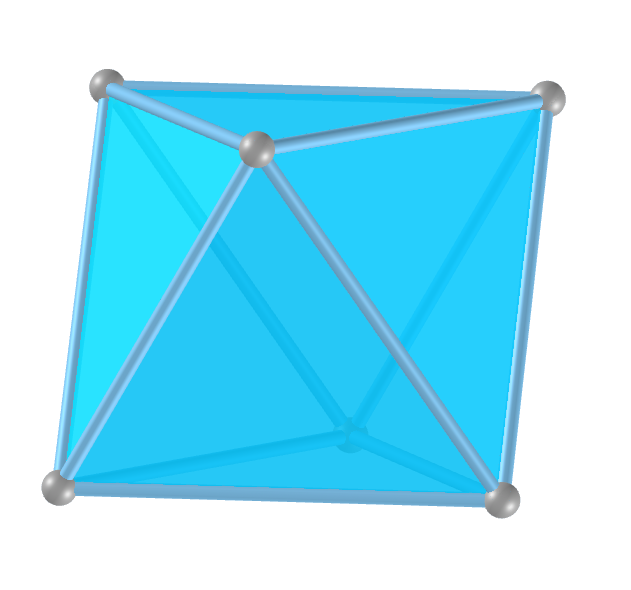
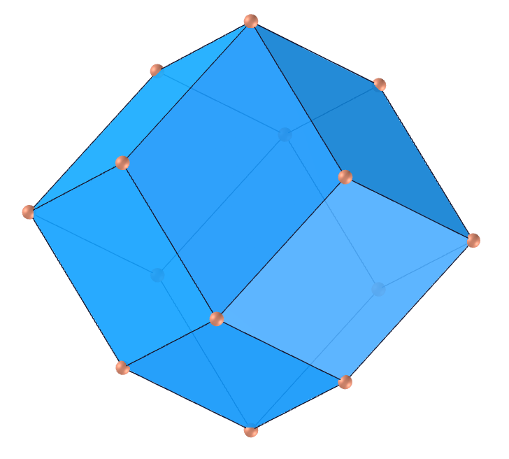
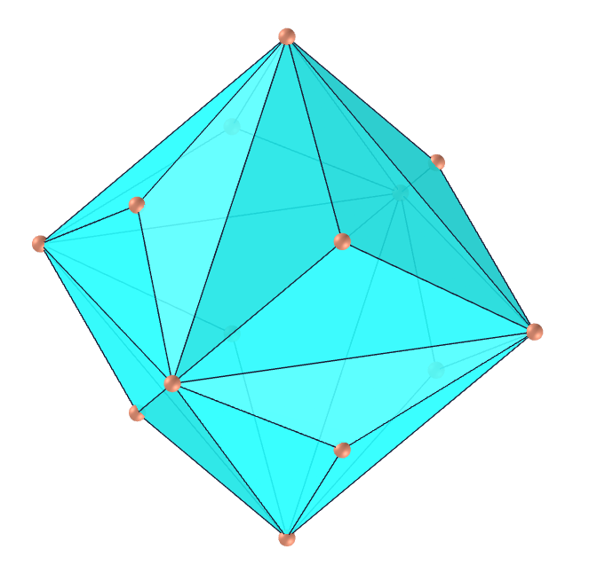
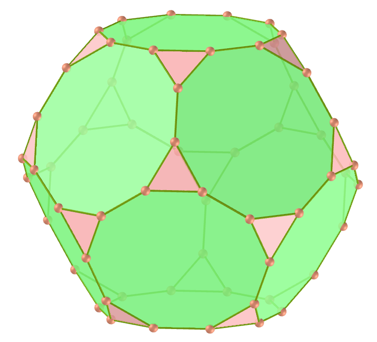
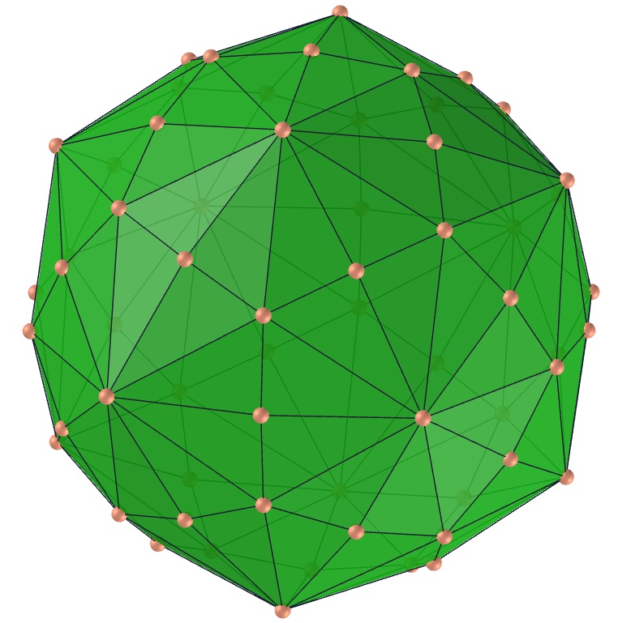

<link rel="stylesheet" href="scripts/style.css">
<link rel="icon" type="image/png" href="../archimedes/vr/salas/imagens/icone.png">
<h2>Visualization of polyhedra with Augmented Reality (AR) and Virtual Reality (VR) in A-frame</h2>
 <b>author:</b> Paulo Henrique Siqueira - Universidade Federal do Paraná
  <b>contact:</b> <a href="#">paulohscwb@gmail.com</a>
  <a href="https://paulohscwb.github.io/polyhedra/pt-br/">versão em português</a>

<h2>List of polyhedra</h2>
<h3 style="text-align:center;">Platonic polyhedra</h3>

<table align="center">
	<tr>
		<th colspan="3">Name</th>
		<th>3D model</th>
		<th>Video</th>
		<th>Dual polyhedron</th>
		<th>Immersive room</th>
	</tr>
	<tr>
		<td></td>
		<td>U1</td>
		<td><a href="../platonic/#m3d" target="_blank">Tetrahedron</a></td>
		<td></td>
		<td></td>
		<td></td>
		<td rowspan="5"></td>
	</tr>
	<tr>
		<td></td>
		<td>U5</td>
		<td><a href="../platonic/#m3d" target="_blank">Octahedron</a></td>
		<td></td>
		<td></td>
		<td rowspan="2"></td>
	</tr>
	<tr>
		<td></td>
		<td>U6</td>
		<td><a href="../platonic/#m3d" target="_blank">Cube</a></td>
		<td></td>
		<td></td>
	</tr>
	<tr>
		<td></td>
		<td>U22</td>
		<td><a href="../platonic/#m3d" target="_blank">Icosahedron</a></td>
		<td></td>
		<td></td>
		<td rowspan="2"></td>
	</tr>
	<tr>
		<td></td>
		<td>U23</td>
		<td><a href="../platonic/#m3d" target="_blank">Dodecahedron</a></td>
		<td></td>
		<td></td>
	</tr>
</table>
<h3 style="text-align:center;">Archimedes and Catalan polyhedra</h3>
<table align="center">
	<tr>
		<th colspan="3">Name</th>
		<th>3D model</th>
		<th>Video</th>
		<th>Dual polyhedron</th>
		<th>Immersive rooms</th>
	</tr>
	<tr>
		<td></td>
		<td>U2</td>
		<td><a href="../archimedes/#m3d" target="_blank">Truncated tetrahedron</a></td>
		<td></td>
		<td></td>
		<td rowspan="2"></td>
		<td rowspan="26">Archimedes 
Catalan  </td>
	</tr>
	<tr>
		<td></td>
		<td></td>
		<td><a href="../catalan/#m3d" target="_blank">Triakis Tetrahedron</a></td>
		<td></td>
		<td></td>
	</tr>
	<tr>
		<td></td>
		<td>U7</td>
		<td><a href="../archimedes/#m3d" target="_blank">Cuboctahedron</a></td>
		<td></td>
		<td></td>
		<td rowspan="2"></td>
	</tr>
	<tr>
		<td></td>
		<td></td>
		<td><a href="../catalan/#m3d" target="_blank">Rhombic Dodecahedron</a></td>
		<td></td>
		<td></td>
	</tr>
	<tr>
		<td></td>
		<td>U8</td>
		<td><a href="../archimedes/#m3d" target="_blank">Truncated octahedron</a></td>
		<td></td>
		<td></td>
		<td rowspan="2"></td>
	</tr>
	<tr>
		<td></td>
		<td></td>
		<td><a href="../catalan/#m3d" target="_blank">Tetrakis Hexahedron</a></td>
		<td></td>
		<td></td>
	</tr>
	<tr>
		<td></td>
		<td>U9</td>
		<td><a href="../archimedes/#m3d" target="_blank">Truncated cube</a></td>
		<td></td>
		<td></td>
		<td rowspan="2"></td>
	</tr>
	<tr>
		<td></td>
		<td></td>
		<td><a href="../catalan/#m3d" target="_blank">Triakis Octahedron</a></td>
		<td></td>
		<td></td>
	</tr>
	<tr>
		<td></td>
		<td>U10</td>
		<td><a href="../archimedes/#m3d" target="_blank">Rhombicuboctahedron</a></td>
		<td></td>
		<td></td>
		<td rowspan="2"></td>
	</tr>
	<tr>
		<td></td>
		<td></td>
		<td><a href="../catalan/#m3d" target="_blank">Deltoidal Icositetrahedron</a></td>
		<td></td>
		<td></td>
	</tr>
	<tr>
		<td></td>
		<td>U11</td>
		<td><a href="../archimedes/#m3d" target="_blank">Truncated cuboctahedron</a></td>
		<td></td>
		<td></td>
		<td rowspan="2"></td>
	</tr>
	<tr>
		<td></td>
		<td></td>
		<td><a href="../catalan/#m3d" target="_blank">Disdyakis Dodecahedron</a></td>
		<td></td>
		<td></td>
	</tr>
	<tr>
		<td></td>
		<td>U12</td>
		<td><a href="../archimedes/#m3d" target="_blank">Snub cube</a></td>
		<td></td>
		<td></td>
		<td rowspan="2"></td>
	</tr>
	<tr>
		<td></td>
		<td></td>
		<td><a href="../catalan/#m3d" target="_blank">Pentagonal Icositetrahedron</a></td>
		<td></td>
		<td></td>
	</tr>
	<tr>
		<td></td>
		<td>U24</td>
		<td><a href="../archimedes/#m3d" target="_blank">Icosidodecahedron</a></td>
		<td></td>
		<td></td>
		<td rowspan="2"></td>
	</tr>
	<tr>
		<td></td>
		<td></td>
		<td><a href="../catalan/#m3d" target="_blank">Rhombic Triacontahedron</a></td>
		<td></td>
		<td></td>
	</tr>
	<tr>
		<td></td>
		<td>U25</td>
		<td><a href="../archimedes/#m3d" target="_blank">Truncated icosahedron</a></td>
		<td></td>
		<td></td>
		<td rowspan="2"></td>
	</tr>
	<tr>
		<td></td>
		<td></td>
		<td><a href="../catalan/#m3d" target="_blank">Pentakis Dodecahedron</a></td>
		<td></td>
		<td></td>
	</tr>
	<tr>
		<td></td>
		<td>U26</td>
		<td><a href="../archimedes/#m3d" target="_blank">Truncated dodecahedron</a></td>
		<td></td>
		<td></td>
		<td rowspan="2"></td>
	</tr>
	<tr>
		<td></td>
		<td></td>
		<td><a href="../catalan/#m3d" target="_blank">Triakis Icosahedron</a></td>
		<td></td>
		<td></td>
	</tr>
	<tr>
		<td></td>
		<td>U27</td>
		<td><a href="../archimedes/#m3d" target="_blank">Rhombicosidodecahedron</a></td>
		<td></td>
		<td></td>
		<td rowspan="2"></td>
	</tr>
	<tr>
		<td></td>
		<td></td>
		<td><a href="../catalan/#m3d" target="_blank">Deltoidal Hexecontahedron</a></td>
		<td></td>
		<td></td>
	</tr>
	<tr>
		<td></td>
		<td>U28</td>
		<td><a href="../archimedes/#m3d" target="_blank">Truncated icosidodecahedron</a></td>
		<td></td>
		<td></td>
		<td rowspan="2"></td>
	</tr>
	<tr>
		<td></td>
		<td></td>
		<td><a href="../catalan/#m3d" target="_blank">Disdyakis Triacontahedron</a></td>
		<td></td>
		<td></td>
	</tr>
	<tr>
		<td></td>
		<td>U29</td>
		<td><a href="../archimedes/#m3d" target="_blank">Snub dodecahedron</a></td>
		<td></td>
		<td></td>
		<td rowspan="2"></td>
	</tr>
	<tr>
		<td></td>
		<td></td>
		<td><a href="../catalan/#m3d" target="_blank">Pentagonal Hexecontahedron</a></td>
		<td></td>
		<td></td>
	</tr>
</table>
<h3 style="margin-top:3px; text-align:center;"> Nonconvex polyhedra</h3>
<h3 style="margin-top:3px; text-align:center;"> Pyramids, tetrahedrons, prisms and antiprisms</h3>
<h3 style="margin-top:3px; text-align:center;"> Self-intersecting polyhedra</h3>
<h3 style="margin-top:3px; text-align:center;"> Quasi regular polyhedra</h3>
<h3 style="margin-top:3px; text-align:center;"> Self-intersecting truncated polyhedra</h3>
<h3 style="margin-top:3px; text-align:center;"> Self-intersecting snub polyhedra</h3>
<h3 style="margin-top:3px; text-align:center;"> Johnson solids</h3>

  Polyhedra: Visualization of polyhedra with Augmented Reality and Virtual Reality by <a xmlns:cc="http://creativecommons.org/ns#" href="https://paulohscwb.github.io/polyhedra/" property="cc:attributionName" rel="cc:attributionURL">Paulo Henrique Siqueira</a> is licensed with a license <a rel="license" href="http://creativecommons.org/licenses/by-nc-nd/4.0/">Creative Commons Attribution-NonCommercial-NoDerivatives 4.0 International</a>.

<h4>How to cite this work:</h4> 

Siqueira, P.H., "Polyhedra: Visualization of polyhedra with Augmented Reality and Virtual Reality". Available in: <https://paulohscwb.github.io/polyhedra/>, September 2019.

 <b>References:</b>
 Weisstein, Eric W. "Archimedean Solid" From MathWorld-A Wolfram Web Resource. <a href="http://mathworld.wolfram.com/ArchimedeanSolid.html" target="_blank">http://mathworld.wolfram.com/ArchimedeanSolid.html</a>
 Weisstein, Eric W. "Platonic Solid" From MathWorld-A Wolfram Web Resource. <a href="http://mathworld.wolfram.com/PlatonicSolid.html" target="_blank">http://mathworld.wolfram.com/PlatonicSolid.html</a>
 Weisstein, Eric W. "Archimedean Dual" From MathWorld-A Wolfram Web Resource. <a href="https://mathworld.wolfram.com/ArchimedeanDual.html" target="_blank">https://mathworld.wolfram.com/ArchimedeanDual.html</a>
 Weisstein, Eric W. "Uniform Polyhedron." From MathWorld--A Wolfram Web Resource. <a href="https://mathworld.wolfram.com/UniformPolyhedron.html" target="_blank">https://mathworld.wolfram.com/UniformPolyhedron.html</a>
 Wikipedia <a href="https://en.wikipedia.org/wiki/Archimedean_solid" target="_blank">https://en.wikipedia.org/wiki/Archimedean_solid</a>
 Wikipedia <a href="https://en.wikipedia.org/wiki/en.wikipedia.org/wiki/Platonic_solid" target="_blank">https://en.wikipedia.org/wiki/Platonic_solid</a>
 McCooey, David I. "Visual Polyhedra". <a href="http://dmccooey.com/polyhedra/" target="_blank">http://dmccooey.com/polyhedra/</a>
