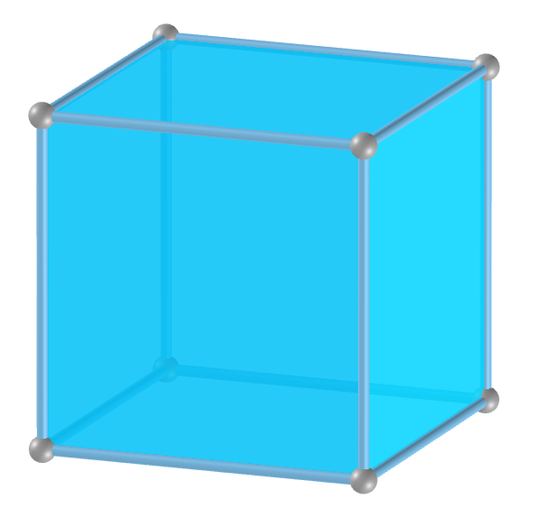
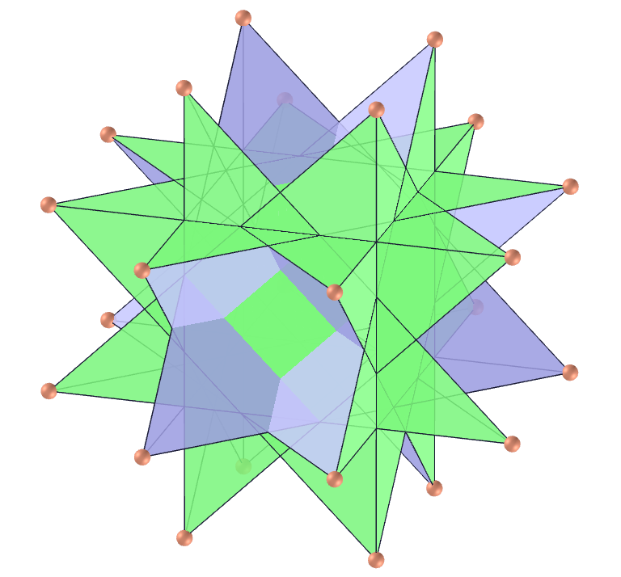

<link rel="stylesheet" href="scripts/style.css">
<link rel="icon" type="image/x-icon" href="archimedes/vr/salas/imagens/icone.ico">
<h2>Visualization of polyhedra with Augmented Reality (AR) and Virtual Reality (VR) in A-frame</h2>
 <b>author:</b> Paulo Henrique Siqueira - Universidade Federal do Paraná
  <b>contact:</b> <a href="#">paulohscwb@gmail.com</a>
  <a href="https://paulohscwb.github.io/polyhedra/pt-br/">versão em português</a>
    Archimedes, Plato, Catalan, Johnson, non-convex, self-intersecting and quasi- regular polyhedra can be seen in Augmented Reality (AR) with the indicated markers, and through the links created in the markers, the 3D model of each polyhedron can be seen in Virtual Reality (VR).
  A <b>uniform polyhedron</b> has regular polygons as faces and is isogonal, that is, it has an isometry that allows the set of its vertices to correspond to each other through symmetry relations. The notation used for the <b>nth</b> uniform polyhedron is <b>Un</b>.

<h2>List of polyhedra</h2>
<h3 style="margin-top:3px; text-align:center;"> Platonic polyhedra</h3>

<table align="center">
	<tr>
		<th></th>
		<th>Name</th>
		<th>Imagem</th>
		<th>3D model</th>
		<th>Video</th>
		<th>Dual polyhedron</th>
		<th>Immersive room</th>
	</tr>
	<tr>
		<td>U1</td>
		<td><a href="../platonic/" target="_blank">Tetrahedron</a></td>
		<td></a></td>
		<td></td>
		<td><a href="https://youtu.be/2hni77KGMnA" target="_blank" alt="video"></td>
		<td></td>
		<td rowspan="5"></td>
	</tr>
	<tr>
		<td>U5</td>
		<td><a href="../platonic/" target="_blank">Octahedron</a></td>
		<td></a></td>
		<td></td>
		<td><a href="https://youtu.be/tUMeAHr-rws" target="_blank"  alt="video"></td>
		<td rowspan="2"></td>
	</tr>
	<tr>
		<td>U6</td>
		<td><a href="../platonic/" target="_blank">Cube</a></td>
		<td></a></td>
		<td></td>
		<td><a href="https://youtu.be/Lfk3YXUl3Ic" target="_blank"  alt="video"></td>
	</tr>
	<tr>
		<td>U22</td>
		<td><a href="../platonic/" target="_blank">Icosahedron</a></td>
		<td></a></td>
		<td></td>
		<td><a href="https://youtu.be/6GYBVIBmRdE" target="_blank" alt="video"></td>
		<td rowspan="2"></td>
	</tr>
	<tr>
		<td>U23</td>
		<td><a href="../platonic/" target="_blank">Dodecahedron</a></td>
		<td></a></td>
		<td></td>
		<td><a href="https://youtu.be/D0MzHlIAsbQ" target="_blank" alt="video"></td>
	</tr>
</table>
<h3 style="margin-top:3px"> Archimedean polyhedra</h3>
<h3 style="margin-top:3px"> Nonconvex polyhedra</h3>
<h3 style="margin-top:3px"> Pyramids, tetrahedrons, prisms and antiprisms</h3>
<h3 style="margin-top:3px"> Self-intersecting polyhedra</h3>
<h3 style="margin-top:3px"> Quasi regular polyhedra</h3>
<h3 style="margin-top:3px"> Self-intersecting truncated polyhedra</h3>
<h3 style="margin-top:3px"> Self-intersecting snub polyhedra</h3>
<h3 style="margin-top:3px"> Johnson solids</h3>

  Polyhedra: Visualization of polyhedra with Augmented Reality and Virtual Reality by <a xmlns:cc="http://creativecommons.org/ns#" href="https://paulohscwb.github.io/polyhedra/" property="cc:attributionName" rel="cc:attributionURL">Paulo Henrique Siqueira</a> is licensed with a license <a rel="license" href="http://creativecommons.org/licenses/by-nc-nd/4.0/">Creative Commons Attribution-NonCommercial-NoDerivatives 4.0 International</a>.

<h4>How to cite this work:</h4> 

Siqueira, P.H., "Polyhedra: Visualization of polyhedra with Augmented Reality and Virtual Reality". Available in: <https://paulohscwb.github.io/polyhedra/>, September 2019.

 <b>References:</b>
 Weisstein, Eric W. "Archimedean Solid" From MathWorld-A Wolfram Web Resource. <a href="http://mathworld.wolfram.com/ArchimedeanSolid.html" target="_blank">http://mathworld.wolfram.com/ArchimedeanSolid.html</a>
 Weisstein, Eric W. "Platonic Solid" From MathWorld-A Wolfram Web Resource. <a href="http://mathworld.wolfram.com/PlatonicSolid.html" target="_blank">http://mathworld.wolfram.com/PlatonicSolid.html</a>
 Weisstein, Eric W. "Archimedean Dual" From MathWorld-A Wolfram Web Resource. <a href="https://mathworld.wolfram.com/ArchimedeanDual.html" target="_blank">https://mathworld.wolfram.com/ArchimedeanDual.html</a>
 Weisstein, Eric W. "Uniform Polyhedron." From MathWorld--A Wolfram Web Resource. <a href="https://mathworld.wolfram.com/UniformPolyhedron.html" target="_blank">https://mathworld.wolfram.com/UniformPolyhedron.html</a>
 Wikipedia <a href="https://en.wikipedia.org/wiki/Archimedean_solid" target="_blank">https://en.wikipedia.org/wiki/Archimedean_solid</a>
 Wikipedia <a href="https://en.wikipedia.org/wiki/en.wikipedia.org/wiki/Platonic_solid" target="_blank">https://en.wikipedia.org/wiki/Platonic_solid</a>
 McCooey, David I. "Visual Polyhedra". <a href="http://dmccooey.com/polyhedra/" target="_blank">http://dmccooey.com/polyhedra/</a>
