<link rel="stylesheet" href="../scripts/style.css">
<link rel="icon" type="image/png" href="../archimedes/vr/salas/imagens/icone.png">
<h2>Visualization of polyhedra with Augmented Reality (AR) and Virtual Reality (VR) in A-frame</h2>
 <b>author:</b> Paulo Henrique Siqueira - Universidade Federal do Paraná
  <b>contact:</b> <a href="#">paulohscwb@gmail.com</a>
  <a href="https://paulohscwb.github.io/polyhedra/pt-br/">versão em português</a>

<h2>List of polyhedra</h2>
<h3 style="text-align:center;">Platonic polyhedra</h3>

<table align="center">
	<tr>
		<th colspan="2">Name</th>
		<th>3D model</th>
		<th>Video</th>
		<th>Dual</th>
		<th>Immersive room</th>
	</tr>
	<tr>
		<td>U1</td>
		<td class="titulo1"><a href="../platonic/#m3d" target="_blank"> Tetrahedron</a></td>
		<td></td>
		<td></td>
		<td></td>
		<td rowspan="5"></td>
	</tr>
	<tr>
		<td>U5</td>
		<td class="titulo1"><a href="../platonic/#m3d" target="_blank"> Octahedron</a></td>
		<td></td>
		<td></td>
		<td rowspan="2"></td>
	</tr>
	<tr>
		<td>U6</td>
		<td class="titulo1"><a href="../platonic/#m3d" target="_blank"> Cube</a></td>
		<td></td>
		<td></td>
	</tr>
	<tr>
		<td>U22</td>
		<td class="titulo1"><a href="../platonic/#m3d" target="_blank"> Icosahedron</a></td>
		<td></td>
		<td></td>
		<td rowspan="2"></td>
	</tr>
	<tr>
		<td>U23</td>
		<td class="titulo1"><a href="../platonic/#m3d" target="_blank">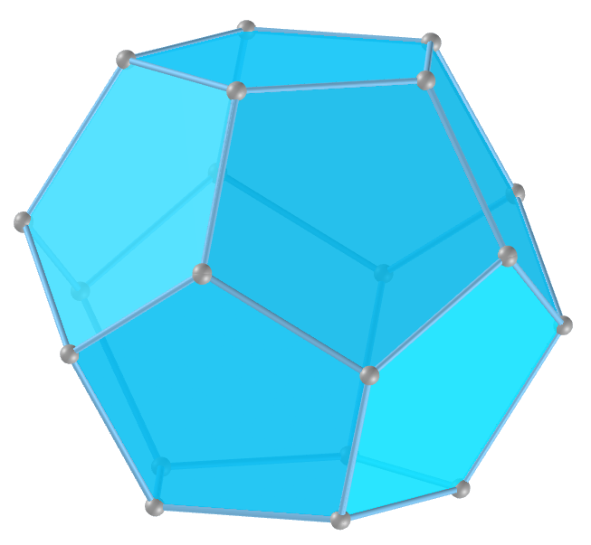 Dodecahedron</a></td>
		<td></td>
		<td></td>
	</tr>
</table>
<h3 style="text-align:center;">Archimedes and Catalan polyhedra</h3>
<table align="center">
	<tr>
		<th colspan="2">Name</th>
		<th>3D model</th>
		<th>Video</th>
		<th>Dual</th>
		<th>Immersive rooms</th>
	</tr>
	<tr>
		<td>U2</td>
		<td class="titulo1"><a href="../archimedes/#m3d" target="_blank">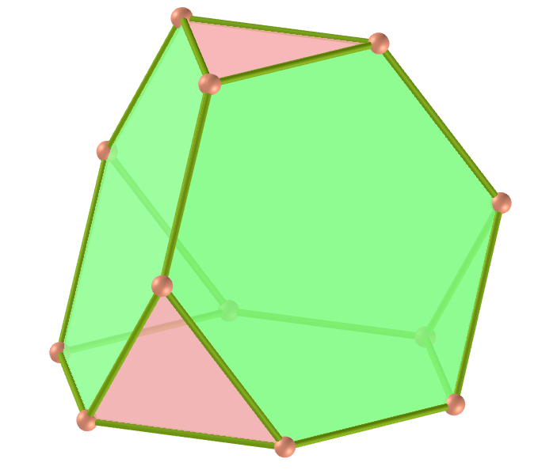 Truncated tetrahedron</a></td>
		<td></td>
		<td></td>
		<td rowspan="2"></td>
		<td rowspan="26">Archimedes 
Catalan  </td>
	</tr>
	<tr>
		<td></td>
		<td class="titulo1"><a href="../catalan/#m3d" target="_blank"> Triakis Tetrahedron</a></td>
		<td></td>
		<td></td>
	</tr>
	<tr>
		<td>U7</td>
		<td class="titulo1"><a href="../archimedes/#m3d" target="_blank"> Cuboctahedron</a></td>
		<td></td>
		<td></td>
		<td rowspan="2"></td>
	</tr>
	<tr>
		<td></td>
		<td class="titulo1"><a href="../catalan/#m3d" target="_blank"> Rhombic Dodecahedron</a></td>
		<td></td>
		<td></td>
	</tr>
	<tr>
		<td>U8</td>
		<td class="titulo1"><a href="../archimedes/#m3d" target="_blank">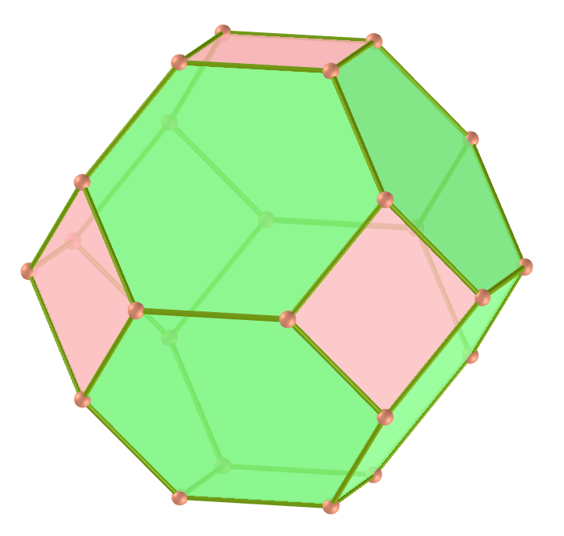 Truncated octahedron</a></td>
		<td></td>
		<td></td>
		<td rowspan="2"></td>
	</tr>
	<tr>
		<td></td>
		<td class="titulo1"><a href="../catalan/#m3d" target="_blank"> Tetrakis Hexahedron</a></td>
		<td></td>
		<td></td>
	</tr>
	<tr>
		<td>U9</td>
		<td class="titulo1"><a href="../archimedes/#m3d" target="_blank">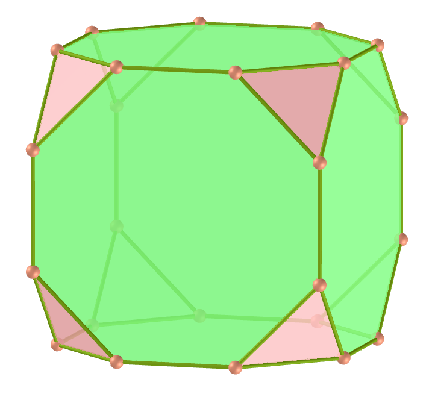 Truncated cube</a></td>
		<td></td>
		<td></td>
		<td rowspan="2"></td>
	</tr>
	<tr>
		<td></td>
		<td class="titulo1"><a href="../catalan/#m3d" target="_blank"> Triakis Octahedron</a></td>
		<td></td>
		<td></td>
	</tr>
	<tr>
		<td>U10</td>
		<td class="titulo1"><a href="../archimedes/#m3d" target="_blank"> Rhombicuboctahedron</a></td>
		<td></td>
		<td></td>
		<td rowspan="2"></td>
	</tr>
	<tr>
		<td></td>
		<td class="titulo1"><a href="../catalan/#m3d" target="_blank"> Deltoidal Icositetrahedron</a></td>
		<td></td>
		<td></td>
	</tr>
	<tr>
		<td>U11</td>
		<td class="titulo1"><a href="../archimedes/#m3d" target="_blank"> Truncated cuboctahedron</a></td>
		<td></td>
		<td></td>
		<td rowspan="2"></td>
	</tr>
	<tr>
		<td></td>
		<td class="titulo1"><a href="../catalan/#m3d" target="_blank">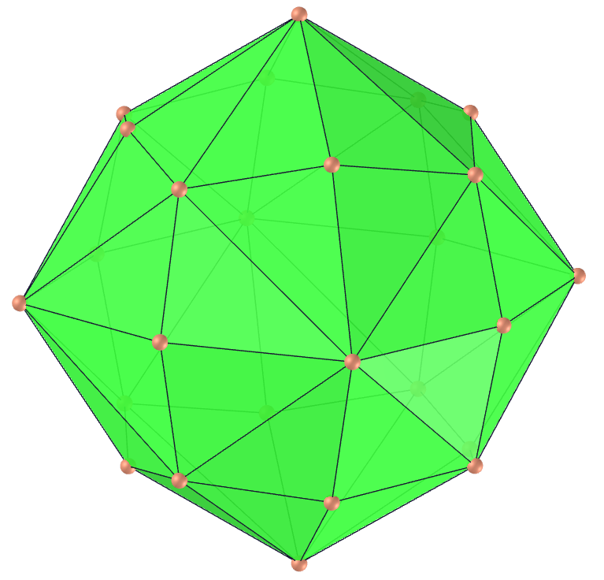 Disdyakis Dodecahedron</a></td>
		<td></td>
		<td></td>
	</tr>
	<tr>
		<td>U12</td>
		<td class="titulo1"><a href="../archimedes/#m3d" target="_blank">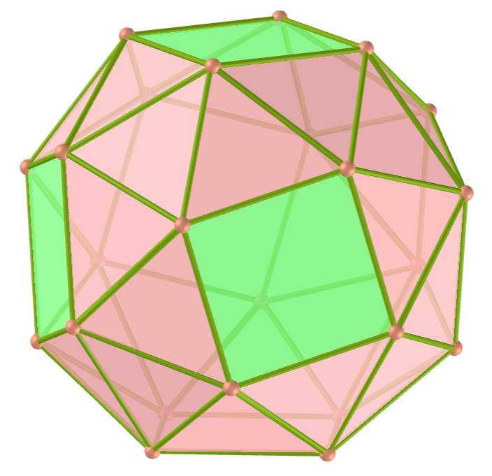 Snub cube</a></td>
		<td></td>
		<td></td>
		<td rowspan="2"></td>
	</tr>
	<tr>
		<td></td>
		<td class="titulo1"><a href="../catalan/#m3d" target="_blank"> Pentagonal Icositetrahedron</a></td>
		<td></td>
		<td></td>
	</tr>
	<tr>
		<td>U24</td>
		<td class="titulo1"><a href="../archimedes/#m3d" target="_blank">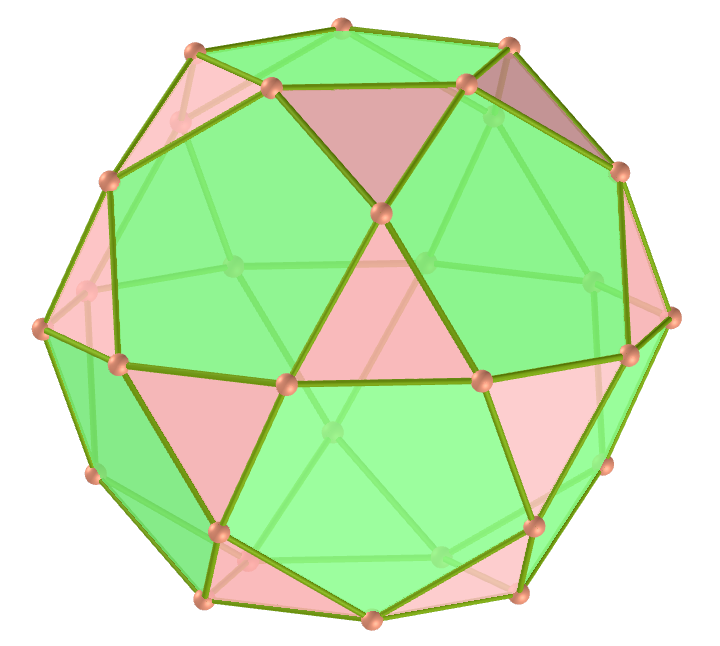 Icosidodecahedron</a></td>
		<td></td>
		<td></td>
		<td rowspan="2"></td>
	</tr>
	<tr>
		<td></td>
		<td class="titulo1"><a href="../catalan/#m3d" target="_blank"> Rhombic Triacontahedron</a></td>
		<td></td>
		<td></td>
	</tr>
	<tr>
		<td>U25</td>
		<td class="titulo1"><a href="../archimedes/#m3d" target="_blank"> Truncated icosahedron</a></td>
		<td></td>
		<td></td>
		<td rowspan="2"></td>
	</tr>
	<tr>
		<td></td>
		<td class="titulo1"><a href="../catalan/#m3d" target="_blank"> Pentakis Dodecahedron</a></td>
		<td></td>
		<td></td>
	</tr>
	<tr>
		<td>U26</td>
		<td class="titulo1"><a href="../archimedes/#m3d" target="_blank"> Truncated dodecahedron</a></td>
		<td></td>
		<td></td>
		<td rowspan="2"></td>
	</tr>
	<tr>
		<td></td>
		<td class="titulo1"><a href="../catalan/#m3d" target="_blank"> Triakis Icosahedron</a></td>
		<td></td>
		<td></td>
	</tr>
	<tr>
		<td>U27</td>
		<td class="titulo1"><a href="../archimedes/#m3d" target="_blank"> Rhombicosidodecahedron</a></td>
		<td></td>
		<td></td>
		<td rowspan="2"></td>
	</tr>
	<tr>
		<td></td>
		<td class="titulo1"><a href="../catalan/#m3d" target="_blank">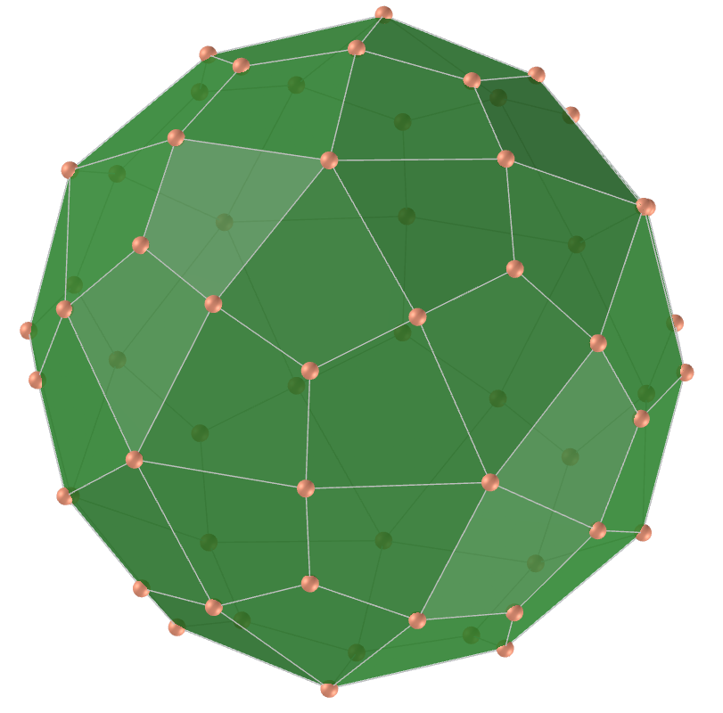 Deltoidal Hexecontahedron</a></td>
		<td></td>
		<td></td>
	</tr>
	<tr>
		<td>U28</td>
		<td class="titulo1"><a href="../archimedes/#m3d" target="_blank"> Truncated icosidodecahedron</a></td>
		<td></td>
		<td></td>
		<td rowspan="2"></td>
	</tr>
	<tr>
		<td></td>
		<td class="titulo1"><a href="../catalan/#m3d" target="_blank"> Disdyakis Triacontahedron</a></td>
		<td></td>
		<td></td>
	</tr>
	<tr>
		<td>U29</td>
		<td class="titulo1"><a href="../archimedes/#m3d" target="_blank">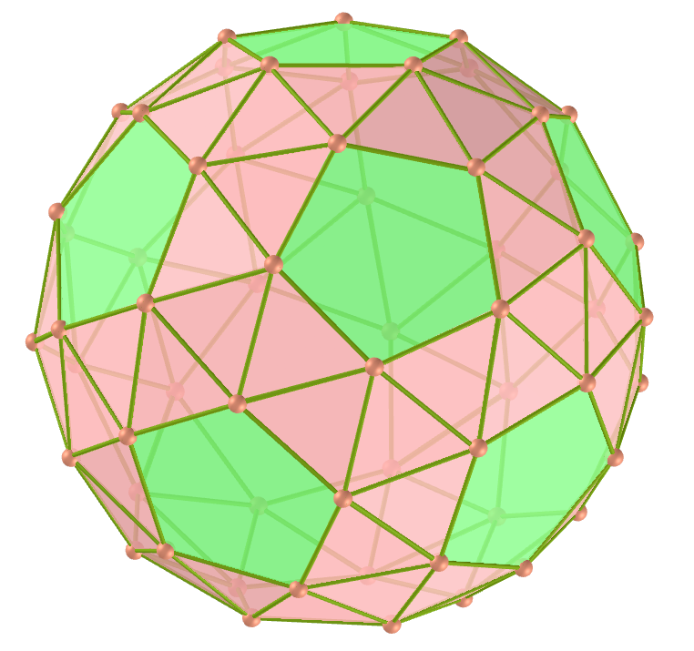 Snub dodecahedron</a></td>
		<td></td>
		<td></td>
		<td rowspan="2"></td>
	</tr>
	<tr>
		<td></td>
		<td class="titulo1"><a href="../catalan/#m3d" target="_blank"> Pentagonal Hexecontahedron</a></td>
		<td></td>
		<td></td>
	</tr>
</table>
<h3 style="text-align:center;">Nonconvex polyhedra</h3>
<table align="center">
	<tr>
		<th colspan="2">Name</th>
		<th>3D model</th>
		<th>Video</th>
		<th>Immersive rooms</th>
	</tr>
	<tr>
		<td>U3</td>
		<td class="titulo1"><a href="../nonconvex/#m3d" target="_blank"> Octahemioctahedron</a></td>
		<td></td>
		<td></td>
		<td></td>
	</tr>
	<tr>
		<td></td>
		<td class="titulo1"><a href="../infinity/#m3d" target="_blank"> Octahemioctacron</a></td>
		<td></td>
		<td></td>
		<td></td>
	</tr>
	<tr>
		<td>U4</td>
		<td class="titulo1"><a href="../nonconvex/#m3d" target="_blank">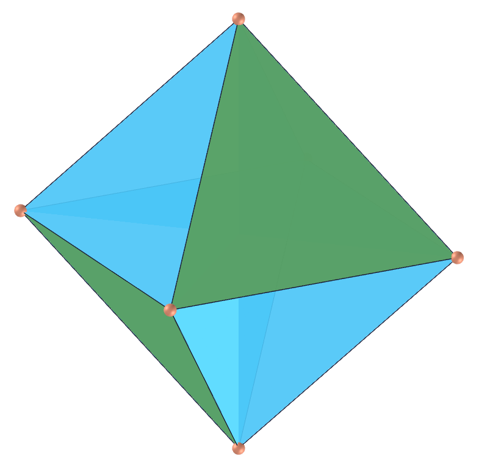 Tetrahemihexahedron</a></td>
		<td></td>
		<td></td>
		<td></td>
	</tr>
	<tr>
		<td></td>
		<td class="titulo1"><a href="../infinity/#m3d" target="_blank"> Tetrahemihexacron</a></td>
		<td></td>
		<td></td>
		<td></td>
	</tr>
	<tr>
		<td>U15</td>
		<td class="titulo1"><a href="../nonconvex/#m3d" target="_blank"> Cubohemioctahedron</a></td>
		<td></td>
		<td></td>
		<td></td>
	</tr>
	<tr>
		<td></td>
		<td class="titulo1"><a href="../infinity/#m3d" target="_blank"> Hexahemioctacron</a></td>
		<td></td>
		<td></td>
		<td></td>
	</tr>
	<tr>
		<td>U34</td>
		<td class="titulo1"><a href="../nonconvex/#m3d" target="_blank">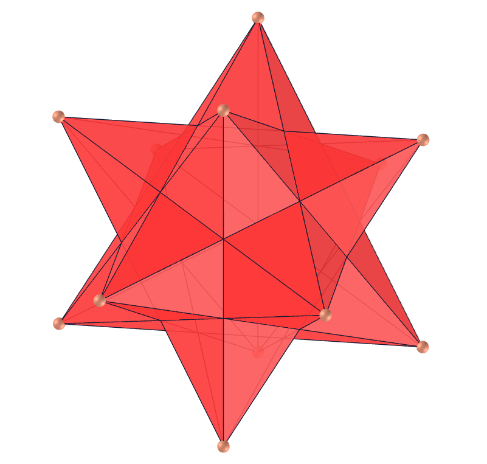 Small Stellated Dodecahedron</a></td>
		<td></td>
		<td></td>
		<td rowspan="2"></td>
	</tr>
	<tr>
		<td>U35</td>
		<td class="titulo1"><a href="../nonconvex/#m3d" target="_blank"> Great Dodecahedron</a></td>
		<td></td>
		<td></td>
	</tr>
	<tr>
		<td>U49</td>
		<td class="titulo1"><a href="../nonconvex/#m3d" target="_blank"> Small Icosihemidodecahedron</a></td>
		<td></td>
		<td></td>
		<td></td>
	</tr>
	<tr>
		<td></td>
		<td class="titulo1"><a href="../infinity/#m3d" target="_blank"> Small icosihemidodecacron</a></td>
		<td></td>
		<td></td>
		<td></td>
	</tr>
	<tr>
		<td>U51</td>
		<td class="titulo1"><a href="../nonconvex/#m3d" target="_blank"> Small Dodecahemidodecahedron</a></td>
		<td></td>
		<td></td>
		<td></td>
	</tr>
	<tr>
		<td></td>
		<td class="titulo1"><a href="../infinity/#m3d" target="_blank">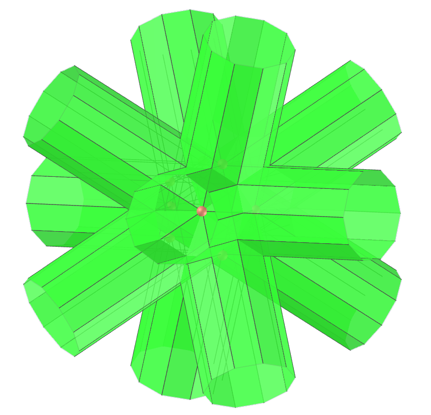 Small dodecahemidodecacron</a></td>
		<td></td>
		<td></td>
		<td></td>
	</tr>
	<tr>
		<td>U52</td>
		<td class="titulo1"><a href="../nonconvex/#m3d" target="_blank">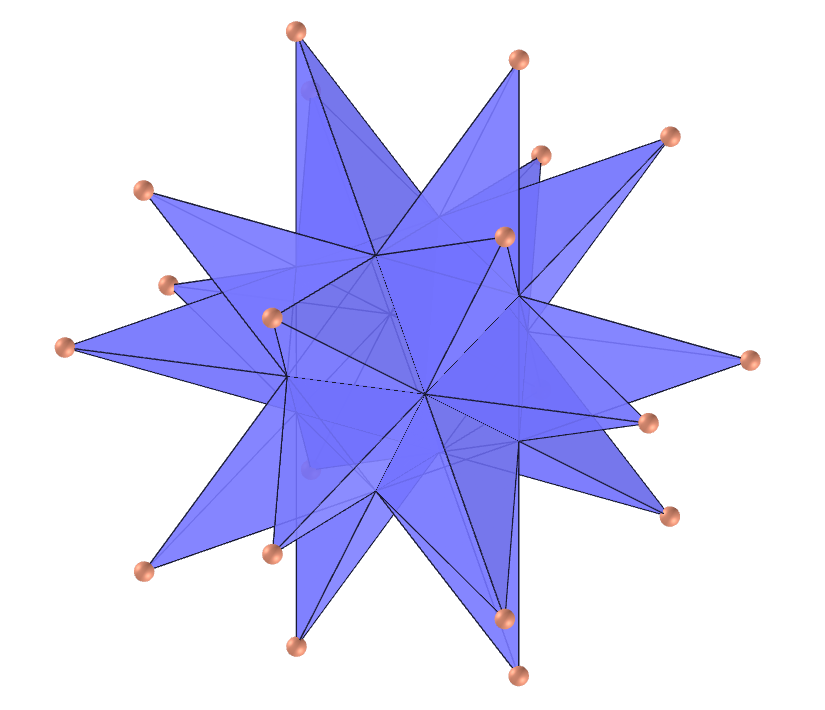 Great Stellated Dodecahedron</a></td>
		<td></td>
		<td></td>
		<td rowspan="2"></td>
	</tr>
	<tr>
		<td>U53</td>
		<td class="titulo1"><a href="../nonconvex/#m3d" target="_blank"> Great Icosahedron</a></td>
		<td></td>
		<td></td>
	</tr>
	<tr>
		<td>U62</td>
		<td class="titulo1"><a href="../nonconvex/#m3d" target="_blank"> Small Dodecahemicosahedron</a></td>
		<td></td>
		<td></td>
		<td></td>
	</tr>
	<tr>
		<td></td>
		<td class="titulo1"><a href="../infinity/#m3d" target="_blank"> Small dodecahemicosacron</a></td>
		<td></td>
		<td></td>
		<td></td>
	</tr>
	<tr>
		<td>U65</td>
		<td class="titulo1"><a href="../nonconvex/#m3d" target="_blank"> Great Dodecahemicosahedron</a></td>
		<td></td>
		<td></td>
		<td></td>
	</tr>
	<tr>
		<td></td>
		<td class="titulo1"><a href="../infinity/#m3d" target="_blank"> Great dodecahemicosacron</a></td>
		<td></td>
		<td></td>
		<td></td>
	</tr>
	<tr>
		<td>U70</td>
		<td class="titulo1"><a href="../nonconvex/#m3d" target="_blank"> Great Dodecahemidodecahedron</a></td>
		<td></td>
		<td></td>
		<td></td>
	</tr>
	<tr>
		<td></td>
		<td class="titulo1"><a href="../infinity/#m3d" target="_blank"> Great dodecahemidodecacron</a></td>
		<td></td>
		<td></td>
		<td></td>
	</tr>
	<tr>
		<td>U71</td>
		<td class="titulo1"><a href="../nonconvex/#m3d" target="_blank"> Great Icosihemidodecahedron</a></td>
		<td></td>
		<td></td>
		<td></td>
	</tr>
	<tr>
		<td></td>
		<td class="titulo1"><a href="../infinity/#m3d" target="_blank"> Great icosihemidodecacron</a></td>
		<td></td>
		<td></td>
		<td></td>
	</tr>
	<tr>
		<td></td>
		<td class="titulo1"><a href="../nonconvex/#m3d" target="_blank">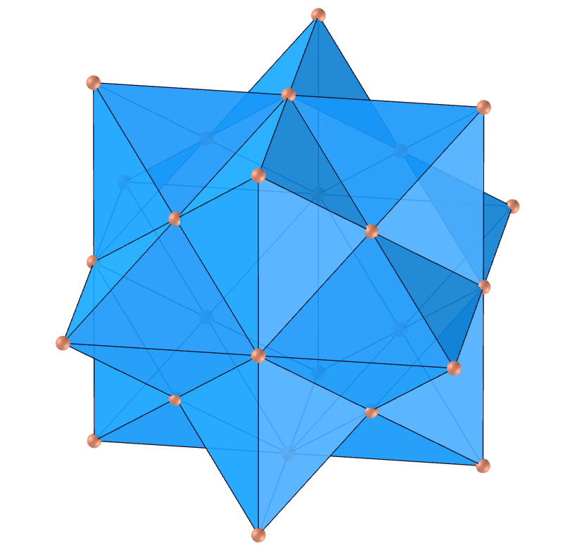 Escher's Solid</a></td>
		<td></td>
		<td></td>
		<td rowspan="6"></td>
	</tr>
	<tr>
		<td></td>
		<td class="titulo1"><a href="../nonconvex/#m3d" target="_blank">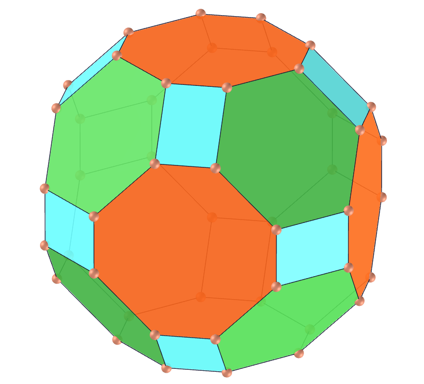 Escher's Solid Dual</a></td>
		<td></td>
		<td></td>
	</tr>
	<tr>
		<td></td>
		<td class="titulo1"><a href="../nonconvex/#m3d" target="_blank"> Stella Octangula</a></td>
		<td></td>
		<td></td>
	</tr>
	<tr>
		<td></td>
		<td class="titulo1"><a href="../nonconvex/#m3d" target="_blank">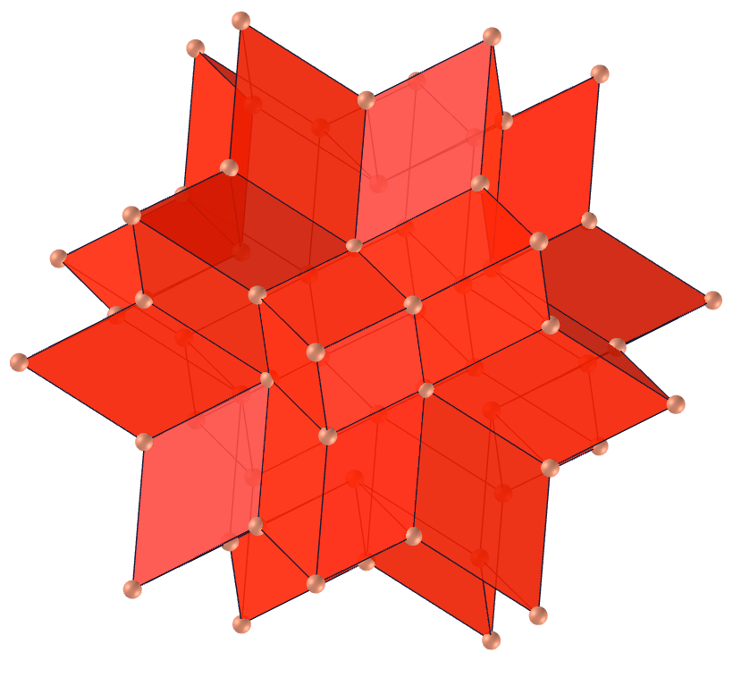 Rhombic Hexecontahedron</a></td>
		<td></td>
		<td></td>
	</tr>
	<tr>
		<td></td>
		<td class="titulo1"><a href="../nonconvex/#m3d" target="_blank"> Concave Dodecahedron</a></td>
		<td></td>
		<td></td>
	</tr>
	<tr>
		<td></td>
		<td class="titulo1"><a href="../nonconvex/#m3d" target="_blank"> Jessen's Orthogonal Icosahedron</a></td>
		<td></td>
		<td></td>
	</tr>
	<tr>
		<td></td>
		<td class="titulo1"><a href="../nonconvex/#m3d" target="_blank"> Möbius Deltahedron - 24 faces</a></td>
		<td></td>
		<td></td>
		<td rowspan="7"></td>
	</tr>
	<tr>
		<td></td>
		<td class="titulo1"><a href="../nonconvex/#m3d" target="_blank">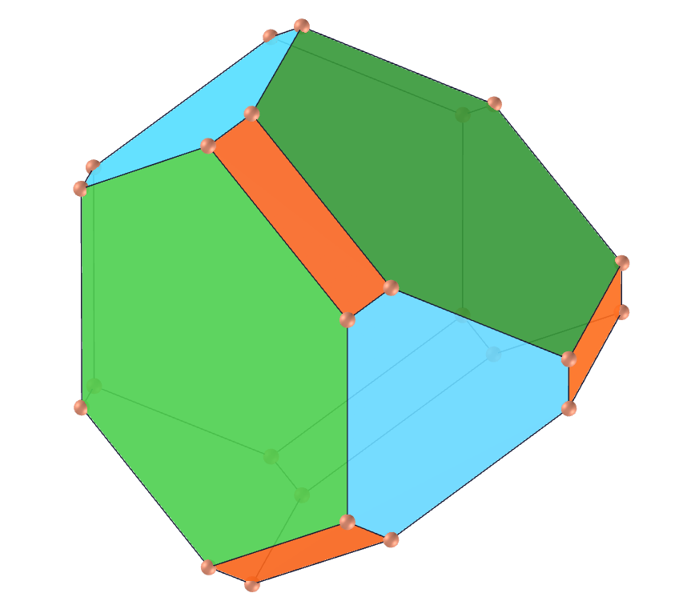 Möbius Deltahedron dual</a></td>
		<td></td>
		<td></td>
	</tr>
	<tr>
		<td></td>
		<td class="titulo1"><a href="../nonconvex/#m3d" target="_blank">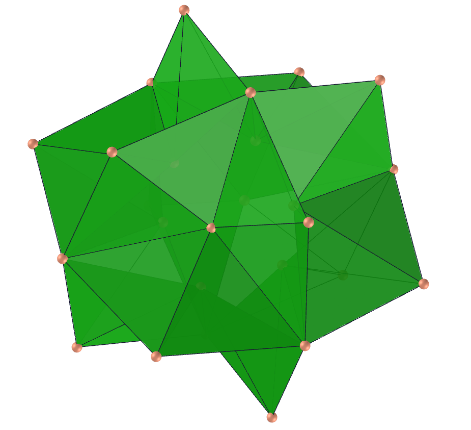 Möbius Octakis Hexahedron</a></td>
		<td></td>
		<td></td>
	</tr>
	<tr>
		<td></td>
		<td class="titulo1"><a href="../nonconvex/#m3d" target="_blank"> Möbius Octakis Hexahedron dual</a></td>
		<td></td>
		<td></td>
	</tr>
	<tr>
		<td></td>
		<td class="titulo1"><a href="../nonconvex/#m3d" target="_blank"> Möbius Hexakis Octahedron</a></td>
		<td></td>
		<td></td>
	</tr>
	<tr>
		<td></td>
		<td class="titulo1"><a href="../nonconvex/#m3d" target="_blank"> Möbius Hexakis Icosahedron</a></td>
		<td></td>
		<td></td>
	</tr>
	<tr>
		<td></td>
		<td class="titulo1"><a href="../nonconvex/#m3d" target="_blank"> Möbius 10-akis Dodecahedron</a></td>
		<td></td>
		<td></td>
	</tr>
</table>
<h3 style="text-align:center;">Pyramids, tetrahedrons, prisms and antiprisms</h3>
<table>	
	<tr>
		<th colspan="2">Name</th>
		<th>3D model</th>
		<th>Video</th>
		<th>Immersive rooms</th>
	</tr>
	<tr>
		<td>U76</td>
		<td class="titulo1"><a href="../polyhedron/#m3d" target="_blank"> Prism</a></td>
		<td></td>
		<td></td>
		<td rowspan="13"></td>
	</tr>
	<tr>
		<td>U77</td>
		<td class="titulo1"><a href="../polyhedron/#m3d" target="_blank"> Antiprism</a></td>
		<td></td>
		<td></td>
	</tr>
	<tr>
		<td>U78</td>
		<td class="titulo1"><a href="../polyhedron/#m3d" target="_blank">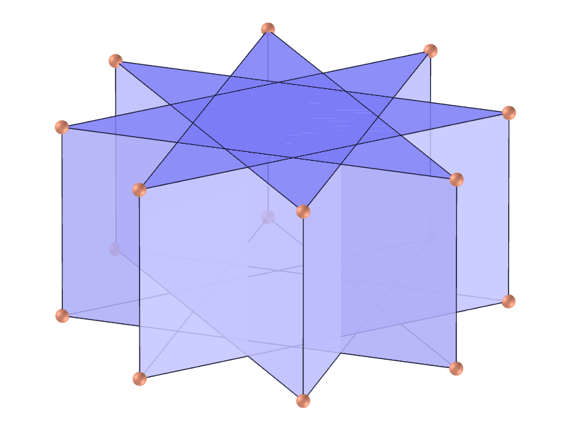 Stellated Prism</a></td>
		<td></td>
		<td></td>
	</tr>
	<tr>
		<td>U79</td>
		<td class="titulo1"><a href="../polyhedron/#m3d" target="_blank"> Stellated Antiprism</a></td>
		<td></td>
		<td></td>
	</tr>
	<tr>
		<td>U80</td>
		<td class="titulo1"><a href="../polyhedron/#m3d" target="_blank"> Stellated Crossed Antiprism</a></td>
		<td></td>
		<td></td>
	</tr>
	<tr>
		<td></td>
		<td class="titulo1"><a href="../polyhedron/#m3d" target="_blank"> Pyramid</a></td>
		<td></td>
		<td></td>
	</tr>
	<tr>
		<td></td>
		<td class="titulo1"><a href="../polyhedron/#m3d" target="_blank"> Stellated Pyramid</a></td>
		<td></td>
		<td></td>
	</tr>
	<tr>
		<td></td>
		<td class="titulo1"><a href="../polyhedron/#m3d" target="_blank"> Dipyramid</a></td>
		<td></td>
		<td></td>
	</tr>
	<tr>
		<td></td>
		<td class="titulo1"><a href="../polyhedron/#m3d" target="_blank"> Stellated Dipyramid</a></td>
		<td></td>
		<td></td>
	</tr>
	<tr>
		<td></td>
		<td class="titulo1"><a href="../polyhedron/#m3d" target="_blank">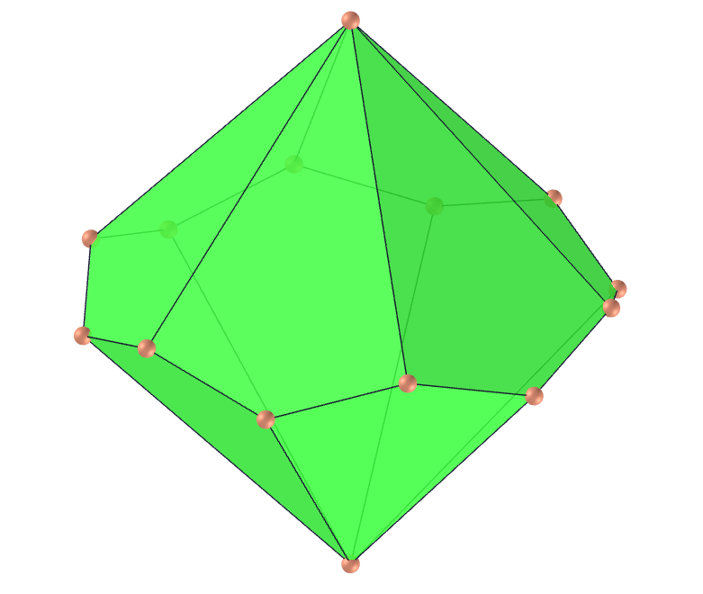 Trapezohedron</a></td>
		<td></td>
		<td></td>
	</tr>
	<tr>
		<td></td>
		<td class="titulo1"><a href="../polyhedron/#m3d" target="_blank"> Stellated Trapezohedron</a></td>
		<td></td>
		<td></td>
	</tr>
	<tr>
		<td></td>
		<td class="titulo1"><a href="../polyhedron/#m3d" target="_blank"> Stellated Concave Trapezohedron</a></td>
		<td></td>
		<td></td>
	</tr>
	<tr>
		<td></td>
		<td class="titulo1"><a href="../polyhedron/#m3d" target="_blank"> Isosceles tetrahedron</a></td>
		<td></td>
		<td></td>
	</tr>
	<tr>
		<td></td>
		<td class="titulo1"><a href="../polyhedron/#m3d" target="_blank">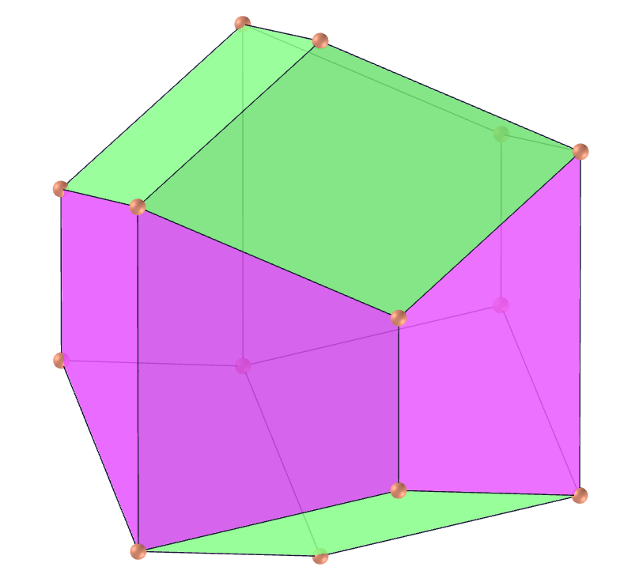 Trapezo-rhombic Dodecahedron</a></td>
		<td></td>
		<td></td>
		<td rowspan="13"></td>
	</tr>
	<tr>
		<td></td>
		<td class="titulo1"><a href="../polyhedron/#m3d" target="_blank"> Octahedral Pentagonal Dodecahedron</a></td>
		<td></td>
		<td></td>
	</tr>
	<tr>
		<td></td>
		<td class="titulo1"><a href="../polyhedron/#m3d" target="_blank"> Concave Dyakis Dodecahedron</a></td>
		<td></td>
		<td></td>
	</tr>
	<tr>
		<td></td>
		<td class="titulo1"><a href="../polyhedron/#m3d" target="_blank"> Dyakis Dodecahedron</a></td>
		<td></td>
		<td></td>
	</tr>
	<tr>
		<td></td>
		<td class="titulo1"><a href="../polyhedron/#m3d" target="_blank">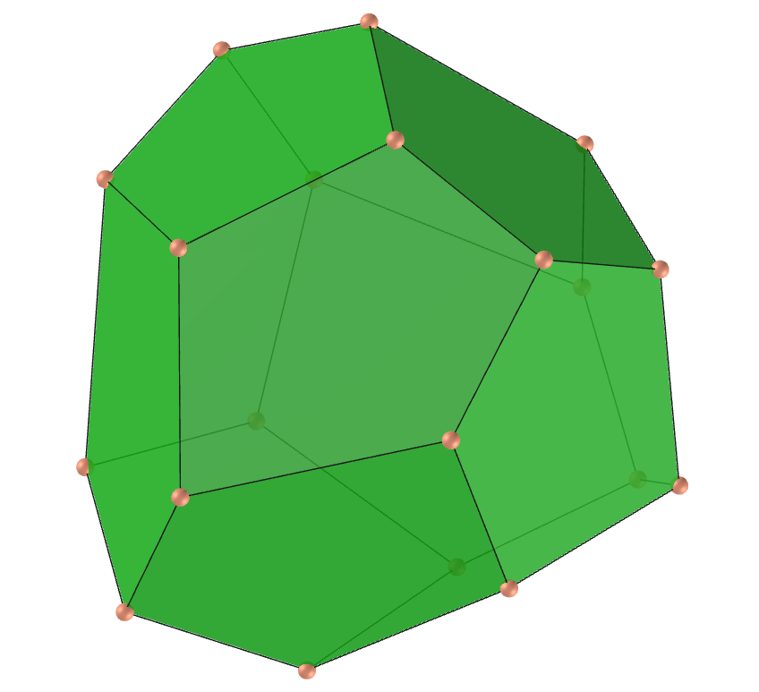 Tetragonal Pentagonal Dodecahedron</a></td>
		<td></td>
		<td></td>
	</tr>
	<tr>
		<td></td>
		<td class="titulo1"><a href="../polyhedron/#m3d" target="_blank"> Hexakis Tetrahedron</a></td>
		<td></td>
		<td></td>
	</tr>
	<tr>
		<td></td>
		<td class="titulo1"><a href="../polyhedron/#m3d" target="_blank">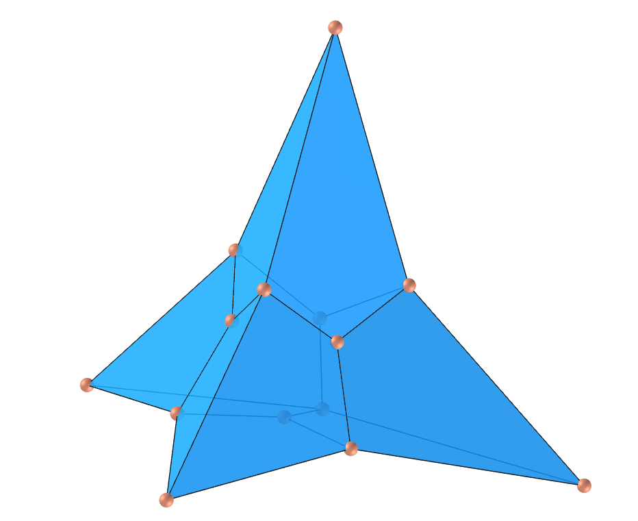 Trapezohedral Tristetrahedron</a></td>
		<td></td>
		<td></td>
	</tr>
	<tr>
		<td></td>
		<td class="titulo1"><a href="../polyhedron/#m3d" target="_blank">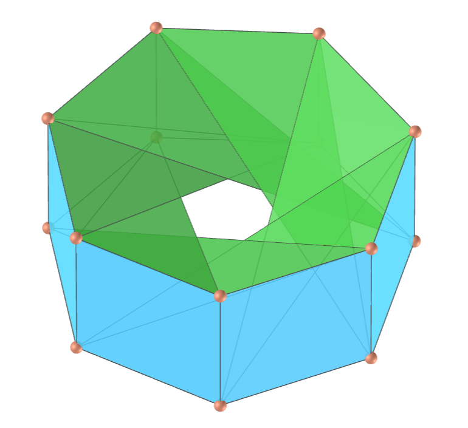 Iris Toroid</a></td>
		<td></td>
		<td></td>
	</tr>
	<tr>
		<td></td>
		<td class="titulo1"><a href="../polyhedron/#m3d" target="_blank"> Iris Antitoroid</a></td>
		<td></td>
		<td></td>
	</tr>
	<tr>
		<td></td>
		<td class="titulo1"><a href="../polyhedron/#m3d" target="_blank"> Rhombic enneacontahedron</a></td>
		<td></td>
		<td></td>
	</tr>
	<tr>
		<td></td>
		<td class="titulo1"><a href="../polyhedron/#m3d" target="_blank"> Goddard-Henning enneahedron</a></td>
		<td></td>
		<td></td>
	</tr>
	<tr>
		<td></td>
		<td class="titulo1"><a href="../polyhedron/#m3d" target="_blank"> Herschel enneahedron</a></td>
		<td></td>
		<td></td>
	</tr>
	<tr>
		<td></td>
		<td class="titulo1"><a href="../polyhedron/#m3d" target="_blank"> Parallelepiped</a></td>
		<td></td>
		<td></td>
	</tr>
</table>
<h3 style="text-align:center;">Self-intersecting polyhedra</h3>
<h3 style="text-align:center;">Quasi regular polyhedra</h3>
<h3 style="text-align:center;">Self-intersecting truncated polyhedra</h3>
<h3 style="text-align:center;">Self-intersecting snub polyhedra</h3>
<h3 style="text-align:center;">Johnson solids</h3>

  Polyhedra: Visualization of polyhedra with Augmented Reality and Virtual Reality by <a xmlns:cc="http://creativecommons.org/ns#" href="https://paulohscwb.github.io/polyhedra/" property="cc:attributionName" rel="cc:attributionURL">Paulo Henrique Siqueira</a> is licensed with a license <a rel="license" href="http://creativecommons.org/licenses/by-nc-nd/4.0/">Creative Commons Attribution-NonCommercial-NoDerivatives 4.0 International</a>.

<h4>How to cite this work:</h4> 

Siqueira, P.H., "Polyhedra: Visualization of polyhedra with Augmented Reality and Virtual Reality". Available in: <https://paulohscwb.github.io/polyhedra/>, September 2019.

 <b>References:</b>
 Weisstein, Eric W. "Archimedean Solid" From MathWorld-A Wolfram Web Resource. <a href="http://mathworld.wolfram.com/ArchimedeanSolid.html" target="_blank">http://mathworld.wolfram.com/ArchimedeanSolid.html</a>
 Weisstein, Eric W. "Platonic Solid" From MathWorld-A Wolfram Web Resource. <a href="http://mathworld.wolfram.com/PlatonicSolid.html" target="_blank">http://mathworld.wolfram.com/PlatonicSolid.html</a>
 Weisstein, Eric W. "Archimedean Dual" From MathWorld-A Wolfram Web Resource. <a href="https://mathworld.wolfram.com/ArchimedeanDual.html" target="_blank">https://mathworld.wolfram.com/ArchimedeanDual.html</a>
 Weisstein, Eric W. "Uniform Polyhedron." From MathWorld--A Wolfram Web Resource. <a href="https://mathworld.wolfram.com/UniformPolyhedron.html" target="_blank">https://mathworld.wolfram.com/UniformPolyhedron.html</a>
 Wikipedia <a href="https://en.wikipedia.org/wiki/Archimedean_solid" target="_blank">https://en.wikipedia.org/wiki/Archimedean_solid</a>
 Wikipedia <a href="https://en.wikipedia.org/wiki/en.wikipedia.org/wiki/Platonic_solid" target="_blank">https://en.wikipedia.org/wiki/Platonic_solid</a>
 McCooey, David I. "Visual Polyhedra". <a href="http://dmccooey.com/polyhedra/" target="_blank">http://dmccooey.com/polyhedra/</a>
