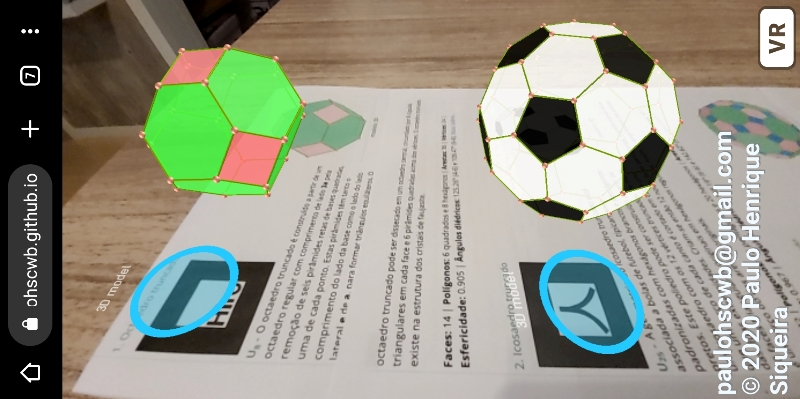
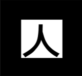
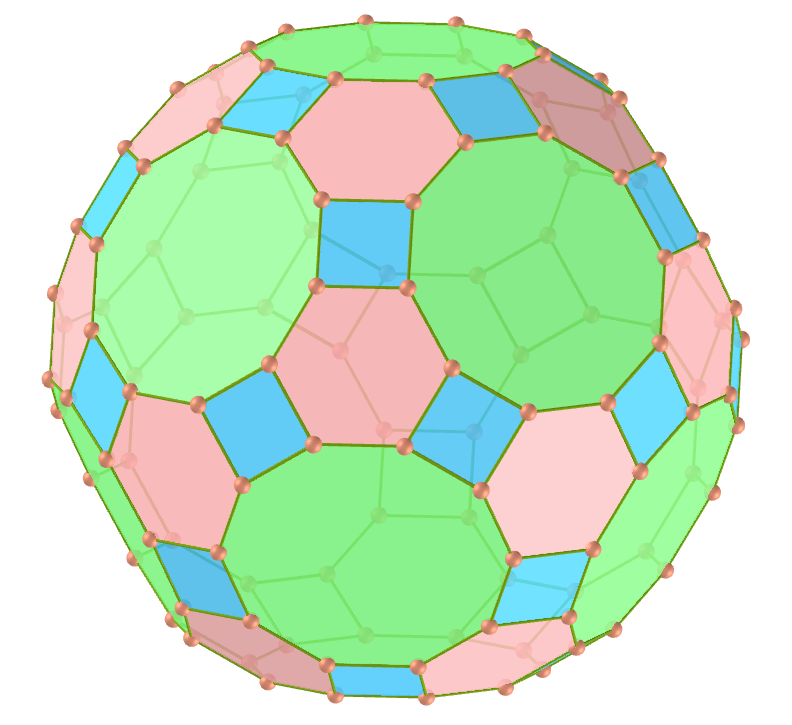
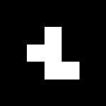
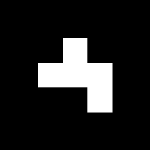
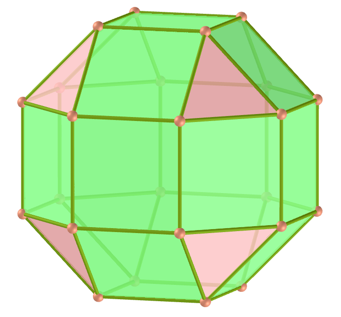
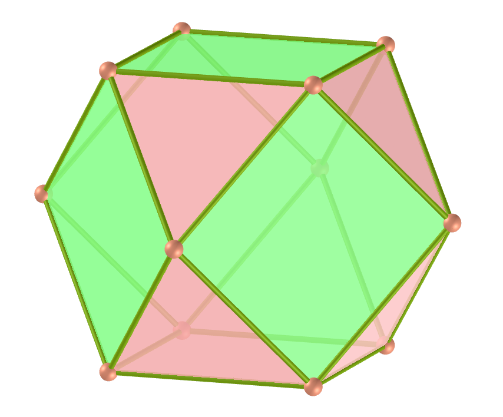

<link rel="stylesheet" href="scripts/style.css">
<h2>Visualization of polyhedra with Augmented Reality (AR) and Virtual Reality (VR) in A-frame</h2>
 <b>author:</b> Paulo Henrique Siqueira - Universidade Federal do Paraná
  <b>contact:</b> <a href="#">paulohscwb@gmail.com</a>
  <a href="https://paulohscwb.github.io/polyhedra/archimedes/pt-br/">versão em português</a>
<form style="margin: 0 auto; float:right; text-align:right; width:100%; margin-bottom:15px;">
	<select id="url" onchange="urlHandler(this.value)" style="color:royalblue;">
		<option disabled selected value>More polyhedra:</option>
		<option disabled value="../archimedes/">Archimedes</option>
		<option value="../catalan/">Catalan</option>
		<option value="../johnson/">Johnson</option>
		<option value="../nonconvex/">Non convex</option>
		<option value="../platonic/">Platonic</option>
		<option value="../polyhedron/">Prisms and antiprisms</option>
		<option value="../quasiregular/">Quasi regular</option>
		<option value="../selfintersect/">Self intersect</option>
		<option value="../selfintersectsnub/">Self intersect snub</option>
		<option value="../selfintersecttruncated/">Self intersect truncated</option>
	</select>
</form>

  <h2 align="center">Archimedean polyhedra</h2>
  An Archimedean solid is one of the 13 solids first enumerated by Archimedes. They are the semi-regular convex polyhedra composed of regular polygons meeting in identical vertices, excluding the 5 Platonic solids and excluding the prisms and antiprisms.
  <h4>Immersive room</h4>
  
<iframe width="100%" src="salaArquimedes.htm" title="Sala Imersiva de Arquimedes" frameborder="0" loading="lazy"></iframe>

 To view Archimedean polyhedra in AR, simply visit 

<a href="ra.html" target="_blank">https://paulohscwb.github.io/polyhedra/archimedes/ra.html</a>
 
with any browser with a webcam device (smartphone, tablet or notebook). 
 Access to the VR sites is done by clicking on the blue circle that appears on top of the marker.

<iframe width="560" height="315" style="max-width:100%" src="https://www.youtube.com/embed/videoseries?list=PLy0I_lGW8HxX-LnHasjCL1lJnvpiYh7ss" title="YouTube video player" frameborder="0" allow="accelerometer; autoplay; clipboard-write; encrypted-media; gyroscope; picture-in-picture; web-share" allowfullscreen></iframe>

<h4>1. Truncated octahedron</h4>
 
 <!--
<iframe src="vr/truncated_octahedron.html" width="100%" title="truncated_octahedron" loading="lazy"></iframe>
-->
  U8 A truncated octahedron is constructed from a regular octahedron with side length <b>3a</b> by the removal of six right square pyramids, one from each point. These pyramids have both base side length <b>a</b> and lateral side length <b>e</b> of <b>a</b>, to form equilateral triangles. The truncated octahedron can be dissected into a central octahedron, surrounded by 8 triangular cupola on each face, and 6 square pyramids above the vertices. The truncated octahedron exists in the structure of the faujasite crystals. 
   <b>Faces:</b> 14 | <b>Polygons:</b> 6 squares and 8 hexagons | <b>Edges:</b> 36 | <b>Vertices:</b> 24 | <b>Sphericity:</b> 0.905 | <b>Dihedral angles:</b> 125.26° (4-6) and 109.47°. <a href="http://mathworld.wolfram.com/TruncatedOctahedron.html" target="_blank">More...</a>  

<h4>2. Truncated icosahedron</h4>
 
  U25 The geometry of truncated icosahedron is associated with footballs (soccer balls) typically patterned with white hexagons and black pentagons. This polyhedron can be constructed from an icosahedron with the 12 vertices truncated, such that one third of each edge is cut off at each of both ends. This creates 12 new pentagon faces, and leaves the original 20 triangle faces as regular hexagons. Thus the length of the edges is one third of that of the original edges. 
   <b>Faces:</b> 32 | <b>Polygons:</b> 12 pentagons and 20 hexagons | <b>Edges:</b> 90 | <b>Vertices:</b> 60 | <b>Sphericity:</b> 0.967 | <b>Dihedral angles:</b> 138.19° (6-6) and 142.62° (5-6). <a href="http://mathworld.wolfram.com/TruncatedIcosahedron.html" target="_blank">More...</a>  

<h4>3. Truncated icosidodecahedron</h4>
 
  U28 The truncated icosidodecahedron is also known as the great rhombicosidodecahedron, and if a set of all 13 Archimedean solids were constructed with all edge lengths equal, the truncated icosidodecahedron would be the largest. It has more vertices and edges than any other convex nonprismatic uniform polyhedron.
   <b>Faces:</b> 62 | <b>Polygons:</b> 30 squares, 20 hexagons and 12 decagons | <b>Edges:</b> 180 | <b>Vertices:</b> 120 | <b>Sphericity:</b> 0.97 | <b>Dihedral angles:</b> 142.62° (6-10), 148.28° (4-10) and 159.1° (4-6). <a href="http://mathworld.wolfram.com/GreatRhombicosidodecahedron.html" target="_blank">More...</a>   

<h4>4. Rhombicosidodecahedron</h4>
 
  U27 The rhombicosidodecahedron is also known as the small rhombicosidodecahedron or small dodeicosidodecahedron. If you expand an icosahedron by moving the faces away from the origin the right amount, without changing the orientation or size of the faces, and do the same to its dual dodecahedron, and patch the square holes in the result, you get a rhombicosidodecahedron. It can also be called an expanded dodecahedron or icosahedron, from truncation operations on either uniform polyhedron.
   <b>Faces:</b> 62 | <b>Polygons:</b> 30 squares, 20 triangles and 12 pentagons | <b>Edges:</b> 120 | <b>Vertices:</b> 60 | <b>Sphericity:</b> 0.979 | <b>Dihedral angles:</b> 159.09° (3-4) and 148.28° (4-5). <a href="http://mathworld.wolfram.com/SmallRhombicosidodecahedron.html" target="_blank">More...</a>   

<h4>5. Snub dodecahedron</h4>
 
  U29 The snub dodecahedron has the highest sphericity of all Archimedean solids. It has two distinct forms, which are mirror images  of each other. The union of both forms is a compound of two snub dodecahedra. The snub dodecahedron can be generated by taking the twelve pentagonal faces of the dodecahedron and pulling them outward so they no longer touch. At a proper distance this can create the rhombicosidodecahedron by filling in square faces between the divided edges and triangle faces between the divided vertices.
   <b>Faces:</b> 92 | <b>Polygons:</b> 80 triangles and 12 pentagons | <b>Edges:</b> 150 | <b>Vertices:</b> 60 | <b>Sphericity:</b> 0.982 | <b>Dihedral angles:</b> 164.18° (3-3) and 152.93° (3-5). <a href="http://mathworld.wolfram.com/SnubDodecahedron.html" target="_blank">More...</a>

<h4>6. Truncated dodecahedron</h4>
 
  U26 The truncated dodecahedron is used in the cell-transitive hyperbolic space-filling tessellation, the bitruncated icosahedral honeycomb. This polyhedron can be formed from a dodecahedron by truncating the corners so the pentagon faces become decagons and the corners become triangles. It is part of a truncation process between a dodecahedron and icosahedron.
   <b>Faces:</b> 32 | <b>Polygons:</b> 20 triangles and 12 decagons | <b>Edges:</b> 150 | <b>Vertices:</b> 60 | <b>Sphericity:</b> 0.926 | <b>Dihedral angles:</b> 116.57° (10-10) and 142.62° (3-10). <a href="http://mathworld.wolfram.com/TruncatedDodecahedron.html" target="_blank">More...</a>  

<h4>7. Icosidodecahedron</h4>
 
  U24 Icosidodecahedron contains 12 pentagons of the dodecahedron and 20 triangles of the icosahedron. The truncated cube can be turned into an icosidodecahedron by dividing the octagons into two pentagons and two triangles. The icosidodecahedron has 6 central decagons.
   <b>Faces:</b> 32 | <b>Polygons:</b> 20 triangles and 12 pentagons | <b>Edges:</b> 60 | <b>Vertices:</b> 30 | <b>Sphericity:</b> 0.951 | <b>Dihedral angle:</b> 142.62° (5-3). <a href="http://mathworld.wolfram.com/Icosidodecahedron.html" target="_blank">More...</a>

<h4>8. Snub cube</h4>
 
  U12 The snub cube is also known as snub cuboctahedron and it has two distinct forms, which are mirror images of each other. The snub cube can be generated by taking the six faces of the cube, pulling them outward so they no longer touch, then giving them each a small rotation on their centers (all clockwise or all counter-clockwise) until the spaces between can be filled with equilateral triangles. 
   <b>Faces:</b> 38 | <b>Polygons:</b> 32 triangles and 6 squares | <b>Edges:</b> 60 | <b>Vertices:</b> 24 | <b>Sphericity:</b> 0.965 | <b>Dihedral angles:</b> 153.23° (3-3) and 142.98° (3-4). <a href="http://mathworld.wolfram.com/SnubCube.html" target="_blank">More...</a> 

<h4>9. Truncated cuboctahedron</h4>
 
  U11 The truncated cuboctahedron is also known as great rhombicuboctahedron. The truncated cuboctahedron is the convex hull of a rhombicuboctahedron with cubes above its 12 squares on 2-fold symmetry axes. The rest of its space can be dissected into 6 square cupolas below the octagons and 8 triangular cupolas below the hexagons.
   <b>Faces:</b> 26 | <b>Polygons:</b> 12 squares, 8 hexagons and 6 octagons | <b>Edges:</b> 72 | <b>Vertices:</b> 48 | <b>Sphericity:</b> 0.943 | <b>Dihedral angles:</b> 144.74° (4-6), 135° (4-8) and 125.26° (6-8). <a href="http://mathworld.wolfram.com/GreatRhombicuboctahedron.html" target="_blank">More...</a>

<h4>10. Rhombicuboctahedron</h4>
 
  U10 The rhombicuboctahedron is also known as small rhombicuboctahedron. This solid may also be called an expanded cube or octahedron and it can be dissected into two square cupolae and a central octagonal prism. There are three pairs of parallel planes that each intersect the rhombicuboctahedron in a regular octagon.
   <b>Faces:</b> 26 | <b>Polygons:</b> 18 squares and 8 triangles | <b>Edges:</b> 48 | <b>Vertices:</b> 24 | <b>Sphericity:</b> 0.954 | <b>Dihedral angles:</b> 144.74° (4-3) and 135° (4-4). <a href="http://mathworld.wolfram.com/SmallRhombicuboctahedron.html" target="_blank">More...</a>

<h4>11. Truncated cube</h4>
 
  U9 The truncated cube is one of a family of uniform polyhedra related to the cube and regular octahedron. This solid can be dissected into a central cube, with six square cupola around each of the cube's faces, and 8 regular tetrahedral in the corners. This dissection can also be seen within the runcic cubic honeycomb, with cube, tetrahedron, and rhombicuboctahedron cells.
   <b>Faces:</b> 14 | <b>Polygons:</b> 8 triangles and 6 octagons | <b>Edges:</b> 36 | <b>Vertices:</b> 24 | <b>Sphericity:</b> 0.849 | <b>Dihedral angles:</b> 125.26° (8-3) and 90° (8-8). <a href="http://mathworld.wolfram.com/TruncatedCube.html" target="_blank">More...</a> 

<h4>12. Cuboctahedron</h4>
 
  U7 The cuboctahedron is the unique convex polyhedron in which the long radius (center to vertex) is the same as the edge length. A hexagon can be obtained by taking an equatorial cross section of a cuboctahedron. This solid can be dissected into two triangular cupolas by a common hexagon passing through the center of the cuboctahedron.
   <b>Faces:</b> 14 | <b>Polygons:</b> 8 triangles and 6 squares | <b>Edges:</b> 24 | <b>Vertices:</b> 12 | <b>Sphericity:</b> 0.905 | <b>Dihedral angle:</b> 125.26° (4-3). <a href="http://mathworld.wolfram.com/Cuboctahedron.html" target="_blank">More...</a>

<h4>13. Truncated tetrahedron</h4>
 
  U2 The truncated tetrahedron can be constructed by truncating all 4 vertices of a regular tetrahedron at one third of the original edge length. A deeper truncation, removing a tetrahedron of half the original edge length from each vertex, is called rectification. The rectification of a tetrahedron produces an octahedron.
   <b>Faces:</b> 8 | <b>Polygons:</b> 4 triangles and 4 hexagons | <b>Edges:</b> 18 | <b>Vertices:</b> 12 | <b>Sphericity:</b> 0.775 | <b>Dihedral angles:</b> 109.47° (6-3) and 70.53° (6-6). <a href="http://mathworld.wolfram.com/TruncatedTetrahedron.html" target="_blank">More...</a>  

<a href="#p1" class="topo">back to top</a>

  Polyhedra: Archimedes by <a xmlns:cc="http://creativecommons.org/ns#" href="https://paulohscwb.github.io/polyhedra/archimedes/" property="cc:attributionName" rel="cc:attributionURL">Paulo Henrique Siqueira</a> is licensed with a license <a rel="license" href="http://creativecommons.org/licenses/by-nc-nd/4.0/">Creative Commons Attribution-NonCommercial-NoDerivatives 4.0 International</a>.

<h4>How to cite this work:</h4> 

Siqueira, P.H., "Polyhedra". Available in: <https://paulohscwb.github.io/polyhedra/archimedes/>, September 2019.

 <b>References:</b>
 Weisstein, Eric W. "Archimedean Solid" From MathWorld-A Wolfram Web Resource. <a href="http://mathworld.wolfram.com/ArchimedeanSolid.html" target="_blank">http://mathworld.wolfram.com/ArchimedeanSolid.html</a>
 Weisstein, Eric W. "Platonic Solid" From MathWorld-A Wolfram Web Resource. <a href="http://mathworld.wolfram.com/PlatonicSolid.html" target="_blank">http://mathworld.wolfram.com/PlatonicSolid.html</a>
 Weisstein, Eric W. "Archimedean Dual" From MathWorld-A Wolfram Web Resource. <a href="https://mathworld.wolfram.com/ArchimedeanDual.html" target="_blank">https://mathworld.wolfram.com/ArchimedeanDual.html</a>
 Weisstein, Eric W. "Uniform Polyhedron." From MathWorld--A Wolfram Web Resource. <a href="https://mathworld.wolfram.com/UniformPolyhedron.html" target="_blank">https://mathworld.wolfram.com/UniformPolyhedron.html</a>
 Wikipedia <a href="https://en.wikipedia.org/wiki/Archimedean_solid" target="_blank">https://en.wikipedia.org/wiki/Archimedean_solid</a>
 Wikipedia <a href="https://en.wikipedia.org/wiki/en.wikipedia.org/wiki/Platonic_solid" target="_blank">https://en.wikipedia.org/wiki/Platonic_solid</a>
 McCooey, David I. "Visual Polyhedra". <a href="http://dmccooey.com/polyhedra/" target="_blank">http://dmccooey.com/polyhedra/</a>
