<link rel="stylesheet" href="../scripts/style.css">
<h2>Visualização de poliedros com Realidade Aumentada (RA) e Realidade Virtual (RV) em A-frame</h2>
<b>autor:</b> Paulo Henrique Siqueira - Universidade Federal do Paraná
 <b>contato:</b> <a href="#"> paulohscwb@gmail.com </a>
 <a href="https://paulohscwb.github.io/polyhedra/">english version</a>
<form style="margin: 0 auto; float:right; text-align:right; width:100%; margin-bottom:15px;">
	<select id="url" onchange="urlHandler(this.value)" style="color:royalblue;">
		<option disabled selected>Mais poliedros:</option>
		<option disabled value="../../archimedes/pt-br/">Arquimedes</option>
		<option value="../../catalan/pt-br/">Catalan</option>
		<option value="../../johnson/pt-br/">Johnson</option>
		<option value="../../nonconvex/pt-br/">Não convexos</option>
		<option value="../../platonic/pt-br/">Platão</option>
		<option value="../../polyhedron/pt-br/">Prismas e antiprismas</option>
		<option value="../../quasiregular/pt-br/">Quase regulares</option>
		<option value="../../selfintersect/pt-br/">Auto-interseção</option>
		<option value="../../selfintersectsnub/pt-br/">Auto-interseção snub</option>
		<option value="../../selfintersecttruncated/pt-br/">Auto-interseção truncados</option>
	</select>
</form>

 

  <h2 align="center">Poliedros de Arquimedes</h2>
Um poliedro de Arquimedes é um dos 13 sólidos enumerados pela primeira vez por Arquimedes. Eles são os poliedros convexos semi-regulares compostos de polígonos regulares reunidos em vértices idênticos, excluindo os 5 sólidos platônicos, os prismas e antiprismas.
<h4>Sala imersiva</h4>
  
<iframe width="100%" src="../salaArquimedes.htm" title="Sala Imersiva de Arquimedes" frameborder="0" loading="lazy"></iframe>

 Para ver os poliedros arquimedeanos em RA, visite a página:

 <a href="../ra.html" target="_blank"> https://paulohscwb.github.io/polyhedra/archimedes/ra.html</a>

com qualquer navegador com um dispositivo de webcam (smartphone, tablet ou notebook).
 O acesso às páginas de RV é feito clicando no círculo azul que aparece em cima dos marcadores.
  
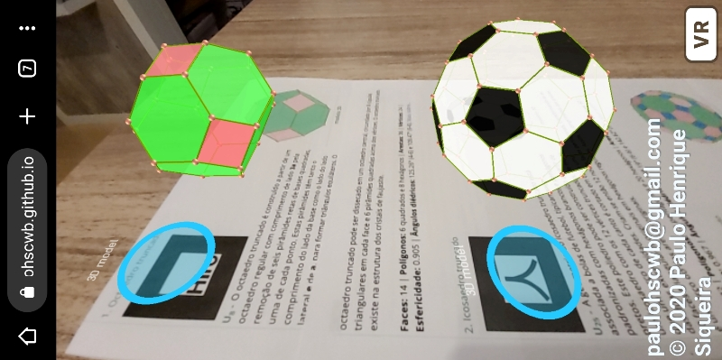

<iframe width="560" height="315" style="max-width:100%" src="https://www.youtube.com/embed/videoseries?list=PLy0I_lGW8HxX-LnHasjCL1lJnvpiYh7ss" title="YouTube video player" frameborder="0" allow="accelerometer; autoplay; clipboard-write; encrypted-media; gyroscope; picture-in-picture; web-share" allowfullscreen></iframe>

<h4>1. Octaedro truncado</h4>
 <a href="../vr/truncated_octahedron.html" target="_blank" title="modelo 3D" class="fotoA">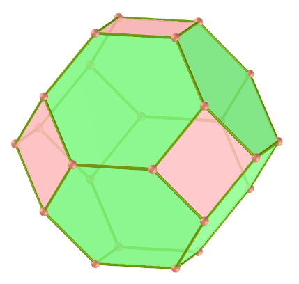</a>
  U8 O octaedro truncado é construído a partir de um octaedro regular com comprimento de lado <b>3a</b> pela remoção de seis pirâmides retas de bases quadradas, uma de cada ponto. Estas pirâmides têm tanto o comprimento do lado da base como o lado do lado lateral <b>e </b> de <b>a</b>, para formar triângulos equiláteros. O octaedro truncado pode ser dissecado em um octaedro central, circundado por 8 cúpulas triangulares em cada face e 6 pirâmides quadradas acima dos vértices. O octaedro truncado existe na estrutura dos cristais de faujasite.
   <b>Faces:</b> 14 | <b>Polígonos:</b> 6 quadrados e 8 hexágonos | <b>Arestas:</b> 36 | <b>Vértices:</b> 24 | <b>Esfericidade:</b> 0.905 | <b>Ângulos diédricos:</b> 125.26° (4-6) e 109.47° (6-6). <a href="http://mathworld.wolfram.com/TruncatedOctahedron.html" target="_blank">Mais sobre...</a> 

<h4>2. Icosaedro truncado</h4>
 <a href="../vr/truncated_icosahedron.html" target="_blank" title="modelo 3D" class="fotoA">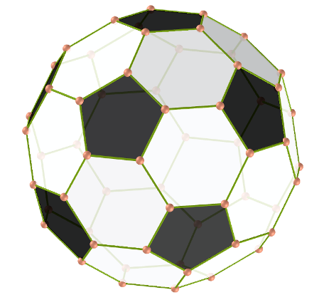</a>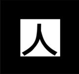
  U25 A geometria do icosaedro truncado está associada a bolas de futebol, tipicamente padronizadas com hexágonos brancos e pentágonos pretos. Este poliedro pode ser construído a partir de um icosaedro com os 12 vértices truncados, de modo que um terço de cada canto é cortado em cada uma das duas extremidades. Criam-se então 12 novas faces pentagonais, transformando-se as 20 faces triangulares originais em hexágonos regulares. Assim, o comprimento das arestas é um terço do das arestas originais.
   <b>Faces:</b> 32 | <b>Polígonos:</b> 12 pentágonos e 20 hexágonos | <b>Arestas:</b> 90 | <b>Vértices:</b> 60 | <b>Esfericidade:</b> 0.967 | <b>Ângulos diédricos:</b> 138.19° (6-6) e 142.62° (5-6). <a href="http://mathworld.wolfram.com/TruncatedIcosahedron.html" target="_blank">Mais sobre...</a> 

<h4>3. Icosidodecaedro truncado</h4>
 <a href="../vr/truncated_icosidodecahedron.html" target="_blank" title="modelo 3D" class="fotoA">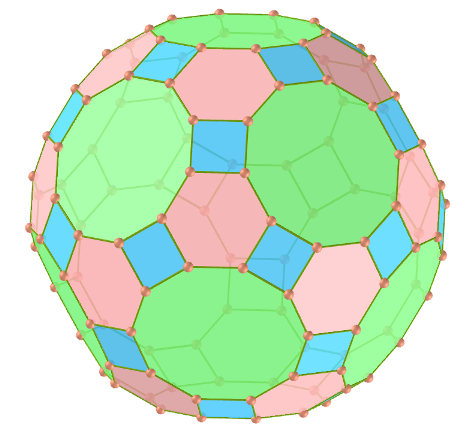</a>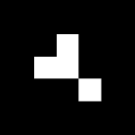
  U28 O icosidodecaedro truncado também é conhecido como o grande rombicosidodecaedro, e se todos os 13 sólidos arquimedianos fossem construídos com todos os comprimentos de arestas iguais, o icosidodecaedro truncado seria o maior. Tem mais vértices e arestas do que qualquer outro poliedro uniforme não-prismático convexo.
   <b>Faces:</b> 62 | <b>Polígonos:</b> 30 quadrados, 20 hexágonos e 12 decágonos | <b>Arestas:</b> 180 | <b>Vértices:</b> 120 | <b>Esfericidade:</b> 0.97 | <b>Ângulos diédricos:</b> 142.62° (6-10), 148.28° (4-10) e 159.1° (4-6). <a href="http://mathworld.wolfram.com/GreatRhombicosidodecahedron.html" target="_blank">Mais sobre...</a> 

<h4>4. Rombicosidodecaedro</h4>
 <a href="../vr/rhombicosidodecahedron.html" target="_blank" title="modelo 3D" class="fotoA">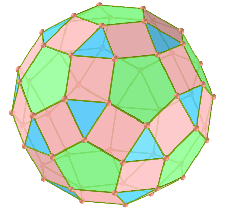</a>
  U27 O rombicosidodecaedro também é conhecido como o pequeno rombicosidodecaedro ou pequeno dodeicosidodecaedro. Se você expandir um icosaedro movendo as faces para longe da origem na quantidade certa, sem alterar a orientação ou tamanho das faces, e fazer o mesmo com um dodecaedro duplo, e corrigir os espaços com quadrados, você obtém um rombicosidodecaedro. Também pode ser chamado de dodecaedro ou icosaedro expandido a partir de operações de truncamento em poliedros regulares.
  <b>Faces:</b> 62 | <b>Polígonos:</b> 30 quadrados, 20 triângulos e 12 pentágonos | <b>Arestas:</b> 120 | <b>Vértices:</b> 60 | <b>Esfericidade:</b> 0.979 | <b>Ângulos diédricos:</b> 159.09° (3-4) e 148.28° (4-5). <a href="http://mathworld.wolfram.com/SmallRhombicosidodecahedron.html" target="_blank">Mais sobre...</a> 

<h4>5. Dodecaedro snub</h4>
 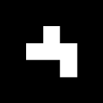
  U29 O dodecaedro snub tem a mais alta esfericidade de todos os sólidos de Arquimedes. Tem duas formas distintas, que são imagens espelhadas umas da outra. A união de ambas as formas é um composto de dois dodecaedros snub. O dodecaedro snub pode ser gerado tomando-se as doze faces pentagonais do dodecaedro e deslocando-as para fora, para não se interceptarem. A uma distância adequada, esta tranformação pode criar o rombicosidodecaedro preenchendo as faces quadradas entre as arestas divididas e as faces triangulares entre os vértices divididos.
   <b>Faces:</b> 92 | <b>Polígonos:</b> 80 triângulos e 12 pentágonos | <b>Arestas:</b> 150 | <b>Vértices:</b> 60 | <b>Esfericidade:</b> 0.982 | <b>Ângulos diédricos:</b> 164.18° (3-3) e 152.93° (3-5). <a href="http://mathworld.wolfram.com/SnubDodecahedron.html" target="_blank">Mais sobre...</a>  

<h4>6. Dodecaedro truncado</h4>
 <a href="../vr/truncated_dodecahedron.html" target="_blank" title="modelo 3D" class="fotoA">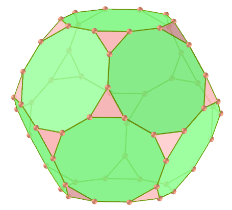</a>
  U26 O dodecaedro truncado é usado na tesselação de preenchimento de espaço hiperbólico celular-transitivo, o favo de mel icosaédrico bitruncado. Esse poliedro pode ser formado a partir de um dodecaedro, truncando os cantos para que as faces dos pentágonos se tornem decágonos e os cantos se tornem triângulos. Faz parte de um processo de truncamento entre um dodecaedro e um icosaedro.
   <b>Faces:</b> 32 | <b>Polígonos:</b> 20 triângulos e 12 decágonos | <b>Arestas:</b> 150 | <b>Vértices:</b> 60 | <b>Esfericidade:</b> 0.926 | <b>Ângulos diédricos:</b> 116.57° (10-10) e 142.62° (3-10). <a href="http://mathworld.wolfram.com/TruncatedDodecahedron.html" target="_blank">Mais sobre...</a> 

<h4>7. Icosidodecaedro</h4>
 <a href="../vr/icosidodecahedron.html" target="_blank" title="modelo 3D" class="fotoA">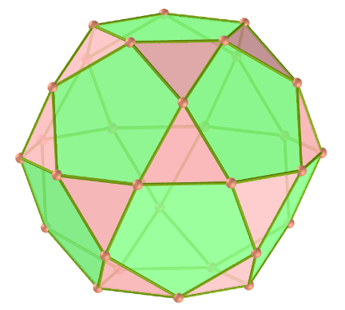</a>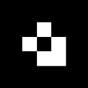
  U24 O icosidodecaedro contém 12 pentágonos do dodecaedro e 20 triângulos do icosaedro. O cubo truncado pode ser transformado em um icosidodecaedro, dividindo-se os octógonos em dois pentágonos e dois triângulos. O icosidodecaedro possui seis decágonos centrais.
   <b>Faces:</b> 32 | <b>Polígonos:</b> 20 triângulos e 12 pentágonos | <b>Arestas:</b> 60 | <b>Vértices:</b> 30 | <b>Esfericidade:</b> 0.951 | <b>Ângulo diédrico:</b> 142.62° (5-3). <a href="http://mathworld.wolfram.com/Icosidodecahedron.html" target="_blank">Mais sobre...</a> 

<h4>8. Cubo snub</h4>
 <a href="../vr/snubcube.html" target="_blank" title="modelo 3D" class="fotoA">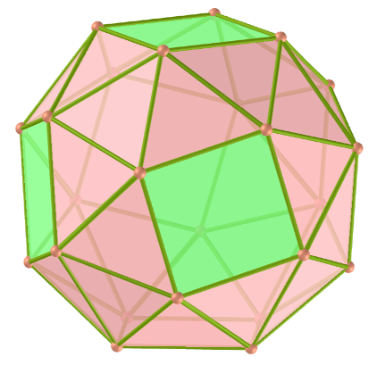</a>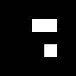
  U12 O cubo snub também é conhecido como cuboctaedro snub e tem duas formas distintas, que são imagens espelhadas uma da outra. O cubo snub pode ser gerado tomando-se as seis faces do cubo, puxando-as para fora de modo que elas não se interceptem, dando a cada uma delas uma pequena rotação em seus centros (todas no mesmo sentido: horário ou anti-horário) até que os espaços possam ser preenchidos com triângulos equiláteros.
  <b>Faces:</b> 38 | <b>Polígonos:</b> 32 triângulos e 6 quadrados | <b>Arestas:</b> 60 | <b>Vértices:</b> 24 | <b>Esfericidade:</b> 0.965 | <b>Ângulos diédricos:</b> 153.23° (3-3) e 142.98° (3-4). <a href="http://mathworld.wolfram.com/SnubCube.html" target="_blank">Mais sobre...</a>

<h4>9. Cuboctaedro truncado</h4>
 <a href="../vr/truncated_cuboctahedron.html" target="_blank" title="modelo 3D" class="fotoA">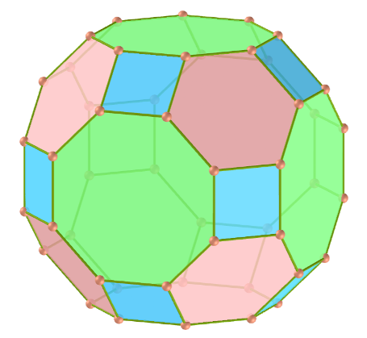</a>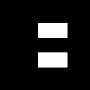
  U11 O cuboctaedro truncado também é conhecido como grande rombicuboctaedro. O cuboctaedro truncado é o casco convexo de um rombicuboctaedro com cubos acima de seus 12 quadrados em eixos de simetria dupla. O resto de seu espaço pode ser dissecado em seis cúpulas quadradas abaixo dos octógonos e oito cúpulas triangulares abaixo dos hexágonos.
   <b>Faces:</b> 26 | <b>Polígonos:</b> 12 quadrados, 8 hexágonos e 6 octógonos | <b>Arestas:</b> 72 | <b>Vértices:</b> 48 | <b>Esfericidade:</b> 0.943 | <b>Ângulos diédricos:</b> 144.74° (4-6), 135° (4-8) e 125.26° (6-8). <a href="http://mathworld.wolfram.com/GreatRhombicuboctahedron.html" target="_blank">Mais sobre...</a>

<h4>10. Rombicuboctaedro</h4>
 <a href="../vr/rhombicuboctahedron.html" target="_blank" title="modelo 3D" class="fotoA">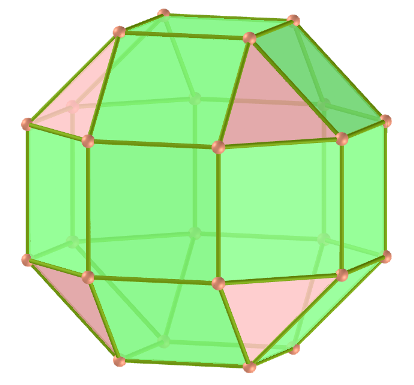</a>
  U10 O rombicuboctaedro é também conhecido como pequeno rombicuboctaedro. Este sólido também pode ser chamado de cubo ou octaedro expandido  e pode ser dissecado em duas cúpulas quadradas e um prisma octogonal central. Existem três pares de planos paralelos que interceptam o rombicuboctaedro em um octógono regular.
  <b>Faces:</b> 26 | <b>Polígonos:</b> 18 quadrados e 8 triângulos | <b>Arestas:</b> 48 | <b>Vértices:</b> 24 | <b>Esfericidade:</b> 0.954 | <b>Ângulos diédricos:</b> 144.74° (4-3) e 135° (4-4). <a href="http://mathworld.wolfram.com/SmallRhombicuboctahedron.html" target="_blank">Mais sobre...</a>

<h4>11. Cubo truncado</h4>
 <a href="../vr/truncated_cube.html" target="_blank" title="modelo 3D" class="fotoA">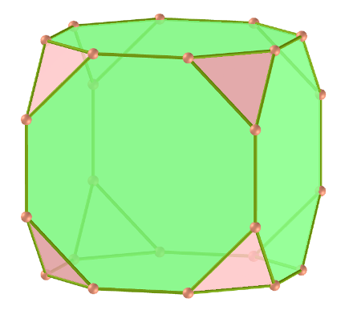</a>
  U9 O cubo truncado pertence a uma família de poliedros uniformes relacionados ao cubo e octaedro regular. Esse sólido pode ser dissecado em um cubo central, com seis cúpulas quadradas ao redor de cada uma das faces do cubo e oito tetraédricas regulares nos cantos. Essa dissecação também pode ser vista dentro do favo de mel cúbico, com células cubo, tetraedro e rombicuboctaedro.
  <b>Faces:</b> 14 | <b>Polígonos:</b> 8 triângulos e 6 octógonos | <b>Arestas:</b> 36 | <b>Vértices:</b> 24 | <b>Esfericidade:</b> 0.849 | <b>Ângulos diédricos:</b> 125.26° (8-3) e 90° (8-8). <a href="http://mathworld.wolfram.com/TruncatedCube.html" target="_blank">Mais sobre...</a> 

<h4>12. Cuboctaedro</h4>
 <a href="../vr/cuboctahedron.html" target="_blank" title="modelo 3D" class="fotoA">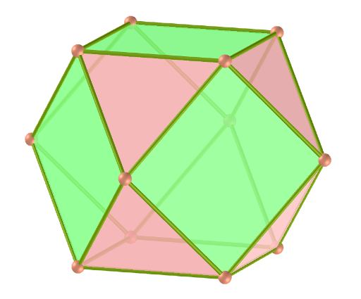</a>
  U7 O cuboctaedro é o único poliedro convexo no qual o maior raio (do centro ao vértice) tem o mesmo comprimento que sua aresta. Um hexágono pode ser obtido tomando-se uma seção transversal equatorial de um cuboctaedro. Este sólido pode ser dissecado em duas cúpulas triangulares por um hexágono passando pelo centro do cuboctaedro.
  <b>Faces:</b> 14 | <b>Polígonos:</b> 8 triângulos e 6 quadrados | <b>Arestas:</b> 24 | <b>Vértices:</b> 12 | <b>Esfericidade:</b> 0.905 | <b>Ângulo diédrico:</b> 125.26° (4-3). <a href="http://mathworld.wolfram.com/Cuboctahedron.html" target="_blank">Mais sobre...</a>

<h4>13. Tetraedro truncado</h4>
 <a href="../vr/truncated_tetrahedron.html" target="_blank" title="modelo 3D" class="fotoA">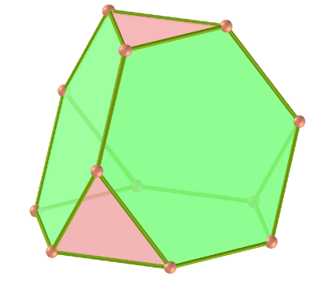</a>
  U2 O tetraedro truncado pode ser construído truncando todos os 4 vértices de um tetraedro regular com um terço do comprimento original da aresta. Um truncamento mais profundo, removendo um tetraedro de metade do comprimento original da aresta de cada vértice, é chamado de retificação. A retificação de um tetraedro produz um octaedro.
  <b>Faces:</b> 8 | <b>Polígonos:</b> 4 triângulos e 4 hexágonos | <b>Arestas:</b> 18 | <b>Vértices:</b> 12 | <b>Esfericidade:</b> 0.775 | <b>Ângulos diédricos:</b> 109.47° (6-3) e 70.53° (6-6). <a href="http://mathworld.wolfram.com/TruncatedTetrahedron.html" target="_blank">Mais sobre...</a> 

<a href="#p1" class="topo">voltar ao topo</a>

 
  Polyhedra: Archimedes de <a xmlns:cc="http://creativecommons.org/ns#" href="https://paulohscwb.github.io/polyhedra/archimedes/" property="cc:attributionName" rel="cc:attributionURL">Paulo Henrique Siqueira</a> está licenciado com uma Licença <a rel="license" href="http://creativecommons.org/licenses/by-nc-nd/4.0/">Creative Commons Atribuição-NãoComercial-SemDerivações 4.0 Internacional</a>.

<h4>Como citar este trabalho:</h4> 

Siqueira, P.H., "Polyhedra: Archimedes". Disponível em: <https://paulohscwb.github.io/polyhedra/archimedes/>, Setembro de 2019.

 <b>Referências:</b>
 Weisstein, Eric W. "Archimedean Solid" From MathWorld-A Wolfram Web Resource. <a href="http://mathworld.wolfram.com/ArchimedeanSolid.html" target="_blank">http://mathworld.wolfram.com/ArchimedeanSolid.html</a>
 Weisstein, Eric W. "Platonic Solid" From MathWorld-A Wolfram Web Resource. <a href="http://mathworld.wolfram.com/PlatonicSolid.html" target="_blank">http://mathworld.wolfram.com/PlatonicSolid.html</a>
 Weisstein, Eric W. "Archimedean Dual" From MathWorld-A Wolfram Web Resource. <a href="https://mathworld.wolfram.com/ArchimedeanDual.html" target="_blank">https://mathworld.wolfram.com/ArchimedeanDual.html</a>
 Weisstein, Eric W. "Uniform Polyhedron." From MathWorld--A Wolfram Web Resource. <a href="https://mathworld.wolfram.com/UniformPolyhedron.html" target="_blank">https://mathworld.wolfram.com/UniformPolyhedron.html</a>
 Wikipedia <a href="https://en.wikipedia.org/wiki/Archimedean_solid" target="_blank">https://en.wikipedia.org/wiki/Archimedean_solid</a>
 Wikipedia <a href="https://en.wikipedia.org/wiki/en.wikipedia.org/wiki/Platonic_solid" target="_blank">https://en.wikipedia.org/wiki/Platonic_solid</a>
 McCooey, David I. "Visual Polyhedra". <a href="http://dmccooey.com/polyhedra/" target="_blank">http://dmccooey.com/polyhedra/</a>
