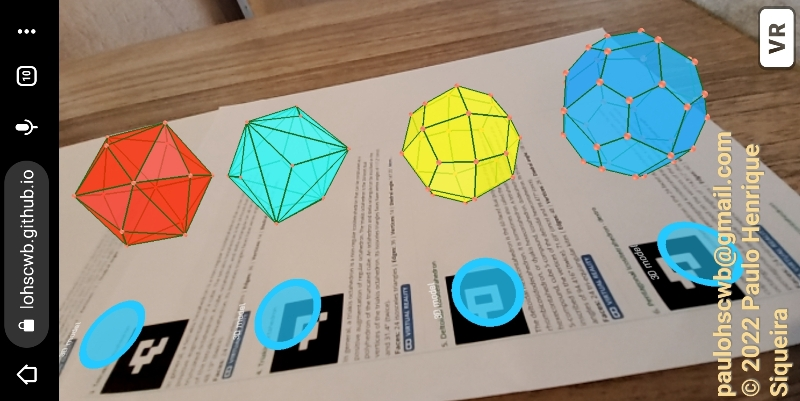
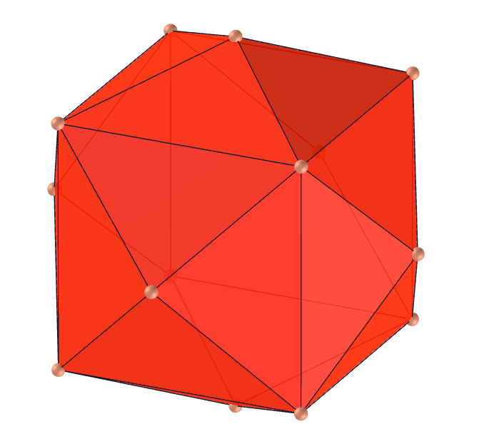
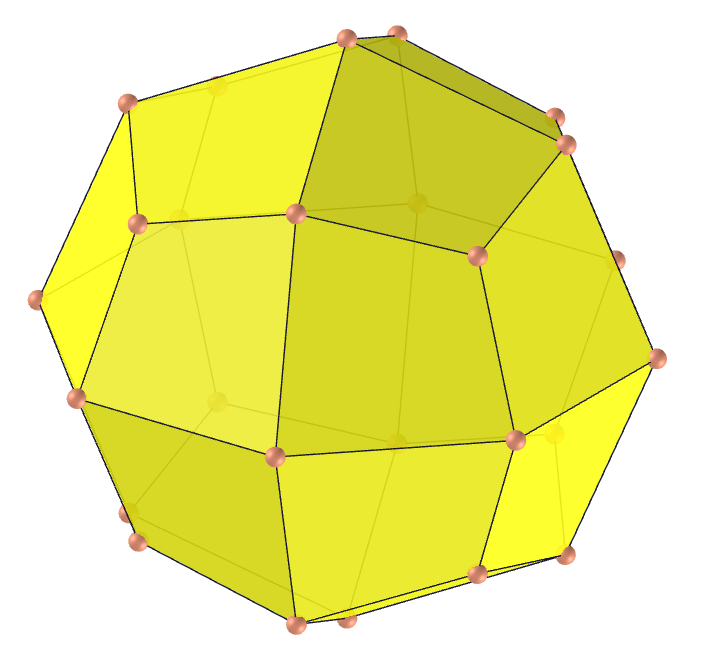

<link rel="stylesheet" href="scripts/style.css">
<h2>Visualization of polyhedra with Augmented Reality (AR) and Virtual Reality (VR) in A-frame</h2>
 <b>author:</b> Paulo Henrique Siqueira - Universidade Federal do Paraná
  <b>contact:</b> <a href="#">paulohscwb@gmail.com</a>
  <a href="https://paulohscwb.github.io/polyhedra/catalan/pt-br/">versão em português</a>
<form style="margin: 0 auto; float:right; text-align:right; width:100%; margin-bottom:15px;">
	<select id="url" onchange="urlHandler(this.value)" style="color:royalblue;">
		<option disabled selected value>More polyhedra:</option>
		<option value="../archimedes/">Archimedes</option>
		<option disabled value="../catalan/">Catalan</option>
		<option value="../johnson/">Johnson</option>
		<option value="../nonconvex/">Non convex</option>
		<option value="../platonic/">Platonic</option>
		<option value="../polyhedron/">Prisms and antiprisms</option>
		<option value="../quasiregular/">Quasi regular</option>
		<option value="../selfintersect/">Self intersect</option>
		<option value="../selfintersectsnub/">Self intersect snub</option>
		<option value="../selfintersecttruncated/">Self intersect truncated</option>
	</select>
</form>

  <h2 align="center">Catalan polyhedra</h2>
The Catalan solids are the duals of the Archimedean solids. They are named after the Belgian mathematician Eugene Catalan (1814-1894) who first described the complete set in 1865. The Rhombic Dodecahedron and Rhombic Triacontahedron were described in 1611 by Johannes Kepler. Each Catalan solid has one type of face and a constant dihedral angle, and it possesses the same symmetry as its Archimedean dual.
<h4>Immersive room</h4>
  
<iframe width="100%" src="salaCatalan.htm" title="Sala Imersiva de Catalan" frameborder="0" loading="lazy"></iframe>

  To view Catalan polyhedra in AR, simply visit:

<a href="catalan.html" target="_blank">https://paulohscwb.github.io/polyhedra/catalan.html</a>
 
with any browser with a webcam device (smartphone, tablet or notebook). 
 Access to the VR sites is done by clicking on the blue circle that appears on top of the marker.

<iframe width="560" height="315" style="max-width:100%" src="https://www.youtube.com/embed/videoseries?list=PLy0I_lGW8HxWEW5GUh83TNyIm0O2TXWEI" title="YouTube video player" frameborder="0" allow="accelerometer; autoplay; clipboard-write; encrypted-media; gyroscope; picture-in-picture; web-share" allowfullscreen></iframe>

<h4>1. Triakis Tetrahedron</h4>
 
  The triakis tetrahedron is a non-regular dodecahedron that can be constructed as an augmentation of a regular tetrahedron: a triangular pyramid added to each face. The triakis tetrahedron is the dual polyhedron of the truncated tetrahedron. Its isosceles triangles faces have vertex angles of 112.89° (once) and 33.56° (twice).
  <b>Faces:</b> 12 isosceles triangles | <b>Edges:</b> 18 | <b>Vertices:</b> 8 | <b>Dihedral angle:</b> 129.52°. <a href="https://mathworld.wolfram.com/TriakisTetrahedron.html" target="_blank">More...</a>
 

 <h4>2. Rhombic Dodecahedron</h4>
 
  The rhombic dodecahedron is the dual polyhedron of the cuboctahedron. More specifically, a cube, octahedron, and stella octangula can be inscribed in the vertices of a rhombic dodecahedron. A rhombic dodecahedron appears in the upper right as one of the polyhedral "stars" in M. C. Escher's 1948 wood engraving "Stars". Its rhombi faces have vertex angles of 70.53° and 109.47°.
  <b>Faces:</b> 12 rhombi | <b>Edges:</b> 24 | <b>Vertices:</b> 14 | <b>Dihedral angle:</b> 120°. <a href="https://mathworld.wolfram.com/RhombicDodecahedron.html" target="_blank">More...</a>
 

 <h4>3. Tetrakis Hexahedron</h4>
 
  In general, a tetrakis hexahedron is a non-regular icositetrahedron that can be constructed as an augmentation of a cube. The tetrakis hexahedron is the 24-faced dual polyhedron of the truncated octahedron. A cube, octahedron, and stella octangula can all be inscribed in the vertices of the tetrakis hexahedron. Its isosceles triangles faces have vertex angles of 86.62° (once) and 48.19° (twice).
  <b>Faces:</b> 24 isosceles triangles | <b>Edges:</b> 36 | <b>Vertices:</b> 14 | <b>Dihedral angle:</b> 143.13°. <a href="https://mathworld.wolfram.com/TetrakisHexahedron.html" target="_blank">More...</a>
 

 <h4>4. Triakis Octahedron</h4>
 
  In general, a triakis octahedron is a non-regular icositetrahedron that can be constructed as an augmentation of regular octahedron. The triakis octahedron is the 24-faced dual polyhedron of the truncated cube. An octahedron and stella octangula can be inscribed on the vertices of the triakis octahedron. Its isosceles triangles faces have vertex angles of 117.2° (once) and 31.4° (twice).
  <b>Faces:</b> 24 isosceles triangles | <b>Edges:</b> 36 | <b>Vertices:</b> 14 | <b>Dihedral angle:</b> 147.35°. <a href="https://mathworld.wolfram.com/SmallTriakisOctahedron.html" target="_blank">More...</a>
 

 <h4>5. Deltoidal Icositetrahedron</h4>
 
  The deltoidal icositetrahedron is the 24-faced dual polyhedron of rhombicuboctahedron. A deltoidal icositetrahedron appears in the middle right as one of the polyhedral "stars" in M. C. Escher's 1948 wood engraving "Stars". A stella octangula, attractive octahedron 4-compound (whose dual is an attractive cube 4-compound), and cube can all be inscribed in a deltoidal icositetrahedron. Its tri-equiangular kites faces have vertex angles of 94.42° (twice), 71.69° (once) and 99.48° (once).
  <b>Faces:</b> 24 tri-equiangular kites | <b>Edges:</b> 48 | <b>Vertices:</b> 26 | <b>Dihedral angle:</b> 138.12°. <a href="https://mathworld.wolfram.com/DeltoidalIcositetrahedron.html" target="_blank">More...</a>
 

 <h4>6. Pentagonal Icositetrahedron</h4>
 
  The pentagonal icositetrahedron is the 24-faced dual polyhedron of the snub cube. The mineral cuprite (Cu2O) forms in pentagonal icositetrahedral crystals. A cube, octahedron, and stella octangula can all be inscribed on the vertices of the pentagonal icositetrahedron. Its irregular pentagonal faces have vertex angles of 114.81° (four times) and 80.75° (once). 
  <b>Faces:</b> 24 mirror-symmetric pentagons | <b>Edges:</b> 60 | <b>Vertices:</b> 38 | <b>Dihedral angle:</b> 136.31°. <a href="https://mathworld.wolfram.com/PentagonalIcositetrahedron.html" target="_blank">More...</a>
 

 <h4>7. Rhombic Triacontahedron</h4>
 
  The rhombic triacontahedron is a zonohedron which is the dual polyhedron of the icosidodecahedron. The intersecting edges of the dodecahedron-icosahedron compound form the diagonals of 30 rhombi which comprise the triacontahedron. The cube 5-compound has the 30 facial planes of the rhombic triacontahedron and its interior is a rhombic triacontahedron. Its rhombi faces have vertex angles of 116.57° and 63.44°.
  <b>Faces:</b> 30 rhombi | <b>Edges:</b> 60 | <b>Vertices:</b> 32 | <b>Dihedral angle:</b> 144°. <a href="https://mathworld.wolfram.com/RhombicTriacontahedron.html" target="_blank">More...</a>
 

 <h4>8. Disdyakis Dodecahedron</h4>
 
  The disdyakis dodecahedron is the dual polyhedron of the Archimedean truncated cuboctahedron. Replacing each face of the rhombic dodecahedron with a flat pyramid creates a polyhedron that looks almost like the disdyakis dodecahedron. Its acute triangles faces have vertex angles of 87.2°, 55.03° and 37.77°.  
  <b>Faces:</b> 48 acute triangles | <b>Edges:</b> 72 | <b>Vertices:</b> 26 | <b>Dihedral angle:</b> 155.08°. <a href="https://mathworld.wolfram.com/DisdyakisDodecahedron.html" target="_blank">More...</a>
 

 <h4>9. Pentakis Dodecahedron</h4>
 
  The pentakis dodecahedron is the 60-faced dual polyhedron of the truncated icosahedron. A tetrahedron 10-compound, cube 5-compound, icosahedron, and dodecahedron can be inscribed in the vertices of the pentakis dodecahedron. Its isosceles triangles faces have vertex angles of 68.62° (once) and 55.69° (twice). 
  <b>Faces:</b> 60 isosceles triangles | <b>Edges:</b> 90 | <b>Vertices:</b> 32 | <b>Dihedral angle:</b> 156.72°. <a href="https://mathworld.wolfram.com/PentakisDodecahedron.html" target="_blank">More...</a>
 

 <h4>10. Triakis Icosahedron</h4>
 
  The triakis icosahedron is the 60-faced dual polyhedron of the truncated dodecahedron. A tetrahedron 10-compound, cube 5-compound, icosahedron, and dodecahedron can be inscribed on the vertices of the triakis icosahedron. Its isosceles triangles faces have vertex angles of 119.04° (once) and 30.48° (twice).
  <b>Faces:</b> 60 isosceles triangles | <b>Edges:</b> 90 | <b>Vertices:</b> 32 | <b>Dihedral angle:</b> 160.61°. <a href="https://mathworld.wolfram.com/TriakisIcosahedron.html" target="_blank">More...</a>
 

 <h4>11. Pentagonal Hexecontahedron</h4>
 
  The pentagonal hexecontahedron is the 60-faced dual polyhedron of the snub dodecahedron. A tetrahedron 10-compound, cube 5-compound, icosahedron, and dodecahedron can be inscribed in the vertices of the pentagonal hexecontahedron. Its irregular pentagonal faces have vertex angles of 118.14° (four times) and 67.45° (once). 
  <b>Faces:</b> 60 mirror-symmetric pentagons | <b>Edges:</b> 150 | <b>Vertices:</b> 92 | <b>Dihedral angle:</b> 153.18°. <a href="https://mathworld.wolfram.com/PentagonalHexecontahedron.html" target="_blank">More...</a>
 

 <h4>12. Deltoidal Hexecontahedron</h4>
 
  The deltoidal hexecontahedron is the 60-faced dual polyhedron of the small rhombicosidodecahedron. A tetrahedron 10-compound, octahedron 5-compound, cube 5-compound, icosahedron, dodecahedron, and icosidodecahedron can all be inscribed in the vertices of the deltoidal hexecontahedron. Its tri-equiangular kites faces have vertex angles of 86.97° (twice), 67.78° (once) and 118.27° (once). 
  <b>Faces:</b> 60 tri-equiangular kites | <b>Edges:</b> 120 | <b>Vertices:</b> 62 | <b>Dihedral angle:</b> 154.12°. <a href="https://mathworld.wolfram.com/DeltoidalHexecontahedron.html" target="_blank">More...</a>

 <h4>13. Disdyakis Triacontahedron</h4>
 
  The disdyakis triacontahedron is the dual polyhedron of the Archimedean great rhombicosidodecahedron. A tetrahedron 10-compound, octahedron 5-compound, cube 5-compound, icosahedron, dodecahedron, and icosidodecahedron can be inscribed in the vertices of a disdyakis triacontahedron. Its acute triangles faces have vertex angles of 88.99°, 58.24° and 32.77°. 
  <b>Faces:</b> 120 acute triangles | <b>Edges:</b> 180 | <b>Vertices:</b> 62 | <b>Dihedral angle:</b> 164.89°. <a href="https://mathworld.wolfram.com/DisdyakisTriacontahedron.html" target="_blank">More...</a>

<a href="#p3" class="topo">back to top</a>

  Polyhedra: Catalan by <a xmlns:cc="http://creativecommons.org/ns#" href="https://paulohscwb.github.io/polyhedra/catalan/" property="cc:attributionName" rel="cc:attributionURL">Paulo Henrique Siqueira</a> is licensed with a license <a rel="license" href="http://creativecommons.org/licenses/by-nc-nd/4.0/">Creative Commons Attribution-NonCommercial-NoDerivatives 4.0 International</a>.

<h4>How to cite this work:</h4> 

Siqueira, P.H., "Polyhedra: Catalan". Available in: <https://paulohscwb.github.io/polyhedra/catalan/>, September 2022.

 <b>References:</b>
 Weisstein, Eric W. "Archimedean Solid" From MathWorld-A Wolfram Web Resource. <a href="http://mathworld.wolfram.com/ArchimedeanSolid.html" target="_blank">http://mathworld.wolfram.com/ArchimedeanSolid.html</a>
 Weisstein, Eric W. "Platonic Solid" From MathWorld-A Wolfram Web Resource. <a href="http://mathworld.wolfram.com/PlatonicSolid.html" target="_blank">http://mathworld.wolfram.com/PlatonicSolid.html</a>
 Weisstein, Eric W. "Archimedean Dual" From MathWorld-A Wolfram Web Resource. <a href="https://mathworld.wolfram.com/ArchimedeanDual.html" target="_blank">https://mathworld.wolfram.com/ArchimedeanDual.html</a>
 Weisstein, Eric W. "Uniform Polyhedron." From MathWorld--A Wolfram Web Resource. <a href="https://mathworld.wolfram.com/UniformPolyhedron.html" target="_blank">https://mathworld.wolfram.com/UniformPolyhedron.html</a>
 Wikipedia <a href="https://en.wikipedia.org/wiki/Archimedean_solid" target="_blank">https://en.wikipedia.org/wiki/Archimedean_solid</a>
 Wikipedia <a href="https://en.wikipedia.org/wiki/en.wikipedia.org/wiki/Platonic_solid" target="_blank">https://en.wikipedia.org/wiki/Platonic_solid</a>
 McCooey, David I. "Visual Polyhedra". <a href="http://dmccooey.com/polyhedra/" target="_blank">http://dmccooey.com/polyhedra/</a>
