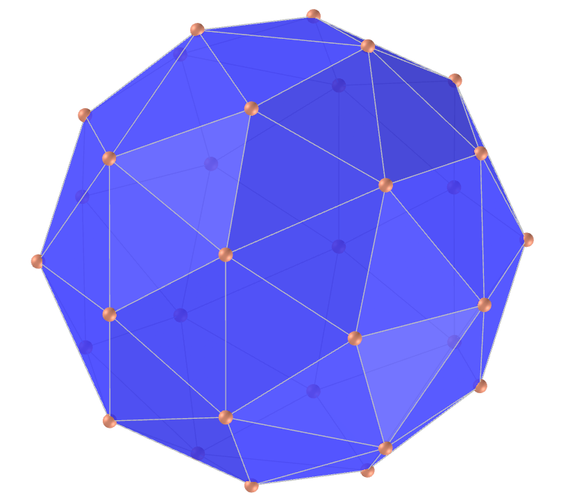

<link rel="stylesheet" href="../scripts/style.css">
<h2>Visualização de poliedros com Realidade Aumentada (RA) e Realidade Virtual (RV) em A-frame</h2>
<b>autor:</b> Paulo Henrique Siqueira - Universidade Federal do Paraná
 <b>contato:</b> <a href="#"> paulohscwb@gmail.com </a>
 <a href="https://paulohscwb.github.io/polyhedra/catalan/">english version</a>
<form style="margin: 0 auto; float:right; text-align:right; width:100%; margin-bottom:15px;">
	<select id="url" onchange="urlHandler(this.value)" style="color:royalblue;">
		<option disabled selected>Mais poliedros:</option>
		<option value="../../archimedes/pt-br/">Arquimedes</option>
		<option disabled value="../../catalan/pt-br/">Catalan</option>
		<option value="../../johnson/pt-br/">Johnson</option>
		<option value="../../nonconvex/pt-br/">Não convexos</option>
		<option value="../../platonic/pt-br/">Platão</option>
		<option value="../../polyhedron/pt-br/">Prismas e antiprismas</option>
		<option value="../../quasiregular/pt-br/">Quase regulares</option>
		<option value="../../selfintersect/pt-br/">Auto-interseção</option>
		<option value="../../selfintersectsnub/pt-br/">Auto-interseção snub</option>
		<option value="../../selfintersecttruncated/pt-br/">Auto-interseção truncados</option>
	</select>
</form>

  <h2 align="center">Poliedros de Catalan</h2>
  Os sólidos de Catalan são os duais dos sólidos de Arquimedes. Eles são nomeados em homenagem ao matemático belga Eugene Catalan (1814-1894) que descreveu pela primeira vez o conjunto completo em 1865. O Dodecaedro Rômbico e o Triacontaedro Rômbico foram descritos em 1611 por Johannes Kepler. Cada sólido de Catalan tem um tipo de face e um ângulo diedro constante, e possui a mesma simetria que seu respectivo dual de Arquimedes.
  <h4>Sala imersiva</h4>
  
<iframe width="100%" src="../salaCatalan.htm" title="Sala Imersiva de Catalan" frameborder="0" loading="lazy"></iframe>

  Para visualizar os poliedros de Catalan em RA, visite a página:

<a href="../catalan.html" target="_blank">https://paulohscwb.github.io/polyhedra/catalan.html</a>
 
com qualquer navegador com um dispositivo de webcam (smartphone, tablet ou notebook).
 O acesso às páginas de RV é feito clicando no círculo azul que aparece em cima de cada marcador.

<iframe width="560" height="315" style="max-width:100%" src="https://www.youtube.com/embed/videoseries?list=PLy0I_lGW8HxWEW5GUh83TNyIm0O2TXWEI" title="YouTube video player" frameborder="0" allow="accelerometer; autoplay; clipboard-write; encrypted-media; gyroscope; picture-in-picture; web-share" allowfullscreen></iframe>

<h4>1. Tetraedro triakis</h4>
 
  O tetraedro triakis é um dodecaedro não regular que pode ser construído como um aumento positivo de um tetraedro regular: uma pirâmide triangular adicionada a cada face. O tetraedro triakis é o poliedro dual do tetraedro truncado. Suas faces de triângulos isósceles têm ângulos dos vértices com medidas de 112.86° (uma vez) e 33.56° (duas vezes).
  <b>Faces:</b> 12 triângulos isósceles | <b>Arestas:</b> 18 | <b>Vértices:</b> 8 | <b>Ângulo diédrico:</b> 129.52°. <a href="https://mathworld.wolfram.com/TriakisTetrahedron.html" target="_blank">Mais sobre...</a>
 

 <h4>2. Dodecaedro rômbico</h4>
 
  O dodecaedro rômbico é o poliedro dual do cuboctaedro. Mais especificamente, um cubo, um octaedro e um octaedro estrelado podem ser inscritos nos vértices de um dodecaedro rômbico. Um dodecaedro rômbico aparece no canto superior direito como uma das "estrelas" poliédricas na gravura em madeira "Stars" de M. C. Escher de 1948. Os losangos de suas faces possuem ângulos dos vértices com medidas iguais a 70.53° e 109.47°.
  <b>Faces:</b> 12 losangos | <b>Arestas:</b> 24 | <b>Vértices:</b> 14 | <b>Ângulo diédrico:</b> 120°. <a href="https://mathworld.wolfram.com/RhombicDodecahedron.html" target="_blank">Mais sobre...</a>
 

 <h4>3. Hexaedro tetrakis</h4>
 
  Em geral, um hexaedro tetrakis é um icositetraedro não regular que pode ser construído como um aumento de um cubo. O hexaedro tetrakis é o poliedro dual de 24 faces do octaedro truncado. Um cubo, um octaedro e um octaedro estrelado podem ser todos inscritos nos vértices do hexaedro tetrakis. Suas faces de triângulos isósceles têm ângulos dos vértices com medidas iguais a 86.62° (uma vez) e 48.19° (duas vezes).
  <b>Faces:</b> 24 triângulos isósceles | <b>Arestas:</b> 36 | <b>Vértices:</b> 14 | <b>Ângulo diédrico:</b> 143.13°. <a href="https://mathworld.wolfram.com/TetrakisHexahedron.html" target="_blank">Mais sobre...</a>
 

 <h4>4. Octaedro triakis</h4>
 
  Em geral, um octaedro triakis é um icositetraedro não regular que pode ser construído como um aumento do octaedro regular. O octaedro triakis é o poliedro dual de 24 faces do cubo truncado. Um octaedro e um octaedro estrelado podem ser inscritos nos vértices do octaedro triakis. Suas faces de triângulos isósceles têm ângulos dos vértices com medidas iguais a 117.2° (uma vez) e 31.4° (duas vezes).
  <b>Faces:</b> 24 triângulos isósceles | <b>Arestas:</b> 36 | <b>Vértices:</b> 14 | <b>Ângulo diédrico:</b> 147.35°. <a href="https://mathworld.wolfram.com/SmallTriakisOctahedron.html" target="_blank">Mais sobre...</a>
 

 <h4>5. Icositetraedro deltoidal</h4>
 
  O icositetraedro deltoide é o poliedro dual de 24 faces do rombicuboctaedro. Um icositetraedro deltoide aparece na metade direita como uma das "estrelas" poliédricas na gravura em madeira "Stars" de M. C. Escher de 1948. Um octaedro estrelado, um octaedro atrativo 4-composto (cujo dual é um cubo atrativo 4-composto) e um cubo podem ser todos inscritos em um icositetraedro deltoide. Suas faces têm formato de "pipas" tri-equiangulares que possuem ângulos dos vértices com medidas de 94.42° (duas vezes), 71.69° (uma vez) e 99.48° (uma vez).
  <b>Faces:</b> 24 "pipas" tri-equiangulares | <b>Arestas:</b> 48 | <b>Vértices:</b> 26 | <b>Ângulo diédrico:</b> 138.12°. <a href="https://mathworld.wolfram.com/DeltoidalIcositetrahedron.html" target="_blank">Mais sobre...</a>
 

 <h4>6. Icositetraedro pentagonal</h4>
 
   O icositetraedro pentagonal é o poliedro dual de 24 faces do cubo snub. O mineral cuprita (Cu2O) se forma em cristais icositetraédricos pentagonais. Um cubo, um octaedro e um octaedro estrelado podem ser inscritos nos vértices do icositetraedro pentagonal. Suas faces pentagonais irregulares simétricas possuem ângulos dos vértices com medidas de 114.81° (quatro vezes) e 80.75° (uma vez).
  <b>Faces:</b> 24 pentágonos irregulares simétricos | <b>Arestas:</b> 60 | <b>Vértices:</b> 38 | <b>Ângulo diédrico:</b> 136.31°. <a href="https://mathworld.wolfram.com/PentagonalIcositetrahedron.html" target="_blank">Mais sobre...</a>
 

 <h4>7. Triacontaedro rômbico</h4>
 
  O triacontaedro rômbico é um zonoedro que é o poliedro dual do icosidodecaedro. As arestas que se cruzam do composto dodecaedro-icosaedro formam as diagonais de 30 losangos que compõem o triacontaedro. O cubo 5-composto possui os 30 planos faciais do triacontaedro rômbico e seu interior é um triacontaedro rômbico. Os losangos de suas faces possuem ângulos dos vértices com medidas iguais a 116.57° e 63.44°.
  <b>Faces:</b> 30 losangos | <b>Arestas:</b> 60 | <b>Vértices:</b> 32 | <b>Ângulo diédrico:</b> 144°. <a href="https://mathworld.wolfram.com/RhombicTriacontahedron.html" target="_blank">Mais sobre...</a>
 

 <h4>8. Dodecaedro disdiakis</h4>
 
  O dodecaedro disdiakis é o poliedro dual do cuboctaedro truncado de Arquimedes. A substituição de cada face do dodecaedro rômbico por uma pirâmide plana cria um poliedro que se parece com o dodecaedro disdiakis. Os triângulos acutângulos de suas faces possuem ângulos dos vértices com medidas de 87.2°, 55.03° e 37.77°. 
  <b>Faces:</b> 48 triângulos acutângulos | <b>Arestas:</b> 72 | <b>Vértices:</b> 26 | <b>Ângulo diédrico:</b> 155.08°. <a href="https://mathworld.wolfram.com/DisdyakisDodecahedron.html" target="_blank">Mais sobre...</a>
 

 <h4>9. Dodecaedro pentakis</h4>
 
  O dodecaedro pentakis é o poliedro dual de 60 faces do icosaedro truncado. Um tetraedro composto 10, um cubo composto 5, um icosaedro e um dodecaedro podem ser inscritos nos vértices do dodecaedro pentakis. Suas faces de triângulos isósceles têm ângulos dos vértices com medidas de 68.62° (uma vez) e 55.69° (duas vezes). 
  <b>Faces:</b> 60 triângulos isósceles | <b>Arestas:</b> 90 | <b>Vértices:</b> 32 | <b>Ângulo diédrico:</b> 156.72°. <a href="https://mathworld.wolfram.com/PentakisDodecahedron.html" target="_blank">Mais sobre...</a>
 

 <h4>10. Icosaedro triakis</h4>
 
  O icosaedro triakis é o poliedro dual de 60 faces do dodecaedro truncado. Um tetraedro composto 10, um cubo composto 5, um icosaedro e um dodecaedro podem ser inscritos nos vértices do icosaedro triakis. Suas faces de triângulos isósceles têm ângulos dos vértices com medidas iguais a 119.04° (uma vez) e 30.48° (duas vezes).
  <b>Faces:</b> 60 triângulos isósceles | <b>Arestas:</b> 90 | <b>Vértices:</b> 32 | <b>Ângulo diédrico:</b> 160.61°. <a href="https://mathworld.wolfram.com/TriakisIcosahedron.html" target="_blank">Mais sobre...</a>
 

 <h4>11. Hexecontaedro pentagonal</h4>
 
  O hexecontaedro pentagonal é o poliedro dual de 60 faces do dodecaedro snub. Um tetraedro composto 10, cubo composto 5, icosaedro e dodecaedro podem ser inscritos nos vértices do hexecontaedro pentagonal. Suas faces pentagonais irregulares simétricas possuem ângulos dos vértices com medidas de 118.14° (quatro vezes) e 67.45° (uma vez).
  <b>Faces:</b> 60 pentágonos irregulares simétricos | <b>Arestas:</b> 150 | <b>Vértices:</b> 92 | <b>Ângulo diédrico:</b> 153.18°. <a href="https://mathworld.wolfram.com/PentagonalHexecontahedron.html" target="_blank">Mais sobre...</a>
 

 <h4>12. Hexecontaedro deltoidal</h4>
 
  O hexecontaedro deltoide é o poliedro dual de 60 faces do rombicosidodecaedro. Um tetraedro 10-composto, um octaedro 5-composto, um cubo 5-composto, um icosaedro, um dodecaedro e um icosidodecaedro podem todos ser inscritos nos vértices do hexecontaedro deltoidal. Suas faces têm formato de "pipas" tri-equiangulares que possuem ângulos dos vértices com medidas de 86.97° (duas vezes), 67.78° (uma vez) e 118.27° (uma vez). 
  <b>Faces:</b> 60 "pipas" tri-equiangulares | <b>Arestas:</b> 120 | <b>Vértices:</b> 62 | <b>Ângulo diédrico:</b> 154.12°. <a href="https://mathworld.wolfram.com/DeltoidalHexecontahedron.html" target="_blank">Mais sobre...</a>
 

 <h4>13. Triacontaedro disdiakis</h4>
 
  O triacontaedro disdiakis é o poliedro dual do icosidodecaedro truncado de Arquimedes. Um tetraedro 10-composto, um octaedro 5-composto, um cubo 5-composto, um icosaedro, um dodecaedro e um icosidodecaedro podem ser inscritos nos vértices de um triacontaedro disdiakis. Os triângulos acutângulos de suas faces possuem ângulos dos vértices com medidas de 88.99°, 58.24° e 32.77°.
  <b>Faces:</b> 120 triângulos acutângulos | <b>Arestas:</b> 180 | <b>Vértices:</b> 62 | <b>Ângulo diédrico:</b> 164.89°. <a href="https://mathworld.wolfram.com/DisdyakisTriacontahedron.html" target="_blank">Mais sobre...</a>

<a href="#p3" class="topo">voltar ao topo</a>
 

  Polyhedra: Catalan de <a xmlns:cc="http://creativecommons.org/ns#" href="https://paulohscwb.github.io/polyhedra/catalan/" property="cc:attributionName" rel="cc:attributionURL">Paulo Henrique Siqueira</a> está licenciado com uma Licença <a rel="license" href="http://creativecommons.org/licenses/by-nc-nd/4.0/">Creative Commons Atribuição-NãoComercial-SemDerivações 4.0 Internacional</a>.

<h4>Como citar este trabalho:</h4> 

Siqueira, P.H., "Polyhedra". Disponível em: <https://paulohscwb.github.io/polyhedra/catalan/>, Agosto de 2022.

 <b>Referências:</b>
 Weisstein, Eric W. "Archimedean Solid" From MathWorld-A Wolfram Web Resource. <a href="http://mathworld.wolfram.com/ArchimedeanSolid.html" target="_blank">http://mathworld.wolfram.com/ArchimedeanSolid.html</a>
 Weisstein, Eric W. "Platonic Solid" From MathWorld-A Wolfram Web Resource. <a href="http://mathworld.wolfram.com/PlatonicSolid.html" target="_blank">http://mathworld.wolfram.com/PlatonicSolid.html</a>
 Weisstein, Eric W. "Archimedean Dual" From MathWorld-A Wolfram Web Resource. <a href="https://mathworld.wolfram.com/ArchimedeanDual.html" target="_blank">https://mathworld.wolfram.com/ArchimedeanDual.html</a>
 Weisstein, Eric W. "Uniform Polyhedron." From MathWorld--A Wolfram Web Resource. <a href="https://mathworld.wolfram.com/UniformPolyhedron.html" target="_blank">https://mathworld.wolfram.com/UniformPolyhedron.html</a>
 Wikipedia <a href="https://en.wikipedia.org/wiki/Archimedean_solid" target="_blank">https://en.wikipedia.org/wiki/Archimedean_solid</a>
 Wikipedia <a href="https://en.wikipedia.org/wiki/en.wikipedia.org/wiki/Platonic_solid" target="_blank">https://en.wikipedia.org/wiki/Platonic_solid</a>
 McCooey, David I. "Visual Polyhedra". <a href="http://dmccooey.com/polyhedra/" target="_blank">http://dmccooey.com/polyhedra/</a>
