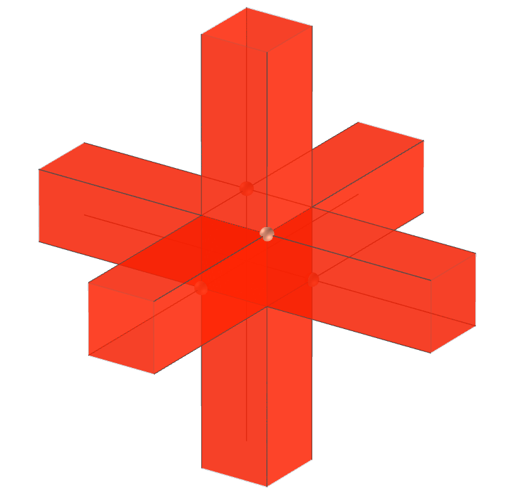
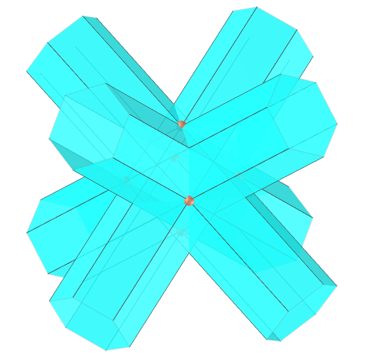
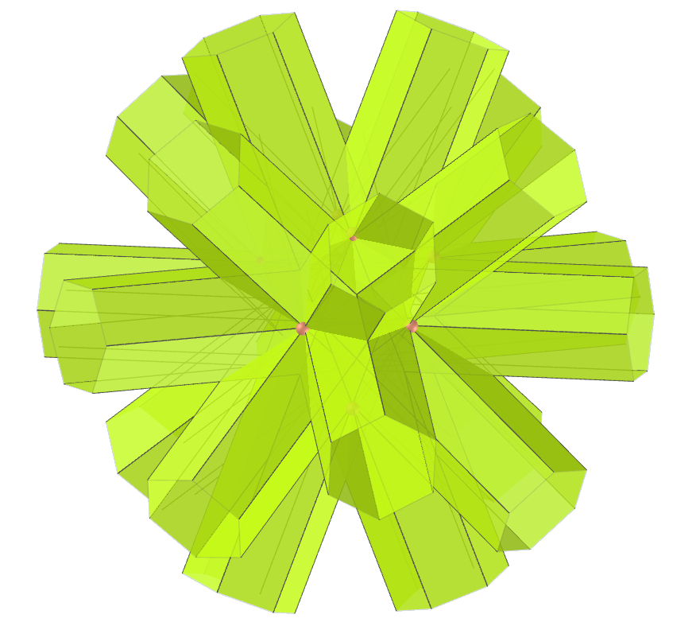

<link rel="stylesheet" href="../scripts/style.css">
<link rel="icon" type="image/png" href="vr/salas/imagens/icone.png">
<h2>Visualization of polyhedra with Augmented Reality (AR) and Virtual Reality (VR) in A-frame</h2>
 <b>author:</b> Paulo Henrique Siqueira - Universidade Federal do Paraná
  <b>contact:</b> <a href="#">paulohscwb@gmail.com</a>
  <a href="https://paulohscwb.github.io/polyhedra/infinity/pt-br/">versão em português</a>
 <form style="margin: 0 auto; float:right; text-align:right; width:100%; margin-bottom:15px;">
	<select id="url" onchange="urlHandler(this.value)" style="color:royalblue;">
		<option disabled selected value>More polyhedra:</option>
		<option value="../archimedes/">Archimedes</option>
		<option value="../catalan/">Catalan</option>
		<option value="../nonconvex/">Non convex</option>
		<option value="../platonic/">Platonic</option>
		<option value="../polyhedron/">Prisms and antiprisms</option>
		<option value="../quasiregular/">Quasi regular</option>
		<option value="../selfintersect/">Self-intersecting</option>
		<option value="../selfintersectsnub/">Self-intersecting snub</option>
		<option value="../selfintersecttruncated/">Self intersecting truncated</option>
		<option value="../johnson1/">Johnson: 1-32</option>
		<option value="../johnson2/">Johnson: 33-62</option>
		<option value="../johnson3/">Johnson: 63-92</option>
		<option disabled value="../infinity/">Stellation to infinity</option>
	</select>
</form>

  <h2 align="center"> Stellation to infinity polyhedra</h2>
Since the hemipolyhedra have faces passing through the center, the dual figures have corresponding vertices at infinity. This polyhedra are represented with intersecting prisms, each extending in both directions to the same vertex at infinity, in order to maintain symmetry. 

<a href="#ra">Augmented Reality</a>&nbsp;&nbsp;|&nbsp;&nbsp;<a href="#m3d">3D Models</a>&nbsp;&nbsp;|&nbsp;&nbsp;<a href="../">Home</a>

  

  <h3 align="center">Immersive room</h3>
  
<iframe width="100%" src="sala.htm" title="Sala Imersiva de Estrelação ao infinito" frameborder="0" loading="lazy"></iframe>

  
<a href="sala.htm" target="_blank">&#x1f517; room link</a>

 

  <h3 id="ra" align="center">Augmented Reality</h3>
To view stellation to infinity polyhedra in AR, simply visit:

<a href="ra.html" target="_blank">https://paulohscwb.github.io/polyhedra/infinity/ra.html</a>
 
with any browser with a webcam device (smartphone, tablet or notebook). 
 Access to the VR sites is done by clicking on the blue circle that appears on top of the marker.

<h3 id="m3d" align="center">3D models</h3>
<iframe width="560" height="315" style="max-width:100%" src="https://www.youtube.com/embed/videoseries?list=PLy0I_lGW8HxU-mneUmSsccpRAAwbErHFq" title="YouTube video player" frameborder="0" allow="accelerometer; autoplay; clipboard-write; encrypted-media; gyroscope; picture-in-picture; web-share" allowfullscreen></iframe>
<h4>1. Tetrahemihexacron</h4>

  The tetrahemihexacron is the dual of the tetrahemihexahedron. Because the tetrahemihexahedron has three faces going through its middle, three of the tetrahemihexacron's vertices are at an ideal points infinitely far away from the origin in projective space. This is usually represented in images and models by three prisms extending an arbitrarily long distance.
  <b>Faces:</b> 6 polygons | <b>Edges:</b> 12 | <b>Vertices:</b> 7 (3 at infinity)  | <b>Dihedral angle:</b> 90°. <a href="https://polytope.miraheze.org/wiki/Tetrahemihexacron" target="_blank">More...</a>

<h4>2. Octahemioctacron</h4>

  The octahemioctacron is the dual of the octahemioctahedron. Because the latter polyhedron has four faces going through its middle, four of the octahemioctacron's vertices are at an ideal points infinitely far away from the origin in projective space. This is usually represented in images and models by prisms extending an arbitrarily long distance. It appears the same as the hexahemioctacron. 
  <b>Faces:</b> 12 polygons | <b>Edges:</b> 24 | <b>Vertices:</b> 12 (4 at infinity)  | <b>Dihedral angle:</b> 54.74°. <a href="https://polytope.miraheze.org/wiki/Octahemioctacron" target="_blank">More...</a>

<h4>3. Hexahemioctacron</h4>

  The hexahemioctacron is the dual of the cubohemioctahedron. Because the cubohemioctahedron has four faces going through its middle, four of the hexahemioctacron's vertices are at infinity on the real projective plane. This is usually represented in images and models by prisms extending an arbitrarily long distance. This model appears the same as the the analygous model for the octahemioctacron. 
  <b>Faces:</b> 12 polygons | <b>Edges:</b> 24 | <b>Vertices:</b> 10 (4 at infinity)  | <b>Dihedral angle:</b> 54.74°. <a href="https://polytope.miraheze.org/wiki/Hexahemioctacron" target="_blank">More...</a>

<h4>4. Great dodecahemicosacron</h4>

  The great dodecahemicosacron is the dual of the great dodecahemicosahedron. Because the great dodecahemicosahedron has ten faces going through its middle, ten of the great dodecahemicosacron's vertices are at an ideal points infinitely far away from the origin in projective space. This is usually represented in images and models by prisms extending an arbitrarily long distance. It appears the same as the small dodecahemicosacron. 
  <b>Faces:</b> 30 polygons | <b>Edges:</b> 60 | <b>Vertices:</b> 22 (10 at infinity)  | <b>Dihedral angle:</b> 37.38°. <a href="https://polytope.miraheze.org/wiki/Great_dodecahemicosacron" target="_blank">More...</a>

<h4>5. Small dodecahemicosacron</h4>

  The small dodecahemicosacron is the dual of the small dodecahemicosahedron. Because the small dodecahemicosahedron has ten faces going through its middle, ten of the small dodecahemicosacron's vertices are at an ideal points infinitely far away from the origin in projective space. This is usually represented in images and models by prisms extending an arbitrarily long distance. It appears the same as the great dodecahemicosacron.  
  <b>Faces:</b> 30 polygons | <b>Edges:</b> 60 | <b>Vertices:</b> 22 (10 at infinity)  | <b>Dihedral angle:</b> 37.38°. <a href="https://polytope.miraheze.org/wiki/Small_dodecahemicosacron" target="_blank">More...</a>

<h4>6. Small icosihemidodecacron</h4>

  The small icosihemidodecacron is the dual of the small  icosihemidodecahedron. Because the small icosihemidodecahedron has six faces going through its middle, six of the small icosihemidodecacron's vertices are at an ideal points infinitely far away from the origin in projective space. This is usually represented in images and models by prisms extending an arbitrarily long distance. It appears the same as the small dodecahemidodecacron.   
  <b>Faces:</b> 30 polygons | <b>Edges:</b> 60 | <b>Vertices:</b> 26 (6 at infinity)  | <b>Dihedral angle:</b> 63.43°. <a href="https://polytope.miraheze.org/wiki/Small_icosihemidodecacron" target="_blank">More...</a>

<h4>7. Small dodecahemidodecacron</h4>

  The small dodecahemidodecacron is the dual of the small dodecahemidodecahedron. Because the small dodecahemidodecahedron has six faces going through its middle, six of the small dodecahemidodecacron's vertices are at an ideal points infinitely far away from the origin in projective space. This is usually represented in images and models by prisms extending an arbitrarily long distance. It appears the same as the small icosihemidodecacron.  
  <b>Faces:</b> 30 polygons | <b>Edges:</b> 60 | <b>Vertices:</b> 18 (6 at infinity)  | <b>Dihedral angle:</b> 63.43°. <a href="https://polytope.miraheze.org/wiki/Small_dodecahemidodecacron" target="_blank">More...</a>

<h4>8. Great icosihemidodecacron</h4>

  The great icosihemidodecacron is the dual of the great  icosihemidodecahedron. Because the great icosihemidodecahedron has six faces going through its middle, six of the great icosihemidodecacron's vertices are at an ideal points infinitely far away from the origin in projective space. This is usually represented in images and models by prisms extending an arbitrarily long distance. It appears the same as the great dodecahemidodecacron.   
  <b>Faces:</b> 30 polygons | <b>Edges:</b> 60 | <b>Vertices:</b> 26 (6 at infinity)  | <b>Dihedral angle:</b> 63.43°. <a href="https://polytope.miraheze.org/wiki/Great_icosihemidodecacron" target="_blank">More...</a>

<h4>9. Great dodecahemidodecacron</h4>

  The great dodecahemidodecacron is the dual of the great dodecahemidodecahedron. Because the great dodecahemidodecahedron has six faces going through its middle, six of the great dodecahemidodecacron's vertices are at an ideal points infinitely far away from the origin in projective space. This is usually represented in images and models by prisms extending an arbitrarily long distance. It appears the same as the great icosihemidodecacron.  
  <b>Faces:</b> 30 polygons | <b>Edges:</b> 60 | <b>Vertices:</b> 18 (6 at infinity)  | <b>Dihedral angle:</b> 63.43°. <a href="https://polytope.miraheze.org/wiki/Great_dodecahemidodecacron" target="_blank">More...</a>

<h4>10. Great dirhombicosidodecacron</h4>

  The great dirhombicosidodecacron is the dual of the great dirhombicosidodecahedron. Because the great dirhombicosidodecahedron has 60 faces going through its middle, 60 of the great dirhombicosidodecacron's vertices are at an ideal points infinitely far away from the origin in projective space. This is usually represented in images and models by prisms extending an arbitrarily long distance.  
  <b>Faces:</b> 60 polygons | <b>Edges:</b> 240 | <b>Vertices:</b> 124 (60 at infinity)  | <b>Dihedral angle:</b> 54.73°. <a href="https://polytope.miraheze.org/wiki/Great_dirhombicosidodecacron" target="_blank">More...</a>

<a href="#p14" class="topo">back to top</a>

  Stellation to infinity polyhedra - Visualization of polyhedra with Augmented Reality and Virtual Reality by <a xmlns:cc="http://creativecommons.org/ns#" href="https://paulohscwb.github.io/polyhedra/infinity/" property="cc:attributionName" rel="cc:attributionURL">Paulo Henrique Siqueira</a> is licensed with a license <a rel="license" href="http://creativecommons.org/licenses/by-nc-nd/4.0/">Creative Commons Attribution-NonCommercial-NoDerivatives 4.0 International</a>.

<h4>How to cite this work:</h4> 

Siqueira, P.H., "Stellation to infinity polyhedra - Visualization of polyhedra with Augmented Reality and Virtual Reality". Available in: <https://paulohscwb.github.io/polyhedra/infinity/>, August 2023.

  <b>References:</b>
 Weisstein, Eric W. "Archimedean Solid" From MathWorld-A Wolfram Web Resource. <a href="http://mathworld.wolfram.com/ArchimedeanSolid.html" target="_blank">http://mathworld.wolfram.com/ArchimedeanSolid.html</a>
 Weisstein, Eric W. "Platonic Solid" From MathWorld-A Wolfram Web Resource. <a href="http://mathworld.wolfram.com/PlatonicSolid.html" target="_blank">http://mathworld.wolfram.com/PlatonicSolid.html</a>
 Weisstein, Eric W. "Archimedean Dual" From MathWorld-A Wolfram Web Resource. <a href="https://mathworld.wolfram.com/ArchimedeanDual.html" target="_blank">https://mathworld.wolfram.com/ArchimedeanDual.html</a>
 Weisstein, Eric W. "Uniform Polyhedron." From MathWorld--A Wolfram Web Resource. <a href="https://mathworld.wolfram.com/UniformPolyhedron.html" target="_blank">https://mathworld.wolfram.com/UniformPolyhedron.html</a>
 Wikipedia <a href="https://en.wikipedia.org/wiki/Archimedean_solid" target="_blank">https://en.wikipedia.org/wiki/Archimedean_solid</a>
 Wikipedia <a href="https://en.wikipedia.org/wiki/en.wikipedia.org/wiki/Platonic_solid" target="_blank">https://en.wikipedia.org/wiki/Platonic_solid</a>
 McCooey, David I. "Visual Polyhedra". <a href="http://dmccooey.com/polyhedra/" target="_blank">http://dmccooey.com/polyhedra/</a>
