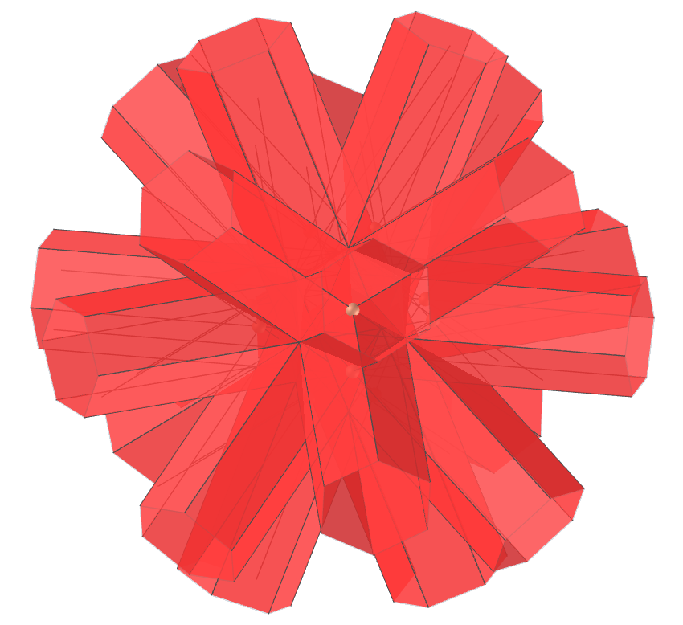
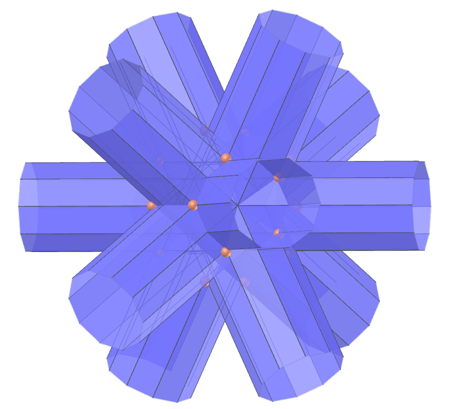
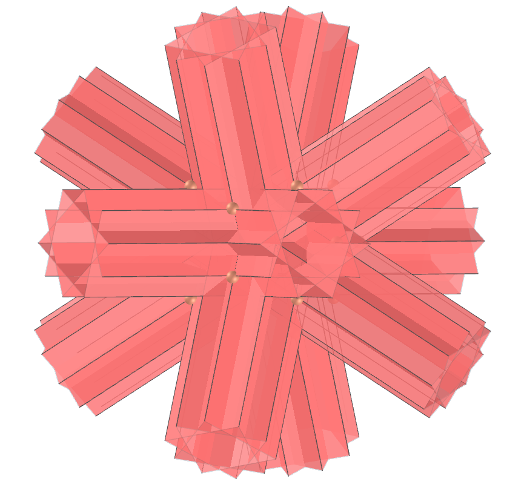
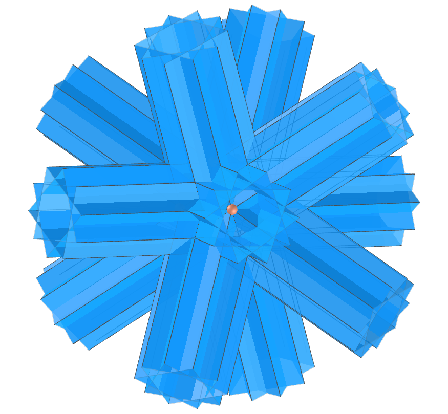

<link rel="stylesheet" href="../../scripts/style.css">
<link rel="icon" type="image/png" href="../vr/salas/imagens/icone.png">
<h2>Visualização de poliedros com Realidade Aumentada (RA) e Realidade Virtual (RV) em A-frame</h2>
<b>autor:</b> Paulo Henrique Siqueira - Universidade Federal do Paraná
 <b>contato:</b> <a href="#"> paulohscwb@gmail.com </a>
 <a href="https://paulohscwb.github.io/polyhedra/infinity/">english version</a>
<form style="margin: 0 auto; float:right; text-align:right; width:100%; margin-bottom:15px;">
	<a href="../../pt-br/">Página Inicial</a>
	 <select id="url" onchange="urlHandler(this.value)" style="color:royalblue;">
		<option disabled selected>Mais poliedros:</option>
		<option value="../../archimedes/pt-br/">Arquimedes</option>
		<option value="../../catalan/pt-br/">Catalan</option>
		<option value="../../nonconvex/pt-br/">Não convexos</option>
		<option value="../../platonic/pt-br/">Platão</option>
		<option value="../../polyhedron/pt-br/">Prismas e antiprismas</option>
		<option value="../../quasiregular/pt-br/">Quase regulares</option>
		<option value="../../selfintersect/pt-br/">Auto-interseção</option>
		<option value="../../selfintersectsnub/pt-br/">Auto-interseção snub</option>
		<option value="../../selfintersecttruncated/pt-br/">Auto-interseção truncados</option>
		<option value="../../johnson1/pt-br/">Johnson: 1-32</option>
		<option value="../../johnson2/pt-br/">Johnson: 33-62</option>
		<option value="../../johnson3/pt-br/">Johnson: 63-92</option>
		<option disabled value="../../infinity/">Estrelação ao infinito</option>
	</select>
</form>

  <h2 align="center"> Poliedros de estrelação ao infinito</h2>
  Como os hemipoliedros têm faces passando pelo centro, as figuras duais têm vértices correspondentes no infinito. Esses poliedros são representados com prismas que se cruzam, cada um estendendo-se em ambas as direções para o mesmo vértice no infinito, a fim de manter a simetria.
  

  Para visualizar os poliedros de estrelação ao infinito em RA, visite a página:

<a href="../ra.html" target="_blank">https://paulohscwb.github.io/polyhedra/infinity/ra.html</a>
 
com qualquer navegador com um dispositivo de webcam (smartphone, tablet ou notebook).
 O acesso às páginas de RV é feito clicando no círculo azul que aparece em cima de cada marcador.

 

<h4>1. Tetrahemihexacron</h4>

  O tetrahemihexacron é o dual do tetrahemihexaedro. Como o tetrahemihexaedro tem três faces passando pelo centro, três dos vértices do tetrahemihexacron estão em pontos ideais infinitamente distantes da origem no espaço projetivo. Isso geralmente é representado em imagens e modelos por três prismas que se estendem por uma distância arbitrariamente longa.
  <b>Faces:</b> 6 polígonos | <b>Arestas:</b> 12 | <b>Vértices:</b> 7 (3 no infinito) | <b>Ângulo diédrico:</b> 90°. <a href="https://polytope.miraheze.org/wiki/Tetrahemihexacron" target="_blank">Mais sobre...</a>

<h4>2. Octahemioctacron</h4>

  O octahemioctacron é o dual do octahemioctaedro. Como o octahemioctaedro tem quatro faces passando pelo meio, quatro dos vértices do octahemioctacron estão em pontos ideais infinitamente distantes da origem no espaço projetivo. Isso geralmente é representado em imagens e modelos por prismas que se estendem por uma distância arbitrariamente longa. Parece o mesmo que o hexahemioctacron.
  <b>Faces:</b> 12 polígonos | <b>Arestas:</b> 24 | <b>Vértices:</b> 12 (4 no infinito) | <b>Ângulo diédrico:</b> 54.74°. <a href="https://polytope.miraheze.org/wiki/Octahemioctacron" target="_blank">Mais sobre...</a>

<h4>3. Hexahemioctacron</h4>

  O hexahemioctacron é o dual do cubohemioctaedro. Como o cubohemioctaedro tem quatro faces passando pelo meio, quatro dos vértices do hexahemioctacron estão no infinito no plano projetivo real. Isso geralmente é representado em imagens e modelos por prismas que se estendem por uma distância arbitrariamente longa. Este modelo parece o mesmo que o modelo análogo para o octahemioctacron.
  <b>Faces:</b> 12 polígonos | <b>Arestas:</b> 24 | <b>Vértices:</b> 10 (4 no infinito) | <b>Ângulo diédrico:</b> 54.74°. <a href="https://polytope.miraheze.org/wiki/Hexahemioctacron" target="_blank">Mais sobre...</a>

<h4>4. Grande dodecahemicosacron</h4>

  O grande dodecahemicosacron é o dual do grande dodecahemicosaedro. Como o grande dodecahemicosaedro tem dez faces passando pelo meio, dez dos vértices do grande dodecahemicosacron estão em pontos ideais infinitamente distantes da origem no espaço projetivo. Isso geralmente é representado em imagens e modelos por prismas que se estendem por uma distância arbitrariamente longa. É parecido com o pequeno dodecahemicosacron.
  <b>Faces:</b> 30 polígonos | <b>Arestas:</b> 60 | <b>Vértices:</b> 22 (10 no infinito) | <b>Ângulo diédrico:</b> 37.38°. <a href="https://polytope.miraheze.org/wiki/Great_dodecahemicosacron" target="_blank">Mais sobre...</a>

<h4>5. Pequeno dodecahemicosacron</h4>

  O pequeno dodecahemicosacron é o dual do pequeno dodecahemicosaedro. Como o pequeno dodecahemicosaedro tem dez faces passando pelo meio, dez dos vértices do pequeno dodecahemicosacron estão em pontos ideais infinitamente distantes da origem no espaço projetivo. Isso geralmente é representado em imagens e modelos por prismas que se estendem por uma distância arbitrariamente longa. É parecido com o grande dodecahemicosacron.
  <b>Faces:</b> 30 polígonos | <b>Arestas:</b> 60 | <b>Vértices:</b> 22 (10 no infinito) | <b>Ângulo diédrico:</b> 37.38°. <a href="https://polytope.miraheze.org/wiki/Small_dodecahemicosacron" target="_blank">Mais sobre...</a>

<h4>6. Pequeno icosihemidodecacron</h4>

  O pequeno icosihemidodecacron é o dual do pequeno icosihemidodecaedro. Como o pequeno icosihemidodecaedro tem seis faces passando pelo meio, seis dos vértices do pequeno icosihemidodecacron estão em pontos ideais infinitamente distantes da origem no espaço projetivo. Isso geralmente é representado em imagens e modelos por prismas que se estendem por uma distância arbitrariamente longa. É parecido com o pequeno dodecahemidodecacron.
  <b>Faces:</b> 30 polígonos | <b>Arestas:</b> 60 | <b>Vértices:</b> 26 (6 no infinito) | <b>Ângulo diédrico:</b> 63.43°. <a href="https://polytope.miraheze.org/wiki/Small_icosihemidodecacron" target="_blank">Mais sobre...</a>

<h4>7. Pequeno dodecahemidodecacron</h4>

  O pequeno dodecahemidodecacron é o dual do pequeno dodecahemidodecaedro. Como o pequeno dodecahemidodecaedro tem seis faces passando pelo meio, seis dos vértices do pequeno dodecahemidodecacron estão em pontos ideais infinitamente distantes da origem no espaço projetivo. Isso geralmente é representado em imagens e modelos por prismas que se estendem por uma distância arbitrariamente longa. É parecido com o pequeno icosihemidodecacron.
  <b>Faces:</b> 30 polígonos | <b>Arestas:</b> 60 | <b>Vértices:</b> 18 (6 no infinito) | <b>Ângulo diédrico:</b> 63.43°. <a href="https://polytope.miraheze.org/wiki/Small_dodecahemidodecacron" target="_blank">Mais sobre...</a>

<h4>8. Grande icosihemidodecacron</h4>

  O grande icosihemidodecacron é o dual do grande icosihemidodecaedro. Como o grande icosihemidodecaedro tem seis faces passando pelo meio, seis dos vértices do grande icosihemidodecacron estão em pontos ideais infinitamente distantes da origem no espaço projetivo. Isso geralmente é representado em imagens e modelos por prismas que se estendem por uma distância arbitrariamente longa. É parecido com o grande dodecahemidodecacron.
  <b>Faces:</b> 30 polígonos | <b>Arestas:</b> 60 | <b>Vértices:</b> 26 (6 no infinito) | <b>Ângulo diédrico:</b> 63.43°. <a href="hhttps://polytope.miraheze.org/wiki/Great_icosihemidodecacron" target="_blank">Mais sobre...</a>

<h4>9. Grande dodecahemidodecacron</h4>

  O grande dodecahemidodecacron é o dual do grande dodecahemidodecaedro. Como o grande dodecahemidodecaedro tem seis faces passando pelo meio, seis dos vértices do grande dodecahemidodecacron estão em pontos ideais infinitamente distantes da origem no espaço projetivo. Isso geralmente é representado em imagens e modelos por prismas que se estendem por uma distância arbitrariamente longa. É parecido com o grande icosihemidodecacron.
  <b>Faces:</b> 30 polígonos | <b>Arestas:</b> 60 | <b>Vértices:</b> 18 (6 no infinito) | <b>Ângulo diédrico:</b> 63.43°. <a href="https://polytope.miraheze.org/wiki/Great_dodecahemidodecacron" target="_blank">Mais sobre...</a>

<a href="#p14" class="topo">voltar ao topo</a>

 
  Stellation to infinity polyhedra - Visualization of polyhedra with Augmented Reality and Virtual Reality de <a xmlns:cc="http://creativecommons.org/ns#" href="https://paulohscwb.github.io/polyhedra/infinity/" property="cc:attributionName" rel="cc:attributionURL">Paulo Henrique Siqueira</a> está licenciado com uma Licença <a rel="license" href="http://creativecommons.org/licenses/by-nc-nd/4.0/">Creative Commons Atribuição-NãoComercial-SemDerivações 4.0 Internacional</a>.

<h4>Como citar este trabalho:</h4> 

Siqueira, P.H., "Stellation to infinity polyhedra - Visualization of polyhedra with Augmented Reality and Virtual Reality". Disponível em: <https://paulohscwb.github.io/polyhedra/quasiregular/>, Agosto de 2023.

 <b>Referências:</b>
 Weisstein, Eric W. "Archimedean Solid" From MathWorld-A Wolfram Web Resource. <a href="http://mathworld.wolfram.com/ArchimedeanSolid.html" target="_blank">http://mathworld.wolfram.com/ArchimedeanSolid.html</a>
 Weisstein, Eric W. "Platonic Solid" From MathWorld-A Wolfram Web Resource. <a href="http://mathworld.wolfram.com/PlatonicSolid.html" target="_blank">http://mathworld.wolfram.com/PlatonicSolid.html</a>
 Weisstein, Eric W. "Archimedean Dual" From MathWorld-A Wolfram Web Resource. <a href="https://mathworld.wolfram.com/ArchimedeanDual.html" target="_blank">https://mathworld.wolfram.com/ArchimedeanDual.html</a>
 Weisstein, Eric W. "Uniform Polyhedron." From MathWorld--A Wolfram Web Resource. <a href="https://mathworld.wolfram.com/UniformPolyhedron.html" target="_blank">https://mathworld.wolfram.com/UniformPolyhedron.html</a>
 Wikipedia <a href="https://en.wikipedia.org/wiki/Archimedean_solid" target="_blank">https://en.wikipedia.org/wiki/Archimedean_solid</a>
 Wikipedia <a href="https://en.wikipedia.org/wiki/en.wikipedia.org/wiki/Platonic_solid" target="_blank">https://en.wikipedia.org/wiki/Platonic_solid</a>
 McCooey, David I. "Visual Polyhedra". <a href="http://dmccooey.com/polyhedra/" target="_blank">http://dmccooey.com/polyhedra/</a>
