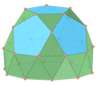
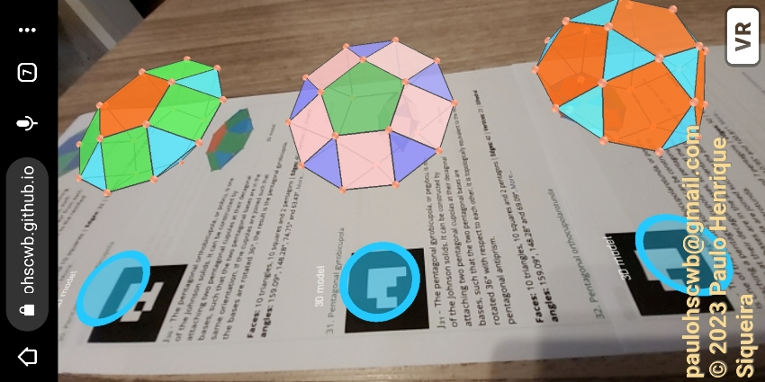
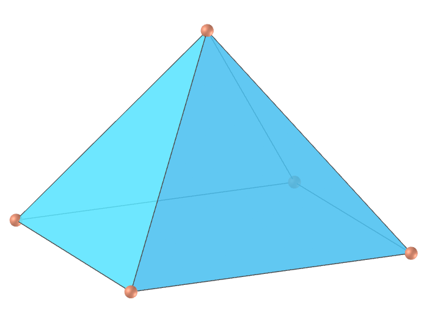
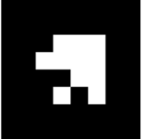
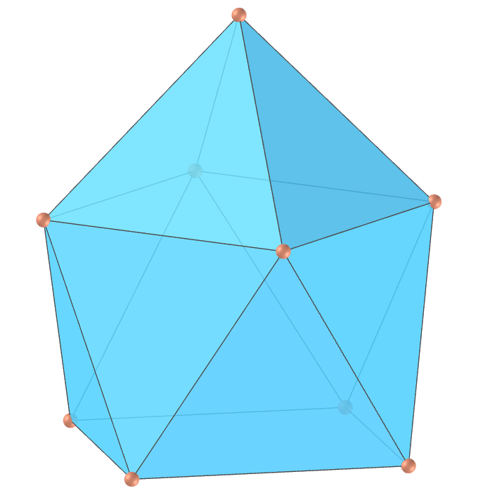
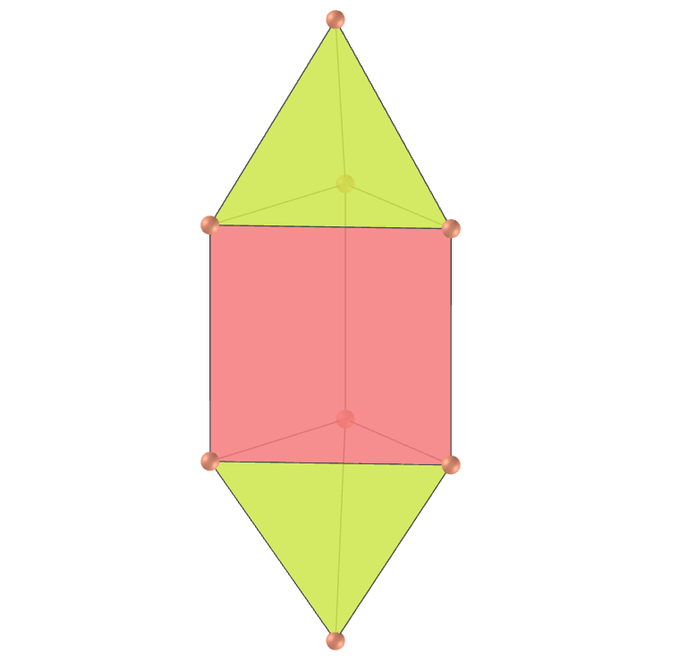
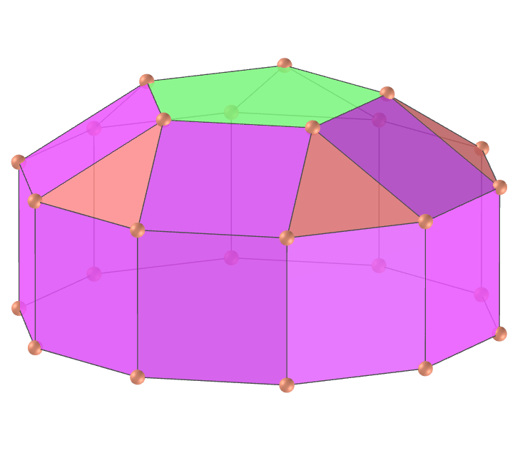
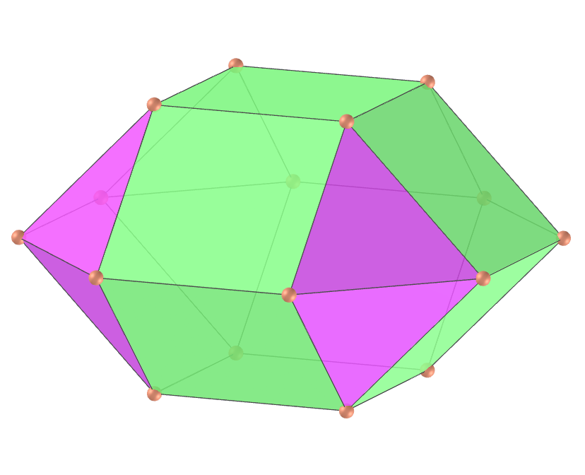
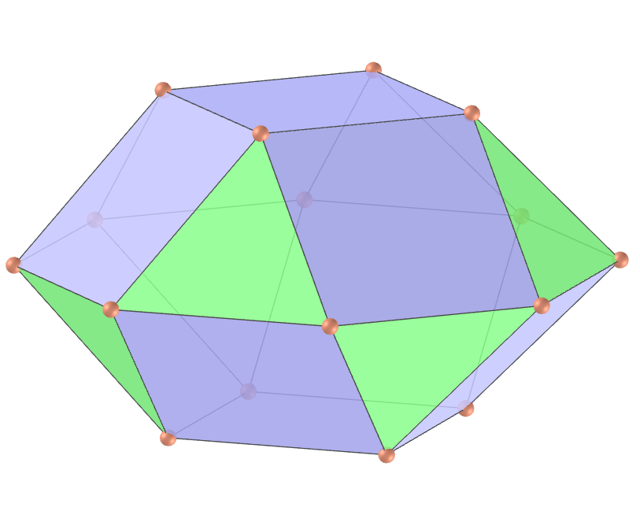

<link rel="stylesheet" href="../scripts/style.css">
<link rel="icon" type="image/png" href="vr/salas/imagens/icone.png">
<h2>Visualization of polyhedra with Augmented Reality (AR) and Virtual Reality (VR) in A-frame</h2>
 <b>author:</b> Paulo Henrique Siqueira - Universidade Federal do Paraná
  <b>contact:</b> <a href="#">paulohscwb@gmail.com</a>
  <a href="https://paulohscwb.github.io/polyhedra/johnson1/pt-br/">versão em português</a>
<form style="margin: 0 auto; float:right; text-align:right; width:100%; margin-bottom:15px;">
	<select id="url" onchange="urlHandler(this.value)" style="color:royalblue;">
		<option disabled selected value>More polyhedra:</option>
		<option value="../archimedes/">Archimedes</option>
		<option value="../catalan/">Catalan</option>
		<option value="../nonconvex/">Non convex</option>
		<option value="../platonic/">Platonic</option>
		<option value="../polyhedron/">Prisms and antiprisms</option>
		<option value="../quasiregular/">Quasi regular</option>
		<option value="../selfintersect/">Self-intersecting</option>
		<option value="../selfintersectsnub/">Self-intersecting snub</option>
		<option value="../selfintersecttruncated/">Self intersecting truncated</option>
		<option disabled value="../johnson1/">Johnson: 1-32</option>
		<option value="../johnson2/">Johnson: 33-62</option>
		<option value="../johnson3/">Johnson: 63-92</option>
		<option value="../infinity/">Stellation to infinity</option>
	</select>
</form>

  <h2 align="center"> Johnson solids - part 1: J1 - J32</h2>
  A Johnson solid is a strictly convex regular-faced polyhedron that is not uniform. They are named after Norman Woodason Johnson, who in 1966 first listed all 92 such polyhedra. In this first part, we have first 32 Johnson solids. 
  
<a href="#ra">Augmented Reality</a>&nbsp;&nbsp;|&nbsp;&nbsp;<a href="#m3d">3D Models</a>&nbsp;&nbsp;|&nbsp;&nbsp;<a href="../">Home</a>

  <h3 align="center">Immersive rooms</h3>
  
<iframe width="100%" src="sala1.htm" title="Sala Imersiva dos Sólidos de Johnson - parte 1" frameborder="0" loading="lazy"></iframe>

  
<a href="sala1.htm" target="_blank">&#x1f517; room 1</a>&nbsp;&nbsp;|&nbsp;&nbsp;<a href="sala2.htm" target="_blank">&#x1f517; room 2</a>&nbsp;&nbsp;|&nbsp;&nbsp;<a href="sala3.htm" target="_blank">&#x1f517; room 3</a>

  

  <h3 id="ra" align="center">Augmented Reality</h3>
  To view Johnson solids in AR, simply visit:

<a href="ra.html" target="_blank">https://paulohscwb.github.io/polyhedra/johnson1/ra.html</a>
 
with any browser with a webcam device (smartphone, tablet or notebook). 
 Access to the VR sites is done by clicking on the blue circle that appears on top of the marker.

<h3 id="m3d" align="center">3D models</h3>
<iframe width="560" height="315" style="max-width:100%" src="https://www.youtube.com/embed/videoseries?list=PLy0I_lGW8HxUrm2hnJT1nvSPbFAYYJWmh" title="YouTube video player" frameborder="0" allow="accelerometer; autoplay; clipboard-write; encrypted-media; gyroscope; picture-in-picture; web-share" allowfullscreen></iframe>
<h4>1. Square pyramid</h4>

  J1 The square pyramid, or squippy, is a pyramid with a square base and 4 triangles as sides. The version with equilateral triangles as sides is the first of the 92 Johnson solids. Two square pyramids can be joined together at their square base to form a regular octahedron.
  <b>Faces:</b> 4 triangles (side faces), 1 square (base) | <b>Edges:</b> 8 | <b>Vertices:</b> 5 | <b>Dihedral angles:</b> 109.47° and 54.74°. <a href="https://polytope.miraheze.org/wiki/Square_pyramid" target="_blank">More...</a>

<h4>2. Pentagonal pyramid</h4>

  J2 The pentagonal pyramid, or peppy, is a pyramid with a pentagonal base and 5 triangles as sides. The version with equilateral triangles as sides is the second of the 92 Johnson solids. It is the vertex-first cap of the icosahedron. A regular icosahedron can be constructed by attaching two pentagonal pyramids to the bases of a pentagonal antiprism.
  <b>Faces:</b> 5 triangles (side faces) and 1 pentagon (base) | <b>Edges:</b> 10 | <b>Vertices:</b> 6 | <b>Dihedral angles:</b> 138.19° and 37.38°. <a href="https://polytope.miraheze.org/wiki/Pentagonal_pyramid" target="_blank">More...</a>

<h4>3. Triangular cupola</h4>

  J3 The triangular cupola, or tricu, is one of the 92 Johnson solids. It is a cupola based on the equilateral triangle, and is one of three Johnson cupolas, the other two being the square cupola and the pentagonal cupola.
  <b>Faces:</b> 4 triangles, 3 squares and 1 hexagon | <b>Edges:</b> 15 | <b>Vertices:</b> 9 | <b>Dihedral angles:</b> 125.26°, 70.53° and 54.74°. <a href="https://polytope.miraheze.org/wiki/Triangular_cupola" target="_blank">More...</a>

<h4>4. Square cupola</h4>

  J4 The square cupola, or squacu, is one of the Johnson solids. It is a cupola based on the square, and is one of three Johnson cupolas. It can be obtained as a segment of the small rhombicuboctahedron, when considered as an elongated square orthobicupola.
  <b>Faces:</b> 4 triangles, 5 squares and 1 octagon | <b>Edges:</b> 20 | <b>Vertices:</b> 12 | <b>Dihedral angles:</b> 144.74°, 135°, 45° and 54.74°. <a href="https://polytope.miraheze.org/wiki/Square_cupola" target="_blank">More...</a>

<h4>5. Pentagonal cupola</h4>

  J5 The pentagonal cupola, or pecu, is one of the Johnson solids. It is a cupola based on the pentagon, and is one of three Johnson cupolas. It can be obtained as a segment of the small rhombicosidodecahedron. 
  <b>Faces:</b> 5 triangles, 5 squares, 1 pentagon and 1 decagon | <b>Edges:</b> 25 | <b>Vertices:</b> 15 | <b>Dihedral angles:</b> 159.09°, 148.28°, 37.38° and 31.72°. <a href="https://polytope.miraheze.org/wiki/Pentagonal_cupola" target="_blank">More...</a>

<h4>6. Pentagonal rotunda</h4>

  J6 The pentagonal rotunda, or pero, is one of the Johnson solids. It is a rotunda based on a pentagon, and the only rotunda that results in a Johnson solid. It can be constructed by cutting an icosidodecahedron in half along one of its decagonal circles of edges.
  <b>Faces:</b> 10 triangles, 6 pentagons and 1 decagon | <b>Edges:</b> 35 | <b>Vertices:</b> 20 | <b>Dihedral angles:</b> 142.62°, 79.19° and 63.43°. <a href="https://polytope.miraheze.org/wiki/Pentagonal_rotunda" target="_blank">More...</a>

<h4>7. Elongated triangular pyramid</h4>

  J7 The elongated triangular pyramid, or etripy, is one of the Johnson solids. It can be constructed by attaching a triangular prism to one of the faces of the tetrahedron, seen as a triangular pyramid. If a second tetrahedron is attached to the other triangular base of the prism, the result is the elongated triangular bipyramid. 
  <b>Faces:</b> 4 triangles and 3 squares | <b>Edges:</b> 12 | <b>Vertices:</b> 7 | <b>Dihedral angles:</b> 160.53°, 90°, 60° and 70.53°. <a href="https://polytope.miraheze.org/wiki/Elongated_triangular_pyramid" target="_blank">More...</a>

<h4>8. Elongated square pyramid</h4>

  J8 The elongated square pyramid, or esquipy, is one of the Johnson solids. It can be constructed by attaching a cube, seen as a square prism, to the base of the square pyramid. If a second pyramid is attached to the opposite face of the cube, the result is the elongated square bipyramid.  
  <b>Faces:</b> 4 triangles and 5 squares | <b>Edges:</b> 16 | <b>Vertices:</b> 9 | <b>Dihedral angles:</b> 144.74°, 90° and 109.47°. <a href="https://polytope.miraheze.org/wiki/Elongated_square_pyramid" target="_blank">More...</a>

<h4>9. Elongated pentagonal pyramid</h4>

  J9 The elongated pentagonal pyramid, or epeppy, is one of the Johnson solids. It can be constructed by attaching a pentagonal prism to the base of the pentagonal pyramid. If a second pyramid is attached to the other base of the pentagonal prism, the result is the elongated pentagonal bipyramid.  
  <b>Faces:</b> 5 triangles, 5 squares and 1 pentagon | <b>Edges:</b> 20 | <b>Vertices:</b> 11 | <b>Dihedral angles:</b> 138.19°, 90°, 108° and 127.38°. <a href="https://polytope.miraheze.org/wiki/Elongated_pentagonal_pyramid" target="_blank">More...</a>

<h4>10. Gyroelongated square pyramid</h4>

  J10 The gyroelongated square pyramid, or gyesp, is one of the Johnson solids. It can be constructed by attaching a square antiprism to the base of the square pyramid. If a second pyramid is attached to the other base of the square antiprism, the result is the gyroelongated square bipyramid.   
  <b>Faces:</b> 12 triangles and 1 square | <b>Edges:</b> 20 | <b>Vertices:</b> 9 | <b>Dihedral angles:</b> 158.57°, 127.55°, 109.47° and 103.84°. <a href="https://polytope.miraheze.org/wiki/Gyroelongated_square_pyramid" target="_blank">More...</a>

<a href="#p11" class="topo">back to top</a>

<h4>11. Gyroelongated pentagonal pyramid</h4>

  J11 The gyroelongated pentagonal pyramid, or gyepic, is one of the Johnson solids. It can be constructed by attaching a pentagonal antiprism to the base of the pentagonal pyramid. Alternatively, it can be constructed by diminishing one vertex from the regular icosahedron, which is why this polyhedron can also be called the diminished icosahedron.  
  <b>Faces:</b> 15 triangles and 1 pentagon | <b>Edges:</b> 25 | <b>Vertices:</b> 11 | <b>Dihedral angles:</b> 138.19° and 100.81°. <a href="https://polytope.miraheze.org/wiki/Gyroelongated_pentagonal_pyramid" target="_blank">More...</a>

<h4>12. Triangular dipyramid</h4>

  J12 The triangular dipyramid, also called a triangular tegum or triangular bipyramid or trit, is one of the Johnson solids. It can be constructed by joining two regular tetrahedra at one of their faces. It is one of three regular polygonal dipyramid (tegums); the others are the regular octahedron (square tegum) and the pentagonal tegum.   
  <b>Faces:</b> 6 triangles | <b>Edges:</b> 9 | <b>Vertices:</b> 5 | <b>Dihedral angles:</b> 141.06° and 70.53°. <a href="https://polytope.miraheze.org/wiki/Triangular_tegum" target="_blank">More...</a>

<h4>13. Pentagonal dipyramid</h4>

  J13 The pentagonal dipyramid, also called a pentagonal bipyramid or pentagonal tegum or pet, is one of the Johnson solids. It can be constructed by joining two pentagonal pyramids at their bases. It is one of three regular polygonal dipyramid (tegums). 
  <b>Faces:</b> 10 triangles | <b>Edges:</b> 15 | <b>Vertices:</b> 7 | <b>Dihedral angles:</b> 138.19° and 74.75°. <a href="https://polytope.miraheze.org/wiki/Pentagonal_tegum" target="_blank">More...</a>

<h4>14. Elongated triangular dipyramid</h4>

  J14 The elongated triangular dipyramid, also called a elongated triangular bipyramid or etidpy, is one of the Johnson solids. It can be constructed by inserting a triangular prism between the two halves of the triangular dipyramid. 
  <b>Faces:</b> 6 triangles and 3 squares | <b>Edges:</b> 15 | <b>Vertices:</b> 8 | <b>Dihedral angles:</b> 160.53°, 60° and 70.53°. <a href="https://polytope.miraheze.org/wiki/Elongated_triangular_bipyramid" target="_blank">More...</a>

<h4>15. Elongated square dipyramid</h4>

  J15 The elongated square dipyramid, also called a elongated square bipyramid or esquidpy, is one of the Johnson solids. It can be constructed by inserting a cube, seen as a square prism, between the two pyramidal halves of the regular octahedron, seen as a square dipyramid. 
  <b>Faces:</b> 8 triangles and 4 squares | <b>Edges:</b> 20 | <b>Vertices:</b> 10 | <b>Dihedral angles:</b> 144.74°, 90° and 109.47°. <a href="https://polytope.miraheze.org/wiki/Elongated_square_bipyramid" target="_blank">More...</a>

<h4>16. Elongated pentagonal dipyramid</h4>

  J16 The elongated pentagonal dipyramid, also called a elongated pentagonal bipyramid or epedpy, is one of the Johnson solids. It can be constructed by inserting a pentagonal prism between the halves of the pentagonal dipyramid. 
  <b>Faces:</b> 10 triangles and 5 squares | <b>Edges:</b> 25 | <b>Vertices:</b> 12 | <b>Dihedral angles:</b> 138.19°, 108° and 127.38°. <a href="https://polytope.miraheze.org/wiki/Elongated_pentagonal_bipyramid" target="_blank">More...</a>

<h4>17. Gyroelongated square dipyramid</h4>

  J17 The gyroelongated square dipyramid, also called a gyroelongated square bipyramid or gyesqidpy, is one of the Johnson solids. It can be constructed by inserting a square antiprism between the two pyramidal halves of the regular octahedron, seen as a square dipyramid. 
  <b>Faces:</b> 16 triangles | <b>Edges:</b> 24 | <b>Vertices:</b> 10 | <b>Dihedral angles:</b> 158.57°, 127.55° and 109.47°. <a href="https://polytope.miraheze.org/wiki/Gyroelongated_square_bipyramid" target="_blank">More...</a>

<h4>18. Elongated triangular cupola</h4>

  J18 The elongated triangular cupola, also called a etcu, is one of the Johnson solids. It can be constructed by attaching a hexagonal prism to the hexagonal base of the triangular cupola. If a second cupola is attached to the other hexagonal base of the prism in the same orientation, the result is the elongated triangular orthobicupola. 
  <b>Faces:</b> 4 triangles, 9 squares and 1 hexagon | <b>Edges:</b> 27 | <b>Vertices:</b> 15 | <b>Dihedral angles:</b> 160.53°, 144.74°, 120°, 60° and 125.26°. <a href="https://polytope.miraheze.org/wiki/Elongated_triangular_cupola" target="_blank">More...</a>

<h4>19. Elongated square cupola</h4>

  J19 The elongated square cupola, or escu, is one of the Johnson solids. It can be constructed by attaching an octagonal prism to the octagonal base of the square cupola. It can also be seen as a diminished small rhombicuboctahedron, formed by cutting off one of its square cupola segments. 
  <b>Faces:</b> 4 triangles, 13 squares and 1 octagon | <b>Edges:</b> 36 | <b>Vertices:</b> 20 | <b>Dihedral angles:</b> 144.74°, 135° and 90°. <a href="https://polytope.miraheze.org/wiki/Elongated_square_cupola" target="_blank">More...</a>

<h4>20. Elongated pentagonal cupola</h4>

  J20 The elongated pentagonal cupola, or epcu, is one of the Johnson solids. It can be constructed by attaching a decagonal prism to the decagonal base of the pentagonal cupola. If a second cupola is attached to the other decagonal base of the prism in the same orientation, the result is the elongated pentagonal orthobicupola. 
  <b>Faces:</b> 5 triangles, 15 squares, 1 pentagon and 1 decagon | <b>Edges:</b> 45 | <b>Vertices:</b> 25 | <b>Dihedral angles:</b> 159.09°, 148.28°, 144°, 127.38°, 121.72° and 90°. <a href="https://polytope.miraheze.org/wiki/Elongated_pentagonal_cupola" target="_blank">More...</a>

<a href="#p11" class="topo">back to top</a>

<h4>21. Elongated pentagonal rotunda</h4>

  J21 The elongated pentagonal rotunda, or epro, is one of the Johnson solids. It can be constructed by attaching a decagonal prism to the decagonal base of the pentagonal rotunda. If a second rotunda is attached to the other decagonal base of the prism in the same orientation, the result is the elongated pentagonal orthobirotunda.
  <b>Faces:</b> 10 triangles, 10 squares, 6 pentagons and 1 decagon | <b>Edges:</b> 55 | <b>Vertices:</b> 30 | <b>Dihedral angles:</b> 169.19°, 153.43°, 144°, 142.62° and 90°. <a href="https://polytope.miraheze.org/wiki/Elongated_pentagonal_rotunda" target="_blank">More...</a>

<h4>22. Gyroelongated triangular cupola</h4>

  J22 The gyroelongated triangular cupola, or gyetcu, is one of the Johnson solids. It can be constructed by attaching a hexagonal antiprism to the hexagonal base of the triangular cupola. If a second cupola is attached to the other hexagonal base of the antiprism, the result is the gyroelongated triangular bicupola. 
  <b>Faces:</b> 16 triangles, 3 squares and 1 hexagon | <b>Edges:</b> 33 | <b>Vertices:</b> 15 | <b>Dihedral angles:</b> 169.43°, 153.64°, 145.22°, 125.26° and 98.9°. <a href="https://polytope.miraheze.org/wiki/Gyroelongated_triangular_cupola" target="_blank">More...</a>

<h4>23. Gyroelongated square cupola</h4>

  J23 The gyroelongated square cupola, or gyescu, is one of the Johnson solids. It can be constructed by attaching an octagonal antiprism to the octagonal base of the square cupola. If a second cupola is attached to the other octagonal base of the antiprism, the result is the gyroelongated square bicupola.  
  <b>Faces:</b> 20 triangles, 5 squares and 1 octagon | <b>Edges:</b> 44 | <b>Vertices:</b> 20 | <b>Dihedral angles:</b> 153.96°, 151.33°, 144.74°, 141.59°, 135° and 96.59°. <a href="https://polytope.miraheze.org/wiki/Gyroelongated_square_cupola" target="_blank">More...</a>

<h4>24. Gyroelongated pentagonal cupola</h4>

  J24 The gyroelongated pentagonal cupola, or gyepcu, is one of the Johnson solids. It can be constructed by attaching a decagonal antiprism to the decagonal base of the pentagonal cupola. If a second cupola is attached to the other decagonal base of the antiprism, the result is the gyroelongated pentagonal bicupola.  
  <b>Faces:</b> 25 triangles, 5 squares, 1 pentagon and 1 decagon | <b>Edges:</b> 55 | <b>Vertices:</b> 25 | <b>Dihedral angles:</b> 159.19°, 159.09°, 148.28°, 132.62°, 126.96° and 95.25°. <a href="https://polytope.miraheze.org/wiki/Gyroelongated_pentagonal_cupola" target="_blank">More...</a>

<h4>25. Gyroelongated pentagonal rotunda</h4>

  J25 The gyroelongated pentagonal rotunda, or gyepro, is one of the Johnson solids. It can be constructed by attaching a decagonal antiprism to the decagonal base of the pentagonal rotunda. If a second rotunda is attached to the other decagonal base of the antiprism, the result is the gyroelongated pentagonal birotunda.   
  <b>Faces:</b> 30 triangles, 6 pentagons and 1 decagon | <b>Edges:</b> 65 | <b>Vertices:</b> 30 | <b>Dihedral angles:</b> 174.43°, 159.19°, 158.68°, 142.62° and 95.25°. <a href="https://polytope.miraheze.org/wiki/Gyroelongated_pentagonal_rotunda" target="_blank">More...</a>

<h4>26. Gyrobifastigium</h4>

  J26 The gyrobifastigium, or gybef, is one of the Johnson solids. It can be constructed by attaching two triangular prisms, seen as digonal cupolas, at one of their square faces so that their opposite edges are perpendicular. As such, it could be considered to be a digonal gyrobicupola.   
  <b>Faces:</b> 4 triangles and 4 squares | <b>Edges:</b> 14 | <b>Vertices:</b> 8 | <b>Dihedral angles:</b> 150°, 90° and 60°. <a href="https://polytope.miraheze.org/wiki/Gyrobifastigium" target="_blank">More...</a>

<h4>27. Triangular orthobicupola</h4>

  J27 The triangular orthobicupola, or tobcu, is one of the Johnson solids. It can be constructed by attaching two triangular cupolas at their hexagonal bases, such that the two triangular bases are in the same orientation. If the cupolas are joined such that the bases are rotated 60°, the result is the triangular gyrobicupola, better known as the uniform cuboctahedron.   
  <b>Faces:</b> 8 triangles and 6 squares | <b>Edges:</b> 24 | <b>Vertices:</b> 12 | <b>Dihedral angles:</b> 141.06°, 125.26° and 109.47°. <a href="https://polytope.miraheze.org/wiki/Triangular_orthobicupola" target="_blank">More...</a>

<h4>28. Square orthobicupola</h4>

  J28 The square orthobicupola, or squobcu, is one of the Johnson solids. It can be constructed by attaching two square cupolas at their octagonal bases, such that the two square bases are in the same orientation. If the cupolas are joined such that the bases are rotated 45°, the result is the square gyrobicupola.    
  <b>Faces:</b> 8 triangles and 10 squares | <b>Edges:</b> 32 | <b>Vertices:</b> 16 | <b>Dihedral angles:</b> 144.74°, 135°, 90° and 109.47°. <a href="https://polytope.miraheze.org/wiki/Square_orthobicupola" target="_blank">More...</a>

<h4>29. Square gyrobicupola</h4>

  J29 The square gyrobicupola, or squigybcu, is one of the Johnson solids. It can be constructed by attaching two square cupolas at their octagonal bases, such that the two square bases are rotated 45° from each other. It is topologically equivalent to the rectified square antiprism.     
  <b>Faces:</b> 8 triangles and 10 squares | <b>Edges:</b> 32 | <b>Vertices:</b> 16 | <b>Dihedral angles:</b> 144.74°, 135° and 99.74°. <a href="https://polytope.miraheze.org/wiki/Square_gyrobicupola" target="_blank">More...</a>

<h4>30. Pentagonal orthobicupola</h4>

  J30 The pentagonal orthobicupola, or pobcu, is one of the Johnson solids. It can be constructed by attaching two pentagonal cupolas at their decagonal bases, such that the two pentagonal bases are in the same orientation. If the cupolas are joined such that the bases are rotated 36°, the result is the pentagonal gyrobicupola.      
  <b>Faces:</b> 10 triangles, 10 squares and 2 pentagons | <b>Edges:</b> 40 | <b>Vertices:</b> 20 | <b>Dihedral angles:</b> 159.09°, 148.28°, 74.75° and 63.43°. <a href="https://polytope.miraheze.org/wiki/Pentagonal_orthobicupola" target="_blank">More...</a>

<a href="#p11" class="topo">back to top</a>

<h4>31. Pentagonal gyrobicupola</h4>

  J31 The pentagonal gyrobicupola, or pegybcu, is one of the Johnson solids. It can be constructed by attaching two pentagonal cupolas at their decagonal bases, such that the two pentagonal bases are rotated 36° with respect to each other. It is topologically equivalent to the rectified pentagonal antiprism.       
  <b>Faces:</b> 10 triangles, 10 squares and 2 pentagons | <b>Edges:</b> 40 | <b>Vertices:</b> 20 | <b>Dihedral angles:</b> 159.09°, 148.28° and 69.09°. <a href="https://polytope.miraheze.org/wiki/Pentagonal_gyrobicupola" target="_blank">More...</a>

<h4>32. Pentagonal orthocupolarotunda</h4>

  J32 The pentagonal orthocupolarotunda, or pocuro, is one of the Johnson solids. It can be constructed by attaching a pentagonal cupola and a pentagonal rotunda at their decagonal bases, such that the two pentagonal bases are in the same orientation. If the cupola and rotunda are joined such that the bases are rotated 36º, the result is the pentagonal gyrocupolarotunda.        
  <b>Faces:</b> 15 triangles, 5 squares and 7 pentagons | <b>Edges:</b> 50 | <b>Vertices:</b> 25 | <b>Dihedral angles:</b> 159.09°, 148.28°, 142.62°, 110.95° and 100.81°. <a href="https://polytope.miraheze.org/wiki/Pentagonal_orthocupolarotunda" target="_blank">More...</a>

<a href="#p11" class="topo">back to top</a>

  Johnson solids part 1 (J1 - J32): Visualization of polyhedra with Augmented Reality and Virtual Reality by <a xmlns:cc="http://creativecommons.org/ns#" href="https://paulohscwb.github.io/polyhedra/johnson1/" property="cc:attributionName" rel="cc:attributionURL">Paulo Henrique Siqueira</a> is licensed with a license <a rel="license" href="http://creativecommons.org/licenses/by-nc-nd/4.0/">Creative Commons Attribution-NonCommercial-NoDerivatives 4.0 International</a>.

<h4>How to cite this work:</h4> 

Siqueira, P.H., "Johnson solids part 1 (J1 - J32): Visualization of polyhedra with Augmented Reality and Virtual Reality". Available in: <https://paulohscwb.github.io/polyhedra/johnson1/>, July 2023.

  <b>References:</b>
 Weisstein, Eric W. "Archimedean Solid" From MathWorld-A Wolfram Web Resource. <a href="http://mathworld.wolfram.com/ArchimedeanSolid.html" target="_blank">http://mathworld.wolfram.com/ArchimedeanSolid.html</a>
 Weisstein, Eric W. "Platonic Solid" From MathWorld-A Wolfram Web Resource. <a href="http://mathworld.wolfram.com/PlatonicSolid.html" target="_blank">http://mathworld.wolfram.com/PlatonicSolid.html</a>
 Weisstein, Eric W. "Archimedean Dual" From MathWorld-A Wolfram Web Resource. <a href="https://mathworld.wolfram.com/ArchimedeanDual.html" target="_blank">https://mathworld.wolfram.com/ArchimedeanDual.html</a>
 Weisstein, Eric W. "Uniform Polyhedron." From MathWorld--A Wolfram Web Resource. <a href="https://mathworld.wolfram.com/UniformPolyhedron.html" target="_blank">https://mathworld.wolfram.com/UniformPolyhedron.html</a>
 Wikipedia <a href="https://en.wikipedia.org/wiki/Archimedean_solid" target="_blank">https://en.wikipedia.org/wiki/Archimedean_solid</a>
 Wikipedia <a href="https://en.wikipedia.org/wiki/en.wikipedia.org/wiki/Platonic_solid" target="_blank">https://en.wikipedia.org/wiki/Platonic_solid</a>
 McCooey, David I. "Visual Polyhedra". <a href="http://dmccooey.com/polyhedra/" target="_blank">http://dmccooey.com/polyhedra/</a>
