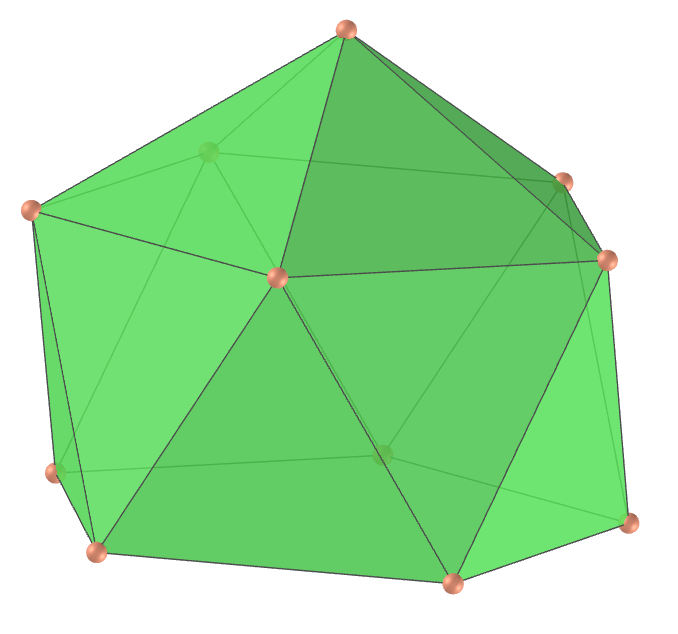
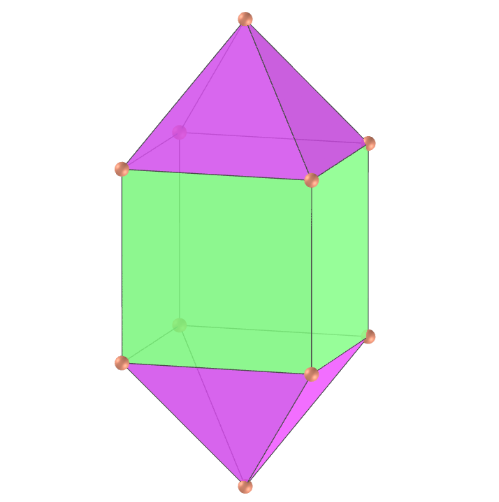
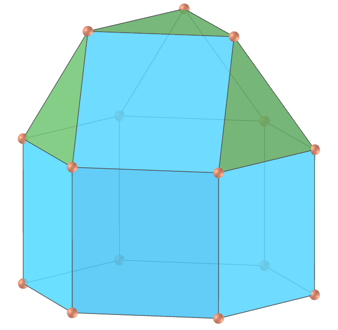
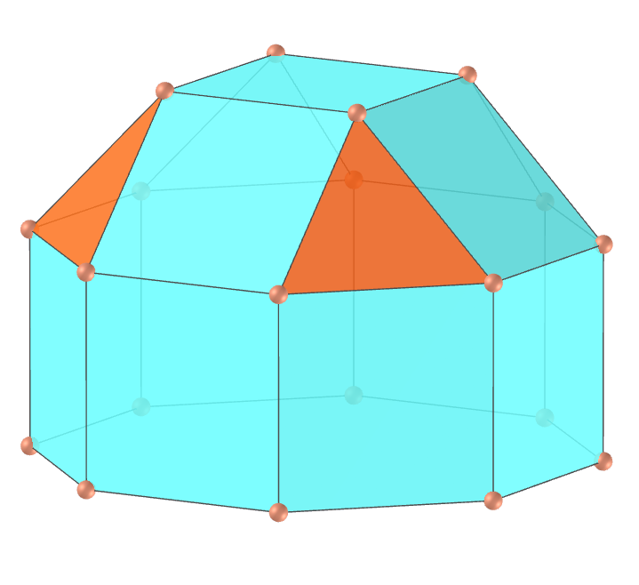
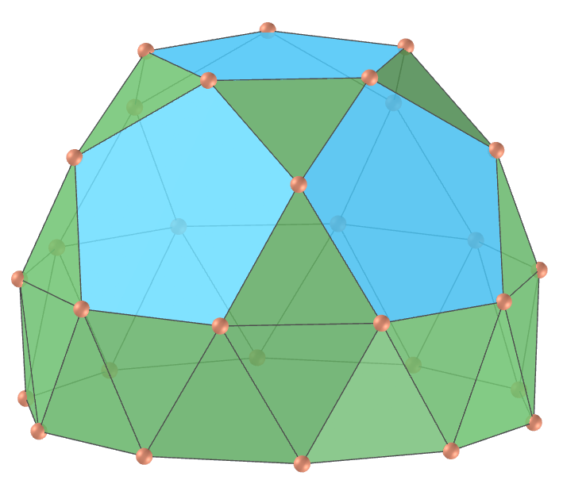

<link rel="stylesheet" href="../scripts/style.css">
<h2>Visualização de poliedros com Realidade Aumentada (RA) e Realidade Virtual (RV) em A-frame</h2>
<b>autor:</b> Paulo Henrique Siqueira - Universidade Federal do Paraná
 <b>contato:</b> <a href="#"> paulohscwb@gmail.com </a>
 <a href="https://paulohscwb.github.io/polyhedra/johnson1/">english version</a>
<form style="margin: 0 auto; float:right; text-align:right; width:100%; margin-bottom:15px;">
	<select id="url" onchange="urlHandler(this.value)" style="color:royalblue;">
		<option disabled selected>Mais poliedros:</option>
		<option value="../../archimedes/pt-br/">Arquimedes</option>
		<option value="../../catalan/pt-br/">Catalan</option>
		<option value="../../nonconvex/pt-br/">Não convexos</option>
		<option value="../../platonic/pt-br/">Platão</option>
		<option disabled value="../../polyhedron/pt-br/">Prismas e antiprismas</option>
		<option value="../../quasiregular/pt-br/">Quase regulares</option>
		<option value="../../selfintersect/pt-br/">Auto-interseção</option>
		<option value="../../selfintersectsnub/pt-br/">Auto-interseção snub</option>
		<option value="../../selfintersecttruncated/pt-br/">Auto-interseção truncados</option>
		<option value="../../johnson1/pt-br/">Johnson: 1-32</option>
		<option value="../../johnson2/pt-br/">Johnson: 33-62</option>
		<option value="../../johnson3/pt-br/">Johnson: 63-92</option>
	</select>
</form>

  <h2 align="center">Sólidos de Johnson - parte 1: J1 - J32</h2>
  Um sólido de Johnson é um poliedro de face regular estritamente convexo que não é uniforme. Eles receberam o nome de Norman Woodason Johnson, que em 1966 listou pela primeira vez todos os 92 poliedros. Nesta primeira parte, temos os primeiros 32 sólidos de Johnson. Para visualizar os poliedros de Johnson em RA, visite a página:

<a href="../ra.html" target="_blank">https://paulohscwb.github.io/polyhedra/johnson1/ra.html</a>
 
com qualquer navegador com um dispositivo de webcam (smartphone, tablet ou notebook).
 O acesso às páginas de RV é feito clicando no círculo azul que aparece em cima de cada marcador.

<h4>1. Pirâmide quadrada</h4>

  J1 A pirâmide quadrada, ou squippy, é uma pirâmide com uma base quadrada e 4 triângulos como lados. A versão com triângulos equiláteros como lados é o primeiro dos 92 sólidos de Johnson. Duas pirâmides quadradas podem ser unidas em sua base quadrada para formar um octaedro regular.
  <b>Faces:</b> 4 triângulos (faces laterais) e 1 quadrado (base) | <b>Arestas:</b> 8 | <b>Vértices:</b> 5 | <b>Ângulos diédricos:</b> 109.47° e 54.74°. <a href="https://polytope.miraheze.org/wiki/Square_pyramid" target="_blank">Mais sobre...</a>

<h4>2. Pirâmide pentagonal</h4>

  J2 A pirâmide pentagonal, ou peppy, é uma pirâmide com uma base pentagonal e 5 triângulos como lados. A versão com triângulos equiláteros como lados é o segundo dos 92 sólidos de Johnson. É a tampa do primeiro vértice do icosaedro. Um icosaedro regular pode ser construído anexando duas pirâmides pentagonais às bases de um antiprisma pentagonal.
  <b>Faces:</b> 5 triângulos (faces laterais) e 1 pentágono (base) | <b>Arestas:</b> 10 | <b>Vértices:</b> 6 | <b>Ângulos diédricos:</b> 138.19° e 37.38°. <a href="https://polytope.miraheze.org/wiki/Pentagonal_pyramid" target="_blank">Mais sobre...</a>

<h4>3. Cúpula triangular</h4>

  J3 A cúpula triangular, ou tricu, é um dos 92 sólidos de Johnson. É uma cúpula baseada no triângulo equilátero e é uma das três cúpulas sólidas de Johnson, sendo as outras duas a cúpula quadrada e a cúpula pentagonal.
  <b>Faces:</b> 4 triângulos, 3 quadrados e 1 hexágono | <b>Arestas:</b> 15 | <b>Vértices:</b> 9 | <b>Ângulos diédricos:</b> 125.26°, 70.53° e 54.74°. <a href="https://polytope.miraheze.org/wiki/Triangular_cúpula" target="_blank">Mais sobre...</a>

<h4>4. Cúpula quadrada</h4>

  J4 A cúpula quadrada, ou squacu, é um dos sólidos de Johnson. É uma cúpula baseada no quadrado e é uma das três cúpulas sólidas de Johnson. Pode ser obtida como um segmento do pequeno rombicuboctaedro, quando considerado como uma ortobicúpula quadrada alongada.
  <b>Faces:</b> 4 triângulos, 5 quadrados e 1 octógono | <b>Arestas:</b> 20 | <b>Vértices:</b> 12 | <b>Ângulos diédricos:</b> 144.74°, 135°, 45° e 54.74°. <a href="https://polytope.miraheze.org/wiki/Square_cúpula" target="_blank">Mais sobre...</a>

<h4>5. Cúpula pentagonal</h4>

  J5 A cúpula pentagonal, ou pecu, é um dos sólidos de Johnson. É uma cúpula baseada no pentágono e é uma das três cúpulas sólidas de Johnson. Pode ser obtido como um segmento do pequeno rombicosidodecaedro.
  <b>Faces:</b> 5 triângulos, 5 quadrados, 1 pentágono e 1 decágono | <b>Arestas:</b> 25 | <b>Vértices:</b> 15 | <b>Ângulos diédricos:</b> 159.09°, 148.28°, 37.38° e 31.72°. <a href="https://polytope.miraheze.org/wiki/Pentagonal_cúpula" target="_blank">Mais sobre...</a>

<h4>6. Rotunda pentagonal</h4>

  J6 A rotunda pentagonal, ou pero, é um dos sólidos de Johnson. É uma rotunda baseada em um pentágono e a única rotunda que resulta em um sólido de Johnson. Pode ser construída cortando um icosidodecaedro ao meio ao longo de um de seus círculos das arestas dos decágonos.
  <b>Faces:</b> 10 triângulos, 6 pentágonos e 1 decágono | <b>Arestas:</b> 35 | <b>Vértices:</b> 20 | <b>Ângulos diédricos:</b> 142.62°, 79.19° e 63.43°. <a href="https://polytope.miraheze.org/wiki/Pentagonal_rotunda" target="_blank">Mais sobre...</a>

<h4>7. Pirâmide triangular alongada</h4>

  J7 A pirâmide triangular alongada, ou etripy, é um dos sólidos de Johnson. Pode ser construída anexando um prisma triangular a uma das faces do tetraedro, visto como uma pirâmide triangular. Se um segundo tetraedro estiver ligado à outra base triangular do prisma, o resultado é a bipirâmide triangular alongada.
  <b>Faces:</b> 4 triângulos e 3 quadrados | <b>Arestas:</b> 12 | <b>Vértices:</b> 7 | <b>Ângulos diédricos:</b> 160.53°, 90°, 60° e 70.53°. <a href="https://polytope.miraheze.org/wiki/Elongated_triangular_pyramid" target="_blank">Mais sobre...</a>

<h4>8. Pirâmide quadrada alongada</h4>

  J8 A pirâmide quadrada alongada, ou esquipy, é um dos sólidos de Johnson. Pode ser construída anexando um cubo, visto como um prisma quadrado, à base da pirâmide quadrada. Se uma segunda pirâmide for anexada à face oposta do cubo, o resultado é a bipirâmide quadrada alongada.
  <b>Faces:</b> 4 triângulos e 5 quadrados | <b>Arestas:</b> 16 | <b>Vértices:</b> 9 | <b>Ângulos diédricos:</b> 144.74°, 90° e 109.47°. <a href="https://polytope.miraheze.org/wiki/Elongated_square_pyramid" target="_blank">Mais sobre...</a>

<h4>9. Pirâmide pentagonal alongada</h4>

  J9 A pirâmide pentagonal alongada, ou epeppy, é um dos sólidos de Johnson. Pode ser construída anexando um prisma pentagonal à base da pirâmide pentagonal. Se uma segunda pirâmide estiver ligada à outra base do prisma pentagonal, o resultado é a bipirâmide pentagonal alongada.
  <b>Faces:</b> 5 triângulos, 5 quadrados e 1 pentágono | <b>Arestas:</b> 20 | <b>Vértices:</b> 11 | <b>Ângulos diédricos:</b> 138.19°, 90°, 108° e 127.38°. <a href="https://polytope.miraheze.org/wiki/Elongated_pentagonal_pyramid" target="_blank">Mais sobre...</a>

<h4>10. Pirâmide quadrada giralongada</h4>

  J10 A pirâmide quadrada giralongada, ou gyesp, é um dos sólidos de Johnson. Pode ser construída anexando um antiprisma quadrado à base da pirâmide quadrada. Se uma segunda pirâmide estiver ligada à outra base do antiprisma quadrado, o resultado é a bipirâmide quadrada giralongada.
  <b>Faces:</b> 12 triângulos e 1 quadrado | <b>Arestas:</b> 20 | <b>Vértices:</b> 9 | <b>Ângulos diédricos:</b> 158.57°, 127.55°, 109.47° e 103.84°. <a href="https://polytope.miraheze.org/wiki/Gyroelongated_square_pyramid" target="_blank">Mais sobre...</a>

<a href="#p11" class="topo">voltar ao topo</a>

<h4>11. Pirâmide pentagonal giralongada</h4>

  J11 A pirâmide pentagonal giralongada, ou gyepic, é um dos sólidos de Johnson. Pode ser construída anexando um antiprisma pentagonal à base da pirâmide pentagonal. Alternativamente, pode ser construída diminuindo um vértice do icosaedro regular, razão pela qual esse poliedro também pode ser chamado de icosaedro diminuído.
  <b>Faces:</b> 15 triângulos e 1 pentágono | <b>Arestas:</b> 25 | <b>Vértices:</b> 11 | <b>Ângulos diédricos:</b> 138.19° e 100.81°. <a href="https://polytope.miraheze.org/wiki/Gyroelongated_pentagonal_pyramid" target="_blank">Mais sobre...</a>

<h4>12. Dipirâmide triangular</h4>

  J12 A dipirâmide triangular, também chamada de tegum triangular ou bipirâmide triangular ou trit, é um dos sólidos de Johnson. Pode ser construída unindo dois tetraedros regulares em uma de suas faces. É uma das três dipirâmides (tegums) poligonais regulares; as outras são o octaedro regular (tegum quadrado) e o tegum pentagonal.
  <b>Faces:</b> 6 triângulos | <b>Arestas:</b> 9 | <b>Vértices:</b> 5 | <b>Ângulos diédricos:</b> 141.06° e 70.53°. <a href="https://polytope.miraheze.org/wiki/Triangular_tegum" target="_blank">Mais sobre...</a>

<h4>13. Dipirâmide pentagonal</h4>

  J13 A dipirâmide pentagonal, também chamada de bipirâmide pentagonal ou tegum pentagonal ou pet, é um dos sólidos de Johnson. Pode ser construída unindo duas pirâmides pentagonais em suas bases. É uma das três dipirâmides poligonais regulares (tegums).
  <b>Faces:</b> 10 triângulos | <b>Arestas:</b> 15 | <b>Vértices:</b> 7 | <b>Ângulos diédricos:</b> 138.19° e 74.75°. <a href="https://polytope.miraheze.org/wiki/Pentagonal_tegum" target="_blank">Mais sobre...</a>

<h4>14. Dipirâmide triangular alongada</h4>

  J14 A dipirâmide triangular alongada, também chamada de bipirâmide triangular alongada ou etidpy, é um dos sólidos de Johnson. Pode ser construída inserindo um prisma triangular entre as duas metades da dipirâmide triangular.
  <b>Faces:</b> 6 triângulos e 3 quadrados | <b>Arestas:</b> 15 | <b>Vértices:</b> 8 | <b>Ângulos diédricos:</b> 160.53°, 60° e 70.53°. <a href="https://polytope.miraheze.org/wiki/Elongated_triangular_bipyramid" target="_blank">Mais sobre...</a>

<h4>15. Dipirâmide quadrada alongada</h4>

  J15 A dipirâmide quadrada alongada, também chamada de bipirâmide quadrada alongada ou esquidpy, é um dos sólidos de Johnson. Pode ser construída inserindo um cubo, visto como um prisma quadrado, entre as duas metades piramidais do octaedro regular, visto como uma dipirâmide quadrada.
  <b>Faces:</b> 8 triângulos e 4 quadrados | <b>Arestas:</b> 20 | <b>Vértices:</b> 10 | <b>Ângulos diédricos:</b> 144.74°, 90° e 109.47°. <a href="https://polytope.miraheze.org/wiki/Elongated_square_bipyramid" target="_blank">Mais sobre...</a>

<h4>16. Dipirâmide pentagonal alongada</h4>

  J16 A dipirâmide pentagonal alongada, também chamada de bipirâmide pentagonal alongada ou epedpy, é um dos sólidos de Johnson. Pode ser construída inserindo um prisma pentagonal entre as metades da dipirâmide pentagonal.
  <b>Faces:</b> 10 triângulos e 5 quadrados | <b>Arestas:</b> 25 | <b>Vértices:</b> 12 | <b>Ângulos diédricos:</b> 138.19°, 108° e 127.38°. <a href="https://polytope.miraheze.org/wiki/Elongated_pentagonal_bipyramid" target="_blank">Mais sobre...</a>

<h4>17. Dipirâmide quadrada giralongada</h4>

  J17 A dipirâmide quadrada giralongada, também chamada de bipirâmide quadrada giralongada ou gyesqidpy, é um dos sólidos de Johnson. Pode ser construída inserindo um antiprisma quadrado entre as duas metades piramidais do octaedro regular, visto como uma dipirâmide quadrada.
  <b>Faces:</b> 16 triângulos | <b>Arestas:</b> 24 | <b>Vértices:</b> 10 | <b>Ângulos diédricos:</b> 158.57°, 127.55° e 109.47°. <a href="https://polytope.miraheze.org/wiki/Gyroelongated_square_bipyramid" target="_blank">Mais sobre...</a>

<h4>18. Cúpula triangular alongada</h4>

  J18 A cúpula triangular alongada, também chamada de etcu, é um dos sólidos de Johnson. Pode ser construída anexando um prisma hexagonal à base hexagonal da cúpula triangular. Se uma segunda cúpula for anexada à outra base hexagonal do prisma na mesma orientação, o resultado é a ortobicúpula triangular alongada.
  <b>Faces:</b> 4 triângulos, 9 quadrados e 1 hexágono | <b>Arestas:</b> 27 | <b>Vértices:</b> 15 | <b>Ângulos diédricos:</b> 160.53°, 144.74°, 120°, 60° e 125.26°. <a href="https://polytope.miraheze.org/wiki/Elongated_triangular_cúpula" target="_blank">Mais sobre...</a>

<h4>19. Cúpula quadrada alongada</h4>

  J19 A cúpula quadrada alongada, ou escu, é um dos sólidos de Johnson. Pode ser construída anexando um prisma octogonal à base octogonal da cúpula quadrada. Também pode ser vista como um pequeno rombicuboctaedro diminuído, formado cortando um de seus segmentos quadrados de cúpula.
  <b>Faces:</b> 4 triângulos, 13 quadrados e 1 octógono | <b>Arestas:</b> 36 | <b>Vértices:</b> 20 | <b>Ângulos diédricos:</b> 144.74°, 135° e 90°. <a href="https://polytope.miraheze.org/wiki/Elongated_square_cúpula" target="_blank">Mais sobre...</a>

<h4>20. Cúpula pentagonal alongada</h4>

  J20 A cúpula pentagonal alongada, ou epcu, é um dos sólidos de Johnson. Pode ser construída anexando um prisma decagonal à base decagonal da cúpula pentagonal. Se uma segunda cúpula for anexada à outra base decagonal do prisma na mesma orientação, o resultado é a ortobicúpula pentagonal alongada.
  <b>Faces:</b> 5 triângulos, 15 quadrados, 1 pentágono e 1 decágono | <b>Arestas:</b> 45 | <b>Vértices:</b> 25 | <b>Ângulos diédricos:</b> 159.09°, 148.28°, 144°, 127.38°, 121.72° e 90°. <a href="https://polytope.miraheze.org/wiki/Elongated_pentagonal_cúpula" target="_blank">Mais sobre...</a>

<a href="#p11" class="topo">voltar ao topo</a>

<h4>21. Rotunda pentagonal alongada</h4>

  J21 A rotunda pentagonal alongada, ou epro, é um dos sólidos de Johnson. Pode ser construída anexando um prisma decagonal à base decagonal da rotunda pentagonal. Se uma segunda rotunda for anexada à outra base decagonal do prisma na mesma orientação, o resultado é a ortobirotunda pentagonal alongada.
  <b>Faces:</b> 10 triângulos, 10 quadrados, 6 pentágonos e 1 decágono | <b>Arestas:</b> 55 | <b>Vértices:</b> 30 | <b>Ângulos diédricos:</b> 169.19°, 153.43°, 144°, 142.62° e 90°. <a href="https://polytope.miraheze.org/wiki/Elongated_pentagonal_rotunda" target="_blank">Mais sobre...</a>

<h4>22. Cúpula triangular giralongada</h4>

  J22 A cúpula triangular giralongada, ou gyetcu, é um dos sólidos de Johnson. Pode ser construída anexando um antiprisma hexagonal à base hexagonal da cúpula triangular. Se uma segunda cúpula for anexada à outra base hexagonal do antiprisma, o resultado é a bicúpula triangular giralongada.
  <b>Faces:</b> 16 triângulos, 3 quadrados e 1 hexágono | <b>Arestas:</b> 33 | <b>Vértices:</b> 15 | <b>Ângulos diédricos:</b> 169.43°, 153.64°, 145.22°, 125.26° e 98.9°. <a href="https://polytope.miraheze.org/wiki/Gyroelongated_triangular_cúpula" target="_blank">Mais sobre...</a>

<h4>23. Cúpula quadrada giralongada</h4>

  J23 A cúpula quadrada giralongada, ou gyescu, é um dos sólidos de Johnson. Pode ser construída anexando um antiprisma octogonal à base octogonal da cúpula quadrada. Se uma segunda cúpula for anexada à outra base octogonal do antiprisma, o resultado é a bicúpula quadrada giralongada.
  <b>Faces:</b> 20 triângulos, 5 quadrados e 1 octógono | <b>Arestas:</b> 44 | <b>Vértices:</b> 20 | <b>Ângulos diédricos:</b> 153.96°, 151.33°, 144.74°, 141.59°, 135° e 96.59°. <a href="https://polytope.miraheze.org/wiki/Gyroelongated_square_cúpula" target="_blank">Mais sobre...</a>

<h4>24. Cúpula pentagonal giralongada</h4>

  J24 A cúpula pentagonal giralongada, ou gyepcu, é um dos sólidos de Johnson. Pode ser construída anexando um antiprisma decagonal à base decagonal da cúpula pentagonal. Se uma segunda cúpula for anexada à outra base decagonal do antiprisma, o resultado é a bicúpula pentagonal giralongada.
  <b>Faces:</b> 25 triângulos, 5 quadrados, 1 pentágono e 1 decágono | <b>Arestas:</b> 55 | <b>Vértices:</b> 25 | <b>Ângulos diédricos:</b> 159.19°, 159.09°, 148.28°, 132.62°, 126.96° e 95.25°. <a href="https://polytope.miraheze.org/wiki/Gyroelongated_pentagonal_cúpula" target="_blank">Mais sobre...</a>

<h4>25. Rotunda pentagonal giralongada</h4>

  J25 A rotunda pentagonal giralongada, ou gyepro, é um dos sólidos de Johnson. Pode ser construída anexando um antiprisma decagonal à base decagonal da rotunda pentagonal. Se uma segunda rotunda for anexada à outra base decagonal do antiprisma, o resultado é a birotunda pentagonal giralongada.
  <b>Faces:</b> 30 triângulos, 6 pentágonos e 1 decágono | <b>Arestas:</b> 65 | <b>Vértices:</b> 30 | <b>Ângulos diédricos:</b> 174.43°, 159.19°, 158.68°, 142.62° e 95.25°. <a href="https://polytope.miraheze.org/wiki/Gyroelongated_pentagonal_rotunda" target="_blank">Mais sobre...</a>

<h4>26. Girobiprisma</h4>

  J26 O Girobiprisma, ou gybef, é um dos sólidos de Johnson. Ele pode ser construído anexando dois prismas triangulares, vistos como cúpulas digonais, em uma de suas faces quadradas, de modo que suas arestas opostas sejam perpendiculares. Como tal, poderia ser considerado uma girobicúpula digonal.
  <b>Faces:</b> 4 triângulos e 4 quadrados | <b>Arestas:</b> 14 | <b>Vértices:</b> 8 | <b>Ângulos diédricos:</b> 150°, 90° e 60°. <a href="https://polytope.miraheze.org/wiki/Gyrobifastigium" target="_blank">Mais sobre...</a>

<h4>27. Ortobicúpula triangular</h4>

  J27 A ortobicúpula triangular, ou tobcu, é um dos sólidos de Johnson. Pode ser construída anexando duas cúpulas triangulares em suas bases hexagonais, de modo que as duas bases triangulares estejam na mesma orientação. Se as cúpulas forem unidas de modo que as bases sejam giradas 60°, o resultado é a girobicúpula triangular, mais conhecida como cuboctaedro uniforme.
  <b>Faces:</b> 8 triângulos e 6 quadrados | <b>Arestas:</b> 24 | <b>Vértices:</b> 12 | <b>Ângulos diédricos:</b> 141.06°, 125.26° e 109.47°. <a href="https://polytope.miraheze.org/wiki/Triangular_orthobicúpula" target="_blank">Mais sobre...</a>

<h4>28. Ortobicúpula quadrada</h4>

  J28 A ortobicúpula quadrada, ou squobcu, é um dos sólidos de Johnson. Pode ser construída anexando duas cúpulas quadradas em suas bases octogonais, de modo que as duas bases quadradas estejam na mesma orientação. Se as cúpulas forem unidas de modo que as bases sejam giradas 45°, o resultado é a girobicúpula quadrada.
  <b>Faces:</b> 8 triângulos e 10 quadrados | <b>Arestas:</b> 32 | <b>Vértices:</b> 16 | <b>Ângulos diédricos:</b> 144.74°, 135°, 90° e 109.47°. <a href="https://polytope.miraheze.org/wiki/Square_orthobicúpula" target="_blank">Mais sobre...</a>

<h4>29. Girobicúpula quadrada</h4>

  J29 A girobicúpula quadrada, ou squigybcu, é um dos sólidos de Johnson. Pode ser construída anexando duas cúpulas quadradas em suas bases octogonais, de modo que as duas bases quadradas sejam giradas 45° uma da outra. É topologicamente equivalente ao antiprisma quadrado retificado.
  <b>Faces:</b> 8 triângulos e 10 quadrados | <b>Arestas:</b> 32 | <b>Vértices:</b> 16 | <b>Ângulos diédricos:</b> 144.74°, 135° e 99.74°. <a href="https://polytope.miraheze.org/wiki/Square_gyrobicúpula" target="_blank">Mais sobre...</a>

<h4>30. Ortobicúpula pentagonal</h4>

  J30 A ortobicúpula pentagonal, ou pobcu, é um dos sólidos de Johnson. Pode ser construída anexando duas cúpulas pentagonais em suas bases decagonais, de modo que as duas bases pentagonais estejam na mesma orientação. Se as cúpulas forem unidas de modo que as bases sejam giradas 36°, o resultado é a girobicúpula pentagonal.
  <b>Faces:</b> 10 triângulos, 10 quadrados e 2 pentágonos | <b>Arestas:</b> 40 | <b>Vértices:</b> 20 | <b>Ângulos diédricos:</b> 159.09°, 148.28°, 74.75° e 63.43°. <a href="https://polytope.miraheze.org/wiki/Pentagonal_orthobicúpula" target="_blank">Mais sobre...</a>

<a href="#p11" class="topo">voltar ao topo</a>

<h4>31. Girobicúpula pentagonal</h4>

  J31 A girobicúpula pentagonal, ou pegybcu, é um dos sólidos de Johnson. Pode ser construída anexando duas cúpulas pentagonais em suas bases decagonais, de modo que as duas bases pentagonais sejam giradas 36° uma em relação à outra. É topologicamente equivalente ao antiprisma pentagonal retificado.
  <b>Faces:</b> 10 triângulos, 10 quadrados e 2 pentágonos | <b>Arestas:</b> 40 | <b>Vértices:</b> 20 | <b>Ângulos diédricos:</b> 159.09°, 148.28° e 69.09°. <a href="https://polytope.miraheze.org/wiki/Pentagonal_gyrobicúpula" target="_blank">Mais sobre...</a>

<h4>32. Ortocúpula rotunda pentagonal</h4>

  J31 A ortocúpula rotunda pentagonal, ou pocuro, é um dos sólidos de Johnson. Pode ser construída anexando uma cúpula pentagonal e uma rotunda pentagonal em suas bases decagonais, de modo que as duas bases pentagonais estejam na mesma orientação. Se a cúpula e a rotunda forem unidas de modo que as bases sejam giradas 36°, o resultado é a girocúpula rotunda pentagonal.
  <b>Faces:</b> 15 triângulos, 5 quadrados e 7 pentágonos | <b>Arestas:</b> 50 | <b>Vértices:</b> 25 | <b>Ângulos diédricos:</b> 159.09°, 148.28°, 142.62°, 110.95° e 100.81°. <a href="https://polytope.miraheze.org/wiki/Pentagonal_orthocúpularotunda" target="_blank">Mais sobre...</a>

<a href="#p11" class="topo">voltar ao topo</a>

 
  Polyhedra: Johnson solids part 1 de <a xmlns:cc="http://creativecommons.org/ns#" href="https://paulohscwb.github.io/polyhedra/johnson1/" property="cc:attributionName" rel="cc:attributionURL">Paulo Henrique Siqueira</a> está licenciado com uma Licença <a rel="license" href="http://creativecommons.org/licenses/by-nc-nd/4.0/">Creative Commons Atribuição-NãoComercial-SemDerivações 4.0 Internacional</a>.

<h4>Como citar este trabalho:</h4> 

Siqueira, P.H., "Polyhedra: Johnson solids part 1". Disponível em: <https://paulohscwb.github.io/polyhedra/johnson1//>, Julho de 2023.

 <b>Referências:</b>
 Weisstein, Eric W. "Archimedean Solid" From MathWorld-A Wolfram Web Resource. <a href="http://mathworld.wolfram.com/ArchimedeanSolid.html" target="_blank">http://mathworld.wolfram.com/ArchimedeanSolid.html</a>
 Weisstein, Eric W. "Platonic Solid" From MathWorld-A Wolfram Web Resource. <a href="http://mathworld.wolfram.com/PlatonicSolid.html" target="_blank">http://mathworld.wolfram.com/PlatonicSolid.html</a>
 Weisstein, Eric W. "Archimedean Dual" From MathWorld-A Wolfram Web Resource. <a href="https://mathworld.wolfram.com/ArchimedeanDual.html" target="_blank">https://mathworld.wolfram.com/ArchimedeanDual.html</a>
 Weisstein, Eric W. "Uniform Polyhedron." From MathWorld--A Wolfram Web Resource. <a href="https://mathworld.wolfram.com/UniformPolyhedron.html" target="_blank">https://mathworld.wolfram.com/UniformPolyhedron.html</a>
 Wikipedia <a href="https://en.wikipedia.org/wiki/Archimedean_solid" target="_blank">https://en.wikipedia.org/wiki/Archimedean_solid</a>
 Wikipedia <a href="https://en.wikipedia.org/wiki/en.wikipedia.org/wiki/Platonic_solid" target="_blank">https://en.wikipedia.org/wiki/Platonic_solid</a>
 McCooey, David I. "Visual Polyhedra". <a href="http://dmccooey.com/polyhedra/" target="_blank">http://dmccooey.com/polyhedra/</a>
