<link rel="stylesheet" href="../scripts/style.css">
<link rel="icon" type="image/png" href="vr/salas/imagens/icone.png">
<h2>Visualization of polyhedra with Augmented Reality (AR) and Virtual Reality (VR) in A-frame</h2>
 <b>author:</b> Paulo Henrique Siqueira - Universidade Federal do Paraná
  <b>contact:</b> <a href="#">paulohscwb@gmail.com</a>
  <a href="https://paulohscwb.github.io/polyhedra/johnson2/pt-br/">versão em português</a>
<form style="margin: 0 auto; float:right; text-align:right; width:100%; margin-bottom:15px;">
	<a href="../">Home</a>
	 <select id="url" onchange="urlHandler(this.value)" style="color:royalblue;">
		<option disabled selected value>More polyhedra:</option>
		<option value="../archimedes/">Archimedes</option>
		<option value="../catalan/">Catalan</option>
		<option value="../nonconvex/">Non convex</option>
		<option value="../platonic/">Platonic</option>
		<option value="../polyhedron/">Prisms and antiprisms</option>
		<option value="../quasiregular/">Quasi regular</option>
		<option value="../selfintersect/">Self-intersecting</option>
		<option value="../selfintersectsnub/">Self-intersecting snub</option>
		<option value="../selfintersecttruncated/">Self intersecting truncated</option>
		<option value="../johnson1/">Johnson: 1-32</option>
		<option disabled value="../johnson2/">Johnson: 33-62</option>
		<option value="../johnson3/">Johnson: 63-92</option>
		<option value="../infinity/">Stellation to infinity</option>
	</select>
</form>

  <h2 align="center">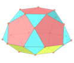 Johnson solids - part 2: J33 - J62</h2>
  A Johnson solid is a strictly convex regular-faced polyhedron that is not uniform. They are named after Norman Woodason Johnson, who in 1966 first listed all 92 such polyhedra. In second part, we have more 30 Johnson solids. 
  

  To view Johnson solids in AR, simply visit:

<a href="ra.html" target="_blank">https://paulohscwb.github.io/polyhedra/johnson2/ra.html</a>
 
with any browser with a webcam device (smartphone, tablet or notebook). 
 Access to the VR sites is done by clicking on the blue circle that appears on top of the marker.

<h4>1. Pentagonal gyrocupolarotunda</h4>
<a href="vr/j33_pentagonal_gyrocupolarotunda.htm" target="_blank" title="3D model" class="fotoA">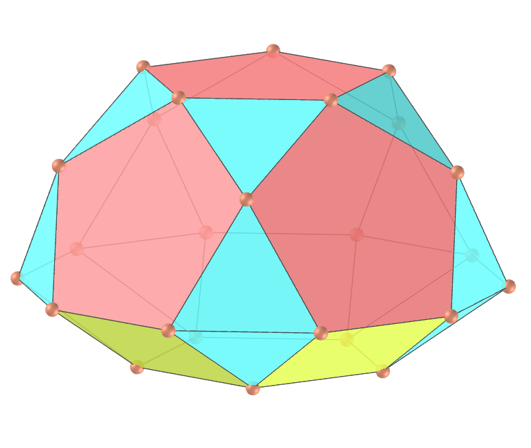</a>
  J33 The pentagonal gyrocupolarotunda, or pegycuro, is one of the 92 Johnson solids. It can be constructed by attaching a pentagonal cupola and a pentagonal rotunda at their decagonal bases, such that the two pentagonal bases are rotated 36° with respect to each other. If the cupola and rotunda are joined such that the bases are in the same orientation, the result is the pentagonal orthocupolarotunda. 
  <b>Faces:</b> 15 triangles, 5 squares and 7 pentagons | <b>Edges:</b> 50 | <b>Vertices:</b> 25 | <b>Dihedral angles:</b> 159.09°, 148.28°, 142.62°, 116.57° and 95.15°. <a href="https://polytope.miraheze.org/wiki/Pentagonal_gyrocupolarotunda" target="_blank">More...</a>

<h4>2. Pentagonal orthobirotunda</h4>

  J34 The pentagonal orthobirotunda, or pobro, is one of the Johnson solids. It can be constructed by attaching two pentagonal rotundas at their decagonal bases, such that the two pentagonal bases are in the same orientation. If the rotundas are joined such that the bases are rotated 36°, the result is the pentagonal gyrobirotunda, better known as the uniform icosidodecahedron. 
  <b>Faces:</b> 20 triangles and 12 pentagons | <b>Edges:</b> 60 | <b>Vertices:</b> 30 | <b>Dihedral angles:</b> 158.38°, 142.62° and 126.87°. <a href="https://polytope.miraheze.org/wiki/Pentagonal_orthobirotunda" target="_blank">More...</a>

<h4>3. Elongated triangular orthobicupola</h4>

  J35 The elongated triangular orthobicupola, or etobcu, is one of the Johnson solids. It can be constructed by inserting a hexagonal prism between the halves of the triangular orthobicupola. The resulting solid is superficially similar to the rhombicuboctahedron, with the difference that it has threefold rotational symmetry about its axis instead of fourfold symmetry.  
  <b>Faces:</b> 8 triangles and 12 squares | <b>Edges:</b> 36 | <b>Vertices:</b> 18 | <b>Dihedral angles:</b> 160.53°, 144.74°, 120° and 125.26°. <a href="https://polytope.miraheze.org/wiki/Elongated_triangular_orthobicupola" target="_blank">More...</a>

<h4>4. Elongated triangular gyrobicupola</h4>

  J36 The elongated triangular gyrobicupola, or etigybcu, is one of the Johnson solids. It can be constructed by inserting a hexagonal prism between the halves of the cuboctahedron, seen as a triangular gyrobicupola. Rotating one of the cupolae through 60 degrees before the elongation yields the triangular orthobicupola J35.   
  <b>Faces:</b> 8 triangles and 12 squares | <b>Edges:</b> 36 | <b>Vertices:</b> 18 | <b>Dihedral angles:</b> 160.53°, 144.74°, 120° and 125.26°. <a href="https://polytope.miraheze.org/wiki/Elongated_triangular_gyrobicupola" target="_blank">More...</a>

<h4>5. Elongated square gyrobicupola</h4>

  J37 The elongated square gyrobicupola, or esquigybcu, is one of the Johnson solids. It can be constructed by inserting an octagonal prism between the halves of the square gyrobicupola. It can also be constructed from the small rhombicuboctahedron by rotating one of its square cupola segments 45°, and could be called the gyrate rhombicuboctahedron.   
  <b>Faces:</b> 8 triangles and 18 squares | <b>Edges:</b> 48 | <b>Vertices:</b> 24 | <b>Dihedral angles:</b> 144.74° and 135°. <a href="https://polytope.miraheze.org/wiki/Elongated_square_gyrobicupola" target="_blank">More...</a>

<h4>6. Elongated pentagonal orthobicupola</h4>

  J38 The elongated pentagonal orthobicupola, or epobcu, is one of the Johnson solids. It can be constructed by inserting a decagonal prism between the halves of the pentagonal orthobicupola. By rotating one of the domes by 36° before inserting the prism, we obtain an elongated pentagonal gyrobidome J39.   
  <b>Faces:</b> 10 triangles, 20 squares and 2 pentagons | <b>Edges:</b> 60 | <b>Vertices:</b> 30 | <b>Dihedral angles:</b> 159.09°, 148.28°, 144°, 127.38° and 121.72°. <a href="https://polytope.miraheze.org/wiki/Elongated_pentagonal_orthobicupola" target="_blank">More...</a>

<h4>7. Elongated pentagonal gyrobicupola</h4>
<a href="vr/j39_elongated_pentagonal_gyrobicupola.htm" target="_blank" title="3D model" class="fotoA">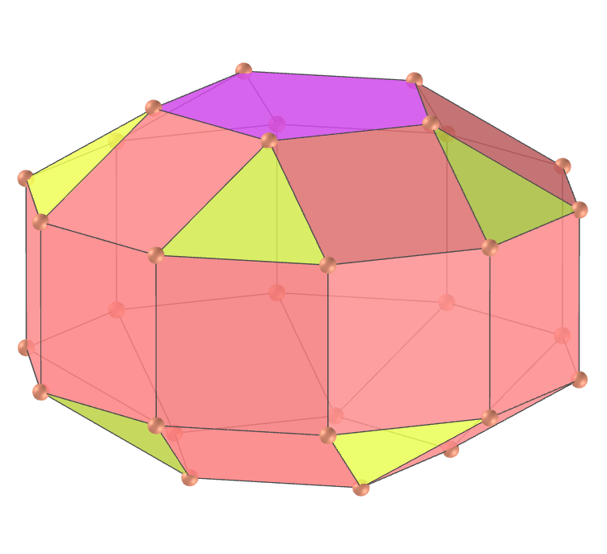</a>
  J39 The elongated pentagonal gyrobicupola, or epigybcu, is one of the Johnson solids. It can be constructed by inserting a decagonal prism between the halves of the pentagonal gyrobicupola. By rotating one of the pentagonal cupolae J5 through 36° before inserting the prism, we obtain an elongated pentagonal orthobicupola J38.
  <b>Faces:</b> 10 triangles, 20 squares and 2 pentagons | <b>Edges:</b> 60 | <b>Vertices:</b> 30 | <b>Dihedral angles:</b> 159.09°, 148.28°, 144°, 127.38° and 121.72°. <a href="https://polytope.miraheze.org/wiki/Elongated_pentagonal_gyrobicupola" target="_blank">More...</a>

<h4>8. Elongated pentagonal orthocupolarotunda</h4>
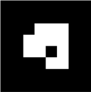
  J40 The elongated pentagonal orthocupolarotunda, or epocuro, is one of the Johnson solids. It can be constructed by inserting a decagonal prism between the halves of the pentagonal orthocupolarotunda. By rotating either the cupola or the rotunda through 36° before inserting the prism, we obtain an elongated pentagonal gyrocupolarotunda J41.
  <b>Faces:</b> 15 triangles, 15 squares and 7 pentagons | <b>Edges:</b> 70 | <b>Vertices:</b> 35 | <b>Dihedral angles:</b> 169.19°, 159.09°, 153.43°, 148.28°, 144°, 142.62°, 127.38° and 121.72°. <a href="https://polytope.miraheze.org/wiki/Elongated_pentagonal_orthocupolarotunda" target="_blank">More...</a>

<h4>9. Elongated pentagonal gyrocupolarotunda</h4>

  J41 The elongated pentagonal gyrocupolarotunda, or epgycuro, is one of the Johnson solids. It can be constructed by inserting a decagonal prism between the halves of the pentagonal gyrocupolarotunda. By rotating either the pentagonal cupola J5 or the pentagonal rotunda J5 through 36° before inserting the prism, we obtain an elongated pentagonal orthocupolarotunda J40.
  <b>Faces:</b> 15 triangles, 15 squares and 7 pentagons | <b>Edges:</b> 70 | <b>Vertices:</b> 35 | <b>Dihedral angles:</b> 169.19°, 159.09°, 153.43°, 148.28°, 144°, 142.62°, 127.38° and 121.72°. <a href="https://polytope.miraheze.org/wiki/Elongated_pentagonal_gyrocupolarotunda" target="_blank">More...</a>

<h4>10. Elongated pentagonal orthobirotunda</h4>

  J42 The elongated pentagonal orthobirotunda, or epobro, is one of the Johnson solids. It can be constructed by inserting a decagonal prism between the halves of the pentagonal orthobirotunda. By rotating one of the pentagonal rotundae J6 through 36° before inserting the prism, we obtain the elongated pentagonal gyrobirotunda J43.
  <b>Faces:</b> 20 triangles, 10 squares and 12 pentagons | <b>Edges:</b> 80 | <b>Vertices:</b> 40 | <b>Dihedral angles:</b> 169.19°, 153.43°, 144° and 142.62°. <a href="https://polytope.miraheze.org/wiki/Elongated_pentagonal_orthobirotunda" target="_blank">More...</a>

<a href="#p12" class="topo">back to top</a>

<h4>11. Elongated pentagonal gyrobirotunda</h4>

  J43 The elongated pentagonal gyrobirotunda, or epgybro, is one of the Johnson solids. It can be constructed by inserting a decagonal prism between the halves of the icosidodecahedron, seen as a pentagonal gyrobirotunda. By rotating one of the pentagonal rotundae J6 through 36° before inserting the prism yields an elongated pentagonal orthobirotunda J42. 
  <b>Faces:</b> 20 triangles, 10 squares and 12 pentagons | <b>Edges:</b> 80 | <b>Vertices:</b> 40 | <b>Dihedral angles:</b> 169.19°, 153.43°, 144° and 142.62°. <a href="https://polytope.miraheze.org/wiki/Elongated_pentagonal_gyrobirotunda" target="_blank">More...</a>

<h4>12. Gyroelongated triangular bicupola</h4>

  J44 The gyroelongated triangular bicupola, or gyetibcu, is one of the Johnson solids. It can be constructed by attaching triangular cupolas to the bases of the hexagonal antiprism. The gyroelongated triangular bicupola is one of five Johnson solids which are chiral, meaning that they have a "left-handed" and a "right-handed" form. 
  <b>Faces:</b> 20 triangles and 6 squares | <b>Edges:</b> 42 | <b>Vertices:</b> 18 | <b>Dihedral angles:</b> 169.43°, 153.64°, 145.22° and 125.26°. <a href="https://polytope.miraheze.org/wiki/Gyroelongated_triangular_bicupola" target="_blank">More...</a>

<h4>13. Gyroelongated square bicupola</h4>
<a href="vr/j45_gyroelongated_square_bicupola.htm" target="_blank" title="3D model" class="fotoA">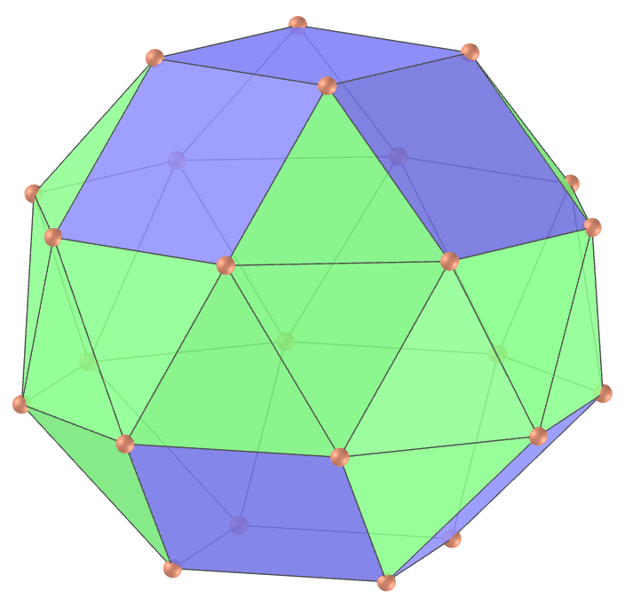</a>
  J45 The gyroelongated square bicupola, or gyesquibcu, is one of the Johnson solids. It can be constructed by attaching square cupolas to the bases of the octagonal antiprism. It is one of the five chiral Johnson solids.  
  <b>Faces:</b> 24 triangles and 10 squares | <b>Edges:</b> 56 | <b>Vertices:</b> 24 | <b>Dihedral angles:</b> 153.96°, 151.33°, 144.74°, 135° and 141.59°. <a href="https://polytope.miraheze.org/wiki/Gyroelongated_square_bicupola" target="_blank">More...</a>

<h4>14. Gyroelongated pentagonal bicupola</h4>

  J46 The gyroelongated pentagonal bicupola, or gyepibcu, is one of the Johnson solids. It can be constructed by attaching pentagonal cupolas to the bases of the decagonal antiprism. It is one of the five chiral Johnson solids.   
  <b>Faces:</b> 30 triangles, 10 squares and 2 pentagons | <b>Edges:</b> 70 | <b>Vertices:</b> 30 | <b>Dihedral angles:</b> 159.19°, 159.09°, 148.28°, 132.62° and 126.96°. <a href="https://polytope.miraheze.org/wiki/Gyroelongated_pentagonal_bicupola" target="_blank">More...</a>

<h4>15. Gyroelongated pentagonal cupolarotunda</h4>

  J47 The gyroelongated pentagonal cupolarotunda, or gyepcuro, is one of the Johnson solids. It can be constructed by attaching a pentagonal cupola and a pentagonal rotunda to opposite bases of the decagonal antiprism. It is one of five chiral Johnson solids.    
  <b>Faces:</b> 35 triangles, 5 squares and 7 pentagons | <b>Edges:</b> 80 | <b>Vertices:</b> 35 | <b>Dihedral angles:</b> 174.43°, 159.19°, 159.09°, 158.68°, 148.28°, 142.62°, 132.62° and 126.96°. <a href="https://polytope.miraheze.org/wiki/Gyroelongated_pentagonal_cupolarotunda" target="_blank">More...</a>

<h4>16. Gyroelongated pentagonal birotunda</h4>

  J48 The gyroelongated pentagonal birotunda, or gyepabro, is one of the Johnson solids. It can be constructed by attaching pentagonal rotundas to the bases of the decagonal antiprism. It is one of five chiral Johnson solids.     
  <b>Faces:</b> 40 triangles and 12 pentagons | <b>Edges:</b> 90 | <b>Vertices:</b> 40 | <b>Dihedral angles:</b> 174.43°, 159.19°, 158.68° and 142.62°. <a href="https://polytope.miraheze.org/wiki/Gyroelongated_pentagonal_birotunda" target="_blank">More...</a>

<h4>17. Augmented triangular prism</h4>

  J49 The augmented triangular prism, or autip, is one of the Johnson solids. It can be constructed by attaching a square pyramid to one of the square faces of the triangular prism. The resulting solid bears a superficial resemblance to the gyrobifastigium J26, the difference being that the latter is constructed by attaching a second triangular prism, rather than a square pyramid.     
  <b>Faces:</b> 6 triangles and 2 squares | <b>Edges:</b> 13 | <b>Vertices:</b> 7 | <b>Dihedral angles:</b> 144.74°, 114.74°, 109.47°, 90° and 60°. <a href="https://polytope.miraheze.org/wiki/Augmented_triangular_prism" target="_blank">More...</a>

<h4>18. Biaugmented triangular prism</h4>
<a href="vr/j50_biaugmented_triangular_prism.htm" target="_blank" title="3D model" class="fotoA">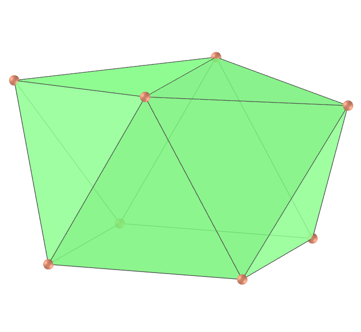</a>
  J50 The biaugmented triangular prism, or autip, is one of the Johnson solids. It can be constructed by attaching square pyramids to two of the square faces of the triangular prism. It is related to the augmented triangular prism J49 and the triaugmented triangular prism J51.     
  <b>Faces:</b> 10 triangles and 1 square | <b>Edges:</b> 17 | <b>Vertices:</b> 8 | <b>Dihedral angles:</b> 169.47°, 144.74°, 114.74°, 109.47° and 90°. <a href="https://polytope.miraheze.org/wiki/Biaugmented_triangular_prism" target="_blank">More...</a>

<h4>19. Triaugmented triangular prism</h4>

  J51 The triaugmented triangular prism, or tautip, is one of the Johnson solids. It can be constructed by attaching square pyramids to all three of the square faces of the triangular prism. The same shape is also called the tetrakis triangular prism, tricapped trigonal prism, tetracaidecadeltahedron or tetrakaidecadeltahedron.     
  <b>Faces:</b> 14 triangles | <b>Edges:</b> 21 | <b>Vertices:</b> 9 | <b>Dihedral angles:</b> 169.47°, 144.74° and 109.47°. <a href="https://polytope.miraheze.org/wiki/Triaugmented_triangular_prism" target="_blank">More...</a>

<h4>20. Augmented pentagonal prism</h4>

  J52 The augmented pentagonal prism, or aupip, is one of the Johnson solids. It can be constructed by attaching a square pyramid to one of the square faces of the pentagonal prism. It consists of 4 triangles, 4 squares and 2 pentagons.     
  <b>Faces:</b> 4 triangles, 4 squares and 2 pentagons | <b>Edges:</b> 19 | <b>Vertices:</b> 9 | <b>Dihedral angles:</b> 162.74°, 144.74°, 108°, 90° and 109.47°. <a href="https://polytope.miraheze.org/wiki/Augmented_pentagonal_prism" target="_blank">More...</a>

<a href="#p12" class="topo">back to top</a>

<h4>21. Biaugmented pentagonal prism</h4>

  J53 The biaugmented pentagonal prism, or baupip, is one of the Johnson solids. It can be constructed by attaching square pyramids to two non-adjacent square faces of the pentagonal prism: the solid obtained by attaching pyramids to adjacent equatorial faces is not convex, and thus not a Johnson solid. 
  <b>Faces:</b> 8 triangles, 3 squares and 2 pentagons | <b>Edges:</b> 23 | <b>Vertices:</b> 10 | <b>Dihedral angles:</b> 162.74°, 144.74°, 108°, 90° and 109.47°. <a href="https://polytope.miraheze.org/wiki/Biaugmented_pentagonal_prism" target="_blank">More...</a>

<h4>22. Augmented hexagonal prism</h4>
<a href="vr/j54_augmented_hexagonal_prism.htm" target="_blank" title="3D model" class="fotoA">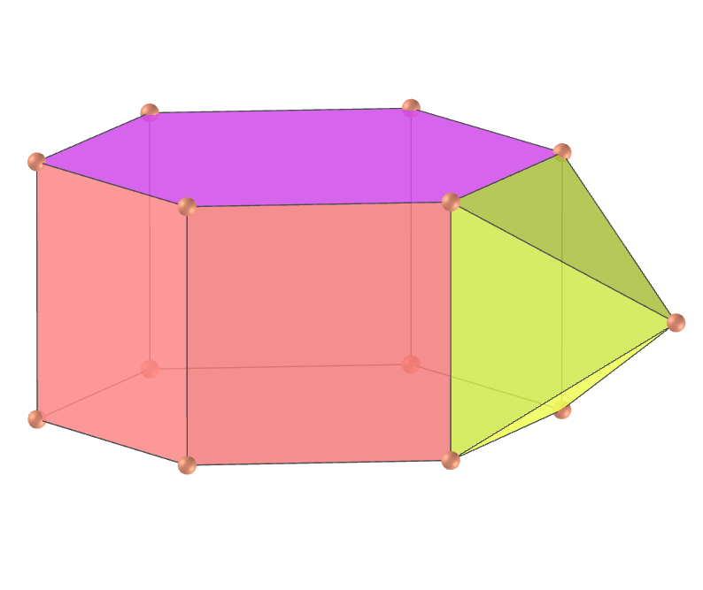</a>
  J54 The augmented hexagonal prism, or auhip, is one of the Johnson solids. It can be constructed by attaching a square pyramid to one of the square faces of the hexagonal prism. When two or three such pyramids are attached, the result may be a parabiaugmented hexagonal prism J55, a metabiaugmented hexagonal prism J56, or a triaugmented hexagonal prism J57.
  <b>Faces:</b> 4 triangles, 5 squares and 2 hexagons | <b>Edges:</b> 22 | <b>Vertices:</b> 13 | <b>Dihedral angles:</b> 174.74°, 144.74°, 120°, 90° and 109.47°. <a href="https://polytope.miraheze.org/wiki/Augmented_hexagonal_prism" target="_blank">More...</a>

<h4>23. Parabiaugmented hexagonal prism</h4>

  J55 The parabiaugmented hexagonal prism, or pabauhip, is one of the Johnson solids. It can be constructed by attaching square pyramids to two opposite square faces of the hexagonal prism. Attaching the pyramids to nonadjacent, nonparallel equatorial faces yields a metabiaugmented hexagonal prism J56: the solid obtained by attaching pyramids to adjacent equatorial faces is not convex, and thus not a Johnson solid. 
  <b>Faces:</b> 8 triangles, 4 squares and 2 hexagons | <b>Edges:</b> 26 | <b>Vertices:</b> 14 | <b>Dihedral angles:</b> 174.74°, 144.74°, 120°, 90° and 109.47°. <a href="https://polytope.miraheze.org/wiki/Parabiaugmented_hexagonal_prism" target="_blank">More...</a>

<h4>24. Metabiaugmented hexagonal prism</h4>

  J56 The metabiaugmented hexagonal prism, or mabauhip, is one of the Johnson solids. It can be constructed by attaching square pyramids to two non-opposite, non-adjacent square faces of the hexagonal prism. Attaching the pyramids to opposite equatorial faces yields a parabiaugmented hexagonal prism: the solid obtained by attaching pyramids to adjacent equatorial faces is not convex, and thus not a Johnson solid.
  <b>Faces:</b> 8 triangles, 4 squares and 2 hexagons | <b>Edges:</b> 25 | <b>Vertices:</b> 14 | <b>Dihedral angles:</b> 174.74°, 144.74°, 120°, 90° and 109.47°. <a href="https://polytope.miraheze.org/wiki/Metabiaugmented_hexagonal_prism" target="_blank">More...</a>

<h4>25. Triaugmented hexagonal prism</h4>
<a href="vr/j57_triaugmented_hexagonal_prism.htm" target="_blank" title="3D model" class="fotoA">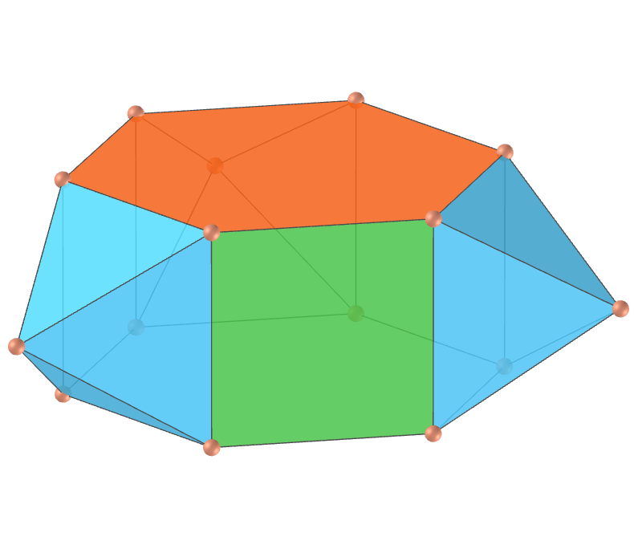</a>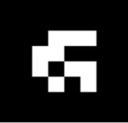
  J57 The triaugmented hexagonal prism, or tauhip, is one of the Johnson solids. It can be constructed by attaching square pyramids to three mutually non-adjacent square faces of the hexagonal prism. It consists of 12 triangles, 3 squares and 2 hexagons.
  <b>Faces:</b> 12 triangles, 3 squares and 2 hexagons | <b>Edges:</b> 30 | <b>Vertices:</b> 15 | <b>Dihedral angles:</b> 174.74°, 144.74°, 90° and 109.47°. <a href="https://polytope.miraheze.org/wiki/Triaugmented_hexagonal_prism" target="_blank">More...</a>

<h4>26. Augmented dodecahedron</h4>
<a href="vr/j58_augmented_dodecahedron.htm" target="_blank" title="3D model" class="fotoA">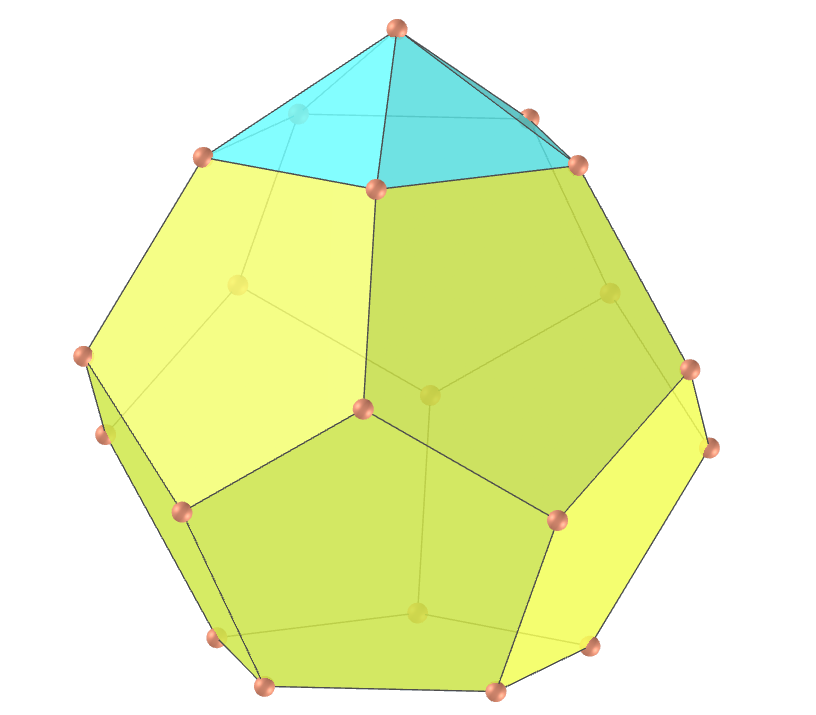</a>
  J58 The augmented dodecahedron, or aud, is one of the Johnson solids. It can be constructed by attaching a pentagonal pyramid to one of the faces of the regular dodecahedron. When two or three such pyramids are attached, the result may be a parabiaugmented dodecahedron J59, a metabiaugmented dodecahedron J60, or a triaugmented dodecahedron J61.
  <b>Faces:</b> 5 triangles and 11 pentagons | <b>Edges:</b> 35 | <b>Vertices:</b> 21 | <b>Dihedral angles:</b> 153.94°, 138.19° and 116.56°. <a href="https://polytope.miraheze.org/wiki/Augmented_dodecahedron_(Johnson_solid)" target="_blank">More...</a>

<h4>27. Parabiaugmented dodecahedron</h4>

  J59 The parabiaugmented dodecahedron, or pabaud, is one of the Johnson solids. It can be constructed by attaching pentagonal pyramids to two opposite faces of the regular dodecahedron. When pyramids are attached to a dodecahedron in other ways, they may result in an augmented dodecahedron J58, a metabiaugmented dodecahedron J60, a triaugmented dodecahedron J61, or even a pentakis dodecahedron if the faces are made to be irregular.
  <b>Faces:</b> 10 triangles and 10 pentagons | <b>Edges:</b> 40 | <b>Vertices:</b> 22 | <b>Dihedral angles:</b> 153.94°, 138.19° and 116.56°. <a href="https://polytope.miraheze.org/wiki/Parabiaugmented_dodecahedron" target="_blank">More...</a>

<h4>28. Metabiaugmented dodecahedron</h4>

  J60 The metabiaugmented dodecahedron, or mabaud, is one of the Johnson solids. It can be constructed by attaching pentagonal pyramids to two non-opposite, non-adjacent faces of the regular dodecahedron. When pyramids are attached to a dodecahedron in other ways, they may result in an augmented dodecahedron J58, a parabiaugmented dodecahedron J59, a triaugmented dodecahedron J61, or even a pentakis dodecahedron if the faces are made to be irregular. 
  <b>Faces:</b> 10 triangles and 10 pentagons | <b>Edges:</b> 40 | <b>Vertices:</b> 22 | <b>Dihedral angles:</b> 153.94°, 138.19° and 116.56°. <a href="https://polytope.miraheze.org/wiki/Metabiaugmented_dodecahedron" target="_blank">More...</a>

<h4>29. Triaugmented dodecahedron</h4>
<a href="vr/j61_triaugmented_dodecahedron.htm" target="_blank" title="3D model" class="fotoA">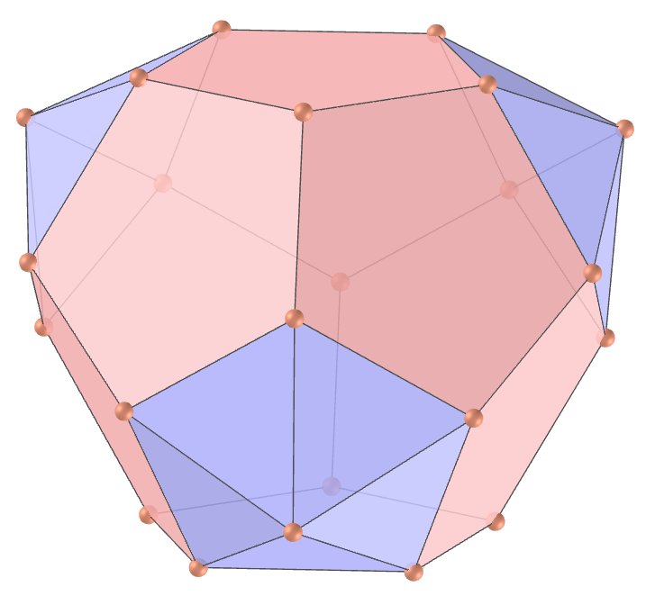</a>
  J61 The triaugmented dodecahedron, or taud, is one of the Johnson solids. It can be constructed by attaching pentagonal pyramids to three mutually non-adjacent faces of the regular dodecahedron. When pyramids are attached to a dodecahedron in other ways, they may result in an augmented dodecahedron J58, a parabiaugmented dodecahedron J59, a metabiaugmented dodecahedron J60, or even a pentakis dodecahedron if the faces are made to be irregular.  
  <b>Faces:</b> 15 triangles and 9 pentagons | <b>Edges:</b> 45 | <b>Vertices:</b> 23 | <b>Dihedral angles:</b> 153.94°, 138.19° and 116.56°. <a href="https://polytope.miraheze.org/wiki/Triaugmented_dodecahedron" target="_blank">More...</a>

<h4>30. Metabidiminished icosahedron</h4>

  J62 The metabidiminished icosahedron, or mibdi, is one of the Johnson solids. It can be constructed by removing two non-opposite, non-adjacent vertices from a regular icosahedron. If two pentagonal pyramids are removed to form nonadjacent pentagonal faces, the result is instead the pentagonal antiprism. 
  <b>Faces:</b> 10 triangles and 2 pentagons | <b>Edges:</b> 20 | <b>Vertices:</b> 10 | <b>Dihedral angles:</b> 100.81°, 138.19° and 43.43°. <a href="https://polytope.miraheze.org/wiki/Metabidiminished_icosahedron" target="_blank">More...</a>

<a href="#p12" class="topo">back to top</a>

  Johnson solids part 2 (J33 - J62): Visualization of polyhedra with Augmented Reality and Virtual Reality by <a xmlns:cc="http://creativecommons.org/ns#" href="https://paulohscwb.github.io/polyhedra/johnson2/" property="cc:attributionName" rel="cc:attributionURL">Paulo Henrique Siqueira</a> is licensed with a license <a rel="license" href="http://creativecommons.org/licenses/by-nc-nd/4.0/">Creative Commons Attribution-NonCommercial-NoDerivatives 4.0 International</a>.

<h4>How to cite this work:</h4> 

Siqueira, P.H., "Johnson solids part 2 (J33 - J62): Visualization of polyhedra with Augmented Reality and Virtual Reality". Available in: <https://paulohscwb.github.io/polyhedra/johnson2/>, July 2023.

  <b>References:</b>
 Weisstein, Eric W. "Archimedean Solid" From MathWorld-A Wolfram Web Resource. <a href="http://mathworld.wolfram.com/ArchimedeanSolid.html" target="_blank">http://mathworld.wolfram.com/ArchimedeanSolid.html</a>
 Weisstein, Eric W. "Platonic Solid" From MathWorld-A Wolfram Web Resource. <a href="http://mathworld.wolfram.com/PlatonicSolid.html" target="_blank">http://mathworld.wolfram.com/PlatonicSolid.html</a>
 Weisstein, Eric W. "Archimedean Dual" From MathWorld-A Wolfram Web Resource. <a href="https://mathworld.wolfram.com/ArchimedeanDual.html" target="_blank">https://mathworld.wolfram.com/ArchimedeanDual.html</a>
 Weisstein, Eric W. "Uniform Polyhedron." From MathWorld--A Wolfram Web Resource. <a href="https://mathworld.wolfram.com/UniformPolyhedron.html" target="_blank">https://mathworld.wolfram.com/UniformPolyhedron.html</a>
 Wikipedia <a href="https://en.wikipedia.org/wiki/Archimedean_solid" target="_blank">https://en.wikipedia.org/wiki/Archimedean_solid</a>
 Wikipedia <a href="https://en.wikipedia.org/wiki/en.wikipedia.org/wiki/Platonic_solid" target="_blank">https://en.wikipedia.org/wiki/Platonic_solid</a>
 McCooey, David I. "Visual Polyhedra". <a href="http://dmccooey.com/polyhedra/" target="_blank">http://dmccooey.com/polyhedra/</a>
