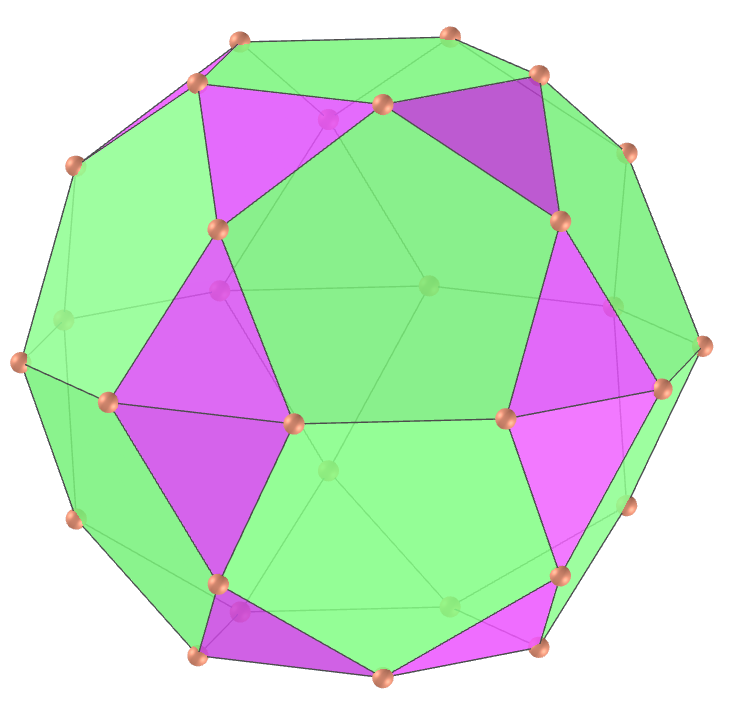
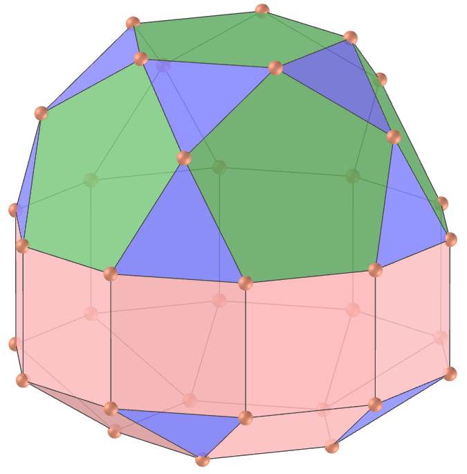
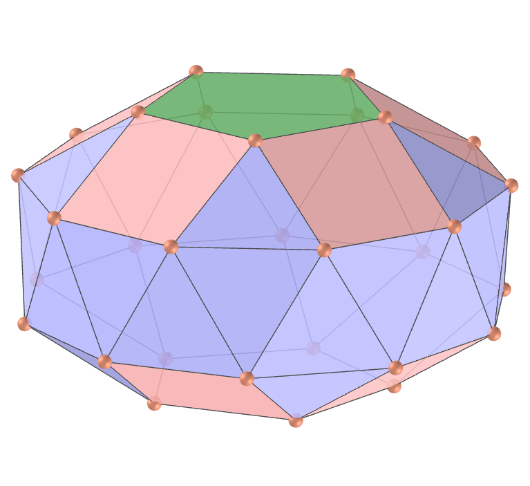
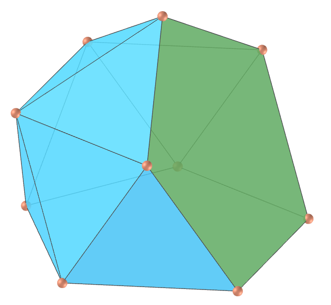

<link rel="stylesheet" href="../../scripts/style.css">
<link rel="icon" type="image/png" href="../vr/salas/imagens/icone.png">
<h2>Visualização de poliedros com Realidade Aumentada (RA) e Realidade Virtual (RV) em A-frame</h2>
<b>autor:</b> Paulo Henrique Siqueira - Universidade Federal do Paraná
 <b>contato:</b> <a href="#"> paulohscwb@gmail.com </a>
 <a href="https://paulohscwb.github.io/polyhedra/johnson2/">english version</a>
<form style="margin: 0 auto; float:right; text-align:right; width:100%; margin-bottom:15px;">
	<a href="../../pt-br/">Página Inicial</a>
	 <select id="url" onchange="urlHandler(this.value)" style="color:royalblue;">
		<option disabled selected>Mais poliedros:</option>
		<option value="../../archimedes/pt-br/">Arquimedes</option>
		<option value="../../catalan/pt-br/">Catalan</option>
		<option value="../../nonconvex/pt-br/">Não convexos</option>
		<option value="../../platonic/pt-br/">Platão</option>
		<option value="../../polyhedron/pt-br/">Prismas e antiprismas</option>
		<option value="../../quasiregular/pt-br/">Quase regulares</option>
		<option value="../../selfintersect/pt-br/">Auto-interseção</option>
		<option value="../../selfintersectsnub/pt-br/">Auto-interseção snub</option>
		<option value="../../selfintersecttruncated/pt-br/">Auto-interseção truncados</option>
		<option value="../../johnson1/pt-br/">Johnson: 1-32</option>
		<option disabled value="../../johnson2/pt-br/">Johnson: 33-62</option>
		<option value="../../johnson3/pt-br/">Johnson: 63-92</option>
		<option value="../../infinity/pt-br/">Estrelação ao infinito</option>
	</select>
</form>

  <h2 align="center"> Sólidos de Johnson - parte 2: J33 - J62</h2>
  Um sólido de Johnson é um poliedro de face regular estritamente convexo que não é uniforme. Eles receberam o nome de Norman Woodason Johnson, que em 1966 listou pela primeira vez todos os 92 poliedros. Na segunda parte, temos mais 30 sólidos de Johnson. 
  

  Para visualizar os poliedros de Johnson em RA, visite a página:

<a href="../ra.html" target="_blank">https://paulohscwb.github.io/polyhedra/johnson2/ra.html</a>
 
com qualquer navegador com um dispositivo de webcam (smartphone, tablet ou notebook).
 O acesso às páginas de RV é feito clicando no círculo azul que aparece em cima de cada marcador.

<h4>1. Girocúpula rotunda pentagonal</h4>

  J33 A girocúpula rotunda pentagonal, ou pegycuro, é um dos 92 sólidos de Johnson. Pode ser construída anexando uma cúpula pentagonal e uma rotunda pentagonal em suas bases decagonais, de modo que as duas bases pentagonais sejam giradas 36° uma em relação à outra. Se a cúpula e a rotunda forem unidas de forma que as bases estejam na mesma orientação, o resultado é a ortocúpula rotunda pentagonal.
  <b>Faces:</b> 15 triângulos, 5 quadrados e 7 pentágonos | <b>Arestas:</b> 50 | <b>Vértices:</b> 25 | <b>Ângulos diédricos:</b> 159.09°, 148.28°, 142.62°, 116.57° e 95.15°. <a href="https://polytope.miraheze.org/wiki/Pentagonal_gyrocupolarotunda" target="_blank">Mais sobre...</a>

<h4>2. Ortobirotunda pentagonal</h4>

  J34 A ortobirotunda pentagonal, ou pobro, é um dos sólidos de Johnson. Pode ser construída anexando duas rotundas pentagonais em suas bases decagonais, de modo que as duas bases pentagonais estejam na mesma orientação. Se as rotundas forem unidas de modo que as bases sejam giradas 36°, o resultado é a girobirotunda pentagonal, mais conhecida como icosidodecaedro uniforme.
  <b>Faces:</b> 20 triângulos e 12 pentágonos | <b>Arestas:</b> 60 | <b>Vértices:</b> 30 | <b>Ângulos diédricos:</b> 158.38°, 142.62° e 126.87°. <a href="https://polytope.miraheze.org/wiki/Pentagonal_orthobirotunda" target="_blank">Mais sobre...</a>

<h4>3. Ortobicúpula triangular alongada</h4>

  J35 A ortobicúpula triangular alongada, ou etobcu, é um dos sólidos de Johnson. Pode ser construída inserindo um prisma hexagonal entre as duas metades da ortobicúpula triangular. O sólido resultante é superficialmente semelhante ao rombicuboctaedro, com a diferença de que possui simetria rotacional tripla em torno de seu eixo, em vez de simetria quádrupla.
  <b>Faces:</b> 8 triângulos e 12 quadrados | <b>Arestas:</b> 36 | <b>Vértices:</b> 18 | <b>Ângulos diédricos:</b> 160.53°, 144.74°, 120° e 125.26°. <a href="https://polytope.miraheze.org/wiki/Elongated_triangular_orthobicupola" target="_blank">Mais sobre...</a>

<h4>4. Girobicúpula triangular alongada</h4>

  J36 A girobicúpula triangular alongada, ou etigybcu, é um dos sólidos de Johnson. Pode ser construída inserindo um prisma hexagonal entre as duas metades do cuboctaedro, visto como uma girobicúpula triangular. A rotação de uma das cúpulas em 60° antes do alongamento produz a ortobicúpula triangular J35.
  <b>Faces:</b> 8 triângulos e 12 quadrados | <b>Arestas:</b> 36 | <b>Vértices:</b> 18 | <b>Ângulos diédricos:</b> 160.53°, 144.74°, 120° e 125.26°. <a href="https://polytope.miraheze.org/wiki/Elongated_triangular_gyrobicupola" target="_blank">Mais sobre...</a>

<h4>5. Girobicúpula quadrada alongada</h4>

  J37 A girobicúpula quadrada alongada, ou esquigybcu, é um dos sólidos de Johnson. Pode ser construída inserindo um prisma octogonal entre as duas metades da girobicúpula quadrada. Também pode ser construída a partir do pequeno rombicuboctaedro girando um de seus segmentos quadrados de cúpula em 45°, e poderia ser chamada de rombicuboctaedro girado.
  <b>Faces:</b> 8 triângulos e 18 quadrados | <b>Arestas:</b> 48 | <b>Vértices:</b> 24 | <b>Ângulos diédricos:</b> 144.74° e 135°. <a href="https://polytope.miraheze.org/wiki/Elongated_square_gyrobicupola" target="_blank">Mais sobre...</a>

<h4>6. Ortobicúpula pentagonal alongada</h4>

  J38 A ortobicúpula pentagonal alongada, ou epobcu, é um dos sólidos de Johnson. Pode ser construída inserindo um prisma decagonal entre as duas metades da ortobicúpula pentagonal. Ao rotacionar uma das cúpulas em 36° antes de inserir o prisma, obtemos uma girobicúpula pentagonal alongada J39.
  <b>Faces:</b> 10 triângulos, 20 quadrados e 2 pentágonos | <b>Arestas:</b> 60 | <b>Vértices:</b> 30 | <b>Ângulos diédricos:</b> 159.09°, 148.28°, 144°, 127.38° e 121.72°. <a href="https://polytope.miraheze.org/wiki/Elongated_pentagonal_orthobicupola" target="_blank">Mais sobre...</a>

<h4>7. Girobicúpula pentagonal alongada</h4>

  J39 A girobicúpula pentagonal alongada, ou epigybcu, é um dos sólidos de Johnson. Pode ser construída inserindo um prisma decagonal entre as duas metades da girobicúpula pentagonal. Ao rotacionar uma das cúpulas pentagonais J5 em 36° antes de inserir o prisma, obtemos uma ortobicúpula pentagonal alongada J38.
  <b>Faces:</b> 10 triângulos, 20 quadrados e 2 pentágonos | <b>Arestas:</b> 60 | <b>Vértices:</b> 30 | <b>Ângulos diédricos:</b> 159.09°, 148.28°, 144°, 127.38° e 121.72°. <a href="https://polytope.miraheze.org/wiki/Elongated_pentagonal_gyrobicupola" target="_blank">Mais sobre...</a>

<h4>8. Ortocúpula rotunda pentagonal alongada</h4>

  J40 A ortocúpula rotunda pentagonal alongada, ou epocuro, é um dos sólidos de Johnson. Pode ser construída inserindo um prisma decagonal entre as duas metades da ortocúpula rotunda pentagonal. Ao rotacionar a cúpula ou a rotunda em 36° antes de inserir o prisma, obtemos uma girocúpula rotunda pentagonal alongada J41.
  <b>Faces:</b> 15 triângulos, 15 quadrados e 7 pentágonos | <b>Arestas:</b> 70 | <b>Vértices:</b> 35 | <b>Ângulos diédricos:</b> 169.19°, 159.09°, 153.43°, 148.28°, 144°, 142.62°, 127.38° e 121.72°. <a href="https://polytope.miraheze.org/wiki/Elongated_pentagonal_orthocupolarotunda" target="_blank">Mais sobre...</a>

<h4>9. Girocúpula rotunda pentagonal alongada</h4>

  J41 A girocúpula rotunda pentagonal alongada, ou epgycuro, é um dos sólidos de Johnson. Pode ser construída inserindo um prisma decagonal entre as duas metades da girocúpula rotunda pentagonal. Ao rotacionar a cúpula pentagonal J5 ou a rotunda pentagonal J5 em 36° antes de inserir o prisma, obtemos uma ortocúpula rotunda pentagonal alongada J40.
  <b>Faces:</b> 15 triângulos, 15 quadrados e 7 pentágonos | <b>Arestas:</b> 70 | <b>Vértices:</b> 35 | <b>Ângulos diédricos:</b> 169.19°, 159.09°, 153.43°, 148.28°, 144°, 142.62°, 127.38° e 121.72°. <a href="https://polytope.miraheze.org/wiki/Elongated_pentagonal_gyrocupolarotunda" target="_blank">Mais sobre...</a>

<h4>10. Ortobirotunda pentagonal alongada</h4>

  J42 A ortobirotunda pentagonal alongada, ou epobro, é um dos sólidos de Johnson. Pode ser construída inserindo um prisma decagonal entre as duas metades da ortobirotunda pentagonal. Ao rotacionar uma das rotundas pentagonais J6 a 36° antes de inserir o prisma, obtemos a girobirotunda pentagonal alongada J43.
  <b>Faces:</b> 20 triângulos, 10 quadrados e 12 pentágonos | <b>Arestas:</b> 80 | <b>Vértices:</b> 40 | <b>Ângulos diédricos:</b> 169.19°, 153.43°, 144° e 142.62°. <a href="https://polytope.miraheze.org/wiki/Elongated_pentagonal_orthobirotunda" target="_blank">Mais sobre...</a>

<a href="#p12" class="topo">voltar ao topo</a>

<h4>11. Girobirotunda pentagonal alongada</h4>

  J43 A girobirotunda pentagonal alongada, ou epgybro, é um dos sólidos de Johnson. Pode ser construída inserindo um prisma decagonal entre as duas metades do icosidodecaedro, visto como um girobirotunda pentagonal. Ao rotacionar uma das rotundas pentagonais J6 a 36° antes de inserir o prisma, obtemos uma ortobirotunda pentagonal alongada J42.
  <b>Faces:</b> 20 triângulos, 10 quadrados e 12 pentágonos | <b>Arestas:</b> 80 | <b>Vértices:</b> 40 | <b>Ângulos diédricos:</b> 169.19°, 153.43°, 144° e 142.62°. <a href="https://polytope.miraheze.org/wiki/Elongated_pentagonal_gyrobirotunda" target="_blank">Mais sobre...</a>

<h4>12. Bicúpula triangular giralongada</h4>

  J44 A bicúpula triangular giralongada, ou gyetibcu, é um dos sólidos de Johnson. Pode ser construída anexando cúpulas triangulares às bases do antiprisma hexagonal. A bicúpula triangular giralongada é um dos cinco sólidos de Johnson que são quirais, o que significa que eles têm uma forma "esquerda" e uma "direita".
  <b>Faces:</b> 20 triângulos e 6 quadrados | <b>Arestas:</b> 42 | <b>Vértices:</b> 18 | <b>Ângulos diédricos:</b> 169.43°, 153.64°, 145.22° e 125.26°. <a href="https://polytope.miraheze.org/wiki/Gyroelongated_triangular_bicupola" target="_blank">Mais sobre...</a>

<h4>13. Bicúpula quadrada giralongada</h4>

  J45 A bicúpula quadrada giralongada, ou gyesquibcu, é um dos sólidos de Johnson. Pode ser construído anexando cúpulas quadradas às bases do antiprisma octogonal. É um dos cinco sólidos quirais de Johnson.
  <b>Faces:</b> 24 triângulos e 10 quadrados | <b>Arestas:</b> 56 | <b>Vértices:</b> 24 | <b>Ângulos diédricos:</b> 153.96°, 151.33°, 144.74°, 135° e 141.59°. <a href="https://polytope.miraheze.org/wiki/Gyroelongated_square_bicupola" target="_blank">Mais sobre...</a>

<h4>14. Bicúpula pentagonal giroalongada</h4>

  J46 A bicúpula pentagonal giroalongada, ou gyepibcu, é um dos sólidos de Johnson. Pode ser construída unindo cúpulas pentagonais às bases do antiprisma decagonal. É um dos cinco sólidos quirais de Johnson.
  <b>Faces:</b> 30 triângulos, 10 quadrados e 2 pentágonos | <b>Arestas:</b> 70 | <b>Vértices:</b> 30 | <b>Ângulos diédricos:</b> 159.19°, 159.09°, 148.28°, 132.62° e 126.96°. <a href="https://polytope.miraheze.org/wiki/Gyroelongated_pentagonal_bicupola" target="_blank">Mais sobre...</a>

<h4>15. Cúpula rotunda pentagonal giroalongada</h4>

  J47 A cúpula rotunda pentagonal giroalongada, ou gyepcuro, é um dos sólidos de Johnson. Pode ser construída anexando uma cúpula pentagonal e uma rotunda pentagonal a bases opostas do antiprisma decagonal. É um dos cinco sólidos quirais de Johnson.
  <b>Faces:</b> 35 triângulos, 5 quadrados e 7 pentágonos | <b>Arestas:</b> 80 | <b>Vértices:</b> 35 | <b>Ângulos diédricos:</b> 174.43°, 159.19°, 159.09°, 158.68°, 148.28°, 142.62°, 132.62° e 126.96°. <a href="https://polytope.miraheze.org/wiki/Gyroelongated_pentagonal_cupolarotunda" target="_blank">Mais sobre...</a>

<h4>16. Birotunda pentagonal giralongada</h4>

  J48 A birotunda pentagonal giralongada, ou gyepabro, é um dos sólidos de Johnson. Pode ser construída anexando rotundas pentagonais às bases do antiprisma decagonal. É um dos cinco sólidos quirais de Johnson.
  <b>Faces:</b> 40 triângulos e 12 pentágonos | <b>Arestas:</b> 90 | <b>Vértices:</b> 40 | <b>Ângulos diédricos:</b> 174.43°, 159.19°, 158.68° e 142.62°. <a href="https://polytope.miraheze.org/wiki/Gyroelongated_pentagonal_birotunda" target="_blank">Mais sobre...</a>

<h4>17. Prisma triangular aumentado</h4>

  J49 O prisma triangular aumentado, ou autip, é um dos sólidos de Johnson. Pode ser construído anexando uma pirâmide quadrada a uma das faces quadradas do prisma triangular. O sólido resultante tem uma semelhança superficial com o girobifastígio J26, com a diferença de que este último é construído anexando um segundo prisma triangular, em vez de uma pirâmide quadrada.
  <b>Faces:</b> 6 triângulos e 2 quadrados | <b>Arestas:</b> 13 | <b>Vértices:</b> 7 | <b>Ângulos diédricos:</b> 144.74°, 114.74°, 109.47°, 90° e 60°. <a href="https://polytope.miraheze.org/wiki/Augmented_triangular_prism" target="_blank">Mais sobre...</a>

<h4>18. Prisma triangular biaumentado</h4>

  J50 O prisma triangular biaumentado, ou bautip, é um dos sólidos de Johnson. Pode ser construído anexando pirâmides quadradas a duas das faces quadradas do prisma triangular. Está relacionado com o prisma triangular aumentado J49 e o prisma triangular triaumentado J51.
  <b>Faces:</b> 10 triângulos e 1 quadrado | <b>Arestas:</b> 17 | <b>Vértices:</b> 8 | <b>Ângulos diédricos:</b> 169.47°, 144.74°, 114.74°, 109.47° e 90°. <a href="https://polytope.miraheze.org/wiki/Biaugmented_triangular_prism" target="_blank">Mais sobre...</a>

<h4>19. Prisma triangular triaumentado</h4>

  J51 O prisma triangular triaumentado, ou tautip, é um dos sólidos de Johnson. Pode ser construído anexando pirâmides quadradas a todas as três faces quadradas do prisma triangular. A mesma forma também é chamada de prisma triangular tetrakis, prisma trigonal tricapado, tetracaidecadeltahedron ou tetrakaidecadeltahedron.
  <b>Faces:</b> 14 triângulos | <b>Arestas:</b> 21 | <b>Vértices:</b> 9 | <b>Ângulos diédricos:</b> 169.47°, 144.74° e 109.47°. <a href="https://polytope.miraheze.org/wiki/Triaugmented_triangular_prism" target="_blank">Mais sobre...</a>

<h4>20. Prisma pentagonal aumentado</h4>

  J52 O prisma pentagonal aumentado, ou aupip, é um dos sólidos de Johnson. Pode ser construído anexando uma pirâmide quadrada a uma das faces quadradas do prisma pentagonal. É composto por 4 triângulos, 4 quadrados e 2 pentágonos.
  <b>Faces:</b> 4 triângulos, 4 quadrados e 2 pentágonos | <b>Arestas:</b> 19 | <b>Vértices:</b> 9 | <b>Ângulos diédricos:</b> 162.74°, 144.74°, 108°, 90° e 109.47°. <a href="https://polytope.miraheze.org/wiki/Augmented_pentagonal_prism" target="_blank">Mais sobre...</a>

<a href="#p12" class="topo">voltar ao topo</a>

<h4>21. Prisma pentagonal biaumentado</h4>

  J53 O prisma pentagonal biaumentado, ou baupip, é um dos sólidos de Johnson. Pode ser construído anexando pirâmides quadradas a duas faces quadradas não adjacentes do prisma pentagonal: o sólido obtido anexando pirâmides a faces equatoriais adjacentes não é convexo e, portanto, não é um sólido de Johnson.
  <b>Faces:</b> 8 triângulos, 3 quadrados e 2 pentágonos | <b>Arestas:</b> 23 | <b>Vértices:</b> 10 | <b>Ângulos diédricos:</b> 162.74°, 144.74°, 108°, 90° e 109.47°. <a href="https://polytope.miraheze.org/wiki/Biaugmented_pentagonal_prism" target="_blank">Mais sobre...</a>

<h4>22. Prisma hexagonal aumentado</h4>

  J54 O prisma hexagonal aumentado, ou auhip, é um dos sólidos de Johnson. Pode ser construído anexando uma pirâmide quadrada a uma das faces quadradas do prisma hexagonal. Quando duas ou três dessas pirâmides são anexadas, o resultado pode ser um prisma hexagonal parabiaumentado J55, um prisma hexagonal metabiaumentado J56 ou um prisma hexagonal triaumentado J 57.
  <b>Faces:</b> 4 triângulos, 5 quadrados e 2 hexágonos | <b>Arestas:</b> 22 | <b>Vértices:</b> 13 | <b>Ângulos diédricos:</b> 174.74°, 144.74°, 120°, 90° e 109.47°. <a href="https://polytope.miraheze.org/wiki/Augmented_hexagonal_prism" target="_blank">Mais sobre...</a>

<h4>23. Prisma hexagonal parabiaumentado</h4>

  J55 O prisma hexagonal parabiaumentado, ou pabauhip, é um dos sólidos de Johnson. Pode ser construído anexando pirâmides quadradas a duas faces quadradas opostas do prisma hexagonal. Anexar as pirâmides a faces equatoriais não adjacentes e não paralelas produz um prisma hexagonal metabiaumentado J56: o sólido obtido anexando pirâmides a faces equatoriais adjacentes não é convexo e, portanto, não é um sólido de Johnson.
  <b>Faces:</b> 8 triângulos, 4 quadrados e 2 hexágonos | <b>Arestas:</b> 26 | <b>Vértices:</b> 14 | <b>Ângulos diédricos:</b> 174.74°, 144.74°, 120°, 90° e 109.47°. <a href="https://polytope.miraheze.org/wiki/Parabiaugmented_hexagonal_prism" target="_blank">Mais sobre...</a>

<h4>24. Prisma hexagonal metabiaumentado</h4>

  J56 O prisma hexagonal metabiaumentado, ou mabauhip, é um dos sólidos de Johnson. Ele pode ser construído anexando pirâmides quadradas a duas faces quadradas não opostas e não adjacentes do prisma hexagonal. Anexar as pirâmides a faces equatoriais opostas produz um prisma hexagonal parabiaumentado: o sólido obtido anexando pirâmides a faces equatoriais adjacentes não é convexo e, portanto, não é um sólido de Johnson.
  <b>Faces:</b> 8 triângulos, 4 quadrados e 2 hexágonos | <b>Arestas:</b> 26 | <b>Vértices:</b> 14 | <b>Ângulos diédricos:</b> 174.74°, 144.74°, 120°, 90° e 109.47°. <a href="https://polytope.miraheze.org/wiki/Metabiaugmented_hexagonal_prism" target="_blank">Mais sobre...</a>

<h4>25. Prisma hexagonal triaumentado</h4>

  J57 O prisma hexagonal triaumentado, ou tauhip, é um dos sólidos de Johnson. Pode ser construído anexando pirâmides quadradas a três faces quadradas mutuamente não adjacentes do prisma hexagonal. É composto por 12 triângulos, 3 quadrados e 2 hexágonos.
  <b>Faces:</b> 12 triângulos, 3 quadrados e 2 hexágonos | <b>Arestas:</b> 30 | <b>Vértices:</b> 15 | <b>Ângulos diédricos:</b> 174.74°, 144.74°, 90° e 109.47°. <a href="https://polytope.miraheze.org/wiki/Triaugmented_hexagonal_prism" target="_blank">Mais sobre...</a>

<h4>26. Dodecaedro aumentado</h4>

  J58 O dodecaedro aumentado, ou aud, é um dos sólidos de Johnson. Pode ser construído anexando uma pirâmide pentagonal a uma das faces do dodecaedro regular. Quando duas ou três dessas pirâmides são anexadas, o resultado pode ser um dodecaedro parabia-aumentado J59, um dodecaedro metabia-aumentado J60 ou um dodecaedro triaumentado J61.
  <b>Faces:</b> 5 triângulos e 11 pentágonos | <b>Arestas:</b> 35 | <b>Vértices:</b> 21 | <b>Ângulos diédricos:</b> 153.94°, 138.19° e 116.56°. <a href="https://polytope.miraheze.org/wiki/Augmented_dodecahedron_(Johnson_solid)" target="_blank">Mais sobre...</a>

<h4>27. Dodecaedro parabiaumentado</h4>

  J59 O dodecaedro parabiaumentado, ou pabaud, é um dos sólidos de Johnson. Pode ser construído anexando pirâmides pentagonais a duas faces opostas do dodecaedro regular. Quando as pirâmides são anexadas a um dodecaedro de outras maneiras, elas podem resultar em um dodecaedro aumentado J58, um dodecaedro metabiaumentado J60, um dodecaedro triaumentado J61, ou mesmo um dodecaedro pentakis se as faces forem irregulares.
  <b>Faces:</b> 10 triângulos e 10 pentágonos | <b>Arestas:</b> 40 | <b>Vértices:</b> 22 | <b>Ângulos diédricos:</b> 153.94°, 138.19° e 116.56°. <a href="https://polytope.miraheze.org/wiki/Parabiaugmented_dodecahedron" target="_blank">Mais sobre...</a>

<h4>28. Dodecaedro metabiaumentado</h4>

  J60 O dodecaedro metabiaumentado, ou mabaud, é um dos sólidos de Johnson. Pode ser construído anexando pirâmides pentagonais a duas faces não opostas e não adjacentes do dodecaedro regular. Quando as pirâmides são ligadas a um dodecaedro de outras maneiras, elas podem resultar em um dodecaedro aumentado J58, um dodecaedro parabiaumentado J59, um dodecaedro triaumentado J61, ou mesmo um dodecaedro pentakis se as faces forem irregulares.
  <b>Faces:</b> 10 triângulos e 10 pentágonos | <b>Arestas:</b> 40 | <b>Vértices:</b> 22 | <b>Ângulos diédricos:</b> 153.94°, 138.19° e 116.56°. <a href="https://polytope.miraheze.org/wiki/Metabiaugmented_dodecahedron" target="_blank">Mais sobre...</a>

<h4>29. Dodecaedro triaumentado</h4>

  J61 O dodecaedro triaumentado, ou taud, é um dos sólidos de Johnson. Pode ser construído anexando pirâmides pentagonais a três faces mutuamente não adjacentes do dodecaedro regular. Quando as pirâmides são anexadas a um dodecaedro de outras maneiras, elas podem resultar em um dodecaedro aumentado J58, um dodecaedro parabiaumentado J59, um dodecaedro metabiaumentado J60, ou mesmo um dodecaedro pentakis se as faces forem irregulares.
  <b>Faces:</b> 15 triângulos e 9 pentágonos | <b>Arestas:</b> 45 | <b>Vértices:</b> 23 | <b>Ângulos diédricos:</b> 153.94°, 138.19° e 116.56°. <a href="https://polytope.miraheze.org/wiki/Triaugmented_dodecahedron" target="_blank">Mais sobre...</a>

<h4>30. Icosaedro metabidiminuído</h4>

  J62 O icosaedro metabidiminuído, ou mibdi, é um dos sólidos de Johnson. Ele pode ser construído removendo dois vértices não opostos e não adjacentes de um icosaedro regular. Se duas pirâmides pentagonais forem removidas para formar faces pentagonais não adjacentes, o resultado será o antiprisma pentagonal.
  <b>Faces:</b> 10 triângulos e 2 pentágonos | <b>Arestas:</b> 20 | <b>Vértices:</b> 10 | <b>Ângulos diédricos:</b> 100.81°, 138.19° e 43.43°. <a href="https://polytope.miraheze.org/wiki/Metabidiminished_icosahedron" target="_blank">Mais sobre...</a>

<a href="#p12" class="topo">voltar ao topo</a>

 
  Johnson solids part 2 (J33 - J62): Visualization of polyhedra with Augmented Reality and Virtual Reality de <a xmlns:cc="http://creativecommons.org/ns#" href="https://paulohscwb.github.io/polyhedra/johnson2/" property="cc:attributionName" rel="cc:attributionURL">Paulo Henrique Siqueira</a> está licenciado com uma Licença <a rel="license" href="http://creativecommons.org/licenses/by-nc-nd/4.0/">Creative Commons Atribuição-NãoComercial-SemDerivações 4.0 Internacional</a>.

<h4>Como citar este trabalho:</h4> 

Siqueira, P.H., "Johnson solids part 2 (J33 - J62): Visualization of polyhedra with Augmented Reality and Virtual Reality". Disponível em: <https://paulohscwb.github.io/polyhedra/johnson2/>, Julho de 2023.

 <b>Referências:</b>
 Weisstein, Eric W. "Archimedean Solid" From MathWorld-A Wolfram Web Resource. <a href="http://mathworld.wolfram.com/ArchimedeanSolid.html" target="_blank">http://mathworld.wolfram.com/ArchimedeanSolid.html</a>
 Weisstein, Eric W. "Platonic Solid" From MathWorld-A Wolfram Web Resource. <a href="http://mathworld.wolfram.com/PlatonicSolid.html" target="_blank">http://mathworld.wolfram.com/PlatonicSolid.html</a>
 Weisstein, Eric W. "Archimedean Dual" From MathWorld-A Wolfram Web Resource. <a href="https://mathworld.wolfram.com/ArchimedeanDual.html" target="_blank">https://mathworld.wolfram.com/ArchimedeanDual.html</a>
 Weisstein, Eric W. "Uniform Polyhedron." From MathWorld--A Wolfram Web Resource. <a href="https://mathworld.wolfram.com/UniformPolyhedron.html" target="_blank">https://mathworld.wolfram.com/UniformPolyhedron.html</a>
 Wikipedia <a href="https://en.wikipedia.org/wiki/Archimedean_solid" target="_blank">https://en.wikipedia.org/wiki/Archimedean_solid</a>
 Wikipedia <a href="https://en.wikipedia.org/wiki/en.wikipedia.org/wiki/Platonic_solid" target="_blank">https://en.wikipedia.org/wiki/Platonic_solid</a>
 McCooey, David I. "Visual Polyhedra". <a href="http://dmccooey.com/polyhedra/" target="_blank">http://dmccooey.com/polyhedra/</a>
