<link rel="stylesheet" href="../scripts/style.css">
<meta charset="utf-8">
<link rel="icon" type="image/png" href="vr/salas/imagens/icone.png">
<h2>Visualization of polyhedra with Augmented Reality (AR) and Virtual Reality (VR) in A-frame</h2>
 <b>author:</b> Paulo Henrique Siqueira - Universidade Federal do Paraná
  <b>contact:</b> <a href="#">paulohscwb@gmail.com</a>
  <a href="https://paulohscwb.github.io/polyhedra/johnson3/pt-br/">versão em português</a>
<form style="margin: 0 auto; float:right; text-align:right; width:100%; margin-bottom:15px;">
	<select id="url" onchange="urlHandler(this.value)" style="color:royalblue;">
		<option disabled selected value>More polyhedra:</option>
		<option value="../archimedes/">Archimedes</option>
		<option value="../catalan/">Catalan</option>
		<option value="../nonconvex/">Non convex</option>
		<option value="../platonic/">Platonic</option>
		<option value="../polyhedron/">Prisms and antiprisms</option>
		<option value="../quasiregular/">Quasi regular</option>
		<option value="../selfintersect/">Self-intersecting</option>
		<option value="../selfintersectsnub/">Self-intersecting snub</option>
		<option value="../selfintersecttruncated/">Self intersecting truncated</option>
		<option value="../johnson1/">Johnson: 1-32</option>
		<option value="../johnson2/">Johnson: 33-62</option>
		<option disabled value="../johnson3/">Johnson: 63-92</option>
		<option value="../infinity/">Stellation to infinity</option>
	</select>
</form>

  <h2 align="center">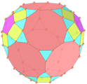 Johnson solids - part 3: J63 - J92</h2>
  A Johnson solid is a strictly convex regular-faced polyhedron that is not uniform. They are named after Norman Woodason Johnson, who in 1966 first listed all 92 such polyhedra. In third part, we have more 30 Johnson solids. 
 
<a href="#ra">Augmented Reality</a>&nbsp;&nbsp;|&nbsp;&nbsp;<a href="#m3d">3D Models</a>&nbsp;&nbsp;|&nbsp;&nbsp;<a href="../">Home</a>

  <h3 align="center">Immersive rooms</h3>
  
<iframe width="100%" src="sala1.htm" title="Sala Imersiva dos Sólidos de Johnson - parte 3" frameborder="0" loading="lazy"></iframe>

  
<a href="sala1.htm" target="_blank">&#x1f517; room 1</a>&nbsp;&nbsp;|&nbsp;&nbsp;<a href="sala2.htm" target="_blank">&#x1f517; room 2</a>&nbsp;&nbsp;|&nbsp;&nbsp;<a href="sala3.htm" target="_blank">&#x1f517; room 3</a>

  

  <h3 id="ra" align="center">Augmented Reality</h3>
  To view Johnson solids in AR, simply visit:

<a href="ra.html" target="_blank">https://paulohscwb.github.io/polyhedra/johnson3/ra.html</a>
 
with any browser with a webcam device (smartphone, tablet or notebook). 
 Access to the VR sites is done by clicking on the blue circle that appears on top of the marker.

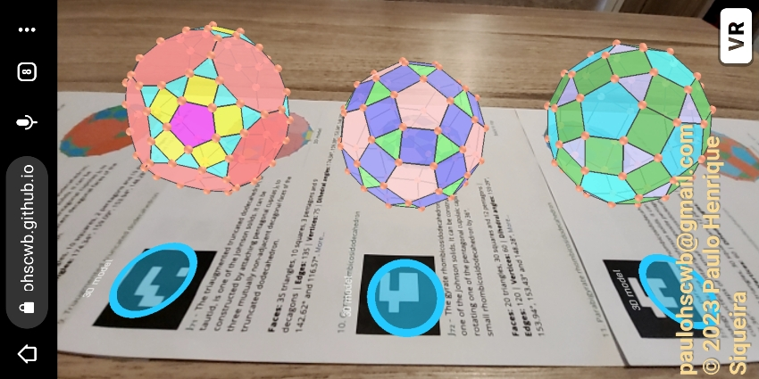

<h3 id="m3d" align="center">3D models</h3>
<iframe width="560" height="315" style="max-width:100%" src="https://www.youtube.com/embed/videoseries?list=PLy0I_lGW8HxXQoWgT-PKQ-avQgnJ3UXuZ" title="YouTube video player" frameborder="0" allow="accelerometer; autoplay; clipboard-write; encrypted-media; gyroscope; picture-in-picture; web-share"  allowfullscreen></iframe>
<h4>1. Tridiminished icosahedron</h4>
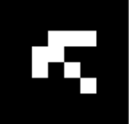
  J63 The tridiminished icosahedron, or teddi, is one of the 92 Johnson solids. It can be constructed by removing 3 mutually non-adjacent vertices from a regular icosahedron. The name refers to one way of constructing it, by removing three pentagonal pyramids J2 from a regular icosahedron, which replaces three sets of five triangular faces from the icosahedron with three mutually adjacent pentagonal faces. 
  <b>Faces:</b> 5 triangles and 3 pentagons | <b>Edges:</b> 15 | <b>Vertices:</b> 9 | <b>Dihedral angles:</b> 138.19°, 100.81° and 63.43°. <a href="https://polytope.miraheze.org/wiki/Tridiminished_icosahedron" target="_blank">More...</a> 

<h4>2. Augmented tridiminished icosahedron</h4>

  J64 The augmented tridiminished icosahedron, or auteddi, is one of the Johnson solids. It can be constructed by attaching a tetrahedron, seen as a triangular pyramid, to the triangular face of the tridiminished icosahedron that is connected only to pentagons. It is the only Johnson solid that is constructed using both diminishing and augmenting, assuming that no diminishing and augmenting cancel each other out.  
  <b>Faces:</b> 7 triangles and 3 pentagons | <b>Edges:</b> 18 | <b>Vertices:</b> 10 | <b>Dihedral angles:</b> 171.34°, 138.19°, 100.81°, 70.53° and 63.43°. <a href="https://polytope.miraheze.org/wiki/Augmented_tridiminished_icosahedron" target="_blank">More...</a> 

<h4>3. Augmented truncated tetrahedron</h4>

  J65 The augmented truncated tetrahedron, or autut, is one of the Johnson solids. It can be constructed by attaching a triangular cupola J3 to one of the hexagonal faces of the truncated tetrahedron.  
  <b>Faces:</b> 8 triangles, 3 squares and 3 hexagons | <b>Edges:</b> 27 | <b>Vertices:</b> 15 | <b>Dihedral angles:</b> 164.21°, 141.06°, 125.26°, 109.47° and 70.53°. <a href="https://polytope.miraheze.org/wiki/Augmented_truncated_tetrahedron" target="_blank">More...</a> 

<h4>4. Augmented truncated cube</h4>
<a href="vr/j66_augmented_truncated_cube.htm" target="_blank" title="3D model" class="fotoA">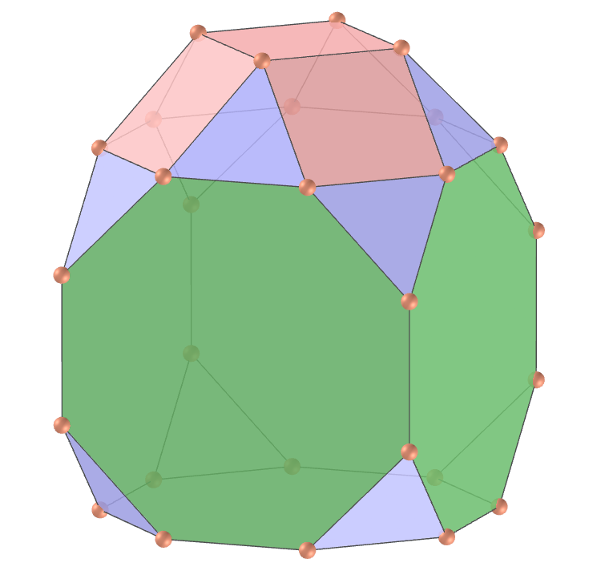</a>
  J66 The augmented truncated cube, or autic, is one of the Johnson solids. It can be constructed by attaching a square cupola J4 to one of the octagonal faces of the truncated cube.
  <b>Faces:</b> 12 triangles, 5 squares and 5 octagons | <b>Edges:</b> 48 | <b>Vertices:</b> 28 | <b>Dihedral angles:</b> 170.26°, 144.74°, 135°, 125.26° and 90°. <a href="https://polytope.miraheze.org/wiki/Augmented_truncated_cube" target="_blank">More...</a> 

<h4>5. Biaugmented truncated cube</h4>

  J67 The biaugmented truncated cube, or bautic, is one of the Johnson solids. It can be constructed by attaching square cupolas J4 to two opposite octagonal faces of the truncated cube.
  <b>Faces:</b> 16 triangles, 10 squares and 4 octagons | <b>Edges:</b> 60 | <b>Vertices:</b> 32 | <b>Dihedral angles:</b> 170.26°, 144.74°, 135°, 125.26° and 90°. <a href="https://polytope.miraheze.org/wiki/Biaugmented_truncated_cube" target="_blank">More...</a> 

<h4>6. Augmented truncated dodecahedron</h4>

  J68 The augmented truncated dodecahedron, or autid, is one of the Johnson solids. It can be constructed by attaching a pentagonal cupola J5 to one of the decagonal faces of the truncated dodecahedron.
  <b>Faces:</b> 25 triangles, 5 squares, 1 pentagon and 11 decagons | <b>Edges:</b> 105 | <b>Vertices:</b> 65 | <b>Dihedral angles:</b> 174.34°, 159.09°, 153.94°, 148.28°, 142.62° and 116.57°. <a href="https://polytope.miraheze.org/wiki/Augmented_truncated_dodecahedron" target="_blank">More...</a> 

<h4>7. Parabiaugmented truncated dodecahedron</h4>

  J69 The parabiaugmented truncated dodecahedron, or pabautid, is one of the Johnson solids. It can be constructed by attaching two pentagonal cupolas J5 to two opposite decagonal faces of the truncated dodecahedron.
  <b>Faces:</b> 30 triangles, 10 squares, 2 pentagons and 10 decagons | <b>Edges:</b> 120 | <b>Vertices:</b> 70 | <b>Dihedral angles:</b> 174.34°, 159.09°, 153.94°, 148.28°, 142.62° and 116.57°. <a href="https://polytope.miraheze.org/wiki/Parabiaugmented_truncated_dodecahedron" target="_blank">More...</a> 

<h4>8. Metabiaugmented truncated dodecahedron</h4>

  J70 The metabiaugmented truncated dodecahedron, or mabautid, is one of the Johnson solids. It can be constructed by attaching two pentagonal cupolas J5 to two non-opposite, non-adjacent decagonal faces of the truncated dodecahedron.
  <b>Faces:</b> 30 triangles, 10 squares, 2 pentagons and 10 decagons | <b>Edges:</b> 120 | <b>Vertices:</b> 70 | <b>Dihedral angles:</b> 174.34°, 159.09°, 153.94°, 148.28°, 142.62° and 116.57°. <a href="https://polytope.miraheze.org/wiki/Metabiaugmented_truncated_dodecahedron" target="_blank">More...</a> 

<h4>9. Triaugmented truncated dodecahedron</h4>

  J71 The triaugmented truncated dodecahedron, or tautid, is one of the Johnson solids. It can be constructed by attaching pentagonal cupolas J5 to three mutually non-adjacent decagonal faces of the truncated dodecahedron.
  <b>Faces:</b> 35 triangles, 10 squares, 3 pentagons and 9 decagons | <b>Edges:</b> 135 | <b>Vertices:</b> 75 | <b>Dihedral angles:</b> 174.34°, 159.09°, 153.94°, 148.28°, 142.62° and 116.57°. <a href="https://polytope.miraheze.org/wiki/Triaugmented_truncated_dodecahedron" target="_blank">More...</a> 

<h4>10. Gyrate rhombicosidodecahedron</h4>
<a href="vr/j72_gyrate_rhombicosidodecahedron.htm" target="_blank" title="3D model" class="fotoA">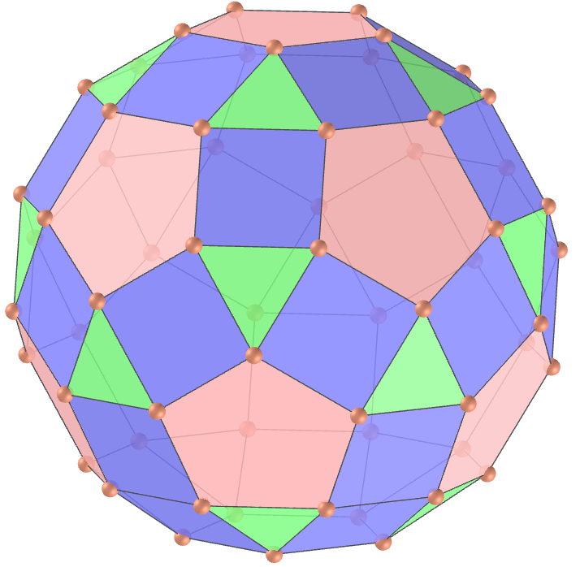</a>
  J72 The gyrate rhombicosidodecahedron, or gyrid, is one of the Johnson solids. It can be constructed by rotating one of the pentagonal cupolaic caps of the small rhombicosidodecahedron by 36°.
  <b>Faces:</b> 20 triangles, 30 squares and 12 pentagons | <b>Edges:</b> 120 | <b>Vertices:</b> 60 | <b>Dihedral angles:</b> 159.09°, 153.94°, 153.43° and 148.28°. <a href="https://polytope.miraheze.org/wiki/Gyrate_rhombicosidodecahedron" target="_blank">More...</a> 

<a href="#p13" class="topo">back to top</a>

<h4>11. Parabigyrate rhombicosidodecahedron</h4>
<a href="vr/j73_parabigyrate_rhombicosidodecahedron.htm" target="_blank" title="3D model" class="fotoA">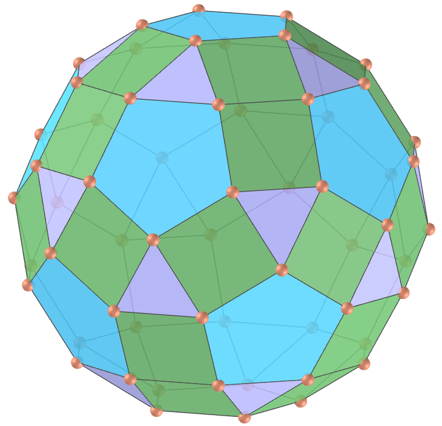</a>
  J73 The parabigyrate rhombicosidodecahedron, or pabgyrid, is one of the Johnson solids. It can be constructed by rotating two opposite pentagonal cupolaic caps of the small rhombicosidodecahedron by 36°.
  <b>Faces:</b> 20 triangles, 30 squares and 12 pentagons | <b>Edges:</b> 120 | <b>Vertices:</b> 60 | <b>Dihedral angles:</b> 159.09°, 153.94°, 153.43° and 148.28°. <a href="https://polytope.miraheze.org/wiki/Parabigyrate_rhombicosidodecahedron" target="_blank">More...</a> 

<h4>12. Metabigyrate rhombicosidodecahedron</h4>

  J74 The metabigyrate rhombicosidodecahedron, or mabgyrid, is one of the Johnson solids. It can be constructed by rotating two non-opposite pentagonal cupolaic caps of the small rhombicosidodecahedron by 36°.
  <b>Faces:</b> 20 triangles, 30 squares and 12 pentagons | <b>Edges:</b> 120 | <b>Vertices:</b> 60 | <b>Dihedral angles:</b> 159.09°, 153.94°, 153.43° and 148.28°. <a href="https://polytope.miraheze.org/wiki/Metabigyrate_rhombicosidodecahedron" target="_blank">More...</a> 

<h4>13. Trigyrate rhombicosidodecahedron</h4>

  J75 The trigyrate rhombicosidodecahedron, or tagyrid, is one of the Johnson solids. It can be constructed by rotating three mutually non-adjacent pentagonal cupolaic caps of the small rhombicosidodecahedron by 36°. 
  <b>Faces:</b> 20 triangles, 30 squares and 12 pentagons | <b>Edges:</b> 120 | <b>Vertices:</b> 60 | <b>Dihedral angles:</b> 159.09°, 153.94°, 153.43° and 148.28°. <a href="https://polytope.miraheze.org/wiki/Trigyrate_rhombicosidodecahedron" target="_blank">More...</a> 

<h4>14. Diminished rhombicosidodecahedron</h4>

  J76 The diminished rhombicosidodecahedron, or dirid, is one of the Johnson solids. It can be constructed by removing one of the pentagonal cupolaic caps of the small rhombicosidodecahedron. 
  <b>Faces:</b> 15 triangles, 25 squares, 11 pentagons and 1 decagon | <b>Edges:</b> 105 | <b>Vertices:</b> 55 | <b>Dihedral angles:</b> 159.09°, 121.72°, 116.57° and 148.28°. <a href="https://polytope.miraheze.org/wiki/Diminished_rhombicosidodecahedron" target="_blank">More...</a> 

<h4>15. Paragyrate diminished rhombicosidodecahedron</h4>
<a href="vr/j77_paragyrate_diminished_rhombicosidodecahedron.htm" target="_blank" title="3D model" class="fotoA">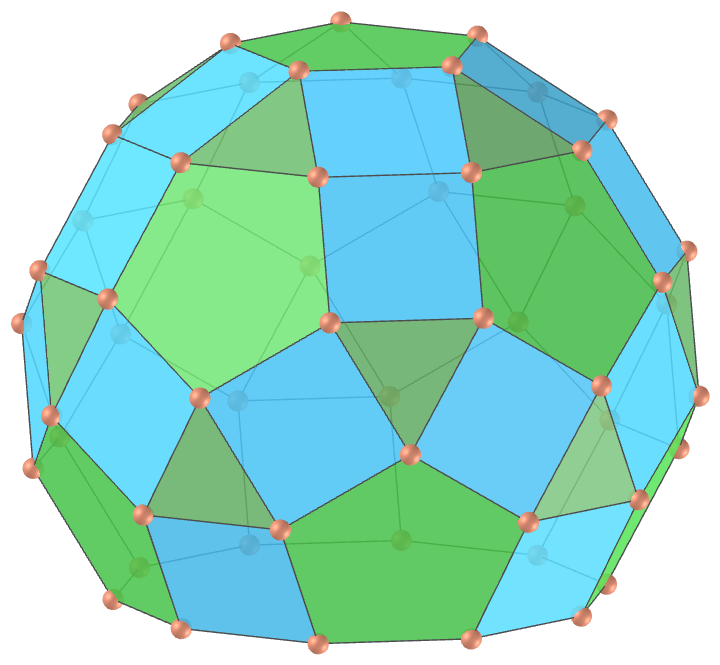</a>
  J77 The paragyrate diminished rhombicosidodecahedron, or pagydrid, is one of the Johnson solids. It can be constructed by removing one of the pentagonal cupolaic caps of the small rhombicosidodecahedron, and rotating the opposite cap by 36°. 
  <b>Faces:</b> 15 triangles, 25 squares, 11 pentagons and 1 decagon | <b>Edges:</b> 105 | <b>Vertices:</b> 55 | <b>Dihedral angles:</b> 159.09°, 121.72°, 153.43°, 153.94°, 116.57° and 148.28°. <a href="https://polytope.miraheze.org/wiki/Paragyrate_diminished_rhombicosidodecahedron" target="_blank">More...</a> 

<h4>16. Metagyrate diminished rhombicosidodecahedron</h4>

  J78 The metagyrate diminished rhombicosidodecahedron, or magydrid, is one of the Johnson solids. It can be constructed by removing one of the pentagonal cupolaic caps of the small rhombicosidodecahedron, and rotating another non-opposite cap by 36°. 
  <b>Faces:</b> 15 triangles, 25 squares, 11 pentagons and 1 decagon | <b>Edges:</b> 105 | <b>Vertices:</b> 55 | <b>Dihedral angles:</b> 159.09°, 121.72°, 153.43°, 153.94°, 116.57° and 148.28°. <a href="https://polytope.miraheze.org/wiki/Metagyrate_diminished_rhombicosidodecahedron" target="_blank">More...</a> 

<h4>17. Bigyrate diminished rhombicosidodecahedron</h4>
<a href="vr/j79_bigyrate_diminished_rhombicosidodecahedron.htm" target="_blank" title="3D model" class="fotoA">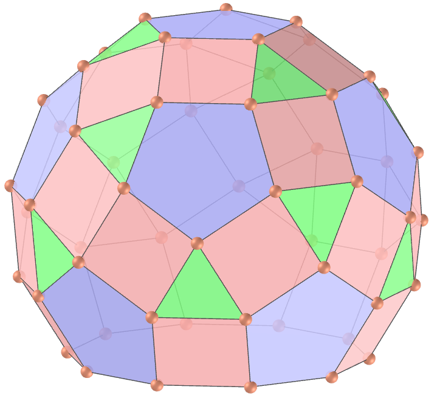</a>
  J79 The bigyrate diminished rhombicosidodecahedron, or bagydrid, is one of the Johnson solids. It can be constructed by removing one of the pentagonal cupolaic caps of the small rhombicosidodecahedron, and rotating two further non-opposite caps by 36°. 
  <b>Faces:</b> 15 triangles, 25 squares, 11 pentagons and 1 decagon | <b>Edges:</b> 105 | <b>Vertices:</b> 55 | <b>Dihedral angles:</b> 159.09°, 121.72°, 153.43°, 153.94°, 116.57° and 148.28°. <a href="https://polytope.miraheze.org/wiki/Bigyrate_diminished_rhombicosidodecahedron" target="_blank">More...</a> 

<h4>18. Parabidiminished rhombicosidodecahedron</h4>

  J80 The parabidiminished rhombicosidodecahedron, or pabidrid, is one of the Johnson solids. It can be constructed by removing two opposite pentagonal cupolaic caps of the small rhombicosidodecahedron. 
  <b>Faces:</b> 10 triangles, 20 squares, 10 pentagons and 2 decagons | <b>Edges:</b> 90 | <b>Vertices:</b> 50 | <b>Dihedral angles:</b> 159.09°, 121.72°, 116.57° and 148.28°. <a href="https://en.wikipedia.org/wiki/Parabidiminished_rhombicosidodecahedron" target="_blank">More...</a> 

<h4>19. Metabidiminished rhombicosidodecahedron</h4>

  J81 The metabidiminished rhombicosidodecahedron, or mabidrid, is one of the Johnson solids. It can be constructed by removing two non-opposite pentagonal cupolaic caps of the small rhombicosidodecahedron. 
  <b>Faces:</b> 10 triangles, 20 squares, 10 pentagons and 2 decagons | <b>Edges:</b> 90 | <b>Vertices:</b> 50 | <b>Dihedral angles:</b> 159.09°, 121.72°, 116.57° and 148.28°. <a href="https://polytope.miraheze.org/wiki/Metabidiminished_rhombicosidodecahedron" target="_blank">More...</a> 

<h4>20. Gyrate bidiminished rhombicosidodecahedron</h4>
<a href="vr/j82_gyrate_bidiminished_rhombicosidodecahedron.htm" target="_blank" title="3D model" class="fotoA">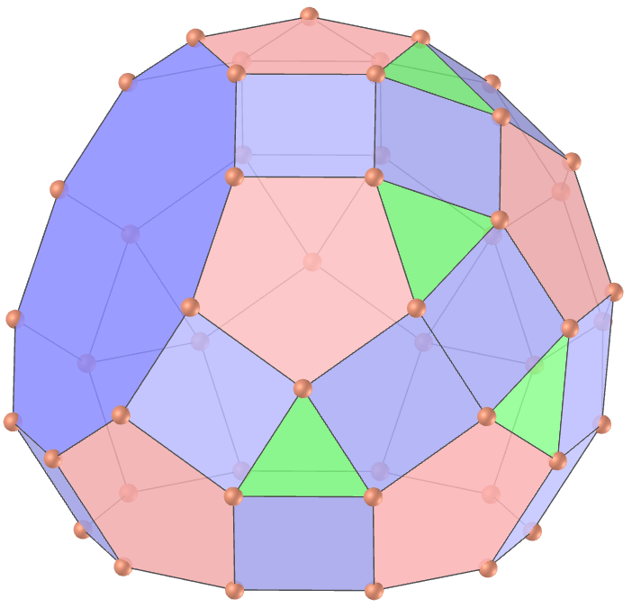</a>
  J82 The gyrate bidiminished rhombicosidodecahedron, or gybadrid, is one of the Johnson solids. It can be constructed by removing two non-opposite pentagonal cupolaic caps of the small rhombicosidodecahedron, and rotating a third cap by 36°. 
  <b>Faces:</b> 10 triangles, 20 squares, 10 pentagons and 2 decagons | <b>Edges:</b> 90 | <b>Vertices:</b> 50 | <b>Dihedral angles:</b> 159.09°, 121.72°, 153.43°, 153.94°, 116.57° and 148.28°. <a href="https://polytope.miraheze.org/wiki/Gyrate_bidiminished_rhombicosidodecahedron" target="_blank">More...</a> 

<a href="#p13" class="topo">back to top</a>

<h4>21. Tridiminished rhombicosidodecahedron</h4>

  J83 The tridiminished rhombicosidodecahedron, or tedrid, is one of the Johnson solids. It can be constructed by removing three pentagonal cupolaic caps of the small rhombicosidodecahedron. 
  <b>Faces:</b> 5 triangles, 15 squares, 9 pentagons and 3 decagons | <b>Edges:</b> 75 | <b>Vertices:</b> 45 | <b>Dihedral angles:</b> 159.09°, 121.72°, 116.57° and 148.28°. <a href="https://polytope.miraheze.org/wiki/Tridiminished_rhombicosidodecahedron" target="_blank">More...</a> 

<h4>22. Snub disphenoid</h4>

  J84 The snub disphenoid, or snadow, is one of the Johnson solids. It can be constructed from a tetrahedron, seen as a digonal antiprism or disphenoid, by expanding the halves outward and inserting a set of 8 triangles in between the halves.
  <b>Faces:</b> 12 triangles | <b>Edges:</b> 18 | <b>Vertices:</b> 8 | <b>Dihedral angles:</b> 96.2°, 121.74° and 166.44°. <a href="https://polytope.miraheze.org/wiki/Snub_disphenoid" target="_blank">More...</a> 

<h4>23. Snub square antiprism</h4>

  J85 The snub square antiprism, or snisquap, is one of the Johnson solids. It can be constructed from a square antiprism by expanding the halves outward and inserting a set of 16 triangles in between the halves. 
  <b>Faces:</b> 24 triangles and 2 squares | <b>Edges:</b> 40 | <b>Vertices:</b> 16 | <b>Dihedral angles:</b> 144.14°, 119.11°, 164.26°, 145.44° and 114.65°. <a href="https://polytope.miraheze.org/wiki/Snub_square_antiprism" target="_blank">More...</a> 

<h4>24. Sphenocorona </h4>

  J86 The sphenocorona, or waco, is one of the Johnson solids. It is one of several polyhedra near the end of the list of Johnson solids with no obvious relation to any of the uniform polyhedra. The name is derived from "spheno" (meaning a wedge-like arrangement of two "lunes", where each lune consists of a square attached to two triangles) and "corona" denoting a crown-like structure composed of 8 triangles. 
  <b>Faces:</b> 12 triangles and 2 squares | <b>Edges:</b> 22 | <b>Vertices:</b> 10 | <b>Dihedral angles:</b> 143.48°, 135.99°, 159.89°, 118.89°, 131.44°, 97.46°, 109.52° and 117.02°. <a href="https://polytope.miraheze.org/wiki/Sphenocorona" target="_blank">More...</a> 

<h4>25. Augmented sphenocorona </h4>
<a href="vr/j87_augmented_sphenocorona.htm" target="_blank" title="3D model" class="fotoA">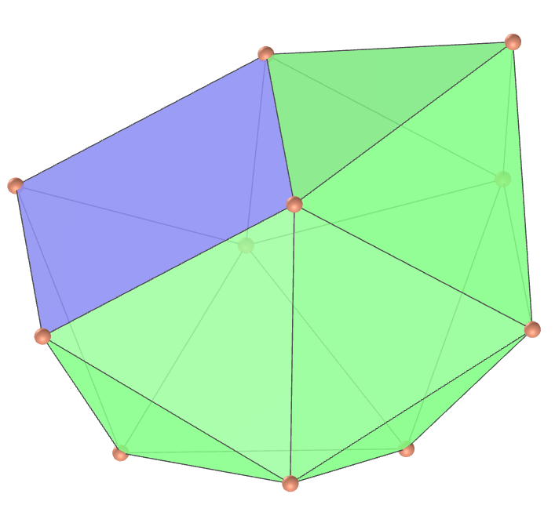</a>
  J87 The augmented sphenocorona, or auwaco, is one of the Johnson solids. It can be constructed by attaching a square pyramid to one of the square faces of the sphenocorona J86. 
  <b>Faces:</b> 16 triangles and 1 square | <b>Edges:</b> 26 | <b>Vertices:</b> 11 | <b>Dihedral angles:</b> 143.48°, 135.99°, 114.74°, 159.89°, 118.89°, 131.44°, 97.46°, 109.52°, 164.26°, 171.75° and 152.19°. <a href="https://polytope.miraheze.org/wiki/Augmented_sphenocorona" target="_blank">More...</a> 

<h4>26. Sphenomegacorona </h4>
<a href="vr/j88_sphenomegacorona.htm" target="_blank" title="3D model" class="fotoA">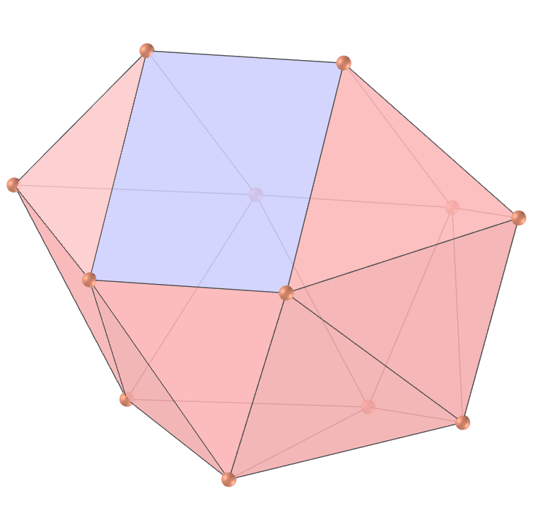</a>
  J88 The sphenomegacorona, or wamco, is one of the Johnson solids. The name is derived from "spheno", meaning a wedge-like arrangement of two "lunes", where each lune consists of a square attached to two triangles, and "megacorona", denoting a large crown-like structure composed of 12 triangles, as opposed to the smaller "corona" of 8 triangles found in the sphenocorona. 
  <b>Faces:</b> 16 triangles and 2 squares | <b>Edges:</b> 28 | <b>Vertices:</b> 12 | <b>Dihedral angles:</b> 86.72°, 117.36°, 129.44°, 137.24°, 143.74°, 154.72°, 161.48° and 171.65°. <a href="https://polytope.miraheze.org/wiki/Sphenomegacorona" target="_blank">More...</a> 

<h4>27. Hebesphenomegacorona</h4>

  J89 The hebesphenomegacorona, or hawmco, is one of the Johnson solids. The name is derived from "hebespheno" (meaning a wedge-like arrangement of three "lunes", where each lune consists of a square attached to two triangles) and "megacorona" denoting a crown-like structure composed of 12 triangles (as opposed to the smaller "corona" of 8 triangles found in the sphenocorona). It has a weak relation to the icosahedron: if the middle square is contracted to an edge such that the neighboring squares become triangles and the neighboring triangles touch, the result is an icosahedron.  
  <b>Faces:</b> 18 triangles and 3 squares | <b>Edges:</b> 33 | <b>Vertices:</b> 14 | <b>Dihedral angles:</b> 157.15°, 141.34°, 128.5°, 111.73°, 149.56°, 101.29°, 152.98°, 102.52° and 133.97°. <a href="https://polytope.miraheze.org/wiki/Hebesphenomegacorona" target="_blank">More...</a> 

<h4>28. Disphenocingulum</h4>

  J90 The disphenocingulum, or dawci, is one of the Johnson solids. The name is derived from "spheno" (meaning a wedge-like arrangement of two "lunes", where each lune consists of a square attached to two triangles - "di" signifying two such complexes) and "cingulum" denoting a crown-like belt of 12 triangles.  
  <b>Faces:</b> 20 triangles and 4 squares | <b>Edges:</b> 38 | <b>Vertices:</b> 16 | <b>Dihedral angles:</b> 124.7°, 148.43°, 133.59°, 166.81°, 154.42°, 134.34° and 100.19°. <a href="https://polytope.miraheze.org/wiki/Disphenocingulum" target="_blank">More...</a> 

<h4>29. Bilunabirotunda</h4>
<a href="vr/j91_bilunabirotunda.htm" target="_blank" title="3D model" class="fotoA">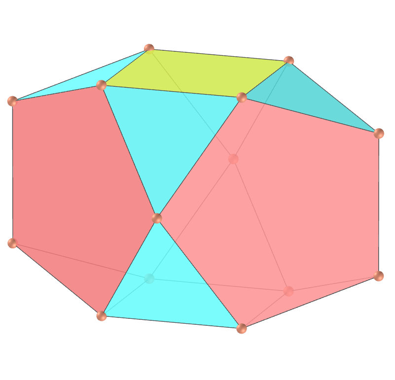</a>
  J91 The bilunabirotunda, or bilbiro, is one of the Johnson solids. The "birotunda" in the name signifies two rotundas, while the "biluna" refers to the two lunes (sections with a square connecting to two triangles). If the "rotunda" parts of two bilunabirotundae are aligned with opposite corresponding parts of an icosidodecahedron, they touch at the center of the icosidodecahedron because each bilunabirotunda's height in this direction is exactly half that of the icosidodecahedron height.  
  <b>Faces:</b> 8 triangles, 2 squares and 4 pentagons | <b>Edges:</b> 26 | <b>Vertices:</b> 14 | <b>Dihedral angles:</b> 159.09°, 142.62°, 110.95°, 100.81° and 63.43°. <a href="https://polytope.miraheze.org/wiki/Bilunabirotunda" target="_blank">More...</a> 

<h4>30. Triangular hebesphenorotunda</h4>
<a href="vr/j92_triangular_hebesphenorotunda.htm" target="_blank" title="3D model" class="fotoA">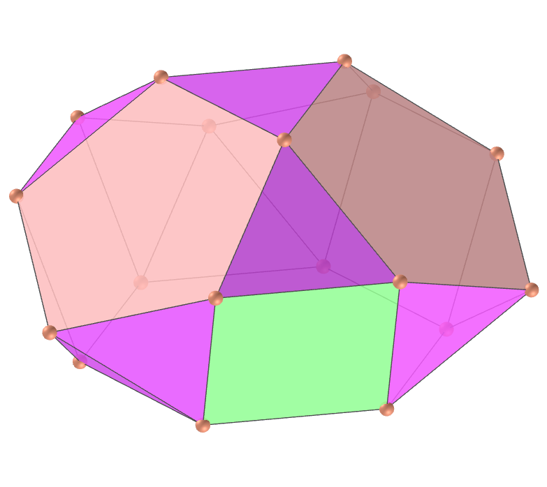</a>
  J92 The triangular hebesphenorotunda, or thawro, is one of the Johnson solids. The triangular hebesphenorotunda has a minor connection with the small rhombicosidodecahedron. The triangles and squares forming the "lune" portion of the shape are congruent with corresponding triangles and squares of the small rhombicosidodecahedron.  
  <b>Faces:</b> 13 triangles, 3 squares, 3 pentagons and 1 hexagon | <b>Edges:</b> 36 | <b>Vertices:</b> 18 | <b>Dihedral angles:</b> 159.09°, 142.62°, 138.19°, 110.95° and 100.81°. <a href="https://polytope.miraheze.org/wiki/Triangular_hebesphenorotunda" target="_blank">More...</a> 

<a href="#p13" class="topo">back to top</a>

  Johnson solids part 3 (J63 - J92): Visualization of polyhedra with Augmented Reality and Virtual Reality by <a xmlns:cc="http://creativecommons.org/ns#" href="https://paulohscwb.github.io/polyhedra/johnson3/" property="cc:attributionName" rel="cc:attributionURL">Paulo Henrique Siqueira</a> is licensed with a license <a rel="license" href="http://creativecommons.org/licenses/by-nc-nd/4.0/">Creative Commons Attribution-NonCommercial-NoDerivatives 4.0 International</a>.

<h4>How to cite this work:</h4> 

Siqueira, P.H., "Johnson solids part 3 (J63 - J92): Visualization of polyhedra with Augmented Reality and Virtual Reality". Available in: <https://paulohscwb.github.io/polyhedra/johnson3/>, July 2023.

  <b>References:</b>
 Weisstein, Eric W. "Johnson Solid" From MathWorld-A Wolfram Web Resource. <a href="https://mathworld.wolfram.com/JohnsonSolid.html" target="_blank">https://mathworld.wolfram.com/JohnsonSolid.html</a>
 Polytope Miraheze <a href="https://polytope.miraheze.org/wiki/Johnson_solid" target="_blank">https://polytope.miraheze.org/wiki/Johnson_solid</a>
 Wikipedia <a href="https://en.wikipedia.org/wiki/Johnson_solid" target="_blank">https://en.wikipedia.org/wiki/Johnson_solid</a>
 McCooey, David I. "Visual Polyhedra". <a href="http://dmccooey.com/polyhedra/" target="_blank">http://dmccooey.com/polyhedra/</a>
