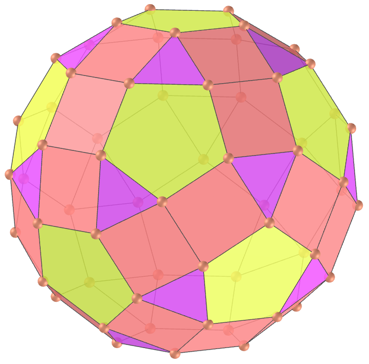
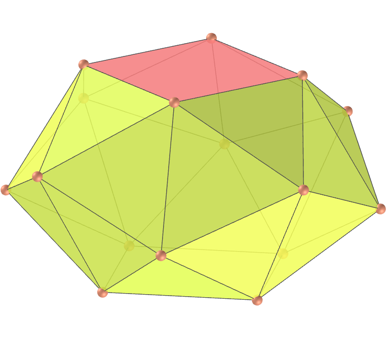

<link rel="stylesheet" href="../scripts/style.css">
<h2>Visualização de poliedros com Realidade Aumentada (RA) e Realidade Virtual (RV) em A-frame</h2>
<b>autor:</b> Paulo Henrique Siqueira - Universidade Federal do Paraná
 <b>contato:</b> <a href="#"> paulohscwb@gmail.com </a>
 <a href="https://paulohscwb.github.io/polyhedra/johnson3/">english version</a>
<form style="margin: 0 auto; float:right; text-align:right; width:100%; margin-bottom:15px;">
	<select id="url" onchange="urlHandler(this.value)" style="color:royalblue;">
		<option disabled selected>Mais poliedros:</option>
		<option value="../../archimedes/pt-br/">Arquimedes</option>
		<option value="../../catalan/pt-br/">Catalan</option>
		<option value="../../nonconvex/pt-br/">Não convexos</option>
		<option value="../../platonic/pt-br/">Platão</option>
		<option value="../../polyhedron/pt-br/">Prismas e antiprismas</option>
		<option value="../../quasiregular/pt-br/">Quase regulares</option>
		<option value="../../selfintersect/pt-br/">Auto-interseção</option>
		<option value="../../selfintersectsnub/pt-br/">Auto-interseção snub</option>
		<option value="../../selfintersecttruncated/pt-br/">Auto-interseção truncados</option>
		<option value="../../johnson1/pt-br/">Johnson: 1-32</option>
		<option value="../../johnson2/pt-br/">Johnson: 33-62</option>
		<option disabled value="../../johnson3/pt-br/">Johnson: 63-92</option>
	</select>
</form>

  <h2 align="center"> Sólidos de Johnson - parte 3: J63 - J92</h2>
  Um sólido de Johnson é um poliedro de face regular estritamente convexo que não é uniforme. Eles receberam o nome de Norman Woodason Johnson, que em 1966 listou pela primeira vez todos os 92 poliedros. Na terceira parte, temos mais 30 sólidos de Johnson. Para visualizar os poliedros de Johnson em RA, visite a página:

<a href="../ra.html" target="_blank">https://paulohscwb.github.io/polyhedra/johnson3/ra.html</a>
 
com qualquer navegador com um dispositivo de webcam (smartphone, tablet ou notebook).
 O acesso às páginas de RV é feito clicando no círculo azul que aparece em cima de cada marcador.

<h4>1. Icosaedro tridiminuído</h4>

  J63 O icosaedro tridiminuído, ou teddi, é um dos 92 sólidos de Johnson. Pode ser construído removendo 3 vértices mutuamente não adjacentes de um icosaedro regular. O nome refere-se a uma maneira de construí-lo, removendo três pirâmides pentagonais J2 de um icosaedro regular, que substitui três conjuntos de cinco faces triangulares do icosaedro por três faces pentagonais mutuamente adjacentes.
  <b>Faces:</b> 5 triângulos e 3 pentágonos | <b>Arestas:</b> 15 | <b>Vértices:</b> 9 | <b>Ângulos diédricos:</b> 138.19°, 100.81° e 63.43°. <a href="https://polytope.miraheze.org/wiki/Tridiminished_icosahedron" target="_blank">Mais sobre...</a>

<h4>2. Icosaedro tridiminuído aumentado</h4>

  J64 O icosaedro tridiminuído aumentado, ou auteddi, é um dos sólidos de Johnson. Ele pode ser construído anexando um tetraedro, visto como uma pirâmide triangular, à face triangular do icosaedro tridiminuído que está conectado apenas aos pentágonos. É o único sólido de Johnson que é construído usando diminuição e aumento, assumindo que nenhuma diminuição e aumento se anulam.
  <b>Faces:</b> 7 triângulos e 3 pentágonos | <b>Arestas:</b> 18 | <b>Vértices:</b> 10 | <b>Ângulos diédricos:</b> 171.34°, 138.19°, 100.81°, 70.53° e 63.43°. <a href="https://polytope.miraheze.org/wiki/Augmented_tridiminished_icosahedron" target="_blank">Mais sobre...</a>

<h4>3. Tetraedro truncado aumentado</h4>

  J65 O tetraedro truncado aumentado, ou autut, é um dos sólidos de Johnson. Pode ser construído anexando uma cúpula triangular J3 a uma das faces hexagonais do tetraedro truncado.
  <b>Faces:</b> 8 triângulos, 3 quadrados e 3 hexágonos | <b>Arestas:</b> 27 | <b>Vértices:</b> 15 | <b>Ângulos diédricos:</b> 164.21°, 141.06°, 125.26°, 109.47° e 70.53°. <a href="https://polytope.miraheze.org/wiki/Augmented_truncated_tetrahedron" target="_blank">Mais sobre...</a>

<h4>4. Cubo truncado aumentado</h4>

  J66 O cubo truncado aumentado, ou autic, é um dos sólidos de Johnson. Pode ser construído anexando uma cúpula quadrada J4 a uma das faces octogonais do cubo truncado.
  <b>Faces:</b> 12 triângulos, 5 quadrados e 5 octógonos | <b>Arestas:</b> 48 | <b>Vértices:</b> 28 | <b>Ângulos diédricos:</b> 170.26°, 144.74°, 135°, 125.26° e 90°. <a href="https://polytope.miraheze.org/wiki/Augmented_truncated_cube" target="_blank">Mais sobre...</a>

<h4>5. Cubo truncado biaumentado</h4>

  J67 O cubo truncado biaumentado, ou bautic, é um dos sólidos de Johnson. Ele pode ser construído anexando cúpulas quadradas J4 a duas faces octogonais opostas do cubo truncado.
  <b>Faces:</b> 16 triângulos, 10 quadrados e 4 octógonos | <b>Arestas:</b> 60 | <b>Vértices:</b> 32 | <b>Ângulos diédricos:</b> 170.26°, 144.74°, 135°, 125.26° e 90°. <a href="https://polytope.miraheze.org/wiki/Biaugmented_truncated_cube" target="_blank">Mais sobre...</a>

<h4>6. Dodecaedro truncado aumentado</h4>

  J68 O dodecaedro truncado aumentado, ou autid, é um dos sólidos de Johnson. Pode ser construído anexando uma cúpula pentagonal J5 a uma das faces decagonais do dodecaedro truncado.
  <b>Faces:</b> 25 triângulos, 5 quadrados, 1 pentágono e 11 decágonos | <b>Arestas:</b> 105 | <b>Vértices:</b> 65 | <b>Ângulos diédricos:</b> 174.34°, 159.09°, 153.94°, 148.28°, 142.62° e 116.57°. <a href="https://polytope.miraheze.org/wiki/Augmented_truncated_dodecahedron" target="_blank">Mais sobre...</a>

<h4>7. Dodecaedro truncado parabiaumentado</h4>

  J69 O dodecaedro truncado parabiaumentado, ou pabautid, é um dos sólidos de Johnson. Ele pode ser construído anexando duas cúpulas pentagonais J5 a duas faces decagonais opostas do dodecaedro truncado.
  <b>Faces:</b> 30 triângulos, 10 quadrados, 2 pentágonos e 10 decágonos | <b>Arestas:</b> 120 | <b>Vértices:</b> 70 | <b>Ângulos diédricos:</b> 174.34°, 159.09°, 153.94°, 148.28°, 142.62° e 116.57°. <a href="https://polytope.miraheze.org/wiki/Parabiaugmented_truncated_dodecahedron" target="_blank">Mais sobre...</a>

<h4>8. Dodecaedro truncado metabiaumentado</h4>

  J70 O dodecaedro truncado metabiaumentado, ou mabautid, é um dos sólidos de Johnson. Ele pode ser construído anexando duas cúpulas pentagonais J5 a duas faces decagonais não opostas e não adjacentes do dodecaedro truncado.
  <b>Faces:</b> 30 triângulos, 10 quadrados, 2 pentágonos e 10 decágonos | <b>Arestas:</b> 120 | <b>Vértices:</b> 70 | <b>Ângulos diédricos:</b> 174.34°, 159.09°, 153.94°, 148.28°, 142.62° e 116.57°. <a href="https://polytope.miraheze.org/wiki/Parabiaugmented_truncated_dodecahedron" target="_blank">Mais sobre...</a>

<h4>9. Dodecaedro truncado triaumentado</h4>

  J71 O dodecaedro truncado triaumentado, ou tautid, é um dos sólidos de Johnson. Ele pode ser construído anexando cúpulas pentagonais J5 a três faces decagonais mutuamente não adjacentes do dodecaedro truncado.
  <b>Faces:</b> 35 triângulos, 15 quadrados, 3 pentágonos e 9 decágonos | <b>Arestas:</b> 135 | <b>Vértices:</b> 75 | <b>Ângulos diédricos:</b> 174.34°, 159.09°, 153.94°, 148.28°, 142.62° e 116.57°. <a href="https://polytope.miraheze.org/wiki/Triaugmented_truncated_dodecahedron" target="_blank">Mais sobre...</a>

<h4>10. Rombicosidodecaedro girado</h4>

  J72 O rombicosidodecaedro girado, ou gyrid, é um dos sólidos de Johnson. Ele pode ser construído girando uma das cúpulas pentagonais do pequeno rombicosidodecaedro em 36°.
  <b>Faces:</b> 20 triângulos, 30 quadrados e 12 pentágonos | <b>Arestas:</b> 120 | <b>Vértices:</b> 60 | <b>Ângulos diédricos:</b> 159.09°, 153.94°, 153.43° e 148.28°. <a href="https://polytope.miraheze.org/wiki/Gyrate_rhombicosidodecahedron" target="_blank">Mais sobre...</a>

<a href="#p13" class="topo">voltar ao topo</a>

<h4>11. Rombicosidodecaedro parabigirado</h4>

  J73 O rombicosidodecaedro parabigirado, ou pabgyrid, é um dos sólidos de Johnson. Ele pode ser construído girando duas cúpulas pentagonais opostas do pequeno rombicosidodecaedro em 36°.
  <b>Faces:</b> 20 triângulos, 30 quadrados e 12 pentágonos | <b>Arestas:</b> 120 | <b>Vértices:</b> 60 | <b>Ângulos diédricos:</b> 159.09°, 153.94°, 153.43° e 148.28°. <a href="https://polytope.miraheze.org/wiki/Parabigyrate_rhombicosidodecahedron" target="_blank">Mais sobre...</a>

<h4>12. Rombicosidodecaedro metabigirado</h4>

  J74 O rombicosidodecaedro metabigirato, ou mabgyrid, é um dos sólidos de Johnson. Ele pode ser construído girando duas cúpulas pentagonais não opostas do pequeno rombicosidodecaedro em 36°.
  <b>Faces:</b> 20 triângulos, 30 quadrados e 12 pentágonos | <b>Arestas:</b> 120 | <b>Vértices:</b> 60 | <b>Ângulos diédricos:</b> 159.09°, 153.94°, 153.43° e 148.28°. <a href="https://polytope.miraheze.org/wiki/Metabigyrate_rhombicosidodecahedron" target="_blank">Mais sobre...</a>

<h4>13. Rombicosidodecaedro trigirado</h4>

  J75 O rombicosidodecaedro trigirado, ou tagyrid, é um dos sólidos de Johnson. Ele pode ser construído girando três cúpulas pentagonais mutuamente não adjacentes do pequeno rombicosidodecaedro em 36°.
  <b>Faces:</b> 20 triângulos, 30 quadrados e 12 pentágonos | <b>Arestas:</b> 120 | <b>Vértices:</b> 60 | <b>Ângulos diédricos:</b> 159.09°, 153.94°, 153.43° e 148.28°. <a href="https://polytope.miraheze.org/wiki/Trigyrate_rhombicosidodecahedron" target="_blank">Mais sobre...</a>

<h4>14. Rombicosidodecaedro diminuído</h4>

  J76 O rombicosidodecaedro diminuído, ou dirid, é um dos sólidos de Johnson. Pode ser construído removendo uma das cúpulas pentagonais do pequeno rombicosidodecaedro.
  <b>Faces:</b> 15 triângulos, 25 quadrados, 11 pentágonos e 1 decágono | <b>Arestas:</b> 105 | <b>Vértices:</b> 55 | <b>Ângulos diédricos:</b> 159.09°, 121.72°, 116.57° e 148.28°. <a href="https://polytope.miraheze.org/wiki/Diminished_rhombicosidodecahedron" target="_blank">Mais sobre...</a>

<h4>15. Rombicosidodecaedro diminuído paragirado</h4>

  J77 O rombicosidodecaedro diminuído paragirado, ou pagydrid, é um dos sólidos de Johnson. Ele pode ser construído removendo uma das cúpulas pentagonais do pequeno rombicosidodecaedro e girando a cúpula oposta em 36°.
  <b>Faces:</b> 15 triângulos, 25 quadrados, 11 pentágonos e 1 decágono | <b>Arestas:</b> 105 | <b>Vértices:</b> 55 | <b>Ângulos diédricos:</b> 159.09°, 121.72°, 153.43°, 153.94°, 116.57° e 148.28°. <a href="https://polytope.miraheze.org/wiki/Paragyrate_diminished_rhombicosidodecahedron" target="_blank">Mais sobre...</a>

<h4>16. Rombicosidodecaedro diminuído metagirado</h4>

  J78 O rombicosidodecaedro diminuído metagirado, ou magydrid, é um dos sólidos de Johnson. Ele pode ser construído removendo uma das cúpulas pentagonais do pequeno rombicosidodecaedro e girando outra cúpula não oposta em 36°.
  <b>Faces:</b> 15 triângulos, 25 quadrados, 11 pentágonos e 1 decágono | <b>Arestas:</b> 105 | <b>Vértices:</b> 55 | <b>Ângulos diédricos:</b> 159.09°, 121.72°, 153.43°, 153.94°, 116.57° e 148.28°. <a href="https://polytope.miraheze.org/wiki/Metagyrate_diminished_rhombicosidodecahedron" target="_blank">Mais sobre...</a>

<h4>17. Rombicosidodecaedro diminuído bigirado</h4>

  J79 O rombicosidodecaedro diminuído bigirado, ou bagydrid, é um dos sólidos de Johnson. Ele pode ser construído removendo uma das cúpulas pentagonais do pequeno rombicosidodecaedro e girando mais duas cúpulas não opostas em 36°.
  <b>Faces:</b> 15 triângulos, 25 quadrados, 11 pentágonos e 1 decágono | <b>Arestas:</b> 105 | <b>Vértices:</b> 55 | <b>Ângulos diédricos:</b> 159.09°, 121.72°, 153.43°, 153.94°, 116.57° e 148.28°. <a href="https://polytope.miraheze.org/wiki/Bigyrate_diminished_rhombicosidodecahedron" target="_blank">Mais sobre...</a>

<h4>18. Rombicosidodecaedro parabidiminuído</h4>

  J80 O rombicosidodecaedro parabidiminuído, ou pabidrid, é um dos sólidos de Johnson. Ele pode ser construído removendo-se duas cúpulas pentagonais opostas do pequeno rombicosidodecaedro.
  <b>Faces:</b> 10 triângulos, 20 quadrados, 10 pentágonos e 2 decágonos | <b>Arestas:</b> 90 | <b>Vértices:</b> 50 | <b>Ângulos diédricos:</b> 159.09°, 121.72°, 116.57° e 148.28°. <a href="https://en.wikipedia.org/wiki/Parabidiminished_rhombicosidodecahedron" target="_blank">Mais sobre...</a>

<h4>19. Rombicosidodecaedro metabidiminuído</h4>

  J81 O rombicosidodecaedro metabidiminuído, ou mabidrid, é um dos sólidos de Johnson. Ele pode ser construído removendo-se duas cúpulas pentagonais não opostas do pequeno rombicosidodecaedro.
  <b>Faces:</b> 10 triângulos, 20 quadrados, 10 pentágonos e 2 decágonos | <b>Arestas:</b> 90 | <b>Vértices:</b> 50 | <b>Ângulos diédricos:</b> 159.09°, 121.72°, 116.57° e 148.28°. <a href="https://polytope.miraheze.org/wiki/Metabidiminished_rhombicosidodecahedron" target="_blank">Mais sobre...</a>

<h4>20. Rombicosidodecaedro bidiminuído girado</h4>

  J82 O rombicosidodecaedro bidiminuído girado, ou gybadrid, é um dos sólidos de Johnson. Ele pode ser construído removendo-se duas cúpulas pentagonais não opostas do pequeno rombicosidodecaedro e girando uma terceira cúpula em 36°.
  <b>Faces:</b> 10 triângulos, 20 quadrados, 10 pentágonos e 2 decágonos | <b>Arestas:</b> 90 | <b>Vértices:</b> 50 | <b>Ângulos diédricos:</b> 159.09°, 121.72°, 153.43°, 153.94°, 116.57° e 148.28°. <a href="https://polytope.miraheze.org/wiki/Gyrate_bidiminished_rhombicosidodecahedron" target="_blank">Mais sobre...</a>

<a href="#p13" class="topo">voltar ao topo</a>

<h4>21. Rombicosidodecaedro tridiminuído</h4>

  J83 O rombicosidodecaedro tridiminuído, ou tedrid, é um dos sólidos de Johnson. Pode ser construído removendo três cúpulas pentagonais do pequeno rombicosidodecaedro.
  <b>Faces:</b> 5 triângulos, 15 quadrados, 9 pentágonos e 3 decágonos | <b>Arestas:</b> 75 | <b>Vértices:</b> 45 | <b>Ângulos diédricos:</b> 159.09°, 121.72°, 116.57° e 148.28°. <a href="https://polytope.miraheze.org/wiki/Tridiminished_rhombicosidodecahedron" target="_blank">Mais sobre...</a>

<h4>22. Disfenóide snub</h4>

  J84 O disfenóide snub, ou snadow, é um dos sólidos de Johnson. Pode ser construído a partir de um tetraedro, visto como um antiprisma digonal ou disfenóide, expandindo as duas metades para fora e inserindo um conjunto de 8 triângulos entre as metades.
  <b>Faces:</b> 12 triângulos | <b>Arestas:</b> 18 | <b>Vértices:</b> 8 | <b>Ângulos diédricos:</b> 96.2°, 121.74° e 166.44°. <a href="https://polytope.miraheze.org/wiki/Snub_disphenoid" target="_blank">Mais sobre...</a>

<h4>23. Antiprisma quadrado snub</h4>

  J85 O antiprisma quadrado snub, ou snisquap, é um dos sólidos de Johnson. Ele pode ser construído a partir de um antiprisma quadrado expandindo as duas metades para fora e inserindo um conjunto de 16 triângulos entre as metades.
  <b>Faces:</b> 24 triângulos e 2 quadrados | <b>Arestas:</b> 40 | <b>Vértices:</b> 16 | <b>Ângulos diédricos:</b> 144.14°, 119.11°, 164.26°, 145.44° e 114.65°. <a href="https://polytope.miraheze.org/wiki/Snub_square_antiprism" target="_blank">Mais sobre...</a>

<h4>24. Esfenocorona</h4>

  J86 A esfenocorona, ou waco, é um dos sólidos de Johnson. É um dos vários poliedros próximos ao final da lista de sólidos de Johnson sem alguma relação óbvia com um dos poliedros uniformes. O nome é derivado de "spheno" (que significa um arranjo em forma de cunha de duas "luas", onde cada lua consiste em um quadrado ligado a dois triângulos) e "corona" denotando uma estrutura em forma de coroa composta por 8 triângulos.
  <b>Faces:</b> 12 triângulos e 2 quadrados | <b>Arestas:</b> 22 | <b>Vértices:</b> 10 | <b>Ângulos diédricos:</b> 143.48°, 135.99°, 114.74°, 159.89°, 118.89°, 131.44°, 97.46°, 109.52° e 117.02°. <a href="https://polytope.miraheze.org/wiki/Sphenocorona" target="_blank">Mais sobre...</a>

<h4>25. Esfenocorona aumentada</h4>

  J87 A esfenocorona aumentada, ou auwaco, é um dos sólidos de Johnson. Pode ser construída anexando uma pirâmide quadrada a uma das faces quadradas da esfenocorona J86.
  <b>Faces:</b> 16 triângulos e 1 quadrado | <b>Arestas:</b> 26 | <b>Vértices:</b> 11 | <b>Ângulos diédricos:</b> 143.48°, 135.99°, 114.74°, 159.89°, 118.89°, 131.44°, 97.46°, 109.52°, 164.26°, 171.75°, e 152.19°. <a href="https://polytope.miraheze.org/wiki/Augmented_sphenocorona" target="_blank">Mais sobre...</a>

<h4>26. Esfenomegacorona</h4>

  J88 A esfenomegacorona, ou wamco, é um dos sólidos de Johnson. O nome é derivado de "spheno", que significa um arranjo em forma de cunha de duas "luas", onde cada lua consiste em um quadrado ligado a dois triângulos, e "megacorona", denotando uma grande estrutura em forma de coroa composta por 12 triângulos, oposta à menor "coroa" de 8 triângulos encontrados na esfenocorona.
  <b>Faces:</b> 16 triângulos e 2 quadrados | <b>Arestas:</b> 28 | <b>Vértices:</b> 12 | <b>Ângulos diédricos:</b> 86.72°, 117.36°, 129.44°, 137.24°, 143.74°, 154.72°, 161.48° e 171.65°. <a href="https://polytope.miraheze.org/wiki/Sphenomegacorona" target="_blank">Mais sobre...</a>

<h4>27. Hebesfenomegacorona</h4>

  J89 A hebesfenomegacorona, ou hawmco, é um dos sólidos de Johnson. O nome é derivado de "hebespheno" (que significa um arranjo em forma de cunha de três "luas", onde cada lua consiste em um quadrado ligado a dois triângulos) e "megacorona" denotando uma estrutura em forma de coroa composta por 12 triângulos (em oposição à menor "coroa" de 8 triângulos encontrados na esfenocorona). Tem uma distante relação com o icosaedro: se o quadrado do meio for contraído até uma aresta de modo que os quadrados vizinhos se tornem triângulos e os triângulos vizinhos se toquem, o resultado é um icosaedro.
  <b>Faces:</b> 18 triângulos e 3 quadrados | <b>Arestas:</b> 33 | <b>Vértices:</b> 14 | <b>Ângulos diédricos:</b> 157.15°, 141.34°, 128.5°, 111.73°, 149.56°, 101.29°, 152.98°, 102.52° e 133.97°. <a href="https://polytope.miraheze.org/wiki/Hebesphenomegacorona" target="_blank">Mais sobre...</a>

<h4>28. Disphenocingulum</h4>

  J90 O disphenocingulum, ou dawci, é um dos sólidos de Johnson. O nome é derivado de "spheno" (que significa um arranjo em forma de cunha de duas "luas", onde cada lua consiste em um quadrado ligado a dois triângulos - "di" significando dois desses complexos) e "cingulum" denotando uma forma de coroa de 12 triângulos.
  <b>Faces:</b> 20 triângulos e 4 quadrados | <b>Arestas:</b> 38 | <b>Vértices:</b> 16 | <b>Ângulos diédricos:</b> 124.7°, 148.43°, 133.59°, 166.81°, 154.42°, 134.34° e 100.19°. <a href="https://polytope.miraheze.org/wiki/Disphenocingulum" target="_blank">Mais sobre...</a>

<h4>29. Birotunda bilunar</h4>

  J91 A birotunda bilunar, ou bilbiro, é um dos sólidos de Johnson. A "birotunda" no nome significa essas duas áreas, enquanto a "bilunar" se refere às duas luas (seções com um quadrado conectando-se a dois triângulos). Se as partes "rotunda" de dois bilunabirotundae estiverem alinhadas com as partes correspondentes opostas de um icosidodecaedro, elas se tocam no centro do icosidodecaedro porque a altura de cada bilunabirotunda nessa direção é exatamente a metade da altura do icosidodecaedro.
  <b>Faces:</b> 8 triângulos, 2 quadrados e 4 pentágonos | <b>Arestas:</b> 26 | <b>Vértices:</b> 14 | <b>Ângulos diédricos:</b> 159.09°, 142.62°, 110.95°, 100.81° e 63.43°. <a href="https://polytope.miraheze.org/wiki/Bilunabirotunda" target="_blank">Mais sobre...</a>

<h4>30. Hebesfenorotunda triangular</h4>

  J92 A hebesfenorotunda triangular, ou thawro, é um dos sólidos de Johnson. A hebesfenorotunda triangular também tem uma conexão com o pequeno rombicosidodecaedro. Os triângulos e quadrados que formam a porção "lunar" da forma são congruentes com os triângulos e quadrados correspondentes do pequeno rombicosidodecaedro.
  <b>Faces:</b> 13 triângulos, 3 quadrados, 3 pentágonos e 1 hexágono | <b>Arestas:</b> 36 | <b>Vértices:</b> 18 | <b>Ângulos diédricos:</b> 159.09°, 142.62°, 138.19°, 110.95° e 100.81°.. <a href="https://polytope.miraheze.org/wiki/Triangular_hebesphenorotunda" target="_blank">Mais sobre...</a>

<a href="#p13" class="topo">voltar ao topo</a>

 
  Polyhedra: Johnson solids - part 3 de <a xmlns:cc="http://creativecommons.org/ns#" href="https://paulohscwb.github.io/polyhedra/johnson3/" property="cc:attributionName" rel="cc:attributionURL">Paulo Henrique Siqueira</a> está licenciado com uma Licença <a rel="license" href="http://creativecommons.org/licenses/by-nc-nd/4.0/">Creative Commons Atribuição-NãoComercial-SemDerivações 4.0 Internacional</a>.

<h4>Como citar este trabalho:</h4> 

Siqueira, P.H., "Polyhedra: Johnson solids - part 3". Disponível em: <https://paulohscwb.github.io/polyhedra/johnson3/>, Julho de 2023.

 <b>Referências:</b>
 Weisstein, Eric W. "Archimedean Solid" From MathWorld-A Wolfram Web Resource. <a href="http://mathworld.wolfram.com/ArchimedeanSolid.html" target="_blank">http://mathworld.wolfram.com/ArchimedeanSolid.html</a>
 Weisstein, Eric W. "Platonic Solid" From MathWorld-A Wolfram Web Resource. <a href="http://mathworld.wolfram.com/PlatonicSolid.html" target="_blank">http://mathworld.wolfram.com/PlatonicSolid.html</a>
 Weisstein, Eric W. "Archimedean Dual" From MathWorld-A Wolfram Web Resource. <a href="https://mathworld.wolfram.com/ArchimedeanDual.html" target="_blank">https://mathworld.wolfram.com/ArchimedeanDual.html</a>
 Weisstein, Eric W. "Uniform Polyhedron." From MathWorld--A Wolfram Web Resource. <a href="https://mathworld.wolfram.com/UniformPolyhedron.html" target="_blank">https://mathworld.wolfram.com/UniformPolyhedron.html</a>
 Wikipedia <a href="https://en.wikipedia.org/wiki/Archimedean_solid" target="_blank">https://en.wikipedia.org/wiki/Archimedean_solid</a>
 Wikipedia <a href="https://en.wikipedia.org/wiki/en.wikipedia.org/wiki/Platonic_solid" target="_blank">https://en.wikipedia.org/wiki/Platonic_solid</a>
 McCooey, David I. "Visual Polyhedra". <a href="http://dmccooey.com/polyhedra/" target="_blank">http://dmccooey.com/polyhedra/</a>
