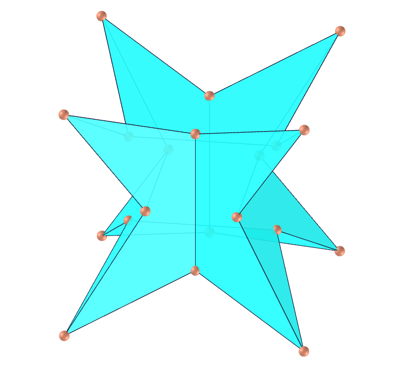
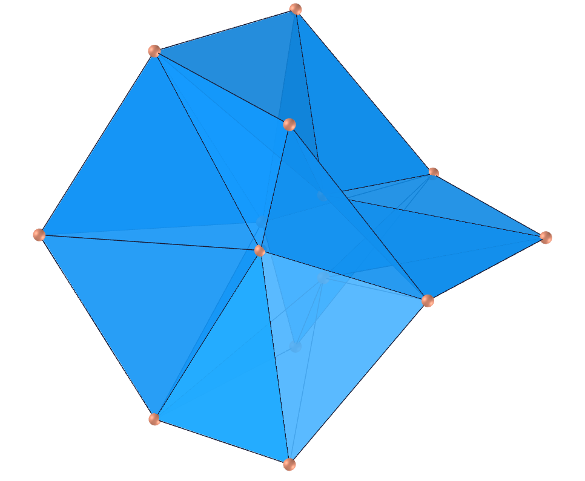
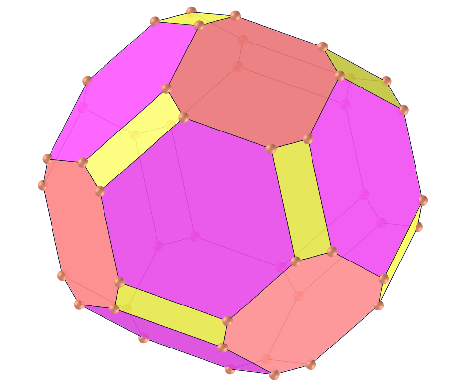

<link rel="stylesheet" href="scripts/style.css">
<h2>Visualization of polyhedra with Augmented Reality (AR) and Virtual Reality (VR) in A-frame</h2>
 <b>author:</b> Paulo Henrique Siqueira - Universidade Federal do Paraná
  <b>contact:</b> <a href="#">paulohscwb@gmail.com</a>
  <a href="https://paulohscwb.github.io/polyhedra/nonconvex/pt-br/">versão em português</a>
<form style="margin: 0 auto; float:right; text-align:right; width:100%; margin-bottom:15px;">
	<select id="url" onchange="urlHandler(this.value)" style="color:royalblue;">
		<option disabled selected value>More polyhedra:</option>
		<option value="../archimedes/">Archimedes</option>
		<option value="../catalan/">Catalan</option>
		<option value="../johnson/">Johnson</option>
		<option disabled value="../nonconvex/">Non convex</option>
		<option value="../platonic/">Platonic</option>
		<option value="../polyhedron/">Prisms and antiprisms</option>
		<option value="../quasiregular/">Quasi regular</option>
		<option value="../selfintersect/">Self-intersecting</option>
		<option value="../selfintersectsnub/">Self-intersecting snub</option>
		<option value="../selfintersecttruncated/">Self-intersecting truncated</option>
	</select>
</form>

  <h2 align="center">Nonconvex polyhedra</h2>
A polyhedron is nonconvex if at least one of its diagonals is outside the region bounded by its faces. To view nonconvex polyhedra in AR, simply visit:

<a href="ra.html" target="_blank">https://paulohscwb.github.io/polyhedra/nonconvex/ra.html</a>
 
with any browser with a webcam device (smartphone, tablet or notebook). 
 Access to the VR sites is done by clicking on the blue circle that appears on top of the marker.

<iframe width="560" height="315" style="max-width:100%" src="https://www.youtube.com/embed/playlist?list=PLy0I_lGW8HxWJpy766Me-L4lhuQGfqR9Y" title="YouTube video player" frameborder="0" allow="accelerometer; autoplay; clipboard-write; encrypted-media; gyroscope; picture-in-picture; web-share" allowfullscreen></iframe>

<h4>1. Escher's Solid</h4>
 
  Escher's solid is illustrated on the right pedestal in M. C. Escher's "Waterfall" woodcut. It is obtained by augmenting a rhombic dodecahedron until incident edges become parallel, corresponding to augmentation of height for a rhombic dodecahedron. It is the first rhombic dodecahedron stellation and is a space-filling polyhedron. Its convex hull is a cuboctahedron. Its isosceles triangles faces have vertex angles of 70.53° (once) and 54.73° (twice).
  <b>Faces:</b> 48 isosceles triangles | <b>Edges:</b> 72 | <b>Vertices:</b> 26 | <b>Dihedral angles:</b> 117.04° and 90°. <a href="https://mathworld.wolfram.com/EschersSolid.html" target="_blank">More...</a>

<h4>2. Escher's Solid Dual</h4>
 
  The Escher's solid dual was modeled by the author of this page (Paulo Henrique Siqueira) using the coordinates of the vertices and the respective edges of the Escher solid. It is a truncated cube, determining hexagonal, octagonal and rectangular faces.
  <b>Faces:</b> 8 regular hexagons, 6 octagons and 12 rectangles | <b>Edges:</b> 72 | <b>Vertices:</b> 48 | <b>Dihedral angles:</b> 114.74°, 125,26° and 135°. <a href="https://mathworld.wolfram.com/EschersSolid.html" target="_blank">More...</a>
 

 <h4>3. Stella Octangula</h4>
 
  The stella octangula is a polyhedron composed of a tetrahedron and its dual (a second tetrahedron rotated 180 degrees with respect to the first). The stella octangula is also (incorrectly) called the stellated tetrahedron, and is the only stellation of the octahedron. A wireframe version of the stella octangula is sometimes known as the merkaba and has mystical properties.
  <b>Faces:</b> 8 equilateral triangles | <b>Edges:</b> 12 | <b>Vertices:</b> 8 | <b>Dihedral angle:</b> 70.53°. <a href="https://mathworld.wolfram.com/StellaOctangula.html" target="_blank">More...</a>
 

 <h4>4. Rhombic Hexecontahedron</h4>
 
  The rhombic hexecontahedron is a 60-faced polyhedron that can be obtained by stellating the rhombic triacontahedron, by placing a plane along each edge which is perpendicular to the plane of symmetry in which the edge lies, and taking the solid bounded by these planes gives a hexecontahedron. Therefore, it is a rhombic triacontahedron stellation. Its rhombi faces have vertex angles of 63.43° and 116.57°.
  <b>Faces:</b> 60 rhombi | <b>Edges:</b> 120 | <b>Vertices:</b> 62 | <b>Dihedral angles:</b> 72° and 216°. <a href="https://mathworld.wolfram.com/RhombicHexecontahedron.html" target="_blank">More...</a>
 

 <h4>5. Concave Dodecahedron</h4>
 
  The endodocahedron, also called the concave pyrohedral dodecahedron, is the concave solid corresponding to the interior void formed when each face of a regular dodecahedron is folded along a diagonal and resulting faces are unfolded to form a cube. The endodocehedron with unit edge lengths corresponds to removing six square-base oblique wedges of edge length &phi; (where &phi; is the golden ratio), height 1/2 and ridge length 1/2 from a cube of edge length &phi;. 
  <b>Faces:</b> 12 symmetric concave pentagons | <b>Edges:</b> 30 | <b>Vertices:</b> 20 | <b>Dihedral angles:</b> 63.43° and 243.43°. <a href="https://mathworld.wolfram.com/Endododecahedron.html" target="_blank">More...</a>
 

 <h4>6. Jessen's Orthogonal Icosahedron</h4>
 
  The Jessen's orthogonal icosahedron is a polyhedron constructed by replacing six pairs of adjacent triangles in an icosahedron (whose edges form a skew quadrilateral) with pairs of isosceles triangles sharing a common base. The polyhedron can be constructed by dividing the sides of the octahedron in the golden ratio (as used in the construction of the icosahedron along the edges of the octahedron), but reversing the long and short segments. The skeleton of Jessen's orthogonal icosahedron is the icosahedral graph. This polyhedron has 8 equilateral triangles and 12 isosceles triangles (with angles of 109.47 and 35.26°).
  <b>Faces:</b> 20 triangles | <b>Edges:</b> 30 | <b>Vertices:</b> 12 | <b>Dihedral angles:</b> 90° and 270°. <a href="https://mathworld.wolfram.com/JessensOrthogonalIcosahedron.html" target="_blank">More...</a>
 

 <h4>7. Small Stellated Dodecahedron</h4>
 
  U34 The small stellated dodecahedron is the Kepler-Poinsot solids whose dual polyhedron is the great dodecahedron. The small stellated dodecahedron appeared in 1430 as a mosaic by Paolo Uccello on the floor of San Marco cathedral, Venice. It was rediscovered by Kepler (who used th term "urchin") in his work Harmonice Mundi in 1619, and again by Poinsot in 1809. The 12 pentagrammic faces can be constructing from an icosahedron by finding the 12 sets of five vertices that are coplanar and connecting each set to form a pentagram.
  <b>Faces:</b> 12 regular pentagrams | <b>Edges:</b> 30 | <b>Vertices:</b> 12 | <b>Dihedral angle:</b> 116.57°. <a href="https://mathworld.wolfram.com/SmallStellatedDodecahedron.html" target="_blank">More...</a>
 

 <h4>8. Great Stellated Dodecahedron</h4>
 
  U52 The great stellated dodecahedron is one of the Kepler-Poinsot solids, and its dual is the great icosahedron. The great stellated dodecahedron was published by Wenzel Jamnitzer in 1568. It was rediscovered by Kepler, and again by Poinsot in 1809. The great stellated dodecahedron can be constructed from a dodecahedron by selecting the 144 sets of five coplanar vertices, then discarding sets whose edges correspond to the edges of the original dodecahedron: this gives 12 pentagrams.
  <b>Faces:</b> 12 regular pentagrams | <b>Edges:</b> 30 | <b>Vertices:</b> 20 | <b>Dihedral angle:</b> 63.43°. <a href="https://mathworld.wolfram.com/GreatStellatedDodecahedron.html" target="_blank">More...</a>
 

 <h4>9. Great Dodecahedron</h4>
 
  U35 The great dodecahedron is the Kepler-Poinsot solid whose dual is the small stellated dodecahedron. It is concave, and consists of 12 intersecting pentagonal faces. The 12 pentagonal faces can be constructing from an icosahedron by finding the 12 sets five vertices that are coplanar and connecting each set to form a pentagon. The skeleton of the great dodecahedron is isomorphic to the icosahedral graph. 
  <b>Faces:</b> 12 regular pentagons | <b>Edges:</b> 30 | <b>Vertices:</b> 12 | <b>Dihedral angle:</b> 63.43°. <a href="https://mathworld.wolfram.com/GreatDodecahedron.html" target="_blank">More...</a>
 

 <h4>10. Great Icosahedron</h4>
 
  U53 The great icosahedron is one of the Kepler-Poinsot solids whose dual is the great stellated dodecahedron. The great icosahedron can be constructed from an icosahedron with unit edge lengths by taking the 20 sets of vertices that are mutually spaced by a distance &phi; (the golden ratio). The solid therefore consists of 20 equilateral triangles, and the symmetry of their arrangement is such that the resulting solid contains 12 pentagrams. 
  <b>Faces:</b> 20 equilateral triangles | <b>Edges:</b> 30 | <b>Vertices:</b> 12 | <b>Dihedral angle:</b> 41.81°. <a href="https://mathworld.wolfram.com/GreatIcosahedron.html" target="_blank">More...</a>

<a href="#p4" class="topo">back to top</a>

<h4>11. Small Dodecahemicosahedron</h4>
 
  U62 The uniform polyhedron whose dual polyhedron is the small dodecahemicosacron. It is a faceted version of the icosidodecahedron. It is a hemipolyhedron with ten hexagonal faces passing through the model center.  
  <b>Faces:</b> 12 regular pentagrams and 10 regular hexagons | <b>Edges:</b> 60 | <b>Vertices:</b> 30 | <b>Dihedral angle:</b> 79.19°. <a href="https://mathworld.wolfram.com/SmallDodecahemicosahedron.html" target="_blank">More...</a>
 

<h4>12. Great Dodecahemidodecahedron</h4>
 
  U70 The great dodecahemidodecahedron is a uniform nonconvex polyhedron whose its vertex figure is a crossed quadrilateral and its dual is the great dodecahemidodecacron. Its circumradius for unit edge length is &phi;-1, where &phi; is the golden ratio.  
  <b>Faces:</b> 12 regular pentagrams and 6 regular decagrams | <b>Edges:</b> 60 | <b>Vertices:</b> 30 | <b>Dihedral angle:</b> 63.43°. <a href="https://mathworld.wolfram.com/GreatDodecahemidodecahedron.html" target="_blank">More...</a>
 

<h4>13. Great Dodecahemicosahedron</h4>
 
  U65 The great dodecahemicosahedron (or small dodecahemiicosahedron) is a nonconvex uniform polyhedron whose its vertex figure is a crossed quadrilateral. It is a faceted dodecadodecahedron and the circumradius for unit edge length is 2. 
  <b>Faces:</b> 12 regular pentagons and 10 regular hexagons | <b>Edges:</b> 60 | <b>Vertices:</b> 30 | <b>Dihedral angle:</b> 37.38°. <a href="https://mathworld.wolfram.com/GreatDodecahemicosahedron.html" target="_blank">More...</a>
 

<h4>14. Small Dodecahemidodecahedron</h4>
 
  U51 The small dodecahemidodecahedron is a nonconvex uniform polyhedron whose dual polyhedron is the small dodecahemidodecacron. Its circumradius for unit edge lengths is R=&phi;, where &phi; is the golden ratio. 
  <b>Faces:</b> 12 regular pentagons and 10 regular decagons | <b>Edges:</b> 60 | <b>Vertices:</b> 30 | <b>Dihedral angle:</b> 63.43°. <a href="https://mathworld.wolfram.com/SmallDodecahemidodecahedron.html" target="_blank">More...</a>
 

<h4>15. Great Icosihemidodecahedron</h4>
 
  U71 The great icosihemidodecahedron is a nonconvex uniform polyhedron whose dual is the great icosihemidodecacron. Its circumradius for unit edge lengths is R=&phi;-1, where &phi; is the golden ratio. 
  <b>Faces:</b> 20 equilateral triangles and 6 regular decagrams | <b>Edges:</b> 60 | <b>Vertices:</b> 30 | <b>Dihedral angle:</b> 37.38°. <a href="https://mathworld.wolfram.com/GreatIcosihemidodecahedron.html" target="_blank">More...</a>
 

<h4>16. Small Icosihemidodecahedron</h4>
 
  U49 The small icosihemidodecahedron is a nonconvex uniform polyhedron whose dual polyhedron is the small icosihemidodecacron. It is a faceted version of the icosidodecahedron. 
  <b>Faces:</b> 20 equilateral triangles and 6 regular decagons | <b>Edges:</b> 60 | <b>Vertices:</b> 30 | <b>Dihedral angle:</b> 79.19°. <a href="https://mathworld.wolfram.com/SmallIcosihemidodecahedron.html" target="_blank">More...</a>
 

<h4>17. Octahemioctahedron</h4>
 
  U3 The octatetrahedron is a nonconvex uniform polyhedron whose dual polyhedron is the octahemioctacron. It is a faceted cuboctahedron. For unit edge length, its circumradius is R=1.  
  <b>Faces:</b> 8 equilateral triangles and 6 regular hexagons | <b>Edges:</b> 24 | <b>Vertices:</b> 12 | <b>Dihedral angle:</b> 70.53°. <a href="https://mathworld.wolfram.com/Octahemioctahedron.html" target="_blank">More...</a>
 

<h4>18. Tetrahemihexahedron</h4>
 
  U4 The tetrahemihexahedron is a nonconvex uniform polyhedron whose dual polyhedron is the tetrahemihexacron. It is a faceted form of the octahedron. It is the only non-prismatic uniform polyhedron with an odd number of faces.
  <b>Faces:</b> 4 equilateral triangles and 3 squares | <b>Edges:</b> 12 | <b>Vertices:</b> 6 | <b>Dihedral angle:</b> 54.74°. <a href="https://mathworld.wolfram.com/Tetrahemihexahedron.html" target="_blank">More...</a>
 

<h4>19. Cubohemioctahedron</h4>
 
  U15 The cubohemioctahedron is a nonconvex uniform polyhedron whose dual is the hexahemioctacron. It is a faceted version of the cuboctahedron. Its circumradius for unit edge length is R=1. 
    <b>Faces:</b> 6 squares and 4 regular hexagons | <b>Edges:</b> 24 | <b>Vertices:</b> 12 | <b>Dihedral angle:</b> 54.74°. <a href="https://mathworld.wolfram.com/Cubohemioctahedron.html" target="_blank">More...</a>
 

<h4>20. Möbius Deltahedron - 24 faces</h4>
 
  A deltahedron is a polyhedron with faces that are all equilateral triangles. There are five acoptic deltahedra for which every edge line is on a symmetry plane. Möbius Triangles are those that occur on the surface of a sphere has been divided its symmetry planes. Möbius Deltahedra are simply isomers of the Möbius Triangle versions of the tetrahedron, cube and dodecahedron.
  <b>Faces:</b> 24 equilateral triangles | <b>Edges:</b> 36 | <b>Vertices:</b> 14 | <b>Dihedral angles:</b> 334.15°, 193.09° and 131.81°. <a href="https://www.interocitors.com/polyhedra/Deltahedra/Mobius/index.html" target="_blank">More...</a>

<a href="#p4" class="topo">back to top</a>

<h4>21. Möbius Deltahedron dual</h4>
 
  It is a truncated tetrahedron, determining hexagonal and rectangular faces. The dual of Möbius Deltahedron (24 faces) was modeled by the author of this page (Paulo Henrique Siqueira) using the coordinates of the vertices and the respective edges of the Möbius Deltahedron.
  <b>Faces:</b> 8 hexagons and 6 rectangles | <b>Edges:</b> 36 | <b>Vertices:</b> 24 | <b>Dihedral angles:</b> 125.25° and 109.47°. <a href="https://www.interocitors.com/polyhedra/Deltahedra/Mobius/index.html" target="_blank">More...</a>

<h4>22. Möbius Octakis Hexahedron</h4>
 
  The Octakis Hexahedron is a 48-faced Möbius deltahedron derived from the cube and the medial rhombic triacontahedron. It is one of five deltahedrons that have each edge in a plane of symmetry.
  <b>Faces:</b> 48 equilateral triangles | <b>Edges:</b> 72 | <b>Vertices:</b> 26 | <b>Dihedral angles:</b> 319.8°, 203.74° and 105.16°. <a href="https://www.interocitors.com/polyhedra/Deltahedra/Mobius/index.html" target="_blank">More...</a>

<h4>23. Möbius Octakis Hexahedron dual</h4>
 
  It is a truncated octahedron, determining hexagonal, octagonal and rectangular faces. The dual of Möbius Octakis Hexahedron was modeled by the author of this page (Paulo Henrique Siqueira) using the coordinates of the vertices and the respective edges of the Möbius Octakis Hexahedron.
  <b>Faces:</b> 6 octagons, 12 rectangles and 8 hexagons | <b>Edges:</b> 72 | <b>Vertices:</b> 48 | <b>Dihedral angles:</b> 144.74°, 125.19° and 135°. <a href="https://www.interocitors.com/polyhedra/Deltahedra/Mobius/index.html" target="_blank">More...</a>
 

<h4>24. Möbius Hexakis Octahedron</h4>
 
  The Hexakis Octahedron is a 48-faced Möbius deltahedron derived from the cube and the medial rhombic triacontahedron. It is one of five deltahedrons that have each edge in a plane of symmetry.
  <b>Faces:</b> 48 equilateral triangles | <b>Edges:</b> 72 | <b>Vertices:</b> 26 | <b>Dihedral angles:</b> 352.13°, 123.82° and 93.74°. <a href="https://www.interocitors.com/polyhedra/Deltahedra/Mobius/index.html" target="_blank">More...</a>

<h4>25. Möbius Hexakis Icosahedron</h4>
 
  The Hexakis Icosahedron is a 120-faced Möbius deltahedron derived from the icosahedron and the great rhombic triacontahedron. It is one of five deltahedrons that have each edge in a plane of symmetry.
  <b>Faces:</b> 120 equilateral triangles | <b>Edges:</b> 180 | <b>Vertices:</b> 62 | <b>Dihedral angles:</b> 282.71°, 206.75° and 85.47°. <a href="https://www.interocitors.com/polyhedra/Deltahedra/Mobius/index.html" target="_blank">More...</a>

<h4>26. Möbius 10-akis Dodecahedron</h4>
 
  The 10-akis Dodecahedron is a 120-faced Möbius deltahedron derived from the dodecahedron and the great rhombic triacontahedron. It is one of five deltahedrons that have each edge in a plane of symmetry.
  <b>Faces:</b> 120 equilateral triangles | <b>Edges:</b> 180 | <b>Vertices:</b> 62 | <b>Dihedral angles:</b> 332.16°, 132.64° and 82.51°. <a href="https://www.interocitors.com/polyhedra/Deltahedra/Mobius/index.html" target="_blank">More...</a>
 
<a href="#p4" class="topo">back to top</a>

  Polyhedra: Nonconvex by <a xmlns:cc="http://creativecommons.org/ns#" href="https://paulohscwb.github.io/polyhedra/nonconvex/" property="cc:attributionName" rel="cc:attributionURL">Paulo Henrique Siqueira</a> is licensed with a license <a rel="license" href="http://creativecommons.org/licenses/by-nc-nd/4.0/">Creative Commons Attribution-NonCommercial-NoDerivatives 4.0 International</a>.

<h4>How to cite this work:</h4> 

Siqueira, P.H., "Polyhedra: Nonconvex". Available in: <https://paulohscwb.github.io/polyhedra/nonconvex/>, October 2022.

 <b>References:</b>
 Weisstein, Eric W. "Archimedean Solid" From MathWorld-A Wolfram Web Resource. <a href="http://mathworld.wolfram.com/ArchimedeanSolid.html" target="_blank">http://mathworld.wolfram.com/ArchimedeanSolid.html</a>
 Weisstein, Eric W. "Platonic Solid" From MathWorld-A Wolfram Web Resource. <a href="http://mathworld.wolfram.com/PlatonicSolid.html" target="_blank">http://mathworld.wolfram.com/PlatonicSolid.html</a>
 Weisstein, Eric W. "Archimedean Dual" From MathWorld-A Wolfram Web Resource. <a href="https://mathworld.wolfram.com/ArchimedeanDual.html" target="_blank">https://mathworld.wolfram.com/ArchimedeanDual.html</a>
 Weisstein, Eric W. "Uniform Polyhedron." From MathWorld--A Wolfram Web Resource. <a href="https://mathworld.wolfram.com/UniformPolyhedron.html" target="_blank">https://mathworld.wolfram.com/UniformPolyhedron.html</a>
 Wikipedia <a href="https://en.wikipedia.org/wiki/Archimedean_solid" target="_blank">https://en.wikipedia.org/wiki/Archimedean_solid</a>
 Wikipedia <a href="https://en.wikipedia.org/wiki/en.wikipedia.org/wiki/Platonic_solid" target="_blank">https://en.wikipedia.org/wiki/Platonic_solid</a>
 McCooey, David I. "Visual Polyhedra". <a href="http://dmccooey.com/polyhedra/" target="_blank">http://dmccooey.com/polyhedra/</a>
