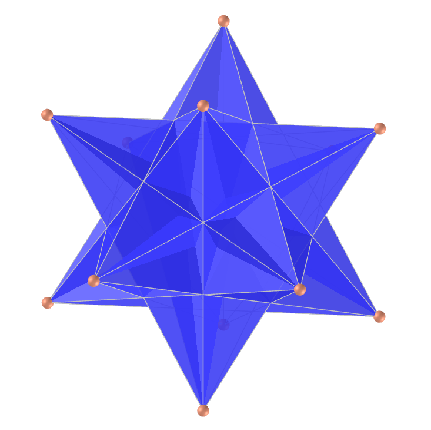
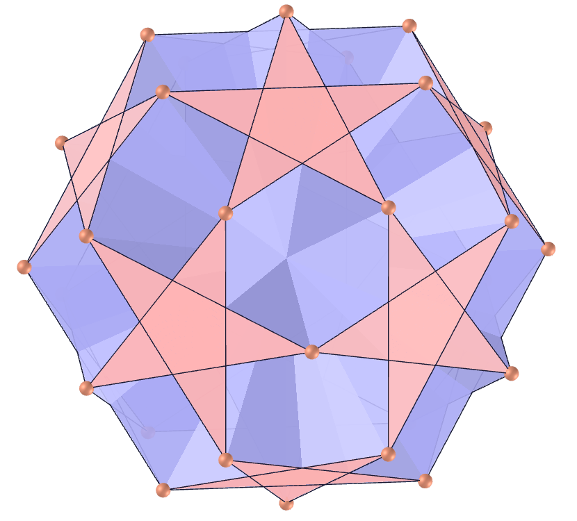
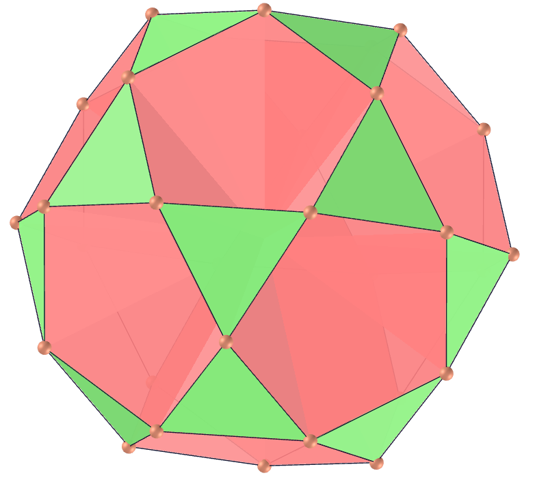
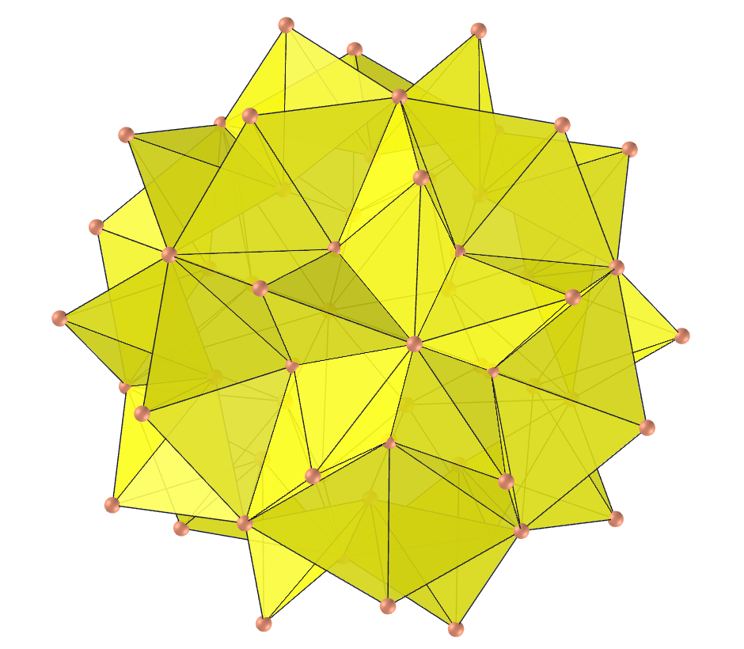

<link rel="stylesheet" href="../scripts/style.css">
<link rel="icon" type="image/png" href="../vr/salas/imagens/icone.png?">
<h2>Visualização de poliedros com Realidade Aumentada (RA) e Realidade Virtual (RV) em A-frame</h2>
<b>autor:</b> Paulo Henrique Siqueira - Universidade Federal do Paraná
 <b>contato:</b> <a href="#"> paulohscwb@gmail.com </a>
 <a href="https://paulohscwb.github.io/polyhedra/nonconvex/">english version</a>
<form style="margin: 0 auto; float:right; text-align:right; width:100%; margin-bottom:15px;">
	<select id="url" onchange="urlHandler(this.value)" style="color:royalblue;">
		<option disabled selected>Mais poliedros:</option>
		<option value="../../archimedes/pt-br/">Arquimedes</option>
		<option value="../../catalan/pt-br/">Catalan</option>
		<option disabled value="../../nonconvex/pt-br/">Não convexos</option>
		<option value="../../platonic/pt-br/">Platão</option>
		<option value="../../polyhedron/pt-br/">Prismas e antiprismas</option>
		<option value="../../quasiregular/pt-br/">Quase regulares</option>
		<option value="../../selfintersect/pt-br/">Auto-interseção</option>
		<option value="../../selfintersectsnub/pt-br/">Auto-interseção snub</option>
		<option value="../../selfintersecttruncated/pt-br/">Auto-interseção truncados</option>
		<option value="../../johnson1/pt-br/">Johnson: 1-32</option>
		<option value="../../johnson2/pt-br/">Johnson: 33-62</option>
		<option value="../../johnson3/pt-br/">Johnson: 63-92</option>
	</select>
</form>

  <h2 align="center"> Poliedros não convexos</h2>
  Um poliedro é não convexo se pelo menos uma de suas diagonais está fora da região delimitada por suas faces.
  
<a href="#ra">Realidade Aumentada</a>&nbsp;&nbsp;|&nbsp;&nbsp;<a href="#m3d">Modelos 3D</a>&nbsp;&nbsp;|&nbsp;&nbsp;<a href="../../pt-br/">Página Inicial</a>

<h4>Salas imersivas</h4>
  
  
<iframe width="100%" src="../sala1.htm" title="Sala Imersiva dos poliedros não convexos" frameborder="0" loading="lazy"></iframe>

 <a href="../sala1.htm" target="_blank">&#x1f517; sala imersiva 1</a>&nbsp;&nbsp;|&nbsp;&nbsp;<a href="../sala2.htm" target="_blank">&#x1f517; sala imersiva 2</a>
  

  <h4 id="ra">Realidade Aumentada</h4>
  Para visualizar os poliedros não convexos em RA, visite a página:

<a href="../ra.html" target="_blank">https://paulohscwb.github.io/polyhedra/nonconvex/ra.html</a>
 
com qualquer navegador com um dispositivo de webcam (smartphone, tablet ou notebook).
 O acesso às páginas de RV é feito clicando no círculo azul que aparece em cima de cada marcador.

<h4 id="m3d">Modelos 3D</h4>
<iframe width="560" height="315" style="max-width:100%" src="https://www.youtube.com/embed/playlist?list=PLy0I_lGW8HxWJpy766Me-L4lhuQGfqR9Y" title="YouTube video player" frameborder="0" allow="accelerometer; autoplay; clipboard-write; encrypted-media; gyroscope; picture-in-picture; web-share" allowfullscreen></iframe>
<h4>1. Sólido de Escher</h4>
 
  O sólido de Escher está ilustrado no pedestal direito na xilogravura "Waterfall" de M. C. Escher. É obtido aumentando um dodecaedro rômbico até que as arestas incidentes se tornem paralelas, correspondendo ao aumento da altura de um dodecaedro rômbico. É a primeira estrela de dodecaedro rômbico e é um poliedro de preenchimento de espaço. Sua superfície convexo é um cuboctaedro. Suas faces de triângulos isósceles têm ângulos de vértices com medidades de 70,53° (uma vez) e 54,73° (duas vezes).
  <b>Faces:</b> 48 triângulos isósceles | <b>Arestas:</b> 72 | <b>Vértices:</b> 26 | <b>Ângulos diédricos:</b> 117.04° e 90°. <a href="https://mathworld.wolfram.com/EschersSolid.html" target="_blank">Mais sobre...</a>

<h4>2. Dual do sólido de Escher</h4>
 
  O dual do sólido de Escher foi modelado pelo autor desta página (Paulo Henrique Siqueira) utilizando as coordenadas dos vértices e as respectivas arestas do sólido de Escher. Trata-se de um cubo truncado, determinando faces hexagonais, octogonais e retangulares.
  <b>Faces:</b> 8 hexágonos regulares, 6 octógonos e 12 retângulos | <b>Arestas:</b> 72 | <b>Vértices:</b> 48 | <b>Ângulos diédricos:</b> 144.74°, 125.26° e 135°. <a href="https://mathworld.wolfram.com/EschersSolid.html" target="_blank">Mais sobre...</a>
 

 <h4>3. Octaedro estrelado</h4>
 
  O octaedro estrelado é um poliedro composto por um tetraedro e seu dual (um segundo tetraedro girado 180 graus em relação ao primeiro). O octaedro estrelado também é (incorretamente) chamado de tetraedro estrelado e é a única estrela do octaedro. Uma versão "aramada" do octaedro estrelado às vezes é conhecida como merkaba e contém propriedades místicas.
  <b>Faces:</b> 8 triângulos equiláteros | <b>Arestas:</b> 12 | <b>Vértices:</b> 8 | <b>Ângulo diédrico:</b> 70.53°. <a href="https://mathworld.wolfram.com/StellaOctangula.html" target="_blank">Mais sobre...</a>
 

 <h4>4. Hexecontaedro rômbico</h4>
 
  O hexecontaedro rômbico é um poliedro de 60 faces que pode ser obtido estrelando o triacontaedro rômbico, colocando um plano ao longo de cada aresta que é perpendicular ao plano de simetria em que a aresta se encontra, e tomando o sólido limitado por esses planos resulta em um hexecontaedro. Portanto, trata-se de uma estrela rômbica de triacontaedro. Os losangos de suas faces possuem ângulos dos vértices com medidas iguais a 63,43° e 116,57°.
  <b>Faces:</b> 60 losangos | <b>Arestas:</b> 120 | <b>Vértices:</b> 62 | <b>Ângulos diédricos:</b> 72° e 216°. <a href="https://mathworld.wolfram.com/RhombicHexecontahedron.html" target="_blank">Mais sobre...</a>
 

 <h4>5. Dodecaedro côncavo</h4>
 
  O endododecaedro, também chamado de dodecaedro piroédrico côncavo, é o sólido côncavo correspondente ao vazio interior formado quando cada face de um dodecaedro regular é dobrada ao longo de uma diagonal e as faces resultantes são desdobradas para formar um cubo. O endododecaedro com medida unitária de aresta corresponde à remoção de seis cunhas oblíquas de base quadrada de comprimento de aresta &phi; (onde &phi; é a proporção áurea), altura 1/2 e comprimento de crista 1/2 de um cubo de comprimento de aresta &phi;.
  <b>Faces:</b> 12 pentágonos simétricos côncavos | <b>Arestas:</b> 30 | <b>Vértices:</b> 20 | <b>Ângulos diédricos:</b> 63.43° e 243.43°. <a href="https://mathworld.wolfram.com/Endododecahedron.html" target="_blank">Mais sobre...</a>
 

 <h4>6. Icosaedro ortogonal de Jessen</h4>
 
  O icosaedro ortogonal de Jessen é um poliedro construído substituindo seis pares de triângulos adjacentes em um icosaedro (cujas arestas formam um quadrilátero oblíquo) por pares de triângulos isósceles compartilhando uma base comum. O poliedro pode ser construído dividindo os lados do octaedro na proporção áurea (como usado na construção do icosaedro ao longo das arestas do octaedro), mas invertendo os segmentos longo e curto. O esqueleto do icosaedro ortogonal de Jessen é o gráfico icosaédrico. Este poliedro têm 8 triângulos equiláteros e 12 triângulos isósceles (com ângulos de 109,47 e 35,26°).
  <b>Faces:</b> 20 triângulos | <b>Arestas:</b> 30 | <b>Vértices:</b> 12 | <b>Ângulos diédricos:</b> 90° e 270°. <a href="https://mathworld.wolfram.com/JessensOrthogonalIcosahedron.html" target="_blank">Mais sobre...</a>
 

 <h4>7. Pequeno dodecaedro estrelado</h4>
 
  U34 O pequeno dodecaedro estrelado é o sólido de Kepler-Poinsot cujo poliedro dual é o grande dodecaedro. O pequeno dodecaedro estrelado apareceu em 1430 como um mosaico de Paolo Uccello no piso da Catedral de San Marco, Veneza. Foi redescoberto por Kepler (que usou o termo "urchin") em sua obra Harmonice Mundi em 1619, e novamente por Poinsot em 1809. As 12 faces em forma de pentagramas podem ser construídas a partir de um icosaedro encontrando os 12 conjuntos de cinco vértices que são coplanares e conectando cada conjunto para formar um pentagrama.
  <b>Faces:</b> 12 pentagramas regulares | <b>Arestas:</b> 30 | <b>Vértices:</b> 12 | <b>Ângulo diédrico:</b> 116.57°. <a href="https://mathworld.wolfram.com/SmallStellatedDodecahedron.html" target="_blank">Mais sobre...</a>
 

 <h4>8. Grande dodecaedro estrelado</h4>
 
  U52 O grande dodecaedro estrelado é um dos sólidos de Kepler-Poinsot, e seu dual é o grande icosaedro. O grande dodecaedro estrelado foi publicado por Wenzel Jamnitzer em 1568. Foi redescoberto por Kepler, e novamente por Poinsot em 1809. O grande dodecaedro estrelado pode ser construído a partir de um dodecaedro, selecionando os 144 conjuntos de cinco vértices coplanares, descartando conjuntos cujas arestas correspondem às arestas do dodecaedro original: o resultado é 12 pentagramas.
  <b>Faces:</b> 12 pentagramas regulares | <b>Arestas:</b> 30 | <b>Vértices:</b> 20 | <b>Ângulo diédrico:</b> 63.43°. <a href="https://mathworld.wolfram.com/GreatStellatedDodecahedron.html" target="_blank">Mais sobre...</a>
 

 <h4>9. Grande dodecaedro</h4>
 
  U35 O grande dodecaedro é o sólido de Kepler-Poinsot cujo dual é o pequeno dodecaedro estrelado. É côncavo e consiste em 12 faces pentagonais que se cruzam. As 12 faces pentagonais podem ser construídas a partir de um icosaedro encontrando os 12 conjuntos de cinco vértices que são coplanares e conectando cada conjunto para formar um pentágono. O esqueleto do grande dodecaedro é isomórfico ao gráfico icosaédrico.
  <b>Faces:</b> 12 pentágonos regulares | <b>Arestas:</b> 30 | <b>Vértices:</b> 12 | <b>Ângulo diédrico:</b> 63.43°. <a href="https://mathworld.wolfram.com/GreatDodecahedron.html" target="_blank">Mais sobre...</a>
 

 <h4>10. Grande icosaedro</h4>
 
  U53 O grande icosaedro é um dos sólidos de Kepler-Poinsot cujo dual é o grande dodecaedro estrelado. O grande icosaedro pode ser construído a partir de um icosaedro com comprimentos de aresta unitários, tomando os 20 conjuntos de vértices que são mutuamente espaçados por uma distância &phi; (proporção áurea). O sólido, portanto, consiste em 20 triângulos equiláteros e a simetria de seu arranjo é tal que o sólido resultante contém 12 pentagramas.
  <b>Faces:</b> 20 triângulos equiláteros | <b>Arestas:</b> 30 | <b>Vértices:</b> 12 | <b>Ângulo diédrico:</b> 41.81°. <a href="https://mathworld.wolfram.com/GreatIcosahedron.html" target="_blank">Mais sobre...</a>

<a href="#p4" class="topo">voltar ao topo</a>

<h4>11. Pequeno dodecahemicosaedro</h4>
 
  U62 O poliedro uniforme cujo poliedro dual é o pequeno dodecahemicosacron. É uma versão facetada do icosidodecaedro. É um hemipoliedro com dez faces hexagonais passando pelo centro do modelo.
  <b>Faces:</b> 12 pentagramas regulares e 10 hexágonos regulares | <b>Arestas:</b> 60 | <b>Vértices:</b> 30 | <b>Ângulo diédrico:</b> 79.19°. <a href="https://mathworld.wolfram.com/SmallDodecahemicosahedron.html" target="_blank">Mais sobre...</a>
 

<h4>12. Grande dodecahemidodecaedro</h4>
 
  U70 O grande dodecahemidodecaedro é um poliedro não convexo uniforme cuja figura de vértice é um quadrilátero cruzado e seu dual é o grande dodecahemidodecacron. Seu raio circunscrito para o comprimento da aresta igual a 1 é &phi;-1, onde &phi; é a proporção áurea. 
  <b>Faces:</b> 12 pentagramas regulares e 6 decagramas regulares | <b>Arestas:</b> 60 | <b>Vértices:</b> 30 | <b>Ângulo diédrico:</b> 63.43°. <a href="https://mathworld.wolfram.com/GreatDodecahemidodecahedron.html" target="_blank">Mais sobre...</a>
 

<h4>13. Grande dodecahemidodecaedro</h4>
 
  U65 O grande dodecahemicosaedro (ou pequeno dodecahemicoaedro) é um poliedro uniforme não convexo cuja figura de vértice é um quadrilátero cruzado. É um dodecadodecaedro facetado e o seu raio circunscrito para o comprimento unitário da aresta mede 2.
  <b>Faces:</b> 12 pentágonos regulares e 10 hexágonos regulares | <b>Arestas:</b> 60 | <b>Vértices:</b> 30 | <b>Ângulo diédrico:</b> 37.38°. <a href="https://mathworld.wolfram.com/GreatDodecahemicosahedron.html" target="_blank">Mais sobre...</a>
 

<h4>14. Pequeno dodecahemidodecaedro</h4>
 
  U51 O pequeno dodecahemidodecaedro é um poliedro uniforme não convexo cujo poliedro dual é o pequeno dodecahemidodecacron. Seu raio circunscrito para o comprimento unitário de aresta é R=&phi;, onde &phi; é a proporção áurea.
  <b>Faces:</b> 12 pentágonos regulares e 10 decágonos regulares | <b>Arestas:</b> 60 | <b>Vértices:</b> 30 | <b>Ângulo diédrico:</b> 63.43°. <a href="https://mathworld.wolfram.com/SmallDodecahemidodecahedron.html" target="_blank">Mais sobre...</a>
 

<h4>15. Grande icosihemidodecaedro</h4>
 
  U71 O grande icosihemidodecaedro é um poliedro uniforme não convexo cujo dual é o grande icosihemidodecacron. Seu raio circunscrito para o comprimento unitário de aresta é R=&phi;-1, onde &phi; é a proporção áurea.
  <b>Faces:</b> 20 triângulos equiláteros e 6 decagramas | <b>Arestas:</b> 60 | <b>Vértices:</b> 30 | <b>Ângulo diédrico:</b> 37.38°. <a href="https://mathworld.wolfram.com/GreatIcosihemidodecahedron.html" target="_blank">Mais sobre...</a>
 

<h4>16. Pequeno icosihemidodecaedro</h4>
 
  U49 O pequeno icosihemidodecaedro é um poliedro uniforme não convexo cujo poliedro dual é o pequeno icosihemidodecacron. É uma versão facetada do icosidodecaedro.
  <b>Faces:</b> 20 triângulos equiláteros e 6 decágonos | <b>Arestas:</b> 60 | <b>Vértices:</b> 30 | <b>Ângulo diédrico:</b> 79.19°. <a href="https://mathworld.wolfram.com/SmallIcosihemidodecahedron.html" target="_blank">Mais sobre...</a>
 

<h4>17. Octahemioctaedro</h4>
 
  U3 O octahemioctaedro é um poliedro uniforme não convexo cujo poliedro dual é o octahemioctacron. É um cuboctaedro facetado. Seu raio circunscrito para o comprimento unitário de aresta é R=1.
  <b>Faces:</b> 8 triângulos equiláteros e 4 hexágonos | <b>Arestas:</b> 24 | <b>Vértices:</b> 12 | <b>Ângulo diédrico:</b> 70.53°. <a href="https://mathworld.wolfram.com/Octahemioctahedron.html" target="_blank">Mais sobre...</a>
 

<h4>18. Tetrahemihexaedro</h4>
 
  U4 O tetrahemihexaedro é um poliedro uniforme não convexo cujo poliedro dual é o tetrahemihexacron. É uma forma facetada do octaedro. É o único poliedro uniforme não prismático com um número ímpar de faces.
  <b>Faces:</b> 4 triângulos equiláteros e 3 quadrados | <b>Arestas:</b> 12 | <b>Vértices:</b> 6 | <b>Ângulo diédrico:</b> 54.74°. <a href="https://mathworld.wolfram.com/Tetrahemihexahedron.html" target="_blank">Mais sobre...</a>
 

<h4>19. Cubohemioctaedro</h4>
 
  U15 O cubohemioctaedro é um poliedro uniforme não convexo cujo dual é o hexahemioctacron. É uma versão facetada do cuboctaedro. Seu raio circunscrito para o comprimento unitário de aresta é R=1.
   <b>Faces:</b> 6 quadrados e 4 hexágonos regulares | <b>Arestas:</b> 24 | <b>Vértices:</b> 12 | <b>Ângulo diédrico:</b> 54.74°. <a href="https://mathworld.wolfram.com/Cubohemioctahedron.html" target="_blank">Mais sobre...</a>

<h4>20. Deltaedro de Möbius de 24 faces</h4>
 
  Um deltaedro é um poliedro com faces que são todos triângulos equiláteros. Existem cinco deltaedros acópticos para os quais cada aresta está em um plano de simetria. Triângulos de Möbius são aqueles que ocorrem na superfície de uma esfera dividida em seus planos de simetria. Os deltaedros de Möbius são simplesmente isômeros das versões do triângulo de Möbius do tetraedro (24 faces), cubo e dodecaedro.
  <b>Faces:</b> 24 triângulos equiláteros | <b>Arestas:</b> 36 | <b>Vértices:</b> 14 | <b>Ângulos diédricos:</b> 334.15°, 193.09° e 131.81°. <a href="https://www.interocitors.com/polyhedra/Deltahedra/Mobius/index.html" target="_blank">Mais sobre...</a>
 
<a href="#p4" class="topo">voltar ao topo</a>

<h4>21. Dual do Deltaedro de Möbius</h4>
 
  Trata-se de um tetraedro truncado, determinando faces hexagonais e retangulares. O dual do deltaedro de Möbius de 24 faces foi modelado pelo autor desta página (Paulo Henrique Siqueira) utilizando as coordenadas dos vértices e as respectivas arestas do deltaedro de Möbius. 
  <b>Faces:</b> 8 hexágonos e 6 retângulos | <b>Arestas:</b> 36 | <b>Vértices:</b> 24 | <b>Ângulos diédricos:</b> 125.25° e 109.47°. <a href="https://www.interocitors.com/polyhedra/Deltahedra/Mobius/index.html" target="_blank">Mais sobre...</a>

<h4>22. Hexaedro Octakis de Möbius</h4>
 
  O Hexaedro Octakis é um deltaedro de Möbius com 48 faces derivado do cubo e do triacontaedro rômbico medial. É um dos cinco deltaedros que possuem cada aresta em um plano de simetria.
  <b>Faces:</b> 48 triângulos equiláteros | <b>Arestas:</b> 72 | <b>Vértices:</b> 26 | <b>Ângulos diédricos:</b> 319.8°, 203.74° e 105.16°. <a href="https://www.interocitors.com/polyhedra/Deltahedra/Mobius/index.html" target="_blank">Mais sobre...</a>

<h4>23. Dual do Hexaedro Octakis de Möbius</h4>
 
  Trata-se de um octaedro truncado, determinando faces hexagonais, octogonais e retangulares. O dual do hexaedro octakis de Möbius foi modelado pelo autor desta página (Paulo Henrique Siqueira) utilizando as coordenadas dos vértices e as respectivas arestas do hexaedro octakis de Möbius.
  <b>Faces:</b> 6 octógonos, 8 hexágonos e 12 retângulos | <b>Arestas:</b> 72 | <b>Vértices:</b> 48 | <b>Ângulos diédricos:</b> 144.74°, 125.19° e 135°. <a href="https://www.interocitors.com/polyhedra/Deltahedra/Mobius/index.html" target="_blank">Mais sobre...</a>
 

<h4>24. Octaedro Hexakis de Möbius</h4>
 
  O Octaedro Hexakis é um deltaedro de Möbius com 48 faces derivado do cubo e do triacontaedro rômbico medial. É um dos cinco deltaedros que possuem cada aresta em um plano de simetria.
  <b>Faces:</b> 48 triângulos equiláteros | <b>Arestas:</b> 72 | <b>Vértices:</b> 26 | <b>Ângulos diédricos:</b> 352.13°, 123.82° e 93.74°. <a href="https://www.interocitors.com/polyhedra/Deltahedra/Mobius/index.html" target="_blank">Mais sobre...</a>

<h4>25. Icosaedro Hexakis de Möbius</h4>
 
  O Icosaedro Hexakis é um deltaedro de Möbius com 120 faces derivado do icosaedro e do grande triacontaedro rômbico. É um dos cinco deltaedros que têm cada aresta em um plano de simetria.
  <b>Faces:</b> 120 triângulos equiláteros | <b>Arestas:</b> 180 | <b>Vértices:</b> 62 | <b>Ângulos diédricos:</b> 282.71°, 206.75° e 85.47°. <a href="https://www.interocitors.com/polyhedra/Deltahedra/Mobius/index.html" target="_blank">Mais sobre...</a>

<h4>26. Dodecaedro 10-akis de Möbius</h4>
 
  O Dodecaedro 10-akis é um deltaedro de Möbius com 120 faces derivado do dodecaedro e do grande triacontaedro rômbico. É um dos cinco deltaedros que têm cada aresta em um plano de simetria.
  <b>Faces:</b> 120 triângulos equiláteros | <b>Arestas:</b> 180 | <b>Vértices:</b> 62 | <b>Ângulos diédricos:</b> 332.16°, 132.64° e 82.51°. <a href="https://www.interocitors.com/polyhedra/Deltahedra/Mobius/index.html" target="_blank">Mais sobre...</a>

<a href="#p4" class="topo">voltar ao topo</a>

 
  Polyhedra: Nonconvex de <a xmlns:cc="http://creativecommons.org/ns#" href="https://paulohscwb.github.io/polyhedra/nonconvex/" property="cc:attributionName" rel="cc:attributionURL">Paulo Henrique Siqueira</a> está licenciado com uma Licença <a rel="license" href="http://creativecommons.org/licenses/by-nc-nd/4.0/">Creative Commons Atribuição-NãoComercial-SemDerivações 4.0 Internacional</a>.

<h4>Como citar este trabalho:</h4> 

Siqueira, P.H., "Polyhedra: Nonconvex". Disponível em: <https://paulohscwb.github.io/polyhedra/nonconvex/>, Outubro de 2022.

 <b>Referências:</b>
 Weisstein, Eric W. "Archimedean Solid" From MathWorld-A Wolfram Web Resource. <a href="http://mathworld.wolfram.com/ArchimedeanSolid.html" target="_blank">http://mathworld.wolfram.com/ArchimedeanSolid.html</a>
 Weisstein, Eric W. "Platonic Solid" From MathWorld-A Wolfram Web Resource. <a href="http://mathworld.wolfram.com/PlatonicSolid.html" target="_blank">http://mathworld.wolfram.com/PlatonicSolid.html</a>
 Weisstein, Eric W. "Archimedean Dual" From MathWorld-A Wolfram Web Resource. <a href="https://mathworld.wolfram.com/ArchimedeanDual.html" target="_blank">https://mathworld.wolfram.com/ArchimedeanDual.html</a>
 Weisstein, Eric W. "Uniform Polyhedron." From MathWorld--A Wolfram Web Resource. <a href="https://mathworld.wolfram.com/UniformPolyhedron.html" target="_blank">https://mathworld.wolfram.com/UniformPolyhedron.html</a>
 Wikipedia <a href="https://en.wikipedia.org/wiki/Archimedean_solid" target="_blank">https://en.wikipedia.org/wiki/Archimedean_solid</a>
 Wikipedia <a href="https://en.wikipedia.org/wiki/en.wikipedia.org/wiki/Platonic_solid" target="_blank">https://en.wikipedia.org/wiki/Platonic_solid</a>
 McCooey, David I. "Visual Polyhedra". <a href="http://dmccooey.com/polyhedra/" target="_blank">http://dmccooey.com/polyhedra/</a>
