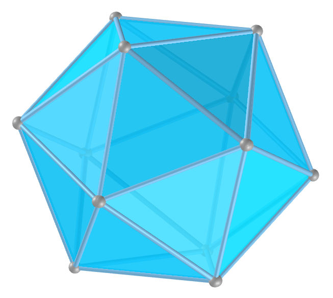

<link rel="stylesheet" href="scripts/style.css">
<h2>Visualization of polyhedra with Augmented Reality (AR) and Virtual Reality (VR) in A-frame</h2>
 <b>author:</b> Paulo Henrique Siqueira - Universidade Federal do Paraná
  <b>contact:</b> <a href="#">paulohscwb@gmail.com</a>
  <a href="https://paulohscwb.github.io/polyhedra/platonic/pt-br/">versão em português</a>
<form style="margin: 0 auto; float:right; text-align:right; width:100%; margin-bottom:15px;">
	<select id="url" onchange="urlHandler(this.value)" style="color:royalblue;">
		<option disabled selected value>More polyhedra:</option>
		<option value="../archimedes/">Archimedes</option>
		<option value="../catalan/">Catalan</option>
		<option value="../johnson/">Johnson</option>
		<option value="../nonconvex/">Non convex</option>
		<option disabled value="../platonic/">Platonic</option>
		<option value="../polyhedron/">Prisms and antiprisms</option>
		<option value="../quasiregular/">Quasi regular</option>
		<option value="../selfintersect/">Self intersect</option>
		<option value="../selfintersectsnub/">Self intersect snub</option>
		<option value="../selfintersecttruncated/">Self intersect truncated</option>
	</select>
</form>

  <h2 align="center">Platonic polyhedra</h2>
  An Platonic solid is a regular and convex polyhedron. It is constructed by congruent and regular polygonal faces with the same number of faces meeting at each vertex. They are named by the ancient Greek philosopher Plato who classified that the classical elements were made from these regular solids.
  <h4>Immersive room</h4>
  
<iframe width="100%" src="salaPlatao.htm" title="Sala Imersiva de Platão" frameborder="0" loading="lazy"></iframe>

  To view Platonic polyhedra in AR, simply visit 

<a href="ra.html" target="_blank">https://paulohscwb.github.io/polyhedra/platonic/ra.html</a>
 
with any browser with a webcam device (smartphone, tablet or notebook). 
 Access to the VR sites is done by clicking on the blue circle that appears on top of the marker.

 <iframe width="560" height="315" style="max-width:100%" src="https://www.youtube.com/embed/videoseries?list=PLy0I_lGW8HxUG41tIyqLd8vvNxt-5G97s" title="YouTube video player" frameborder="0" allow="accelerometer; autoplay; clipboard-write; encrypted-media; gyroscope; picture-in-picture; web-share" allowfullscreen></iframe>

<h4>1. Icosahedron</h4>
 
  U22 The icosahedron has five equilateral triangular faces meeting at each vertex. A regular icosahedron is a gyroelongated pentagonal bipyramid and a biaugmented pentagonal antiprism in any of six orientations. The 12 edges of a regular octahedron can be subdivided in the golden ratio so that the resulting vertices define a regular icosahedron. 
  <b>Faces:</b> 20 triangles | <b>Edges:</b> 30 | <b>Vertices:</b> 12 | <b>Sphericity:</b> 0.939 | <b>Dihedral angle:</b> 138.19°. <a href="http://mathworld.wolfram.com/RegularIcosahedron.html" target="_blank">More...</a>

<h4>2. Dodecahedron</h4>
 
  U23 The dodecahedron has three regular pentagonal faces meeting at each vertex. The regular dodecahedron is the third in an infinite set of truncated trapezohedra which can be constructed by truncating the two axial vertices of a pentagonal trapezohedron. If the five Platonic solids are built with same volume, the regular dodecahedron has the shortest edges.
  <b>Faces:</b> 12 pentagons | <b>Edges:</b> 30 | <b>Vertices:</b> 20 | <b>Sphericity:</b> 0.91 | <b>Dihedral angle:</b> 116.57°. <a href="http://mathworld.wolfram.com/RegularDodecahedron.html" target="_blank">More...</a>

<h4>3. Octahedron</h4>
 
  U5 The octahedron has four equilateral triangular faces meeting at each vertex. It is a square bipyramid in any of three orthogonal orientations. It is also a triangular antiprism in any of four orientations. The octahedron is unique among the Platonic solids in having an even number of faces meeting at each vertex. Consequently, it is the only member of that group to possess mirror planes that do not pass through any of the faces.
  <b>Faces:</b> 8 triangles | <b>Edges:</b> 12 | <b>Vertices:</b> 6 | <b>Sphericity:</b> 0.846 | <b>Dihedral angle:</b> 109.47°. <a href="http://mathworld.wolfram.com/RegularOctahedron.html" target="_blank">More...</a>

<h4>4. Cube</h4>
 
  U6 The cube has three square faces meeting at each vertex. The cube is also a square parallelepiped, an equilateral cuboid and a right rhombohedron. It is a regular square prism in three orientations, and a trigonal trapezohedron in four orientations. The cube can be cut into six identical square pyramids. If these square pyramids are then attached to the faces of a second cube, a rhombic dodecahedron is obtained.
  <b>Faces:</b> 6 squares | <b>Edges:</b> 12 | <b>Vertices:</b> 8 | <b>Sphericity:</b> 0.806 | <b>Dihedral angle:</b> 90°. <a href="http://mathworld.wolfram.com/Cube.html" target="_blank">More...</a>

<h4>5. Tetrahedron</h4>
 
  U1 The tetrahedron has three equilateral triangular faces meeting at each vertex. The tetrahedron is also known as a triangular pyramid and it is the simplest of all the ordinary convex polyhedra and the only one that has fewer than 5 faces. The tetrahedron has many properties analogous to those of a triangle, including an insphere, circumsphere, medial tetrahedron, and exspheres. 
  <b>Faces:</b> 4 triangles | <b>Edges:</b> 6 | <b>Vertices:</b> 4 | <b>Sphericity:</b> 0.671 | <b>Dihedral angle:</b> 70.53°. <a href="http://mathworld.wolfram.com/RegularTetrahedron.html" target="_blank">More...</a>

<a href="#p2" class="topo">back to top</a>

  Polyhedra: Platonic by <a xmlns:cc="http://creativecommons.org/ns#" href="https://paulohscwb.github.io/polyhedra/platonic/" property="cc:attributionName" rel="cc:attributionURL">Paulo Henrique Siqueira</a> is licensed with a license <a rel="license" href="http://creativecommons.org/licenses/by-nc-nd/4.0/">Creative Commons Attribution-NonCommercial-NoDerivatives 4.0 International</a>.

<h4>How to cite this work:</h4> 

Siqueira, P.H., "Polyhedra: Platonic". Available in: <https://paulohscwb.github.io/polyhedra/platonic/>, September 2019.

 <b>References:</b>
 Weisstein, Eric W. "Archimedean Solid" From MathWorld-A Wolfram Web Resource. <a href="http://mathworld.wolfram.com/ArchimedeanSolid.html" target="_blank">http://mathworld.wolfram.com/ArchimedeanSolid.html</a>
 Weisstein, Eric W. "Platonic Solid" From MathWorld-A Wolfram Web Resource. <a href="http://mathworld.wolfram.com/PlatonicSolid.html" target="_blank">http://mathworld.wolfram.com/PlatonicSolid.html</a>
 Weisstein, Eric W. "Archimedean Dual" From MathWorld-A Wolfram Web Resource. <a href="https://mathworld.wolfram.com/ArchimedeanDual.html" target="_blank">https://mathworld.wolfram.com/ArchimedeanDual.html</a>
 Weisstein, Eric W. "Uniform Polyhedron." From MathWorld--A Wolfram Web Resource. <a href="https://mathworld.wolfram.com/UniformPolyhedron.html" target="_blank">https://mathworld.wolfram.com/UniformPolyhedron.html</a>
 Wikipedia <a href="https://en.wikipedia.org/wiki/Archimedean_solid" target="_blank">https://en.wikipedia.org/wiki/Archimedean_solid</a>
 Wikipedia <a href="https://en.wikipedia.org/wiki/en.wikipedia.org/wiki/Platonic_solid" target="_blank">https://en.wikipedia.org/wiki/Platonic_solid</a>
 McCooey, David I. "Visual Polyhedra". <a href="http://dmccooey.com/polyhedra/" target="_blank">http://dmccooey.com/polyhedra/</a>
