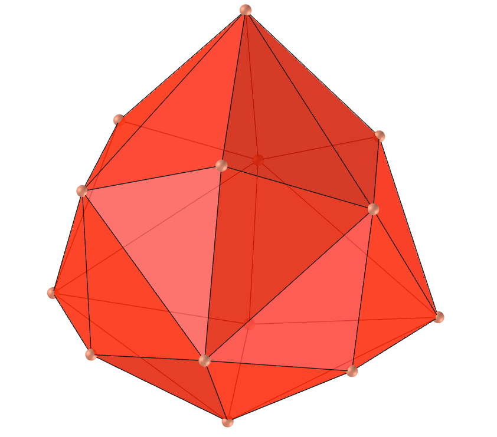

<link rel="stylesheet" href="scripts/style.css">
<h2>Visualization of polyhedra with Augmented Reality (AR) and Virtual Reality (VR) in A-frame</h2>
 <b>author:</b> Paulo Henrique Siqueira - Universidade Federal do Paraná
  <b>contact:</b> <a href="#">paulohscwb@gmail.com</a>
  <a href="https://paulohscwb.github.io/polyhedra/polyhedron/pt-br/">versão em português</a>
<form style="margin: 0 auto; float:right; text-align:right; width:100%; margin-bottom:15px;">
	<a href="../">Home</a>
	 <select id="url" onchange="urlHandler(this.value)" style="color:royalblue;">
		<option disabled selected value>More polyhedra:</option>
		<option value="../archimedes/">Archimedes</option>
		<option value="../catalan/">Catalan</option>
		<option value="../nonconvex/">Non convex</option>
		<option value="../platonic/">Platonic</option>
		<option disabled value="../polyhedron/">Prisms and antiprisms</option>
		<option value="../quasiregular/">Quasi regular</option>
		<option value="../selfintersect/">Self-intersecting</option>
		<option value="../selfintersectsnub/">Self-intersecting snub</option>
		<option value="../selfintersecttruncated/">Self intersecting truncated</option>
		<option value="../johnson1/">Johnson: 1-32</option>
		<option value="../johnson2/">Johnson: 33-62</option>
		<option value="../johnson3/">Johnson: 63-92</option>
	</select>
</form>

  <h2 align="center"> Pyramids, tetrahedrons, prisms and antiprisms</h2>
  To view polyhedra in AR, simply visit:

<a href="ra.html" target="_blank">https://paulohscwb.github.io/polyhedra/polyhedron/ra.html</a>
 
with any browser with a webcam device (smartphone, tablet or notebook). 
 Access to the VR sites is done by clicking on the blue circle that appears on top of the marker.

<iframe width="560" height="315" style="max-width:100%" src="https://www.youtube.com/embed/videoseries?list=PLy0I_lGW8HxV8nBnE8o_krXqahDtI9O4q" title="YouTube video player" frameborder="0" allow="accelerometer; autoplay; clipboard-write; encrypted-media; gyroscope; picture-in-picture; web-share" allowfullscreen></iframe>

<h4>1. Prism</h4>

  U76 A general prism is a polyhedron possessing two congruent polygonal faces and with all remaining faces parallelograms. A right prism is a prism in which the top and bottom polygons lie on top of each other so that the vertical polygons connecting their sides are not only parallelograms, but rectangles. The regular right prisms have particularly simple nets, given by two oppositely-oriented n-gonal bases connected by a set of n squares. The example shown on this page is a regular right heptagonal prism. 
  <b>Faces:</b> 2 polygons of n sides (bases) and n squares, rectangles or parallelograms (side faces) | <b>Edges:</b> 3n | <b>Vertices:</b> 2n. <a href="https://mathworld.wolfram.com/Prism.html" target="_blank">More...</a>

<h4>2. Stellated Prism</h4>

  U78 A stellated or polygrammic prism is formed by two regular stellated polygons (polygrams) displaced along their axis of symmetry and with corresponding edges connected by lateral faces (squares, rectangles or parallelograms). The example shown on this page is of an octagonal stellated right prism (octagrammic prism).
  <b>Faces:</b> 2 stellated polygons of n sides (bases) and n squares, rectangles or parallelograms (side faces) | <b>Edges:</b> 3n | <b>Vertices:</b> 2n. <a href="hhttps://mathworld.wolfram.com/PolygrammicPrism.html" target="_blank">More...</a>

<h4>3. Antiprism</h4>

  U77 A general n-gonal antiprism is a polyhedron consisting of identical top and bottom n-gonal faces whose periphery is bounded by a set of 2n triangles with alternating up-down orientations. If the top and bottom faces are regular n-gons displaced relative to one another in the direction perpendicular to the plane of the polygons and rotated relative to one another by an angle of 180&deg;/n, then the antiprism is known as a right antiprism and its faces are equilateral triangles. The example shown on this page is a regular hexagonal antiprism.
  <b>Faces:</b> 2 polygons of n sides (bases) and n triangles (side faces) | <b>Edges:</b> 3n | <b>Vertices:</b> 2n. <a href="https://mathworld.wolfram.com/Antiprism.html" target="_blank">More...</a>

<h4>4. Stellated Antiprism</h4>

  U79 A stellated or polygrammic antiprism is formed by two upper and lower regular stellated polygons (polygrams), whose periphery is bounded by a set of 2n triangles with alternating orientations from top to bottom. The example shown on this page is of a pentagonal stellated right antiprism (pentagrammic antiprism).
  <b>Faces:</b> 2 stellated polygons of n sides (bases) and n triangles (side faces) | <b>Edges:</b> 3n | <b>Vertices:</b> 2n. <a href="https://mathworld.wolfram.com/PentagrammicAntiprism.html" target="_blank">More...</a>

<h4>5. Stellated Crossed Antiprism</h4>

  U80 A stellated or polygrammic crossed antiprism is formed by two upper and lower regular stellated polygons (polygrams), whose periphery is bounded by a 2n set with alternating orientations from top to bottom connected with opposite vertices of the bases. The example shown on this page is a heptagonal stellated crossed right antiprism (heptagrammic crossed antiprism).
  <b>Faces:</b> 2 stellated polygons of n sides (bases) and n triangles (side faces) | <b>Edges:</b> 3n | <b>Vertices:</b> 2n. <a href="https://mathworld.wolfram.com/PentagrammicCrossedAntiprism.html" target="_blank">More...</a>

<h4>6. Pyramid</h4>

  A pyramid is a polyhedron with one polygonal face (known as the "base") and all the other faces triangles meeting at a common polygon vertex (known as the "apex"). A right pyramid is a pyramid for which the line joining the centroid of the base and the apex is perpendicular to the base. A regular pyramid is a right pyramid whose base is a regular polygon. The example shown on this page is of a regular right heptagonal pyramid.
  <b>Faces:</b> 1 polygon of n sides (base) and n triangles (side faces) | <b>Edges:</b> 2n | <b>Vertices:</b> n + 1. <a href="https://mathworld.wolfram.com/Pyramid.html" target="_blank">More...</a>

<h4>7. Stellated Pyramid</h4>

  A stellated or polygrammic pyramid is formed by a regular stellated polygon (polygram) with corresponding edges connected by triangular side faces that meet at a common vertex (known as the "apex"). The example shown on this page is of an octagonal stellated pyramid (octagrammic pyramid).
  <b>Faces:</b> 1 stellated polygon of n sides (base) and n triangles (side faces) | <b>Edges:</b> 2n | <b>Vertices:</b> n + 1. <a href="https://polytope.miraheze.org/wiki/Pentagrammic_pyramid" target="_blank">More...</a>

<h4>8. Dipyramid</h4>

  A dipyramid, also called a bipyramid or double pyramid, consists of two pyramids symmetrically placed base-to-base. The dipyramids are duals of the regular prisms. Their skeletons are the dipyramidal graphs. The example shown on this page is of a regular pentagonal dipyramid.
  <b>Faces:</b> 2n triangles | <b>Edges:</b> 3n | <b>Vertices:</b> n + 2. <a href="https://mathworld.wolfram.com/Dipyramid.html" target="_blank">More...</a>

<h4>9. Stellated Dipyramid</h4>

  A stellated dipyramid, also called a stellated bipyramid or stellated double pyramid, consists of two stellated pyramids symmetrically placed base-to-base. The stellated dipyramids are duals of the stellated prisms. The example shown on this page is of a regular pentagonal stellated dipyramid (pentagrammic dipyramid).
  <b>Faces:</b> 2n triangles | <b>Edges:</b> 3n | <b>Vertices:</b> n + 2. <a href="https://mathworld.wolfram.com/PentagrammicDipyramid.html" target="_blank">More...</a>

<h4>10. Trapezohedron</h4>

  An n-trapezohedron, also called an antidipyramid, antibipyramid, or deltohedron is a solid composed of interleaved symmetric quadrilateral kites, half of which meet in a top vertex and half in a bottom vertex. A regular n-trapezohedron can be constructed from two sets of points placed around two regular n-gons displaced relative to one another in the direction perpendicular to the plane of the polygons and rotated relative to one another by an angle of 180&deg;/n. This polyhedron is the dual of the antiprism. The example shown on this page is of a regular hexagonal trapezohedron.
  <b>Faces:</b> 2n kites | <b>Edges:</b> 4n | <b>Vertices:</b> 2n + 2. <a href="https://mathworld.wolfram.com/Trapezohedron.html" target="_blank">More...</a>

<a href="#p7" class="topo">back to top</a>

<h4>11. Stellated Trapezohedron</h4>

  An stellated n-trapezohedron, also called an stellated antidipyramid, stellated antibipyramid, or stellated deltohedron is a solid composed of interleaved quadrilateral kites, half of which meet in a top vertex and half in a bottom vertex. This polyhedron is the dual of the stellated antiprism. The example shown on this page is of a regular heptagonal stellated trapezohedron (heptagrammic trapezohedron).
  <b>Faces:</b> 2n kites | <b>Edges:</b> 4n | <b>Vertices:</b> 2n + 2. <a href="https://mathworld.wolfram.com/PentagrammicDeltohedron.html" target="_blank">More...</a>

<h4>12. Stellated Concave Trapezohedron</h4>

  An stellated concave n-trapezohedron, also called an stellated concave antidipyramid, stellated concave antibipyramid, or stellated concave deltohedron is a solid composed of interleaved quadrilateral darts, half of which meet in a top vertex and half in a bottom vertex. This polyhedron is the dual of the stellated crossed antiprism. The example shown on this page is of a regular octagonal stellated concave trapezohedron (octagrammic concave trapezohedron).
  <b>Faces:</b> 2n darts | <b>Edges:</b> 4n | <b>Vertices:</b> 2n + 2. <a href="https://mathworld.wolfram.com/PentagrammicConcaveDeltohedron.html" target="_blank">More...</a>

<h4>13. Isosceles tetrahedron</h4>

  An isosceles tetrahedron is nonregular and each pair of opposite polyhedron edges are equal, so that all triangular faces are congruent. Isosceles tetrahedra are therefore isohedra. The only way for all the faces of a general tetrahedron to have the same perimeter or to have the same area is for them to be fully congruent, in which case the tetrahedron is isosceles. A tetrahedron is isosceles iff the sum of the face angles at each polyhedron vertex is 180&deg;, and iff its insphere and circumsphere are concentric.
  <b>Faces:</b> 4 scalene triangles | <b>Edges:</b> 6 | <b>Vertices:</b> 4. <a href="https://mathworld.wolfram.com/IsoscelesTetrahedron.html" target="_blank">More...</a>

<h4>14. Trapezo-rhombic Dodecahedron</h4>

  The trapezo-rhombic dodecahedron, also called the rhombo-trapezoidal dodecahedron, is a general dodecahedron consisting of six identical rhombi and six identical isosceles trapezoids. The trapezo-rhombic dodecahedron can be obtained from the rhombic dodecahedron by slicing in half and rotating the two halves 60&deg; with respect to each other. The lengths of the short and long edges of the rotated dodecahedron have lengths 2/3 and 4/3 times the length of the rhombic faces. 
  <b>Faces:</b> 6 rhombi and 6 isosceles trapezoids | <b>Edges:</b> 24 | <b>Vertices:</b> 14. <a href="https://mathworld.wolfram.com/Trapezo-RhombicDodecahedron.html" target="_blank">More...</a>

<h4>15. Octahedral Pentagonal Dodecahedron</h4>

  The octahedral pentagonal dodecahedron, also called the pyritohedron, is made from 12 irregular pentagons with 4 equal sides and bilateral symmetry. The regular dodecahedron is a special case of this polyhedron.
  <b>Faces:</b> 12 irregular pentagons | <b>Edges:</b> 30 | <b>Vertices:</b> 20. <a href="https://mathworld.wolfram.com/Isohedron.html" target="_blank">More...</a>

<h4>16. Concave Dyakis Dodecahedron</h4>

  The concave dyakis dodecahedron, also called the concave didodecahedron or concave diploid, is made from 24 quadrilaterals with only two equal and adjacent sides, with some dihedral angles greater than 180&deg;. The Möbius octakis hexahedron is a special case of this polyhedron.
  <b>Faces:</b> 24 quadrilaterals | <b>Edges:</b> 48 | <b>Vertices:</b> 26. <a href="https://mathworld.wolfram.com/Isohedron.html" target="_blank">More...</a>

<h4>17. Dyakis Dodecahedron</h4>

  The dyakis dodecahedron, also called the didodecahedron or diploid, is made from 24 quadrilaterals with only two equal and adjacent sides, with all dihedral angles less than 180&deg;. The Möbius octakis hexahedron is a special case of this polyhedron.
  <b>Faces:</b> 24 quadrilaterals | <b>Edges:</b> 48 | <b>Vertices:</b> 26. <a href="https://mathworld.wolfram.com/Isohedron.html" target="_blank">More...</a>

<h4>18. Tetragonal Pentagonal Dodecahedron</h4>

  A tetragonal pentagonal dodecahedron (also called of tetartoid, pentagon-tritetrahedron, or tetrahedric pentagon dodecahedron) is a dodecahedron with chiral tetrahedral symmetry. Like the regular dodecahedron, it has twelve identical pentagonal faces, with three meeting in each of the 20 vertices. However, the pentagons are not regular and the figure has no fivefold symmetry axes (each face have two pairs of equal adjacent sides). Although regular dodecahedra do not exist in crystals, the tetartoid form does.
  <b>Faces:</b> 12 irregular pentagons | <b>Edges:</b> 30 | <b>Vertices:</b> 20. <a href="https://en.wikipedia.org/wiki/Dodecahedron" target="_blank">More...</a>

<h4>19. Hexakis Tetrahedron</h4>

  A hexakis tetrahedron (also called of hextetrahedron) is made by changing the length of the faces axes and edges-midpoint axes of a tetrahedron. The equilateral hexakis tetrahedron is a Möbius deltahedron.
   <b>Faces:</b> 24 triangles | <b>Edges:</b> 36 | <b>Vertices:</b> 14. <a href="https://mathworld.wolfram.com/Isohedron.html" target="_blank">More...</a>

<h4>20. Trapezohedral Tristetrahedron</h4>

  The trapezohedral tristetrahedron is the polyhedra made from 12 kites shaped quadrilaterals. It can be constructed by means of symmetries from a regular tetrahedron.
   <b>Faces:</b> 12 kites | <b>Edges:</b> 24 | <b>Vertices:</b> 14. <a href="https://mathworld.wolfram.com/Isohedron.html" target="_blank">More...</a>

<a href="#p7" class="topo">back to top</a>

<h4>21. Iris Toroid</h4>

  A polyhedron is called of toroid when had genus g &ge; 1 (i.e., one having one or more holes). A toroid is said to be non-regular if not all of its faces have the same number of vertices, or not all of its vertices join the same number of faces. The example shown is a regular heptagonal base, with square side faces.
  <b>Faces:</b> n squares and 2n obtuse triangles | <b>Edges:</b> 5n | <b>Vertices:</b> 2n. <a href="http://dmccooey.com/polyhedra/ToroidalNonRegular.html" target="_blank">More...</a>

<h4>22. Iris Antitoroid</h4>

  When we consider the triangular lateral faces on a toroid, we have a polyhedron called an antitoroid. The example shown is a regular heptagonal base, with equilateral triangles on the side faces.
  <b>Faces:</b> 2n equilateral triangles and 2n obtuse triangles | <b>Edges:</b> 6n | <b>Vertices:</b> 2n. <a href="http://dmccooey.com/polyhedra/ToroidalNonRegular.html" target="_blank">More...</a>

<h4>23. Rhombic enneacontahedron</h4>

  The rhombic enneacontahedron is a polyhedron composed of 90 rhombic faces with three, five, or six rhombi meeting at each vertex. It has 60 broad rhombi and 30 slim and is a zonohedron constructed from the 10 diameters of the dodecahedron with a superficial resemblance to the rhombic triacontahedron.
  <b>Faces:</b> 90 rhombi | <b>Edges:</b> 180 | <b>Vertices:</b> 92. <a href="https://mathworld.wolfram.com/RhombicEnneacontahedron.html" target="_blank">More...</a>

<h4>24. Goddard-Henning enneahedron</h4>

  The Goddard-Henning enneahedron is the canonical polyhedron obtained from the Goddard-Henning graph. It is a self-dual polyhedron and the bottom face is a square. The four faces sharing an edge with the bottom are isosceles triangles, and the remaining four faces that meet at the apex are "kites".
  <b>Faces:</b> 4 "kites", 1 square and 4 isosceles triangles | <b>Edges:</b> 16 | <b>Vertices:</b> 9 | <b>Dihedral angles:</b> 101.53°, 120° and 104.51°. <a href="https://mathworld.wolfram.com/Goddard-HenningEnneahedron.html" target="_blank">More...</a>

<h4>25. Herschel enneahedron</h4>

  The Herschel enneahedron is the canonical polyhedron whose skeleton is the Herschel graph. The dual polyhedron is a rectified triangular prism, which can be formed as the convex hull of the midpoints of the edges of a triangular prism.
  <b>Faces:</b> 6 "kites" and 3 rhombi | <b>Edges:</b> 18 | <b>Vertices:</b> 9 | <b>Dihedral angles:</b> 107.01° and 119.11°. <a href="https://mathworld.wolfram.com/HerschelEnneahedron.html" target="_blank">More...</a>

<a href="#p7" class="topo">back to top</a>

Herschel nonahedron is a canonical polyhedron whose skeleton is the Herschel graph

  Polyhedra: Pyramids, tetrahedrons, prisms and antiprisms by <a xmlns:cc="http://creativecommons.org/ns#" href="https://paulohscwb.github.io/polyhedra/polyhedron/" property="cc:attributionName" rel="cc:attributionURL">Paulo Henrique Siqueira</a> is licensed with a license <a rel="license" href="http://creativecommons.org/licenses/by-nc-nd/4.0/">Creative Commons Attribution-NonCommercial-NoDerivatives 4.0 International</a>.

<h4>How to cite this work:</h4> 

Siqueira, P.H., "Polyhedra: Pyramids, tetrahedrons, prisms and antiprisms". Available in: <https://paulohscwb.github.io/polyhedra/polyhedron/>, March 2023.

 <b>References:</b>
 Weisstein, Eric W. "Archimedean Solid" From MathWorld-A Wolfram Web Resource. <a href="http://mathworld.wolfram.com/ArchimedeanSolid.html" target="_blank">http://mathworld.wolfram.com/ArchimedeanSolid.html</a>
 Weisstein, Eric W. "Platonic Solid" From MathWorld-A Wolfram Web Resource. <a href="http://mathworld.wolfram.com/PlatonicSolid.html" target="_blank">http://mathworld.wolfram.com/PlatonicSolid.html</a>
 Weisstein, Eric W. "Archimedean Dual" From MathWorld-A Wolfram Web Resource. <a href="https://mathworld.wolfram.com/ArchimedeanDual.html" target="_blank">https://mathworld.wolfram.com/ArchimedeanDual.html</a>
 Weisstein, Eric W. "Uniform Polyhedron." From MathWorld--A Wolfram Web Resource. <a href="https://mathworld.wolfram.com/UniformPolyhedron.html" target="_blank">https://mathworld.wolfram.com/UniformPolyhedron.html</a>
 Wikipedia <a href="https://en.wikipedia.org/wiki/Archimedean_solid" target="_blank">https://en.wikipedia.org/wiki/Archimedean_solid</a>
 Wikipedia <a href="https://en.wikipedia.org/wiki/en.wikipedia.org/wiki/Platonic_solid" target="_blank">https://en.wikipedia.org/wiki/Platonic_solid</a>
 McCooey, David I. "Visual Polyhedra". <a href="http://dmccooey.com/polyhedra/" target="_blank">http://dmccooey.com/polyhedra/</a>
