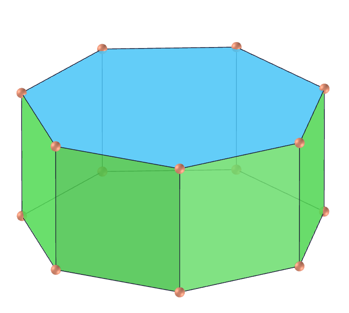
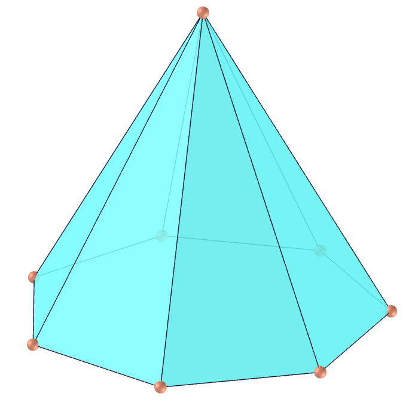
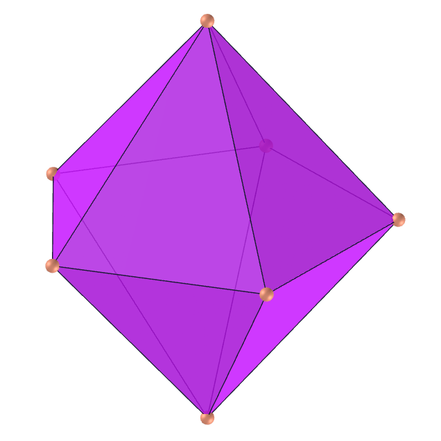
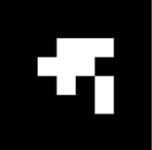
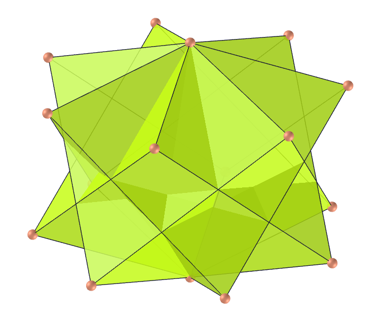
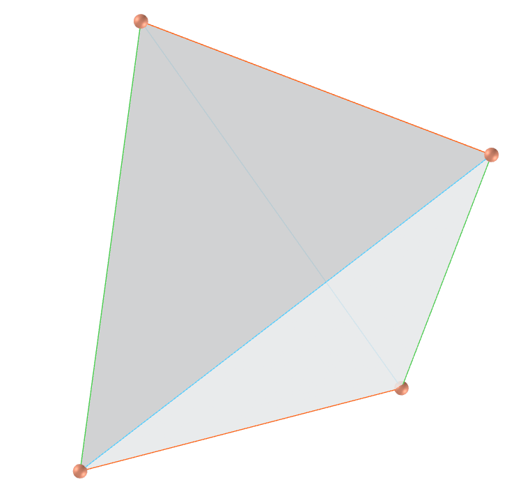
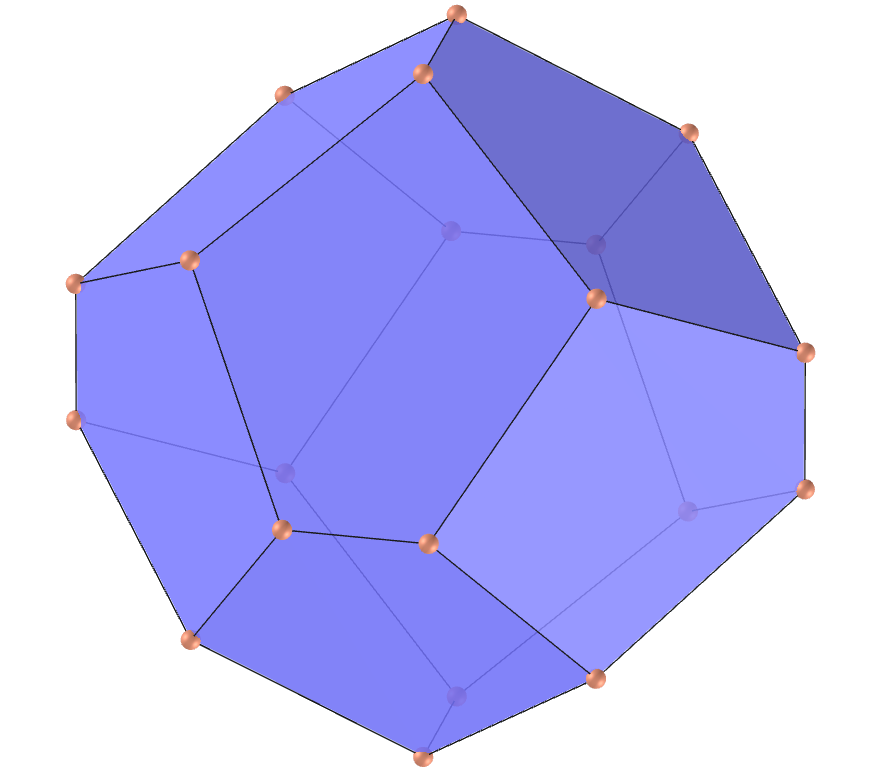
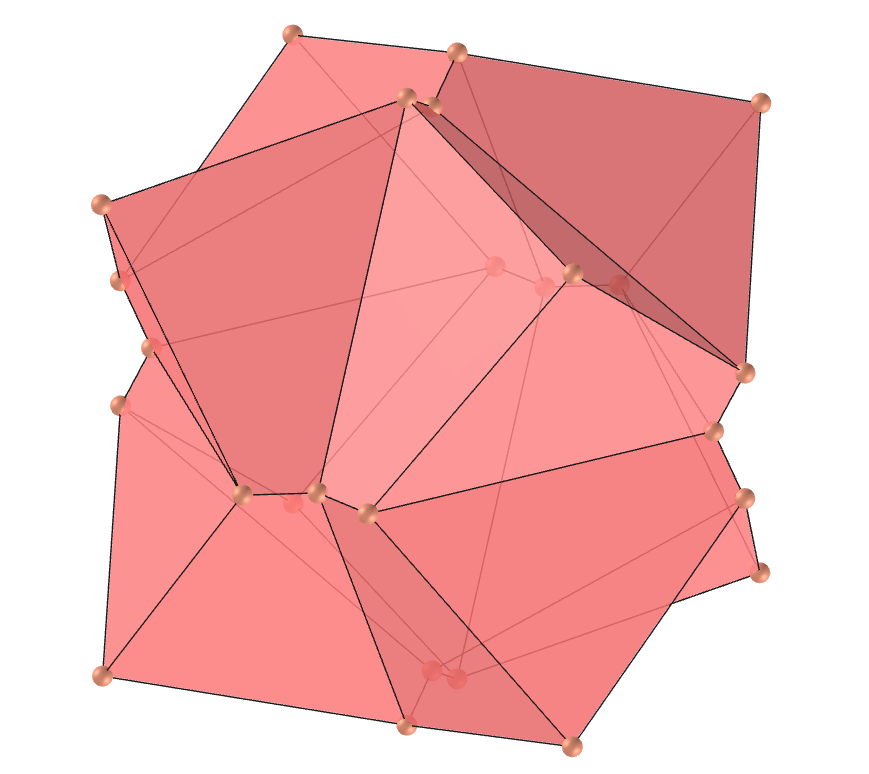

<link rel="stylesheet" href="../scripts/style.css">
<link rel="icon" type="image/png" href="../vr/salas/imagens/icone.png">
<h2>Visualização de poliedros com Realidade Aumentada (RA) e Realidade Virtual (RV) em A-frame</h2>
<b>autor:</b> Paulo Henrique Siqueira - Universidade Federal do Paraná
 <b>contato:</b> <a href="#"> paulohscwb@gmail.com </a>
 <a href="https://paulohscwb.github.io/polyhedra/polyhedron/">english version</a>
<form style="margin: 0 auto; float:right; text-align:right; width:100%; margin-bottom:15px;">
	<select id="url" onchange="urlHandler(this.value)" style="color:royalblue;">
		<option disabled selected>Mais poliedros:</option>
		<option value="../../archimedes/pt-br/">Arquimedes</option>
		<option value="../../catalan/pt-br/">Catalan</option>
		<option value="../../nonconvex/pt-br/">Não convexos</option>
		<option value="../../platonic/pt-br/">Platão</option>
		<option disabled value="../../polyhedron/pt-br/">Prismas e antiprismas</option>
		<option value="../../quasiregular/pt-br/">Quase regulares</option>
		<option value="../../selfintersect/pt-br/">Auto-interseção</option>
		<option value="../../selfintersectsnub/pt-br/">Auto-interseção snub</option>
		<option value="../../selfintersecttruncated/pt-br/">Auto-interseção truncados</option>
		<option value="../../johnson1/pt-br/">Johnson: 1-32</option>
		<option value="../../johnson2/pt-br/">Johnson: 33-62</option>
		<option value="../../johnson3/pt-br/">Johnson: 63-92</option>
	</select>
</form>

  <h2 align="center"> Pirâmides, tetraedros, prismas e antiprismas</h2>
  
<a href="#ra">Realidade Aumentada</a>&nbsp;&nbsp;|&nbsp;&nbsp;<a href="#m3d">Modelos 3D</a>&nbsp;&nbsp;|&nbsp;&nbsp;<a href="../../pt-br/">Página Inicial</a>

  

<h3 align="center">Salas imersivas</h3>
  <!--

-->
  
<iframe width="100%" src="../sala1.htm" title="Sala Imersiva dos poliedros não convexos" frameborder="0" loading="lazy"></iframe>

  
<a href="../sala1.htm" target="_blank">&#x1f517; sala 1</a>&nbsp;&nbsp;|&nbsp;&nbsp;<a href="../sala2.htm" target="_blank">&#x1f517; sala 2</a>

  <h3 id="ra" align="center">Realidade Aumentada</h3>
  Para visualizar os poliedros em RA, visite a página:

<a href="../ra.html" target="_blank">https://paulohscwb.github.io/polyhedra/polyhedron/ra.html</a>
 
com qualquer navegador com um dispositivo de webcam (smartphone, tablet ou notebook).
 O acesso às páginas dos modelos 3D é feito clicando no círculo azul que aparece em cima de cada marcador.

<h3 id="m3d" align="center">Modelos 3D</h3>
  <iframe width="560" height="315" style="max-width:100%" src="https://www.youtube.com/embed/videoseries?list=PLy0I_lGW8HxV8nBnE8o_krXqahDtI9O4q" title="YouTube video player" frameborder="0" allow="accelerometer; autoplay; clipboard-write; encrypted-media; gyroscope; picture-in-picture; web-share" allowfullscreen></iframe>

<h4>1. Prisma</h4>

  U76 Um prisma geral é um poliedro que possui duas faces poligonais congruentes e com todas as faces restantes paralelogramos. Um prisma reto é um prisma no qual os polígonos superior e inferior ficam um sobre o outro, de modo que os polígonos verticais que conectam seus lados não são apenas paralelogramos, mas retângulos. Os prismas regulares retos têm redes particularmente simples, dadas por duas bases n-gonais de orientação oposta conectadas por um conjunto de n quadrados. O exemplo mostrado nesta página é de um prisma reto regular heptagonal.
  <b>Faces:</b> 2 polígonos de n lados (bases) e n quadrados, retângulos ou paralelogramos (faces laterais) | <b>Arestas:</b> 3n | <b>Vértices:</b> 2n. <a href="https://mathworld.wolfram.com/Prism.html" target="_blank">Mais sobre...</a>

<h4>2. Prisma estrelado</h4>

  U78 Um prisma estrelado ou poligrâmico é formado por dois polígonos estrelados (poligramas) regulares deslocados ao longo de seu eixo de simetria e com arestas correspondentes conectadas por faces laterais (quadrados, retângulos ou paralelogramos). O exemplo mostrado nesta página é de um prisma reto estrelado octogonal (prisma octagrâmico).
  <b>Faces:</b> 2 polígonos estrelados de n lados (bases) e n quadrados, retângulos ou paralelogramos (faces laterais) | <b>Arestas:</b> 3n | <b>Vértices:</b> 2n. <a href="https://mathworld.wolfram.com/PolygrammicPrism.html" target="_blank">Mais sobre...</a>

<h4>3. Antiprisma</h4>

  U77 Um antiprisma de n lados geral é um poliedro que consiste em faces com n lados idênticas, superior e inferior, cuja periferia é limitada por um conjunto de 2n triângulos com orientações alternadas de cima para baixo. Se as faces superior e inferior são polígonos regulares deslocados um em relação ao outro na direção perpendicular ao plano dos polígonos e girados um em relação ao outro por um ângulo de 180&deg;/n, então o antiprisma é conhecido como um antiprisma regular e suas faces são triângulos equiláteros. O exemplo mostrado nesta página é de um antiprisma regular hexagonal.
  <b>Faces:</b> 2 polígonos de n lados (bases) e n triângulos (faces laterais) | <b>Arestas:</b> 3n | <b>Vértices:</b> 2n. <a href="https://mathworld.wolfram.com/Antiprism.html" target="_blank">Mais sobre...</a>

<h4>4. Antiprisma estrelado</h4>

  U79 Um antiprisma estrelado ou poligrâmico é formado por dois polígonos estrelados (poligramas) regulares superior e inferior, cuja periferia é limitada por um conjunto de 2n triângulos com orientações alternadas de cima para baixo. O exemplo mostrado nesta página é de um antiprisma reto estrelado pentagonal (antiprisma pentagrâmico).
  <b>Faces:</b> 2 polígonos estrelados de n lados (bases) e n triângulos (faces laterais) | <b>Arestas:</b> 3n | <b>Vértices:</b> 2n. <a href="https://mathworld.wolfram.com/PentagrammicAntiprism.html" target="_blank">Mais sobre...</a>

<h4>5. Antiprisma cruzado estrelado</h4>

  U80 Um antiprisma cruzado estrelado ou poligrâmico é formado por dois polígonos estrelados (poligramas) regulares superior e inferior, cuja periferia é limitada por um conjunto de 2n triângulos com orientações alternadas de cima para baixo conectados com vértices opostos das bases. O exemplo mostrado nesta página é de um antiprisma reto cruzado estrelado heptagonal (antiprisma heptagrâmico cruzado).
  <b>Faces:</b> 2 polígonos estrelados de n lados (bases) e n triângulos (faces laterais) | <b>Arestas:</b> 3n | <b>Vértices:</b> 2n. <a href="https://mathworld.wolfram.com/PentagrammicCrossedAntiprism.html" target="_blank">Mais sobre...</a>

<h4>6. Pirâmide</h4>

  Uma pirâmide é um poliedro com uma face poligonal (conhecida como base) e todas as outras faces triangulares que se encontram em um vértice comum (conhecido como "ápice"). Uma pirâmide reta é uma pirâmide para a qual a linha que une o centróide da base e o ápice é perpendicular à base. Uma pirâmide regular é uma pirâmide reta cuja base é um polígono regular. O exemplo mostrado nesta página é de uma pirâmide reta regular heptagonal.
  <b>Faces:</b> 1 polígono de n lados (base) e n triângulos (faces laterais) | <b>Arestas:</b> 2n | <b>Vértices:</b> n + 1. <a href="https://mathworld.wolfram.com/Pyramid.html" target="_blank">Mais sobre...</a>

<h4>7. Pirâmide estrelada</h4>

  Uma pirâmide estrelada ou poligrâmica é formada por um polígono estrelado (poligrama) regular com arestas correspondentes conectadas por faces laterais triangulares que se encontram em um vértice comum (conhecido como "ápice"). O exemplo mostrado nesta página é de uma pirâmide estrelada octogonal (pirâmide octagrâmica).
  <b>Faces:</b> 1 polígono estrelado de n lados (base) e n triângulos (faces laterais) | <b>Arestas:</b> 2n | <b>Vértices:</b> n + 1. <a href="https://polytope.miraheze.org/wiki/Pentagrammic_pyramid" target="_blank">Mais sobre...</a>

<h4>8. Dipirâmide</h4>

  Uma dipirâmide, também chamada de bipirâmide ou pirâmide dupla, consiste em duas pirâmides colocadas simetricamente de base a base. As dipirâmides são duais dos prismas regulares. Seus esqueletos são os gráficos dipiramidais. O exemplo mostrado nesta página é de uma dipirâmide regular pentagonal.
  <b>Faces:</b> 2n triângulos | <b>Arestas:</b> 3n | <b>Vértices:</b> n + 2. <a href="https://mathworld.wolfram.com/Dipyramid.html" target="_blank">Mais sobre...</a>

<h4>9. Dipirâmide estrelada</h4>

  Uma dipirâmide estrelada, também chamada de bipirâmide estrelada ou pirâmide dupla estrelada, consiste em duas pirâmides estreladas colocadas simetricamente de base a base. As dipirâmides estreladas são duais dos prismas estrelados. O exemplo mostrado nesta página é de uma dipirâmide regular estrelada pentagonal ou dipirâmide pentagrâmica.
  <b>Faces:</b> 2n triângulos | <b>Arestas:</b> 3n | <b>Vértices:</b> n + 2. <a href="https://mathworld.wolfram.com/PentagrammicDipyramid.html" target="_blank">Mais sobre...</a>

<h4>10. Trapezoedro</h4>

  Um trapezoedro de n vértices, também chamado de antidipirâmide, antibipirâmide ou deltoedro é um sólido composto de "pipas" quadrilaterais simétricas intercaladas, metade das quais se encontram em um vértice superior e metade em um vértice inferior. Um trapezoedro regular pode ser construído a partir de dois conjuntos de pontos colocados em torno de dois polígonos regulares de n lados deslocados um em relação ao outro na direção perpendicular ao plano dos polígonos e girados um em relação ao outro por um ângulo de 180&deg;/n. Este poliedro é o dual do antiprisma. O exemplo mostrado nesta página é de um trapezoedro regular hexagonal.
  <b>Faces:</b> 2n "pipas" | <b>Arestas:</b> 4n | <b>Vértices:</b> 2n + 2. <a href="https://mathworld.wolfram.com/Trapezohedron.html" target="_blank">Mais sobre...</a>

<a href="#p7" class="topo">voltar ao topo</a>

<h4>11. Trapezoedro estrelado</h4>

  Um trapezoedro estrelado de n vértices, também chamado de antidipirâmide estrelada, deltoedro estrelado ou antibipirâmide estrelada é um sólido composto de "pipas" quadrilaterais intercaladas, metade das quais se encontram em um vértice superior e metade em um vértice inferior. Este poliedro é o dual do antiprisma estrelado. O exemplo mostrado nesta página é de um trapezoedro regular estrelado heptagonal (trapezoedro heptagrâmico).
  <b>Faces:</b> 2n "pipas" | <b>Arestas:</b> 4n | <b>Vértices:</b> 2n + 2. <a href="https://mathworld.wolfram.com/PentagrammicDeltohedron.html" target="_blank">Mais sobre...</a>

<h4>12. Trapezoedro estrelado côncavo</h4>

  Um trapezoedro estrelado côncavo de n vértices, também chamado de antidipirâmide estrelada côncava, deltoedro estrelado côncavo ou antibipirâmide estrelada côncava é um sólido composto de "dardos" quadrilaterais intercalados, metade das quais se encontram em um vértice superior e metade em um vértice inferior. Este poliedro é o dual do antiprisma cruzado estrelado. O exemplo mostrado nesta página é de um trapezoedro regular estrelado côncavo octogonal (trapezoedro octagrâmico côncavo).
  <b>Faces:</b> 2n "dardos" | <b>Arestas:</b> 4n | <b>Vértices:</b> 2n + 2. <a href="https://mathworld.wolfram.com/PentagrammicConcaveDeltohedron.html" target="_blank">Mais sobre...</a>

<h4>13. Tetraedro isósceles</h4>

  Um tetraedro isósceles é não regular e os pares de arestas opostas do poliedro são iguais, de modo que todas as faces triangulares são congruentes. Tetraedros isósceles são, portanto, isoedros. A única maneira de todas as faces de um tetraedro geral terem o mesmo perímetro ou a mesma área é serem totalmente congruentes, caso em que o tetraedro é isósceles. Um tetraedro é isósceles se a soma dos ângulos da face em cada vértice do poliedro é de 180&deg; e se sua esfera e circunsfera são concêntricas.
  <b>Faces:</b> 4 triângulos escalenos | <b>Arestas:</b> 6 | <b>Vértices:</b> 4. <a href="https://mathworld.wolfram.com/isóscelesTetrahedron.html" target="_blank">Mais sobre...</a>

<h4>14. Dodecaedro Trapezo-Rômbico</h4>

  O dodecaedro trapezo-rômbico, também chamado de dodecaedro rombo-trapezoidal, é um dodecaedro geral que consiste em seis losangos idênticos e seis trapézios isósceles idênticos. O dodecaedro trapezo-rômbico pode ser obtido a partir do dodecaedro rômbico cortando-o ao meio e girando as duas metades 60&deg; uma em relação à outra. Os comprimentos das arestas curta e longa do dodecaedro girado têm comprimentos 2/3 e 4/3 vezes o comprimento das faces rômbicas.
  <b>Faces:</b> 6 losangos e 6 trapézios isósceles | <b>Arestas:</b> 24 | <b>Vértices:</b> 14. <a href="https://mathworld.wolfram.com/Trapezo-RhombicDodecahedron.html" target="_blank">Mais sobre...</a>

<h4>15. Dodecaedro pentagonal octaédrico</h4>

  O dodecaedro pentagonal octaédrico, também chamado de piritoedro, é feito de 12 pentágonos irregulares com 4 lados iguais e simetria bilateral. O dodecaedro regular é um caso especial deste poliedro.
  <b>Faces:</b> 12 pentágonos irregulares | <b>Arestas:</b> 30 | <b>Vértices:</b> 20. <a href="https://mathworld.wolfram.com/Isohedron.html" target="_blank">Mais sobre...</a>

<h4>16. Dodecaedro dyakis côncavo</h4>

  O dodecaedro dyakis côncavo, também chamado de didodecaedro côncavo ou diplóide côncavo, é feito de 24 quadriláteros com apenas dois lados iguais e adjacentes, com alguns ângulos diédricos maiores do que 180&deg;. O hexaedro Möbius octakis é um caso especial deste poliedro.
  <b>Faces:</b> 24 quadriláteros | <b>Arestas:</b> 48 | <b>Vértices:</b> 26. <a href="https://mathworld.wolfram.com/Isohedron.html" target="_blank">Mais sobre...</a>

<h4>17. Dodecaedro dyakis</h4>

  O dodecaedro dyakis, também chamado de didodecaedro ou diplóide, é feito de 24 quadriláteros com apenas dois lados iguais e adjacentes, com todos os ângulos diédricos menores do que 180&deg;. O hexaedro Möbius octakis é um caso especial deste poliedro.
  <b>Faces:</b> 24 quadriláteros | <b>Arestas:</b> 48 | <b>Vértices:</b> 26. <a href="https://mathworld.wolfram.com/Isohedron.html" target="_blank">Mais sobre...</a>

<h4>18. Dodecaedro pentagonal tetragonal</h4>

  Um dodecaedro pentagonal tetragonal (também chamado de tetartóide, pentágono tritetraedro ou dodecaedro pentágono tetraédrico) é um dodecaedro com simetria tetraédrica quiral. Como o dodecaedro regular, ele tem doze faces pentagonais idênticas, com três se encontrando em cada um dos 20 vértices. No entanto, os pentágonos não são regulares e a figura não tem eixos de simetria quíntupla (cada face tem dois pares de lados adjacentes iguais). Embora os dodecaedros regulares não existam nos cristais, a forma tetartoide existe.
  <b>Faces:</b> 12 pentágonos irregulares | <b>Arestas:</b> 30 | <b>Vértices:</b> 20. <a href="https://en.wikipedia.org/wiki/Dodecahedron" target="_blank">Mais sobre...</a>

<h4>19. Tetraedro hexakis</h4>

  Um tetraedro hexakis (também chamado de hextetraedro) é feito alterando o comprimento dos eixos das faces e os eixos dos pontos médios das arestas de um tetraedro. O tetraedro hexakis equilátero é um deltaedro de Möbius.
   <b>Faces:</b> 24 triângulos | <b>Arestas:</b> 36 | <b>Vértices:</b> 14. <a href="https://mathworld.wolfram.com/Isohedron.html" target="_blank">Mais sobre...</a>

<h4>20. Tristetraedro trapezoédrico</h4>

  O tristetraedro trapezoédrico é o poliedro formado por 12 quadriláteros em forma de "pipa". Pode ser construído por meio de simetrias a partir de um tetraedro regular.
   <b>Faces:</b> 12 "pipas" | <b>Arestas:</b> 24 | <b>Vértices:</b> 14. <a href="https://mathworld.wolfram.com/Isohedron.html" target="_blank">Mais sobre...</a>

<a href="#p7" class="topo">voltar ao topo</a>

<h4>21. Toróide de íris</h4>

  Um poliedro é chamado de toróide quando possui gênero g &ge; 1 (ou seja, aquele que possui um ou mais orifícios). Um toróide é dito não regular se nem todas as suas faces tiverem o mesmo número de vértices, ou nem todos os seus vértices unirem o mesmo número de faces. O exemplo mostrado é uma base heptagonal regular, com faces laterais quadradas.
  <b>Faces:</b> n quadrados e 2n triângulos obtusângulos | <b>Arestas:</b> 5n | <b>Vértices:</b> 2n. <a href="http://dmccooey.com/polyhedra/ToroidalNonRegular.html" target="_blank">Mais sobre...</a>

<h4>22. Antitoróide de íris</h4>

  Quando considerarmos as faces laterais triangulares em um toróide, teremos um poliedro chamado antitoróide. O exemplo mostrado é uma base heptagonal regular, com triângulos equiláteros nas faces laterais.
  <b>Faces:</b> 2n triângulos equiláteros e 2n triângulos obtusângulos | <b>Arestas:</b> 6n | <b>Vértices:</b> 2n. <a href="http://dmccooey.com/polyhedra/ToroidalRegularTriangular.html" target="_blank">Mais sobre...</a>

<h4>23. Eneacontaedro rômbico</h4>

  O eneacontaedro rômbico é um poliedro composto de 90 faces rômbicas com três, cinco ou seis losangos em cada vértice. Tem 60 losangos largos e 30 estreitos e é um zonoedro construído a partir dos 10 diâmetros do dodecaedro com uma semelhança superficial com o triacontaedro rômbico.
  <b>Faces:</b> 90 losangos | <b>Arestas:</b> 180 | <b>Vértices:</b> 92. <a href="https://mathworld.wolfram.com/RhombicEnneacontahedron.html" target="_blank">Mais sobre...</a>

<h4>24. Eneaedro de Goddard-Henning</h4>

  O eneaedro de Goddard-Henning é o poliedro canônico obtido do grafo de Goddard-Henning. É um poliedro autodual com a face inferior quadrada. As quatro faces que compartilham uma aresta com a parte inferior são triângulos isósceles, e as quatro faces restantes que se encontram no ápice são "pipas".
  <b>Faces:</b> 4 "pipas", 1 quadrado e 4 triângulos isósceles | <b>Arestas:</b> 16 | <b>Vértices:</b> 9 | <b>Ângulos diédricos:</b> 101.53°, 120° e 104.51°. <a href="https://mathworld.wolfram.com/Goddard-HenningEnneahedron.html" target="_blank">Mais sobre...</a>

<h4>25. Eneaedro de Herschel</h4>

  O eneaedro de Herschel é o poliedro canônico cujo esqueleto é o grafo de Herschel. O poliedro dual é um prisma triangular retificado, que pode ser formado como a casca convexa dos pontos médios das arestas de um prisma triangular.
  <b>Faces:</b> 6 "pipas" e 3 losangos | <b>Arestas:</b> 18 | <b>Vértices:</b> 9 | <b>Ângulos diédricos:</b> 107.01° e 119.11°. <a href="https://mathworld.wolfram.com/HerschelEnneahedron.html" target="_blank">Mais sobre...</a>

<h4>26. Paralelepípedo</h4>

  O paralelepípedo é um prisma cujas faces são todos paralelogramos. O termo rombóide também é usado às vezes com o significado de paralelepípedo. O paralelepípedo retangular (seis faces retangulares), o cubo (seis faces quadradas) e o romboedro (seis losangos) são casos especiais de paralelepípedos.
  <b>Faces:</b> 6 paralelogramos, losangos, quadrados ou retângulos | <b>Arestas:</b> 12 | <b>Vértices:</b> 8. <a href="https://mathworld.wolfram.com/Parallelepiped.html" target="_blank">Mais sobre...</a>

<a href="#p7" class="topo">voltar ao topo</a>

 
  Polyhedra: Pyramids, tetrahedrons, prisms and antiprisms de <a xmlns:cc="http://creativecommons.org/ns#" href="https://paulohscwb.github.io/polyhedra/polyhedron/" property="cc:attributionName" rel="cc:attributionURL">Paulo Henrique Siqueira</a> está licenciado com uma Licença <a rel="license" href="http://creativecommons.org/licenses/by-nc-nd/4.0/">Creative Commons Atribuição-NãoComercial-SemDerivações 4.0 Internacional</a>.

<h4>Como citar este trabalho:</h4> 

Siqueira, P.H., "Polyhedra: Pyramids, tetrahedrons, prisms and antiprisms". Disponível em: <https://paulohscwb.github.io/polyhedra/polyhedron/>, Março de 2023.

 <b>Referências:</b>
 Weisstein, Eric W. "Archimedean Solid" From MathWorld-A Wolfram Web Resource. <a href="http://mathworld.wolfram.com/ArchimedeanSolid.html" target="_blank">http://mathworld.wolfram.com/ArchimedeanSolid.html</a>
 Weisstein, Eric W. "Platonic Solid" From MathWorld-A Wolfram Web Resource. <a href="http://mathworld.wolfram.com/PlatonicSolid.html" target="_blank">http://mathworld.wolfram.com/PlatonicSolid.html</a>
 Weisstein, Eric W. "Archimedean Dual" From MathWorld-A Wolfram Web Resource. <a href="https://mathworld.wolfram.com/ArchimedeanDual.html" target="_blank">https://mathworld.wolfram.com/ArchimedeanDual.html</a>
 Weisstein, Eric W. "Uniform Polyhedron." From MathWorld--A Wolfram Web Resource. <a href="https://mathworld.wolfram.com/UniformPolyhedron.html" target="_blank">https://mathworld.wolfram.com/UniformPolyhedron.html</a>
 Wikipedia <a href="https://en.wikipedia.org/wiki/Archimedean_solid" target="_blank">https://en.wikipedia.org/wiki/Archimedean_solid</a>
 Wikipedia <a href="https://en.wikipedia.org/wiki/en.wikipedia.org/wiki/Platonic_solid" target="_blank">https://en.wikipedia.org/wiki/Platonic_solid</a>
 McCooey, David I. "Visual Polyhedra". <a href="http://dmccooey.com/polyhedra/" target="_blank">http://dmccooey.com/polyhedra/</a>
