<link rel="stylesheet" href="../scripts/style.css">
<h2>Visualização de poliedros com Realidade Aumentada (RA) e Realidade Virtual (RV) em A-frame</h2>
<b>autor:</b> Paulo Henrique Siqueira - Universidade Federal do Paraná
 <b>contato:</b> <a href="#"> paulohscwb@gmail.com </a>
 <a href="https://paulohscwb.github.io/polyhedra/">english version</a>
  Os poliedros de Arquimedes, Platão, Catalan, não convexos, de auto-interseção e quase regulares podem ser vistos em RA com os marcadores indicados, e por meio dos links criados nos marcadores, cada poliedro pode ser visto em RV.
 Um <b>poliedro uniforme</b> possui polígonos regulares como faces e é isogonal, ou seja, possui uma isometria que permite que o conjunto de seus vértices correspondam entre si por meio de relações de simetria. A notação usada para o <b>n-ésimo</b> poliedro uniforme é <b>Un</b>.
 O ambiente RA foi criado com os scripts de <b>Jerome Etienne</b>: <a href="https://github.com/jeromeetienne/AR.js" target="_blank"> AR.js - Augmented Reality for the Web</a>.
 Os scripts de órbita desenvolvidos por <b>Kevin Ngo</b> foram usados nas páginas de RV: <a href="https://github.com/supermedium/superframe/tree/master/components/orbit-controls/" target="_blank"> Orbit controls for A-Frame</a>.
 

  
Poliedros de Arquimedes

Um poliedro de Arquimedes é um dos 13 sólidos enumerados pela primeira vez por Arquimedes. Eles são os poliedros convexos semi-regulares compostos de polígonos regulares reunidos em vértices idênticos, excluindo os 5 sólidos platônicos, os prismas e antiprismas.
 Para ver os poliedros arquimedeanos em RA, visite a página:

 <a href="../archimedes.html" target="_blank"> https://paulohscwb.github.io/polyhedra/archimedes.html</a>

com qualquer navegador com um dispositivo de webcam (smartphone, tablet ou notebook).
 O acesso às páginas de RV é feito clicando no círculo azul que aparece em cima dos marcadores.
  

<h4>1. Octaedro truncado</h4>
 <a href="../vr/truncated_octahedron.html" target="_blank" title="modelo 3D" class="fotoA">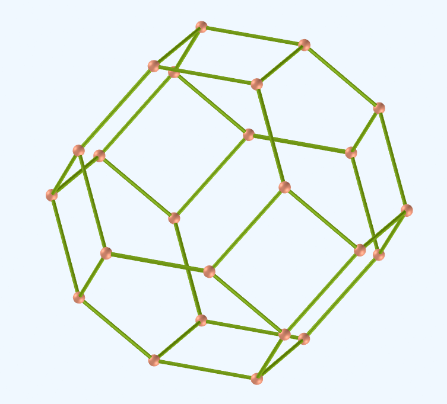</a>
  U8 O octaedro truncado é construído a partir de um octaedro regular com comprimento de lado <b>3a</b> pela remoção de seis pirâmides retas à direita, uma de cada ponto. Estas pirâmides têm tanto o comprimento do lado da base como o lado do lado lateral <b>e </b> de <b>a</b>, para formar triângulos equiláteros. O octaedro truncado pode ser dissecado em um octaedro central, circundado por 8 cúpulas triangulares em cada face e 6 pirâmides quadradas acima dos vértices. O octaedro truncado existe na estrutura dos cristais de faujasite.
   <b>Faces:</b> 14 | <b>Polígonos:</b> 6 quadrados e 8 hexágonos | <b>Arestas:</b> 36 | <b>Vértices:</b> 24 | <b>Esfericidade:</b> 0.905 | <b>Ângulos diédricos:</b> 125°15′51″ (4-6) e 109°28′16″ (6-6). <a href="http://mathworld.wolfram.com/TruncatedOctahedron.html" target="_blank">Mais sobre...</a> 

<h4>2. Icosaedro truncado</h4>
 <a href="../vr/truncated_icosahedron.html" target="_blank" title="modelo 3D" class="fotoA">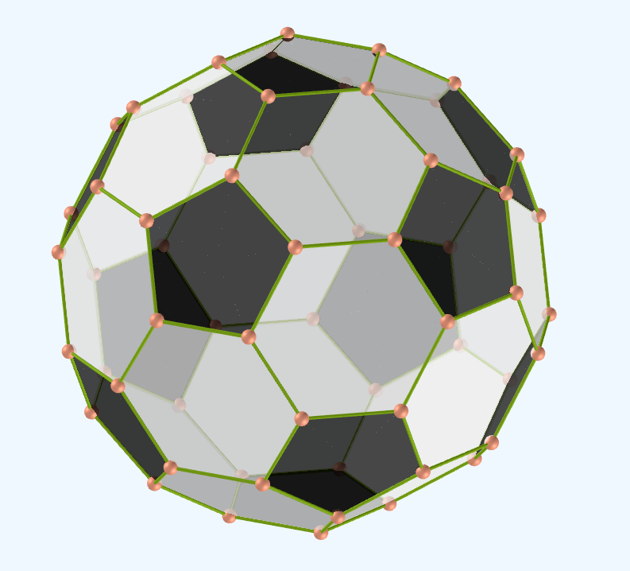</a>
  U25 A geometria do icosaedro truncado está associada a bolas de futebol, tipicamente padronizadas com hexágonos brancos e pentágonos pretos. Este poliedro pode ser construído a partir de um icosaedro com os 12 vértices truncados, de modo que um terço de cada canto é cortado em cada uma das duas extremidades. Criam-se então 12 novas faces pentagonais, transformando-se as 20 faces triangulares originais em hexágonos regulares. Assim, o comprimento das arestas é um terço do das arestas originais.
   <b>Faces:</b> 32 | <b>Polígonos:</b> 12 pentágonos e 20 hexágonos | <b>Arestas:</b> 90 | <b>Vértices:</b> 60 | <b>Esfericidade:</b> 0.967 | <b>Ângulos diédricos:</b> 138,1897° (6-6) e 142,62° (5-6). <a href="http://mathworld.wolfram.com/TruncatedIcosahedron.html" target="_blank">Mais sobre...</a> 

<h4>3. Icosidodecaedro truncado</h4>
 <a href="../vr/truncated_icosidodecahedron.html" target="_blank" title="modelo 3D" class="fotoA">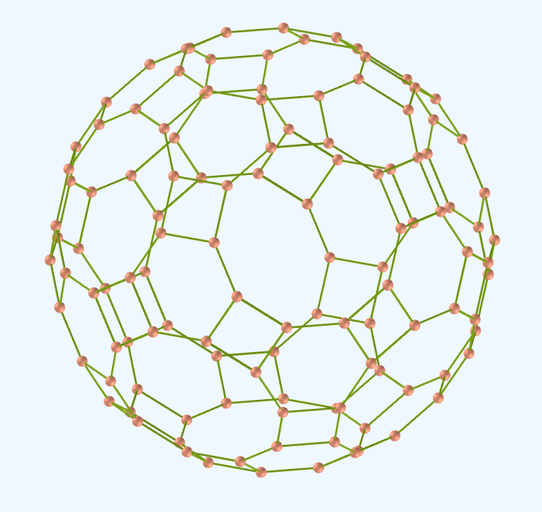</a>
  U28 O icosidodecaedro truncado também é conhecido como o grande rombicosidodecaedro, e se todos os 13 sólidos arquimedianos fossem construídos com todos os comprimentos de arestas iguais, o icosidodecaedro truncado seria o maior. Tem mais vértices e arestas do que qualquer outro poliedro uniforme não-prismático convexo.
   <b>Faces:</b> 62 | <b>Polígonos:</b> 30 quadrados, 20 hexágonos e 12 decágonos | <b>Arestas:</b> 180 | <b>Vértices:</b> 120 | <b>Esfericidade:</b> 0.97 | <b>Ângulos diédricos:</b> 142,62° (6-10), 148,28° (4-10) e 159,095° (4-6). <a href="http://mathworld.wolfram.com/GreatRhombicosidodecahedron.html" target="_blank">Mais sobre...</a> 

<h4>4. Rombicosidodecaedro</h4>
 <a href="../vr/rhombicosidodecahedron.html" target="_blank" title="modelo 3D" class="fotoA">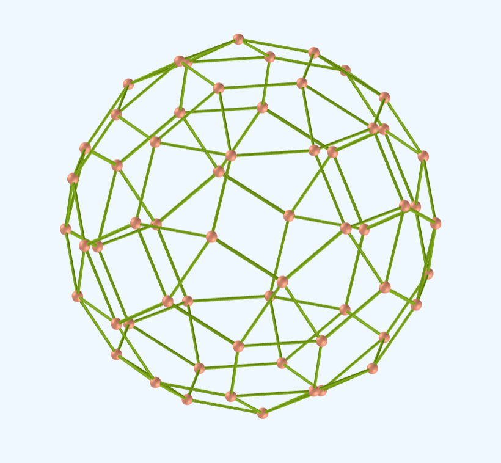</a>
  U27 O rombicosidodecaedro também é conhecido como o pequeno rombicosidodecaedro ou pequeno dodeicosidodecaedro. Se você expandir um icosaedro movendo as faces para longe da origem na quantidade certa, sem alterar a orientação ou tamanho das faces, e fazer o mesmo com um dodecaedro duplo, e corrigir os espaços com quadrados, você obtém um rombicosidodecaedro. Também pode ser chamado de dodecaedro ou icosaedro expandido a partir de operações de truncamento em poliedros regulares.
  <b>Faces:</b> 62 | <b>Polígonos:</b> 30 quadrados, 20 triângulos e 12 pentágonos | <b>Arestas:</b> 120 | <b>Vértices:</b> 60 | <b>Esfericidade:</b> 0.979 | <b>Ângulos diédricos:</b> 159°05′41″ (3-4) e 148°16′57″ (4-5). <a href="http://mathworld.wolfram.com/SmallRhombicosidodecahedron.html" target="_blank">Mais sobre...</a> 

<h4>5. Dodecaedro snub</h4>
 <a href="../vr/snub_dodecahedron.html" target="_blank" title="modelo 3D" class="fotoA">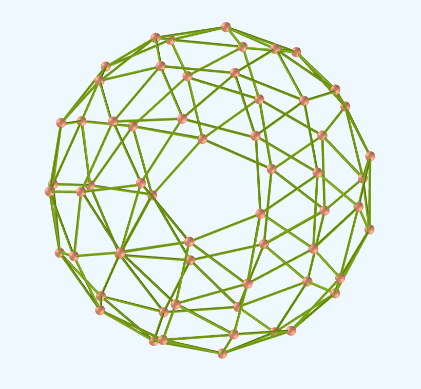</a>
  U29 O dodecaedro snub tem a mais alta esfericidade de todos os sólidos de Arquimedes. Tem duas formas distintas, que são imagens espelhadas umas da outra. A união de ambas as formas é um composto de dois dodecaedros snub. O dodecaedro snub pode ser gerado tomando-se as doze faces pentagonais do dodecaedro e deslocando-as para fora, para não se interceptarem. A uma distância adequada, esta tranformação pode criar o rombicosidodecaedro preenchendo as faces quadradas entre as arestas divididas e as faces triangulares entre os vértices divididos.
   <b>Faces:</b> 92 | <b>Polígonos:</b> 80 triângulos e 12 pentágonos | <b>Arestas:</b> 150 | <b>Vértices:</b> 60 | <b>Esfericidade:</b> 0.982 | <b>Ângulos diédricos:</b> 164°10′31″ (3-3) e 152°55′53″ (3-5). <a href="http://mathworld.wolfram.com/SnubDodecahedron.html" target="_blank">Mais sobre...</a>  

<h4>6. Dodecaedro truncado</h4>
 <a href="../vr/truncated_dodecahedron.html" target="_blank" title="modelo 3D" class="fotoA">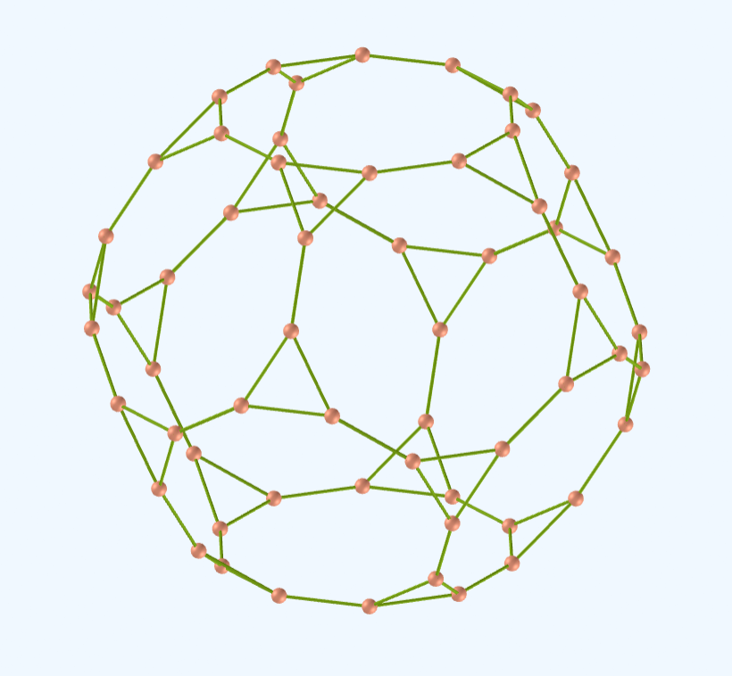</a>
  U26 O dodecaedro truncado é usado na tesselação de preenchimento de espaço hiperbólico celular-transitivo, o favo de mel icosaédrico bitruncado. Esse poliedro pode ser formado a partir de um dodecaedro, truncando os cantos para que as faces dos pentágonos se tornem decágonos e os cantos se tornem triângulos. Faz parte de um processo de truncamento entre um dodecaedro e um icosaedro.
   <b>Faces:</b> 32 | <b>Polígonos:</b> 20 triângulos e 12 decágonos | <b>Arestas:</b> 150 | <b>Vértices:</b> 60 | <b>Esfericidade:</b> 0.926 | <b>Ângulos diédricos:</b> 116,57° (10-10) e 142,62° (3-10). <a href="http://mathworld.wolfram.com/TruncatedDodecahedron.html" target="_blank">Mais sobre...</a> 

<h4>7. Icosidodecaedro</h4>
 <a href="../vr/icosidodecahedron.html" target="_blank" title="modelo 3D" class="fotoA">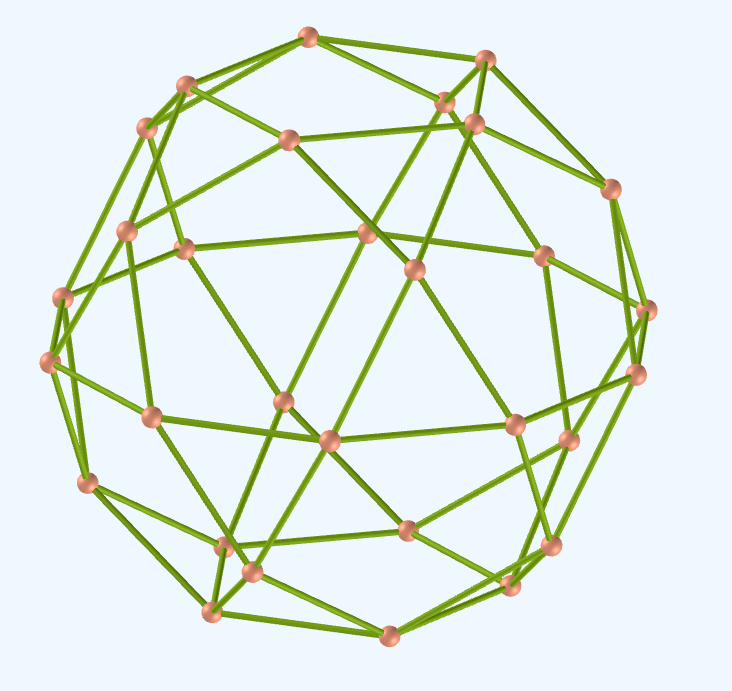</a>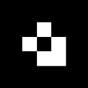
  U24 O icosidodecaedro contém 12 pentágonos do dodecaedro e 20 triângulos do icosaedro. O cubo truncado pode ser transformado em um icosidodecaedro, dividindo-se os octógonos em dois pentágonos e dois triângulos. O icosidodecaedro possui seis decágonos centrais.
   <b>Faces:</b> 32 | <b>Polígonos:</b> 20 triângulos e 12 pentágonos | <b>Arestas:</b> 60 | <b>Vértices:</b> 30 | <b>Esfericidade:</b> 0.951 | <b>Ângulo diédrico:</b> 142,62° (5-3). <a href="http://mathworld.wolfram.com/Icosidodecahedron.html" target="_blank">Mais sobre...</a> 

<h4>8. Cubo snub</h4>
 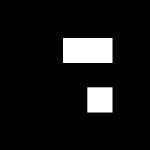
  U12 O cubo snub também é conhecido como cuboctaedro snub e tem duas formas distintas, que são imagens espelhadas uma da outra. O cubo snub pode ser gerado tomando-se as seis faces do cubo, puxando-as para fora de modo que elas não se interceptem, dando a cada uma delas uma pequena rotação em seus centros (todas no mesmo sentido: horário ou anti-horário) até que os espaços possam ser preenchidos com triângulos equiláteros.
  <b>Faces:</b> 38 | <b>Polígonos:</b> 32 triângulos e 6 quadrados | <b>Arestas:</b> 60 | <b>Vértices:</b> 24 | <b>Esfericidade:</b> 0.965 | <b>Ângulos diédricos:</b> 153°14′04″ (3-3) e 142°59′00″ (3-4). <a href="http://mathworld.wolfram.com/SnubCube.html" target="_blank">Mais sobre...</a>

<h4>9. Cuboctaedro truncado</h4>
 <a href="../vr/truncated_cuboctahedron.html" target="_blank" title="modelo 3D" class="fotoA">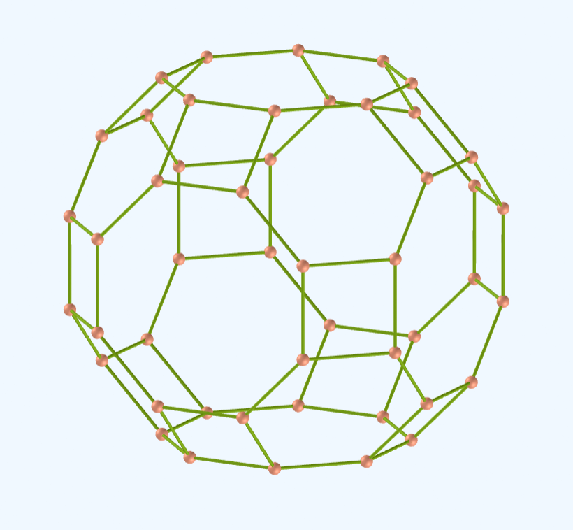</a>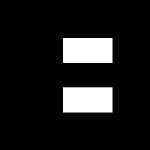
  U11 O cuboctaedro truncado também é conhecido como grande rombicuboctaedro. O cuboctaedro truncado é o casco convexo de um rombicuboctaedro com cubos acima de seus 12 quadrados em eixos de simetria dupla. O resto de seu espaço pode ser dissecado em seis cúpulas quadradas abaixo dos octógonos e oito cúpulas triangulares abaixo dos hexágonos.
   <b>Faces:</b> 26 | <b>Polígonos:</b> 12 quadrados, 8 hexágonos e 6 octógonos | <b>Arestas:</b> 72 | <b>Vértices:</b> 48 | <b>Esfericidade:</b> 0.943 | <b>Ângulos diédricos:</b> 144°44′08″ (4-6), 135° (4-8) e 125°15′51″ (6-8). <a href="http://mathworld.wolfram.com/GreatRhombicuboctahedron.html" target="_blank">Mais sobre...</a>

<h4>10. Rombicuboctaedro</h4>
 <a href="../vr/rhombicuboctahedron.html" target="_blank" title="modelo 3D" class="fotoA">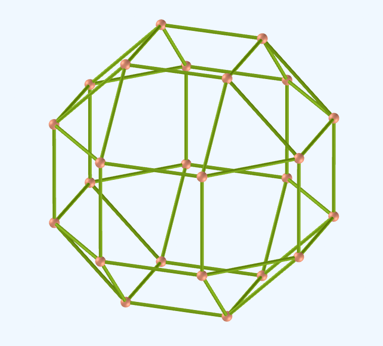</a>
  U10 O rombicuboctaedro é também conhecido como pequeno rombicuboctaedro. Este sólido também pode ser chamado de cubo ou octaedro expandido  e pode ser dissecado em duas cúpulas quadradas e um prisma octogonal central. Existem três pares de planos paralelos que interceptam o rombicuboctaedro em um octógono regular.
  <b>Faces:</b> 26 | <b>Polígonos:</b> 18 quadrados e 8 triângulos | <b>Arestas:</b> 48 | <b>Vértices:</b> 24 | <b>Esfericidade:</b> 0.954 | <b>Ângulos diédricos:</b> 144°44′08″ (4-3) e 135° (4-4). <a href="http://mathworld.wolfram.com/SmallRhombicuboctahedron.html" target="_blank">Mais sobre...</a>

<h4>11. Cubo truncado</h4>
 <a href="../vr/truncated_cube.html" target="_blank" title="modelo 3D" class="fotoA">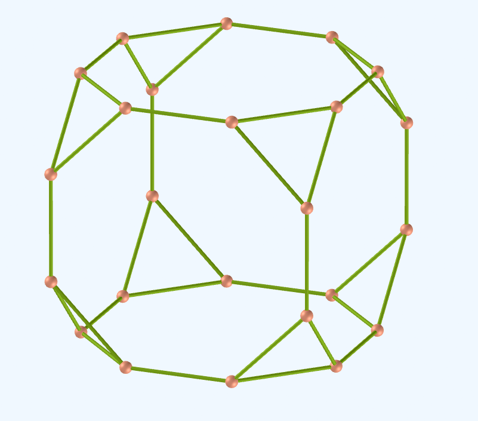</a>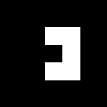
  U9 O cubo truncado pertence a uma família de poliedros uniformes relacionados ao cubo e octaedro regular. Esse sólido pode ser dissecado em um cubo central, com seis cúpulas quadradas ao redor de cada uma das faces do cubo e oito tetraédricas regulares nos cantos. Essa dissecação também pode ser vista dentro do favo de mel cúbico, com células cubo, tetraedro e rombicuboctaedro.
  <b>Faces:</b> 14 | <b>Polígonos:</b> 8 triângulos e 6 octógonos | <b>Arestas:</b> 36 | <b>Vértices:</b> 24 | <b>Esfericidade:</b> 0.849 | <b>Ângulos diédricos:</b> 125°15′51″ (8-3) e 90° (8-8). <a href="http://mathworld.wolfram.com/TruncatedCube.html" target="_blank">Mais sobre...</a> 

<h4>12. Cuboctaedro</h4>
 <a href="../vr/cuboctahedron.html" target="_blank" title="modelo 3D" class="fotoA">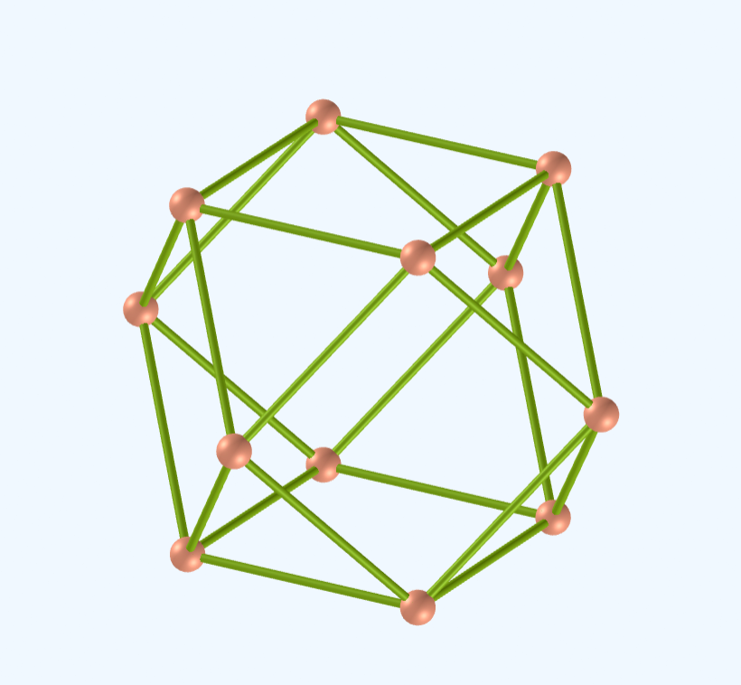</a>
  U7 O cuboctaedro é o único poliedro convexo no qual o maior raio (do centro ao vértice) tem o mesmo comprimento que sua aresta. Um hexágono pode ser obtido tomando-se uma seção transversal equatorial de um cuboctaedro. Este sólido pode ser dissecado em duas cúpulas triangulares por um hexágono passando pelo centro do cuboctaedro.
  <b>Faces:</b> 14 | <b>Polígonos:</b> 8 triângulos e 6 quadrados | <b>Arestas:</b> 24 | <b>Vértices:</b> 12 | <b>Esfericidade:</b> 0.905 | <b>Ângulo diédrico:</b> 125,26° (4-3). <a href="http://mathworld.wolfram.com/Cuboctahedron.html" target="_blank">Mais sobre...</a>

<h4>13. Tetraedro truncado</h4>
 <a href="../vr/truncated_tetrahedron.html" target="_blank" title="modelo 3D" class="fotoA">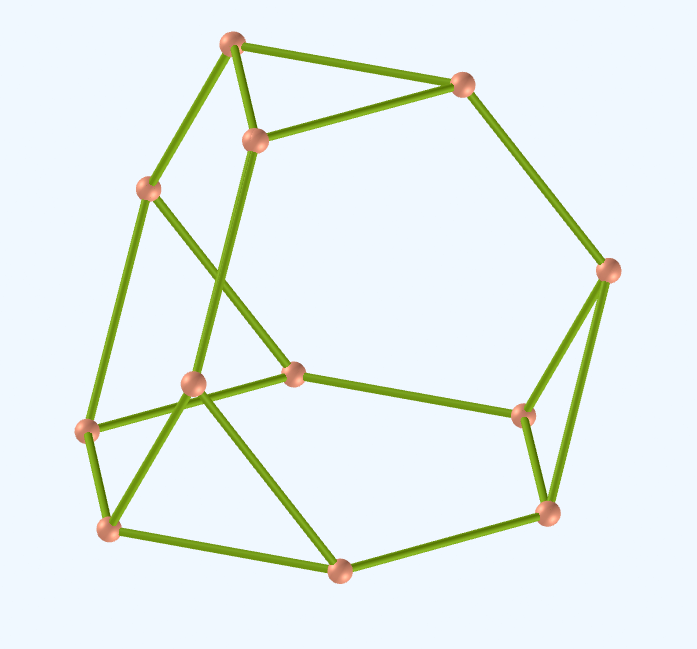</a>
  U2 O tetraedro truncado pode ser construído truncando todos os 4 vértices de um tetraedro regular com um terço do comprimento original da aresta. Um truncamento mais profundo, removendo um tetraedro de metade do comprimento original da aresta de cada vértice, é chamado de retificação. A retificação de um tetraedro produz um octaedro.
  <b>Faces:</b> 8 | <b>Polígonos:</b> 4 triângulos e 4 hexágonos | <b>Arestas:</b> 18 | <b>Vértices:</b> 12 | <b>Esfericidade:</b> 0.775 | <b>Ângulos diédricos:</b> 109°28′16′ (6-3) e 70°31′44″ (6-6). <a href="http://mathworld.wolfram.com/TruncatedTetrahedron.html" target="_blank">Mais sobre...</a> 

<a href="#p1" class="topo">voltar ao topo</a>

 

  
Poliedros de Platão

Um sólido platônico é um poliedro regular e convexo. É construído por faces poligonais regulares e congruentes com o mesmo número de faces reunidas em cada vértice. Eles foram nomeados pelo antigo filósofo grego Platão, o qual classificou que os elementos clássicos foram feitos a partir desses sólidos regulares.
  Para ver o poliedro platônico em AR, visite

 <a href="../platonic.html" target="_blank">https://paulohscwb.github.io/polyhedra/platonic.html </a>

com qualquer navegador com um dispositivo de webcam (smartphone, tablet ou notebook).
 O acesso às páginas de RV é feito clicando no círculo azul que aparece em cima de cada marcador.
 
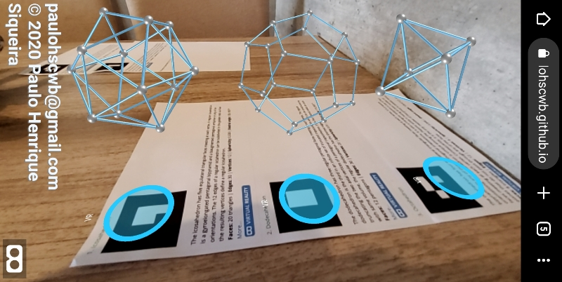

<h4>1. Icosaedro</h4>
 <a href="../vr/icosahedron.html" target="_blank" title="modelo 3D" class="fotoA">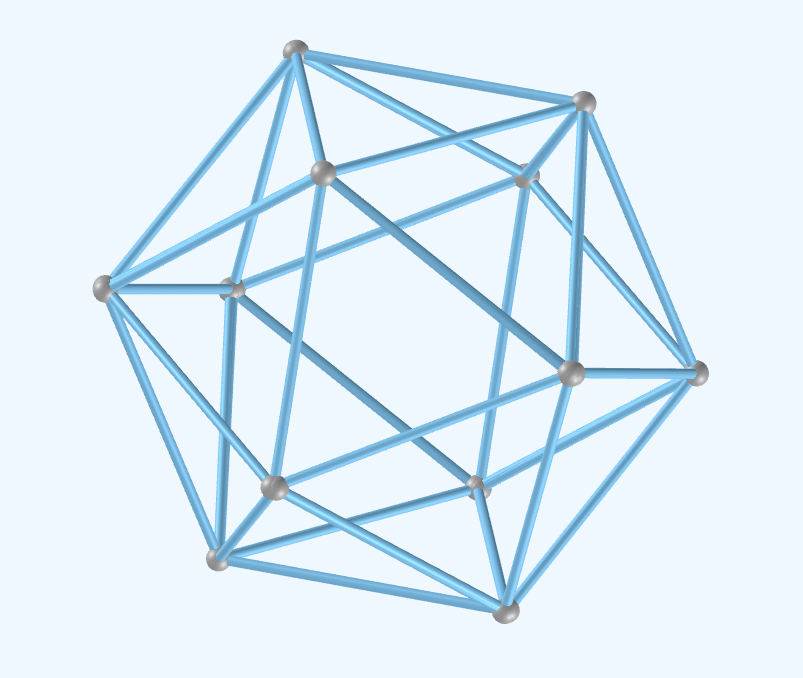</a>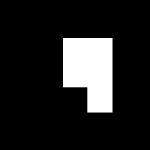
  U22 O icosaedro tem cinco faces triangulares reunidas em cada vértice. Um icosaedro regular é uma pirâmide dupla pentagonal giroalongada e um antiprisma pentagonal em qualquer das seis orientações. As 12 arestas de um octaedro regular podem ser subdivididas na proporção áurea de modo que os vértices resultantes definem um icosaedro regular.
  <b>Faces:</b> 20 triângulos | <b>Arestas:</b> 30 | <b>Vértices:</b> 12 | <b>Esfericidade:</b> 0.939 | <b>Ângulo diédrico:</b> 138,1897°. <a href="http://mathworld.wolfram.com/RegularIcosahedron.html" target="_blank">Mais sobre...</a>

<h4>2. Dodecaedro</h4>
 <a href="../vr/dodecahedron.html" target="_blank" title="modelo 3D" class="fotoA">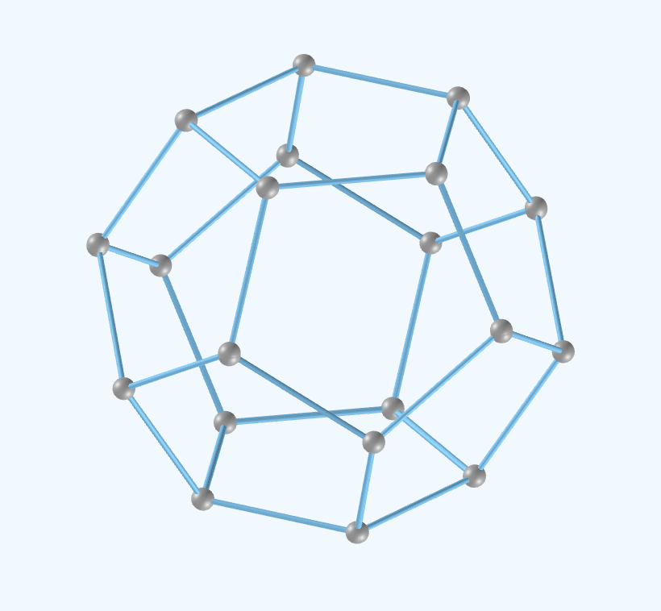</a>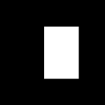
  U23 O dodecaedro tem três faces pentagonais regulares se encontrando em cada vértice. O dodecaedro regular é o terceiro em um conjunto infinito de trapezoedros truncados que pode ser construído truncando-se dois vértices axiais de um trapezoedro pentagonal. Se os cinco sólidos platônicos forem construídos com o mesmo volume, o dodecaedro regular tem as arestas de menor comprimento.
  <b>Faces:</b> 12 pentágonos | <b>Arestas:</b> 30 | <b>Vértices:</b> 20 | <b>Esfericidade:</b> 0.91 | <b>Ângulo diédrico:</b> 116,5651°. <a href="http://mathworld.wolfram.com/RegularDodecahedron.html" target="_blank">Mais sobre...</a>

<h4>3. Octaedro</h4>
 <a href="../vr/octahedron.html" target="_blank" title="modelo 3D" class="fotoA">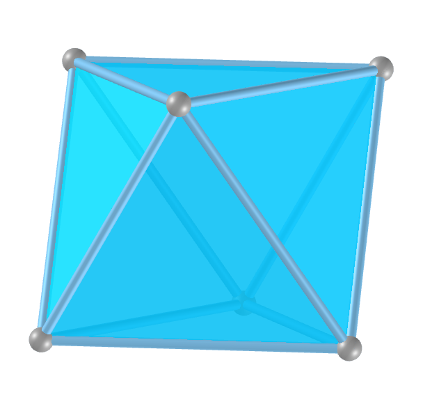</a>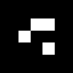
  U5 O octaedro tem quatro faces triangulares reunidas em cada vértice. É uma pirâmide dupla quadrada em qualquer uma das três orientações ortogonais. É também um antiprisma triangular em qualquer das quatro orientações. O octaedro é único entre os sólidos platônicos que tem número par de faces que se encontram em cada vértice. Consequentemente, é o único membro desse grupo que possui planos espelhados que não passam por alguma face.
  <b>Faces:</b> 8 triângulos | <b>Arestas:</b> 12 | <b>Vértices:</b> 6 | <b>Esfericidade:</b> 0.846 | <b>Ângulo diédrico:</b> 109,4712°. <a href="http://mathworld.wolfram.com/RegularOctahedron.html" target="_blank">Mais sobre...</a>

<h4>4. Cubo</h4>
 <a href="../vr/cube.html" target="_blank" title="modelo 3D" class="fotoA">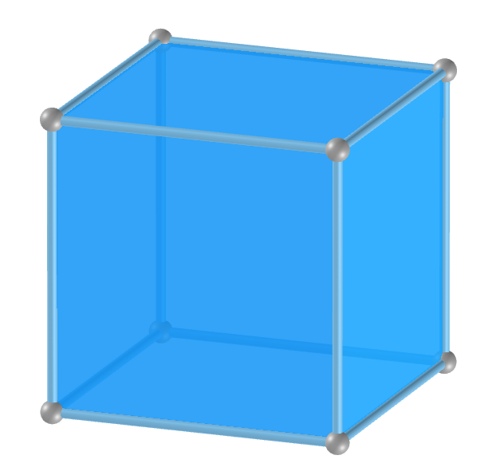</a>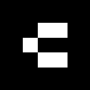
  U6 O cubo ou hexaedro tem três faces quadradas reunidas em cada vértice. O cubo é também um paralelepípedo quadrado, um cubóide equilatero ou um romboedro regular. É um prisma quadrado regular em três orientações, e um trapezoedro trígono em quatro orientações. O cubo pode ser cortado em seis pirâmides quadradas idênticas. Se estas pirâmides quadradas são encaixadas às faces de um segundo cubo, um dodecaedro rômbico é obtido.
  <b>Faces:</b> 6 quadrados | <b>Arestas:</b> 12 | <b>Vértices:</b> 8 | <b>Esfericidade:</b> 0.806 | <b>Ângulo diédrico:</b> 90°. <a href="http://mathworld.wolfram.com/Cube.html" target="_blank">Mais sobre...</a>

<h4>5. Tetraedro</h4>
 <a href="../vr/tetrahedron.html" target="_blank" title="modelo 3D" class="fotoA">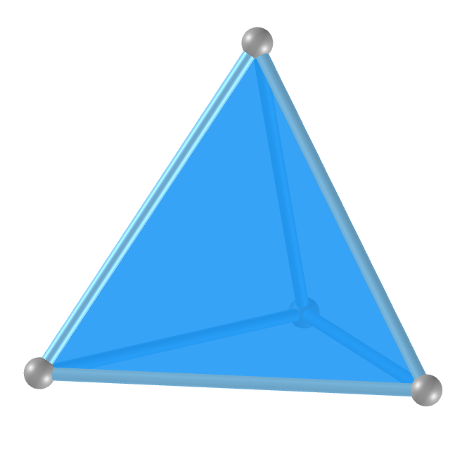</a>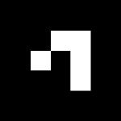
  U1 O tetraedro tem três faces triangulares reunidas em cada vértice. O tetraedro também é conhecido como uma pirâmide triangular e é o mais simples de todos os poliedros convexos comuns e o único que tem menos de 5 faces. O tetraedro tem muitas propriedades análogas àquelas de um triângulo, incluindo um esfera inscrita, esfera circunscrita, tetraedro medial e esferas ex-inscritas.
  <b>Faces:</b> 4 triângulos | <b>Arestas:</b> 6 | <b>Vértices:</b> 4 | <b>Esfericidade:</b> 0.671 | <b>Ângulo diédrico:</b> 70,5288°. <a href="http://mathworld.wolfram.com/RegularTetrahedron.html" target="_blank">Mais sobre...</a>

<a href="#p2" class="topo">voltar ao topo</a>

  
Poliedros de Catalan

  Os sólidos de Catalan são os duais dos sólidos de Arquimedes. Eles são nomeados em homenagem ao matemático belga Eugene Catalan (1814-1894) que descreveu pela primeira vez o conjunto completo em 1865. O Dodecaedro Rômbico e o Triacontaedro Rômbico foram descritos em 1611 por Johannes Kepler. Cada sólido de Catalan tem um tipo de face e um ângulo diedro constante, e possui a mesma simetria que seu respectivo dual de Arquimedes.
  Para visualizar os poliedros de Catalan em RA, visite a página:

<a href="../catalan.html" target="_blank">https://paulohscwb.github.io/polyhedra/catalan.html</a>
 
com qualquer navegador com um dispositivo de webcam (smartphone, tablet ou notebook).
 O acesso às páginas de RV é feito clicando no círculo azul que aparece em cima de cada marcador.

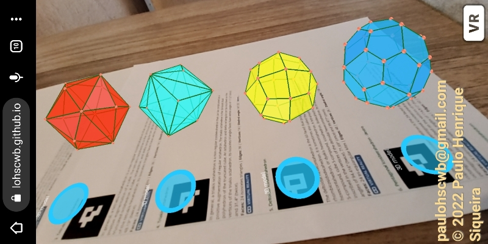

<h4>1. Tetraedro triakis</h4>
 <a href="../vr/triakis_tetrahedron.htm" target="_blank" title="modelo 3D" class="fotoA">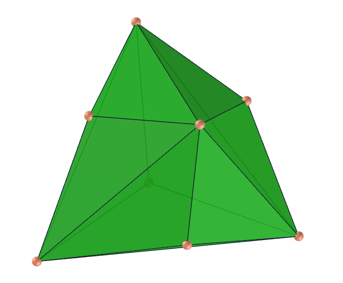</a>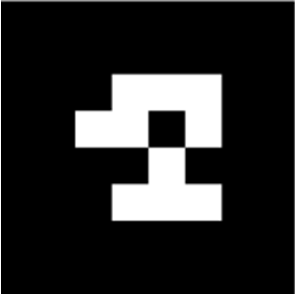
  O tetraedro triakis é um dodecaedro não regular que pode ser construído como um aumento positivo de um tetraedro regular: uma pirâmide triangular adicionada a cada face. O tetraedro triakis é o poliedro dual do tetraedro truncado. Suas faces de triângulos isósceles têm ângulos dos vértices com medidas de 112,885° (uma vez) e 33,557° (duas vezes).
  <b>Faces:</b> 12 triângulos isósceles | <b>Arestas:</b> 18 | <b>Vértices:</b> 8 | <b>Ângulo diédrico:</b> 129,521°. <a href="https://mathworld.wolfram.com/TriakisTetrahedron.html" target="_blank">Mais sobre...</a>
 

 <h4>2. Dodecaedro rômbico</h4>
 <a href="../vr/rhombic_dodecahedron.htm" target="_blank" title="modelo 3D" class="fotoA">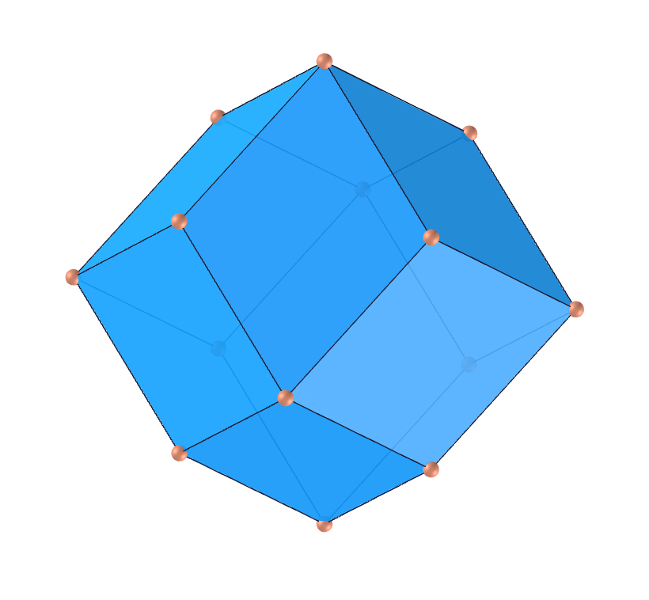</a>
  O dodecaedro rômbico é o poliedro dual do cuboctaedro. Mais especificamente, um cubo, um octaedro e um octaedro estrelado podem ser inscritos nos vértices de um dodecaedro rômbico. Um dodecaedro rômbico aparece no canto superior direito como uma das "estrelas" poliédricas na gravura em madeira "Stars" de M. C. Escher de 1948. Os losangos de suas faces possuem ângulos dos vértices com medidas iguais a 70,53° e 109,47°.
  <b>Faces:</b> 12 losangos | <b>Arestas:</b> 24 | <b>Vértices:</b> 14 | <b>Ângulo diédrico:</b> 120°. <a href="https://mathworld.wolfram.com/RhombicDodecahedron.html" target="_blank">Mais sobre...</a>
 

 <h4>3. Hexaedro tetrakis</h4>
 <a href="../vr/tetrakis_hexahedron.htm" target="_blank" title="modelo 3D" class="fotoA">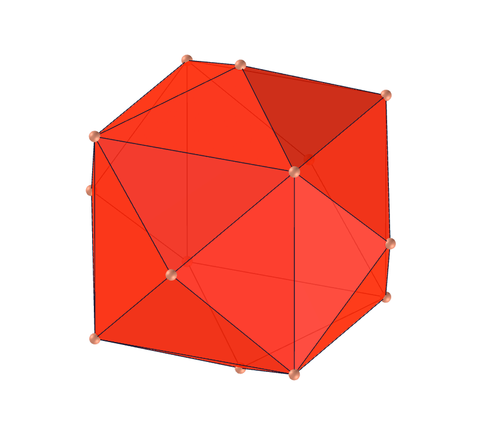</a>
  Em geral, um hexaedro tetrakis é um icositetraedro não regular que pode ser construído como um aumento de um cubo. O hexaedro tetrakis é o poliedro dual de 24 faces do octaedro truncado. Um cubo, um octaedro e um octaedro estrelado podem ser todos inscritos nos vértices do hexaedro tetrakis. Suas faces de triângulos isósceles têm ângulos dos vértices com medidas iguais a 86,62° (uma vez) e 48,19° (duas vezes).
  <b>Faces:</b> 24 triângulos isósceles | <b>Arestas:</b> 36 | <b>Vértices:</b> 14 | <b>Ângulo diédrico:</b> 143,13°. <a href="https://mathworld.wolfram.com/TetrakisHexahedron.html" target="_blank">Mais sobre...</a>
 

 <h4>4. Octaedro triakis</h4>
 <a href="../vr/triakis_octahedron.htm" target="_blank" title="modelo 3D" class="fotoA">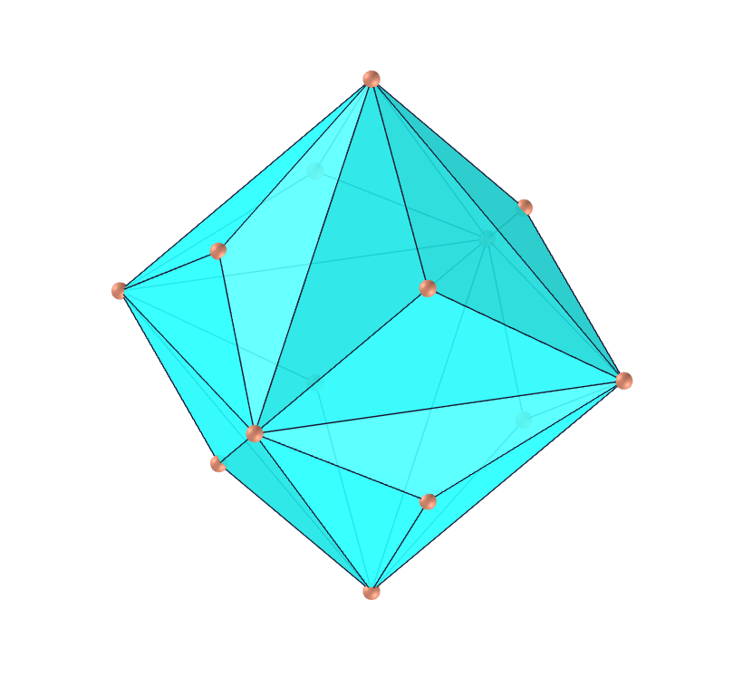</a>
  Em geral, um octaedro triakis é um icositetraedro não regular que pode ser construído como um aumento do octaedro regular. O octaedro triakis é o poliedro dual de 24 faces do cubo truncado. Um octaedro e um octaedro estrelado podem ser inscritos nos vértices do octaedro triakis. Suas faces de triângulos isósceles têm ângulos dos vértices com medidas iguais a 117,2° (uma vez) e 31,4° (duas vezes).
  <b>Faces:</b> 24 triângulos isósceles | <b>Arestas:</b> 36 | <b>Vértices:</b> 14 | <b>Ângulo diédrico:</b> 147,35°. <a href="https://mathworld.wolfram.com/SmallTriakisOctahedron.html" target="_blank">Mais sobre...</a>
 

 <h4>5. Icositetraedro deltoidal</h4>
 <a href="../vr/deltoidal_icositetrahedron.htm" target="_blank" title="modelo 3D" class="fotoA">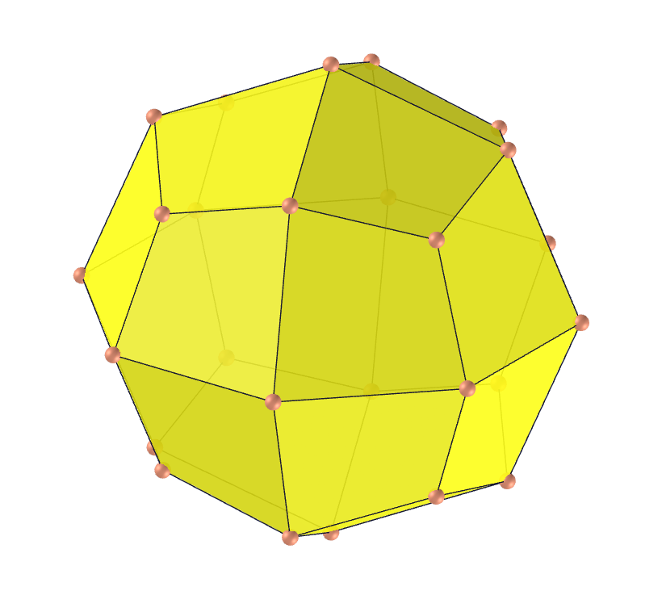</a>
  O icositetraedro deltoide é o poliedro dual de 24 faces do rombicuboctaedro. Um icositetraedro deltoide aparece na metade direita como uma das "estrelas" poliédricas na gravura em madeira "Stars" de M. C. Escher de 1948. um octaedro estrelado, um octaedro atrativo 4-composto (cujo dual é um cubo atrativo 4-composto) e um cubo podem ser todos inscritos em um icositetraedro deltoide. Suas faces têm formato de "pipas" tri-equiangulares que possuem ângulos dos vértices com medidas de 94,416° (duas vezes), 71,69° (uma vez) e 99,477° (uma vez).
  <b>Faces:</b> 24 "pipas" tri-equiangulares | <b>Arestas:</b> 48 | <b>Vértices:</b> 26 | <b>Ângulo diédrico:</b> 138,12°. <a href="https://mathworld.wolfram.com/DeltoidalIcositetrahedron.html" target="_blank">Mais sobre...</a>
 

 <h4>6. Icositetraedro pentagonal</h4>
 <a href="../vr/pentagonal_icositetrahedron.htm" target="_blank" title="modelo 3D" class="fotoA">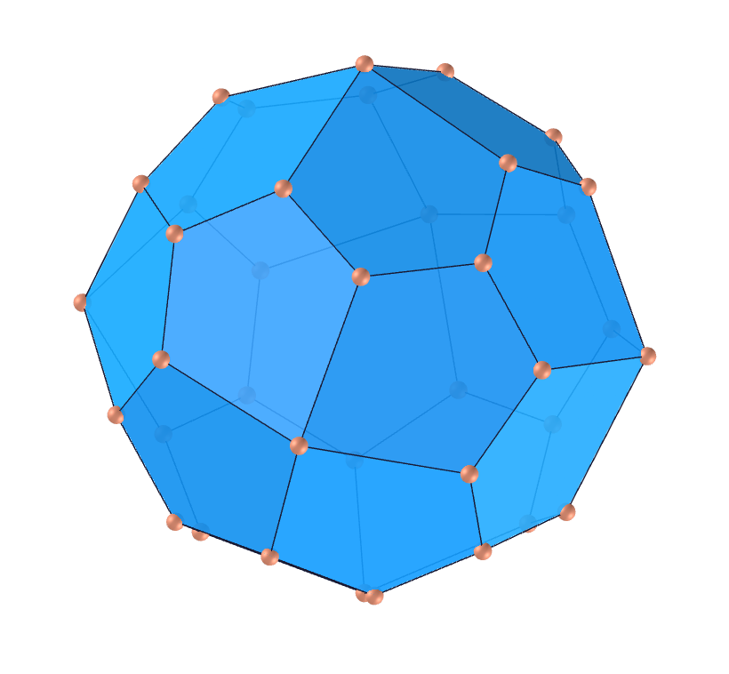</a>
   O icositetraedro pentagonal é o poliedro dual de 24 faces do cubo snub. O mineral cuprita (Cu2O) se forma em cristais icositetraédricos pentagonais. Um cubo, um octaedro e um octaedro estrelado podem ser inscritos nos vértices do icositetraedro pentagonal. Suas faces pentagonais irregulares simétricas possuem ângulos dos vértices com medidas de 114,812° (quatro vezes) e 80,7517° (uma vez).
  <b>Faces:</b> 24 pentágonos irregulares simétricos | <b>Arestas:</b> 60 | <b>Vértices:</b> 38 | <b>Ângulo diédrico:</b> 136,31°. <a href="https://mathworld.wolfram.com/PentagonalIcositetrahedron.html" target="_blank">Mais sobre...</a>
 

 <h4>7. Triacontaedro rômbico</h4>
 <a href="../vr/rhombic_triacontahedron.htm" target="_blank" title="modelo 3D" class="fotoA">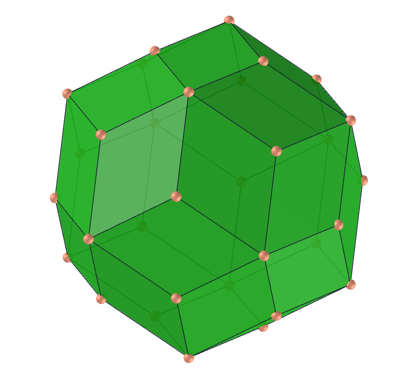</a>
  O triacontaedro rômbico é um zonoedro que é o poliedro dual do icosidodecaedro. As arestas que se cruzam do composto dodecaedro-icosaedro formam as diagonais de 30 losangos que compõem o triacontaedro. O cubo 5-composto possui os 30 planos faciais do triacontaedro rômbico e seu interior é um triacontaedro rômbico. Os losangos de suas faces possuem ângulos dos vértices com medidas iguais a 116,565° e 63,435°.
  <b>Faces:</b> 30 losangos | <b>Arestas:</b> 60 | <b>Vértices:</b> 32 | <b>Ângulo diédrico:</b> 144°. <a href="https://mathworld.wolfram.com/RhombicTriacontahedron.html" target="_blank">Mais sobre...</a>
 

 <h4>8. Dodecaedro disdiakis</h4>
 <a href="../vr/disdyakis_dodecahedron.htm" target="_blank" title="modelo 3D" class="fotoA">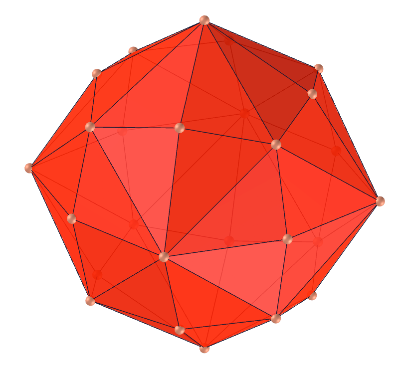</a>
  O dodecaedro disdiakis é o poliedro dual do cuboctaedro truncado de Arquimedes. A substituição de cada face do dodecaedro rômbico por uma pirâmide plana cria um poliedro que se parece quase com o dodecaedro disdiakis. Os triângulos acutângulos de suas faces possuem ângulos dos vértices com medidas de 87,202°, ​​55,025° e 37,773°. 
  <b>Faces:</b> 48 triângulos acutângulos | <b>Arestas:</b> 72 | <b>Vértices:</b> 26 | <b>Ângulo diédrico:</b> 155,08°. <a href="https://mathworld.wolfram.com/DisdyakisDodecahedron.html" target="_blank">Mais sobre...</a>
 

 <h4>9. Dodecaedro pentakis</h4>
 <a href="../vr/pentakis_dodecahedron.htm" target="_blank" title="modelo 3D" class="fotoA">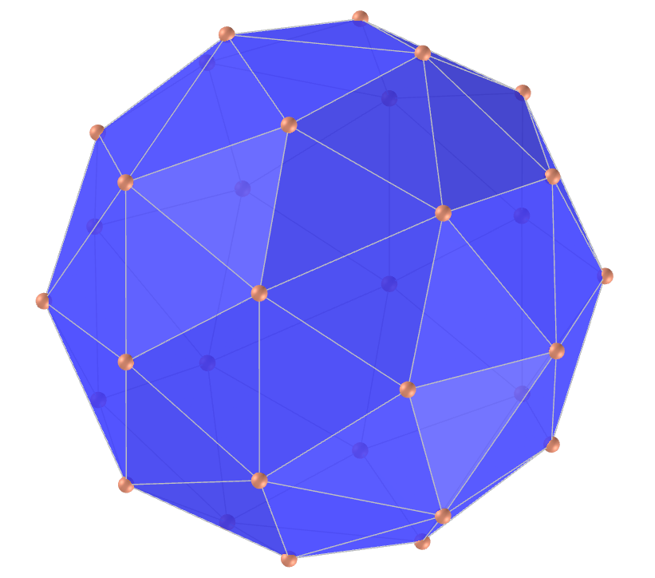</a>
  O dodecaedro pentakis é o poliedro dual de 60 faces do icosaedro truncado. Um tetraedro composto 10, um cubo composto 5, um icosaedro e um dodecaedro podem ser inscritos nos vértices do dodecaedro pentakis. Suas faces de triângulos isósceles têm ângulos dos vértices com medidas de 68,619° (uma vez) e 55,691° (duas vezes). 
  <b>Faces:</b> 60 triângulos isósceles | <b>Arestas:</b> 90 | <b>Vértices:</b> 32 | <b>Ângulo diédrico:</b> 156,72°. <a href="https://mathworld.wolfram.com/PentakisDodecahedron.html" target="_blank">Mais sobre...</a>
 

 <h4>10. Icosaedro triakis</h4>
 <a href="../vr/triakis_icosahedron.htm" target="_blank" title="modelo 3D" class="fotoA">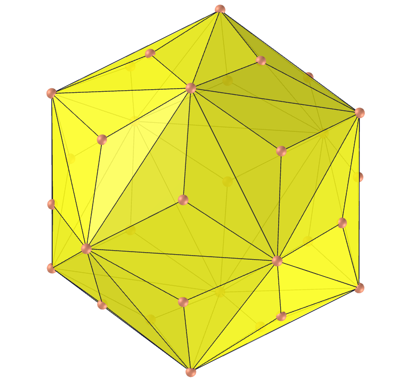</a>
  O icosaedro triakis é o poliedro dual de 60 faces do dodecaedro truncado. Um tetraedro composto 10, um cubo composto 5, um icosaedro e um dodecaedro podem ser inscritos nos vértices do icosaedro triakis. Suas faces de triângulos isósceles têm ângulos dos vértices com medidas iguais a 119,039° (uma vez) e 30,48° (duas vezes).
  <b>Faces:</b> 60 triângulos isósceles | <b>Arestas:</b> 90 | <b>Vértices:</b> 32 | <b>Ângulo diédrico:</b> 160,61°. <a href="https://mathworld.wolfram.com/TriakisIcosahedron.html" target="_blank">Mais sobre...</a>
 

 <h4>11. Hexecontaedro pentagonal</h4>
 <a href="../vr/pentagonal_hexecontahedron.htm" target="_blank" title="modelo 3D" class="fotoA">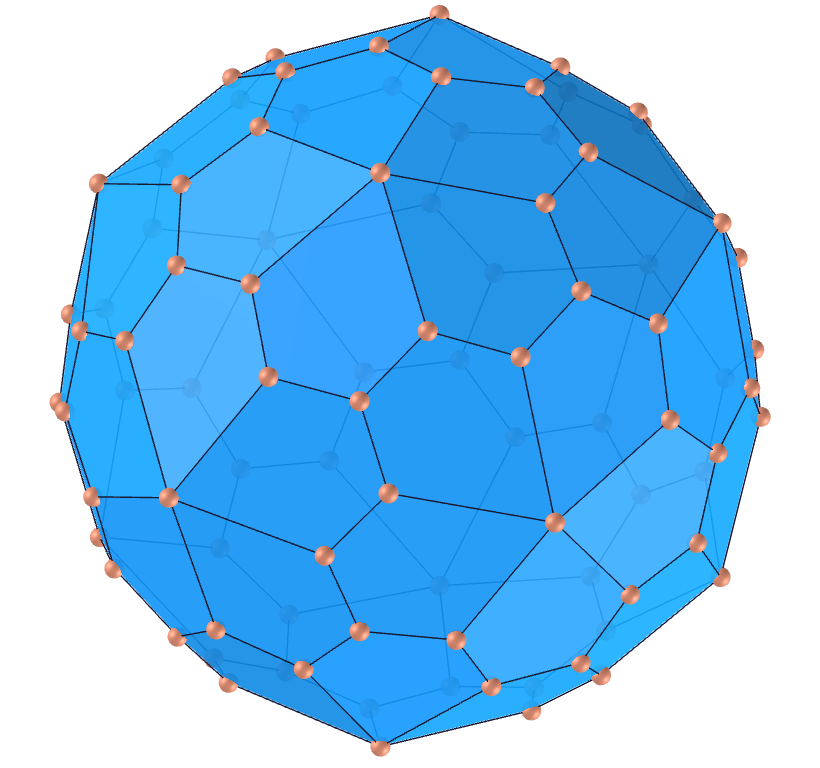</a>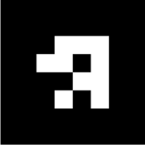
  O hexecontaedro pentagonal é o poliedro dual de 60 faces do dodecaedro snub. Um tetraedro composto 10, cubo composto 5, icosaedro e dodecaedro podem ser inscritos nos vértices do hexecontaedro pentagonal. Suas faces pentagonais irregulares simétricas possuem ângulos dos vértices com medidas de 118,137° (quatro vezes) e 67,4535° (uma vez).
  <b>Faces:</b> 60 pentágonos irregulares simétricos | <b>Arestas:</b> 150 | <b>Vértices:</b> 92 | <b>Ângulo diédrico:</b> 153,18°. <a href="https://mathworld.wolfram.com/PentagonalHexecontahedron.html" target="_blank">Mais sobre...</a>
 

 <h4>12. Hexecontaedro deltoidal</h4>
 <a href="../vr/deltoidal_hexecontahedron.htm" target="_blank" title="modelo 3D" class="fotoA">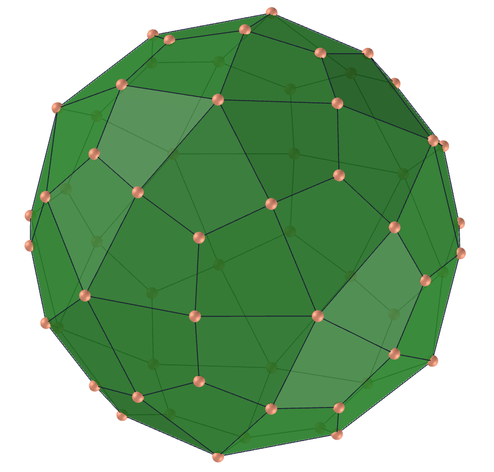</a>
  O hexecontaedro deltoide é o poliedro dual de 60 faces do rombicosidodecaedro. Um tetraedro 10-composto, um octaedro 5-composto, um cubo 5-composto, um icosaedro, um dodecaedro e um icosidodecaedro podem todos ser inscritos nos vértices do hexecontaedro deltoidal. Suas faces têm formato de "pipas" tri-equiangulares que possuem ângulos dos vértices com medidas de 86,974° (duas vezes), 67,783° (uma vez) e 118,269° (uma vez). 
  <b>Faces:</b> 60 "pipas" tri-equiangulares | <b>Arestas:</b> 120 | <b>Vértices:</b> 62 | <b>Ângulo diédrico:</b> 154,12°. <a href="https://mathworld.wolfram.com/DeltoidalHexecontahedron.html" target="_blank">Mais sobre...</a>
 

 <h4>13. Triacontaedro disdiakis</h4>
 <a href="../vr/disdyakis_triacontahedron.htm" target="_blank" title="modelo 3D" class="fotoA">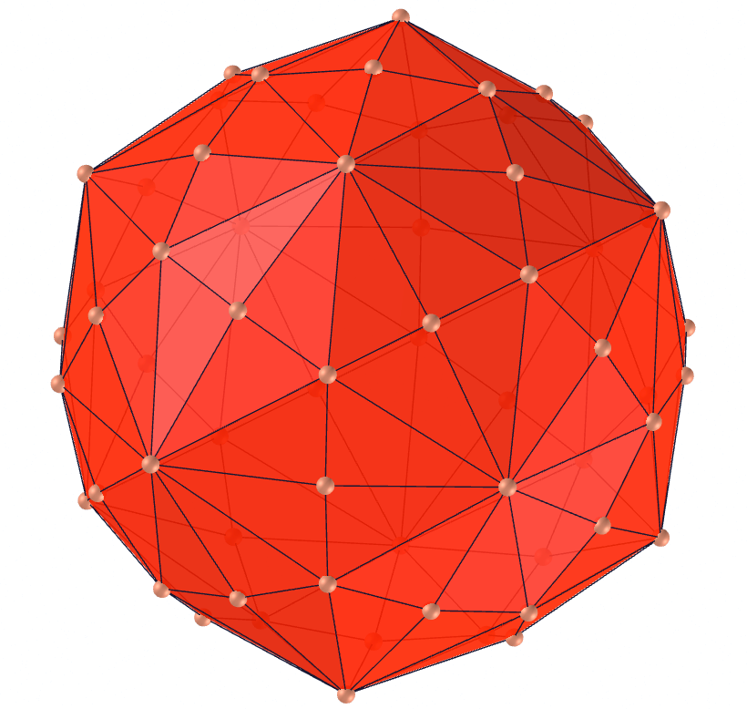</a>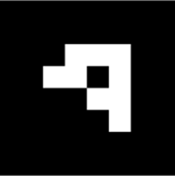
  O triacontaedro disdiakis é o poliedro dual do icosidodecaedro truncado de Arquimedes. Um tetraedro 10-composto, um octaedro 5-composto, um cubo 5-composto, um icosaedro, um dodecaedro e um icosidodecaedro podem ser inscritos nos vértices de um triacontaedro disdiakis. Os triângulos acutângulos de suas faces possuem ângulos dos vértices com medidas de 88,992°, 58,238° e 32,77°.
  <b>Faces:</b> 120 triângulos acutângulos | <b>Arestas:</b> 180 | <b>Vértices:</b> 62 | <b>Ângulo diédrico:</b> 164,89°. <a href="https://mathworld.wolfram.com/DisdyakisTriacontahedron.html" target="_blank">Mais sobre...</a>

<a href="#p3" class="topo">voltar ao topo</a>

  
Poliedros não convexos

  Um poliedro é não convexo se pelo menos uma de suas diagonais está fora da região delimitada por suas faces. Para visualizar os poliedros não convexos em RA, visite a página:

<a href="../nonconvex.html" target="_blank">https://paulohscwb.github.io/polyhedra/nonconvex.html</a>
 
com qualquer navegador com um dispositivo de webcam (smartphone, tablet ou notebook).
 O acesso às páginas de RV é feito clicando no círculo azul que aparece em cima de cada marcador.

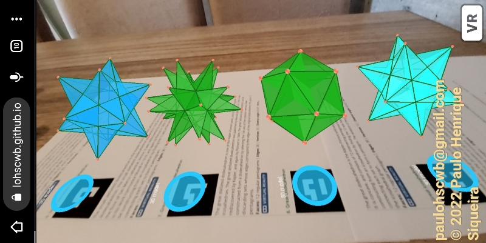

<h4>1. Sólido de Escher</h4>
 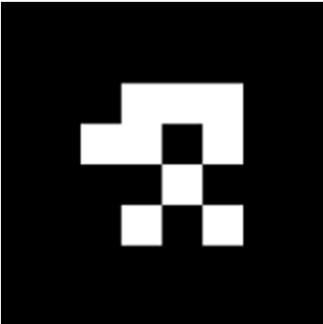
  O sólido de Escher está ilustrado no pedestal direito na xilogravura "Waterfall" de M. C. Escher. É obtido aumentando um dodecaedro rômbico até que as arestas incidentes se tornem paralelas, correspondendo ao aumento da altura de um dodecaedro rômbico. É a primeira estrela de dodecaedro rômbico e é um poliedro de preenchimento de espaço. Sua superfície convexo é um cuboctaedro. Suas faces de triângulos isósceles têm ângulos de vértices com medidades de 70,53° (uma vez) e 54,73° (duas vezes).
  <b>Faces:</b> 48 triângulos isósceles | <b>Arestas:</b> 72 | <b>Vértices:</b> 26 | <b>Ângulos diédricos:</b> 117,04° e 90°. <a href="https://mathworld.wolfram.com/EschersSolid.html" target="_blank">Mais sobre...</a>

<h4>2. Dual do sólido de Escher</h4>
 
  O dual do sólido de Escher foi modelado pelo autor desta página (Paulo Henrique Siqueira) utilizando as coordenadas dos vértices e as respectivas arestas do sólido de Escher.
   <b>Faces:</b> 8 hexágonos regulares, 6 octógonos e 12 retângulos | <b>Arestas:</b> 72 | <b>Vértices:</b> 48 | <b>Ângulos diédricos:</b> 144,74°, 125,26° e 135°. <a href="https://mathworld.wolfram.com/EschersSolid.html" target="_blank">Mais sobre...</a>
 

 <h4>3. Octaedro estrelado</h4>
 <a href="../vr/stella_octangula.htm" target="_blank" title="modelo 3D" class="fotoA">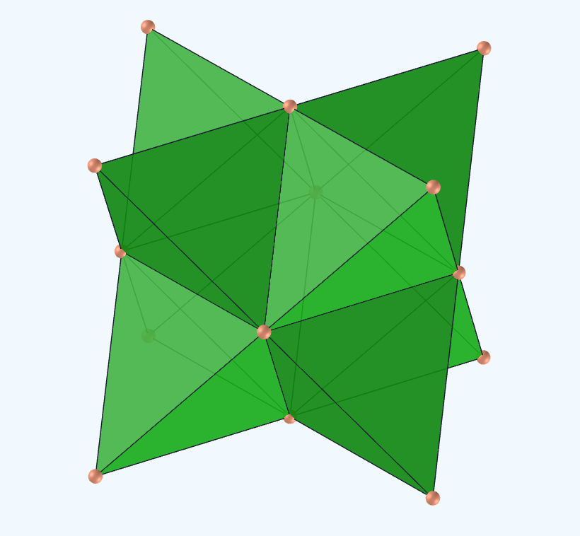</a>
  O octaedro estrelado é um poliedro composto por um tetraedro e seu dual (um segundo tetraedro girado 180 graus em relação ao primeiro). O octaedro estrelado também é (incorretamente) chamado de tetraedro estrelado e é a única estrela do octaedro. Uma versão "aramada" do octaedro estrelado às vezes é conhecida como merkaba e contém propriedades místicas.
  <b>Faces:</b> 8 triângulos equiláteros | <b>Arestas:</b> 12 | <b>Vértices:</b> 8 | <b>Ângulo diédrico:</b> 70,53°. <a href="https://mathworld.wolfram.com/StellaOctangula.html" target="_blank">Mais sobre...</a>
 

 <h4>4. Hexecontaedro rômbico</h4>
 <a href="../vr/rhombic_hexecontahedron.htm" target="_blank" title="modelo 3D" class="fotoA">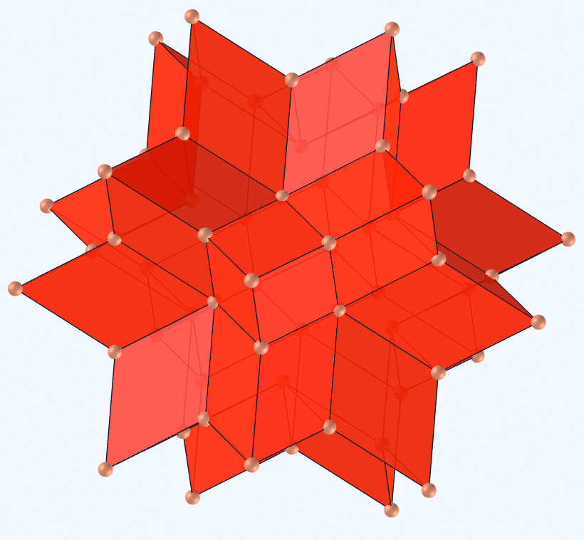</a>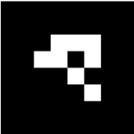
  O hexecontaedro rômbico é um poliedro de 60 faces que pode ser obtido estrelando o triacontaedro rômbico, colocando um plano ao longo de cada aresta que é perpendicular ao plano de simetria em que a aresta se encontra, e tomando o sólido limitado por esses planos resulta em um hexecontaedro. Portanto, trata-se de uma estrela rômbica de triacontaedro. Os losangos de suas faces possuem ângulos dos vértices com medidas iguais a 63,43° e 116,57°.
  <b>Faces:</b> 60 losangos | <b>Arestas:</b> 120 | <b>Vértices:</b> 62 | <b>Ângulos diédricos:</b> 72° e 216°. <a href="https://mathworld.wolfram.com/RhombicHexecontahedron.html" target="_blank">Mais sobre...</a>
 

 <h4>5. Dodecaedro côncavo</h4>
 <a href="../vr/concave_dodecahedron.htm" target="_blank" title="modelo 3D" class="fotoA">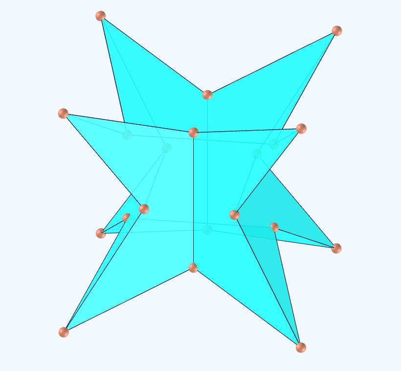</a>
  O endododecaedro, também chamado de dodecaedro piroédrico côncavo, é o sólido côncavo correspondente ao vazio interior formado quando cada face de um dodecaedro regular é dobrada ao longo de uma diagonal e as faces resultantes são desdobradas para formar um cubo. O endododecaedro com medida unitária de aresta corresponde à remoção de seis cunhas oblíquas de base quadrada de comprimento de aresta &phi; (onde &phi; é a proporção áurea), altura 1/2 e comprimento de crista 1/2 de um cubo de comprimento de aresta &phi;.
  <b>Faces:</b> 12 pentágonos simétricos côncavos | <b>Arestas:</b> 30 | <b>Vértices:</b> 20 | <b>Ângulos diédricos:</b> 63,43° e 243,43°. <a href="https://mathworld.wolfram.com/Endododecahedron.html" target="_blank">Mais sobre...</a>
 

 <h4>6. Icosaedro ortogonal de Jessen</h4>
 <a href="../vr/jessens_orthogonal_icosahedron.htm" target="_blank" title="modelo 3D" class="fotoA">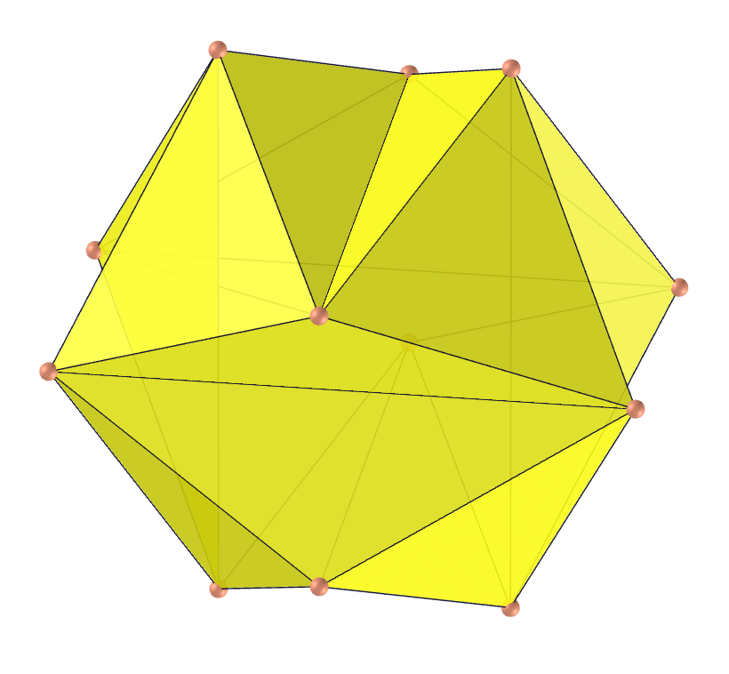</a>
  O icosaedro ortogonal de Jessen é um poliedro construído substituindo seis pares de triângulos adjacentes em um icosaedro (cujas arestas formam um quadrilátero oblíquo) por pares de triângulos isósceles compartilhando uma base comum. O poliedro pode ser construído dividindo os lados do octaedro na proporção áurea (como usado na construção do icosaedro ao longo das arestas do octaedro), mas invertendo os segmentos longo e curto. O esqueleto do icosaedro ortogonal de Jessen é o gráfico icosaédrico. Este poliedro têm 8 triângulos equiláteros e 12 triângulos isósceles (com ângulos de 109,47 e 35,26°).
  <b>Faces:</b> 20 triângulos | <b>Arestas:</b> 30 | <b>Vértices:</b> 12 | <b>Ângulos diédricos:</b> 90° e 270°. <a href="https://mathworld.wolfram.com/JessensOrthogonalIcosahedron.html" target="_blank">Mais sobre...</a>
 

 <h4>7. Pequeno dodecaedro estrelado</h4>
 <a href="../vr/small_stellated_dodecahedron.htm" target="_blank" title="modelo 3D" class="fotoA">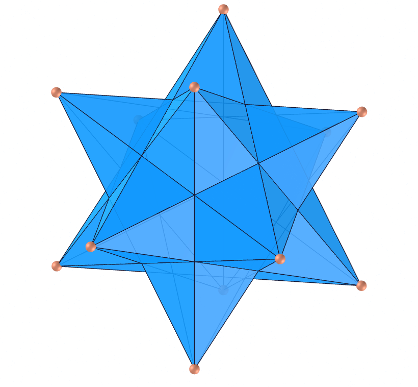</a>
  U34 O pequeno dodecaedro estrelado é o sólido de Kepler-Poinsot cujo poliedro dual é o grande dodecaedro. O pequeno dodecaedro estrelado apareceu em 1430 como um mosaico de Paolo Uccello no piso da Catedral de San Marco, Veneza. Foi redescoberto por Kepler (que usou o termo "urchin") em sua obra Harmonice Mundi em 1619, e novamente por Poinsot em 1809. As 12 faces em forma de pentagramas podem ser construídas a partir de um icosaedro encontrando os 12 conjuntos de cinco vértices que são coplanares e conectando cada conjunto para formar um pentagrama.
  <b>Faces:</b> 12 pentagramas regulares | <b>Arestas:</b> 30 | <b>Vértices:</b> 12 | <b>Ângulo diédrico:</b> 116,57°. <a href="https://mathworld.wolfram.com/SmallStellatedDodecahedron.html" target="_blank">Mais sobre...</a>
 

 <h4>8. Grande dodecaedro estrelado</h4>
 <a href="../vr/great_stellated_dodecahedron.htm" target="_blank" title="modelo 3D" class="fotoA">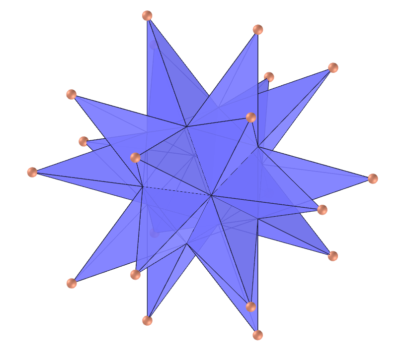</a>
  U52 O grande dodecaedro estrelado é um dos sólidos de Kepler-Poinsot, e seu dual é o grande icosaedro. O grande dodecaedro estrelado foi publicado por Wenzel Jamnitzer em 1568. Foi redescoberto por Kepler, e novamente por Poinsot em 1809. O grande dodecaedro estrelado pode ser construído a partir de um dodecaedro, selecionando os 144 conjuntos de cinco vértices coplanares, descartando conjuntos cujas arestas correspondem às arestas do dodecaedro original: o resultado é 12 pentagramas.
  <b>Faces:</b> 12 pentagramas regulares | <b>Arestas:</b> 30 | <b>Vértices:</b> 20 | <b>Ângulo diédrico:</b> 63,43°. <a href="https://mathworld.wolfram.com/GreatStellatedDodecahedron.html" target="_blank">Mais sobre...</a>
 

 <h4>9. Grande dodecaedro</h4>
 <a href="../vr/great_dodecahedron.htm" target="_blank" title="modelo 3D" class="fotoA">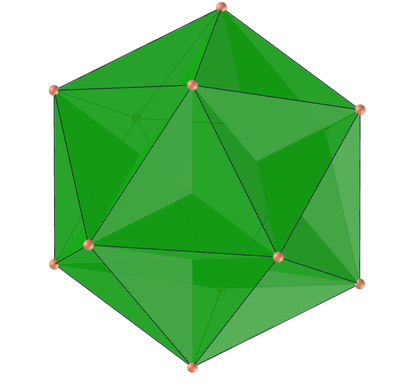</a>
  U35 O grande dodecaedro é o sólido de Kepler-Poinsot cujo dual é o pequeno dodecaedro estrelado. É côncavo e consiste em 12 faces pentagonais que se cruzam. As 12 faces pentagonais podem ser construídas a partir de um icosaedro encontrando os 12 conjuntos de cinco vértices que são coplanares e conectando cada conjunto para formar um pentágono. O esqueleto do grande dodecaedro é isomórfico ao gráfico icosaédrico.
  <b>Faces:</b> 12 pentágonos regulares | <b>Arestas:</b> 30 | <b>Vértices:</b> 12 | <b>Ângulo diédrico:</b> 63,43°. <a href="https://mathworld.wolfram.com/GreatDodecahedron.html" target="_blank">Mais sobre...</a>
 

 <h4>10. Grande icosaedro</h4>
 <a href="../vr/great_icosahedron.htm" target="_blank" title="modelo 3D" class="fotoA">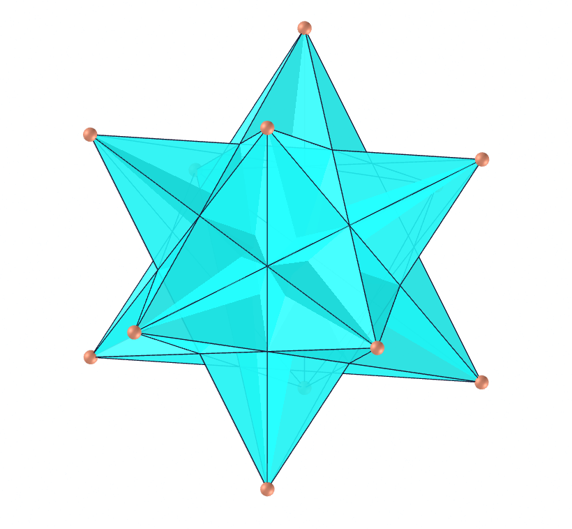</a>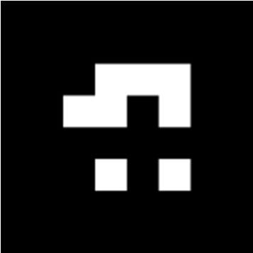
  U53 O grande icosaedro é um dos sólidos de Kepler-Poinsot cujo dual é o grande dodecaedro estrelado. O grande icosaedro pode ser construído a partir de um icosaedro com comprimentos de aresta unitários, tomando os 20 conjuntos de vértices que são mutuamente espaçados por uma distância &phi; (proporção áurea). O sólido, portanto, consiste em 20 triângulos equiláteros e a simetria de seu arranjo é tal que o sólido resultante contém 12 pentagramas.
  <b>Faces:</b> 20 triângulos equiláteros | <b>Arestas:</b> 30 | <b>Vértices:</b> 12 | <b>Ângulo diédrico:</b> 41,81°. <a href="https://mathworld.wolfram.com/GreatIcosahedron.html" target="_blank">Mais sobre...</a>

<a href="#p4" class="topo">voltar ao topo</a>

<h4>11. Pequeno dodecahemicosacron</h4>
 <a href="../vr/small_dodecahemicosahedron.htm" target="_blank" title="modelo 3D" class="fotoA">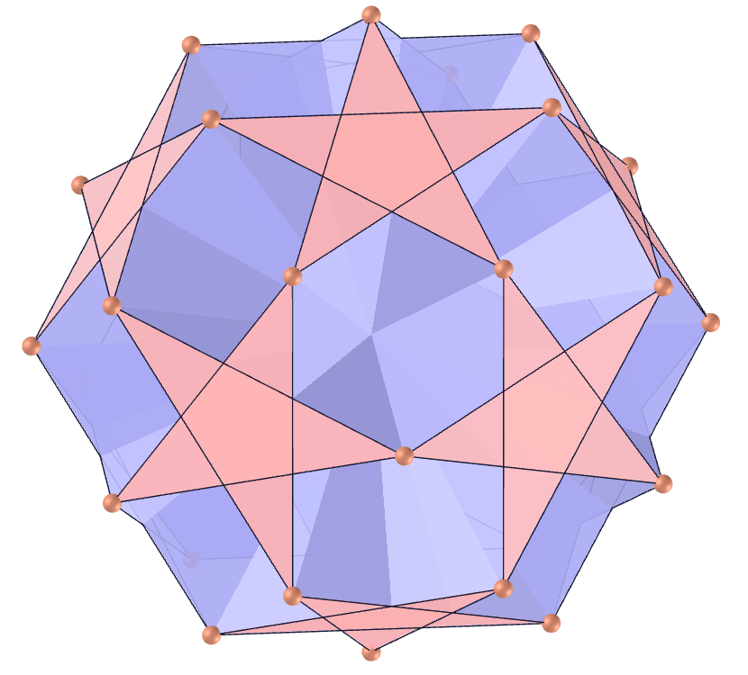</a>
  U62 O poliedro uniforme cujo poliedro dual é o pequeno dodecahemicosacron. É uma versão facetada do icosidodecaedro. É um hemipoliedro com dez faces hexagonais passando pelo centro do modelo.
  <b>Faces:</b> 12 pentagramas regulares e 10 hexágonos regulares | <b>Arestas:</b> 60 | <b>Vértices:</b> 30 | <b>Ângulo diédrico:</b> 79,19°. <a href="https://mathworld.wolfram.com/SmallDodecahemicosahedron.html" target="_blank">Mais sobre...</a>
 

<h4>12. Grande dodecahemidodecaedro</h4>
 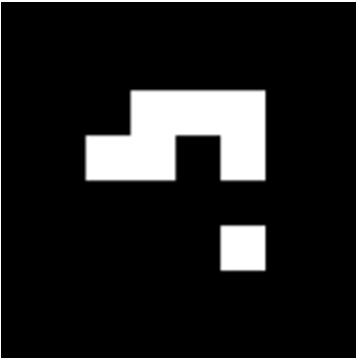
  U70 O grande dodecahemidodecaedro é um poliedro não convexo uniforme cuja figura de vértice é um quadrilátero cruzado e seu dual é o grande dodecahemidodecacron. Seu raio circunscrito para o comprimento da aresta igual a 1 é &phi;-1, onde &phi; é a proporção áurea. 
  <b>Faces:</b> 12 pentagramas regulares e 6 decagramas regulares | <b>Arestas:</b> 60 | <b>Vértices:</b> 30 | <b>Ângulo diédrico:</b> 63,43°. <a href="https://mathworld.wolfram.com/GreatDodecahemidodecahedron.html" target="_blank">Mais sobre...</a>
 

<h4>13. Grande dodecahemidodecaedro</h4>
 <a href="../vr/great_dodecahemicosahedron.htm" target="_blank" title="modelo 3D" class="fotoA">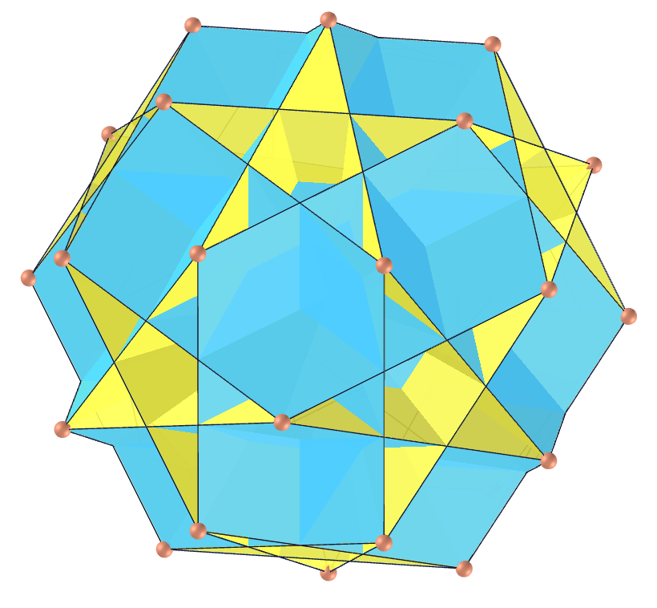</a>
  U62 O grande dodecahemicosaedro (ou pequeno dodecahemicoaedro) é um poliedro uniforme não convexo cuja figura de vértice é um quadrilátero cruzado. É um dodecadodecaedro facetado e o seu raio circunscrito para o comprimento unitário da aresta mede 2.
  <b>Faces:</b> 12 pentágonos regulares e 10 hexágonos regulares | <b>Arestas:</b> 60 | <b>Vértices:</b> 30 | <b>Ângulo diédrico:</b> 37,38°. <a href="https://mathworld.wolfram.com/GreatDodecahemicosahedron.html" target="_blank">Mais sobre...</a>
 

<h4>14. Pequeno dodecahemidodecaedro</h4>
 <a href="../vr/small_dodecahemidodecahedron.htm" target="_blank" title="modelo 3D" class="fotoA">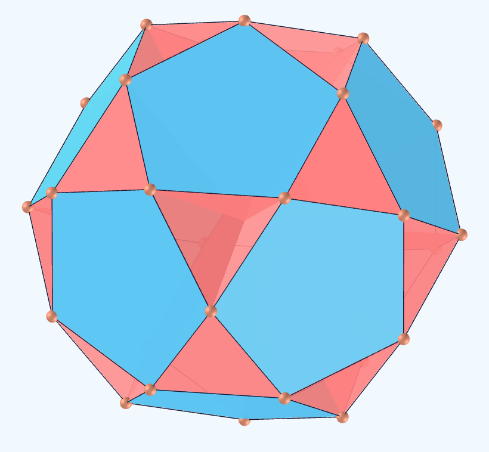</a>
  U51 O pequeno dodecahemidodecaedro é um poliedro uniforme não convexo cujo poliedro dual é o pequeno dodecahemidodecacron. Seu raio circunscrito para o comprimento unitário de aresta é R=&phi;, onde &phi; é a proporção áurea.
  <b>Faces:</b> 12 pentágonos regulares e 10 decágonos regulares | <b>Arestas:</b> 60 | <b>Vértices:</b> 30 | <b>Ângulo diédrico:</b> 63,43°. <a href="https://mathworld.wolfram.com/SmallDodecahemidodecahedron.html" target="_blank">Mais sobre...</a>
 

<h4>15. Grande icosihemidodecaedro</h4>
 
  U71 O grande icosihemidodecaedro é um poliedro uniforme não convexo cujo dual é o grande icosihemidodecacron. Seu raio circunscrito para o comprimento unitário de aresta é R=&phi;-1, onde &phi; é a proporção áurea.
  <b>Faces:</b> 20 triângulos equiláteros e 6 decagramas | <b>Arestas:</b> 60 | <b>Vértices:</b> 30 | <b>Ângulo diédrico:</b> 37,38°. <a href="https://mathworld.wolfram.com/GreatIcosihemidodecahedron.html" target="_blank">Mais sobre...</a>
 

<h4>16. Pequeno icosihemidodecaedro</h4>
 <a href="../vr/small_icosihemidodecahedron.htm" target="_blank" title="modelo 3D" class="fotoA">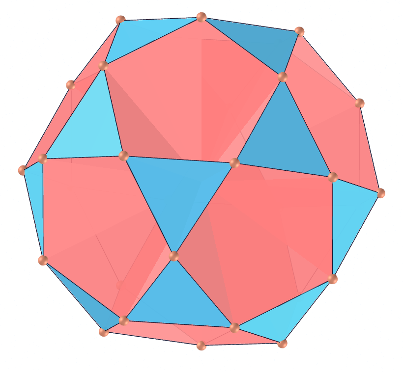</a>
  U49 O pequeno icosihemidodecaedro é um poliedro uniforme não convexo cujo poliedro dual é o pequeno icosihemidodecacron. É uma versão facetada do icosidodecaedro.
  <b>Faces:</b> 20 triângulos equiláteros e 6 decágonos | <b>Arestas:</b> 60 | <b>Vértices:</b> 30 | <b>Ângulo diédrico:</b> 79,19°. <a href="https://mathworld.wolfram.com/SmallIcosihemidodecahedron.html" target="_blank">Mais sobre...</a>
 

<h4>17. Octatetraedro</h4>
 <a href="../vr/octahemioctahedron.htm" target="_blank" title="modelo 3D" class="fotoA">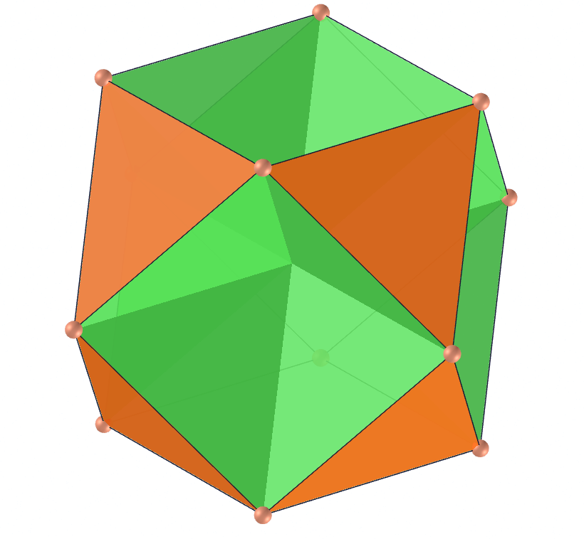</a>
  U3 O octatetraedro é um poliedro uniforme não convexo cujo poliedro dual é o octahemioctacron. É um cuboctaedro facetado. Seu raio circunscrito para o comprimento unitário de aresta é R=1.
  <b>Faces:</b> 8 triângulos equiláteros e 4 hexágonos | <b>Arestas:</b> 24 | <b>Vértices:</b> 12 | <b>Ângulo diédrico:</b> 70,53°. <a href="https://mathworld.wolfram.com/Octahemioctahedron.html" target="_blank">Mais sobre...</a>
 

<h4>18. Tetrahemihexaedro</h4>
 <a href="../vr/tetrahemihexahedron.htm" target="_blank" title="modelo 3D" class="fotoA">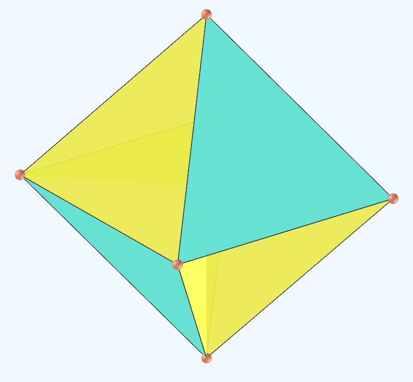</a>
  U4 O tetrahemihexaedro é um poliedro uniforme não convexo cujo poliedro dual é o tetrahemihexacron. É uma forma facetada do octaedro. É o único poliedro uniforme não prismático com um número ímpar de faces.
  <b>Faces:</b> 4 triângulos equiláteros e 3 quadrados | <b>Arestas:</b> 12 | <b>Vértices:</b> 6 | <b>Ângulo diédrico:</b> 54,74°. <a href="https://mathworld.wolfram.com/Tetrahemihexahedron.html" target="_blank">Mais sobre...</a>
 

<h4>19. Cubohemioctaedro</h4>
 <a href="../vr/cubohemioctahedron.htm" target="_blank" title="modelo 3D" class="fotoA">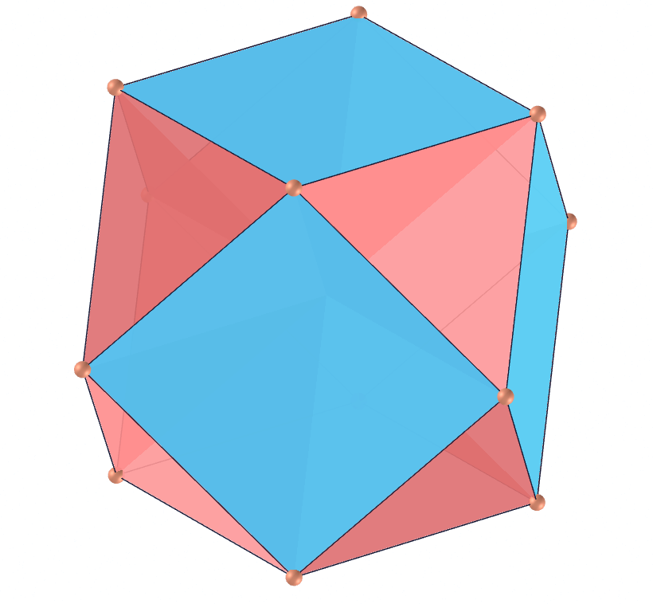</a>
  U15 O cubohemioctaedro é um poliedro uniforme não convexo cujo dual é o hexahemioctacron. É uma versão facetada do cuboctaedro. Seu raio circunscrito para o comprimento unitário de aresta é R=1.
   <b>Faces:</b> 6 quadrados e 4 hexágonos regulares | <b>Arestas:</b> 24 | <b>Vértices:</b> 12 | <b>Ângulo diédrico:</b> 54,74°. <a href="https://mathworld.wolfram.com/Cubohemioctahedron.html" target="_blank">Mais sobre...</a>

<h4>20. Deltaedro de Möbius de 24 faces</h4>
 <a href="../vr/mobius24.htm" target="_blank" title="modelo 3D" class="fotoA">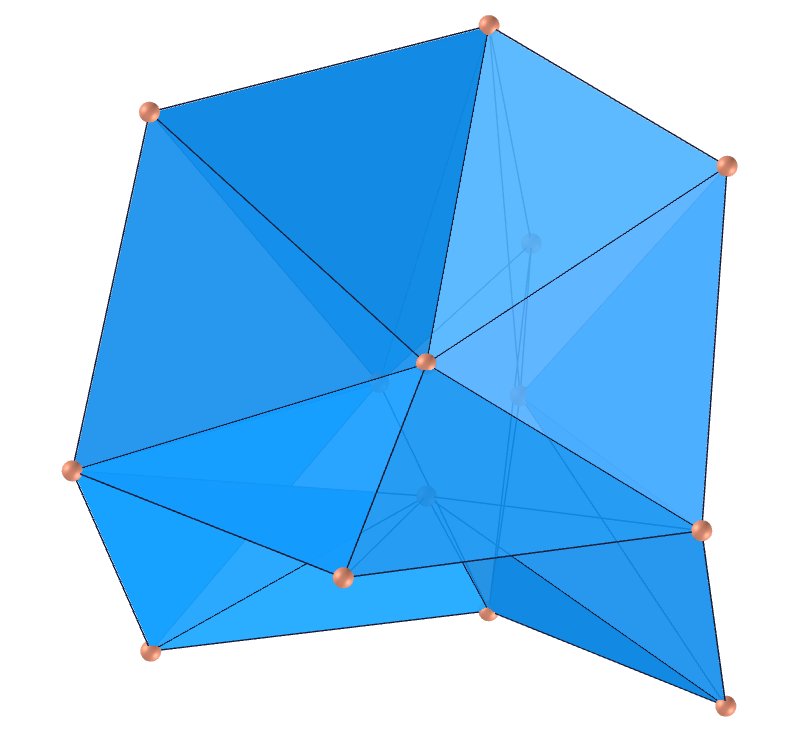</a>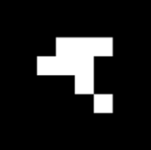
  Um deltaedro é um poliedro com faces que são todos triângulos equiláteros. Existem cinco deltaedros acópticos para os quais cada aresta está em um plano de simetria. Triângulos de Möbius são aqueles que ocorrem na superfície de uma esfera dividida em seus planos de simetria. Os deltaedros de Möbius são simplesmente isômeros das versões do triângulo de Möbius do tetraedro (24 faces), cubo e dodecaedro.
  <b>Faces:</b> 24 triângulos equiláteros | <b>Arestas:</b> 36 | <b>Vértices:</b> 14 | <b>Ângulos diédricos:</b> 334.15°, 193.09° e 131.81°. <a href="https://www.interocitors.com/polyhedra/Deltahedra/Mobius/index.html" target="_blank">Mais sobre...</a>
 
<a href="#p4" class="topo">voltar ao topo</a>

<h4>21. Dual do Deltaedro de Möbius de 24 faces</h4>
 <a href="../vr/mobius24_dual.htm" target="_blank" title="modelo 3D" class="fotoA">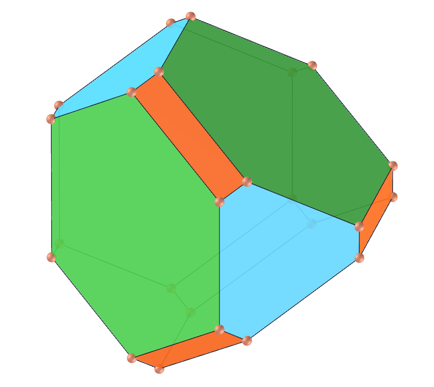</a>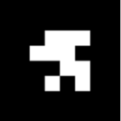
  O dual do deltaedro de Möbius de 24 faces foi modelado pelo autor desta página (Paulo Henrique Siqueira) utilizando as coordenadas dos vértices e as respectivas arestas do deltaedro de Möbius. 
  <b>Faces:</b> 8 hexágonos e 6 retângulos | <b>Arestas:</b> 36 | <b>Vértices:</b> 24 | <b>Ângulos diédricos:</b> 125.25° e 109.47°. <a href="https://www.interocitors.com/polyhedra/Deltahedra/Mobius/index.html" target="_blank">Mais sobre...</a>

<h4>22. Hexaedro Octakis de Möbius</h4>
 <a href="../vr/mobius48a.htm" target="_blank" title="modelo 3D" class="fotoA">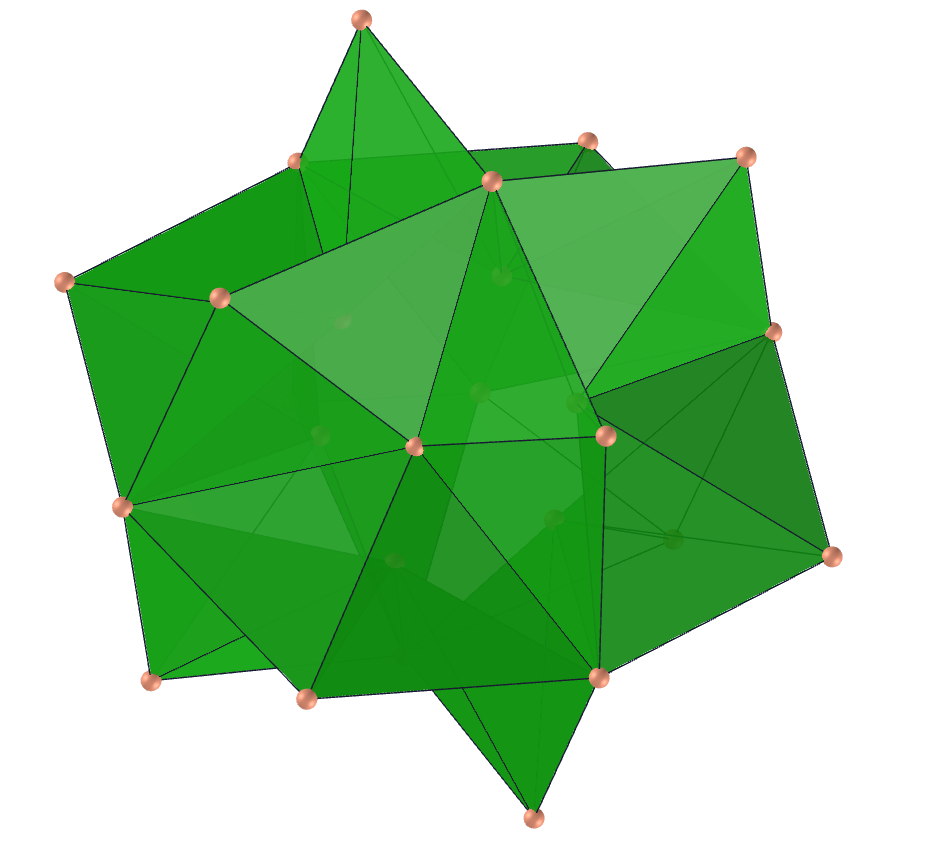</a>
  O Hexaedro Octakis é um deltaedro de Möbius com 48 faces derivado do cubo e do triacontaedro rômbico medial. É um dos cinco deltaedros que possuem cada aresta em um plano de simetria.
  <b>Faces:</b> 48 triângulos equiláteros | <b>Arestas:</b> 72 | <b>Vértices:</b> 26 | <b>Ângulos diédricos:</b> 319.8°, 203.74° e 105.16°. <a href="https://www.interocitors.com/polyhedra/Deltahedra/Mobius/index.html" target="_blank">Mais sobre...</a>

<h4>23. Dual do Hexaedro Octakis de Möbius</h4>
 <a href="../vr/mobius48a_dual.htm" target="_blank" title="modelo 3D" class="fotoA">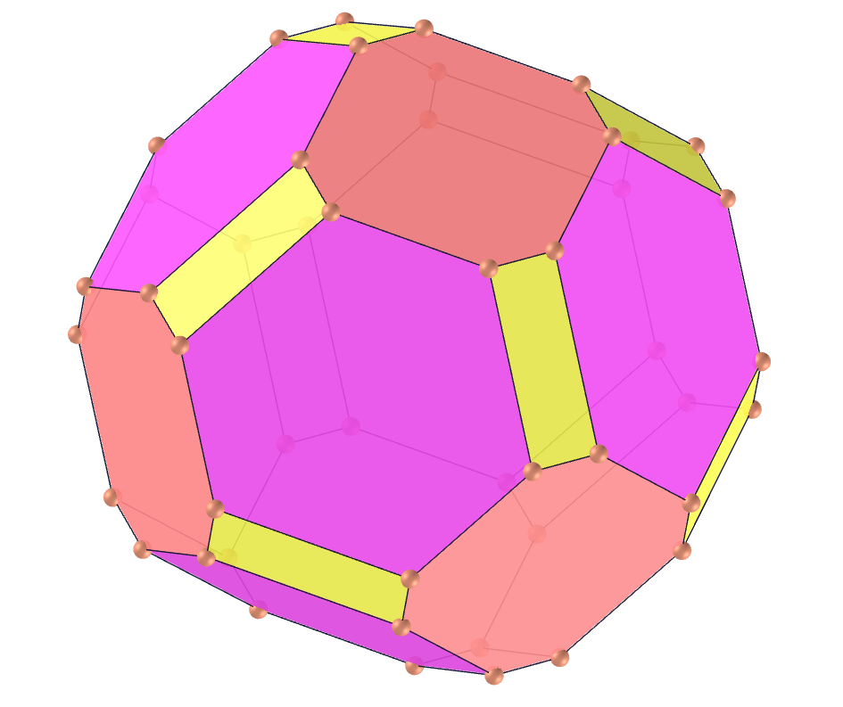</a>
  O dual do hexaedro octakis de Möbius foi modelado pelo autor desta página (Paulo Henrique Siqueira) utilizando as coordenadas dos vértices e as respectivas arestas do hexaedro octakis de Möbius.
  <b>Faces:</b> 6 octógonos, 8 hexágonos e 12 retângulos | <b>Arestas:</b> 72 | <b>Vértices:</b> 48 | <b>Ângulos diédricos:</b> 144,74°, 125.19° e 135°. <a href="https://www.interocitors.com/polyhedra/Deltahedra/Mobius/index.html" target="_blank">Mais sobre...</a>
 

<h4>24. Octaedro Hexakis de Möbius</h4>
 <a href="../vr/mobius48b.htm" target="_blank" title="modelo 3D" class="fotoA">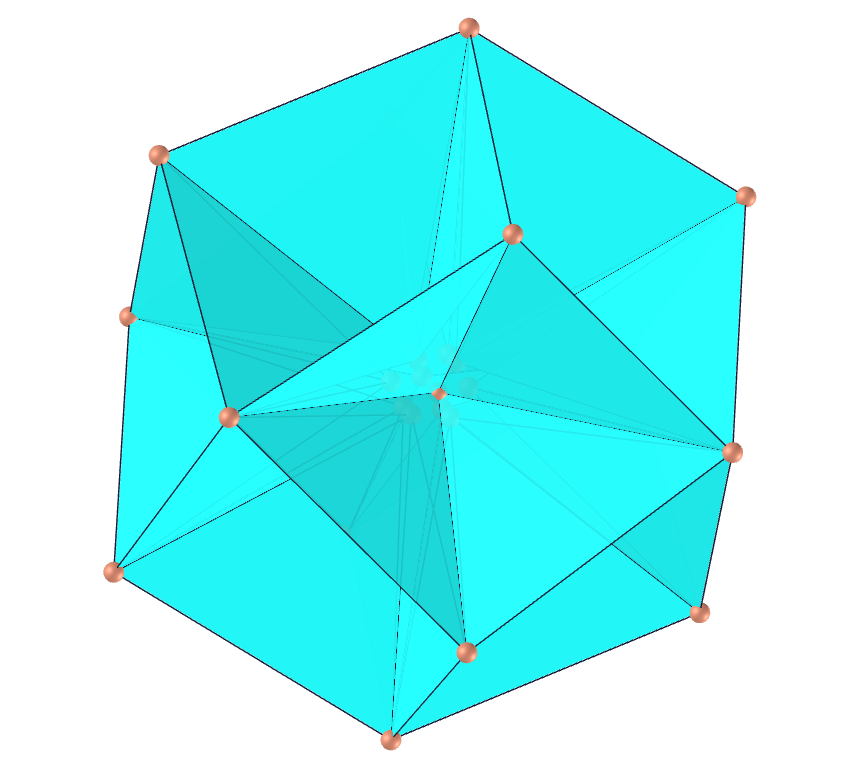</a>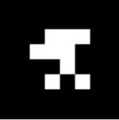
  O Octaedro Hexakis é um deltaedro de Möbius com 48 faces derivado do cubo e do triacontaedro rômbico medial. É um dos cinco deltaedros que possuem cada aresta em um plano de simetria.
  <b>Faces:</b> 48 triângulos equiláteros | <b>Arestas:</b> 72 | <b>Vértices:</b> 26 | <b>Ângulos diédricos:</b> 352.13°, 123.82° e 93.74°. <a href="https://www.interocitors.com/polyhedra/Deltahedra/Mobius/index.html" target="_blank">Mais sobre...</a>

<h4>25. Icosaedro Hexakis de Möbius</h4>
 <a href="../vr/mobius120a.htm" target="_blank" title="modelo 3D" class="fotoA">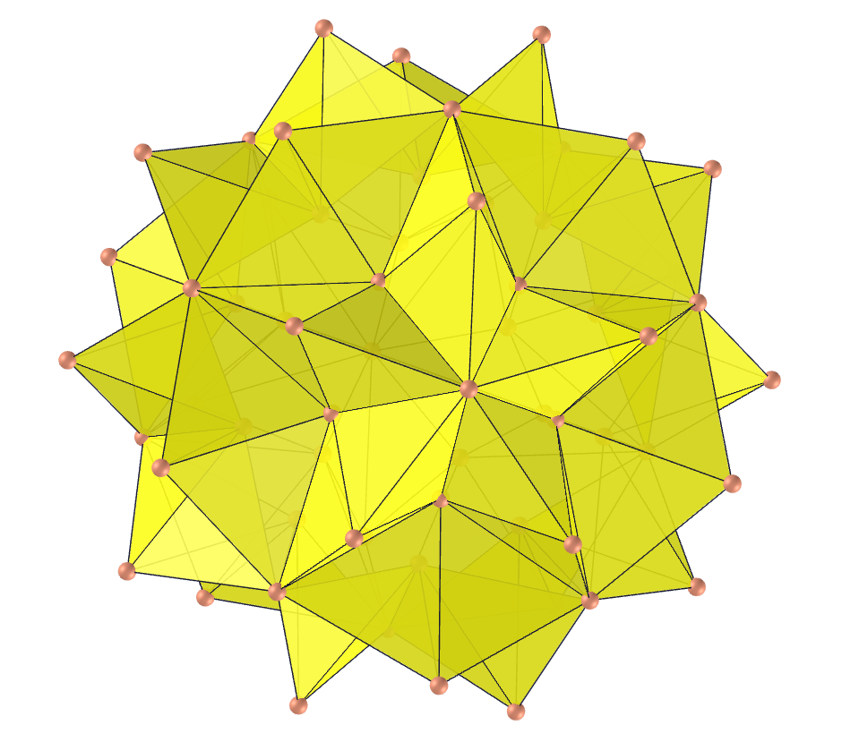</a>
  O Icosaedro Hexakis é um deltaedro de Möbius com 120 faces derivado do icosaedro e do grande triacontaedro rômbico. É um dos cinco deltaedros que têm cada borda em um plano de simetria.
  <b>Faces:</b> 120 triângulos equiláteros | <b>Arestas:</b> 180 | <b>Vértices:</b> 62 | <b>Ângulos diédricos:</b> 282.71°, 206.75° e 85.47°. <a href="https://www.interocitors.com/polyhedra/Deltahedra/Mobius/index.html" target="_blank">Mais sobre...</a>

<h4>26. Dodecaedro 10-akis de Möbius</h4>
 
  O Dodecaedro 10-akis é um deltaedro de Möbius com 120 faces derivado do dodecaedro e do grande triacontaedro rômbico. É um dos cinco deltaedros que têm cada borda em um plano de simetria.
  <b>Faces:</b> 120 triângulos equiláteros | <b>Arestas:</b> 180 | <b>Vértices:</b> 62 | <b>Ângulos diédricos:</b> 332.16°, 132.64° e 82.51°. <a href="https://www.interocitors.com/polyhedra/Deltahedra/Mobius/index.html" target="_blank">Mais sobre...</a>

<a href="#p4" class="topo">voltar ao topo</a>

  
Poliedros de auto-interseção

  Os poliedros de auto-interseção podem ter faces auto-interseccionadas ou figuras de vértices auto-interseccionados. Para visualizar os poliedros de auto-interseção em RA, visite a página:

<a href="../selfintersect.html" target="_blank">https://paulohscwb.github.io/polyhedra/selfintersect.html</a>
 
com qualquer navegador com um dispositivo de webcam (smartphone, tablet ou notebook).
 O acesso às páginas de RV é feito clicando no círculo azul que aparece em cima de cada marcador.

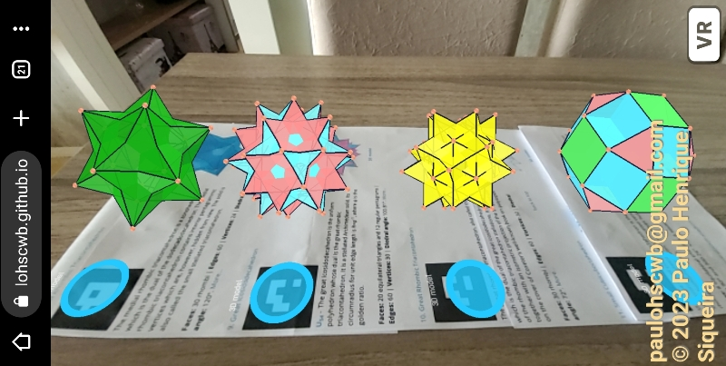

 

<h4>1. Dodecaedro ditrigonal</h4>
 <a href="../vr/ditrigonal_dodecadodecahedron.htm" target="_blank" title="modelo 3D" class="fotoA">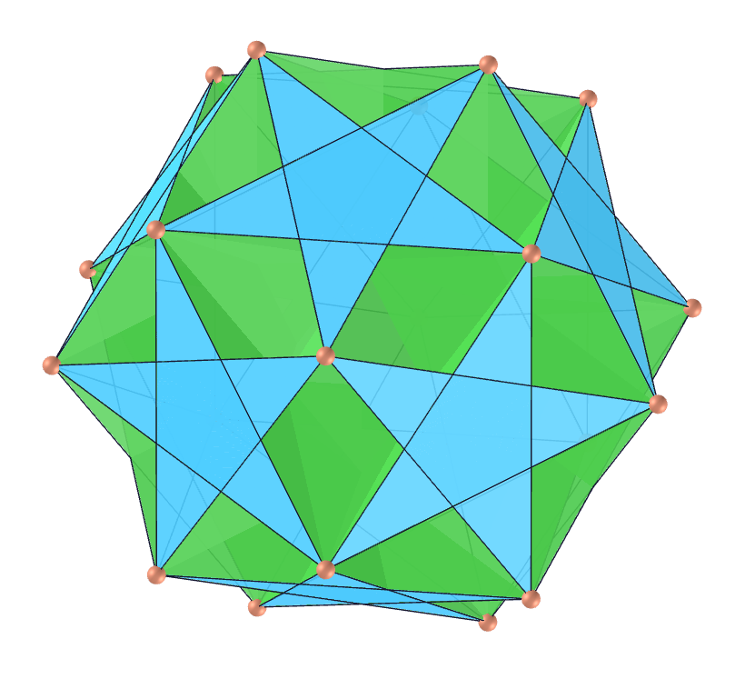</a>
  U41 O dodecaedro ditrigonal (ou dodecadodecaedro ditrigonário) é um poliedro uniforme não convexo cujo dual é o icosaedro triâmbico medial. É uma versão facetada do pequeno icosidodecaedro ditrigonal.
  <b>Faces:</b> 12 pentágonos regulares e 12 pentagramas regulares | <b>Arestas:</b> 60 | <b>Vértices:</b> 20 | <b>Ângulo diédrico:</b> 63,43°. <a href="https://mathworld.wolfram.com/DitrigonalDodecadodecahedron.html" target="_blank">Mais sobre...</a>
 

<h4>2. Icosaedro triâmbico medial</h4>
 <a href="../vr/medial_triambic_icosahedron.htm" target="_blank" title="modelo 3D" class="fotoA">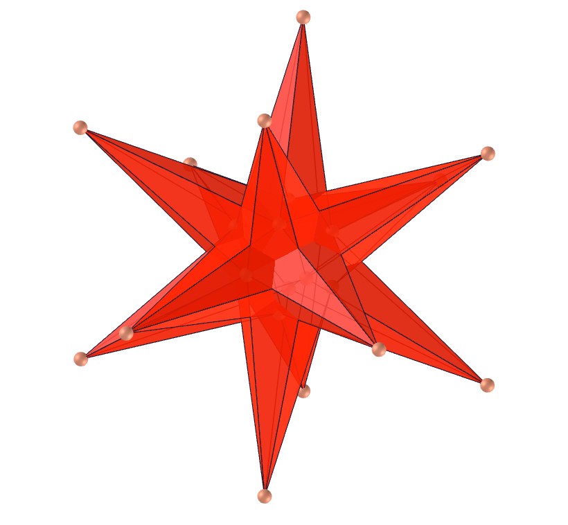</a>
  O icosaedro triâmbico medial é o poliedro dual do dodecadodecaedro ditrigonal cuja aparência externa é a mesma do grande icosaedro triâmbico (o dual do grande icosidodecaedro ditrigonal), pois os vértices internos estão ocultos. O icosaedro triâmbico medial tem faces pentagramas ocultas, enquanto o grande icosaedro triâmbico tem faces triangulares ocultas.
  <b>Faces:</b> 20 triambis | <b>Arestas:</b> 60 | <b>Vértices:</b> 24 | <b>Ângulo diédrico:</b> 109,47°. <a href="https://mathworld.wolfram.com/MedialTriambicIcosahedron.html" target="_blank">Mais sobre...</a>
 

<h4>3. Pequeno icosidodecaedro ditrigonal</h4>
 <a href="../vr/small_ditrigonal_icosidodecahedron.htm" target="_blank" title="modelo 3D" class="fotoA">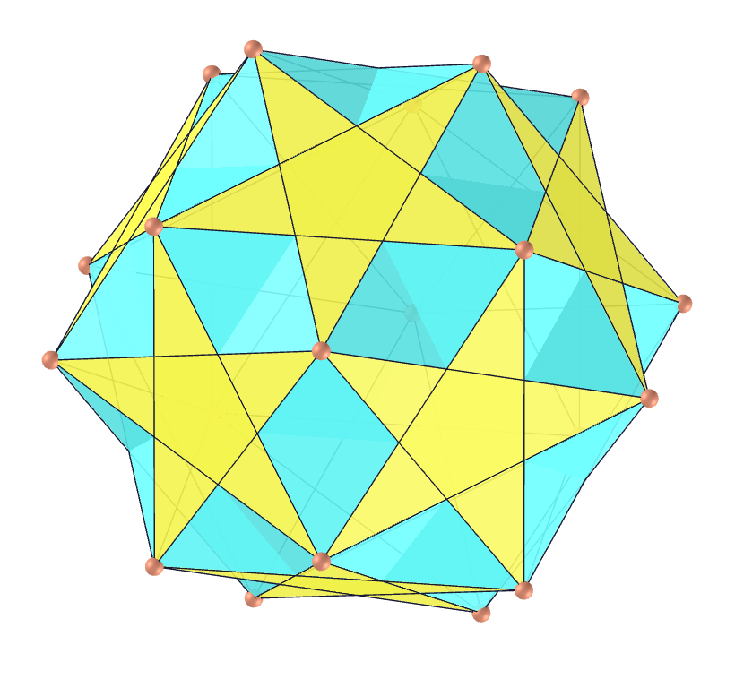</a>
  U30 O pequeno icosidodecaedro ditrigonal é um poliedro uniforme não convexo cujo poliedro dual é o pequeno icosaedro triâmbico. Uma versão facetada é o dodecadodecaedro ditrigonal. O casco convexo do pequeno icosidodecaedro ditrigonal é um dodecaedro regular, cujo dual é o icosaedro, então o dual do grande dodecicosidodecaedro ditrigonal (o pequeno icosaedro triâmbico) é uma das estrelas do icosaedro.
  <b>Faces:</b> 20 triângulos equiláteros e 12 pentagramas regulares | <b>Arestas:</b> 60 | <b>Vértices:</b> 20 | <b>Ângulo diédrico:</b> 142,62°. <a href="https://mathworld.wolfram.com/SmallDitrigonalIcosidodecahedron.html" target="_blank">Mais sobre...</a>
 

<h4>4. Pequeno icosaedro triâmbico</h4>
 <a href="../vr/small_triambic_icosahedron.htm" target="_blank" title="modelo 3D" class="fotoA">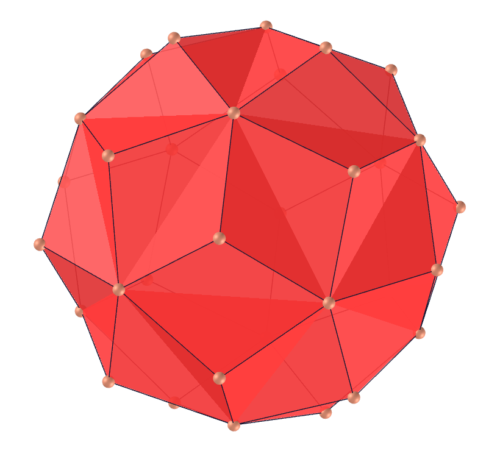</a>
  O pequeno icosaedro triâmbico é o poliedro dual do pequeno icosidodecaedro ditrigonal. Ele pode ser construído pelo aumento de um icosaedro de comprimento de aresta unitário por uma pirâmide. O casco convexo do pequeno icosidodecaedro ditrigonal é um dodecaedro regular cujo dual é o icosaedro, então o dual do pequeno icosidodecaedro ditrigonal (ou seja, o pequeno icosaedro triâmbico) é uma das estrelas do icosaedro.
  <b>Faces:</b> 20 pentágonos | <b>Arestas:</b> 60 | <b>Vértices:</b> 32 | <b>Ângulo diédrico:</b> 109,47°. <a href="https://mathworld.wolfram.com/SmallTriambicIcosahedron.html" target="_blank">Mais sobre...</a>
 

<h4>5. Grande icosidodecaedro ditrigonal</h4>
 <a href="../vr/great_ditrigonal_icosidodecahedron.htm" target="_blank" title="modelo 3D" class="fotoA">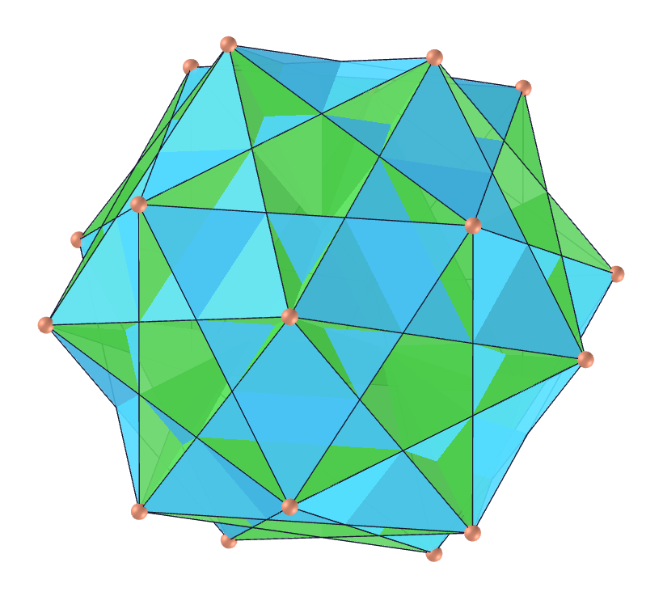</a>
  U47 O grande icosidodecaedro ditrigonal é o poliedro uniforme cujo dual é o grande icosaedro triâmbico. O casco convexo do grande icosaedro triâmbico é um dodecaedro regular, cujo dual é o icosaedro, de modo que o dual do grande icosidodecaedro ditrigonal (o grande icosaedro triâmbico) é uma das estrelas do icosaedro.
  <b>Faces:</b> 20 triângulos equiláteros e 12 pentágonos regulares | <b>Arestas:</b> 60 | <b>Vértices:</b> 20 | <b>Ângulo diédrico:</b> 79,19°. <a href="https://mathworld.wolfram.com/GreatDitrigonalIcosidodecahedron.html" target="_blank">Mais sobre...</a>
 

<h4>6. Grande icosaedro triâmbico</h4>
 <a href="../vr/great_triambic_icosahedron.htm" target="_blank" title="modelo 3D" class="fotoA">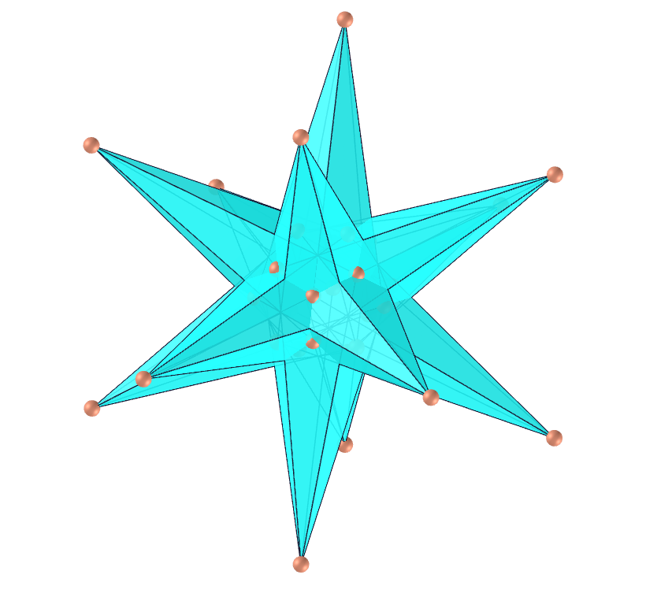</a>
  O grande icosaedro triâmbico é o dual do grande icosidodecaedro ditrigonal cuja aparência é a mesma do icosaedro triâmbico medial (o dual do dodecadodecaedro ditrigonal), pois os vértices internos estão ocultos. O icosaedro triâmbico medial tem faces pentagramas ocultas, enquanto o grande icosaedro triâmbico tem faces triangulares ocultas.
  <b>Faces:</b> 20 triambis | <b>Arestas:</b> 60 | <b>Vértices:</b> 32 | <b>Ângulo diédrico:</b> 109,47°. <a href="https://mathworld.wolfram.com/GreatTriambicIcosahedron.html" target="_blank">Mais sobre...</a>
 

<h4>7. Dodecadodecaedro</h4>
 <a href="../vr/dodecadodecahedron.htm" target="_blank" title="modelo 3D" class="fotoA">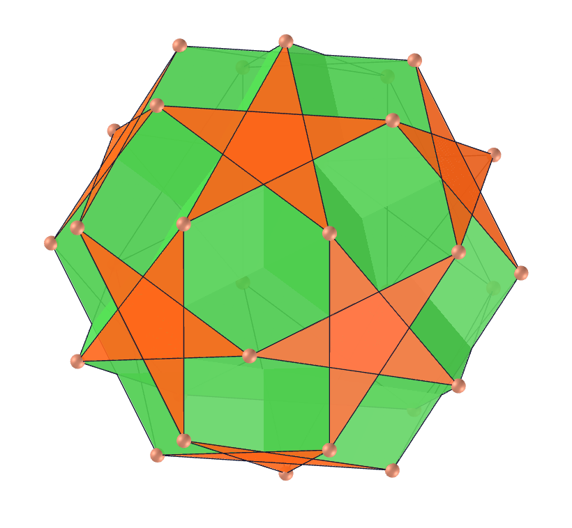</a>
  U36 O dodecadodecaedro é o poliedro uniforme cujo poliedro dual é o triacontaedro rômbico medial. Seu poliedro dual também é chamado de pequeno triacontaedro estrelado. Pode ser obtido truncando um grande dodecaedro ou facetando um icosidodecaedro com pentágonos e cobrindo os espaços abertos restantes com pentagramas.
  <b>Faces:</b> 12 pentágonos regulares e 12 pentagramas regulares | <b>Arestas:</b> 60 | <b>Vértices:</b> 30 | <b>Ângulo diédrico:</b> 116,57°. <a href="https://mathworld.wolfram.com/Dodecadodecahedron.html" target="_blank">Mais sobre...</a>
 

<h4>8. Triacontaedro rômbico medial</h4>
 <a href="../vr/medial_rhombic_triacontahedron.htm" target="_blank" title="modelo 3D" class="fotoA">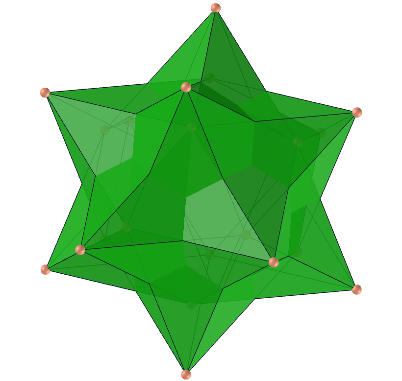</a>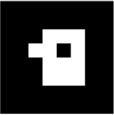
  O triacontaedro rômbico medial é um zonoedro que é o dual do dodecadodecaedro. O triacontaedro rômbico medial contém vértices pentagramas interiores que, no entanto, estão ocultos. O sólido também é chamado de pequeno triacontaedro estrelado.
  <b>Faces:</b> 30 losangos | <b>Arestas:</b> 60 | <b>Vértices:</b> 24 | <b>Ângulo diédrico:</b> 120°. <a href="https://mathworld.wolfram.com/MedialRhombicTriacontahedron.html" target="_blank">Mais sobre...</a>
 

<h4>9. Grande icosidodecaedro</h4>
 <a href="../vr/great_icosidodecahedron.htm" target="_blank" title="modelo 3D" class="fotoA">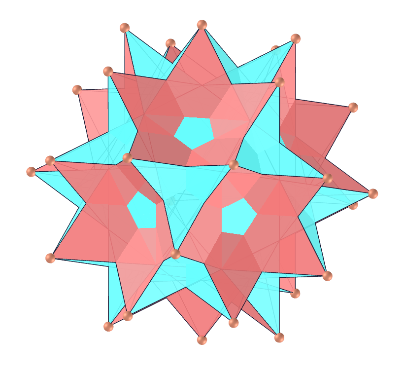</a>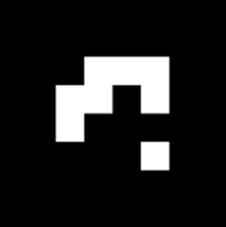
  U54 O grande icosidodecaedro é o poliedro uniforme cujo dual é o grande triacontaedro rômbico. É um sólido de Arquimedes estrelado. Seu raio circunscrito para o comprimento unitário da aresta mede R=&phi;-1, onde &phi; é a proporção áurea.
  <b>Faces:</b> 20 triângulos equiláteros e 12 pentagramas regulares | <b>Arestas:</b> 60 | <b>Vértices:</b> 30 | <b>Ângulo diédrico:</b> 100,81°. <a href="https://mathworld.wolfram.com/GreatIcosidodecahedron.html" target="_blank">Mais sobre...</a>
 

<h4>10. Grande triacontaedro rômbico</h4>
 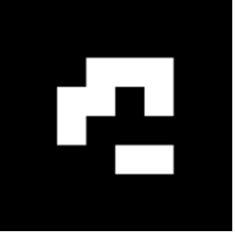
  O grande triacontaedro rômbico, também chamado de grande triacontaedro estrelado, é um zonoedro que é o dual do grande icosidodecaedro. É uma das estrelas rômbicas de triacontaedro. Aparece junto com uma projeção isométrica do 5-hipercubo na capa do conhecido livro de Coxeter sobre politopos.
  <b>Faces:</b> 30 losangos | <b>Arestas:</b> 60 | <b>Vértices:</b> 32 | <b>Ângulo diédrico:</b> 72°. <a href="https://mathworld.wolfram.com/GreatRhombicTriacontahedron.html" target="_blank">Mais sobre...</a>
 
<a href="#p5" class="topo">voltar ao topo</a>

 

 <h4>11. Pequeno cubicuboctaedro</h4>
 <a href="../vr/small_cubicuboctahedron.htm" target="_blank" title="modelo 3D" class="fotoA">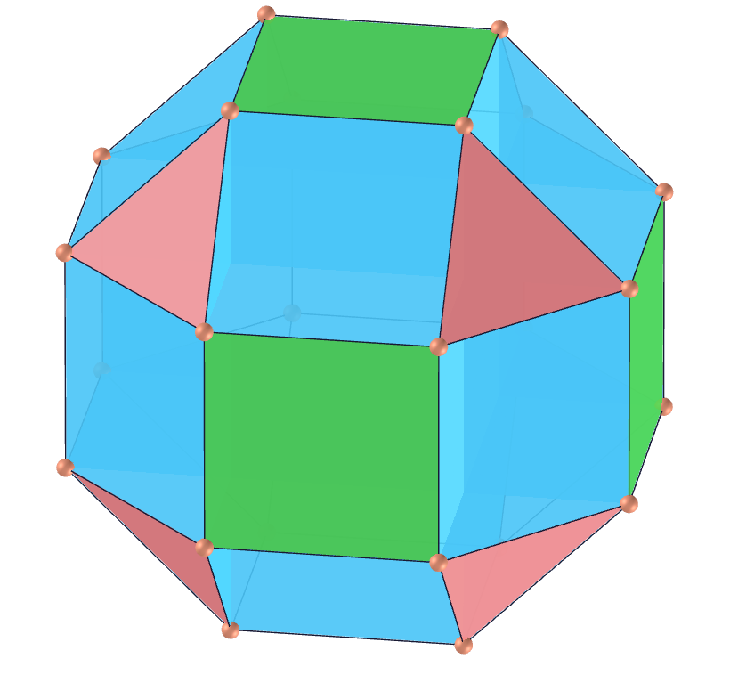</a>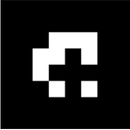
  U13 O pequeno cubicuboctaedro é o poliedro uniforme cujo poliedro dual é o pequeno icositetraedro hexacrônico. Versões facetadas incluem o grande rombicuboctaedro uniforme e o pequeno rhombihexaedro. O casco convexo do pequeno cubicuboctaedro é o pequeno rombicuboctaedro de Arquimedes.
  <b>Faces:</b> 8 triângulos equiláteros, 6 quadrados e 6 octógonos regulares | <b>Arestas:</b> 48 | <b>Vértices:</b> 24 | <b>Ângulos diédricos:</b> 90° e 300,26°. <a href="https://mathworld.wolfram.com/SmallCubicuboctahedron.html" target="_blank">Mais sobre...</a>
 

 <h4>12. Pequeno icositetraedro hexacrônico</h4>
 <a href="../vr/small_hexacronic_icositetrahedron.htm" target="_blank" title="modelo 3D" class="fotoA">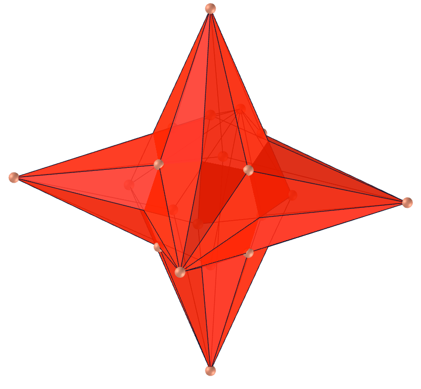</a>
  O pequeno icositetraedro hexacrônico é o poliedro uniforme dual do pequeno cubicuboctaedro. Parece o mesmo que o pequeno rhombihexacron. Uma parte de cada dardo fica dentro do sólido, portanto, é invisível em modelos sólidos.
  <b>Faces:</b> 24 dardos | <b>Arestas:</b> 48 | <b>Vértices:</b> 20 | <b>Ângulo diédrico:</b> 138,12°. <a href="https://en.wikipedia.org/wiki/Small_hexacronic_icositetrahedron" target="_blank">Mais sobre...</a>

 <h4>13. Grande cubicuboctaedro</h4>
 <a href="../vr/great_cubicuboctahedron.htm" target="_blank" title="modelo 3D" class="fotoA">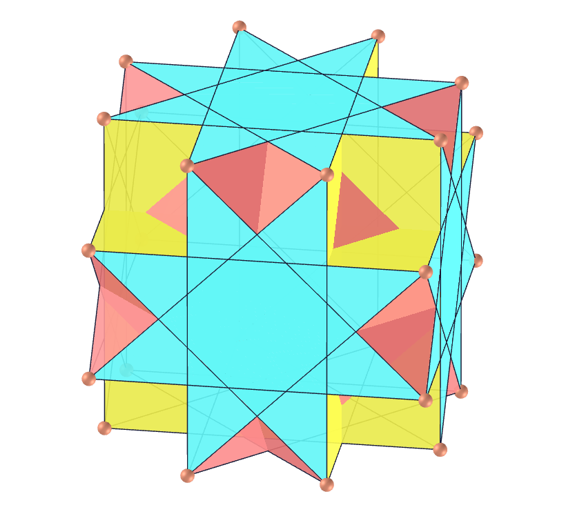</a>
  U14 O grande cubicuboctaedro é o poliedro uniforme cujo poliedro dual é o grande icositetraedro hexacrônico. É uma versão facetada do cubo. O casco convexo do grande cubicuboctaedro é o cubo truncado de Arquimedes.
  <b>Faces:</b> 8 triângulos equiláteros, 6 quadrados e 6 octagramas regulares | <b>Arestas:</b> 48 | <b>Vértices:</b> 24 | <b>Ângulos diédricos:</b> 90° e 125,26°. <a href="https://mathworld.wolfram.com/GreatCubicuboctahedron.html" target="_blank">Mais sobre...</a>
 

 <h4>14. Grande icositetraedro hexacrônico</h4>
 <a href="../vr/great_hexacronic_icositetrahedron.htm" target="_blank" title="modelo 3D" class="fotoA">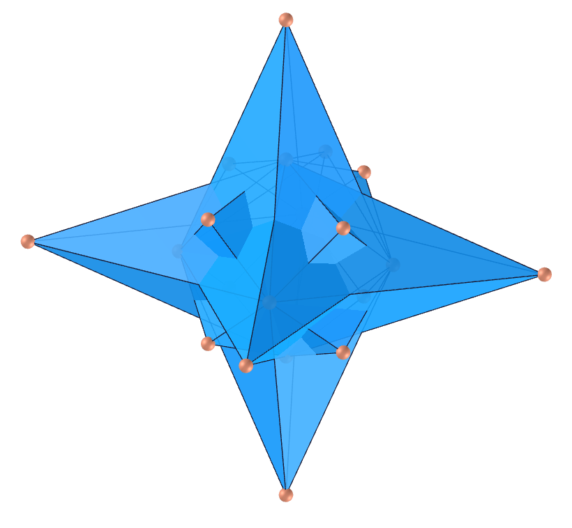</a>
  O grande icositetraedro hexacrônico é o dual do grande cubicuboctaedro. Suas faces são "pipas", e parte de cada "pipa" fica dentro do sólido, portanto é invisível em modelos sólidos.
  <b>Faces:</b> 24 "pipas" | <b>Arestas:</b> 48 | <b>Vértices:</b> 20 | <b>Ângulo diédrico:</b> 94,53°. <a href="https://en.wikipedia.org/wiki/Great_hexacronic_icositetrahedron" target="_blank">Mais sobre...</a>

 <h4>15. Grande rombicuboctaedro uniforme</h4>
 <a href="../vr/uniform_great_rhombicuboctahedron.htm" target="_blank" title="modelo 3D" class="fotoA">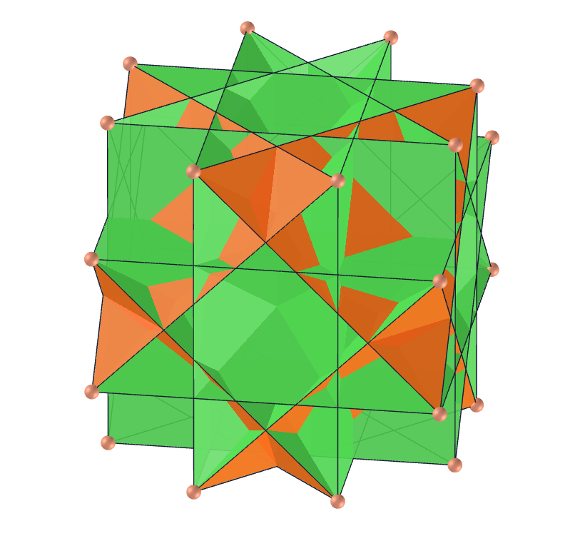</a>
  U17 O grande rombicuboctaedro uniforme é o poliedro uniforme, também conhecido como quase-rhombicuboctaedro, cujo dual é o grande icositetraedro deltoidal. O casco convexo do grande cubicuboctaedro é o cubo truncado de Arquimedes.
  <b>Faces:</b> 8 triângulos equiláteros e 18 quadrados | <b>Arestas:</b> 48 | <b>Vértices:</b> 24 | <b>Ângulos diédricos:</b> 45° e 324,74°. <a href="https://mathworld.wolfram.com/UniformGreatRhombicuboctahedron.html" target="_blank">Mais sobre...</a>
 

 <h4>16. Grande icositetraedro deltoide</h4>
 <a href="../vr/great_deltoidal_icositetrahedron.htm" target="_blank" title="modelo 3D" class="fotoA">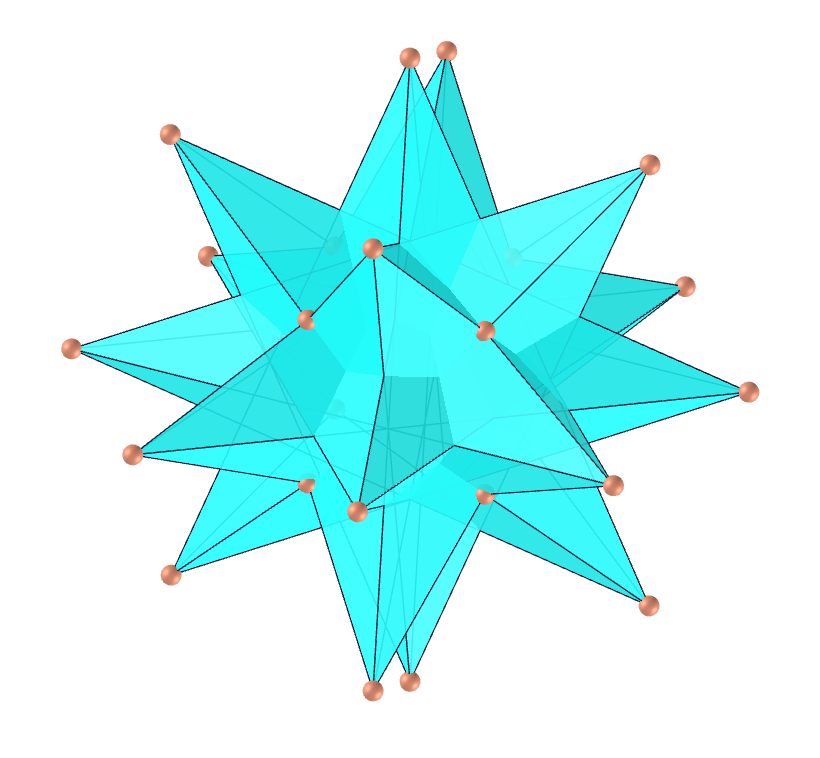</a>
  O grande icositetraedro deltoide (ou grande disdodecaedro sagital) é o dual do grande rombicuboctaedro uniforme. Suas faces são dardos, e parte de cada dardo fica dentro do sólido, portanto, é invisível em modelos sólidos. Uma de suas metades pode ser girada em 45&deg; para formar o pseudo grande icositetraedro deltoidal, análogo ao pseudo-deltoidal icositetraedro.
  <b>Faces:</b> 24 dardos | <b>Arestas:</b> 48 | <b>Vértices:</b> 26 | <b>Ângulo diédrico:</b> 94,53°. <a href="https://en.wikipedia.org/wiki/Great_deltoidal_icositetrahedron" target="_blank">Mais sobre...</a>

 <h4>17. Pequeno dodecicosidodecaedro</h4>
 <a href="../vr/small_dodecicosidodecahedron.htm" target="_blank" title="modelo 3D" class="fotoA">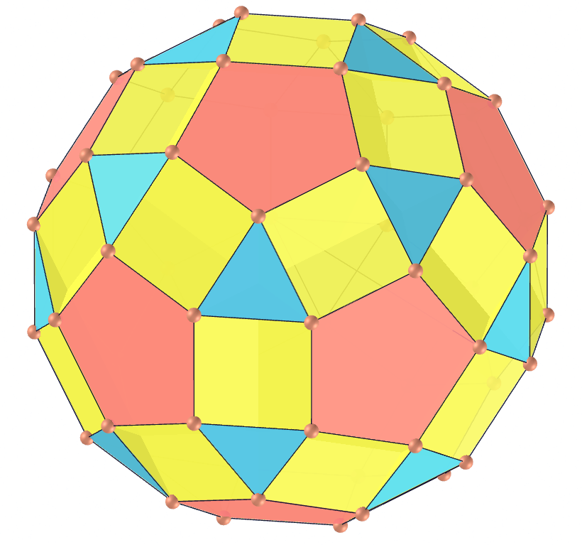</a>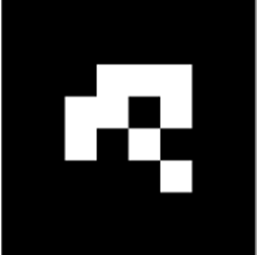
  U33 O pequeno dodecicosidodecaedro é o poliedro uniforme cujo poliedro dual é o pequeno hexecontaedro dodecacrônico. É uma versão facetada do pequeno rombicosidodecaedro. O pequeno dodecicosidodecaedro aparece na capa do livro "Computer Science with Mathematica" de Roman E. Maeder (1999).
  <b>Faces:</b> 20 triângulos equiláteros, 12 pentágonos regulares e 12 decágonos regulares | <b>Arestas:</b> 120 | <b>Vértices:</b> 60 | <b>Ângulos diédricos:</b> 116,57° e 322,62°. <a href="https://mathworld.wolfram.com/SmallDodecicosidodecahedron.html" target="_blank">Mais sobre...</a>

 <h4>18. Pequeno hexecontaedro dodecacrônico</h4>
 <a href="../vr/small_dodecacronic_hexecontahedron.htm" target="_blank" title="modelo 3D" class="fotoA">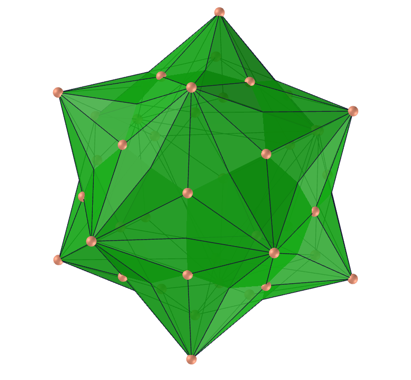</a>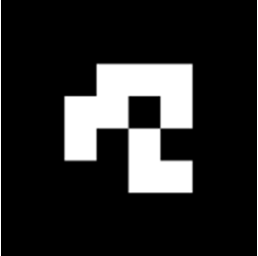
  O pequeno hexecontaedro dodecacrônico é o poliedro dual do pequeno dodecicosidodecaedro. É visualmente idêntico ao pequeno rhombidodecacron. Suas faces são dardos, e uma parte de cada dardo fica dentro do sólido, portanto, é invisível em modelos sólidos.
   <b>Faces:</b> 60 dardos | <b>Arestas:</b> 120 | <b>Vértices:</b> 44 | <b>Ângulo diédrico:</b> 154,12°. <a href="https://polytope.miraheze.org/wiki/Small_dodecacronic_hexecontahedron" target="_blank">Mais sobre...</a>

<h4>19. Grande hexecontaedro dodecacrônico</h4>
 <a href="../vr/great_dodecicosidodecahedron.htm" target="_blank" title="modelo 3D" class="fotoA">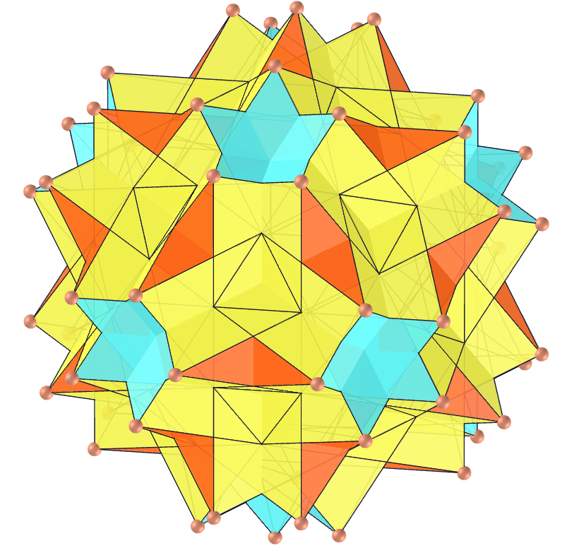</a>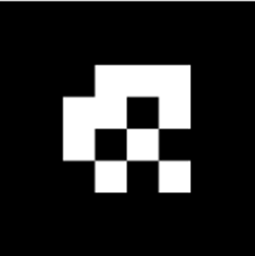
  U61 O Grande Dodecicosidodecaedro (ou grande dodekicosidodecaedro) é o poliedro uniforme cujo dual é o grande hexecontaedro dodecacrônico. Ele compartilha seu arranjo de vértice com o grande dodecaedro truncado e os sólidos compostos uniformes de 6 ou 12 prismas pentagonais.
  <b>Faces:</b> 20 triângulos equiláteros, 12 pentagramas regulares e 12 decagramas regulares | <b>Arestas:</b> 120 | <b>Vértices:</b> 60 | <b>Ângulos diédricos:</b> 100.81° e 116.57°. <a href="https://mathworld.wolfram.com/GreatDodecicosidodecahedron.html" target="_blank">Mais sobre...</a>

<h4>20. Grande hexecontaedro dodecacrônico</h4>
 <a href="../vr/great_dodecacronic_hexecontahedron.htm" target="_blank" title="modelo 3D" class="fotoA">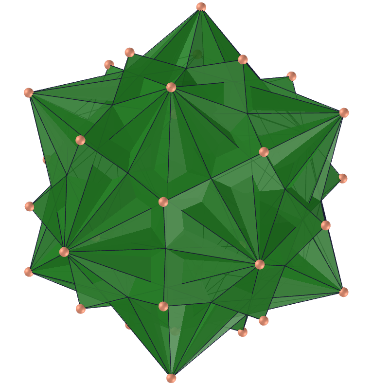</a>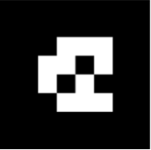
  O Grande hexecontaedro dodecacrônico (ou grande ditriacontaedro lanceal) é o dual do grande dodecicosidodecaedro. Suas 60 faces quadrilaterais que se cruzam são "pipas". Parte de cada "pipa" fica dentro do sólido, portanto, é invisível em modelos sólidos.
  <b>Faces:</b> 60 "pipas" | <b>Arestas:</b> 120 | <b>Vértices:</b> 44 | <b>Ângulo diédrico:</b> 91.55°. <a href="https://en.wikipedia.org/wiki/Great_dodecacronic_hexecontahedron" target="_blank">Mais sobre...</a>
 
<a href="#p5" class="topo">voltar ao topo</a>

 

<h4>21. Pequeno dodecicosidodecaedro ditrigonal</h4>
 <a href="../vr/small_ditrigonal_dodecicosidodecahedron.htm" target="_blank" title="modelo 3D" class="fotoA">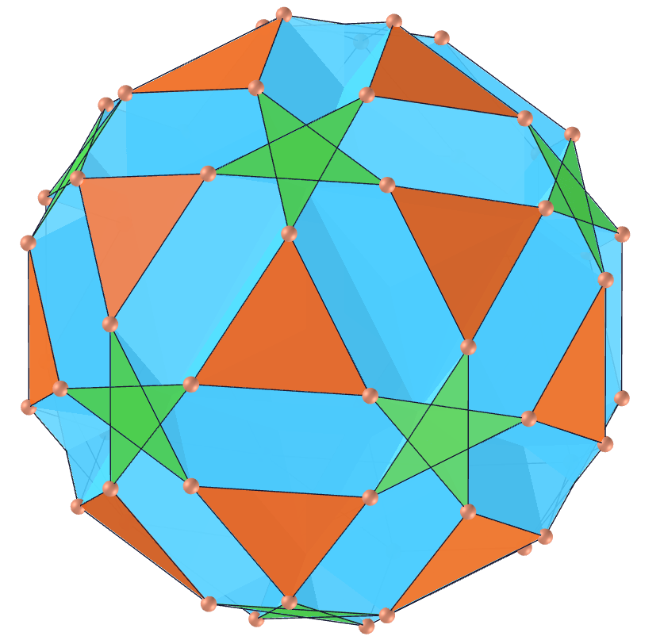</a>
  U43 O pequeno dodecicosidodecaedro ditrigonal é o poliedro uniforme cujo dual é o icosaedro triâmbico pequeno. Uma versão facetada é o dodecadodecaedro ditrigonal. O casco convexo do pequeno icosidodecaedro ditrigonal é um dodecaedro regular, cujo dual é o icosaedro, assim o dual do grande dodecicosidodecaedro ditrigonal (o pequeno icosaedro triâmbico) é uma das estrelas do icosaedro.
  <b>Faces:</b> 20 triângulos equiláteros, 12 pentagramas regulares e 12 decágonos regulares | <b>Arestas:</b> 120 | <b>Vértices:</b> 60 | <b>Ângulos diédricos:</b> 100.81° e 296.56°. <a href="https://mathworld.wolfram.com/SmallDitrigonalIcosidodecahedron.html" target="_blank">Mais sobre...</a>

<h4>22. Pequeno hexecontaedro ditrigonal dodecacrônico</h4>
 <a href="../vr/small_ditrigonal_dodecacronic_hexecontahedron.htm" target="_blank" title="modelo 3D" class="fotoA">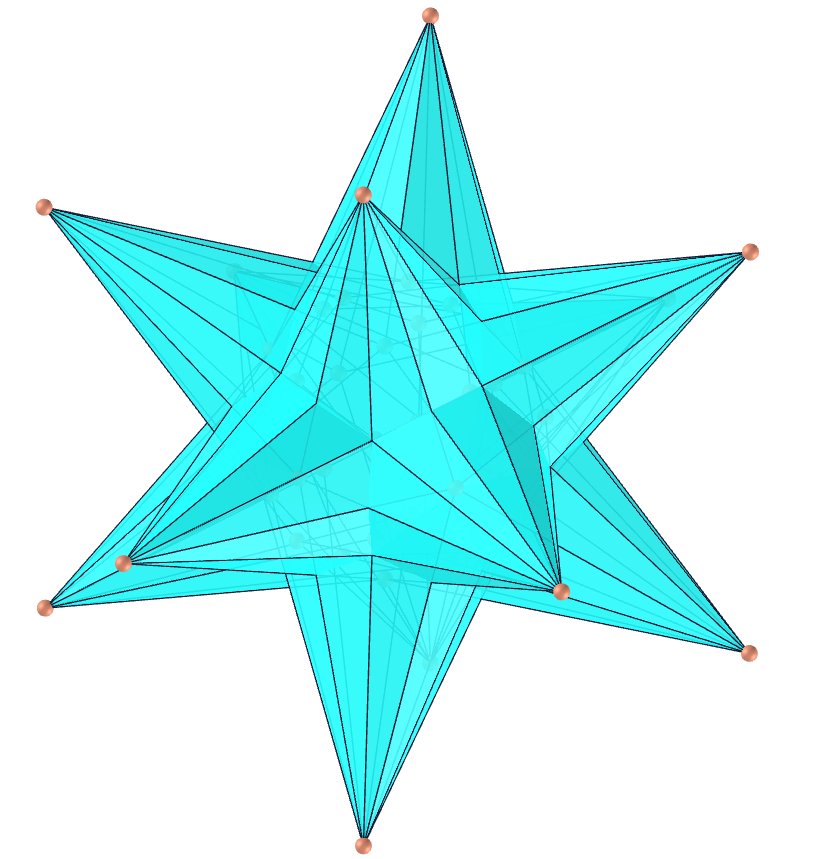</a>
  O pequeno hexecontaedro ditrigonal dodecacrônico (ou estrela "gorda") é o poliedro dual do pequeno dodecicosidodecaedro ditrigonal. É visualmente idêntico ao pequeno dodecicosacron e suas faces são dardos. Uma parte de cada dardo está dentro do sólido, portanto, invisível em modelos sólidos.
  <b>Faces:</b> 60 dardos | <b>Arestas:</b> 120 | <b>Vértices:</b> 44 | <b>Ângulo diédrico:</b> 146.23°. <a href="https://en.wikipedia.org/wiki/Small_ditrigonal_dodecacronic_hexecontahedron" target="_blank">Mais sobre...</a>

<h4>23. Grande dodecicosidodecaedro ditrigonal</h4>
 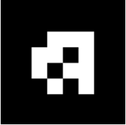
  U42 O Grande dodecicosidodecaedro ditrigonal (ou grande icosidodecaedro dodekificado) é o poliedro uniforme cujo dual é o grande hexecontaedro dodecacrônico ditrigonal. O casco convexo do grande dodecicosidodecaedro ditrigonal é um dodecaedro truncado, cujo dual é o icosaedro triakis, assim o dual do grande dodecicosidodecaedro ditrigonal (o grande icosaedro triâmbico) é uma estrela do icosaedro triakis.
  <b>Faces:</b> 20 triângulos equiláteros, 12 pentágonos regulares e 12 decagramas regulares | <b>Arestas:</b> 120 | <b>Vértices:</b> 60 | <b>Ângulos diédricos:</b> 100.81° e 296.56°. <a href="https://mathworld.wolfram.com/GreatDitrigonalDodecicosidodecahedron.html" target="_blank">Mais sobre...</a>

<h4>24. Grande hexecontaedro dodecacrônico ditrigonal</h4>
 <a href="../vr/great_ditrigonal_dodecacronic_hexecontahedron.htm" target="_blank" title="modelo 3D" class="fotoA">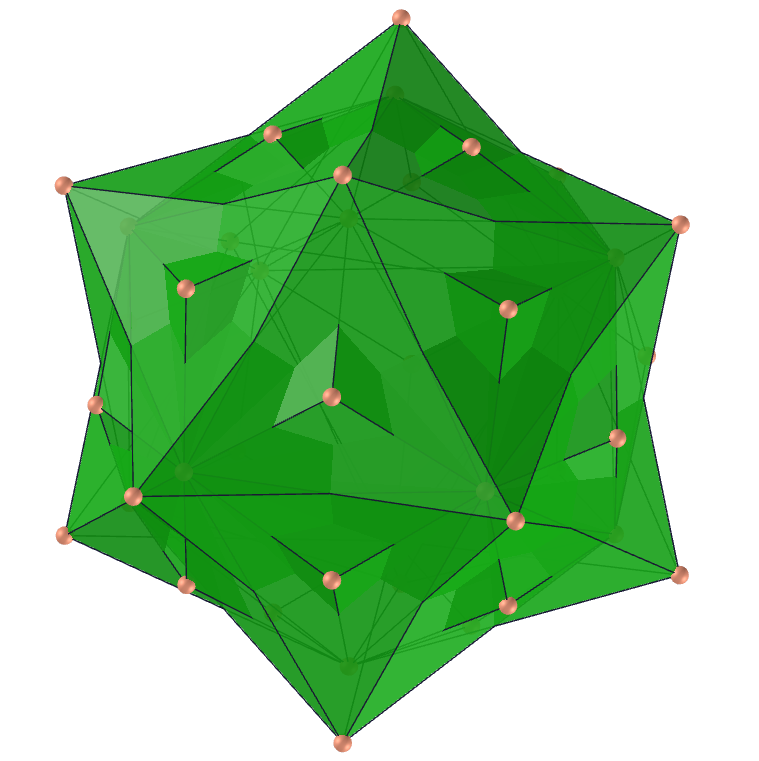</a>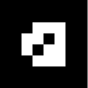
  O Grande hexecontaedro dodecacrônico ditrigonal (ou grande trisicosaedro lanceal) é o dual do grande dodecicosidodecaedro ditrigonal e suas faces são "pipas". Parte de cada "pipa" fica dentro do sólido, portanto, é invisível em modelos sólidos.
  <b>Faces:</b> 60 "pipas" | <b>Arestas:</b> 120 | <b>Vértices:</b> 44 | <b>Ângulo diédrico:</b> 127.69°. <a href="https://en.wikipedia.org/wiki/Great_ditrigonal_dodecacronic_hexecontahedron" target="_blank">Mais sobre...</a>

<h4>25. Icosidodecadodecaedro</h4>
 <a href="../vr/icosidodecadodecahedron.htm" target="_blank" title="modelo 3D" class="fotoA">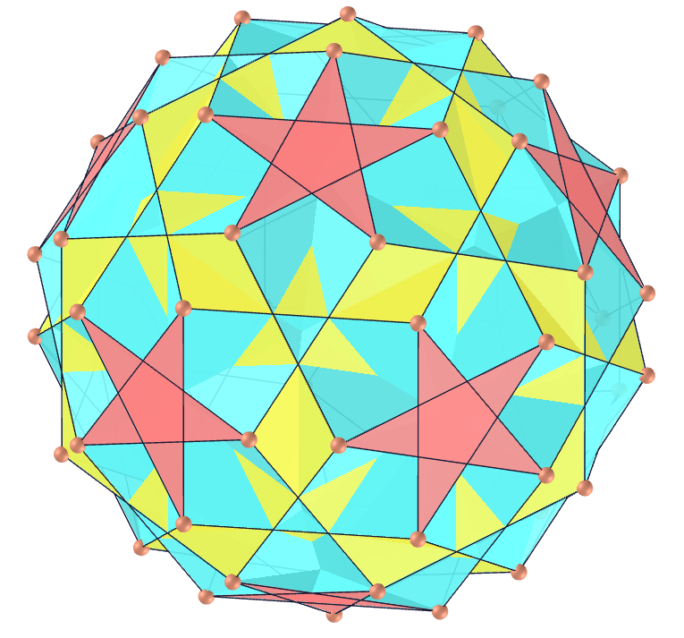</a>
  U44 O Icosidodecadodecaedro (ou dodecadodecaedro icosificado) é o poliedro uniforme cujo dual é o hexecontaedro icosacrônico medial. Sua figura de vértice é um quadrilátero cruzado e compartilha seu arranjo de vértice com os compostos uniformes de 10 ou 20 prismas triangulares.
  <b>Faces:</b> 20 hexágonos regulares, 12 pentagramas regulares e 12 pentágonos regulares | <b>Arestas:</b> 120 | <b>Vértices:</b> 60 | <b>Ângulos diédricos:</b> 100.81° e 322.62°. <a href="https://mathworld.wolfram.com/Icosidodecadodecahedron.html" target="_blank">Mais sobre...</a>

<h4>26. Medial Icosacronic Hexecontahedron</h4>
 <a href="../vr/medial_icosacronic_hexecontahedron.htm" target="_blank" title="modelo 3D" class="fotoA">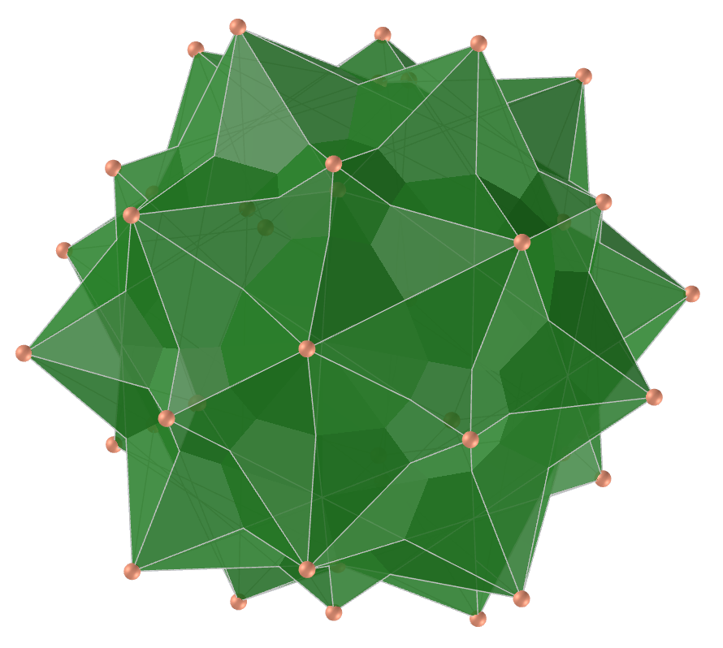</a>
  O hexecontaedro icosacrônico medial (ou ditriacontaedro sagital médio) é o dual do icosidodecadodecaedro. Suas faces são dardos e parte de cada dardo fica dentro do sólido, portanto é invisível em modelos sólidos.
  <b>Faces:</b> 60 dardos | <b>Arestas:</b> 120 | <b>Vértices:</b> 44 | <b>Ângulo diédrico:</b> 135.58°. <a href="https://en.wikipedia.org/wiki/Medial_icosacronic_hexecontahedron" target="_blank">Mais sobre...</a>

<h4>27. Pequeno icosicosidodecaedro</h4>
 <a href="../vr/small_icosicosidodecahedron.htm" target="_blank" title="modelo 3D" class="fotoA">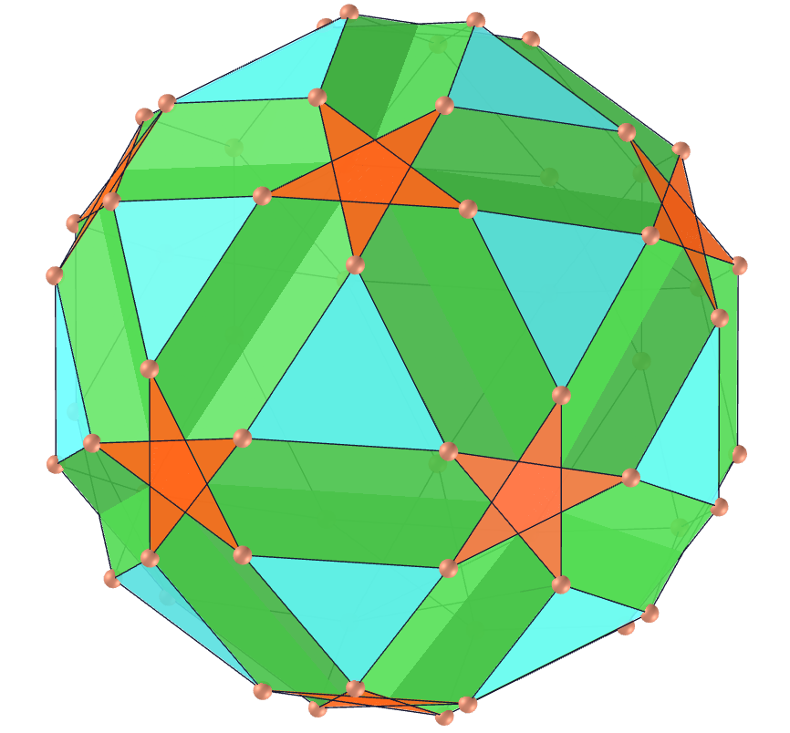</a>
  U31 O pequeno icosicosidodecaedro (ou pequeno icosidodecaedro icosificado) é o poliedro uniforme cujo dual é o pequeno hexecontaedro icosacrônico. Ele compartilha seu arranjo de vértice com o grande dodecaedro truncado estrelado.
  <b>Faces:</b> 20 triângulos equiláteros, 12 pentagramas regulares e 12 hexágonos regulares | <b>Arestas:</b> 120 | <b>Vértices:</b> 60 | <b>Ângulos diédricos:</b> 138.19° e 142.62°. <a href="https://mathworld.wolfram.com/SmallIcosicosidodecahedron.html" target="_blank">Mais sobre...</a>

<h4>28. Pequeno hexecontaedro icosacrônico</h4>
 <a href="../vr/small_icosacronic_hexecontahedron.htm" target="_blank" title="modelo 3D" class="fotoA">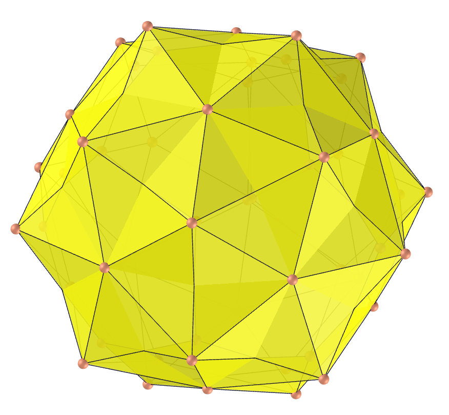</a>
  O pequeno hexecontaedro icosacrônico (ou pequeno trisicosaedro lanceal) é o poliedro dual do pequeno icosicosidodecaedro. Suas faces são "pipas" e parte de cada "pipa" fica dentro do sólido, portanto é invisível em modelos sólidos.
  <b>Faces:</b> 60 "pipas" | <b>Arestas:</b> 120 | <b>Vértices:</b> 52 | <b>Ângulo diédrico:</b> 146.23°. <a href="https://en.wikipedia.org/wiki/Small_icosacronic_hexecontahedron" target="_blank">Mais sobre...</a>

<h4>29. Grande icosicosidodecaedro</h4>
 <a href="../vr/great_icosicosidodecahedron.htm" target="_blank" title="modelo 3D" class="fotoA">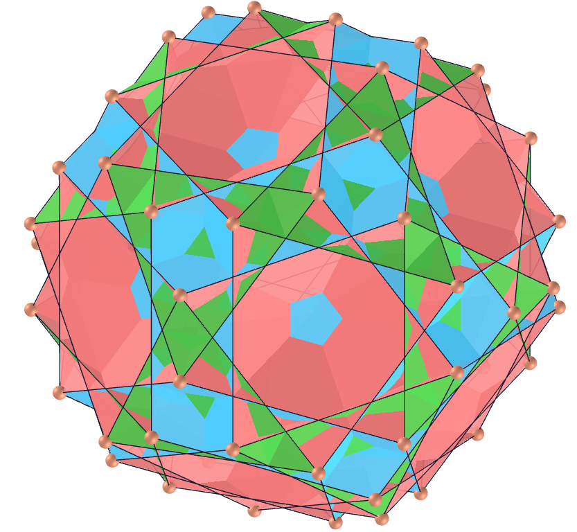</a>
  U48 O grande icosicosidodecaedro (ou grande icosidodecaedro icosificado) é o poliedro uniforme cujo dual é o grande hexecontaedro icosacrônico. Ele compartilha seu arranjo de vértice com o dodecaedro truncado e sua figura de vértice é um quadrilátero cruzado.
  <b>Faces:</b> 20 triângulos equiláteros, 12 pentágonos regulares e 20 hexágonos regulares | <b>Arestas:</b> 120 | <b>Vértices:</b> 60 | <b>Ângulos diédricos:</b> 79.19° e 318.19°. <a href="https://mathworld.wolfram.com/GreatIcosicosidodecahedron.html" target="_blank">Mais sobre...</a>

<h4>30. Grande hexecontaedro icosacrônico</h4>
 <a href="../vr/great_icosacronic_hexecontahedron.htm" target="_blank" title="modelo 3D" class="fotoA">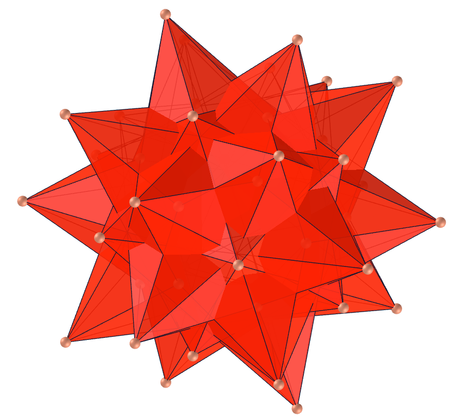</a>
  O Grande hexecontaedro icosacrônico (ou grande trisicosaedro sagital) é o dual do grande icosicosidodecaedro. Suas faces são dardos e uma parte de cada dardo fica dentro do sólido, portanto é invisível em modelos sólidos.
  <b>Faces:</b> 60 dardos | <b>Arestas:</b> 120 | <b>Vértices:</b> 52 | <b>Ângulo diédrico:</b> 127.69°. <a href="https://en.wikipedia.org/wiki/Great_icosacronic_hexecontahedron" target="_blank">Mais sobre...</a>
 
<a href="#p5" class="topo">voltar ao topo</a>

 

<h4>31. Rombidodecadodecaedro</h4>
 <a href="../vr/rhombidodecadodecahedron.htm" target="_blank" title="modelo 3D" class="fotoA">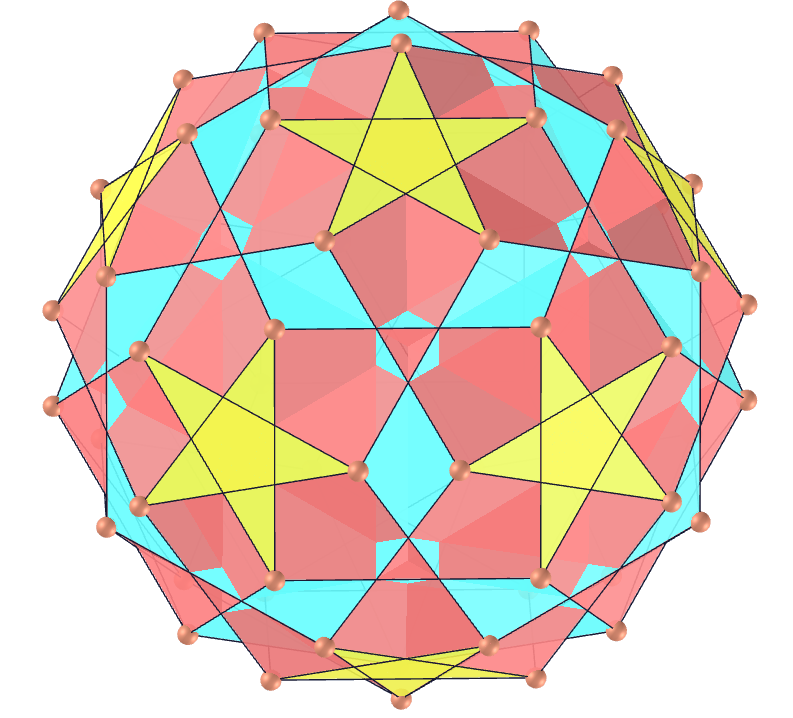</a>
  U38 O rombidodecadodecaedro (ou grande dodecaedro cantelado) é o poliedro uniforme cujo dual é o hexecontaedro deltoidal medial. Ele compartilha seu arranjo de vértice com os compostos uniformes de 10 ou 20 prismas triangulares.
  <b>Faces:</b> 30 quadrados, 12 pentágonos regulares e 12 pentagramas regulares | <b>Arestas:</b> 120 | <b>Vértices:</b> 60 | <b>Ângulos diédricos:</b> 121.71° e 148.28°. <a href="https://mathworld.wolfram.com/Rhombidodecadodecahedron.html" target="_blank">Mais sobre...</a>

<h4>32. Hexecontaedro deltoidal medial</h4>
 <a href="../vr/medial_deltoidal_hexecontahedron.htm" target="_blank" title="modelo 3D" class="fotoA">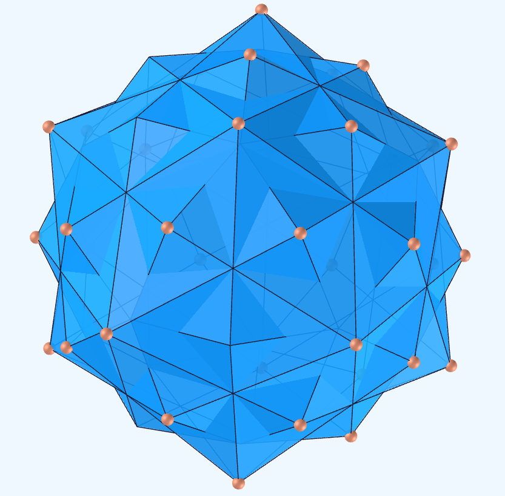</a>
  O hexecontaedro deltoidal medial é o dual do rombidodecadodecaedro. Suas 60 faces quadrilaterais que se cruzam são "pipas" e parte de cada "pipa" fica dentro do sólido, portanto é invisível em modelos sólidos.
  
  <b>Faces:</b> 60 "pipas" | <b>Arestas:</b> 120 | <b>Vértices:</b> 54 | <b>Ângulo diédrico:</b> 135.58°. <a href="https://en.wikipedia.org/wiki/Medial_deltoidal_hexecontahedron" target="_blank">Mais sobre...</a>

<h4>33. Grande rombicosidodecaedro uniforme</h4>
 <a href="../vr/uniform_great_rhombicosidodecahedron.htm" target="_blank" title="modelo 3D" class="fotoA">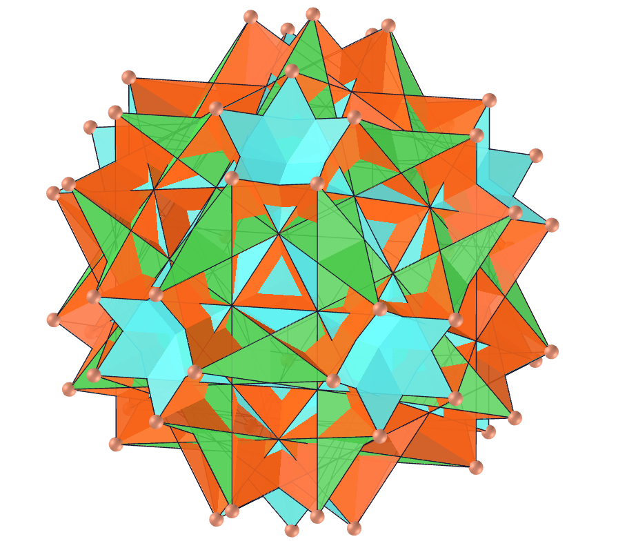</a>
  U67 O grande rombicosidodecaedro uniforme (ou quasirrombicosidodecaedro) é o poliedro uniforme cujo dual é o grande hexecontaedro deltoidal. Sua figura de vértice é um quadrilátero cruzado e compartilha seu arranjo de vértice com o grande dodecaedro truncado e com os compostos uniformes de 6 ou 12 prismas pentagonais.
  <b>Faces:</b> 30 quadrados, 20 triângulos equiláteros e 12 pentagramas regulares | <b>Arestas:</b> 120 | <b>Vértices:</b> 60 | <b>Ângulos diédricos:</b> 69.09° e 301.71°. <a href="https://mathworld.wolfram.com/UniformGreatRhombicosidodecahedron.html" target="_blank">Mais sobre...</a>

<h4>34. Grande hexecontaedro deltoidal</h4>
 <a href="../vr/great_deltoidal_hexecontahedron.htm" target="_blank" title="modelo 3D" class="fotoA">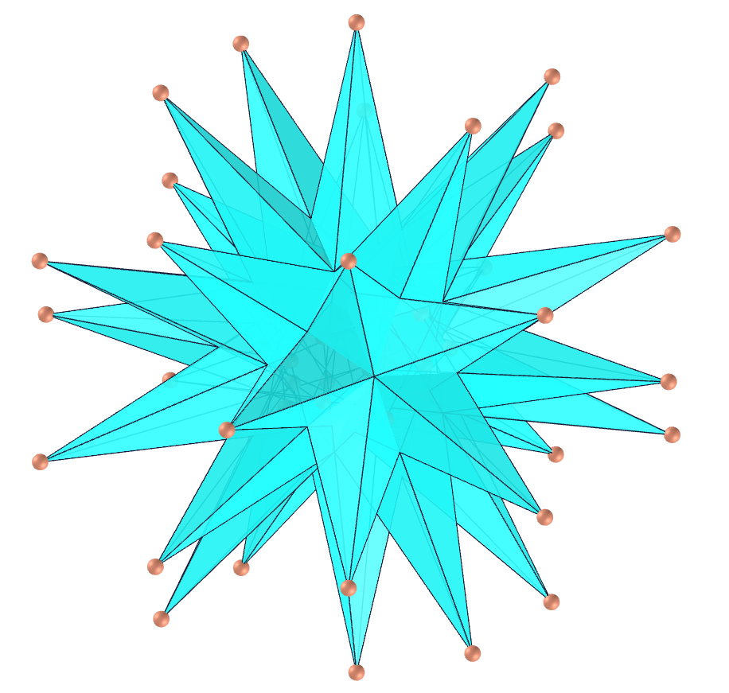</a>
  O grande hexecontaedro deltoidal (ou grande ditriacontaedro sagital) é o dual do grande rombicosidodecaedro uniforme. É visualmente idêntico ao grande rombidodecacron e parte de cada dardo está dentro do sólido, portanto é invisível em modelos sólidos. Também é chamado de grande hexecontaedro estrombico.
  <b>Faces:</b> 60 dardos | <b>Arestas:</b> 120 | <b>Vértices:</b> 62 | <b>Ângulo diédrico:</b> 91.55°. <a href="https://en.wikipedia.org/wiki/Great_deltoidal_hexecontahedron" target="_blank">Mais sobre...</a>
 
<a href="#p5" class="topo">voltar ao topo</a>

  
Poliedros quase regulares

  Um poliedro quase regular é um poliedro uniforme que tem exatamente dois tipos de faces regulares, que se alternam em torno de cada vértice. Para visualizar os poliedros quase regulares em RA, visite a página:

<a href="../quasiregular.html" target="_blank">https://paulohscwb.github.io/polyhedra/quasiregular.html</a>
 
com qualquer navegador com um dispositivo de webcam (smartphone, tablet ou notebook).
 O acesso às páginas de RV é feito clicando no círculo azul que aparece em cima de cada marcador.

 

<h4>1. Pequeno rombihexaedro</h4>
<a href="../vr/small_rhombihexahedron.htm" target="_blank" title="modelo 3D" class="fotoA">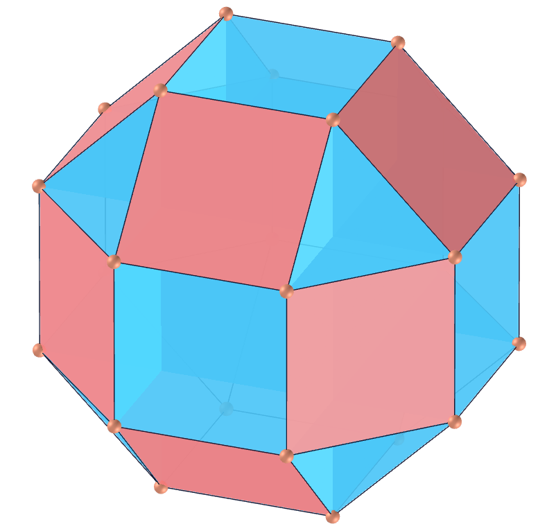</a>
  U18 O pequeno rombihexaedro (ou grande rombocubo) é o poliedro uniforme cujo dual é o pequeno rombihexacron. É uma versão facetada do pequeno rombicuboctaedro. O casco convexo do pequeno rombihexaedro é o pequeno rombicuboctaedro arquimediano, cujo dual é o icossitotraedro deltoidal, portanto o dual do pequeno rombihexaedro (pequeno rombihexacro) é uma das estrelas do icossitotraedro deltoidal.
  <b>Faces:</b> 12 quadrados e 6 octógonos regulares | <b>Arestas:</b> 48 | <b>Vértices:</b> 24 | <b>Ângulos diédricos:</b> 45° e 90°. <a href="https://mathworld.wolfram.com/SmallRhombihexahedron.html" target="_blank">Mais sobre...</a>

<h4>2. Pequeno rombihexacro</h4>
 <a href="../vr/small_rhombihexacron.htm" target="_blank" title="modelo 3D" class="fotoA">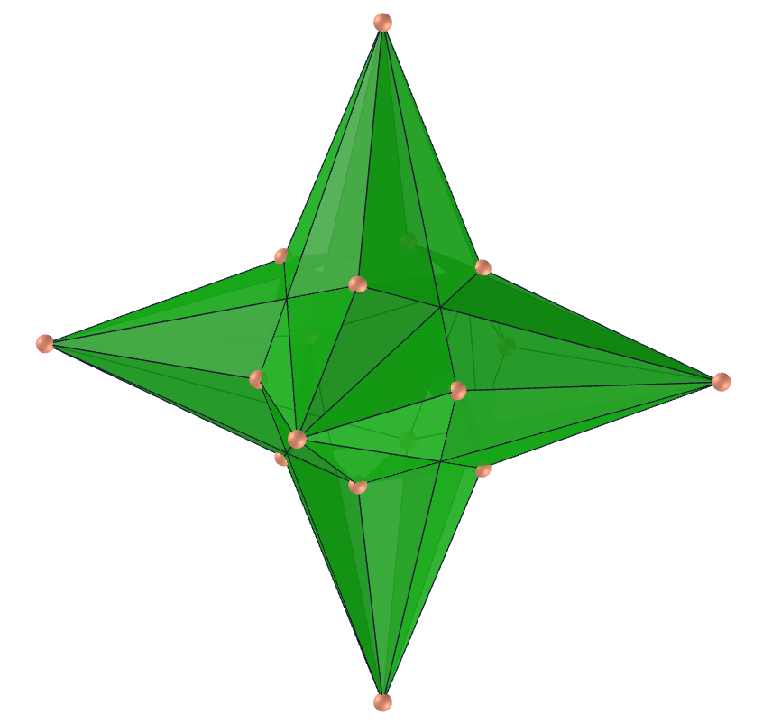</a>
  O pequeno rombihexacro (ou pequeno disdodecaedro dipteral) é o poliedro dual do pequeno rombihexaedro. É visualmente idêntico ao pequeno icositetraedro hexacrônico e suas faces são antiparalelogramos (laços) formados por pares de triângulos coplanares.
  <b>Faces:</b> 24 antiparalelogramos | <b>Arestas:</b> 48 | <b>Vértices:</b> 18 | <b>Ângulo diédrico:</b> 138.12°. <a href="https://en.wikipedia.org/wiki/Small_rhombihexacron" target="_blank">Mais sobre...</a>

<h4>3. Grande rombihexaedro</h4>
<a href="../vr/great_rhombihexahedron.htm" target="_blank" title="modelo 3D" class="fotoA">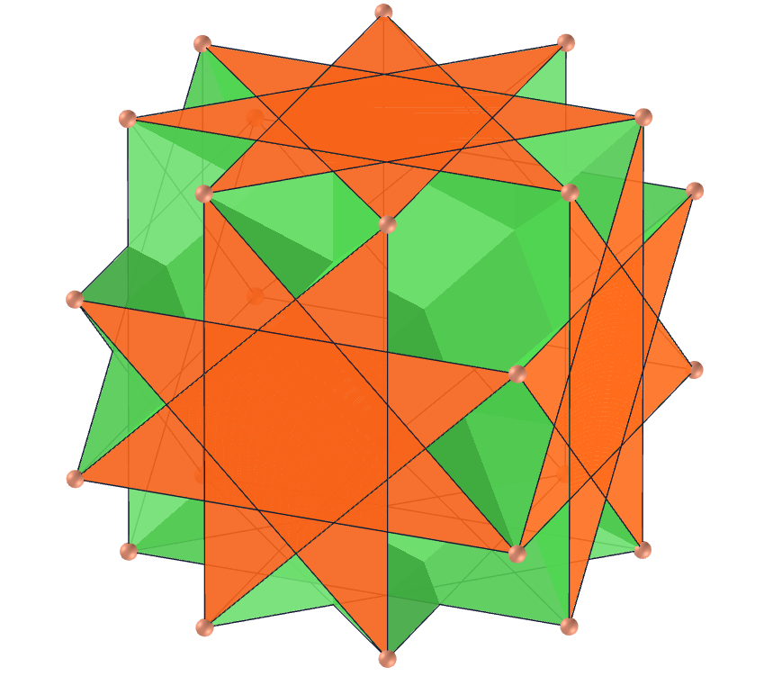</a>
  U21 O grande rombihexaedro (ou grande rombocubo) é o poliedro uniforme cujo dual é o grande rombihexacro. O casco convexo do grande rombihexaedro é o cubo arquimediano truncado, cujo dual é o pequeno triakis octaedro, portanto o dual do grande rombihexaedro (grande rombihexacro) é uma das estrelas do pequeno triakis octaedro.
  <b>Faces:</b> 12 quadrados e 6 octagramas regulares | <b>Arestas:</b> 48 | <b>Vértices:</b> 24 | <b>Ângulos diédricos:</b> 45° e 90°. <a href="https://mathworld.wolfram.com/GreatRhombihexahedron.html" target="_blank">Mais sobre...</a>

<h4>4. Grande rombihexacro</h4>
 <a href="../vr/great_rhombihexacron.htm" target="_blank" title="modelo 3D" class="fotoA">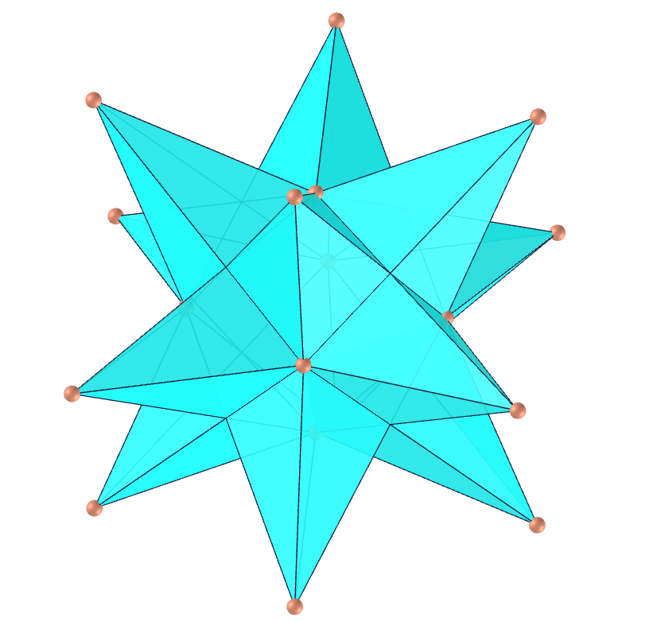</a>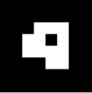
  O grande rombihexacro (ou grande disdodecaedro dipteral) é o dual do grande rombihexaedro uniforme. Possui 12 vértices externos que têm o mesmo arranjo de vértices do cuboctaedro e 6 vértices internos com o arranjo de vértices de um octaedro. Pode ser considerado como visualmente semelhante ao sólido de Catalan dodecaedro disdyakis.
  <b>Faces:</b> 24 antiparalelogramos | <b>Arestas:</b> 48 | <b>Vértices:</b> 18 | <b>Ângulo diédrico:</b> 94.53°. <a href="https://en.wikipedia.org/wiki/Great_rhombihexacron" target="_blank">Mais sobre...</a>

<h4>5. Pequeno dodecicosaedro</h4>
<a href="../vr/small_dodecicosahedron.htm" target="_blank" title="modelo 3D" class="fotoA">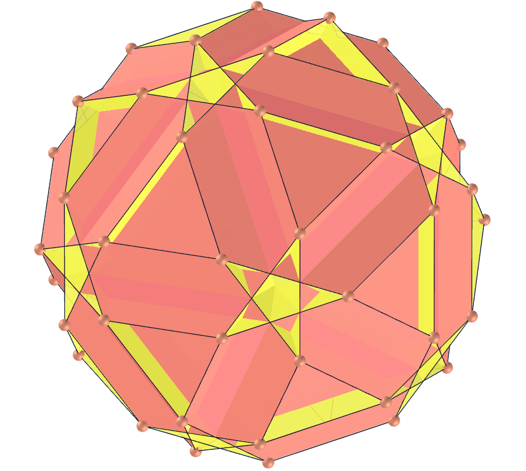</a>
  U50 O pequeno dodecicosaedro (ou pequeno dodequicosaedro) é o poliedro uniforme cujo dual é o pequeno dodecicosacron. Sua figura de vértice é um quadrilátero cruzado e compartilha seu arranjo de vértice com o grande dodecaedro truncado estrelado.
  <b>Faces:</b> 20 hexágonos regulares e 12 decágonos regulares | <b>Arestas:</b> 120 | <b>Vértices:</b> 60 | <b>Ângulos diédricos:</b> 37.38° e 79.19°. <a href="https://mathworld.wolfram.com/SmallDodecicosahedron.html" target="_blank">Mais sobre...</a>

<h4>6. Pequeno dodecicosacrono</h4>
 <a href="../vr/small_dodecicosacron.htm" target="_blank" title="modelo 3D" class="fotoA">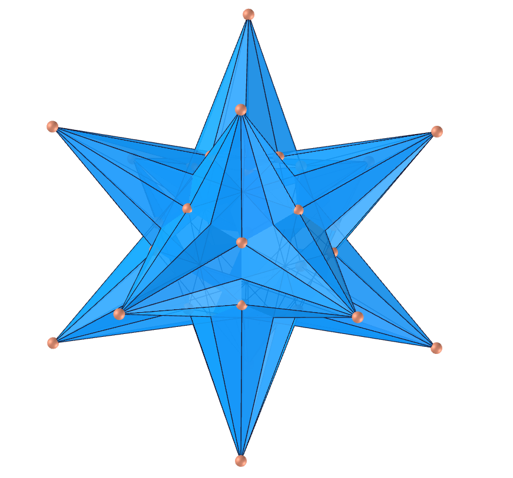</a>
  O pequeno dodecicosacrono (ou pequeno trisicosaedro dipteral) é dual do poliedro uniforme pequeno dodecicosaedro. É visualmente idêntico ao pequeno hexecontaedro dodecacrônico ditrigonal e parte de cada face está dentro do sólido, portanto, é invisível em modelos sólidos.
  <b>Faces:</b> 60 antiparalelogramos | <b>Arestas:</b> 120 | <b>Vértices:</b> 32 | <b>Ângulo diédrico:</b> 146.23°. <a href="https://en.wikipedia.org/wiki/Small_dodecicosacron" target="_blank">Mais sobre...</a>

<h4>7. Grande dodecicosaedro</h4>
<a href="../vr/great_dodecicosahedron.htm" target="_blank" title="modelo 3D" class="fotoA">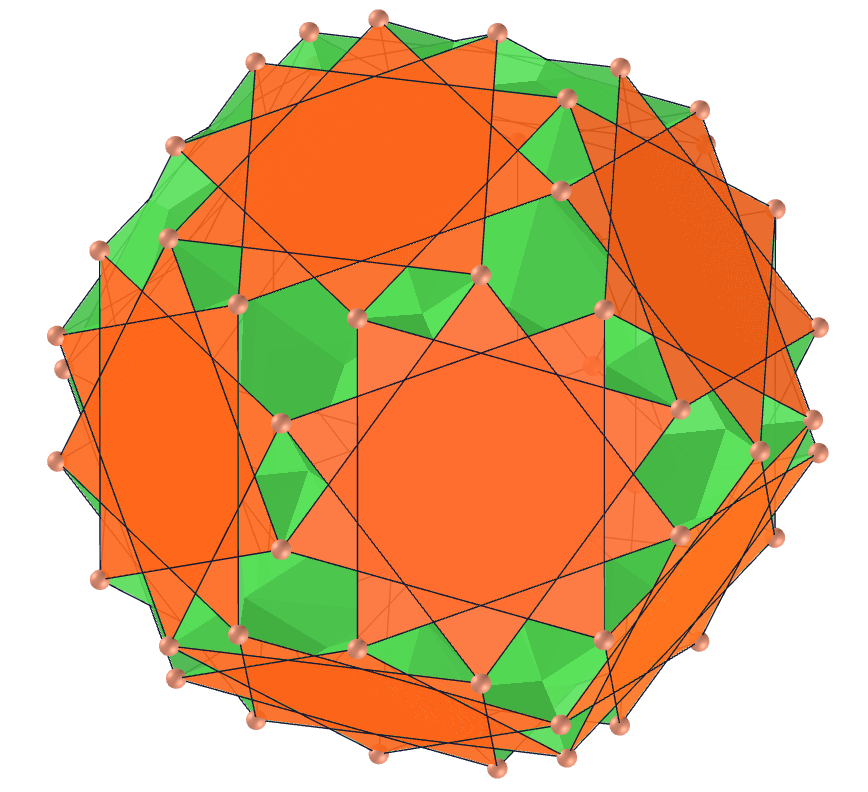</a>
  U63 O grande dodecicosaedro (ou grande dodequicosaedro) é o poliedro uniforme cujo dual é o grande dodecicosacron. Sua figura de vértice é um quadrilátero cruzado e compartilha seu arranjo de vértice com o dodecaedro truncado.
  <b>Faces:</b> 20 hexágonos regulares e 12 decagramas regulares | <b>Arestas:</b> 120 | <b>Vértices:</b> 60 | <b>Ângulos diédricos:</b> 37.38° e 100.81°. <a href="https://mathworld.wolfram.com/GreatDodecicosahedron.html" target="_blank">Mais sobre...</a>

<h4>8. Grande dodecicosacrono</h4>
 <a href="../vr/great_dodecicosacron.htm" target="_blank" title="modelo 3D" class="fotoA">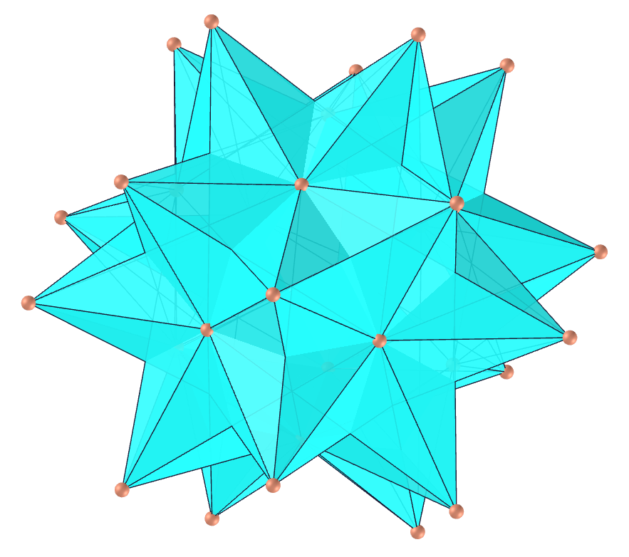</a>
  O grande dodecicosacrono (ou grande trisicosaedro dipteral) é o dual do poliedro uniforme grande dodecicosaedro. Ele tem 60 faces em forma de laço (antiparalelogramos) que se cruzam e parte de cada face fica dentro do sólido, portanto, é invisível em modelos sólidos.
  <b>Faces:</b> 60 antiparalelogramos | <b>Arestas:</b> 120 | <b>Vértices:</b> 32 | <b>Ângulo diédrico:</b> 127.69°. <a href="https://en.wikipedia.org/wiki/Great_dodecicosacron" target="_blank">Mais sobre...</a>

<h4>9. Pequeno rombidodecaedro</h4>
<a href="../vr/small_rhombidodecahedron.htm" target="_blank" title="modelo 3D" class="fotoA">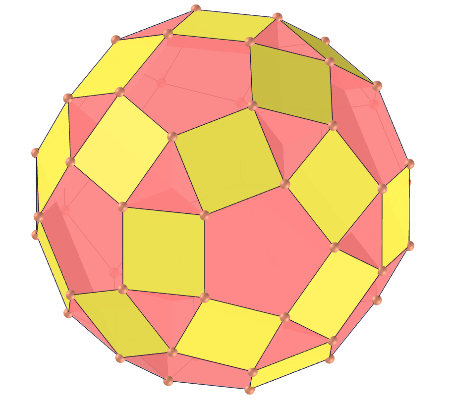</a>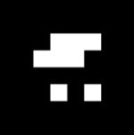
  U39 O pequeno rombidodecaedro é o poliedro uniforme cujo dual é o pequeno rombidodecácrono. É uma versão facetada do pequeno rombicosidodecaedro e sua figura de vértice é um quadrilátero cruzado. Ele compartilha seu arranjo de vértice com o pequeno dodecaedro estrelado truncado e os compostos uniformes de 6 ou 12 prismas pentagrâmicos.
  <b>Faces:</b> 30 quadrados e 12 decágonos regulares | <b>Arestas:</b> 120 | <b>Vértices:</b> 60 | <b>Ângulos diédricos:</b> 31.72° e 121.72°. <a href="https://mathworld.wolfram.com/SmallRhombidodecahedron.html" target="_blank">Mais sobre...</a>

<h4>10. Pequeno rombidodecácrono</h4>
 <a href="../vr/small_rhombidodecacron.htm" target="_blank" title="modelo 3D" class="fotoA">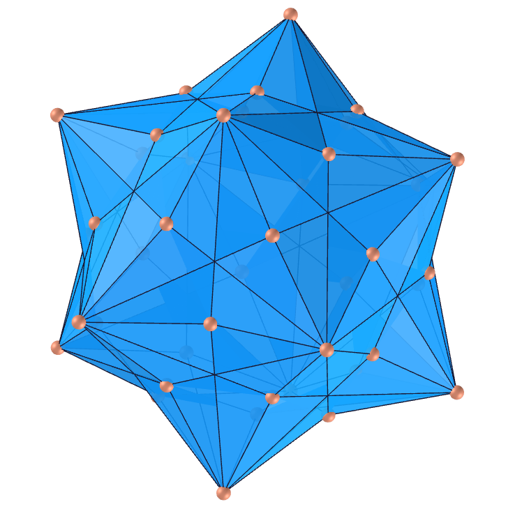</a>
  O pequeno rombidodecácrono é o dual do pequeno rombidodecaedro. É visualmente idêntico ao pequeno hexecontaedro dodecacrônico e tem 60 faces de antiparalelogramos que se cruzam.
   <b>Faces:</b> 60 antiparalelogramos | <b>Arestas:</b> 120 | <b>Vértices:</b> 42 | <b>Ângulo diédrico:</b> 154.12°. <a href="https://en.wikipedia.org/wiki/Small_rhombidodecacron" target="_blank">Mais sobre...</a>

<a href="#p6" class="topo">voltar ao topo</a>

<h4>11. Grande rombidodecaedro</h4>
<a href="../vr/great_rhombidodecahedron.htm" target="_blank" title="modelo 3D" class="fotoA">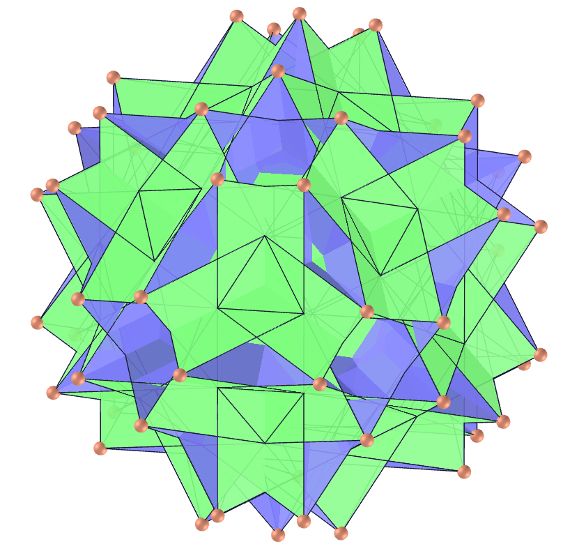</a>
  U73 O grande rombidodecaedro é o poliedro uniforme cujo dual é o grande rombidodecacron. Sua figura de vértice é um quadrilátero cruzado e compartilha seu arranjo de vértice com o grande dodecaedro truncado e os compostos uniformes de 6 ou 12 prismas pentagonais.
  <b>Faces:</b> 30 quadrados e 12 decagramas regulares | <b>Arestas:</b> 120 | <b>Vértices:</b> 60 | <b>Ângulos diédricos:</b> 31.72° e 58.28°. <a href="https://mathworld.wolfram.com/GreatRhombidodecahedron.html" target="_blank">Mais sobre...</a>

<h4>12. Grande rombidodecácrono</h4>
 <a href="../vr/great_rhombidodecacron.htm" target="_blank" title="modelo 3D" class="fotoA">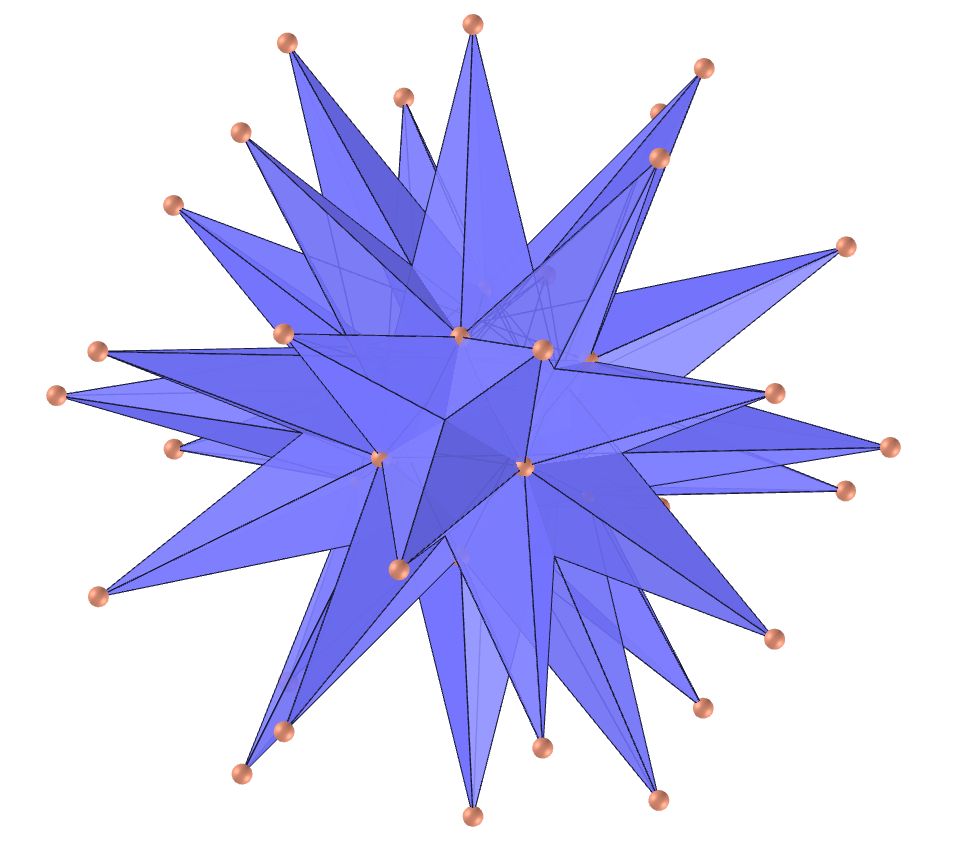</a>
  O grande rombidodecácrono (ou grande ditriacontaedro dipteral) é o dual do grande rombidodecaedro. É visualmente idêntico ao grande hexecontaedro deltoidal e suas faces são antiparalelogramos. Parte de cada face está dentro do sólido, portanto, é invisível em modelos sólidos.
  <b>Faces:</b> 60 antiparalelogramos | <b>Arestas:</b> 120 | <b>Vértices:</b> 42 | <b>Ângulo diédrico:</b> 91.55°. <a href="https://en.wikipedia.org/wiki/Great_rhombidodecacron" target="_blank">Mais sobre...</a>

<h4>13. Rombicosaedro</h4>
<a href="../vr/rhombicosahedron.htm" target="_blank" title="modelo 3D" class="fotoA">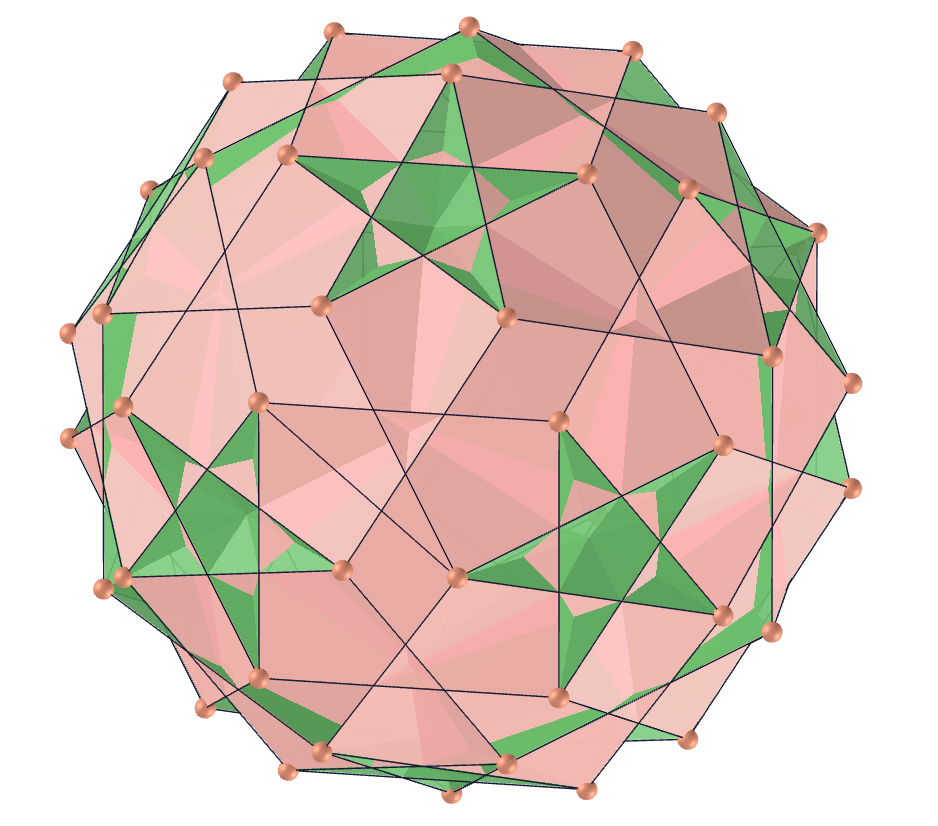</a>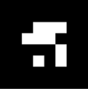
  U56 O rombicosaedro é o poliedro uniforme cujo  dual é o rombicosacron. Sua figura de vértice é um antiparalelogramo e compartilha seu arranjo de vértice com os compostos uniformes de 10 ou 20 prismas triangulares. Além disso, compartilha suas arestas com o rombidodecadodecaedro (tendo as faces quadradas em comum) e o icosidodecadodecaedro (tendo as faces hexagonais em comum).
  <b>Faces:</b> 30 quadrados e 20 hexágonos regulares | <b>Arestas:</b> 120 | <b>Vértices:</b> 60 | <b>Ângulos diédricos:</b> 20.91° e 110.91°. <a href="https://mathworld.wolfram.com/Rhombicosahedron.html" target="_blank">Mais sobre...</a>

<h4>14. Rombicosacro</h4>
 <a href="../vr/rhombicosacron.htm" target="_blank" title="modelo 3D" class="fotoA">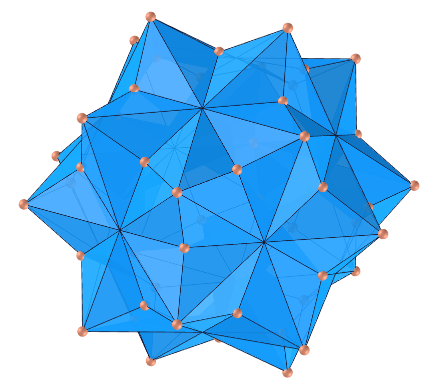</a>
  O rombicosacro (ou ditriacontaedro dipteral mediano) é o dual do rombicosaedro uniforme. Possui faces quadrilaterais cruzadas (antiparalelogramos).
  <b>Faces:</b> 60 antiparalelogramos | <b>Arestas:</b> 120 | <b>Vértices:</b> 50 | <b>Ângulo diédrico:</b> 135.58°. <a href="https://en.wikipedia.org/wiki/Rhombicosacron" target="_blank">Mais sobre...</a>

<a href="#p6" class="topo">voltar ao topo</a>

  
Poliedros Truncados de auto-interseção

  Um poliedro é regular truncado se for transitivo de vértice com figuras de vértice triangulares isósceles. Transitividade de vértice significa que, para quaisquer dois vértices do poliedro, existe uma translação, rotação e/ou reflexão que deixa a aparência externa do poliedro inalterada, mas move um vértice para o outro. Uma figura de vértice é o polígono produzido pela conexão dos pontos médios das arestas que se encontram no vértice na mesma ordem em que as arestas aparecem ao redor do vértice.
  Para visualizar os poliedros truncados de auto-interseção em RA, visite a página:

<a href="../selfintersecttruncated.html" target="_blank">https://paulohscwb.github.io/polyhedra/selfintersecttruncated.html</a>
 
com qualquer navegador com um dispositivo de webcam (smartphone, tablet ou notebook).
 O acesso às páginas de RV é feito clicando no círculo azul que aparece em cima de cada marcador.

 

<h4>1. Hexaedro estrelado truncado</h4>
<a href="../vr/stellated_truncated_hexahedron.htm" target="_blank" title="modelo 3D" class="fotoA">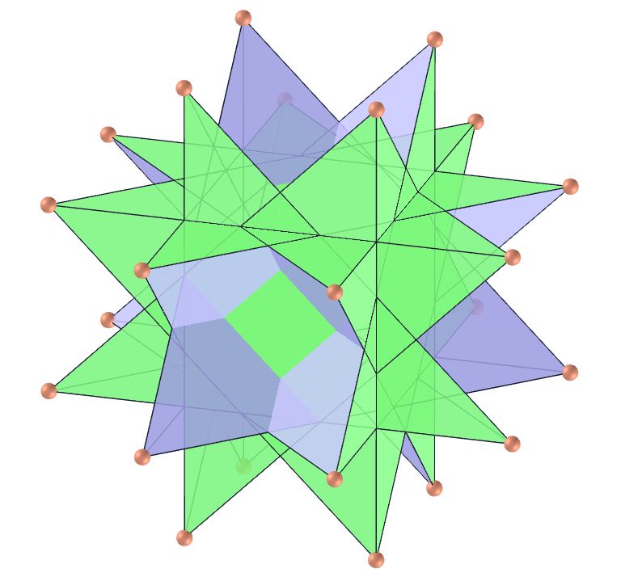</a>
  U19 O hexaedro estrelado truncado é o poliedro uniforme também chamado de hexaedro quasitruncado, cujo poliedro dual é o grande octaedro triakis. O casco convexo do hexaedro truncado estrelado é o pequeno rombicuboctaedro arquimediano.
  <b>Faces:</b> 14 triângulos equiláteros e 6 octagramas regulares | <b>Arestas:</b> 36 | <b>Vértices:</b> 24 | <b>Ângulos diédricos:</b> 54.74° e 90°. <a href="https://mathworld.wolfram.com/StellatedTruncatedHexahedron.html" target="_blank">Mais sobre...</a>

<a href="#p8" class="topo">voltar ao topo</a>

  
Pirâmides, tetraedros, prismas e antiprismas

  Para visualizar os poliedros em RA, visite a página:

<a href="../polyhedron.html" target="_blank">https://paulohscwb.github.io/polyhedra/polyhedron.html</a>
 
com qualquer navegador com um dispositivo de webcam (smartphone, tablet ou notebook).
 O acesso às páginas de RV é feito clicando no círculo azul que aparece em cima de cada marcador.

 

<h4>1. Prisma</h4>
<a href="../vr/heptagonal_prism.htm" target="_blank" title="modelo 3D" class="fotoA">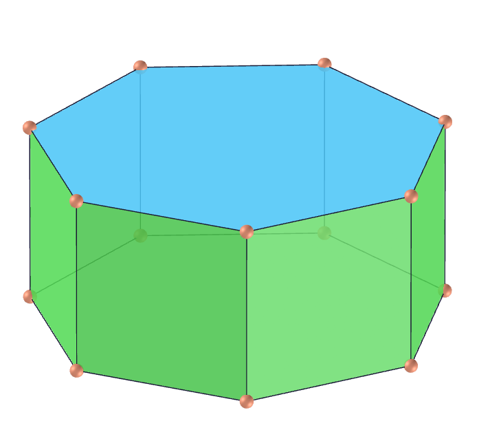</a>
  U76 Um prisma geral é um poliedro que possui duas faces poligonais congruentes e com todas as faces restantes paralelogramos. Um prisma reto é um prisma no qual os polígonos superior e inferior ficam um sobre o outro, de modo que os polígonos verticais que conectam seus lados não são apenas paralelogramos, mas retângulos. Os prismas regulares retos têm redes particularmente simples, dadas por duas bases n-gonais de orientação oposta conectadas por um conjunto de n quadrados. O exemplo mostrado nesta página é de um prisma reto regular heptagonal.
  <b>Faces:</b> 2 polígonos de n lados (bases) e n quadrados, retângulos ou paralelogramos (faces laterais) | <b>Arestas:</b> 3n | <b>Vértices:</b> 2n. <a href="https://mathworld.wolfram.com/Prism.html" target="_blank">Mais sobre...</a>

<h4>2. Prisma estrelado</h4>

  U78 Um prisma estrelado ou poligrâmico é formado por dois polígonos estrelados (poligramas) regulares deslocados ao longo de seu eixo de simetria e com arestas correspondentes conectadas por faces laterais (quadrados, retângulos ou paralelogramos). O exemplo mostrado nesta página é de um prisma reto estrelado octagonal (prisma octagrâmico).
  <b>Faces:</b> 2 polígonos de n lados (bases) e n quadrados, retângulos ou paralelogramos (faces laterais) | <b>Arestas:</b> 3n | <b>Vértices:</b> 2n. <a href="https://mathworld.wolfram.com/PolygrammicPrism.html" target="_blank">Mais sobre...</a>

<h4>3. Antiprisma</h4>
<a href="../vr/hexagonal_antiprism.htm" target="_blank" title="modelo 3D" class="fotoA">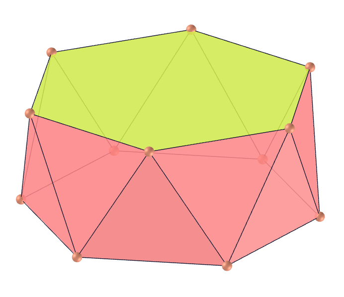</a>
  U77 Um antiprisma de n lados geral é um poliedro que consiste em faces com n lados idênticas, superior e inferior, cuja periferia é limitada por um conjunto de 2n triângulos com orientações alternadas de cima para baixo. Se as faces superior e inferior são polígonos regulares deslocados um em relação ao outro na direção perpendicular ao plano dos polígonos e girados um em relação ao outro por um ângulo de 180&deg;/n, então o antiprisma é conhecido como um antiprisma regular e suas faces são triângulos equiláteros. O exemplo mostrado nesta página é de um antiprisma regular hexagonal.
  <b>Faces:</b> 2 polígonos de n lados (bases) e n triângulos (faces laterais) | <b>Arestas:</b> 3n | <b>Vértices:</b> 2n. <a href="https://mathworld.wolfram.com/Antiprism.html" target="_blank">Mais sobre...</a>

<h4>4. Antiprisma estrelado</h4>
<a href="../vr/pentagrammic_antiprism.htm" target="_blank" title="modelo 3D" class="fotoA">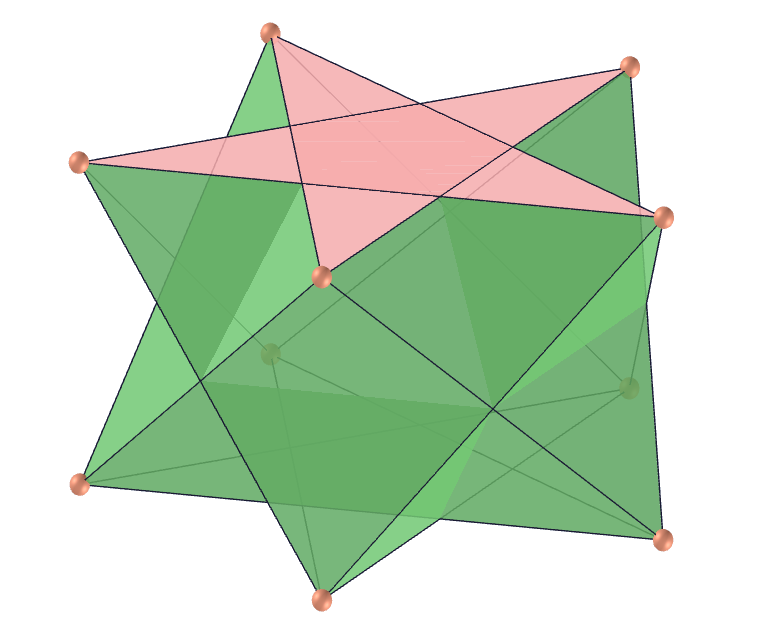</a>
  U79 Um antiprisma estrelado ou poligrâmico é formado por dois polígonos estrelados (poligramas) regulares superior e inferior, cuja periferia é limitada por um conjunto de 2n triângulos com orientações alternadas de cima para baixo. O exemplo mostrado nesta página é de um antiprisma reto estrelado pentagonal (antiprisma pentagrâmico).
  <b>Faces:</b> 2 polígonos de n lados (bases) e n triângulos (faces laterais) | <b>Arestas:</b> 3n | <b>Vértices:</b> 2n. <a href="https://mathworld.wolfram.com/PentagrammicAntiprism.html" target="_blank">Mais sobre...</a>

<h4>5. Antiprisma cruzado estrelado</h4>
<a href="../vr/heptagrammic_crossed_antiprism.htm" target="_blank" title="modelo 3D" class="fotoA">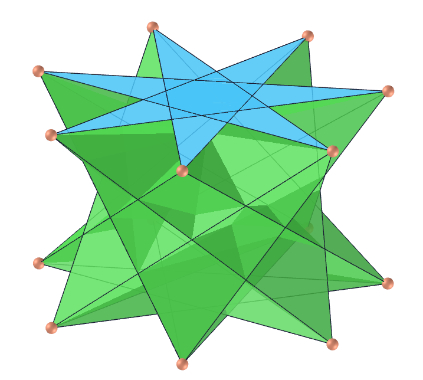</a>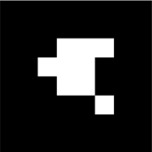
  U80 Um antiprisma cruzado estrelado ou poligrâmico é formado por dois polígonos estrelados (poligramas) regulares superior e inferior, cuja periferia é limitada por um conjunto de 2n triângulos com orientações alternadas de cima para baixo conectados com vértices opostos das bases. O exemplo mostrado nesta página é de um antiprisma reto cruzado estrelado heptagonal (antiprisma heptagrâmico cruzado).
  <b>Faces:</b> 2 polígonos de n lados (bases) e n triângulos (faces laterais) | <b>Arestas:</b> 3n | <b>Vértices:</b> 2n. <a href="https://mathworld.wolfram.com/PentagrammicCrossedAntiprism.html" target="_blank">Mais sobre...</a>

<h4>6. Pirâmide</h4>
<a href="../vr/heptagonal_pyramid.htm" target="_blank" title="modelo 3D" class="fotoA">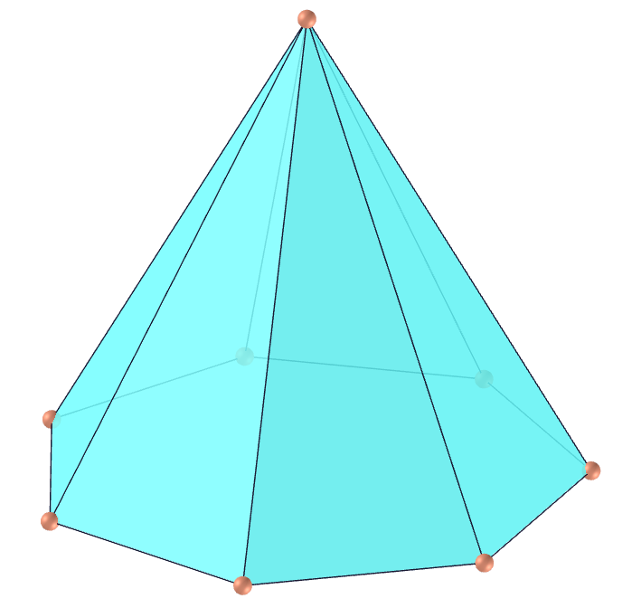</a>
  Uma pirâmide é um poliedro com uma face (conhecida como base), um polígono e todas as outras faces triângulos que se encontram em um vértice de polígono comum (conhecido como "ápice"). Uma pirâmide reta é uma pirâmide para a qual a linha que une o centróide da base e o ápice é perpendicular à base. Uma pirâmide regular é uma pirâmide reta cuja base é um polígono regular. O exemplo mostrado nesta página é de uma pirâmide reta regular heptagonal.
  <b>Faces:</b> 1 polígonos de n lados (base) e n triângulos (faces laterais) | <b>Arestas:</b> 2n | <b>Vértices:</b> n + 1. <a href="https://mathworld.wolfram.com/Pyramid.html" target="_blank">Mais sobre...</a>

<h4>7. Pirâmide estrelada</h4>
<a href="../vr/octagrammic_pyramid.htm" target="_blank" title="modelo 3D" class="fotoA">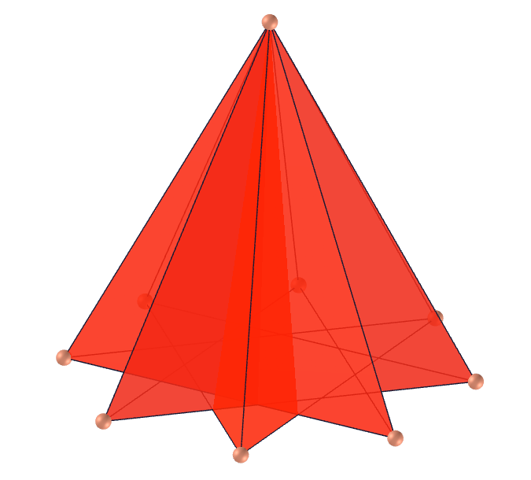</a>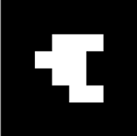
  Uma pirâmide estrelada ou poligrâmica é formada por um polígono estrelado (poligrama) regular com arestas correspondentes conectadas por faces laterais triangulares que se encontram em um vértice comum (conhecido como "ápice"). O exemplo mostrado nesta página é de uma pirâmide estrelada octagonal (pirâmide octagrâmica).
  <b>Faces:</b> 1 polígonos de n lados (base) e n triângulos (faces laterais) | <b>Arestas:</b> 2n | <b>Vértices:</b> n + 1. <a href="https://polytope.miraheze.org/wiki/Pentagrammic_pyramid" target="_blank">Mais sobre...</a>

<h4>8. Dipirâmide</h4>
<a href="../vr/pentagonal_dipyramid.htm" target="_blank" title="modelo 3D" class="fotoA">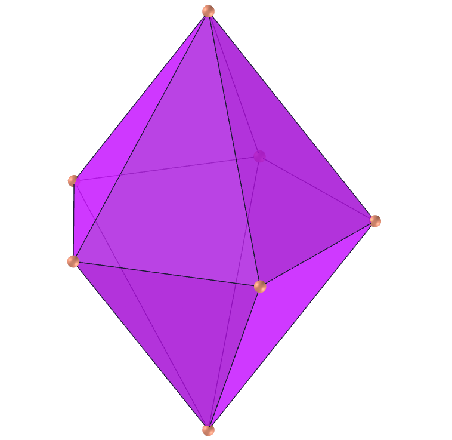</a>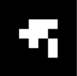
  Uma dipirâmide, também chamada de bipirâmide ou pirâmide dupla, consiste em duas pirâmides colocadas simetricamente de base a base. As dipirâmides são duais dos prismas regulares. Seus esqueletos são os gráficos dipiramidais. O exemplo mostrado nesta página é de uma dipirâmide regular pentagonal.
  <b>Faces:</b> 2n triângulos | <b>Arestas:</b> 3n | <b>Vértices:</b> n + 2. <a href="https://mathworld.wolfram.com/Dipyramid.html" target="_blank">Mais sobre...</a>

<h4>9. Dipirâmide estrelada</h4>
<a href="../vr/pentagrammic_dipyramid.htm" target="_blank" title="modelo 3D" class="fotoA">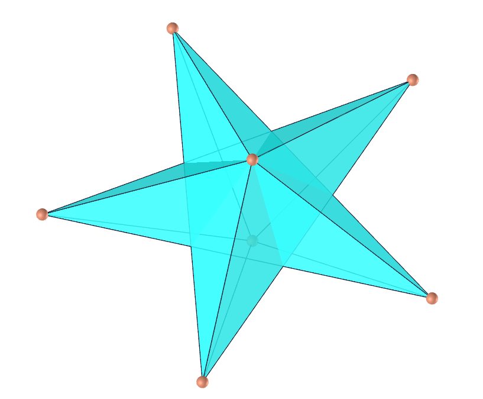</a>
  Uma dipirâmide estrelada, também chamada de bipirâmide estrelada ou pirâmide dupla estrelada, consiste em duas pirâmides estreladas colocadas simetricamente de base a base. As dipirâmides estreladas são duais dos prismas estrelados. O exemplo mostrado nesta página é de uma dipirâmide regular estrelada pentagonal ou dipirâmide pentagrâmica.
  <b>Faces:</b> 2n triângulos | <b>Arestas:</b> 3n | <b>Vértices:</b> n + 2. <a href="https://mathworld.wolfram.com/PentagrammicDipyramid.html" target="_blank">Mais sobre...</a>

<h4>10. Trapezoedro</h4>
<a href="../vr/hexagonal_trapezohedron.htm" target="_blank" title="modelo 3D" class="fotoA">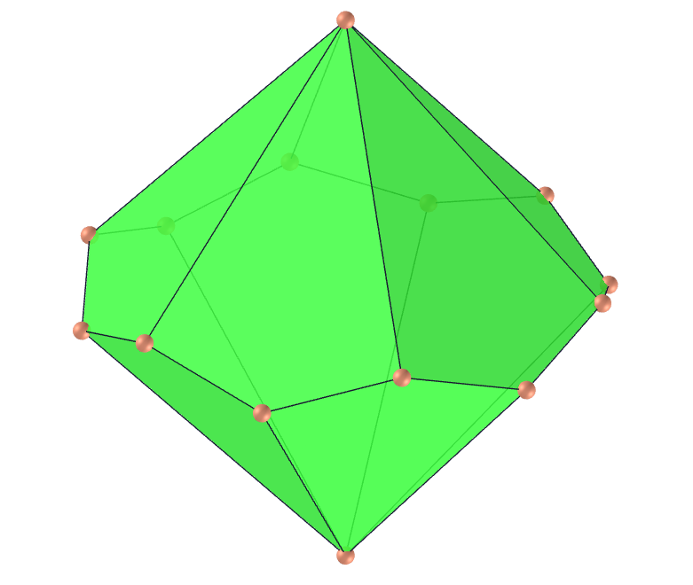</a>
  Um trapezoedro de n vértices, também chamado de antidipirâmide, antibipirâmide ou deltoedro é um sólido composto de "pipas" quadrilaterais simétricas intercaladas, metade das quais se encontram em um vértice superior e metade em um vértice inferior. Um trapezoedro regular pode ser construído a partir de dois conjuntos de pontos colocados em torno de dois polígonos regulares de n lados deslocados um em relação ao outro na direção perpendicular ao plano dos polígonos e girados um em relação ao outro por um ângulo de 180&deg;/n. Este poliedro é o dual do antiprisma. O exemplo mostrado nesta página é de um trapezoedro regular hexagonal.
  <b>Faces:</b> 2n "pipas" | <b>Arestas:</b> 4n | <b>Vértices:</b> 2n + 2. <a href="https://mathworld.wolfram.com/Trapezohedron.html" target="_blank">Mais sobre...</a>

<a href="#p7" class="topo">voltar ao topo</a>

<h4>11. Trapezoedro estrelado</h4>
<a href="../vr/heptagrammic_trapezohedron.htm" target="_blank" title="modelo 3D" class="fotoA">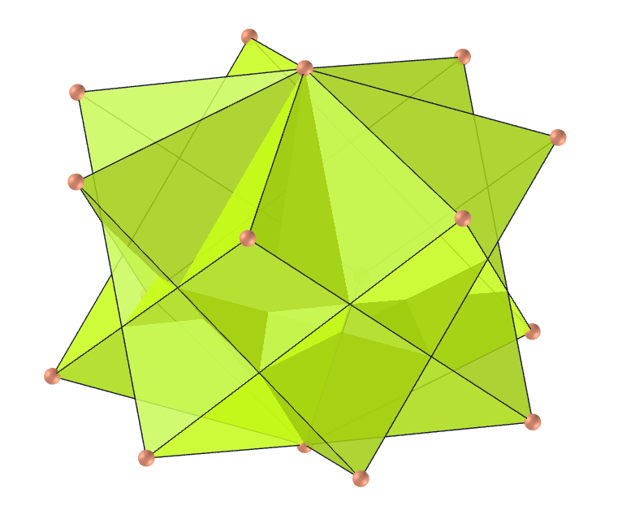</a>
  Um trapezoedro estrelado de n vértices, também chamado de antidipirâmide estrelada, deltoedro estrelado ou antibipirâmide estrelada é um sólido composto de "pipas" quadrilaterais intercaladas, metade das quais se encontram em um vértice superior e metade em um vértice inferior. Este poliedro é o dual do antiprisma estrelado. O exemplo mostrado nesta página é de um trapezoedro regular estrelado heptagonal (trapezoedro heptagrâmico).
  <b>Faces:</b> 2n "pipas" | <b>Arestas:</b> 4n | <b>Vértices:</b> 2n + 2. <a href="https://mathworld.wolfram.com/PentagrammicDeltohedron.html" target="_blank">Mais sobre...</a>

<h4>12. Trapezoedro estrelado côncavo</h4>
<a href="../vr/octagrammic_concave_trapezohedron.htm" target="_blank" title="modelo 3D" class="fotoA">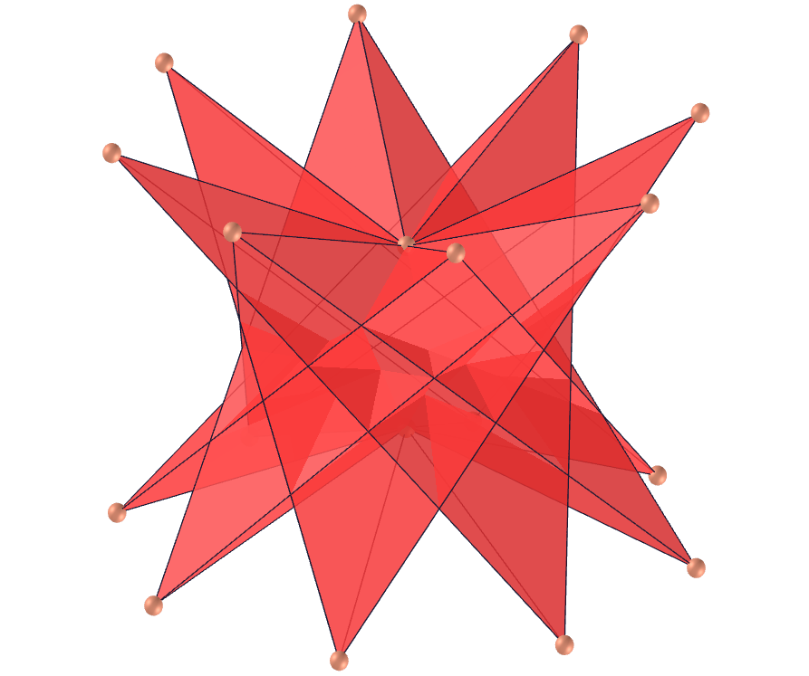</a>
  Um trapezoedro estrelado côncavo de n vértices, também chamado de antidipirâmide estrelada côncava, deltoedro estrelado côncavo ou antibipirâmide estrelada côncava é um sólido composto de "dardos" quadrilaterais intercalados, metade das quais se encontram em um vértice superior e metade em um vértice inferior. Este poliedro é o dual do antiprisma cruzado estrelado. O exemplo mostrado nesta página é de um trapezoedro regular estrelado côncavo octagonal (trapezoedro octagrâmico côncavo).
  <b>Faces:</b> 2n "dardos" | <b>Arestas:</b> 4n | <b>Vértices:</b> 2n + 2. <a href="https://mathworld.wolfram.com/PentagrammicConcaveDeltohedron.html" target="_blank">Mais sobre...</a>

<h4>13. Tetraedro isósceles</h4>
<a href="../vr/isosceles_tetrahedron.htm" target="_blank" title="modelo 3D" class="fotoA">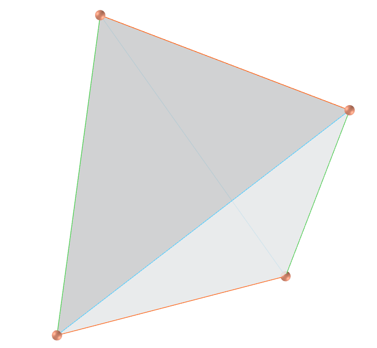</a>
  Um tetraedro isósceles é não regular e cada par de arestas opostas do poliedro são iguais, de modo que todas as faces triangulares são congruentes. Tetraedros isósceles são, portanto, isoedros. A única maneira de todas as faces de um tetraedro geral terem o mesmo perímetro ou a mesma área é serem totalmente congruentes, caso em que o tetraedro é isósceles. Um tetraedro é isósceles se a soma dos ângulos da face em cada vértice do poliedro é de 180&deg; e se sua esfera e circunsfera são concêntricas.
  <b>Faces:</b> 4 triângulos isósceles | <b>Arestas:</b> 6 | <b>Vértices:</b> 4. <a href="https://mathworld.wolfram.com/IsoscelesTetrahedron.html" target="_blank">Mais sobre...</a>

<h4>14. Dodecaedro Trapezo-Rômbico</h4>
<a href="../vr/trapezoidal_dodecahedron.htm" target="_blank" title="modelo 3D" class="fotoA">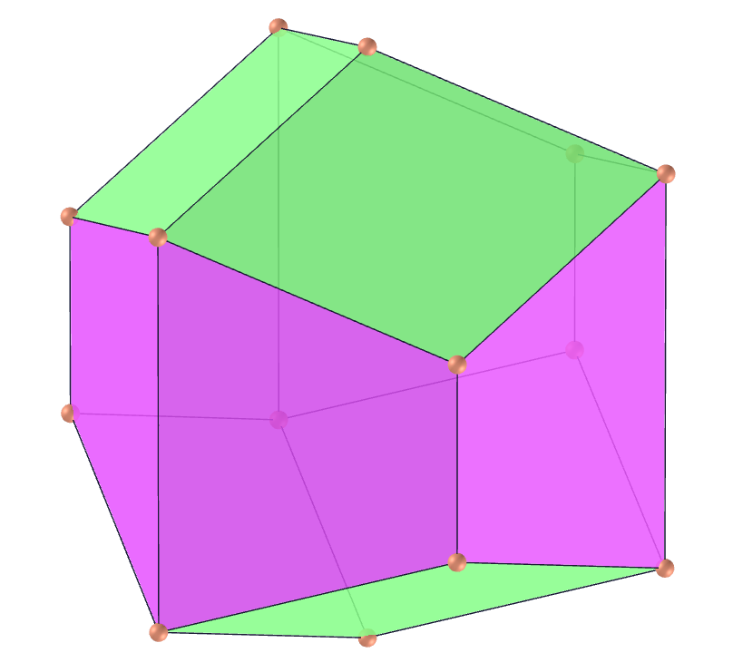</a>
  O dodecaedro trapezo-rômbico, também chamado de dodecaedro rombo-trapezoidal, é um dodecaedro geral que consiste em seis losangos idênticos e seis trapézios isósceles idênticos. O dodecaedro trapezo-rômbico pode ser obtido a partir do dodecaedro rômbico cortando-o ao meio e girando as duas metades 60&deg; uma em relação à outra. Os comprimentos das arestas curta e longa do dodecaedro girado têm comprimentos 2/3 e 4/3 vezes o comprimento das faces rômbicas.
  <b>Faces:</b> 6 losangos e 6 trapézios isósceles | <b>Arestas:</b> 24 | <b>Vértices:</b> 14. <a href="https://mathworld.wolfram.com/Trapezo-RhombicDodecahedron.html" target="_blank">Mais sobre...</a>

<a href="#p7" class="topo">voltar ao topo</a>

  Polyhedra de <a xmlns:cc="http://creativecommons.org/ns#" href="https://paulohscwb.github.io/polyhedra/" property="cc:attributionName" rel="cc:attributionURL">Paulo Henrique Siqueira</a> está licenciado com uma Licença <a rel="license" href="http://creativecommons.org/licenses/by-nc-nd/4.0/">Creative Commons Atribuição-NãoComercial-SemDerivações 4.0 Internacional</a>.

<h4>Como citar este trabalho:</h4> 

Siqueira, P.H., "Polyhedra". Disponível em: <https://paulohscwb.github.io/polyhedra/>, Setembro de 2019.

 <b>Referências:</b>
 Weisstein, Eric W. "Archimedean Solid" From MathWorld-A Wolfram Web Resource. <a href="http://mathworld.wolfram.com/ArchimedeanSolid.html" target="_blank">http://mathworld.wolfram.com/ArchimedeanSolid.html</a>
 Weisstein, Eric W. "Platonic Solid" From MathWorld-A Wolfram Web Resource. <a href="http://mathworld.wolfram.com/PlatonicSolid.html" target="_blank">http://mathworld.wolfram.com/PlatonicSolid.html</a>
 Weisstein, Eric W. "Archimedean Dual" From MathWorld-A Wolfram Web Resource. <a href="https://mathworld.wolfram.com/ArchimedeanDual.html" target="_blank">https://mathworld.wolfram.com/ArchimedeanDual.html</a>
 Weisstein, Eric W. "Uniform Polyhedron." From MathWorld--A Wolfram Web Resource. <a href="https://mathworld.wolfram.com/UniformPolyhedron.html" target="_blank">https://mathworld.wolfram.com/UniformPolyhedron.html</a>
 Wikipedia <a href="https://en.wikipedia.org/wiki/Archimedean_solid" target="_blank">https://en.wikipedia.org/wiki/Archimedean_solid</a>
 Wikipedia <a href="https://en.wikipedia.org/wiki/en.wikipedia.org/wiki/Platonic_solid" target="_blank">https://en.wikipedia.org/wiki/Platonic_solid</a>
 McCooey, David I. "Visual Polyhedra". <a href="http://dmccooey.com/polyhedra/" target="_blank">http://dmccooey.com/polyhedra/</a>
