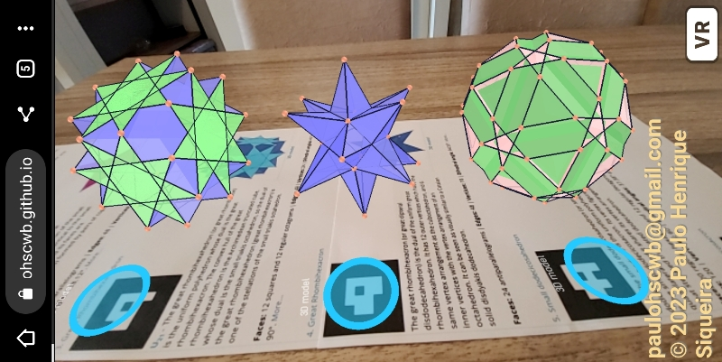
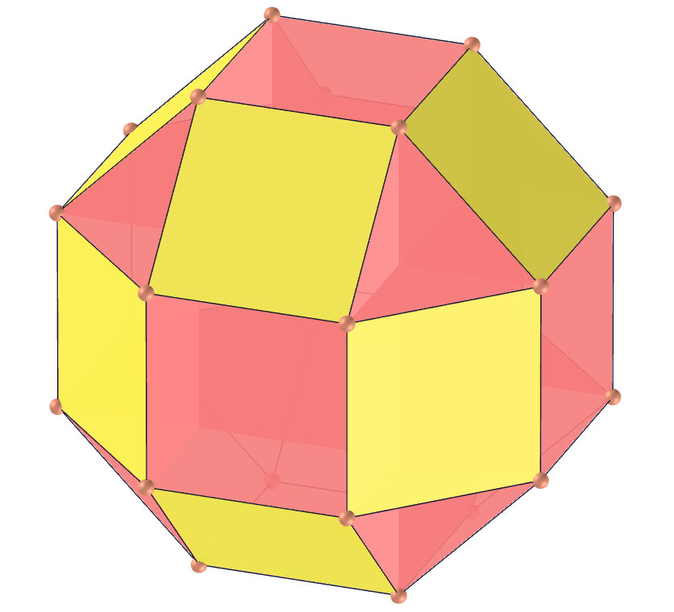
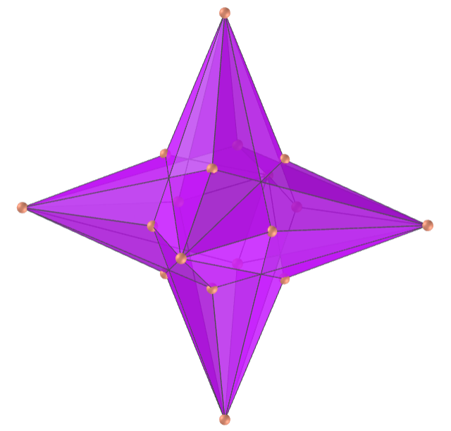
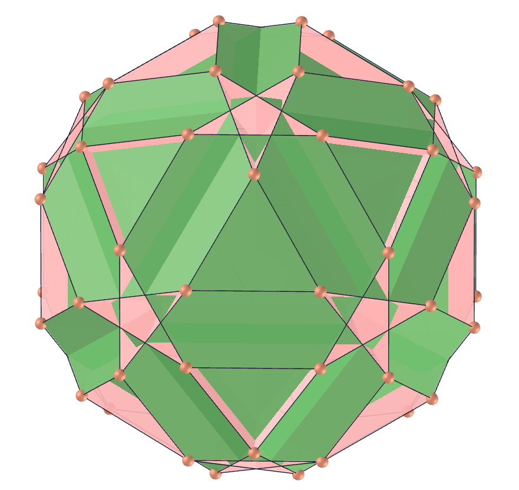
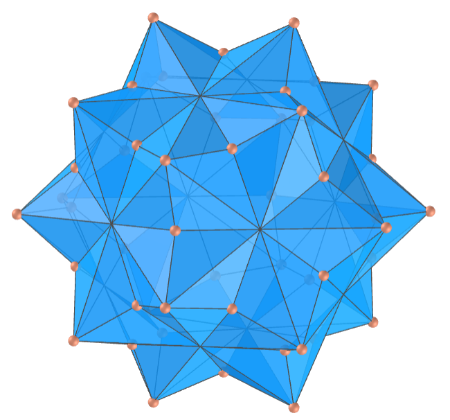

<link rel="stylesheet" href="scripts/style.css">
<h2>Visualization of polyhedra with Augmented Reality (AR) and Virtual Reality (VR) in A-frame</h2>
 <b>author:</b> Paulo Henrique Siqueira - Universidade Federal do Paraná
  <b>contact:</b> <a href="#">paulohscwb@gmail.com</a>
  <a href="https://paulohscwb.github.io/polyhedra/quasiregular/pt-br/">versão em português</a>
 <form style="margin: 0 auto; float:right; text-align:right; width:100%; margin-bottom:15px;">
	<select id="url" onchange="urlHandler(this.value)" style="color:royalblue;">
		<option disabled selected value>More polyhedra:</option>
		<option value="../archimedes/">Archimedes</option>
		<option value="../catalan/">Catalan</option>
		<option value="../nonconvex/">Non convex</option>
		<option value="../platonic/">Platonic</option>
		<option value="../polyhedron/">Prisms and antiprisms</option>
		<option disabled value="../quasiregular/">Quasi regular</option>
		<option value="../selfintersect/">Self-intersecting</option>
		<option value="../selfintersectsnub/">Self-intersecting snub</option>
		<option value="../selfintersecttruncated/">Self intersecting truncated</option>
		<option value="../johnson1/">Johnson: 1-32</option>
		<option value="../johnson2/">Johnson: 33-62</option>
		<option value="../johnson3/">Johnson: 63-92</option>
	</select>
</form>

  <h2 align="center"> Quasi regular polyhedra</h2>
A quasi regular polyhedron is a uniform polyhedron that has exactly two kinds of regular faces, which alternate around each vertex. To view quasi regular polyhedra in AR, simply visit:

<a href="ra.html" target="_blank">https://paulohscwb.github.io/polyhedra/quasiregular/ra.html</a>
 
with any browser with a webcam device (smartphone, tablet or notebook). 
 Access to the VR sites is done by clicking on the blue circle that appears on top of the marker.

<h4>1. Small rhombihexahedron</h4>

  U18 The small rhombihexahedron (or small rhombicube) is the uniform polyhedron whose dual is the small rhombihexacron. It is a faceted version of the small rhombicuboctahedron. The convex hull of the small rhombihexahedron is the Archimedean small rhombicuboctahedron, whose dual is the deltoidal icositetrahedron, so the dual of the small rhombihexahedron (small rhombihexacron) is one of the stellations of the deltoidal icositetrahedron.
  <b>Faces:</b> 12 squares and 12 regular octagons | <b>Edges:</b> 48 | <b>Vertices:</b> 24 | <b>Dihedral angles:</b> 45° and 90°. <a href="https://mathworld.wolfram.com/SmallRhombihexahedron.html" target="_blank">More...</a>

<h4>2. Small rhombihexacron</h4>
 
  The small rhombihexacron (or small dipteral disdodecahedron) is the dual polyhedron of the small rhombihexahedron. It is visually identical to the small hexacronic icositetrahedron and its faces are antiparallelograms (bowties) formed by pairs of coplanar triangles.
  <b>Faces:</b> 24 antiparallelograms | <b>Edges:</b> 48 | <b>Vertices:</b> 18 | <b>Dihedral angle:</b> 138.12°. <a href="https://en.wikipedia.org/wiki/Small_rhombihexacron" target="_blank">More...</a>

<h4>3. Great Rhombihexahedron</h4>

  U21 The great rhombihexahedron (or great rhombicube) is the uniform polyhedron whose dual is the great rhombihexacron. The convex hull of the great rhombihexahedron is the Archimedean truncated cube, whose dual is the small triakis octahedron, so the dual of the great rhombihexahedron (great rhombihexacron) is one of the stellations of the small triakis octahedron.
  <b>Faces:</b> 12 squares and 12 regular octagrams | <b>Edges:</b> 48 | <b>Vertices:</b> 24 | <b>Dihedral angles:</b> 45° and 90°. <a href="https://mathworld.wolfram.com/GreatRhombihexahedron.html" target="_blank">More...</a>

<h4>4. Great Rhombihexacron</h4>
 
  The great rhombihexacron (or great dipteral disdodecahedron) is the dual of the uniform great rhombihexahedron. It has 12 outer vertices which have the same vertex arrangement as the cuboctahedron, and 6 inner vertices with the vertex arrangement of an octahedron. It can be seen as visually similar to a Catalan solid disdyakis dodecahedron.
  <b>Faces:</b> 24 antiparallelograms | <b>Edges:</b> 48 | <b>Vertices:</b> 18 | <b>Dihedral angle:</b> 94.53°. <a href="https://en.wikipedia.org/wiki/Great_rhombihexacron" target="_blank">More...</a>

<h4>5. Small dodecicosahedron</h4>

  U50 The small dodecicosahedron (or small dodekicosahedron) is the uniform polyhedron whose dual is the small dodecicosacron. Its vertex figure is a crossed quadrilateral and it shares its vertex arrangement with the great stellated truncated dodecahedron.
  <b>Faces:</b> 20 regular hexagons and 12 regular decagons | <b>Edges:</b> 120 | <b>Vertices:</b> 60 | <b>Dihedral angles:</b> 37.38° and 79.19°. <a href="https://mathworld.wolfram.com/SmallDodecicosahedron.html" target="_blank">More...</a>

<h4>6. Small dodecicosacron</h4>
 
  The small dodecicosacron (or small dipteral trisicosahedron) is the dual of uniform polyhedron small dodecicosahedron. It is visually identical to the small ditrigonal dodecacronic hexecontahedron and part of each face lies inside the solid, hence is invisible in solid models.
  <b>Faces:</b> 60 antiparallelograms | <b>Edges:</b> 120 | <b>Vertices:</b> 32 | <b>Dihedral angle:</b> 146.23°. <a href="https://en.wikipedia.org/wiki/Small_dodecicosacron" target="_blank">More...</a>

<h4>7. Great dodecicosahedron</h4>

  U63 The great dodecicosahedron (or great dodekicosahedron) is the uniform polyhedron whose dual is the great dodecicosacron. Its vertex figure is a crossed quadrilateral and shares its vertex arrangement with the truncated dodecahedron. 
  <b>Faces:</b> 20 regular hexagons and 12 regular decagrams | <b>Edges:</b> 120 | <b>Vertices:</b> 60 | <b>Dihedral angles:</b> 37.38° and 100.81°. <a href="https://mathworld.wolfram.com/GreatDodecicosahedron.html" target="_blank">More...</a>

<h4>8. Great dodecicosacron</h4>
 
  The great dodecicosacron (or great dipteral trisicosahedron) is the dual of uniform polyhedron great dodecicosahedron. It has 60 intersecting bow-tie-shaped (antiparallelograms) faces and part of each face lies inside the solid, hence is invisible in solid models.
  <b>Faces:</b> 60 antiparallelograms | <b>Edges:</b> 120 | <b>Vertices:</b> 32 | <b>Dihedral angle:</b> 127.69°. <a href="https://en.wikipedia.org/wiki/Great_dodecicosacron" target="_blank">More...</a>

<h4>9. Small rhombidodecahedron</h4>

  U39 The small rhombidodecahedron is the uniform polyhedron whose dual is the small rhombidodecacron. It is a faceted version of the small rhombicosidodecahedron and its vertex figure is a crossed quadrilateral. It shares its vertex arrangement with the small stellated truncated dodecahedron and the uniform compounds of 6 or 12 pentagrammic prisms. 
  <b>Faces:</b> 30 squares and 12 regular decagons | <b>Edges:</b> 120 | <b>Vertices:</b> 60 | <b>Dihedral angles:</b> 31.72° and 121.72°. <a href="https://mathworld.wolfram.com/SmallRhombidodecahedron.html" target="_blank">More...</a>

<h4>10. Small rhombidodecacron</h4>
 
  The small rhombidodecacron is the dual of the small rhombidodecahedron. It is visually identical to the small dodecacronic hexecontahedron and it has 60 intersecting antiparallelogram faces. 
   <b>Faces:</b> 60 antiparallelograms | <b>Edges:</b> 120 | <b>Vertices:</b> 42 | <b>Dihedral angle:</b> 154.12°. <a href="https://en.wikipedia.org/wiki/Small_rhombidodecacron" target="_blank">More...</a>
 
<a href="#p6" class="topo">back to top</a>

 

<h4>11. Great rhombidodecahedron</h4>

  U73 The great rhombidodecahedron is the uniform polyhedron whose dual is the great rhombidodecacron. Its vertex figure is a crossed quadrilateral and it shares its vertex arrangement with the truncated great dodecahedron and the uniform compounds of 6 or 12 pentagonal prisms.
  <b>Faces:</b> 30 squares and 12 regular decagrams | <b>Edges:</b> 120 | <b>Vertices:</b> 60 | <b>Dihedral angles:</b> 31.72° and 58.28°. <a href="https://mathworld.wolfram.com/GreatRhombidodecahedron.html" target="_blank">More...</a>

<h4>12. Great rhombidodecacron</h4>
 
  The great rhombidodecacron (or great dipteral ditriacontahedron) is the dual of the great rhombidodecahedron. It is visually identical to the great deltoidal hexecontahedron and its faces are antiparallelograms. Part of each face lies inside the solid, hence is invisible in solid models.  
  <b>Faces:</b> 60 antiparallelograms | <b>Edges:</b> 120 | <b>Vertices:</b> 42 | <b>Dihedral angle:</b> 91.55°. <a href="https://en.wikipedia.org/wiki/Great_rhombidodecacron" target="_blank">More...</a>

<h4>13. Rhombicosahedron</h4>

  U56 The rhombicosahedron is the uniform polyhedron whose dual is the rhombicosacron. Its vertex figure is an antiparallelogram and it shares its vertex arrangement with the uniform compounds of 10 or 20 triangular prisms. It additionally shares its edges with the rhombidodecadodecahedron (having the square faces in common) and the icosidodecadodecahedron (having the hexagonal faces in common).
  <b>Faces:</b> 30 squares and 20 regular hexagons | <b>Edges:</b> 120 | <b>Vertices:</b> 60 | <b>Dihedral angles:</b> 20.91° and 110.91°. <a href="https://mathworld.wolfram.com/Rhombicosahedron.html" target="_blank">More...</a>

<h4>14. Rhombicosacron</h4>
 
  The rhombicosacron (or midly dipteral ditriacontahedron) is the dual of the uniform rhombicosahedron. It has crossed-quadrilateral (antiparallelograms) faces.  
  <b>Faces:</b> 60 antiparallelograms | <b>Edges:</b> 120 | <b>Vertices:</b> 50 | <b>Dihedral angle:</b> 135.58°. <a href="https://en.wikipedia.org/wiki/Rhombicosacron" target="_blank">More...</a>

<a href="#p6" class="topo">back to top</a>

  Polyhedra: Quasi regular by <a xmlns:cc="http://creativecommons.org/ns#" href="https://paulohscwb.github.io/polyhedra/quasiregular/" property="cc:attributionName" rel="cc:attributionURL">Paulo Henrique Siqueira</a> is licensed with a license <a rel="license" href="http://creativecommons.org/licenses/by-nc-nd/4.0/">Creative Commons Attribution-NonCommercial-NoDerivatives 4.0 International</a>.

<h4>How to cite this work:</h4> 

Siqueira, P.H., "Polyhedra: Quasi regular". Available in: <https://paulohscwb.github.io/polyhedra/quasiregular/>, January 2023.

 <b>References:</b>
 Weisstein, Eric W. "Archimedean Solid" From MathWorld-A Wolfram Web Resource. <a href="http://mathworld.wolfram.com/ArchimedeanSolid.html" target="_blank">http://mathworld.wolfram.com/ArchimedeanSolid.html</a>
 Weisstein, Eric W. "Platonic Solid" From MathWorld-A Wolfram Web Resource. <a href="http://mathworld.wolfram.com/PlatonicSolid.html" target="_blank">http://mathworld.wolfram.com/PlatonicSolid.html</a>
 Weisstein, Eric W. "Archimedean Dual" From MathWorld-A Wolfram Web Resource. <a href="https://mathworld.wolfram.com/ArchimedeanDual.html" target="_blank">https://mathworld.wolfram.com/ArchimedeanDual.html</a>
 Weisstein, Eric W. "Uniform Polyhedron." From MathWorld--A Wolfram Web Resource. <a href="https://mathworld.wolfram.com/UniformPolyhedron.html" target="_blank">https://mathworld.wolfram.com/UniformPolyhedron.html</a>
 Wikipedia <a href="https://en.wikipedia.org/wiki/Archimedean_solid" target="_blank">https://en.wikipedia.org/wiki/Archimedean_solid</a>
 Wikipedia <a href="https://en.wikipedia.org/wiki/en.wikipedia.org/wiki/Platonic_solid" target="_blank">https://en.wikipedia.org/wiki/Platonic_solid</a>
 McCooey, David I. "Visual Polyhedra". <a href="http://dmccooey.com/polyhedra/" target="_blank">http://dmccooey.com/polyhedra/</a>
