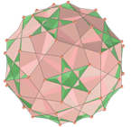
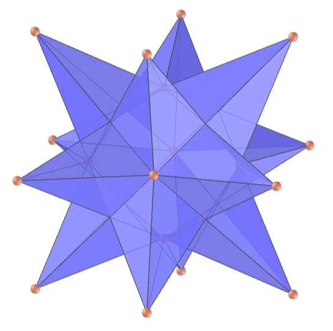
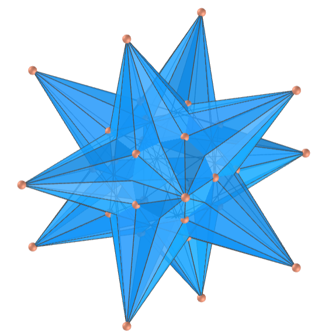
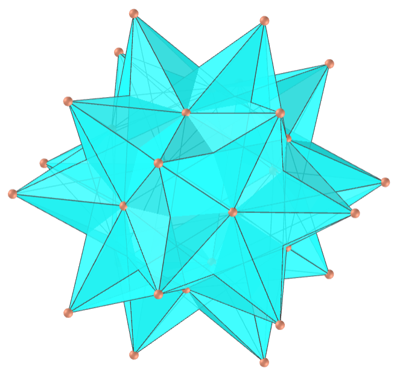
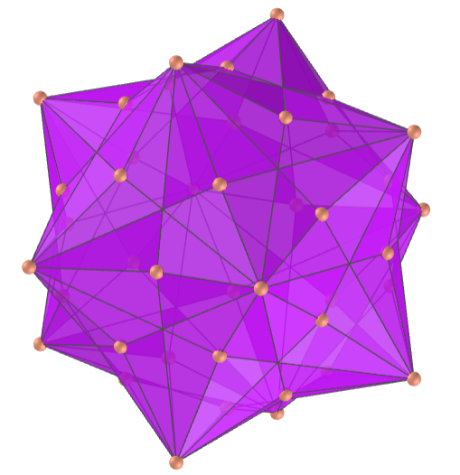
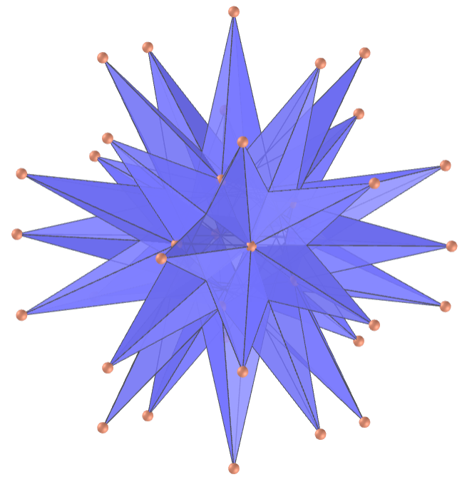

<link rel="stylesheet" href="../../scripts/style.css">
<link rel="icon" type="image/png" href="../vr/salas/imagens/icone.png">
<h2>Visualização de poliedros com Realidade Aumentada (RA) e Realidade Virtual (RV) em A-frame</h2>
<b>autor:</b> Paulo Henrique Siqueira - Universidade Federal do Paraná
 <b>contato:</b> <a href="#"> paulohscwb@gmail.com </a>
 <a href="https://paulohscwb.github.io/polyhedra/quasiregular/">english version</a>
<form style="margin: 0 auto; float:right; text-align:right; width:100%; margin-bottom:15px;">
	<a href="../../pt-br/">Página Inicial</a>
	 <select id="url" onchange="urlHandler(this.value)" style="color:royalblue;">
		<option disabled selected>Mais poliedros:</option>
		<option value="../../archimedes/pt-br/">Arquimedes</option>
		<option value="../../catalan/pt-br/">Catalan</option>
		<option value="../../nonconvex/pt-br/">Não convexos</option>
		<option value="../../platonic/pt-br/">Platão</option>
		<option value="../../polyhedron/pt-br/">Prismas e antiprismas</option>
		<option disabled value="../../quasiregular/pt-br/">Quase regulares</option>
		<option value="../../selfintersect/pt-br/">Auto-interseção</option>
		<option value="../../selfintersectsnub/pt-br/">Auto-interseção snub</option>
		<option value="../../selfintersecttruncated/pt-br/">Auto-interseção truncados</option>
		<option value="../../johnson1/pt-br/">Johnson: 1-32</option>
		<option value="../../johnson2/pt-br/">Johnson: 33-62</option>
		<option value="../../johnson3/pt-br/">Johnson: 63-92</option>
	</select>
</form>

  <h2 align="center"> Poliedros quase regulares</h2>
  Um poliedro quase regular é um poliedro uniforme que tem exatamente dois tipos de faces regulares, que se alternam em torno de cada vértice. 
  

  Para visualizar os poliedros quase regulares em RA, visite a página:

<a href="../ra.html" target="_blank">https://paulohscwb.github.io/polyhedra/quasiregular/ra.html</a>
 
com qualquer navegador com um dispositivo de webcam (smartphone, tablet ou notebook).
 O acesso às páginas de RV é feito clicando no círculo azul que aparece em cima de cada marcador.

 

<h4>1. Pequeno rombihexaedro</h4>

  U18 O pequeno rombihexaedro (ou grande rombocubo) é o poliedro uniforme cujo dual é o pequeno rombihexacron. É uma versão facetada do pequeno rombicuboctaedro. O casco convexo do pequeno rombihexaedro é o pequeno rombicuboctaedro arquimediano, cujo dual é o icossitotraedro deltoidal, portanto o dual do pequeno rombihexaedro (pequeno rombihexacro) é uma das estrelas do icossitotraedro deltoidal.
  <b>Faces:</b> 12 quadrados e 6 octógonos regulares | <b>Arestas:</b> 48 | <b>Vértices:</b> 24 | <b>Ângulos diédricos:</b> 45° e 90°. <a href="https://mathworld.wolfram.com/SmallRhombihexahedron.html" target="_blank">Mais sobre...</a>

<h4>2. Pequeno rombihexacro</h4>
 
  O pequeno rombihexacro (ou pequeno disdodecaedro dipteral) é o poliedro dual do pequeno rombihexaedro. É visualmente idêntico ao pequeno icositetraedro hexacrônico e suas faces são antiparalelogramos (laços) formados por pares de triângulos coplanares.
  <b>Faces:</b> 24 antiparalelogramos | <b>Arestas:</b> 48 | <b>Vértices:</b> 18 | <b>Ângulo diédrico:</b> 138.12°. <a href="https://en.wikipedia.org/wiki/Small_rhombihexacron" target="_blank">Mais sobre...</a>

<h4>3. Grande rombihexaedro</h4>

  U21 O grande rombihexaedro (ou grande rombocubo) é o poliedro uniforme cujo dual é o grande rombihexacro. O casco convexo do grande rombihexaedro é o cubo arquimediano truncado, cujo dual é o pequeno triakis octaedro, portanto o dual do grande rombihexaedro (grande rombihexacro) é uma das estrelas do pequeno triakis octaedro.
  <b>Faces:</b> 12 quadrados e 6 octagramas regulares | <b>Arestas:</b> 48 | <b>Vértices:</b> 24 | <b>Ângulos diédricos:</b> 45° e 90°. <a href="https://mathworld.wolfram.com/GreatRhombihexahedron.html" target="_blank">Mais sobre...</a>

<h4>4. Grande rombihexacro</h4>
 
  O grande rombihexacro (ou grande disdodecaedro dipteral) é o dual do grande rombihexaedro uniforme. Possui 12 vértices externos que têm o mesmo arranjo de vértices do cuboctaedro e 6 vértices internos com o arranjo de vértices de um octaedro. Pode ser considerado como visualmente semelhante ao sólido de Catalan dodecaedro disdyakis.
  <b>Faces:</b> 24 antiparalelogramos | <b>Arestas:</b> 48 | <b>Vértices:</b> 18 | <b>Ângulo diédrico:</b> 94.53°. <a href="https://en.wikipedia.org/wiki/Great_rhombihexacron" target="_blank">Mais sobre...</a>

<h4>5. Pequeno dodecicosaedro</h4>

  U50 O pequeno dodecicosaedro (ou pequeno dodequicosaedro) é o poliedro uniforme cujo dual é o pequeno dodecicosacron. Sua figura de vértice é um quadrilátero cruzado e compartilha seu arranjo de vértice com o grande dodecaedro truncado estrelado.
  <b>Faces:</b> 20 hexágonos regulares e 12 decágonos regulares | <b>Arestas:</b> 120 | <b>Vértices:</b> 60 | <b>Ângulos diédricos:</b> 37.38° e 79.19°. <a href="https://mathworld.wolfram.com/SmallDodecicosahedron.html" target="_blank">Mais sobre...</a>

<h4>6. Pequeno dodecicosacrono</h4>
 
  O pequeno dodecicosacrono (ou pequeno trisicosaedro dipteral) é dual do poliedro uniforme pequeno dodecicosaedro. É visualmente idêntico ao pequeno hexecontaedro dodecacrônico ditrigonal e parte de cada face está dentro do sólido, portanto, é invisível em modelos sólidos.
  <b>Faces:</b> 60 antiparalelogramos | <b>Arestas:</b> 120 | <b>Vértices:</b> 32 | <b>Ângulo diédrico:</b> 146.23°. <a href="https://en.wikipedia.org/wiki/Small_dodecicosacron" target="_blank">Mais sobre...</a>

<h4>7. Grande dodecicosaedro</h4>

  U63 O grande dodecicosaedro (ou grande dodequicosaedro) é o poliedro uniforme cujo dual é o grande dodecicosacron. Sua figura de vértice é um quadrilátero cruzado e compartilha seu arranjo de vértice com o dodecaedro truncado.
  <b>Faces:</b> 20 hexágonos regulares e 12 decagramas regulares | <b>Arestas:</b> 120 | <b>Vértices:</b> 60 | <b>Ângulos diédricos:</b> 37.38° e 100.81°. <a href="https://mathworld.wolfram.com/GreatDodecicosahedron.html" target="_blank">Mais sobre...</a>

<h4>8. Grande dodecicosacrono</h4>
 
  O grande dodecicosacrono (ou grande trisicosaedro dipteral) é o dual do poliedro uniforme grande dodecicosaedro. Ele tem 60 faces em forma de laço (antiparalelogramos) que se cruzam e parte de cada face fica dentro do sólido, portanto, é invisível em modelos sólidos.
  <b>Faces:</b> 60 antiparalelogramos | <b>Arestas:</b> 120 | <b>Vértices:</b> 32 | <b>Ângulo diédrico:</b> 127.69°. <a href="https://en.wikipedia.org/wiki/Great_dodecicosacron" target="_blank">Mais sobre...</a>

<h4>9. Pequeno rombidodecaedro</h4>

  U39 O pequeno rombidodecaedro é o poliedro uniforme cujo dual é o pequeno rombidodecácrono. É uma versão facetada do pequeno rombicosidodecaedro e sua figura de vértice é um quadrilátero cruzado. Ele compartilha seu arranjo de vértice com o pequeno dodecaedro estrelado truncado e os compostos uniformes de 6 ou 12 prismas pentagrâmicos.
  <b>Faces:</b> 30 quadrados e 12 decágonos regulares | <b>Arestas:</b> 120 | <b>Vértices:</b> 60 | <b>Ângulos diédricos:</b> 31.72° e 121.72°. <a href="https://mathworld.wolfram.com/SmallRhombidodecahedron.html" target="_blank">Mais sobre...</a>

<h4>10. Pequeno rombidodecácrono</h4>
 
  O pequeno rombidodecácrono é o dual do pequeno rombidodecaedro. É visualmente idêntico ao pequeno hexecontaedro dodecacrônico e tem 60 faces de antiparalelogramos que se cruzam.
   <b>Faces:</b> 60 antiparalelogramos | <b>Arestas:</b> 120 | <b>Vértices:</b> 42 | <b>Ângulo diédrico:</b> 154.12°. <a href="https://en.wikipedia.org/wiki/Small_rhombidodecacron" target="_blank">Mais sobre...</a>

<a href="#p6" class="topo">voltar ao topo</a>

<h4>11. Grande rombidodecaedro</h4>

  U73 O grande rombidodecaedro é o poliedro uniforme cujo dual é o grande rombidodecacron. Sua figura de vértice é um quadrilátero cruzado e compartilha seu arranjo de vértice com o grande dodecaedro truncado e os compostos uniformes de 6 ou 12 prismas pentagonais.
  <b>Faces:</b> 30 quadrados e 12 decagramas regulares | <b>Arestas:</b> 120 | <b>Vértices:</b> 60 | <b>Ângulos diédricos:</b> 31.72° e 58.28°. <a href="https://mathworld.wolfram.com/GreatRhombidodecahedron.html" target="_blank">Mais sobre...</a>

<h4>12. Grande rombidodecácrono</h4>
 
  O grande rombidodecácrono (ou grande ditriacontaedro dipteral) é o dual do grande rombidodecaedro. É visualmente idêntico ao grande hexecontaedro deltoidal e suas faces são antiparalelogramos. Parte de cada face está dentro do sólido, portanto, é invisível em modelos sólidos.
  <b>Faces:</b> 60 antiparalelogramos | <b>Arestas:</b> 120 | <b>Vértices:</b> 42 | <b>Ângulo diédrico:</b> 91.55°. <a href="https://en.wikipedia.org/wiki/Great_rhombidodecacron" target="_blank">Mais sobre...</a>

<h4>13. Rombicosaedro</h4>

  U56 O rombicosaedro é o poliedro uniforme cujo  dual é o rombicosacron. Sua figura de vértice é um antiparalelogramo e compartilha seu arranjo de vértice com os compostos uniformes de 10 ou 20 prismas triangulares. Além disso, compartilha suas arestas com o rombidodecadodecaedro (tendo as faces quadradas em comum) e o icosidodecadodecaedro (tendo as faces hexagonais em comum).
  <b>Faces:</b> 30 quadrados e 20 hexágonos regulares | <b>Arestas:</b> 120 | <b>Vértices:</b> 60 | <b>Ângulos diédricos:</b> 20.91° e 110.91°. <a href="https://mathworld.wolfram.com/Rhombicosahedron.html" target="_blank">Mais sobre...</a>

<h4>14. Rombicosacro</h4>
 
  O rombicosacro (ou ditriacontaedro dipteral mediano) é o dual do rombicosaedro uniforme. Possui faces quadrilaterais cruzadas (antiparalelogramos).
  <b>Faces:</b> 60 antiparalelogramos | <b>Arestas:</b> 120 | <b>Vértices:</b> 50 | <b>Ângulo diédrico:</b> 135.58°. <a href="https://en.wikipedia.org/wiki/Rhombicosacron" target="_blank">Mais sobre...</a>

<a href="#p6" class="topo">voltar ao topo</a>

 
  Polyhedra: Quasi regular  de <a xmlns:cc="http://creativecommons.org/ns#" href="https://paulohscwb.github.io/polyhedra/quasiregular/" property="cc:attributionName" rel="cc:attributionURL">Paulo Henrique Siqueira</a> está licenciado com uma Licença <a rel="license" href="http://creativecommons.org/licenses/by-nc-nd/4.0/">Creative Commons Atribuição-NãoComercial-SemDerivações 4.0 Internacional</a>.

<h4>Como citar este trabalho:</h4> 

Siqueira, P.H., "Polyhedra: Quasi regular". Disponível em: <https://paulohscwb.github.io/polyhedra/quasiregular/>, Janeiro de 2023.

 <b>Referências:</b>
 Weisstein, Eric W. "Archimedean Solid" From MathWorld-A Wolfram Web Resource. <a href="http://mathworld.wolfram.com/ArchimedeanSolid.html" target="_blank">http://mathworld.wolfram.com/ArchimedeanSolid.html</a>
 Weisstein, Eric W. "Platonic Solid" From MathWorld-A Wolfram Web Resource. <a href="http://mathworld.wolfram.com/PlatonicSolid.html" target="_blank">http://mathworld.wolfram.com/PlatonicSolid.html</a>
 Weisstein, Eric W. "Archimedean Dual" From MathWorld-A Wolfram Web Resource. <a href="https://mathworld.wolfram.com/ArchimedeanDual.html" target="_blank">https://mathworld.wolfram.com/ArchimedeanDual.html</a>
 Weisstein, Eric W. "Uniform Polyhedron." From MathWorld--A Wolfram Web Resource. <a href="https://mathworld.wolfram.com/UniformPolyhedron.html" target="_blank">https://mathworld.wolfram.com/UniformPolyhedron.html</a>
 Wikipedia <a href="https://en.wikipedia.org/wiki/Archimedean_solid" target="_blank">https://en.wikipedia.org/wiki/Archimedean_solid</a>
 Wikipedia <a href="https://en.wikipedia.org/wiki/en.wikipedia.org/wiki/Platonic_solid" target="_blank">https://en.wikipedia.org/wiki/Platonic_solid</a>
 McCooey, David I. "Visual Polyhedra". <a href="http://dmccooey.com/polyhedra/" target="_blank">http://dmccooey.com/polyhedra/</a>
