<link rel="stylesheet" href="../scripts/style.css">
<link rel="icon" type="image/png" href="./vr/salas/imagens/icone.png?">
<h2>Visualization of polyhedra with Augmented Reality (AR) and Virtual Reality (VR) in A-frame</h2>
 <b>author:</b> Paulo Henrique Siqueira - Universidade Federal do Paraná
  <b>contact:</b> <a href="#">paulohscwb@gmail.com</a>
  <a href="https://paulohscwb.github.io/polyhedra/selfintersect/pt-br/">versão em português</a>
<form style="margin: 0 auto; float:right; text-align:right; width:100%; margin-bottom:15px;">
	<select id="url" onchange="urlHandler(this.value)" style="color:royalblue;">
		<option disabled selected value>More polyhedra:</option>
		<option value="../archimedes/">Archimedes</option>
		<option value="../catalan/">Catalan</option>
		<option value="../nonconvex/">Non convex</option>
		<option value="../platonic/">Platonic</option>
		<option value="../polyhedron/">Prisms and antiprisms</option>
		<option value="../quasiregular/">Quasi regular</option>
		<option disabled value="../selfintersect/">Self-intersecting</option>
		<option value="../selfintersectsnub/">Self-intersecting snub</option>
		<option value="../selfintersecttruncated/">Self intersecting truncated</option>
		<option value="../johnson1/">Johnson: 1-32</option>
		<option value="../johnson2/">Johnson: 33-62</option>
		<option value="../johnson3/">Johnson: 63-92</option>
	</select>
</form>

  <h2 align="center"> Self-intersecting polyhedra</h2>
The self-intersecting polyhedra may either have self-intersecting faces, or self-intersecting vertex figures. 

<a href="#ra">Augmented Reality</a>&nbsp;&nbsp;|&nbsp;&nbsp;<a href="#m3d">3D Models</a>&nbsp;&nbsp;|&nbsp;&nbsp;<a href="../">Home</a>

  <h3 align="center">Immersive rooms</h3>
  
<iframe width="100%" src="sala1.htm" title="Sala Imersiva de poliedros de auto-interseção" frameborder="0" loading="lazy"></iframe>

  
<a href="sala1.htm" target="_blank">&#x1f517; room 1</a>&nbsp;&nbsp;|&nbsp;&nbsp;<a href="sala2.htm" target="_blank">&#x1f517; room 2</a>&nbsp;&nbsp;|&nbsp;&nbsp;<a href="sala3.htm" target="_blank">&#x1f517; room 3</a>

  <!--

-->

  <h3 id="ra" align="center">Augmented Reality</h3>
To view self-intersecting polyhedra in AR, simply visit:

<a href="ra.html" target="_blank">https://paulohscwb.github.io/polyhedra/selfintersect/ra.html</a>
 
with any browser with a webcam device (smartphone, tablet or notebook). 
 Access to 3D models pages is done by clicking on the blue circle that appears on top of the marker.

<h3 id="m3d" align="center">3D models</h3>
<iframe width="560" height="315" style="max-width:100%" src="https://www.youtube.com/embed/videoseries?list=PLy0I_lGW8HxUjI1zr4s0lYhyLANZl3GOW" title="YouTube video player" frameborder="0" allow="accelerometer; autoplay; clipboard-write; encrypted-media; gyroscope; picture-in-picture; web-share" allowfullscreen></iframe>
<h4>1. Ditrigonal dodecahedron</h4>
 
  U41 The ditrigonal dodecahedron (or ditrigonary dodecadodecahedron) is a nonconvex uniform polyhedron whose dual is the medial triambic icosahedron. It is a faceted version of the small ditrigonal icosidodecahedron. 
  <b>Faces:</b> 12 regular pentagons and 12 regular pentagrams | <b>Edges:</b> 60 | <b>Vertices:</b> 20 | <b>Dihedral angle:</b> 63.43°. <a href="https://mathworld.wolfram.com/DitrigonalDodecadodecahedron.html" target="_blank">More...</a>
 

<h4>2. Medial Triambic Icosahedron</h4>
 <a href="vr/medial_triambic_icosahedron.htm" target="_blank" title="3D model" class="fotoA">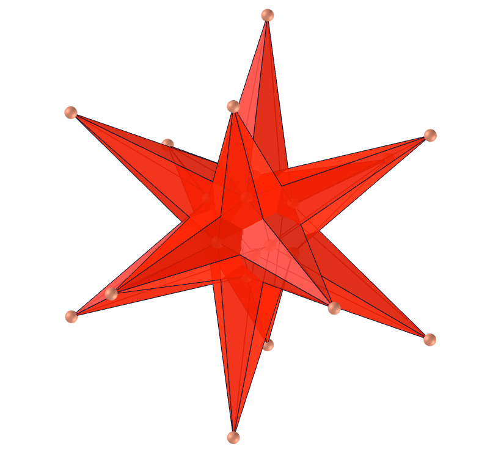</a>
  The medial triambic icosahedron is the dual polyhedron of the ditrigonal dodecadodecahedron whose outward appearance is the same as the great triambic icosahedron (the dual of the great ditrigonal icosidodecahedron), since the internal vertices are hidden from view. The medial triambic icosahedron has hidden pentagrammic faces, while the great triambic icosahedron has hidden triangular faces.  
  <b>Faces:</b> 20 triambi | <b>Edges:</b> 60 | <b>Vertices:</b> 24 | <b>Dihedral angle:</b> 109.47°. <a href="https://mathworld.wolfram.com/MedialTriambicIcosahedron.html" target="_blank">More...</a>
 

<h4>3. Small Ditrigonal Icosidodecahedron</h4>
 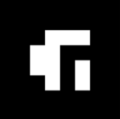
  U30 The small ditrigonal icosidodecahedron is a nonconvex uniform polyhedron whose dual polyhedron is the small triambic icosahedron. A faceted version is the ditrigonal dodecadodecahedron. The convex hull of the small ditrigonal icosidodecahedron is a regular dodecahedron, whose dual is the icosahedron, so the dual of the great ditrigonal dodecicosidodecahedron (the small triambic icosahedron) is one of the icosahedron stellations. 
  <b>Faces:</b> 20 equilateral triangles and 12 regular pentagrams | <b>Edges:</b> 60 | <b>Vertices:</b> 20 | <b>Dihedral angle:</b> 142.62°. <a href="https://mathworld.wolfram.com/SmallDitrigonalIcosidodecahedron.html" target="_blank">More...</a>
 

<h4>4. Small Triambic Icosahedron</h4>
 <a href="vr/small_triambic_icosahedron.htm" target="_blank" title="3D model" class="fotoA">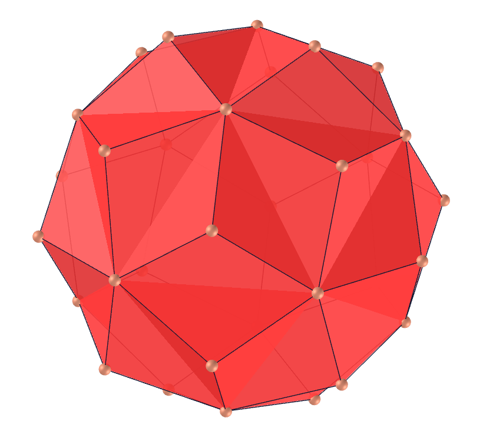</a>
  The small triambic icosahedron is the dual polyhedron of the small ditrigonal icosidodecahedron. It can be constructed by augmentation of a unit edge-length icosahedron by pyramids. The convex hull of the small ditrigonal icosidodecahedron is a regular dodecahedron whose dual is the icosahedron, so the dual of the small ditrigonal icosidodecahedron (i.e., the small triambic icosahedron) is one of the icosahedron stellations.
  <b>Faces:</b> 20 pentagons | <b>Edges:</b> 60 | <b>Vertices:</b> 32 | <b>Dihedral angle:</b> 109.47°. <a href="https://mathworld.wolfram.com/SmallTriambicIcosahedron.html" target="_blank">More...</a>
 

<h4>5. Great Ditrigonal Icosidodecahedron</h4>
 
  U47 The great ditrigonal icosidodecahedron is the uniform polyhedron whose dual is the great triambic icosahedron. The convex hull of the great triambic icosahedron is a regular dodecahedron, whose dual is the icosahedron, so the dual of the great ditrigonal icosidodecahedron (the great triambic icosahedron) is one of the icosahedron stellations. 
  <b>Faces:</b> 20 equilateral triangles and 12 regular pentagons | <b>Edges:</b> 60 | <b>Vertices:</b> 20 | <b>Dihedral angle:</b> 79.19°. <a href="https://mathworld.wolfram.com/GreatDitrigonalIcosidodecahedron.html" target="_blank">More...</a>
 

<h4>6. Great Triambic Icosahedron</h4>
 
  The great triambic icosahedron is the dual of the great ditrigonal icosidodecahedron whose appearance is the same as the medial triambic icosahedron (the dual of the ditrigonal dodecadodecahedron), since internal vertices are hidden from view. The medial triambic icosahedron has hidden pentagrammic faces, while the great triambic icosahedron has hidden triangular faces. 
  <b>Faces:</b> 20 triambis | <b>Edges:</b> 60 | <b>Vertices:</b> 32 | <b>Dihedral angle:</b> 109.47°. <a href="https://mathworld.wolfram.com/GreatTriambicIcosahedron.html" target="_blank">More...</a>
 

<h4>7. Dodecadodecahedron</h4>
 
  U36 The dodecadodecahedron is the uniform polyhedron whose dual polyhedron is the medial rhombic triacontahedron. Its dual polyhedron is also called the small stellated triacontahedron. It can be obtained by truncating a great dodecahedron or faceting a icosidodecahedron with pentagons and covering remaining open spaces with pentagrams.
  <b>Faces:</b> 12 regular pentagons and 12 regular pentagrams | <b>Edges:</b> 60 | <b>Vertices:</b> 30 | <b>Dihedral angle:</b> 116.57°. <a href="https://mathworld.wolfram.com/Dodecadodecahedron.html" target="_blank">More...</a>
 

<h4>8. Medial Rhombic Triacontahedron</h4>
 <a href="vr/medial_rhombic_triacontahedron.htm" target="_blank" title="3D model" class="fotoA">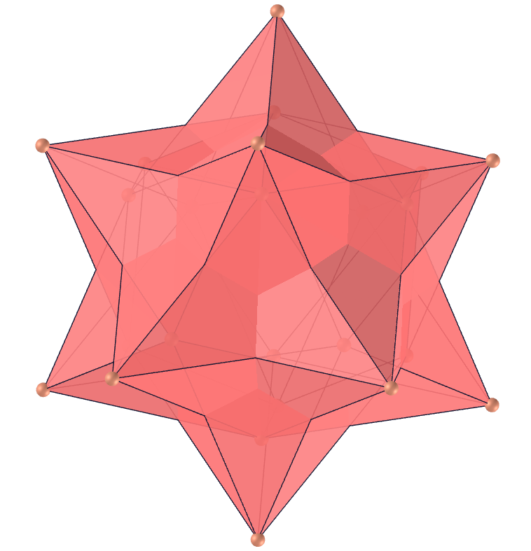</a>
  The medial rhombic triacontahedron is a zonohedron which is the dual of the dodecadodecahedron. The medial rhombic triacontahedron contains interior pentagrammic vertices which are, however, hidden from view. The solid is also called the small stellated triacontahedron.
  <b>Faces:</b> 30 rhombi | <b>Edges:</b> 60 | <b>Vertices:</b> 24 | <b>Dihedral angle:</b> 120°. <a href="https://mathworld.wolfram.com/MedialRhombicTriacontahedron.html" target="_blank">More...</a>
 

<h4>9. Great Icosidodecahedron</h4>
 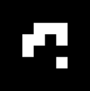
  U54 The great icosidodecahedron is the uniform polyhedron whose dual is the great rhombic triacontahedron. It is a stellated Archimedean solid. Its circumradius for unit edge length is R=&phi;-1, where &phi; is the golden ratio. 
  <b>Faces:</b> 20 equilateral triangles and 12 regular pentagrams | <b>Edges:</b> 60 | <b>Vertices:</b> 30 | <b>Dihedral angle:</b> 100.81°. <a href="https://mathworld.wolfram.com/GreatIcosidodecahedron.html" target="_blank">More...</a>
 

<h4>10. Great Rhombic Triacontahedron</h4>
 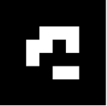
  The great rhombic triacontahedron, also called the great stellated triacontahedron, is a zonohedron which is the dual of the great icosidodecahedron. It is one of the rhombic triacontahedron stellations. It appears together with an isometric projection of the 5-hypercube on the cover of Coxeter's well-known book on polytopes.
  <b>Faces:</b> 30 rhombi | <b>Edges:</b> 60 | <b>Vertices:</b> 32 | <b>Dihedral angle:</b> 72°. <a href="https://mathworld.wolfram.com/GreatRhombicTriacontahedron.html" target="_blank">More...</a>
 
<a href="#p5" class="topo">back to top</a>

 

 <h4>11. Small Cubicuboctahedron</h4>
 
  U13 The small cubicuboctahedron is the uniform polyhedron whose dual polyhedron is the small hexacronic icositetrahedron. Faceted versions include the uniform great rhombicuboctahedron and small rhombihexahedron. The convex hull of the small cubicuboctahedron is the Archimedean small rhombicuboctahedron. 
  <b>Faces:</b> 8 equilateral triangles, 6 squares and 6 regular octagons | <b>Edges:</b> 48 | <b>Vertices:</b> 24 | <b>Dihedral angles:</b> 90° and 300.26°. <a href="https://mathworld.wolfram.com/SmallCubicuboctahedron.html" target="_blank">More...</a>
 

<h4>12. Small Hexacronic Icositetrahedron</h4>
 <a href="vr/small_hexacronic_icositetrahedron.htm" target="_blank" title="3D model" class="fotoA">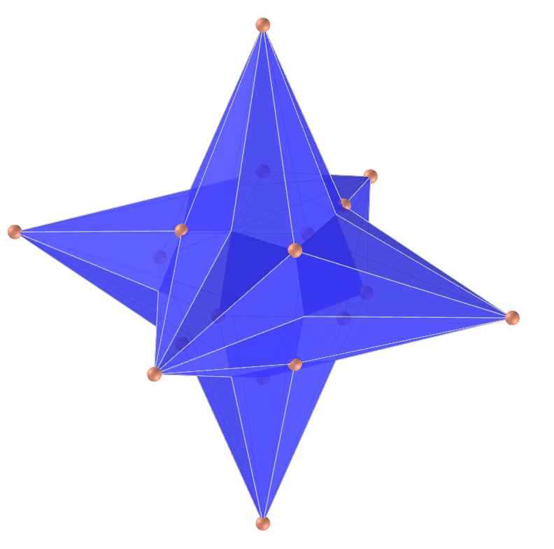</a>
  The small hexacronic icositetrahedron is the dual of uniform polyhedron small cubicuboctahedron. It appears the same as the small rhombihexacron. A part of each dart lies inside the solid, hence is invisible in solid models.
  <b>Faces:</b> 24 darts | <b>Edges:</b> 48 | <b>Vertices:</b> 20 | <b>Dihedral angle:</b> 138.12°. <a href="https://en.wikipedia.org/wiki/Small_hexacronic_icositetrahedron" target="_blank">More...</a>
 

 <h4>13. Great Cubicuboctahedron</h4>
 
  U14 The great cubicuboctahedron is the uniform polyhedron whose dual polyhedron is the great hexacronic icositetrahedron. It is a faceted version of the cube. The convex hull of the great cubicuboctahedron is the Archimedean truncated cube.
  <b>Faces:</b> 8 equilateral triangles, 6 squares and 6 regular octagrams | <b>Edges:</b> 48 | <b>Vertices:</b> 24 | <b>Dihedral angles:</b> 90° and 125.26°. <a href="https://mathworld.wolfram.com/GreatCubicuboctahedron.html" target="_blank">More...</a>
 

<h4>14. Great Hexacronic Icositetrahedron</h4>
 
  The great hexacronic icositetrahedron is the dual of the great cubicuboctahedron. Its faces are kites, and part of each kite lies inside the solid, hence is invisible in solid models. 
  <b>Faces:</b> 24 kites | <b>Edges:</b> 48 | <b>Vertices:</b> 20 | <b>Dihedral angle:</b> 94.53°. <a href="https://en.wikipedia.org/wiki/Great_hexacronic_icositetrahedron" target="_blank">More...</a>
 

 <h4>15. Uniform Great Rhombicuboctahedron</h4>
 
  U17 The uniform great rhombicuboctahedron is the uniform polyhedron, also known as the quasirhombicuboctahedron, whose dual is the great deltoidal icositetrahedron. This model shares its name with the large convex rhombicuboctahedron, also called the truncated cuboctahedron.
  <b>Faces:</b> 8 equilateral triangles and 18 squares | <b>Edges:</b> 48 | <b>Vertices:</b> 24 | <b>Dihedral angles:</b> 45° and 324.74°. <a href="https://mathworld.wolfram.com/UniformGreatRhombicuboctahedron.html" target="_blank">More...</a>
 

<h4>16. Great Deltoidal Icositetrahedron</h4>
 
  The great deltoidal icositetrahedron (or great sagittal disdodecahedron) is the dual of the uniform great rhombicuboctahedron. Its faces are darts, and part of each dart lies inside the solid, hence is invisible in solid models. One of its halves can be rotated by 45&deg; to form the pseudo great deltoidal icositetrahedron, analogous to the pseudo-deltoidal icositetrahedron.  
  <b>Faces:</b> 24 darts | <b>Edges:</b> 48 | <b>Vertices:</b> 26 | <b>Dihedral angle:</b> 94.53°. <a href="https://en.wikipedia.org/wiki/Great_deltoidal_icositetrahedron" target="_blank">More...</a>

 <h4>17. Small Dodecicosidodecahedron</h4>
 
  U33 The small dodecicosidodecahedron is the uniform polyhedron whose dual polyhedron is the small dodecacronic hexecontahedron. It is a faceted version of the small rhombicosidodecahedron. The small dodecicosidodecahedron appears on the cover of book "Computer Science with Mathematica" by Roman E. Maeder (1999). 
  <b>Faces:</b> 20 equilateral triangles, 12 regular pentagons and 12 regular decagons | <b>Edges:</b> 120 | <b>Vertices:</b> 60 | <b>Dihedral angles:</b> 116.57° and 322.62°. <a href="https://mathworld.wolfram.com/SmallDodecicosidodecahedron.html" target="_blank">More...</a>

<h4>18. Small Dodecacronic Hexecontahedron</h4>
 <a href="vr/small_dodecacronic_hexecontahedron.htm" target="_blank" title="3D model" class="fotoA">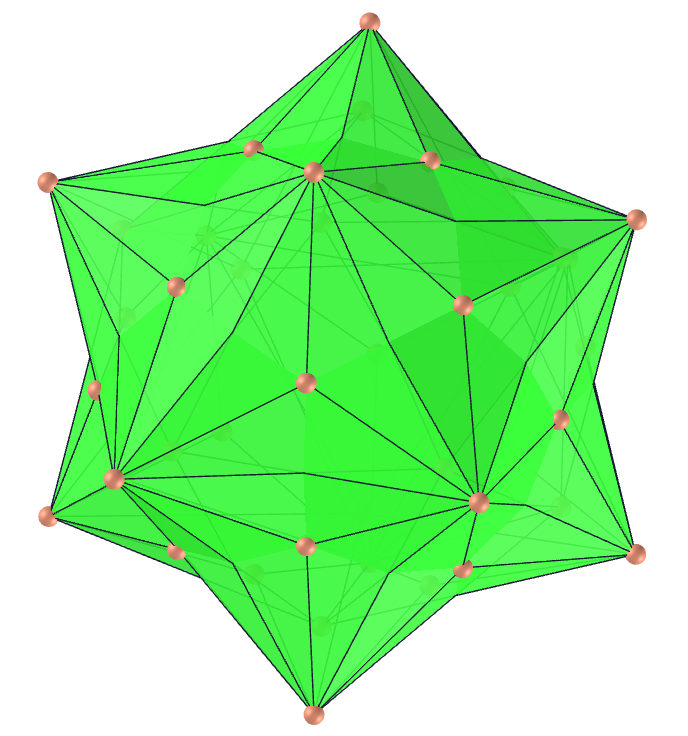</a>
  The small dodecacronic hexecontahedron is the dual polyhedron of the small dodecicosidodecahedron. It is visually identical to the small rhombidodecacron. Its faces are darts, and a part of each dart lies inside the solid, hence is invisible in solid models. 
   <b>Faces:</b> 60 darts | <b>Edges:</b> 120 | <b>Vertices:</b> 44 | <b>Dihedral angle:</b> 154.12°. <a href="https://polytope.miraheze.org/wiki/Small_dodecacronic_hexecontahedron" target="_blank">More...</a>

<h4>19. Great Dodecicosidodecahedron</h4>
 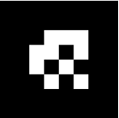
  U61 The Great Dodecicosidodecahedron (or great dodekicosidodecahedron) is the uniform polyhedron whose dual is the great dodecacronic hexecontahedron. It shares its vertex arrangement with the truncated great dodecahedron and the uniform compounds of 6 or 12 pentagonal prisms. 
  <b>Faces:</b> 20 equilateral triangles, 12 regular pentagrams and 12 regular decagrams | <b>Edges:</b> 120 | <b>Vertices:</b> 60 | <b>Dihedral angles:</b> 100.81° and 116.57°. <a href="https://mathworld.wolfram.com/GreatDodecicosidodecahedron.html" target="_blank">More...</a>

<h4>20. Great dodecacronic hexecontahedron</h4>
 <a href="vr/great_dodecacronic_hexecontahedron.htm" target="_blank" title="3D model" class="fotoA">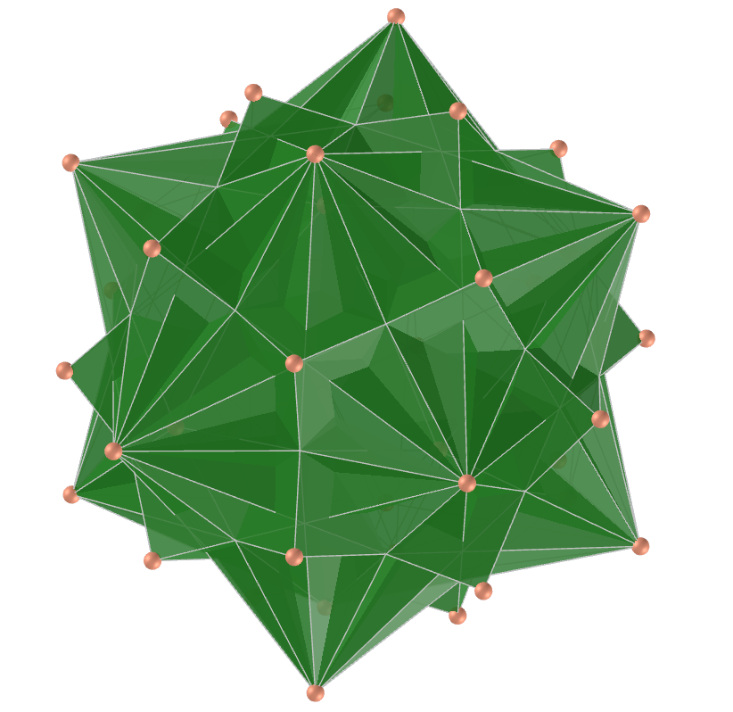</a>
  The Great dodecacronic hexecontahedron (or great lanceal ditriacontahedron) is the dual of the great dodecicosidodecahedron. Its 60 intersecting quadrilateral faces are kites. Part of each kite lies inside the solid, hence is invisible in solid models.
  <b>Faces:</b> 60 kites | <b>Edges:</b> 120 | <b>Vertices:</b> 44 | <b>Dihedral angle:</b> 91.55°. <a href="https://en.wikipedia.org/wiki/Great_dodecacronic_hexecontahedron" target="_blank">More...</a>
 
<a href="#p5" class="topo">back to top</a>

 

<h4>21. Small ditrigonal dodecicosidodecahedron</h4>
 
  U43 The Small ditrigonal dodecicosidodecahedron is the uniform polyhedron whose dual polyhedron is the small triambic icosahedron. A faceted version is the ditrigonal dodecadodecahedron. The convex hull of the small ditrigonal icosidodecahedron is a regular dodecahedron, whose dual is the icosahedron, so the dual of the great ditrigonal dodecicosidodecahedron (the small triambic icosahedron) is one of the icosahedron stellations.
  <b>Faces:</b> 20 equilateral triangles, 12 regular pentagrams and 12 regular decagons | <b>Edges:</b> 120 | <b>Vertices:</b> 60 | <b>Dihedral angles:</b> 100.81° and 296.56°. <a href="https://mathworld.wolfram.com/SmallDitrigonalIcosidodecahedron.html" target="_blank">More...</a>

<h4>22. Small ditrigonal dodecacronic hexecontahedron</h4>
 
  The Small ditrigonal dodecacronic hexecontahedron (or "fat" star) is the dual polyhedron of the small ditrigonal dodecicosidodecahedron. It is visually identical to the small dodecicosacron and its faces are darts. A part of each dart lies inside the solid, hence is invisible in solid models.
  <b>Faces:</b> 60 darts | <b>Edges:</b> 120 | <b>Vertices:</b> 44 | <b>Dihedral angle:</b> 146.23°. <a href="https://en.wikipedia.org/wiki/Small_ditrigonal_dodecacronic_hexecontahedron" target="_blank">More...</a>

<h4>23. Great ditrigonal dodecicosidodecahedron</h4>
 
  U42 The Great ditrigonal dodecicosidodecahedron (or great dodekified icosidodecahedron) is the uniform polyhedron whose dual is the great ditrigonal dodecacronic hexecontahedron. The convex hull of the great ditrigonal dodecicosidodecahedron is a truncated dodecahedron, whose dual is the triakis icosahedron, so the dual of the great ditrigonal dodecicosidodecahedron (the great triambic icosahedron) is a stellation of the triakis icosahedron.
  <b>Faces:</b> 20 equilateral triangles, 12 regular pentagons and 12 regular decagrams | <b>Edges:</b> 120 | <b>Vertices:</b> 60 | <b>Dihedral angles:</b> 116.56° and 142.62°. <a href="https://mathworld.wolfram.com/GreatDitrigonalDodecicosidodecahedron.html" target="_blank">More...</a>

<h4>24. Great ditrigonal dodecacronic hexecontahedron</h4>
 
  The Great ditrigonal dodecacronic hexecontahedron (or great lanceal trisicosahedron) is the dual of the great ditrigonal dodecicosidodecahedron and its faces are kites. Part of each kite lies inside the solid, hence is invisible in solid models. 
  <b>Faces:</b> 60 kites | <b>Edges:</b> 120 | <b>Vertices:</b> 44 | <b>Dihedral angle:</b> 127.69°. <a href="https://en.wikipedia.org/wiki/Great_ditrigonal_dodecacronic_hexecontahedron" target="_blank">More...</a>

<h4>25. Icosidodecadodecahedron</h4>
 
  U44 The Icosidodecadodecahedron (or icosified dodecadodecahedron) is the uniform polyhedron whose dual is the medial icosacronic hexecontahedron. Its vertex figure is a crossed quadrilateral and shares its vertex arrangement with the uniform compounds of 10 or 20 triangular prisms.  
  <b>Faces:</b> 20 regular hexagons, 12 regular pentagrams and 12 regular pentagons | <b>Edges:</b> 120 | <b>Vertices:</b> 60 | <b>Dihedral angles:</b> 100.81° and 322.62°. <a href="https://mathworld.wolfram.com/Icosidodecadodecahedron.html" target="_blank">More...</a>

<h4>26. Medial icosacronic hexecontahedron</h4>
 
  The Medial icosacronic hexecontahedron (or midly sagittal ditriacontahedron) is the dual of the icosidodecadodecahedron. Its faces are darts and part of each dart lies inside the solid, hence is invisible in solid models.
  <b>Faces:</b> 60 darts | <b>Edges:</b> 120 | <b>Vertices:</b> 44 | <b>Dihedral angle:</b> 135.58°. <a href="https://en.wikipedia.org/wiki/Medial_icosacronic_hexecontahedron" target="_blank">More...</a>

<h4>27. Small icosicosidodecahedron</h4>
 
  U31 The small icosicosidodecahedron (or small icosified icosidodecahedron) is the uniform polyhedron whose dual is the small icosacronic hexecontahedron. It shares its vertex arrangement with the great stellated truncated dodecahedron.  
  <b>Faces:</b> 20 equilateral triangles, 12 regular pentagrams and 12 regular hexagons | <b>Edges:</b> 120 | <b>Vertices:</b> 60 | <b>Dihedral angles:</b> 138.19° and 142.62°. <a href="https://mathworld.wolfram.com/SmallIcosicosidodecahedron.html" target="_blank">More...</a>

<h4>28. Small icosacronic hexecontahedron</h4>
 
  The Small icosacronic hexecontahedron (or small lanceal trisicosahedron) is The dual polyhedron of the small icosicosidodecahedron. Its faces are kites and part of each kite lies inside the solid, hence is invisible in solid models. 
  <b>Faces:</b> 60 kites | <b>Edges:</b> 120 | <b>Vertices:</b> 52 | <b>Dihedral angle:</b> 146.23°. <a href="https://en.wikipedia.org/wiki/Small_icosacronic_hexecontahedron" target="_blank">More...</a>

<h4>29. Great Icosicosidodecahedron</h4>
 <a href="vr/great_icosicosidodecahedron.htm" target="_blank" title="3D model" class="fotoA">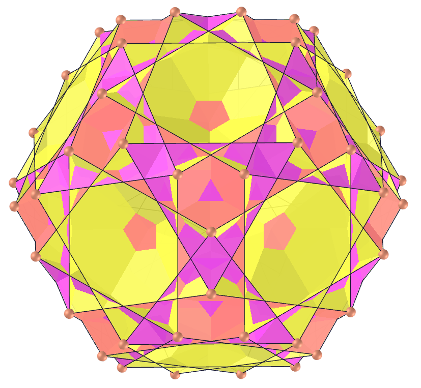</a>
  U48 The great icosicosidodecahedron (or great icosified icosidodecahedron) is the uniform polyhedron whose dual is the great icosacronic hexecontahedron. It shares its vertex arrangement with the truncated dodecahedron and its vertex figure is a crossed quadrilateral. 
  <b>Faces:</b> 20 equilateral triangles, 12 regular pentagons and 20 regular hexagons | <b>Edges:</b> 120 | <b>Vertices:</b> 60 | <b>Dihedral angles:</b> 79.19° and 318.19°. <a href="https://mathworld.wolfram.com/GreatIcosicosidodecahedron.html" target="_blank">More...</a>

<h4>30. Great icosacronic hexecontahedron</h4>
 
  The Great icosacronic hexecontahedron (or great sagittal trisicosahedron) is the dual of the great icosicosidodecahedron. Its faces are darts and a part of each dart lies inside the solid, hence is invisible in solid models.  
  <b>Faces:</b> 60 darts | <b>Edges:</b> 120 | <b>Vertices:</b> 52 | <b>Dihedral angle:</b> 127.69°. <a href="https://en.wikipedia.org/wiki/Great_icosacronic_hexecontahedron" target="_blank">More...</a>
 
<a href="#p5" class="topo">back to top</a>

 

<h4>31. Rhombidodecadodecahedron</h4>
 
  U38 The rhombidodecadodecahedron (or cantellated great dodecahedron) is the uniform polyhedron whose dual is the medial deltoidal hexecontahedron. It shares its vertex arrangement with the uniform compounds of 10 or 20 triangular prisms.
  <b>Faces:</b> 30 squares, 12 regular pentagons and 12 regular pentagrams | <b>Edges:</b> 120 | <b>Vertices:</b> 60 | <b>Dihedral angles:</b> 121.71° and 148.28°. <a href="https://mathworld.wolfram.com/Rhombidodecadodecahedron.html" target="_blank">More...</a>
 

<h4>32. Medial deltoidal hexecontahedron</h4>
 <a href="vr/medial_deltoidal_hexecontahedron.htm" target="_blank" title="3D model" class="fotoA">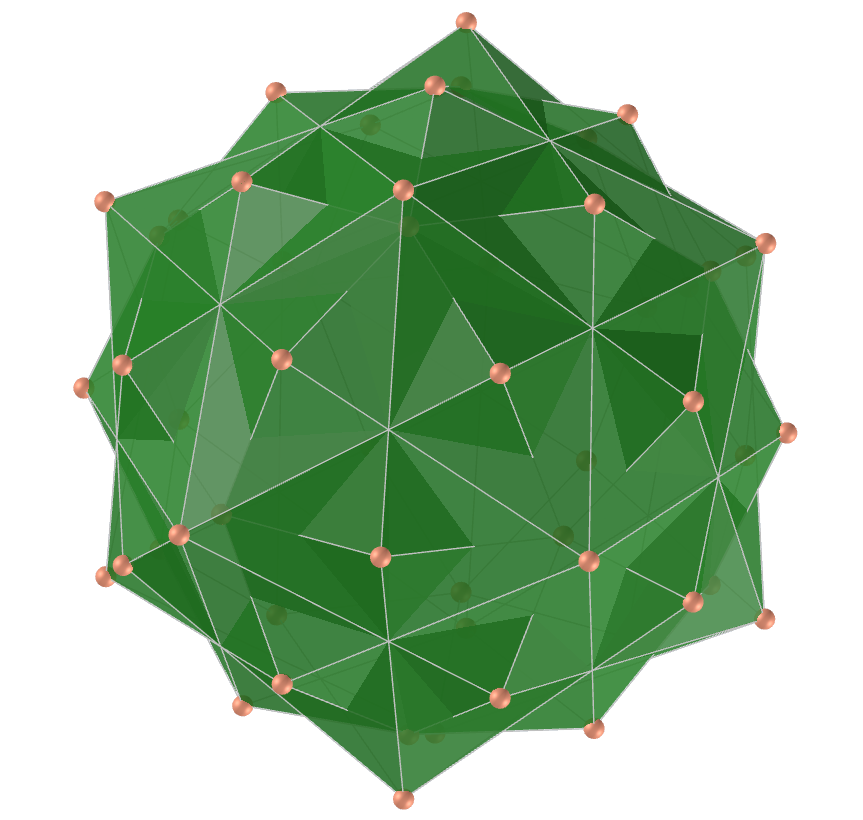</a>
  The medial deltoidal hexecontahedron is the dual of the rhombidodecadodecahedron. Its 60 intersecting quadrilateral faces are kites and part of each kite lies inside the solid, hence is invisible in solid models.
  
  <b>Faces:</b> 60 kites | <b>Edges:</b> 120 | <b>Vertices:</b> 54 | <b>Dihedral angle:</b> 135.58°. <a href="https://en.wikipedia.org/wiki/Medial_deltoidal_hexecontahedron" target="_blank">More...</a>

<h4>33. Uniform great rhombicosidodecahedron</h4>
 
  U67 The uniform great rhombicosidodecahedron (or quasirhombicosidodecahedron) is the uniform polyhedron whose dual is the great deltoidal hexecontahedron. Its vertex figure is a crossed quadrilateral and shares its vertex arrangement with the truncated great dodecahedron, and with the uniform compounds of 6 or 12 pentagonal prisms. 
  <b>Faces:</b> 30 squares, 20 equilateral triangles and 12 regular pentagrams | <b>Edges:</b> 120 | <b>Vertices:</b> 60 | <b>Dihedral angles:</b> 69.09° and 301.71°. <a href="https://mathworld.wolfram.com/UniformGreatRhombicosidodecahedron.html" target="_blank">More...</a>

<h4>34. Great deltoidal hexecontahedron</h4>
 <a href="vr/great_deltoidal_hexecontahedron.htm" target="_blank" title="3D model" class="fotoA">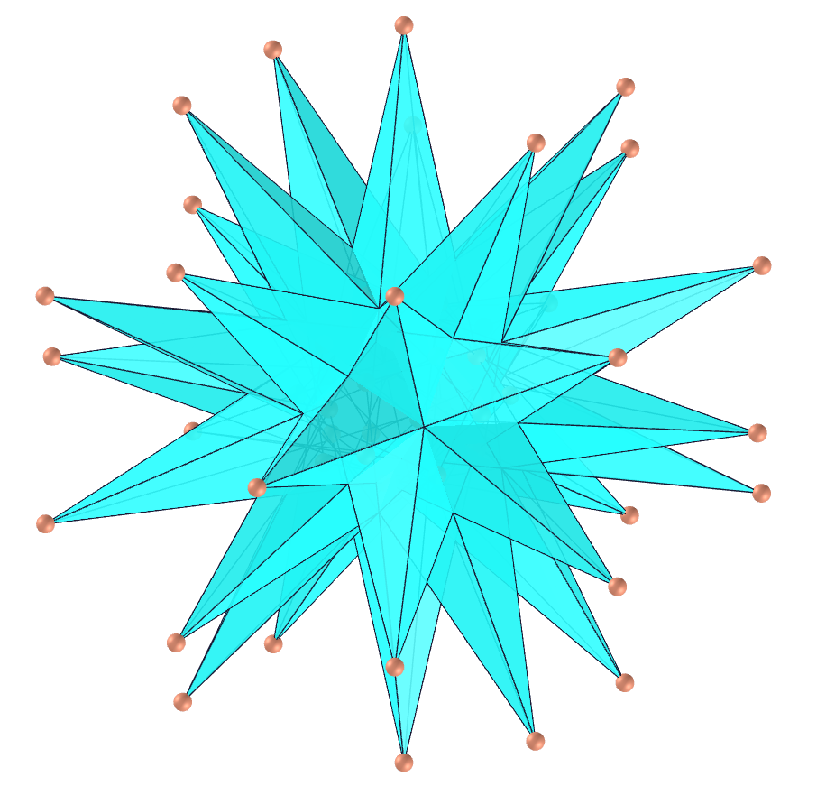</a>
  The great deltoidal hexecontahedron (or great sagittal ditriacontahedron) is the dual of the uniform great rhombicosidodecahedron. It is visually identical to the great rhombidodecacron and part of each dart lies inside the solid, hence is invisible in solid models. It is also called a great strombic hexecontahedron. 
  <b>Faces:</b> 60 darts | <b>Edges:</b> 120 | <b>Vertices:</b> 62 | <b>Dihedral angle:</b> 91.55°. <a href="https://en.wikipedia.org/wiki/Great_deltoidal_hexecontahedron" target="_blank">More...</a>

<h4>35. Echidnahedron</h4>
 <a href="vr/echidnahedron.htm" target="_blank" title="3D model" class="fotoA">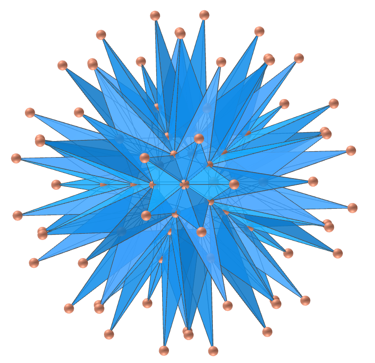</a>
  The echidnahedron is the term used for the spiky fourth icosahedron stellation, apparently first used in the Netlib polyhedron database. The echidnahedron is a noble polyhedron that consists of 20 irregular, but triangular-symmetric enneagrams. It appears as the cell of the dual of the pentagonal-prismatic heptacosiicosachoron. 
  <b>Faces:</b> 20 triangular-symmetric enneagrams | <b>Edges:</b> 270 | <b>Vertices:</b> 92. <a href="https://mathworld.wolfram.com/Echidnahedron.html" target="_blank">More...</a>
 
<a href="#p5" class="topo">back to top</a>

  Polyhedra: Self-intersecting by <a xmlns:cc="http://creativecommons.org/ns#" href="https://paulohscwb.github.io/polyhedra/selfintersect/" property="cc:attributionName" rel="cc:attributionURL">Paulo Henrique Siqueira</a> is licensed with a license <a rel="license" href="http://creativecommons.org/licenses/by-nc-nd/4.0/">Creative Commons Attribution-NonCommercial-NoDerivatives 4.0 International</a>.

<h4>How to cite this work:</h4> 

Siqueira, P.H., "Polyhedra: Self-intersecting". Available in: <https://paulohscwb.github.io/polyhedra/selfintersect/>, October 2022.

 <b>References:</b>
 Weisstein, Eric W. "Archimedean Solid" From MathWorld-A Wolfram Web Resource. <a href="http://mathworld.wolfram.com/ArchimedeanSolid.html" target="_blank">http://mathworld.wolfram.com/ArchimedeanSolid.html</a>
 Weisstein, Eric W. "Platonic Solid" From MathWorld-A Wolfram Web Resource. <a href="http://mathworld.wolfram.com/PlatonicSolid.html" target="_blank">http://mathworld.wolfram.com/PlatonicSolid.html</a>
 Weisstein, Eric W. "Archimedean Dual" From MathWorld-A Wolfram Web Resource. <a href="https://mathworld.wolfram.com/ArchimedeanDual.html" target="_blank">https://mathworld.wolfram.com/ArchimedeanDual.html</a>
 Weisstein, Eric W. "Uniform Polyhedron." From MathWorld--A Wolfram Web Resource. <a href="https://mathworld.wolfram.com/UniformPolyhedron.html" target="_blank">https://mathworld.wolfram.com/UniformPolyhedron.html</a>
 Wikipedia <a href="https://en.wikipedia.org/wiki/Archimedean_solid" target="_blank">https://en.wikipedia.org/wiki/Archimedean_solid</a>
 Wikipedia <a href="https://en.wikipedia.org/wiki/en.wikipedia.org/wiki/Platonic_solid" target="_blank">https://en.wikipedia.org/wiki/Platonic_solid</a>
 McCooey, David I. "Visual Polyhedra". <a href="http://dmccooey.com/polyhedra/" target="_blank">http://dmccooey.com/polyhedra/</a>
