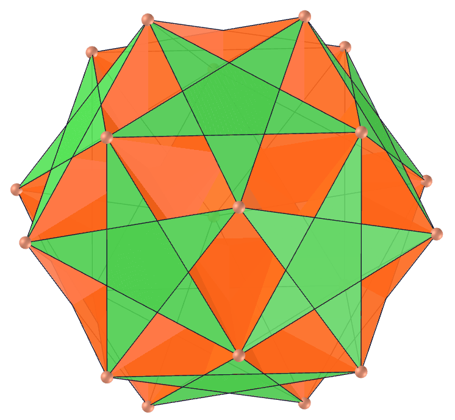
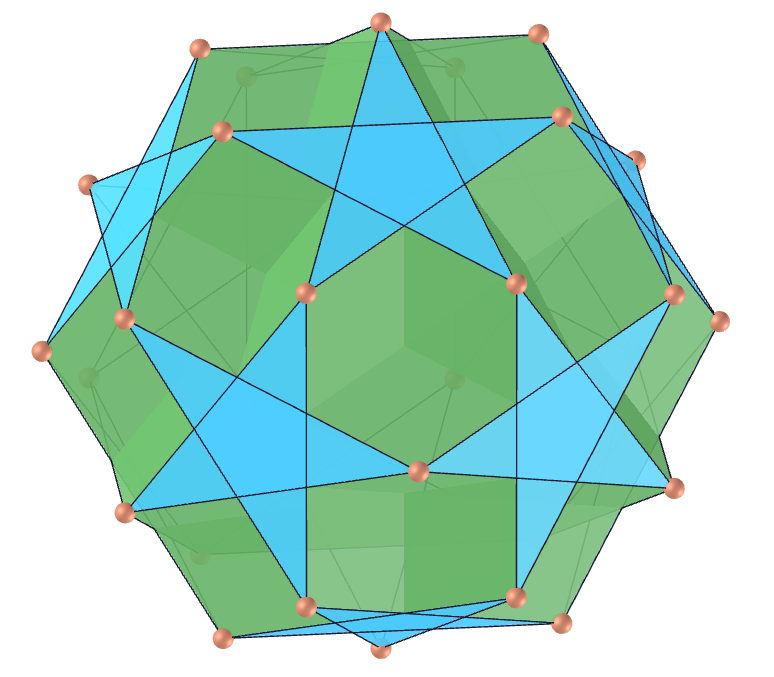
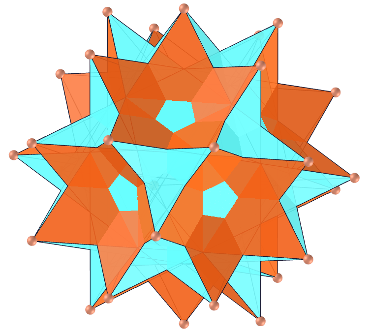
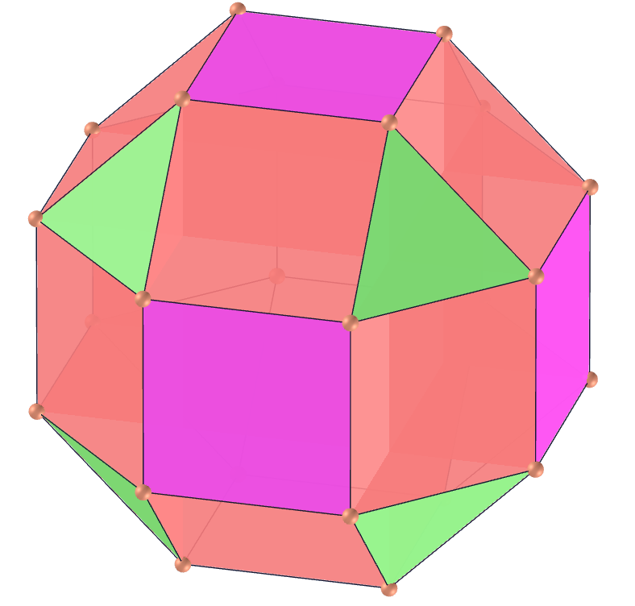
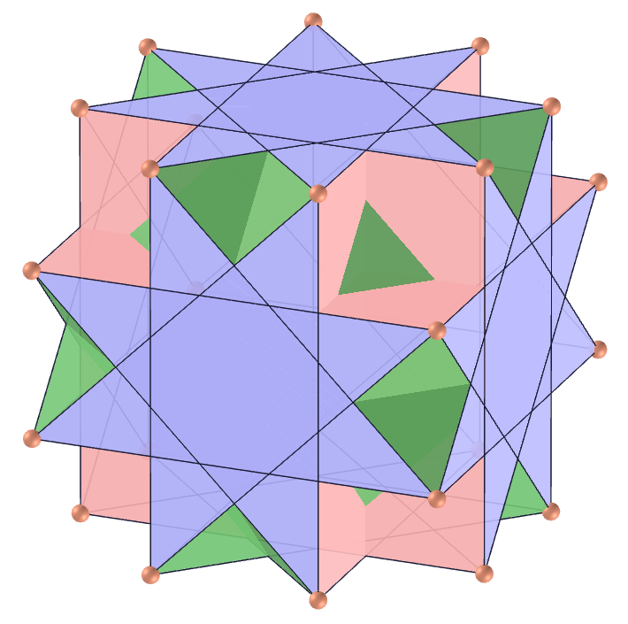
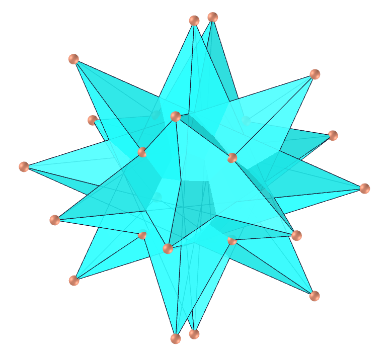
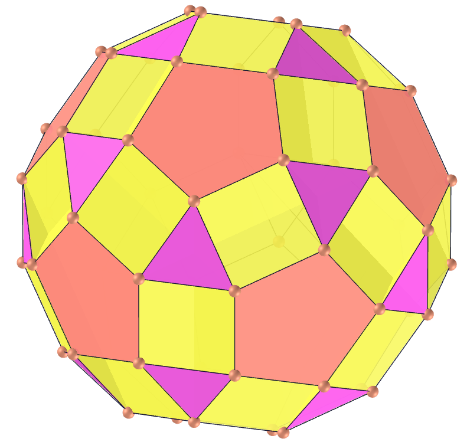
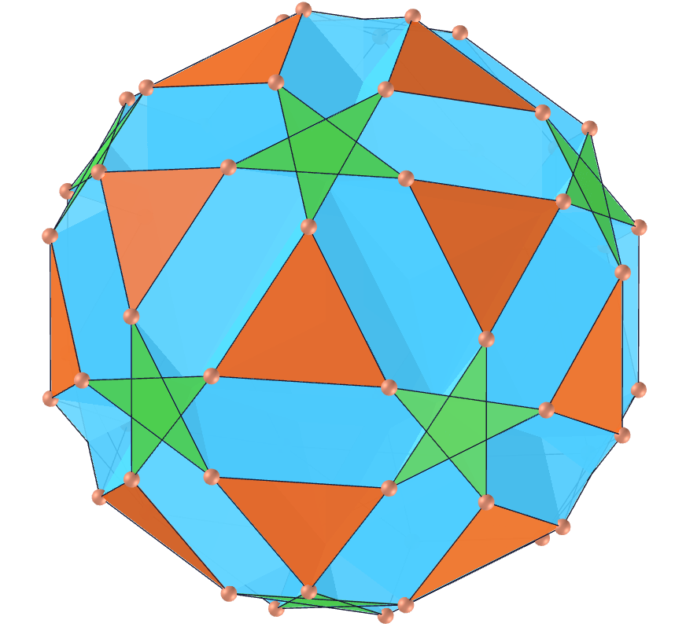
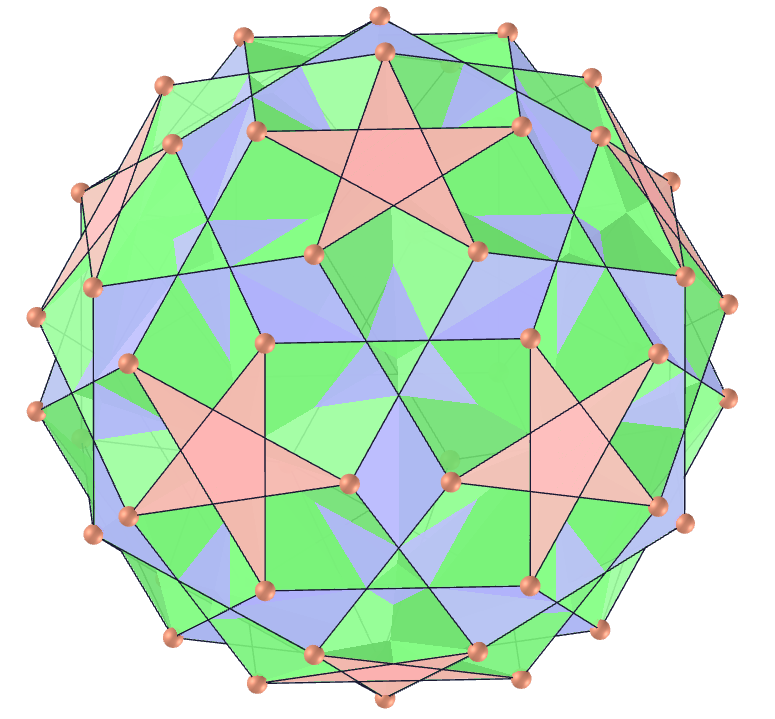
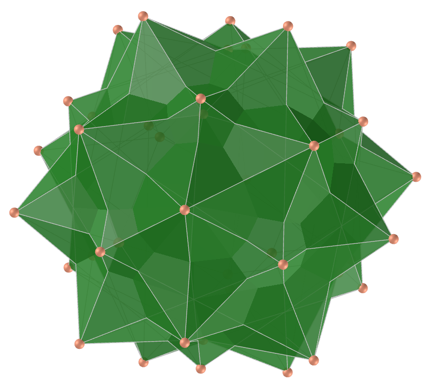

<link rel="stylesheet" href="../scripts/style.css">
<h2>Visualização de poliedros com Realidade Aumentada (RA) e Realidade Virtual (RV) em A-frame</h2>
<b>autor:</b> Paulo Henrique Siqueira - Universidade Federal do Paraná
 <b>contato:</b> <a href="#"> paulohscwb@gmail.com </a>
 <a href="https://paulohscwb.github.io/polyhedra/selfintersect/">english version</a>
<form style="margin: 0 auto; float:right; text-align:right; width:100%; margin-bottom:15px;">
	<select id="url" onchange="urlHandler(this.value)" style="color:royalblue;">
		<option disabled selected>Mais poliedros:</option>
		<option value="../../archimedes/pt-br/">Arquimedes</option>
		<option value="../../catalan/pt-br/">Catalan</option>
		<option value="../../nonconvex/pt-br/">Não convexos</option>
		<option value="../../platonic/pt-br/">Platão</option>
		<option value="../../polyhedron/pt-br/">Prismas e antiprismas</option>
		<option value="../../quasiregular/pt-br/">Quase regulares</option>
		<option disabled value="../../selfintersect/pt-br/">Auto-interseção</option>
		<option value="../../selfintersectsnub/pt-br/">Auto-interseção snub</option>
		<option value="../../selfintersecttruncated/pt-br/">Auto-interseção truncados</option>
		<option value="../../johnson1/pt-br/">Johnson: 1-32</option>
		<option value="../../johnson2/pt-br/">Johnson: 33-62</option>
		<option value="../../johnson3/pt-br/">Johnson: 63-92</option>
	</select>
</form>

  <h2 align="center"> Poliedros de auto-interseção</h2>
  Os poliedros de auto-interseção podem ter faces auto-interseccionadas ou figuras de vértices auto-interseccionados. Para visualizar os poliedros de auto-interseção em RA, visite a página:

<a href="../ra.html" target="_blank">https://paulohscwb.github.io/polyhedra/selfintersect/ra.html</a>
 
com qualquer navegador com um dispositivo de webcam (smartphone, tablet ou notebook).
 O acesso às páginas de RV é feito clicando no círculo azul que aparece em cima de cada marcador.

 

<h4>1. Dodecaedro ditrigonal</h4>
 
  U41 O dodecaedro ditrigonal (ou dodecadodecaedro ditrigonário) é um poliedro uniforme não convexo cujo dual é o icosaedro triâmbico medial. É uma versão facetada do pequeno icosidodecaedro ditrigonal.
  <b>Faces:</b> 12 pentágonos regulares e 12 pentagramas regulares | <b>Arestas:</b> 60 | <b>Vértices:</b> 20 | <b>Ângulo diédrico:</b> 63.43°. <a href="https://mathworld.wolfram.com/DitrigonalDodecadodecahedron.html" target="_blank">Mais sobre...</a>
 

<h4>2. Icosaedro triâmbico medial</h4>
 
  O icosaedro triâmbico medial é o poliedro dual do dodecadodecaedro ditrigonal cuja aparência externa é a mesma do grande icosaedro triâmbico (o dual do grande icosidodecaedro ditrigonal), pois os vértices internos estão ocultos. O icosaedro triâmbico medial tem faces pentagramas ocultas, enquanto o grande icosaedro triâmbico tem faces triangulares ocultas.
  <b>Faces:</b> 20 triambis | <b>Arestas:</b> 60 | <b>Vértices:</b> 24 | <b>Ângulo diédrico:</b> 109.47°. <a href="https://mathworld.wolfram.com/MedialTriambicIcosahedron.html" target="_blank">Mais sobre...</a>
 

<h4>3. Pequeno icosidodecaedro ditrigonal</h4>
 
  U30 O pequeno icosidodecaedro ditrigonal é um poliedro uniforme não convexo cujo poliedro dual é o pequeno icosaedro triâmbico. Uma versão facetada é o dodecadodecaedro ditrigonal. O casco convexo do pequeno icosidodecaedro ditrigonal é um dodecaedro regular, cujo dual é o icosaedro, então o dual do grande dodecicosidodecaedro ditrigonal (o pequeno icosaedro triâmbico) é uma das estrelas do icosaedro.
  <b>Faces:</b> 20 triângulos equiláteros e 12 pentagramas regulares | <b>Arestas:</b> 60 | <b>Vértices:</b> 20 | <b>Ângulo diédrico:</b> 142.62°. <a href="https://mathworld.wolfram.com/SmallDitrigonalIcosidodecahedron.html" target="_blank">Mais sobre...</a>
 

<h4>4. Pequeno icosaedro triâmbico</h4>
 
  O pequeno icosaedro triâmbico é o poliedro dual do pequeno icosidodecaedro ditrigonal. Ele pode ser construído pelo aumento de um icosaedro de comprimento de aresta unitário por uma pirâmide. O casco convexo do pequeno icosidodecaedro ditrigonal é um dodecaedro regular cujo dual é o icosaedro, então o dual do pequeno icosidodecaedro ditrigonal (ou seja, o pequeno icosaedro triâmbico) é uma das estrelas do icosaedro.
  <b>Faces:</b> 20 pentágonos | <b>Arestas:</b> 60 | <b>Vértices:</b> 32 | <b>Ângulo diédrico:</b> 109.47°. <a href="https://mathworld.wolfram.com/SmallTriambicIcosahedron.html" target="_blank">Mais sobre...</a>
 

<h4>5. Grande icosidodecaedro ditrigonal</h4>
 
  U47 O grande icosidodecaedro ditrigonal é o poliedro uniforme cujo dual é o grande icosaedro triâmbico. O casco convexo do grande icosaedro triâmbico é um dodecaedro regular, cujo dual é o icosaedro, de modo que o dual do grande icosidodecaedro ditrigonal (o grande icosaedro triâmbico) é uma das estrelas do icosaedro.
  <b>Faces:</b> 20 triângulos equiláteros e 12 pentágonos regulares | <b>Arestas:</b> 60 | <b>Vértices:</b> 20 | <b>Ângulo diédrico:</b> 79.19°. <a href="https://mathworld.wolfram.com/GreatDitrigonalIcosidodecahedron.html" target="_blank">Mais sobre...</a>
 

<h4>6. Grande icosaedro triâmbico</h4>
 
  O grande icosaedro triâmbico é o dual do grande icosidodecaedro ditrigonal cuja aparência é a mesma do icosaedro triâmbico medial (o dual do dodecadodecaedro ditrigonal), pois os vértices internos estão ocultos. O icosaedro triâmbico medial tem faces pentagramas ocultas, enquanto o grande icosaedro triâmbico tem faces triangulares ocultas.
  <b>Faces:</b> 20 triambis | <b>Arestas:</b> 60 | <b>Vértices:</b> 32 | <b>Ângulo diédrico:</b> 109.47°. <a href="https://mathworld.wolfram.com/GreatTriambicIcosahedron.html" target="_blank">Mais sobre...</a>
 

<h4>7. Dodecadodecaedro</h4>
 
  U36 O dodecadodecaedro é o poliedro uniforme cujo poliedro dual é o triacontaedro rômbico medial. Seu poliedro dual também é chamado de pequeno triacontaedro estrelado. Pode ser obtido truncando um grande dodecaedro ou facetando um icosidodecaedro com pentágonos e cobrindo os espaços abertos restantes com pentagramas.
  <b>Faces:</b> 12 pentágonos regulares e 12 pentagramas regulares | <b>Arestas:</b> 60 | <b>Vértices:</b> 30 | <b>Ângulo diédrico:</b> 116.57°. <a href="https://mathworld.wolfram.com/Dodecadodecahedron.html" target="_blank">Mais sobre...</a>
 

<h4>8. Triacontaedro rômbico medial</h4>
 
  O triacontaedro rômbico medial é um zonoedro que é o dual do dodecadodecaedro. O triacontaedro rômbico medial contém vértices pentagramas interiores que, no entanto, estão ocultos. O sólido também é chamado de pequeno triacontaedro estrelado.
  <b>Faces:</b> 30 losangos | <b>Arestas:</b> 60 | <b>Vértices:</b> 24 | <b>Ângulo diédrico:</b> 120°. <a href="https://mathworld.wolfram.com/MedialRhombicTriacontahedron.html" target="_blank">Mais sobre...</a>
 

<h4>9. Grande icosidodecaedro</h4>
 
  U54 O grande icosidodecaedro é o poliedro uniforme cujo dual é o grande triacontaedro rômbico. É um sólido de Arquimedes estrelado. Seu raio circunscrito para o comprimento unitário da aresta mede R=&phi;-1, onde &phi; é a proporção áurea.
  <b>Faces:</b> 20 triângulos equiláteros e 12 pentagramas regulares | <b>Arestas:</b> 60 | <b>Vértices:</b> 30 | <b>Ângulo diédrico:</b> 100.81°. <a href="https://mathworld.wolfram.com/GreatIcosidodecahedron.html" target="_blank">Mais sobre...</a>
 

<h4>10. Grande triacontaedro rômbico</h4>
 
  O grande triacontaedro rômbico, também chamado de grande triacontaedro estrelado, é um zonoedro que é o dual do grande icosidodecaedro. É uma das estrelas rômbicas de triacontaedro. Aparece junto com uma projeção isométrica do 5-hipercubo na capa do conhecido livro de Coxeter sobre politopos.
  <b>Faces:</b> 30 losangos | <b>Arestas:</b> 60 | <b>Vértices:</b> 32 | <b>Ângulo diédrico:</b> 72°. <a href="https://mathworld.wolfram.com/GreatRhombicTriacontahedron.html" target="_blank">Mais sobre...</a>
 
<a href="#p5" class="topo">voltar ao topo</a>

 

 <h4>11. Pequeno cubicuboctaedro</h4>
 
  U13 O pequeno cubicuboctaedro é o poliedro uniforme cujo poliedro dual é o pequeno icositetraedro hexacrônico. Versões facetadas incluem o grande rombicuboctaedro uniforme e o pequeno rhombihexaedro. O casco convexo do pequeno cubicuboctaedro é o pequeno rombicuboctaedro de Arquimedes.
  <b>Faces:</b> 8 triângulos equiláteros, 6 quadrados e 6 octógonos regulares | <b>Arestas:</b> 48 | <b>Vértices:</b> 24 | <b>Ângulos diédricos:</b> 90° e 300.26°. <a href="https://mathworld.wolfram.com/SmallCubicuboctahedron.html" target="_blank">Mais sobre...</a>
 

 <h4>12. Pequeno icositetraedro hexacrônico</h4>
 
  O pequeno icositetraedro hexacrônico é o poliedro uniforme dual do pequeno cubicuboctaedro. Parece o mesmo que o pequeno rhombihexacron. Uma parte de cada dardo fica dentro do sólido, portanto, é invisível em modelos sólidos.
  <b>Faces:</b> 24 dardos | <b>Arestas:</b> 48 | <b>Vértices:</b> 20 | <b>Ângulo diédrico:</b> 138.12°. <a href="https://en.wikipedia.org/wiki/Small_hexacronic_icositetrahedron" target="_blank">Mais sobre...</a>

 <h4>13. Grande cubicuboctaedro</h4>
 
  U14 O grande cubicuboctaedro é o poliedro uniforme cujo poliedro dual é o grande icositetraedro hexacrônico. É uma versão facetada do cubo. O casco convexo do grande cubicuboctaedro é o cubo truncado de Arquimedes.
  <b>Faces:</b> 8 triângulos equiláteros, 6 quadrados e 6 octagramas regulares | <b>Arestas:</b> 48 | <b>Vértices:</b> 24 | <b>Ângulos diédricos:</b> 90° e 125.26°. <a href="https://mathworld.wolfram.com/GreatCubicuboctahedron.html" target="_blank">Mais sobre...</a>
 

 <h4>14. Grande icositetraedro hexacrônico</h4>
 
  O grande icositetraedro hexacrônico é o dual do grande cubicuboctaedro. Suas faces são "pipas", e parte de cada "pipa" fica dentro do sólido, portanto é invisível em modelos sólidos.
  <b>Faces:</b> 24 "pipas" | <b>Arestas:</b> 48 | <b>Vértices:</b> 20 | <b>Ângulo diédrico:</b> 94.53°. <a href="https://en.wikipedia.org/wiki/Great_hexacronic_icositetrahedron" target="_blank">Mais sobre...</a>

 <h4>15. Grande rombicuboctaedro uniforme</h4>
 
  U17 O grande rombicuboctaedro uniforme é o poliedro uniforme, também conhecido como quase-rhombicuboctaedro, cujo dual é o grande icositetraedro deltoidal. O casco convexo do grande cubicuboctaedro é o cubo truncado de Arquimedes.
  <b>Faces:</b> 8 triângulos equiláteros e 18 quadrados | <b>Arestas:</b> 48 | <b>Vértices:</b> 24 | <b>Ângulos diédricos:</b> 45° e 324.74°. <a href="https://mathworld.wolfram.com/UniformGreatRhombicuboctahedron.html" target="_blank">Mais sobre...</a>
 

 <h4>16. Grande icositetraedro deltoide</h4>
 
  O grande icositetraedro deltoide (ou grande disdodecaedro sagital) é o dual do grande rombicuboctaedro uniforme. Suas faces são dardos, e parte de cada dardo fica dentro do sólido, portanto, é invisível em modelos sólidos. Uma de suas metades pode ser girada em 45&deg; para formar o pseudo grande icositetraedro deltoidal, análogo ao pseudo-deltoidal icositetraedro.
  <b>Faces:</b> 24 dardos | <b>Arestas:</b> 48 | <b>Vértices:</b> 26 | <b>Ângulo diédrico:</b> 94.53°. <a href="https://en.wikipedia.org/wiki/Great_deltoidal_icositetrahedron" target="_blank">Mais sobre...</a>

 <h4>17. Pequeno dodecicosidodecaedro</h4>
 
  U33 O pequeno dodecicosidodecaedro é o poliedro uniforme cujo poliedro dual é o pequeno hexecontaedro dodecacrônico. É uma versão facetada do pequeno rombicosidodecaedro. O pequeno dodecicosidodecaedro aparece na capa do livro "Computer Science with Mathematica" de Roman E. Maeder (1999).
  <b>Faces:</b> 20 triângulos equiláteros, 12 pentágonos regulares e 12 decágonos regulares | <b>Arestas:</b> 120 | <b>Vértices:</b> 60 | <b>Ângulos diédricos:</b> 116.57° e 322.62°. <a href="https://mathworld.wolfram.com/SmallDodecicosidodecahedron.html" target="_blank">Mais sobre...</a>

 <h4>18. Pequeno hexecontaedro dodecacrônico</h4>
 
  O pequeno hexecontaedro dodecacrônico é o poliedro dual do pequeno dodecicosidodecaedro. É visualmente idêntico ao pequeno rhombidodecacron. Suas faces são dardos, e uma parte de cada dardo fica dentro do sólido, portanto, é invisível em modelos sólidos.
   <b>Faces:</b> 60 dardos | <b>Arestas:</b> 120 | <b>Vértices:</b> 44 | <b>Ângulo diédrico:</b> 154.12°. <a href="https://polytope.miraheze.org/wiki/Small_dodecacronic_hexecontahedron" target="_blank">Mais sobre...</a>

<h4>19. Grande hexecontaedro dodecacrônico</h4>
 
  U61 O Grande Dodecicosidodecaedro (ou grande dodekicosidodecaedro) é o poliedro uniforme cujo dual é o grande hexecontaedro dodecacrônico. Ele compartilha seu arranjo de vértice com o grande dodecaedro truncado e os sólidos compostos uniformes de 6 ou 12 prismas pentagonais.
  <b>Faces:</b> 20 triângulos equiláteros, 12 pentagramas regulares e 12 decagramas regulares | <b>Arestas:</b> 120 | <b>Vértices:</b> 60 | <b>Ângulos diédricos:</b> 100.81° e 116.57°. <a href="https://mathworld.wolfram.com/GreatDodecicosidodecahedron.html" target="_blank">Mais sobre...</a>

<h4>20. Grande hexecontaedro dodecacrônico</h4>
 
  O Grande hexecontaedro dodecacrônico (ou grande ditriacontaedro lanceal) é o dual do grande dodecicosidodecaedro. Suas 60 faces quadrilaterais que se cruzam são "pipas". Parte de cada "pipa" fica dentro do sólido, portanto, é invisível em modelos sólidos.
  <b>Faces:</b> 60 "pipas" | <b>Arestas:</b> 120 | <b>Vértices:</b> 44 | <b>Ângulo diédrico:</b> 91.55°. <a href="https://en.wikipedia.org/wiki/Great_dodecacronic_hexecontahedron" target="_blank">Mais sobre...</a>
 
<a href="#p5" class="topo">voltar ao topo</a>

 

<h4>21. Pequeno dodecicosidodecaedro ditrigonal</h4>
 
  U43 O pequeno dodecicosidodecaedro ditrigonal é o poliedro uniforme cujo dual é o icosaedro triâmbico pequeno. Uma versão facetada é o dodecadodecaedro ditrigonal. O casco convexo do pequeno icosidodecaedro ditrigonal é um dodecaedro regular, cujo dual é o icosaedro, assim o dual do grande dodecicosidodecaedro ditrigonal (o pequeno icosaedro triâmbico) é uma das estrelas do icosaedro.
  <b>Faces:</b> 20 triângulos equiláteros, 12 pentagramas regulares e 12 decágonos regulares | <b>Arestas:</b> 120 | <b>Vértices:</b> 60 | <b>Ângulos diédricos:</b> 100.81° e 296.56°. <a href="https://mathworld.wolfram.com/SmallDitrigonalIcosidodecahedron.html" target="_blank">Mais sobre...</a>

<h4>22. Pequeno hexecontaedro ditrigonal dodecacrônico</h4>
 
  O pequeno hexecontaedro ditrigonal dodecacrônico (ou estrela "gorda") é o poliedro dual do pequeno dodecicosidodecaedro ditrigonal. É visualmente idêntico ao pequeno dodecicosacron e suas faces são dardos. Uma parte de cada dardo está dentro do sólido, portanto, invisível em modelos sólidos.
  <b>Faces:</b> 60 dardos | <b>Arestas:</b> 120 | <b>Vértices:</b> 44 | <b>Ângulo diédrico:</b> 146.23°. <a href="https://en.wikipedia.org/wiki/Small_ditrigonal_dodecacronic_hexecontahedron" target="_blank">Mais sobre...</a>

<h4>23. Grande dodecicosidodecaedro ditrigonal</h4>
 
  U42 O Grande dodecicosidodecaedro ditrigonal (ou grande icosidodecaedro dodekificado) é o poliedro uniforme cujo dual é o grande hexecontaedro dodecacrônico ditrigonal. O casco convexo do grande dodecicosidodecaedro ditrigonal é um dodecaedro truncado, cujo dual é o icosaedro triakis, assim o dual do grande dodecicosidodecaedro ditrigonal (o grande icosaedro triâmbico) é uma estrela do icosaedro triakis.
  <b>Faces:</b> 20 triângulos equiláteros, 12 pentágonos regulares e 12 decagramas regulares | <b>Arestas:</b> 120 | <b>Vértices:</b> 60 | <b>Ângulos diédricos:</b> 100.81° e 296.56°. <a href="https://mathworld.wolfram.com/GreatDitrigonalDodecicosidodecahedron.html" target="_blank">Mais sobre...</a>

<h4>24. Grande hexecontaedro dodecacrônico ditrigonal</h4>
 
  O Grande hexecontaedro dodecacrônico ditrigonal (ou grande trisicosaedro lanceal) é o dual do grande dodecicosidodecaedro ditrigonal e suas faces são "pipas". Parte de cada "pipa" fica dentro do sólido, portanto, é invisível em modelos sólidos.
  <b>Faces:</b> 60 "pipas" | <b>Arestas:</b> 120 | <b>Vértices:</b> 44 | <b>Ângulo diédrico:</b> 127.69°. <a href="https://en.wikipedia.org/wiki/Great_ditrigonal_dodecacronic_hexecontahedron" target="_blank">Mais sobre...</a>

<h4>25. Icosidodecadodecaedro</h4>
 
  U44 O Icosidodecadodecaedro (ou dodecadodecaedro icosificado) é o poliedro uniforme cujo dual é o hexecontaedro icosacrônico medial. Sua figura de vértice é um quadrilátero cruzado e compartilha seu arranjo de vértice com os compostos uniformes de 10 ou 20 prismas triangulares.
  <b>Faces:</b> 20 hexágonos regulares, 12 pentagramas regulares e 12 pentágonos regulares | <b>Arestas:</b> 120 | <b>Vértices:</b> 60 | <b>Ângulos diédricos:</b> 100.81° e 322.62°. <a href="https://mathworld.wolfram.com/Icosidodecadodecahedron.html" target="_blank">Mais sobre...</a>

<h4>26. Medial Icosacronic Hexecontahedron</h4>
 
  O hexecontaedro icosacrônico medial (ou ditriacontaedro sagital médio) é o dual do icosidodecadodecaedro. Suas faces são dardos e parte de cada dardo fica dentro do sólido, portanto é invisível em modelos sólidos.
  <b>Faces:</b> 60 dardos | <b>Arestas:</b> 120 | <b>Vértices:</b> 44 | <b>Ângulo diédrico:</b> 135.58°. <a href="https://en.wikipedia.org/wiki/Medial_icosacronic_hexecontahedron" target="_blank">Mais sobre...</a>

<h4>27. Pequeno icosicosidodecaedro</h4>
 
  U31 O pequeno icosicosidodecaedro (ou pequeno icosidodecaedro icosificado) é o poliedro uniforme cujo dual é o pequeno hexecontaedro icosacrônico. Ele compartilha seu arranjo de vértice com o grande dodecaedro truncado estrelado.
  <b>Faces:</b> 20 triângulos equiláteros, 12 pentagramas regulares e 12 hexágonos regulares | <b>Arestas:</b> 120 | <b>Vértices:</b> 60 | <b>Ângulos diédricos:</b> 138.19° e 142.62°. <a href="https://mathworld.wolfram.com/SmallIcosicosidodecahedron.html" target="_blank">Mais sobre...</a>

<h4>28. Pequeno hexecontaedro icosacrônico</h4>
 
  O pequeno hexecontaedro icosacrônico (ou pequeno trisicosaedro lanceal) é o poliedro dual do pequeno icosicosidodecaedro. Suas faces são "pipas" e parte de cada "pipa" fica dentro do sólido, portanto é invisível em modelos sólidos.
  <b>Faces:</b> 60 "pipas" | <b>Arestas:</b> 120 | <b>Vértices:</b> 52 | <b>Ângulo diédrico:</b> 146.23°. <a href="https://en.wikipedia.org/wiki/Small_icosacronic_hexecontahedron" target="_blank">Mais sobre...</a>

<h4>29. Grande icosicosidodecaedro</h4>
 
  U48 O grande icosicosidodecaedro (ou grande icosidodecaedro icosificado) é o poliedro uniforme cujo dual é o grande hexecontaedro icosacrônico. Ele compartilha seu arranjo de vértice com o dodecaedro truncado e sua figura de vértice é um quadrilátero cruzado.
  <b>Faces:</b> 20 triângulos equiláteros, 12 pentágonos regulares e 20 hexágonos regulares | <b>Arestas:</b> 120 | <b>Vértices:</b> 60 | <b>Ângulos diédricos:</b> 79.19° e 318.19°. <a href="https://mathworld.wolfram.com/GreatIcosicosidodecahedron.html" target="_blank">Mais sobre...</a>

<h4>30. Grande hexecontaedro icosacrônico</h4>
 
  O Grande hexecontaedro icosacrônico (ou grande trisicosaedro sagital) é o dual do grande icosicosidodecaedro. Suas faces são dardos e uma parte de cada dardo fica dentro do sólido, portanto é invisível em modelos sólidos.
  <b>Faces:</b> 60 dardos | <b>Arestas:</b> 120 | <b>Vértices:</b> 52 | <b>Ângulo diédrico:</b> 127.69°. <a href="https://en.wikipedia.org/wiki/Great_icosacronic_hexecontahedron" target="_blank">Mais sobre...</a>
 
<a href="#p5" class="topo">voltar ao topo</a>

 

<h4>31. Rombidodecadodecaedro</h4>
 
  U38 O rombidodecadodecaedro (ou grande dodecaedro cantelado) é o poliedro uniforme cujo dual é o hexecontaedro deltoidal medial. Ele compartilha seu arranjo de vértice com os compostos uniformes de 10 ou 20 prismas triangulares.
  <b>Faces:</b> 30 quadrados, 12 pentágonos regulares e 12 pentagramas regulares | <b>Arestas:</b> 120 | <b>Vértices:</b> 60 | <b>Ângulos diédricos:</b> 121.71° e 148.28°. <a href="https://mathworld.wolfram.com/Rhombidodecadodecahedron.html" target="_blank">Mais sobre...</a>

<h4>32. Hexecontaedro deltoidal medial</h4>
 
  O hexecontaedro deltoidal medial é o dual do rombidodecadodecaedro. Suas 60 faces quadrilaterais que se cruzam são "pipas" e parte de cada "pipa" fica dentro do sólido, portanto é invisível em modelos sólidos.
  
  <b>Faces:</b> 60 "pipas" | <b>Arestas:</b> 120 | <b>Vértices:</b> 54 | <b>Ângulo diédrico:</b> 135.58°. <a href="https://en.wikipedia.org/wiki/Medial_deltoidal_hexecontahedron" target="_blank">Mais sobre...</a>

<h4>33. Grande rombicosidodecaedro uniforme</h4>
 
  U67 O grande rombicosidodecaedro uniforme (ou quasirrombicosidodecaedro) é o poliedro uniforme cujo dual é o grande hexecontaedro deltoidal. Sua figura de vértice é um quadrilátero cruzado e compartilha seu arranjo de vértice com o grande dodecaedro truncado e com os compostos uniformes de 6 ou 12 prismas pentagonais.
  <b>Faces:</b> 30 quadrados, 20 triângulos equiláteros e 12 pentagramas regulares | <b>Arestas:</b> 120 | <b>Vértices:</b> 60 | <b>Ângulos diédricos:</b> 69.09° e 301.71°. <a href="https://mathworld.wolfram.com/UniformGreatRhombicosidodecahedron.html" target="_blank">Mais sobre...</a>

<h4>34. Grande hexecontaedro deltoidal</h4>
 
  O grande hexecontaedro deltoidal (ou grande ditriacontaedro sagital) é o dual do grande rombicosidodecaedro uniforme. É visualmente idêntico ao grande rombidodecacron e parte de cada dardo está dentro do sólido, portanto é invisível em modelos sólidos. Também é chamado de grande hexecontaedro estrombico.
  <b>Faces:</b> 60 dardos | <b>Arestas:</b> 120 | <b>Vértices:</b> 62 | <b>Ângulo diédrico:</b> 91.55°. <a href="https://en.wikipedia.org/wiki/Great_deltoidal_hexecontahedron" target="_blank">Mais sobre...</a>
 
<a href="#p5" class="topo">voltar ao topo</a>

 
  Polyhedra: Self-intersecting de <a xmlns:cc="http://creativecommons.org/ns#" href="https://paulohscwb.github.io/polyhedra/selfintersect/" property="cc:attributionName" rel="cc:attributionURL">Paulo Henrique Siqueira</a> está licenciado com uma Licença <a rel="license" href="http://creativecommons.org/licenses/by-nc-nd/4.0/">Creative Commons Atribuição-NãoComercial-SemDerivações 4.0 Internacional</a>.

<h4>Como citar este trabalho:</h4> 

Siqueira, P.H., "Polyhedra: Self-intersecting". Disponível em: <https://paulohscwb.github.io/polyhedra/selfintersect/>, Outubro de 2022.

 <b>Referências:</b>
 Weisstein, Eric W. "Archimedean Solid" From MathWorld-A Wolfram Web Resource. <a href="http://mathworld.wolfram.com/ArchimedeanSolid.html" target="_blank">http://mathworld.wolfram.com/ArchimedeanSolid.html</a>
 Weisstein, Eric W. "Platonic Solid" From MathWorld-A Wolfram Web Resource. <a href="http://mathworld.wolfram.com/PlatonicSolid.html" target="_blank">http://mathworld.wolfram.com/PlatonicSolid.html</a>
 Weisstein, Eric W. "Archimedean Dual" From MathWorld-A Wolfram Web Resource. <a href="https://mathworld.wolfram.com/ArchimedeanDual.html" target="_blank">https://mathworld.wolfram.com/ArchimedeanDual.html</a>
 Weisstein, Eric W. "Uniform Polyhedron." From MathWorld--A Wolfram Web Resource. <a href="https://mathworld.wolfram.com/UniformPolyhedron.html" target="_blank">https://mathworld.wolfram.com/UniformPolyhedron.html</a>
 Wikipedia <a href="https://en.wikipedia.org/wiki/Archimedean_solid" target="_blank">https://en.wikipedia.org/wiki/Archimedean_solid</a>
 Wikipedia <a href="https://en.wikipedia.org/wiki/en.wikipedia.org/wiki/Platonic_solid" target="_blank">https://en.wikipedia.org/wiki/Platonic_solid</a>
 McCooey, David I. "Visual Polyhedra". <a href="http://dmccooey.com/polyhedra/" target="_blank">http://dmccooey.com/polyhedra/</a>
