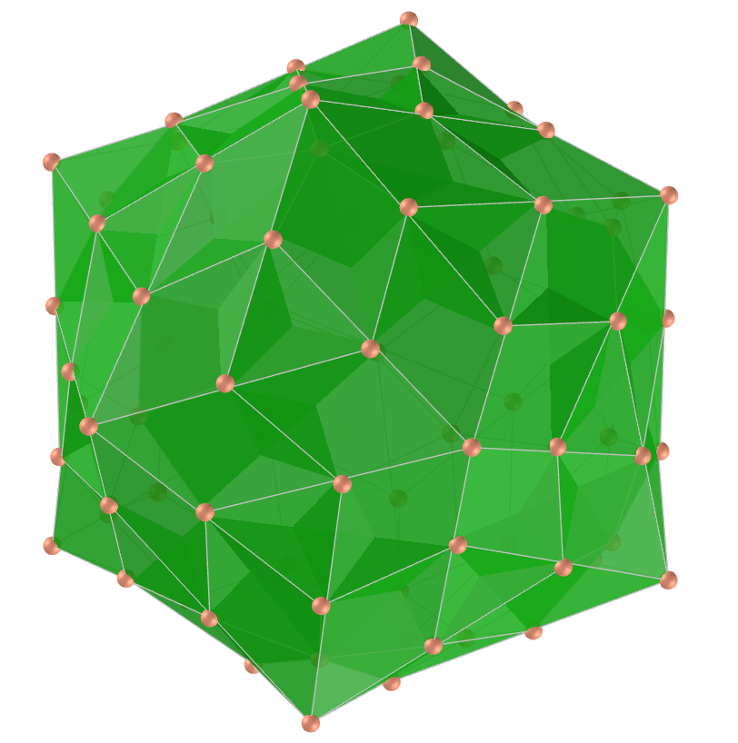
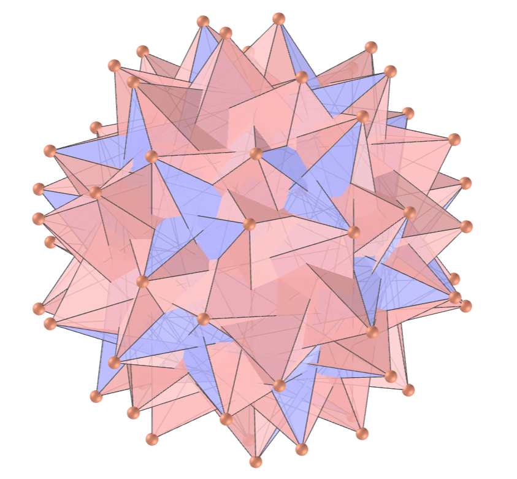
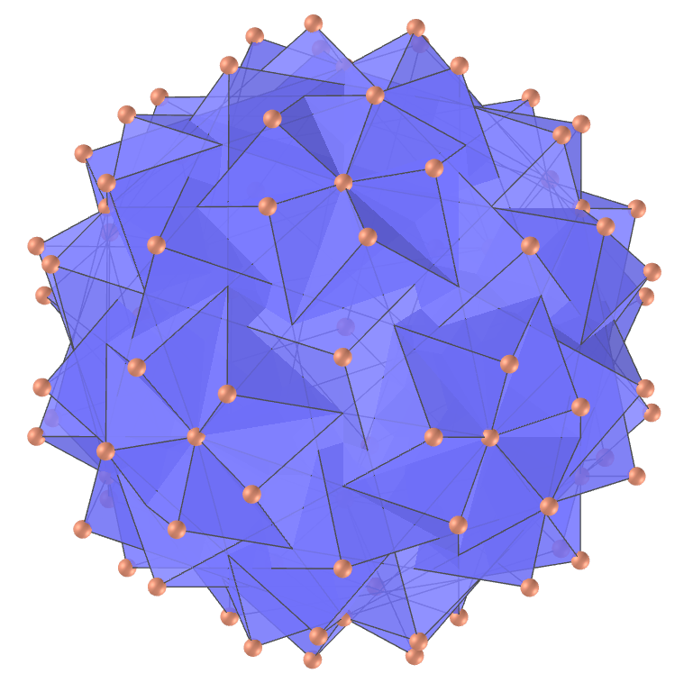
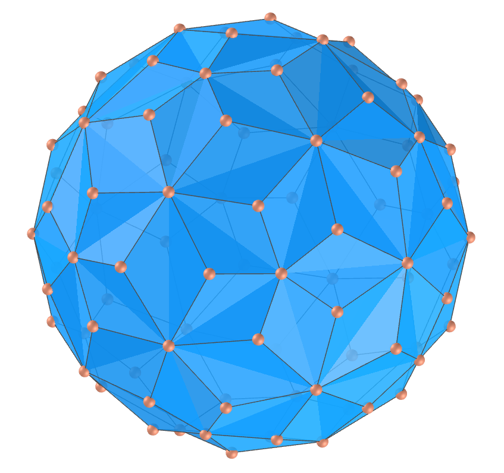
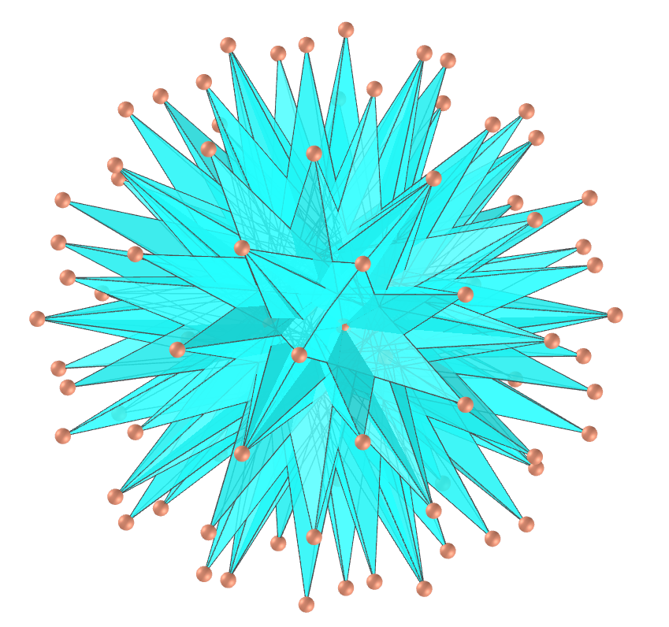

<link rel="stylesheet" href="scripts/style.css">
<h2>Visualization of polyhedra with Augmented Reality (AR) and Virtual Reality (VR) in A-frame</h2>
 <b>author:</b> Paulo Henrique Siqueira - Universidade Federal do Paraná
  <b>contact:</b> <a href="#">paulohscwb@gmail.com</a>
  <a href="https://paulohscwb.github.io/polyhedra/selfintersectsnub/pt-br/">versão em português</a>
<form style="margin: 0 auto; float:right; text-align:right; width:100%; margin-bottom:15px;">
	<select id="url" onchange="urlHandler(this.value)" style="color:royalblue;">
		<option disabled selected value>More polyhedra:</option>
		<option value="../archimedes/">Archimedes</option>
		<option value="../catalan/">Catalan</option>
		<option value="../nonconvex/">Non convex</option>
		<option value="../platonic/">Platonic</option>
		<option value="../polyhedron/">Prisms and antiprisms</option>
		<option value="../quasiregular/">Quasi regular</option>
		<option value="../selfintersect/">Self-intersecting</option>
		<option disabled value="../selfintersectsnub/">Self-intersecting snub</option>
		<option value="../selfintersecttruncated/">Self intersecting truncated</option>
		<option value="../johnson1/">Johnson: 1-32</option>
		<option value="../johnson2/">Johnson: 33-62</option>
		<option value="../johnson3/">Johnson: 63-92</option>
	</select>
</form>

  <h2 align="center">Self-intersecting snub polyhedra</h2>
  A polyhedron is snub quasi-regular if it is vertex-transitive with irregular pentagonal, hexagonal, or octagonal vertex figures. Vertex transitivity means that for any two vertices of the polyhedron, there exists a translation, rotation, and/or reflection that leaves the outward appearance of the polyhedron unchanged yet moves one vertex to the other. The snubification of a polyhedron is an operation that allows to obtain another polyhedron. This operation consists of moving all faces of the polyhedron apart, rotating them by a certain angle and filling the resulting empty spaces with polygons (examples: triangles, rectangles or pentagons).
  To view self-intersecting snub polyhedra in AR, simply visit:

<a href="ra.html" target="_blank">https://paulohscwb.github.io/polyhedra/selfintersectsnub/ra.html</a>
 
with any browser with a webcam device (smartphone, tablet or notebook). 
 Access to the VR sites is done by clicking on the blue circle that appears on top of the marker.

<h4>1. Snub Dodecadodecahedron</h4>

  U40 The snub dodecadodecahedron is the uniform polyhedron also called the siddid, whose dual polyhedron is the medial pentagonal hexecontahedron. Three triangles, 1 pentagon, and one pentagram meet at each vertex. 
  <b>Faces:</b> 60 equilateral triangles, 12 regular pentagons and 12 regular pentagrams | <b>Edges:</b> 150 | <b>Vertices:</b> 60 | <b>Dihedral angles:</b> 129.79°, 151.49° and 157.78°. <a href="https://mathworld.wolfram.com/SnubDodecadodecahedron.html" target="_blank">More...</a>

<h4>2. Medial pentagonal hexecontahedron</h4>

  The medial pentagonal hexecontahedron is the polyhedron whose dual is the uniform snub dodecadodecahedron. It consists of 60 irregular pentagons, each with two short, one medium, and two long edges.
  <b>Faces:</b> 60 irregular pentagons | <b>Edges:</b> 150 | <b>Vertices:</b> 84 | <b>Dihedral angle:</b> 133.8°. <a href="https://en.wikipedia.org/wiki/Medial_pentagonal_hexecontahedron" target="_blank">More...</a>

<h4>3. Inverted Snub Dodecadodecahedron</h4>

  U60 The inverted snub dodecadodecahedron is the uniform polyhedron also called of vertisnub dodecadodecahedron or isdid, whose dual polyhedron is the medial inverted pentagonal hexecontahedron. Three triangles, 1 pentagon, and one pentagram meeting at each vertex. It can be constructed by alternation of the quasitruncated dodecadodecahedron and then setting all edge lengths to be equal.  
  <b>Faces:</b> 60 equilateral triangles, 12 regular pentagons and 12 regular pentagrams | <b>Edges:</b> 150 | <b>Vertices:</b> 60 | <b>Dihedral angles:</b> 68.64°, 130.49° and 11.12°. <a href="https://mathworld.wolfram.com/InvertedSnubDodecadodecahedron.html" target="_blank">More...</a>

<h4>4. Medial pentagonal hexecontahedron</h4>

  The medial inverted pentagonal hexecontahedron is the polyhedron whose dual is the uniform inverted snub dodecadodecahedron. It consists of 60 irregular pentagons, each with two short, one medium, and two long edges. Part of each pentagon lies within the solid, hence is invisible in solid models.
  <b>Faces:</b> 60 irregular pentagons | <b>Edges:</b> 150 | <b>Vertices:</b> 84 | <b>Dihedral angle:</b> 108.09°. <a href="https://polytope.miraheze.org/wiki/Medial_inverted_pentagonal_hexecontahedron" target="_blank">More...</a>

<h4>5. Great Snub Icosidodecahedron</h4>

  U57 The great snub icosidodecahedron is the uniform polyhedron also called of gosid, whose dual polyhedron is the great pentagonal hexecontahedron. Four triangles and one pentagram meeting at each vertex. This polyhedron is the snub member of a family that includes the great icosahedron, the great stellated dodecahedron and the great icosidodecahedron.   
  <b>Faces:</b> 80 equilateral triangles and 12 regular pentagrams | <b>Edges:</b> 150 | <b>Vertices:</b> 60 | <b>Dihedral angles:</b> 126.82° and 138.82°. <a href="https://mathworld.wolfram.com/GreatSnubIcosidodecahedron.html" target="_blank">More...</a>

<h4>6. Great Pentagonal Hexecontahedron</h4>

  The great pentagonal hexecontahedron is the polyhedron whose dual is the uniform great snub icosidodecahedron. It consists of 60 mirror-symmetric pentagons, each with two short and three long edges. Part of each pentagon lies within the solid, hence is invisible in solid models.
  <b>Faces:</b> 60 mirror-symmetric pentagons | <b>Edges:</b> 150 | <b>Vertices:</b> 92 | <b>Dihedral angle:</b> 104.43°. <a href="https://polytope.miraheze.org/wiki/Great_pentagonal_hexecontahedron" target="_blank">More...</a>

<h4>7. Great Inverted Snub Icosidodecahedron</h4>

  U69 The great inverted snub icosidodecahedron is the uniform polyhedron also called of gisid, whose dual polyhedron is the great inverted pentagonal hexecontahedron. Four triangles and one pentagram meet at each vertex. It can be constructed by alternation of the great quasitruncated icosidodecahedron after setting all edge lengths equal.  
  <b>Faces:</b> 80 equilateral triangles and 12 regular pentagrams | <b>Edges:</b> 150 | <b>Vertices:</b> 60 | <b>Dihedral angles:</b> 21.61° and 89.79°. <a href="https://mathworld.wolfram.com/GreatInvertedSnubIcosidodecahedron.html" target="_blank">More...</a>

<h4>8. Great Inverted Pentagonal Hexecontahedron</h4>

  The great inverted pentagonal hexecontahedron is the polyhedron whose dual is the uniform great inverted snub icosidodecahedron. It consists of 60 mirror-symmetric concave  pentagons, each with two short and three long edges. Part of each pentagon lies within the solid, hence is invisible in solid models.
  <b>Faces:</b> 60 mirror-symmetric pentagons | <b>Edges:</b> 150 | <b>Vertices:</b> 92 | <b>Dihedral angle:</b> 78.36°. <a href="https://polytope.miraheze.org/wiki/Great_inverted_pentagonal_hexecontahedron" target="_blank">More...</a>

<h4>9. Great Retrosnub Icosidodecahedron</h4>

  U74 The great retrosnub icosidodecahedron is the uniform polyhedron also called of great inverted retrosnub icosidodecahedron, whose dual polyhedron is the great pentagrammic hexecontahedron. Four triangles and one pentagram meet at each vertex.  
  <b>Faces:</b> 80 equilateral triangles and 12 regular pentagrams | <b>Edges:</b> 150 | <b>Vertices:</b> 60 | <b>Dihedral angles:</b> 21.72° and 67.31°. <a href="https://mathworld.wolfram.com/GreatRetrosnubIcosidodecahedron.html" target="_blank">More...</a>

<h4>10. Great Pentagrammic Hexecontahedron</h4>

  The great pentagrammic hexecontahedron, also called of great dentoid ditriacontahedronis, is the polyhedron whose dual is the uniform great retrosnub icosidodecahedron. It consists of 60 mirror-symmetric pentagons and part of each pentagon lies within the solid, hence is invisible in solid models.
  <b>Faces:</b> 60 mirror-symmetric pentagons | <b>Edges:</b> 150 | <b>Vertices:</b> 92 | <b>Dihedral angle:</b> 60.9°. <a href="https://polytope.miraheze.org/wiki/Great_pentagrammic_hexecontahedron" target="_blank">More...</a>

<a href="#p9" class="topo">back to top</a>

<h4>11. Snub Icosidodecadodecahedron</h4>

  U46 The snub icosidodecadodecahedron is the uniform polyhedron also called of sided, whose dual polyhedron is the medial hexagonal hexecontahedron. Four triangles, one pentagon, and one pentagram meeting at each vertex. It can be constructed by alternation of the icosidodecatruncated icosidodecahedron and then setting all edge lengths to be equal.  
  <b>Faces:</b> 80 equilateral triangles, 12 regular pentagons and 12 regular pentagrams | <b>Edges:</b> 180 | <b>Vertices:</b> 60 | <b>Dihedral angles:</b> 7.35°, 120.43° and 146.78°. <a href="https://mathworld.wolfram.com/SnubIcosidodecadodecahedron.html" target="_blank">More...</a>

<h4>12. Medial Hexagonal Hexecontahedron</h4>

  The medial hexagonal hexecontahedron is the polyhedron whose dual is the uniform snub icosidodecadodecahedron. It consists of 60 asymmetric nonconvex hexagons and each hexagon has two long edges, two of medium length and two short ones. Part of each hexagon lies within the solid, hence is invisible in solid models.
  <b>Faces:</b> 60 irregular hexagons | <b>Edges:</b> 180 | <b>Vertices:</b> 104 | <b>Dihedral angle:</b> 127.32°. <a href="https://polytope.miraheze.org/wiki/Medial_hexagonal_hexecontahedron" target="_blank">More...</a>

<h4>13. Great Snub Dodecicosidodecahedron</h4>

  U64 The great snub dodecicosidodecahedron is the uniform polyhedron also called of gisdid, whose dual polyhedron is the great hexagonal hexecontahedron. Four triangles and two pentagrams meet at each vertex. This polyhedron's edges are a subset of those of the great dirhombicosidodecahedron, and it shares the same vertices.  
  <b>Faces:</b> 80 equilateral triangles and 24 regular pentagrams | <b>Edges:</b> 180 | <b>Vertices:</b> 60 | <b>Dihedral angles:</b> 16.3°, 109.47° and 125.77°. <a href="https://mathworld.wolfram.com/GreatSnubDodecicosidodecahedron.html" target="_blank">More...</a>

<h4>14. Great Hexagonal Hexecontahedron</h4>

  The great hexagonal hexecontahedron is the polyhedron whose dual is the uniform great snub dodecicosidodecahedron. It consists of 60 asymmetric nonconvex hexagons and each hexagon has two short, two medium, and two long edges. Part of each hexagon lies within the solid, hence is invisible in solid models.
  <b>Faces:</b> 60 irregular hexagons | <b>Edges:</b> 180 | <b>Vertices:</b> 104 | <b>Dihedral angle:</b> 90°. <a href="https://polytope.miraheze.org/wiki/Great_hexagonal_hexecontahedron" target="_blank">More...</a>

<h4>15. Small Snub Icosicosidodecahedron</h4>

  U32 The small snub icosicosidodecahedron is the uniform polyhedron also called of seside, whose dual polyhedron is the small hexagonal hexecontahedron. Five triangles and one pentagram meet at each vertex. It consists of 60 snub triangles, 40 more triangles that create 20 hexagrams due to pairs falling in the same plane, and 12 pentagrams. 
  <b>Faces:</b> 100 equilateral triangles and 24 regular pentagrams | <b>Edges:</b> 180 | <b>Vertices:</b> 60 | <b>Dihedral angles:</b> 155.67° and 161.02°. <a href="https://mathworld.wolfram.com/SmallSnubIcosicosidodecahedron.html" target="_blank">More...</a>

<h4>16. Small Hexagonal Hexecontahedron</h4>

  The small hexagonal hexecontahedron is the polyhedron whose dual is the uniform small snub icosicosidodecahedron. It consists of 60 mirror-symmetric hexagons and part of each hexagon lies within the solid, hence is invisible in solid models.
  <b>Faces:</b> 60 mirror-symmetric hexagons | <b>Edges:</b> 180 | <b>Vertices:</b> 112 | <b>Dihedral angle:</b> 139.89°. <a href="https://polytope.miraheze.org/wiki/Small_hexagonal_hexecontahedron" target="_blank">More...</a>

<h4>17. Small Retrosnub Icosicosidodecahedron</h4>

  U72 The small retrosnub icosicosidodecahedron is the uniform polyhedron also called of retrosnub disicosidodecahedron, whose dual polyhedron is the small hexagrammic hexecontahedron. The 40 non-snub triangular faces form 20 coplanar pairs, forming star hexagons that are not quite regular. Unlike most snub polyhedra, it has reflection symmetries.  
  <b>Faces:</b> 100 equilateral triangles and 12 regular pentagrams | <b>Edges:</b> 180 | <b>Vertices:</b> 60 | <b>Dihedral angles:</b> 24.33° and 44.46°. <a href="https://mathworld.wolfram.com/SmallRetrosnubIcosicosidodecahedron.html" target="_blank">More...</a>

<h4>18. Small Hexagrammic Hexecontahedron</h4>

  The small hexagrammic hexecontahedronn is the polyhedron whose dual is the uniform small retrosnub icosicosidodecahedron. It consists of 60 mirror-symmetric unicursal hexagrams and part of each hexagon lies within the solid, hence is invisible in solid models.
  <b>Faces:</b> 60 mirror-symmetric hexagrams | <b>Edges:</b> 180 | <b>Vertices:</b> 112 | <b>Dihedral angle:</b> 61.13°. <a href="https://polytope.miraheze.org/wiki/Small_hexagrammic_hexecontahedron" target="_blank">More...</a>

<h4>19. Great dirhombicosidodecahedron</h4>

  U75 The great dirhombicosidodecahedron is the uniform polyhedron also called of gidrid, whose dual polyhedron is the great dirhombicosidodecacron. It is the only uniform polyhedron with more than six polygons surrounding each polyhedron vertex: four squares alternating with two triangles and two pentagrams. The great dirhombicosidodecahedron is the most complex uniform polyhedron and has faces going through its middle. Therefore, some of the great dirhombicosidodecacron's vertices are at an ideal points infinitely far away from the origin.
  <b>Faces:</b> 40 equilateral triangles, 60 squares and 24 regular pentagrams | <b>Edges:</b> 240 | <b>Vertices:</b> 60 | <b>Dihedral angles:</b> 54.74° and 71.04°. <a href="https://mathworld.wolfram.com/GreatDirhombicosidodecahedron.html" target="_blank">More...</a>
 

<h4>20. Great Disnub Dirhombidodecahedron</h4>

  The great disnub dirhombidodecahedron, also called gidisdrid or Skilling's figure, is a degenerate uniform star polyhedron. Due to its geometric realization having some double edges where 4 faces meet, it is considered a degenerate uniform polyhedron but not strictly a uniform polyhedron. Six triangles, four squares, and two pentagrams meet at each vertex. It can be constructed as a blend of the uniform great dirhombicosidodecahedron and the disnub icosahedron, the uniform compound of 20 octahedra with which it shares its edge skeleton.
  <b>Faces:</b> 120 equilateral triangles, 60 squares and 24 regular pentagrams | <b>Edges:</b> 360 | <b>Vertices:</b> 60 | <b>Dihedral angles:</b> 109.47°, 54.73° and 71.04°. <a href="https://polytope.miraheze.org/wiki/Great_disnub_dirhombidodecahedron" target="_blank">More...</a>

<a href="#p9" class="topo">back to top</a>

  Polyhedra: Self-intersecting snub by <a xmlns:cc="http://creativecommons.org/ns#" href="https://paulohscwb.github.io/polyhedra/selfintersectsnub/" property="cc:attributionName" rel="cc:attributionURL">Paulo Henrique Siqueira</a> is licensed with a license <a rel="license" href="http://creativecommons.org/licenses/by-nc-nd/4.0/">Creative Commons Attribution-NonCommercial-NoDerivatives 4.0 International</a>.

<h4>How to cite this work:</h4> 

Siqueira, P.H., "Polyhedra: Self-intersecting snub". Available in: <https://paulohscwb.github.io/polyhedra/selfintersectsnub/>, March 2023.

 <b>References:</b>
 Weisstein, Eric W. "Archimedean Solid" From MathWorld-A Wolfram Web Resource. <a href="http://mathworld.wolfram.com/ArchimedeanSolid.html" target="_blank">http://mathworld.wolfram.com/ArchimedeanSolid.html</a>
 Weisstein, Eric W. "Platonic Solid" From MathWorld-A Wolfram Web Resource. <a href="http://mathworld.wolfram.com/PlatonicSolid.html" target="_blank">http://mathworld.wolfram.com/PlatonicSolid.html</a>
 Weisstein, Eric W. "Archimedean Dual" From MathWorld-A Wolfram Web Resource. <a href="https://mathworld.wolfram.com/ArchimedeanDual.html" target="_blank">https://mathworld.wolfram.com/ArchimedeanDual.html</a>
 Weisstein, Eric W. "Uniform Polyhedron." From MathWorld--A Wolfram Web Resource. <a href="https://mathworld.wolfram.com/UniformPolyhedron.html" target="_blank">https://mathworld.wolfram.com/UniformPolyhedron.html</a>
 Wikipedia <a href="https://en.wikipedia.org/wiki/Archimedean_solid" target="_blank">https://en.wikipedia.org/wiki/Archimedean_solid</a>
 Wikipedia <a href="https://en.wikipedia.org/wiki/en.wikipedia.org/wiki/Platonic_solid" target="_blank">https://en.wikipedia.org/wiki/Platonic_solid</a>
 McCooey, David I. "Visual Polyhedra". <a href="http://dmccooey.com/polyhedra/" target="_blank">http://dmccooey.com/polyhedra/</a>
