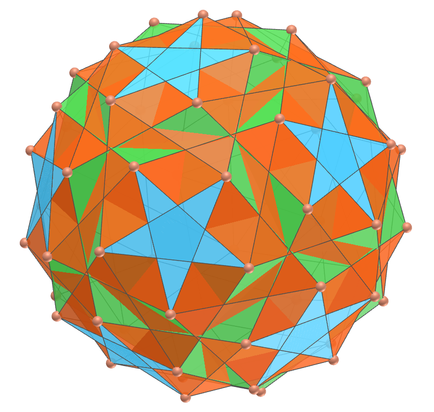
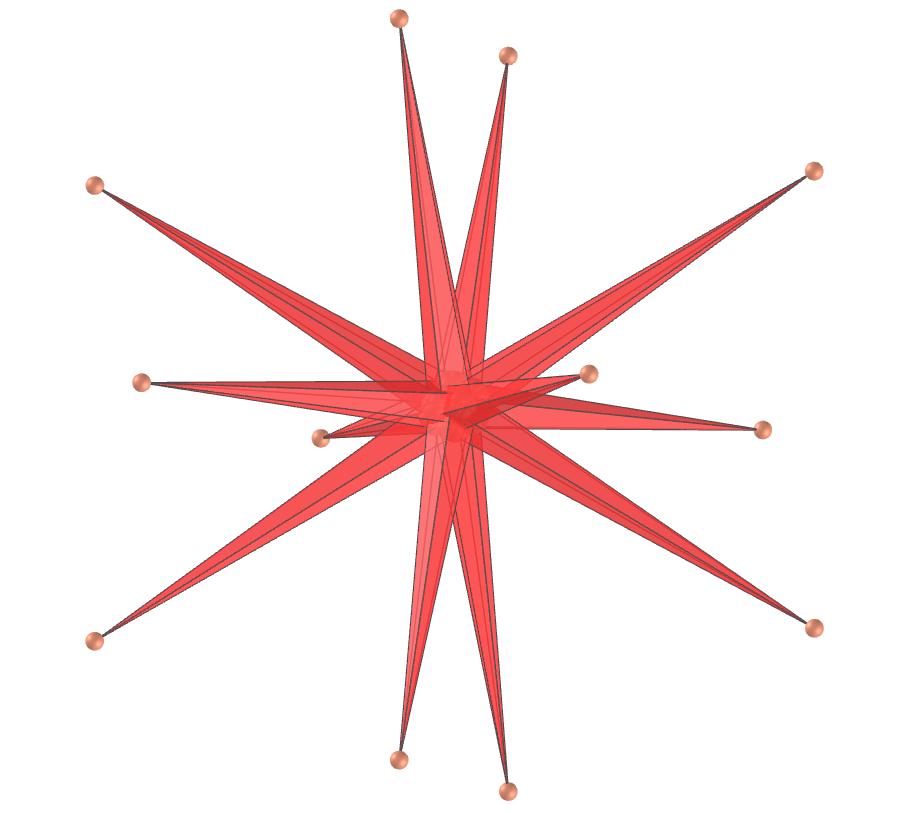
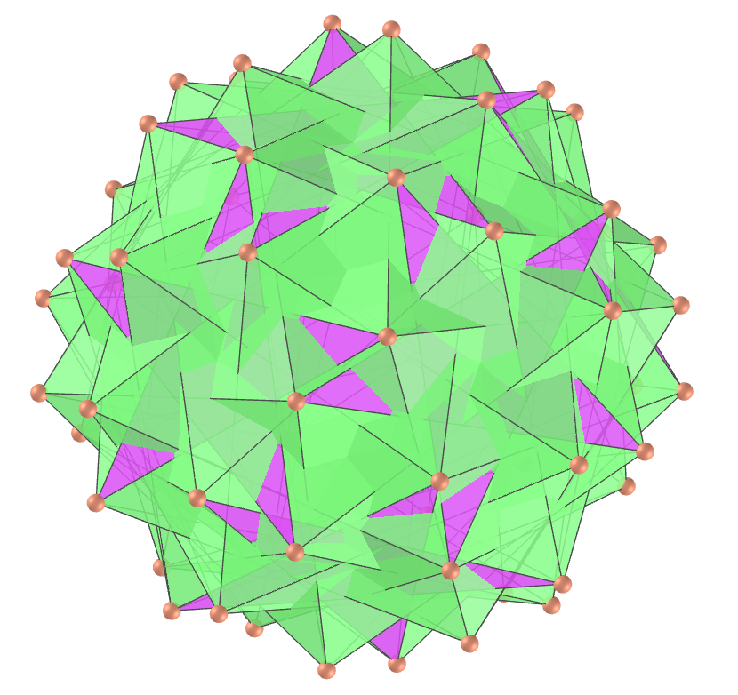
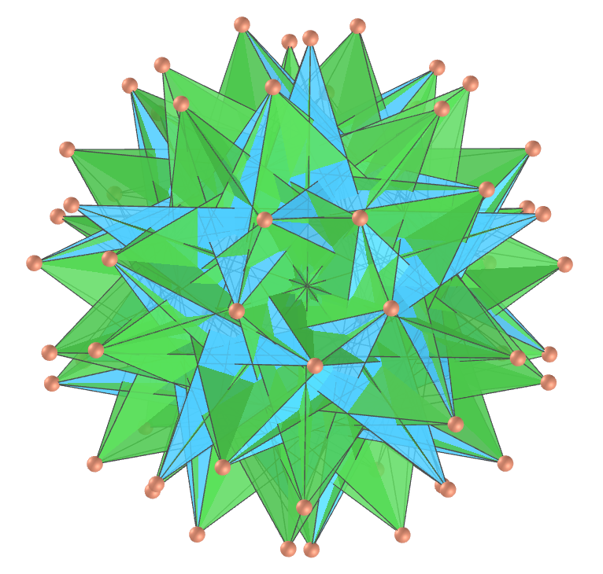
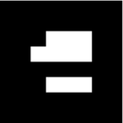
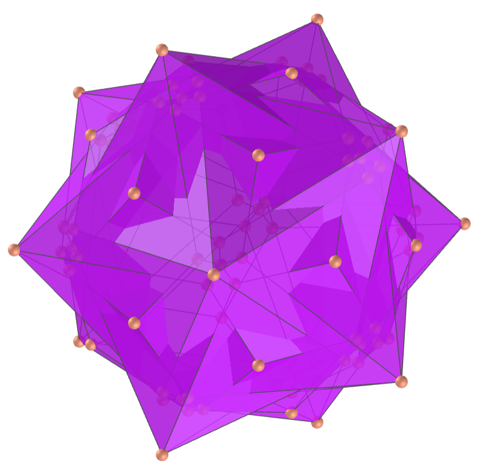
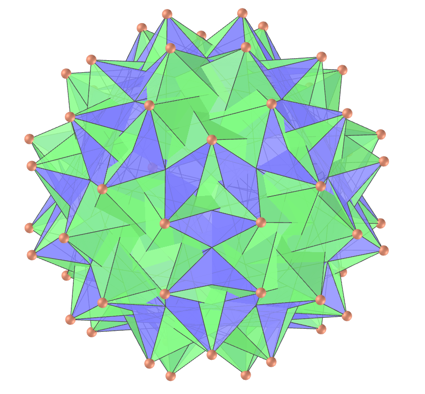
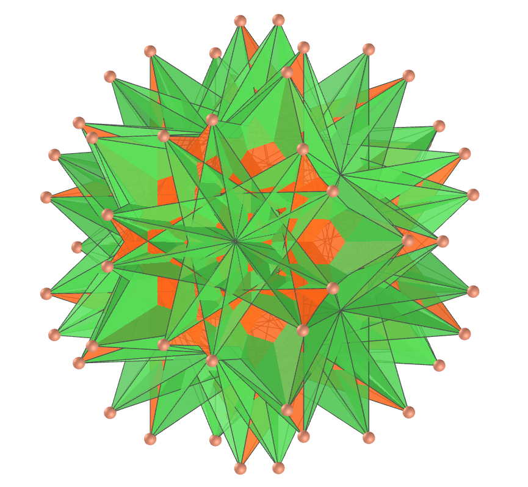
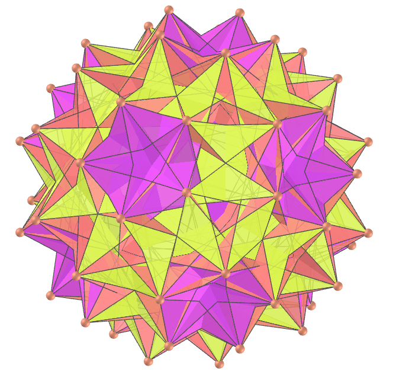

<link rel="stylesheet" href="../../scripts/style.css">
<meta charset="utf-8">
<link rel="icon" type="image/png" href="../vr/salas/imagens/icone.png">
<h2>Visualização de poliedros com Realidade Aumentada (RA) e Realidade Virtual (RV) em A-frame</h2>
<b>autor:</b> Paulo Henrique Siqueira - Universidade Federal do Paraná
 <b>contato:</b> <a href="#"> paulohscwb@gmail.com </a>
 <a href="https://paulohscwb.github.io/polyhedra/selfintersectsnub/">english version</a>
<form style="margin: 0 auto; float:right; text-align:right; width:100%; margin-bottom:15px;">
	<select id="url" onchange="urlHandler(this.value)" style="color:royalblue;">
		<option disabled selected>Mais poliedros:</option>
		<option value="../../archimedes/pt-br/">Arquimedes</option>
		<option value="../../catalan/pt-br/">Catalan</option>
		<option value="../../nonconvex/pt-br/">Não convexos</option>
		<option value="../../platonic/pt-br/">Platão</option>
		<option value="../../polyhedron/pt-br/">Prismas e antiprismas</option>
		<option value="../../quasiregular/pt-br/">Quase regulares</option>
		<option value="../../selfintersect/pt-br/">Auto-interseção</option>
		<option disabled value="../../selfintersectsnub/pt-br/">Auto-interseção snub</option>
		<option value="../../selfintersecttruncated/pt-br/">Auto-interseção truncados</option>
		<option value="../../johnson1/pt-br/">Johnson: 1-32</option>
		<option value="../../johnson2/pt-br/">Johnson: 33-62</option>
		<option value="../../johnson3/pt-br/">Johnson: 63-92</option>
		<option value="../../infinity/pt-br/">Estrelação ao infinito</option>
	</select>
</form>

  <h2 align="center"> Poliedros truncados de auto-interseção snubficados</h2>
  Um poliedro é quase regular snubficado se for transitivo de vértice com figuras irregulares de vértice pentagonal, hexagonal ou octogonal. Transitividade de vértice significa que, para quaisquer dois vértices do poliedro, existe uma translação, rotação e/ou reflexão que deixa a aparência externa do poliedro inalterada, mas move um vértice para o outro. A snubificação de um poliedro é uma operação que permite obter outro poliedro. Esta operação consiste em afastar todas as faces do poliedro, rotacionar as mesmas um certo ângulo e preencher os espaços vazios resultantes com polígonos (por exemplo, triângulos, retângulos ou pentágonos).
  
<a href="#ra">Realidade Aumentada</a>&nbsp;&nbsp;|&nbsp;&nbsp;<a href="#m3d">Modelos 3D</a>&nbsp;&nbsp;|&nbsp;&nbsp;<a href="../../pt-br/">Página Inicial</a>

  

<h3 align="center">Salas imersivas</h3>
  
<iframe width="100%" src="../sala1.htm" title="Sala Imersiva dos poliedros não convexos" frameborder="0" loading="lazy"></iframe>

  
<a href="../sala1.htm" target="_blank">&#x1f517; sala 1</a>&nbsp;&nbsp;|&nbsp;&nbsp;<a href="../sala2.htm" target="_blank">&#x1f517; sala 2</a>&nbsp;&nbsp;|&nbsp;&nbsp;<a href="../sala3.htm" target="_blank">&#x1f517; sala 3</a>

  

  <h3 id="ra" align="center">Realidade Aumentada</h3>
  Para visualizar os poliedros truncados de auto-interseção snubficados em RA, visite a página:

<a href="../ra.html" target="_blank">https://paulohscwb.github.io/polyhedra/selfintersectsnub/ra.html</a>
 
com qualquer navegador com um dispositivo de webcam (smartphone, tablet ou notebook).
 O acesso às páginas de RV é feito clicando no círculo azul que aparece em cima de cada marcador.

<h3 id="m3d" align="center">Modelos 3D</h3>
  <iframe width="560" height="315" style="max-width:100%" src="https://www.youtube.com/embed/videoseries?list=PLy0I_lGW8HxWIwjaEwGWNbrv1lZeh8pDy" title="YouTube video player" frameborder="0" allow="accelerometer; autoplay; clipboard-write; encrypted-media; gyroscope; picture-in-picture; web-share" allowfullscreen></iframe>
<h4>1. Dodecadodecaedro snub</h4>

  U40 O dodecadodecaedro snub é o poliedro uniforme também chamado de siddid, cujo poliedro dual é o hexecontaedro pentagonal medial. Três triângulos, 1 pentágono e um pentagrama se encontram em cada vértice.
  <b>Faces:</b> 60 triângulos equiláteros, 12 pentágonos regulares e 12 pentagramas regulares | <b>Arestas:</b> 150 | <b>Vértices:</b> 60 | <b>Ângulos diédricos:</b> 129.79°, 151.49° e 157.78°. <a href="https://mathworld.wolfram.com/SnubDodecadodecahedron.html" target="_blank">Mais sobre...</a>
 

<h4>2. Hexecontaedro pentagonal medial</h4>

  O hexecontaedro pentagonal medial é o poliedro cujo dual é o uniforme dodecadodecaedro snub. Consiste em 60 pentágonos irregulares, cada um com duas arestas curtas, uma média e duas longas.
  <b>Faces:</b> 60 pentágonos irregulares | <b>Arestas:</b> 150 | <b>Vértices:</b> 84 | <b>Ângulo diédrico:</b> 133.8°. <a href="https://en.wikipedia.org/wiki/Medial_pentagonal_hexecontahedron" target="_blank">Mais sobre...</a>
 

<h4>3. Dodecadodecaedro snub invertido</h4>

  U60 O dodecadodecaedro snub invertido é o poliedro uniforme também chamado de dodecadodecaedro vertisnub ou isdid, cujo poliedro dual é o hexecontaedro pentagonal invertido medial. Três triângulos, 1 pentágono e um pentagrama se encontram em cada vértice. Ele pode ser construído pela alternância do dodecadodecaedro quase truncado e, em seguida, definindo todos os comprimentos de arestas para ficarem com mesmo tamanho.
  <b>Faces:</b> 60 triângulos equiláteros, 12 pentágonos regulares e 12 pentagramas regulares | <b>Arestas:</b> 150 | <b>Vértices:</b> 60 | <b>Ângulos diédricos:</b> 68.64°, 130.49° e 11.12°. <a href="https://mathworld.wolfram.com/InvertedSnubDodecadodecahedron.html" target="_blank">Mais sobre...</a>
 

<h4>4. Hexecontaedro pentagonal invertido medial</h4>

  O hexecontaedro pentagonal invertido medial é o poliedro cujo dual é o uniforme dodecadodecaedro snub invertido. Consiste em 60 pentágonos irregulares, cada um com duas arestas curtas, uma média e duas longas. Parte de cada pentágono está dentro do sólido, portanto é invisível em modelos sólidos.
  <b>Faces:</b> 60 pentágonos irregulares | <b>Arestas:</b> 150 | <b>Vértices:</b> 84 | <b>Ângulo diédrico:</b> 108.09°. <a href="https://polytope.miraheze.org/wiki/Medial_inverted_pentagonal_hexecontahedron" target="_blank">Mais sobre...</a>
 

<h4>5. Grande icosidodecaedro snub</h4>

  U57 O grande icosidodecaedro snub é o poliedro uniforme também chamado de gosid, cujo poliedro dual é o grande hexecontaedro pentagonal. Quatro triângulos e um pentagrama se encontram em cada vértice. Este poliedro é o membro snubficado da família que inclui o grande icosaedro, o grande dodecaedro estrelado e o grande icosidodecaedro.
  <b>Faces:</b> 80 triângulos equiláteros e 12 pentagramas regulares | <b>Arestas:</b> 150 | <b>Vértices:</b> 60 | <b>Ângulos diédricos:</b> 126.82° e 138.82°. <a href="https://mathworld.wolfram.com/GreatSnubIcosidodecahedron.html" target="_blank">Mais sobre...</a>
 

<h4>6. Grande hexecontaedro pentagonal</h4>

  O grande hexecontaedro pentagonal é o poliedro cujo dual é o uniforme grande icosidodecaedro snub. Consiste em 60 pentágonos simétricos, cada um com duas arestas curtas e três longas. Parte de cada pentágono está dentro do sólido, portanto é invisível em modelos sólidos.
  <b>Faces:</b> 60 pentágonos simétricos | <b>Arestas:</b> 150 | <b>Vértices:</b> 92 | <b>Ângulo diédrico:</b> 104.43°. <a href="https://polytope.miraheze.org/wiki/Great_pentagonal_hexecontahedron" target="_blank">Mais sobre...</a>
 

<h4>7. Grande icosidodecaedro snub invertido</h4>

  U69 O grande icosidodecaedro snub invertido é o poliedro uniforme também chamado de gisid, cujo poliedro dual é o grande hexecontaedro pentagonal invertido. Quatro triângulos e um pentagrama se encontram em cada vértice. Ele pode ser construído pela alternância do grande icosidodecaedro quase truncado após definir todos os comprimentos de arestas para serem iguais.
  <b>Faces:</b> 80 triângulos equiláteros e 12 pentagramas regulares | <b>Arestas:</b> 150 | <b>Vértices:</b> 60 | <b>Ângulos diédricos:</b> 21.61° e 89.79°. <a href="https://mathworld.wolfram.com/GreatInvertedSnubIcosidodecahedron.html" target="_blank">Mais sobre...</a>
 

<a href="#p9" class="topo">voltar ao topo</a>

<h4>8. Grande hexecontaedro pentagonal invertido</h4>

  O grande hexecontaedro pentagonal invertido é o poliedro cujo dual é o uniforme grande icosidodecaedro snub invertido. Consiste em 60 pentágonos simétricos côncavos, cada um com duas arestas curtas e três longas. Parte de cada pentágono está dentro do sólido, portanto é invisível em modelos sólidos.
  <b>Faces:</b> 60 pentágonos simétricos | <b>Arestas:</b> 150 | <b>Vértices:</b> 92 | <b>Ângulo diédrico:</b> 78.36°. <a href="https://polytope.miraheze.org/wiki/Great_inverted_pentagonal_hexecontahedron" target="_blank">Mais sobre...</a>
 

<h4>9. Grande icosidodecaedro retrosnub</h4>

  U74 O grande icosidodecaedro retrosnub é o poliedro uniforme também chamado de grande icosidodecaedro retrosnub invertido, cujo poliedro dual é o grande hexecontaedro pentagrâmico. Quatro triângulos e um pentagrama se encontram em cada vértice.
  <b>Faces:</b> 80 triângulos equiláteros e 12 pentagramas regulares | <b>Arestas:</b> 150 | <b>Vértices:</b> 60 | <b>Ângulos diédricos:</b> 21.72° e 67.31°. <a href="https://mathworld.wolfram.com/GreatRetrosnubIcosidodecahedron.html" target="_blank">Mais sobre...</a>
 

<h4>10. Grande hexecontaedro pentagrâmico</h4>

  O grande hexecontaedro pentagrâmico, também chamado de grande ditriacontaedro dentóide, é o poliedro cujo dual é o uniforme grande retrosnub icosidodecaedro. Consiste em 60 pentágonos simétricos e parte de cada pentágono está dentro do sólido, portanto, é invisível em modelos sólidos.
  <b>Faces:</b> 60 pentágonos simétricos | <b>Arestas:</b> 150 | <b>Vértices:</b> 92 | <b>Ângulo diédrico:</b> 60.9°. <a href="https://polytope.miraheze.org/wiki/Great_pentagrammic_hexecontahedron" target="_blank">Mais sobre...</a>
 

<h4>11. Icosidodecadodecaedro snub</h4>

  U46 O icosidodecadodecaedro snub é o poliedro uniforme também denominado de sided, cujo poliedro dual é o hexecontaedro hexagonal medial. Quatro triângulos, um pentágono e um pentagrama encontram-se em cada vértice. Ele pode ser construído pela alternância do icosidodecatruncado icosidodecaedro e, em seguida, definindo todos os comprimentos de arestas para serem iguais.
  <b>Faces:</b> 80 triângulos equiláteros, 12 pentágonos regulares e 12 pentagramas regulares | <b>Arestas:</b> 180 | <b>Vértices:</b> 60 | <b>Ângulos diédricos:</b> 7.35°, 120.43° e 146.78°. <a href="https://mathworld.wolfram.com/SnubIcosidodecadodecahedron.html" target="_blank">Mais sobre...</a>
 

<h4>12. Hexecontaedro hexagonal medial</h4>

  O hexecontaedro hexagonal medial é o poliedro cujo dual é o uniforme icosidodecadodecaedro snub. É composto por 60 hexágonos não convexos assimétricos e cada hexágono tem duas arestas longas, duas de comprimento médio e duas curtas. Parte de cada hexágono está dentro do sólido, portanto, é invisível em modelos sólidos.
  <b>Faces:</b> 60 hexágonos irregulares | <b>Arestas:</b> 180 | <b>Vértices:</b> 104 | <b>Ângulo diédrico:</b> 127.32°. <a href="https://polytope.miraheze.org/wiki/Medial_hexagonal_hexecontahedron" target="_blank">Mais sobre...</a>
 

<h4>13. Grande dodecicosidodecaedro snub</h4>

  U64 O grande dodecicosidodecaedro snub é o poliedro uniforme também chamado de gisdid, cujo poliedro dual é o grande hexecontaedro hexagonal. Quatro triângulos e dois pentagramas se encontram em cada vértice. As arestas deste poliedro são um subconjunto das arestas do grande dirrombicosidodecaedro e compartilham os mesmos vértices.
  <b>Faces:</b> 80 triângulos equiláteros e 24 pentagramas regulares | <b>Arestas:</b> 180 | <b>Vértices:</b> 60 | <b>Ângulos diédricos:</b> 16.3°, 109.47° e 125.77°. <a href="https://mathworld.wolfram.com/GreatSnubDodecicosidodecahedron.html" target="_blank">Mais sobre...</a>
 

<h4>14. Grande hexecontaedro hexagonal</h4>

  O grande hexecontaedro hexagonal é o poliedro cujo dual é o uniforme grande dodecicosidodecaedro snub. Consiste em 60 hexágonos não convexos assimétricos e cada hexágono tem duas arestas curtas, duas médias e duas longas. Parte de cada hexágono está dentro do sólido, portanto, é invisível em modelos sólidos.
  <b>Faces:</b> 60 hexágonos irregulares | <b>Arestas:</b> 180 | <b>Vértices:</b> 104 | <b>Ângulo diédrico:</b> 90°. <a href="https://polytope.miraheze.org/wiki/Great_hexagonal_hexecontahedron" target="_blank">Mais sobre...</a>
 

<a href="#p9" class="topo">voltar ao topo</a>

<h4>15. Pequeno icosicosidodecaedro snub</h4>

  U32 O pequeno icosicosidodecaedro snub é o poliedro uniforme também chamado de seside, cujo poliedro dual é o pequeno hexecontaedro hexagonal. Cinco triângulos e um pentagrama se encontram em cada vértice. É composto por 60 triângulos snubficados, mais 40 triângulos que criam 20 hexagramas devido a pares pertencentes ao mesmo plano e 12 pentagramas.
  <b>Faces:</b> 100 triângulos equiláteros e 12 pentagramas regulares | <b>Arestas:</b> 180 | <b>Vértices:</b> 60 | <b>Ângulos diédricos:</b> 155.67° e 161.02°. <a href="https://mathworld.wolfram.com/SmallSnubIcosicosidodecahedron.html" target="_blank">Mais sobre...</a>
 

<h4>16. Pequeno hexecontaedro hexagonal</h4>

  O pequeno hexecontaedro hexagonal é o poliedro cujo dual é o uniforme pequeno icosicosidodecaedro snub. Consiste em 60 hexágonos simétricos e parte de cada hexágono está dentro do sólido, portanto, é invisível em modelos sólidos.
  <b>Faces:</b> 60 hexágonos simétricos | <b>Arestas:</b> 180 | <b>Vértices:</b> 112 | <b>Ângulo diédrico:</b> 139.89°. <a href="https://polytope.miraheze.org/wiki/Small_hexagonal_hexecontahedron" target="_blank">Mais sobre...</a>
 

<h4>17. Pequeno icosicosidodecaedro retrosnub</h4>

  U72 O pequeno icosicosidodecaedro retrosnub é o poliedro uniforme também chamado de disicosidodecaedro retrosnub, cujo poliedro dual é o pequeno hexecontaedro hexagrâmico. As 40 faces triangulares não snubficadas formam 20 pares coplanares, criando hexágonos estrelados não regulares. Ao contrário da maioria dos poliedros snub, ele possui simetrias de reflexão.
  <b>Faces:</b> 100 triângulos equiláteros e 12 pentagramas regulares | <b>Arestas:</b> 180 | <b>Vértices:</b> 60 | <b>Ângulos diédricos:</b> 24.33° e 44.46°. <a href="https://mathworld.wolfram.com/SmallRetrosnubIcosicosidodecahedron.html" target="_blank">Mais sobre...</a>
 

<h4>18. Pequeno hexecontaedro hexagrâmico</h4>

  O pequeno hexecontaedro hexagrâmico é o poliedro cujo dual é o uniforme pequeno icosicosidodecaedro retrosnub. Consiste em 60 hexagramas simétricos espelhados e parte de cada hexagrama está dentro do sólido, portanto, é invisível em modelos sólidos.
  <b>Faces:</b> 60 hexagramas simétricos | <b>Arestas:</b> 180 | <b>Vértices:</b> 112 | <b>Ângulo diédrico:</b> 61.13°. <a href="https://polytope.miraheze.org/wiki/Small_hexagrammic_hexecontahedron" target="_blank">Mais sobre...</a>
 

<h4>19. Grande dirrombicosidodecaedro</h4>

  U75 O grande dirrombicosidodecaedro é o poliedro uniforme também chamado de gidrid, cujo poliedro dual é o grande dirrombicosidodecacron. É o único poliedro uniforme com mais de seis polígonos envolvendo cada vértice do poliedro: quatro quadrados alternados com dois triângulos e dois pentagramas. O grande dirrombicosidodecaedro é o poliedro uniforme mais complexo e tem faces passando pelo centro. Portanto, alguns dos vértices do grande dirrombicosidodecacron estão em pontos ideais infinitamente distantes da origem.
  <b>Faces:</b> 40 triângulos equiláteros, 60 quadrados e 24 pentagramas regulares | <b>Arestas:</b> 240 | <b>Vértices:</b> 60 | <b>Ângulos diédricos:</b> 54.74° e 71.04°. <a href="https://mathworld.wolfram.com/GreatDirhombicosidodecahedron.html" target="_blank">Mais sobre...</a>
 

<h4>20. Grande dirrombidodecaedro disnub</h4>

  O grande dirrombidodecaedro disnub, também chamado gididrid ou figura de Skilling, é um poliedro estrelado uniforme degenerado. Devido à sua realização geométrica com algumas arestas duplas onde 4 faces se encontram, é considerado um poliedro uniforme degenerado, mas não estritamente um poliedro uniforme. Seis triângulos, quatro quadrados e dois pentagramas se encontram em cada vértice. Pode ser construído como uma mistura do grande dirrombicosidodecaedro uniforme e do icosaedro disnub, o composto uniforme de 20 octaedros com o qual compartilha seu esqueleto de arestas.
  <b>Faces:</b> 120 triângulos equiláteros, 60 quadrados e 24 pentagramas regulares | <b>Arestas:</b> 360 | <b>Vértices:</b> 60 | <b>Ângulos diédricos:</b> 109.47°, 54.73° e 71.04°. <a href="https://polytope.miraheze.org/wiki/Great_disnub_dirhombidodecahedron" target="_blank">Mais sobre...</a>
 

<h4>21. Poliedros truncados de auto-interseção snubficados e seus duais</h4>

  Representação com cada poliedro truncado de auto-interseção snubficado e seu respectivo dual. Neste projeto, temos os poliedros simulando uma fita de DNA com as respectivas ligações entre os duais dos poliedros truncados de auto-interseção snubficados. 
 

<a href="#p9" class="topo">voltar ao topo</a>

  Self-intersecting snub polyhedra - Visualization of polyhedra with Augmented Reality and Virtual Reality de <a xmlns:cc="http://creativecommons.org/ns#" href="https://paulohscwb.github.io/polyhedra/selfintersectsnub/" property="cc:attributionName" rel="cc:attributionURL">Paulo Henrique Siqueira</a> está licenciado com uma Licença <a rel="license" href="http://creativecommons.org/licenses/by-nc-nd/4.0/">Creative Commons Atribuição-NãoComercial-SemDerivações 4.0 Internacional</a>.

<h4>Como citar este trabalho:</h4> 

Siqueira, P.H., "Self-intersecting snub polyhedra - Visualization of polyhedra with Augmented Reality and Virtual Reality". Disponível em: <https://paulohscwb.github.io/polyhedra/selfintersectsnub/>, Março de 2023.

  <b>Referências:</b>
 Weisstein, Eric W. "Miscellaneous Polyhedra" From MathWorld-A Wolfram Web Resource. <a href="http://mathworld.wolfram.com/topics/MiscellaneousPolyhedra.html" target="_blank">http://mathworld.wolfram.com/topics/MiscellaneousPolyhedra.html</a>
 Weisstein, Eric W. "Uniform Polyhedron." From MathWorld--A Wolfram Web Resource. <a href="https://mathworld.wolfram.com/UniformPolyhedron.html" target="_blank">https://mathworld.wolfram.com/UniformPolyhedron.html</a>
 Wikipedia <a href="https://en.wikipedia.org/wiki/List_of_uniform_polyhedra" target="_blank">https://en.wikipedia.org/wiki/List_of_uniform_polyhedra</a>
 McCooey, David I. "Visual Polyhedra". <a href="http://dmccooey.com/polyhedra/" target="_blank">http://dmccooey.com/polyhedra/</a>
