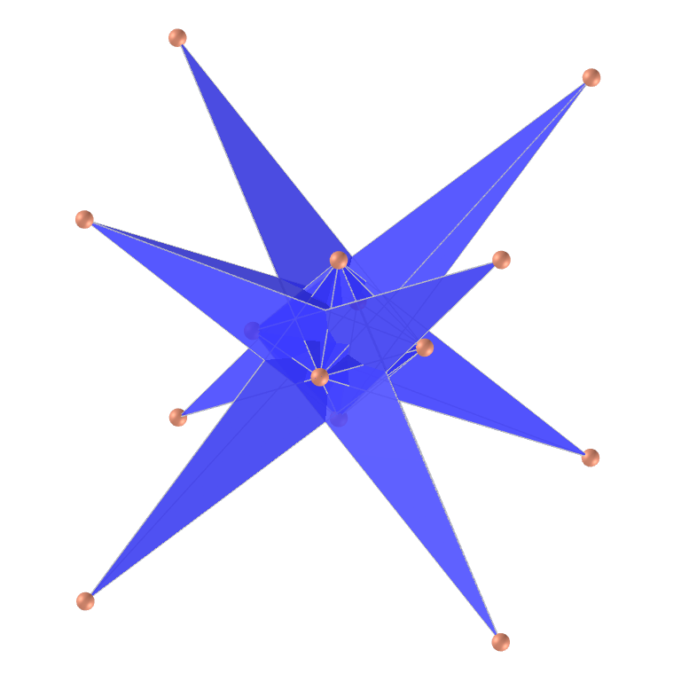
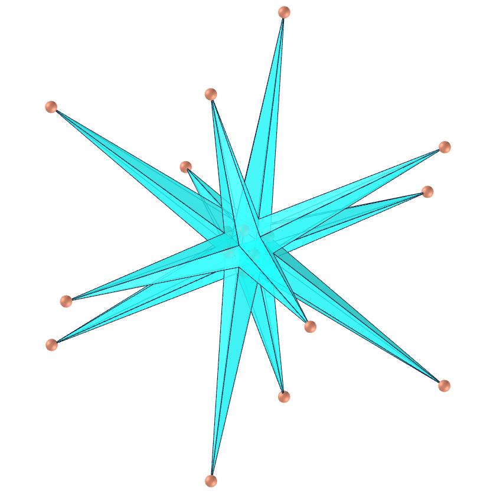
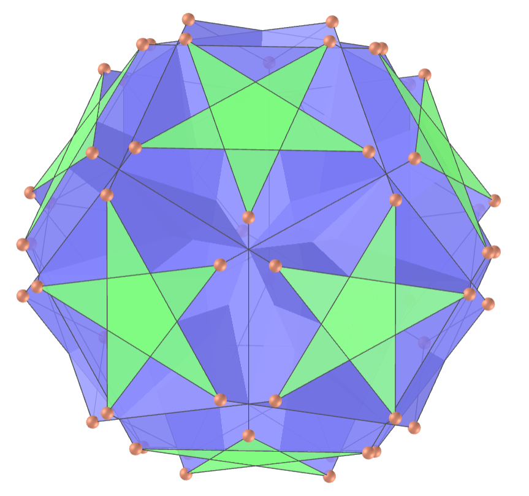
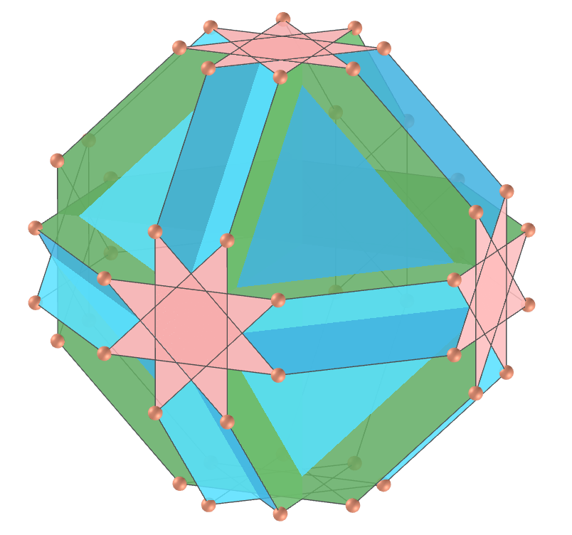
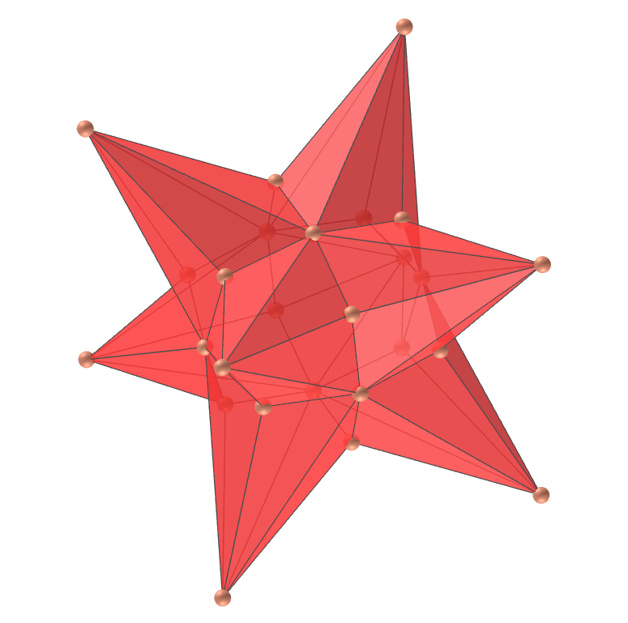
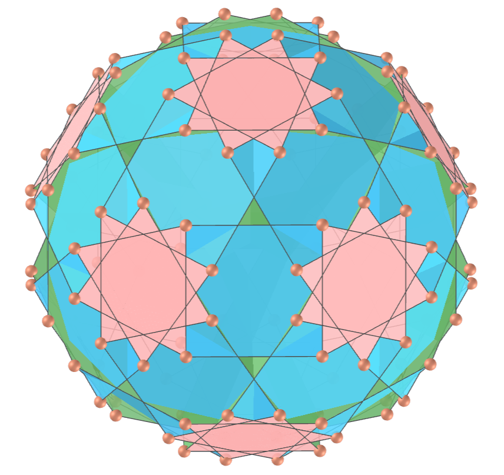

<link rel="stylesheet" href="scripts/style.css">
<link rel="shortcut icon" type="image/png" href="vr/salas/imagens/icone.png">
<h2>Visualization of polyhedra with Augmented Reality (AR) and Virtual Reality (VR) in A-frame</h2>
 <b>author:</b> Paulo Henrique Siqueira - Universidade Federal do Paraná
  <b>contact:</b> <a href="#">paulohscwb@gmail.com</a>
  <a href="https://paulohscwb.github.io/polyhedra/selfintersecttruncated/pt-br/">versão em português</a>
<form style="margin: 0 auto; float:right; text-align:right; width:100%; margin-bottom:15px;">
	<a href="../">Home</a>
	 <select id="url" onchange="urlHandler(this.value)" style="color:royalblue;">
		<option disabled selected value>More polyhedra:</option>
		<option value="../archimedes/">Archimedes</option>
		<option value="../catalan/">Catalan</option>
		<option value="../nonconvex/">Non convex</option>
		<option value="../platonic/">Platonic</option>
		<option value="../polyhedron/">Prisms and antiprisms</option>
		<option value="../quasiregular/">Quasi regular</option>
		<option value="../selfintersect/">Self-intersecting</option>
		<option value="../selfintersectsnub/">Self-intersecting snub</option>
		<option disabled value="../selfintersecttruncated/">Self intersecting truncated</option>
		<option value="../johnson1/">Johnson: 1-32</option>
		<option value="../johnson2/">Johnson: 33-62</option>
		<option value="../johnson3/">Johnson: 63-92</option>
	</select>
</form>

  <h2 align="center"> Self-intersecting truncated polyhedra</h2>
  A polyhedron is truncated regular if it is vertex-transitive with isosceles triangular vertex figures. Vertex transitivity means that for any two vertices of the polyhedron, there exists a translation, rotation, and/or reflection that leaves the outward appearance of the polyhedron unchanged yet moves one vertex to the other. A vertex figure is the polygon produced by connecting the midpoints of the edges meeting at the vertex in the same order that the edges appear around the vertex.
  

  To view self-intersecting truncated polyhedra in AR, simply visit:

<a href="ra.html" target="_blank">https://paulohscwb.github.io/polyhedra/selfintersecttruncated/ra.html</a>
 
with any browser with a webcam device (smartphone, tablet or notebook). 
 Access to the VR sites is done by clicking on the blue circle that appears on top of the marker.

<h4>1. Stellated Truncated Hexahedron</h4>

  U19 The stellated truncated hexahedron is the uniform polyhedron also called the quasitruncated hexahedron, whose dual polyhedron is the great triakis octahedron. The convex hull of the stellated truncated hexahedron is the Archimedean small rhombicuboctahedron.
  <b>Faces:</b> 14 equilateral triangles and 6 regular octagrams | <b>Edges:</b> 36 | <b>Vertices:</b> 24 | <b>Dihedral angles:</b> 54.74° and 90°. <a href="https://mathworld.wolfram.com/StellatedTruncatedHexahedron.html" target="_blank">More...</a>

<h4>2. Great Triakis Octahedron</h4>

  The great triakis octahedron is the dual of the uniform stellated truncated hexahedron. It has 24 intersecting isosceles triangles faces and part of each triangle lies within the solid, hence is invisible in solid models. 
  <b>Faces:</b> 24 isosceles triangles | <b>Edges:</b> 36 | <b>Vertices:</b> 14 | <b>Dihedral angle:</b> 60.72°. <a href="https://en.wikipedia.org/wiki/Great_triakis_octahedron" target="_blank">More...</a>

<h4>3. Truncated Great Dodecahedron</h4>

  U37 The truncated great dodecahedron is the uniform polyhedron whose dual is the small stellapentakis dodecahedron. It shares its vertex arrangement with three other uniform polyhedra: the nonconvex great rhombicosidodecahedron, the great dodecicosidodecahedron, and the great rhombidodecahedron.
  <b>Faces:</b> 12 regular pentagrams and 12 regular decagons | <b>Edges:</b> 90 | <b>Vertices:</b> 60 | <b>Dihedral angles:</b> 63.43° and 116.57°. <a href="https://en.wikipedia.org/wiki/Truncated_great_dodecahedron" target="_blank">More...</a>

<h4>4. Small Stellapentakis Dodecahedron</h4>

  The small stellapentakis dodecahedron is the polyhedron whose dual is the uniform truncated great dodecahedron. It has 60 intersecting triangular faces and part of each triangle lies within the solid, hence is invisible in solid models. 
  <b>Faces:</b> 60 isosceles triangles | <b>Edges:</b> 90 | <b>Vertices:</b> 24 | <b>Dihedral angle:</b> 149.1°. <a href="https://en.wikipedia.org/wiki/Small_stellapentakis_dodecahedron" target="_blank">More...</a>

<h4>5. Small Stellated Truncated Dodecahedron</h4>

  U58 The small stellated truncated dodecahedron is the uniform polyhedron also called the quasitruncated small stellated dodecahedron, whose dual polyhedron is the great pentakis dodecahedron. Part of each face lies within the solid, hence is invisible in solid models. 
  <b>Faces:</b> 12 regular pentagons and 12 regular decagrams | <b>Edges:</b> 90 | <b>Vertices:</b> 60 | <b>Dihedral angles:</b> 63.43° and 116.57°. <a href="https://mathworld.wolfram.com/SmallStellatedTruncatedDodecahedron.html" target="_blank">More...</a>

<h4>6. Great Pentakis Dodecahedron</h4>

  The great pentakis dodecahedron is the polyhedron whose dual is the uniform small stellated truncated dodecahedron. The pentagonal faces pass close to the center in the uniform polyhedron, causing this dual to be very spikey and part of each triangle lies within the solid, hence is invisible in solid models.  
  <b>Faces:</b> 60 isosceles triangles | <b>Edges:</b> 90 | <b>Vertices:</b> 24 | <b>Dihedral angle:</b> 108.22°. <a href="https://en.wikipedia.org/wiki/Great_pentakis_dodecahedron" target="_blank">More...</a>

<h4>7. Great Stellated Truncated Dodecahedron</h4>

  U66 The great stellated truncated dodecahedron is the uniform polyhedron also called the quasitruncated great stellated dodecahedron, whose dual is the great triakis icosahedron. Part of each face lies within the solid, hence is invisible in solid models. 
  <b>Faces:</b> 20 equilateral triangles and 12 regular decagrams | <b>Edges:</b> 90 | <b>Vertices:</b> 60 | <b>Dihedral angles:</b> 63.43° and 79.19°. <a href="https://mathworld.wolfram.com/GreatStellatedTruncatedDodecahedron.html" target="_blank">More...</a>

<h4>8. Great Triakis Icosahedron</h4>

  The great triakis icosahedron is the polyhedron whose dual is the uniform great stellated truncated dodecahedron. Its faces are isosceles triangles and part of each triangle lies within the solid, hence is invisible in solid models.  
  <b>Faces:</b> 60 isosceles triangles | <b>Edges:</b> 90 | <b>Vertices:</b> 32 | <b>Dihedral angle:</b> 81°. <a href="https://en.wikipedia.org/wiki/Great_triakis_icosahedron" target="_blank">More...</a>

<h4>9. Great Truncated Icosahedron</h4>

  U55 The great truncated icosahedron is the uniform polyhedron, also called the truncated great icosahedron, whose dual is the great stellapentakis dodecahedron. Part of each face lies within the solid, hence is invisible in solid models. 
  <b>Faces:</b> 20 regular hexagons and 12 regular pentagrams | <b>Edges:</b> 90 | <b>Vertices:</b> 60 | <b>Dihedral angles:</b> 41.81° and 100.81°. <a href="https://mathworld.wolfram.com/GreatTruncatedIcosahedron.html" target="_blank">More...</a>

<h4>10. Great Stellapentakis Dodecahedron</h4>

  The great stellapentakis dodecahedron (or great astropentakis dodecahedron) is the polyhedron whose dual is the uniform great truncated icosahedron. Its faces are isosceles triangles and part of each triangle lies within the solid, hence is invisible in solid models.  
  <b>Faces:</b> 60 isosceles triangles | <b>Edges:</b> 90 | <b>Vertices:</b> 32 | <b>Dihedral angle:</b> 123.32°. <a href="https://en.wikipedia.org/wiki/Great_stellapentakis_dodecahedron" target="_blank">More...</a>

<a href="#p8" class="topo">back to top</a>

<h4>11. Cubitruncated Cuboctahedron</h4>

  U16 The cubitruncated cuboctahedron (or cuboctatruncated cuboctahedron) is the uniform polyhedron whose dual is the tetradyakis hexahedron and is a faceted octahedron. Its convex hull is a nonuniform truncated cuboctahedron.   
  <b>Faces:</b> 8 regular hexagons, 6 regular octagons and 6 regular octagrams | <b>Edges:</b> 72 | <b>Vertices:</b> 48 | <b>Dihedral angles:</b> 54.74°, 90° and 125.26°. <a href="https://mathworld.wolfram.com/CubitruncatedCuboctahedron.html" target="_blank">More...</a>

<h4>12. Tetradyakis Hexahedron</h4>

  The tetradyakis hexahedron (or great disdyakis dodecahedron) is the polyhedron whose dual is the uniform cubitruncated cuboctahedron. Its faces are scalene triangles and part of each triangle lies within the solid, hence is invisible in solid models.  
  <b>Faces:</b> 48 obtuse triangles | <b>Edges:</b> 72 | <b>Vertices:</b> 20 | <b>Dihedral angle:</b> 135.58°. <a href="https://en.wikipedia.org/wiki/Cubitruncated_cuboctahedron#Tetradyakis_hexahedron" target="_blank">More...</a>

<h4>13. Great Truncated Cuboctahedron</h4>

  U20 The great truncated cuboctahedron (or quasitruncated cuboctahedron or stellatruncated cuboctahedron) is the uniform polyhedron whose dual is the great disdyakis dodecahedron. Its convex hull is a nonuniform truncated cuboctahedron. 
  <b>Faces:</b> 8 regular hexagons, 12 squares and 6 regular octagrams | <b>Edges:</b> 72 | <b>Vertices:</b> 48 | <b>Dihedral angles:</b> 35.26°, 54.73° and 135°. <a href="https://mathworld.wolfram.com/GreatTruncatedCuboctahedron.html" target="_blank">More...</a>

<h4>14. Great Disdyakis Dodecahedron</h4>

  The great disdyakis dodecahedron is the polyhedron whose dual is the uniform great truncated cuboctahedron. The great disdyakis dodecahedron is topologically identical to the convex Catalan solid, disdyakis dodecahedron, which is dual to the truncated cuboctahedron.  
  <b>Faces:</b> 48 obtuse triangles | <b>Edges:</b> 72 | <b>Vertices:</b> 26 | <b>Dihedral angles:</b> 123.85° and 236.15°. <a href="https://en.wikipedia.org/wiki/Great_disdyakis_dodecahedron" target="_blank">More...</a>

<h4>15. Icositruncated Dodecadodecahedron</h4>

  U45 The icositruncated dodecadodecahedron (or icosidodecatruncated icosidodecahedron) is the uniform polyhedron whose dual is the tridyakis icosahedron. Its convex hull is a nonuniform truncated icosidodecahedron.  
  <b>Faces:</b> 20 regular hexagons, 12 regular decagons and 12 regular decagrams | <b>Edges:</b> 180 | <b>Vertices:</b> 120 | <b>Dihedral angles:</b> 100.81°, 116.57° and 142.62°. <a href="https://mathworld.wolfram.com/IcositruncatedDodecadodecahedron.html" target="_blank">More...</a>

<h4>16. Tridyakis icosahedron</h4>

  The tridyakis icosahedron is the polyhedron whose dual is the uniform icositruncated dodecadodecahedron. Its faces are scalene triangles and part of each triangle lies within the solid, hence is invisible in solid models.   
    <b>Faces:</b> 120 obtuse triangles | <b>Edges:</b> 180 | <b>Vertices:</b> 44 | <b>Dihedral angle:</b> 151.04°. <a href="https://en.wikipedia.org/wiki/Tridyakis_icosahedron" target="_blank">More...</a>

<h4>17. Truncated Dodecadodecahedron</h4>

  U59 The truncated dodecadodecahedron (or quasitruncated dodecahedron or stellatruncated dodecadodecahedron) is the uniform polyhedron whose dual is the medial disdyakis triacontahedron. The central region of the polyhedron is connected to the exterior via 20 small triangular holes.  
  <b>Faces:</b> 30 squares, 12 regular decagons and 12 regular decagrams | <b>Edges:</b> 180 | <b>Vertices:</b> 120 | <b>Dihedral angles:</b> 58.28°, 63.43° and 148.28°. <a href="https://en.wikipedia.org/wiki/Truncated_dodecadodecahedron" target="_blank">More...</a>

<h4>18. Medial Disdyakis Triacontahedron</h4>

  The medial disdyakis triacontahedron is the polyhedron whose dual is the uniform truncated dodecadodecahedron. Its faces are scalene triangles and part of each triangle lies within the solid, hence is invisible in solid models.   
    <b>Faces:</b> 120 obtuse triangles | <b>Edges:</b> 180 | <b>Vertices:</b> 54 | <b>Dihedral angles:</b> 144.9° and 215.09°. <a href="https://en.wikipedia.org/wiki/Medial_disdyakis_triacontahedron" target="_blank">More...</a>

<h4>19. Great Truncated Icosidodecahedron</h4>

  U68 The great truncated icosidodecahedron (or great quasitruncated icosidodecahedron or stellatruncated icosidodecahedron) is the uniform polyhedron whose dual is the great disdyakis triacontahedron. It can be alternated into the great inverted snub icosidodecahedron after equalizing edge lengths.  
  <b>Faces:</b> 30 squares, 20 regular hexagons and 12 regular decagrams | <b>Edges:</b> 180 | <b>Vertices:</b> 120 | <b>Dihedral angles:</b> 69.09°, 79.19° and 121.72°. <a href="https://mathworld.wolfram.com/GreatTruncatedIcosidodecahedron.html" target="_blank">More...</a>

<h4>20. Great Disdyakis Triacontahedron</h4>

  The great disdyakis triacontahedron (or trisdyakis icosahedron) is the polyhedron whose dual is the uniform great truncated icosidodecahedron. Its faces are scalene triangles and part of each triangle lies within the solid, hence is invisible in solid models.   
    <b>Faces:</b> 120 obtuse triangles | <b>Edges:</b> 180 | <b>Vertices:</b> 62 | <b>Dihedral angle:</b> 121.34°. <a href="https://en.wikipedia.org/wiki/Great_truncated_icosidodecahedron#Great_disdyakis_triacontahedron" target="_blank">More...</a>

<a href="#p8" class="topo">back to top</a>

  Polyhedra: Self-intersecting truncated by <a xmlns:cc="http://creativecommons.org/ns#" href="https://paulohscwb.github.io/polyhedra/selfintersecttruncated/" property="cc:attributionName" rel="cc:attributionURL">Paulo Henrique Siqueira</a> is licensed with a license <a rel="license" href="http://creativecommons.org/licenses/by-nc-nd/4.0/">Creative Commons Attribution-NonCommercial-NoDerivatives 4.0 International</a>.

<h4>How to cite this work:</h4> 

Siqueira, P.H., "Polyhedra: Self-intersecting truncated". Available in: <https://paulohscwb.github.io/polyhedra/selfintersecttruncated/>, January 2023.

 <b>References:</b>
 Weisstein, Eric W. "Archimedean Solid" From MathWorld-A Wolfram Web Resource. <a href="http://mathworld.wolfram.com/ArchimedeanSolid.html" target="_blank">http://mathworld.wolfram.com/ArchimedeanSolid.html</a>
 Weisstein, Eric W. "Platonic Solid" From MathWorld-A Wolfram Web Resource. <a href="http://mathworld.wolfram.com/PlatonicSolid.html" target="_blank">http://mathworld.wolfram.com/PlatonicSolid.html</a>
 Weisstein, Eric W. "Archimedean Dual" From MathWorld-A Wolfram Web Resource. <a href="https://mathworld.wolfram.com/ArchimedeanDual.html" target="_blank">https://mathworld.wolfram.com/ArchimedeanDual.html</a>
 Weisstein, Eric W. "Uniform Polyhedron." From MathWorld--A Wolfram Web Resource. <a href="https://mathworld.wolfram.com/UniformPolyhedron.html" target="_blank">https://mathworld.wolfram.com/UniformPolyhedron.html</a>
 Wikipedia <a href="https://en.wikipedia.org/wiki/Archimedean_solid" target="_blank">https://en.wikipedia.org/wiki/Archimedean_solid</a>
 Wikipedia <a href="https://en.wikipedia.org/wiki/en.wikipedia.org/wiki/Platonic_solid" target="_blank">https://en.wikipedia.org/wiki/Platonic_solid</a>
 McCooey, David I. "Visual Polyhedra". <a href="http://dmccooey.com/polyhedra/" target="_blank">http://dmccooey.com/polyhedra/</a>
