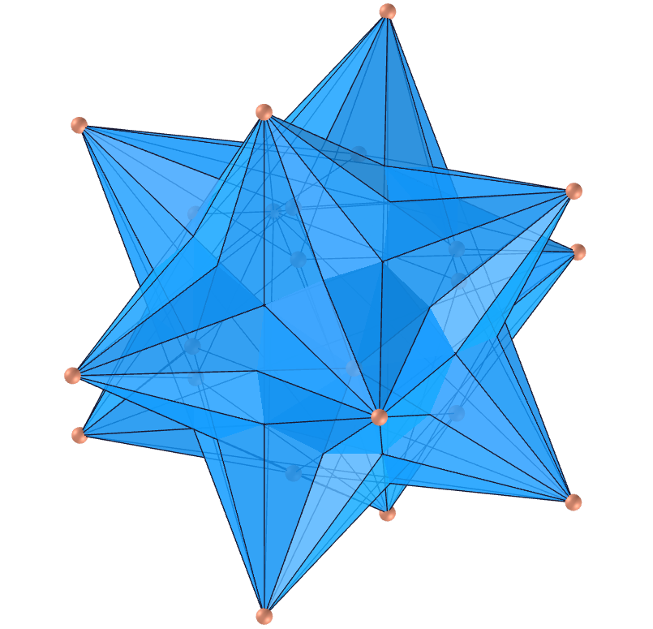
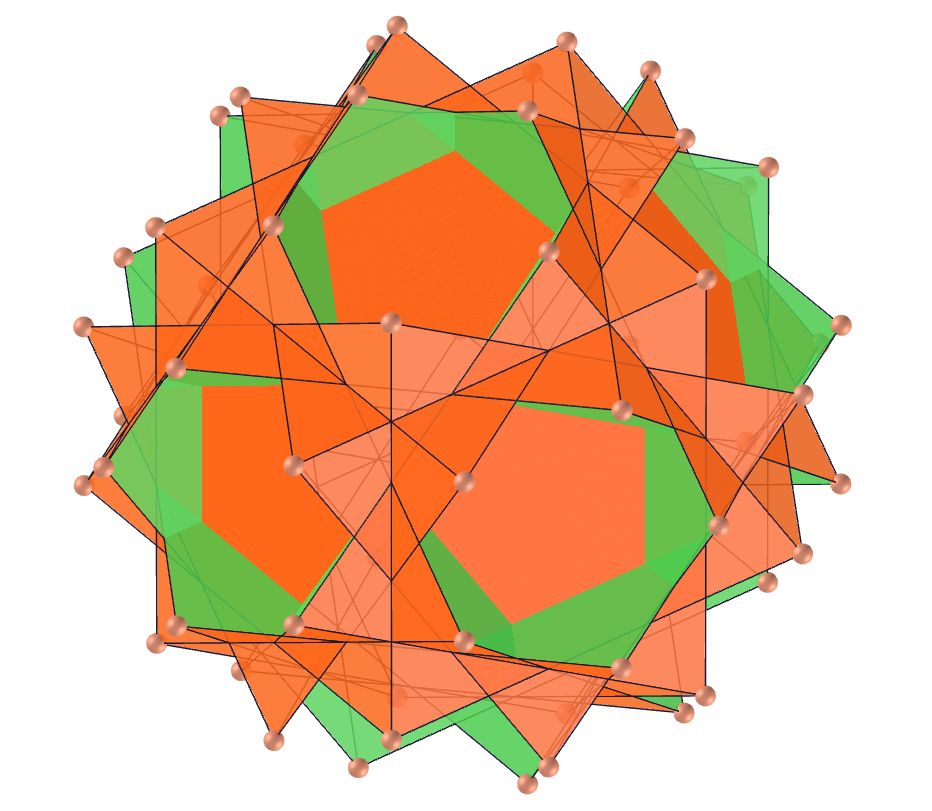
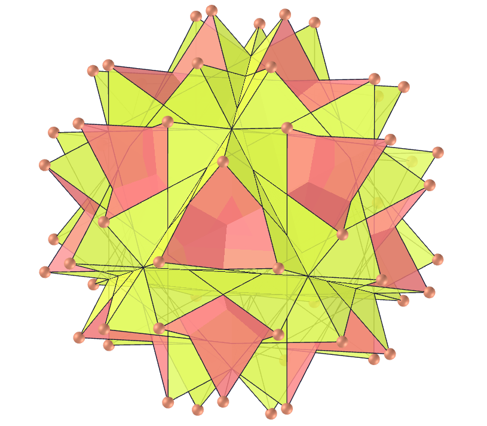
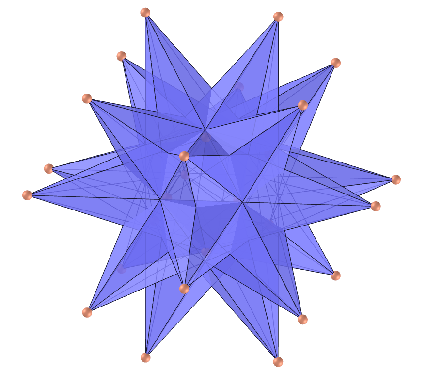
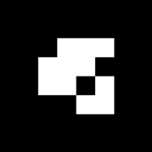
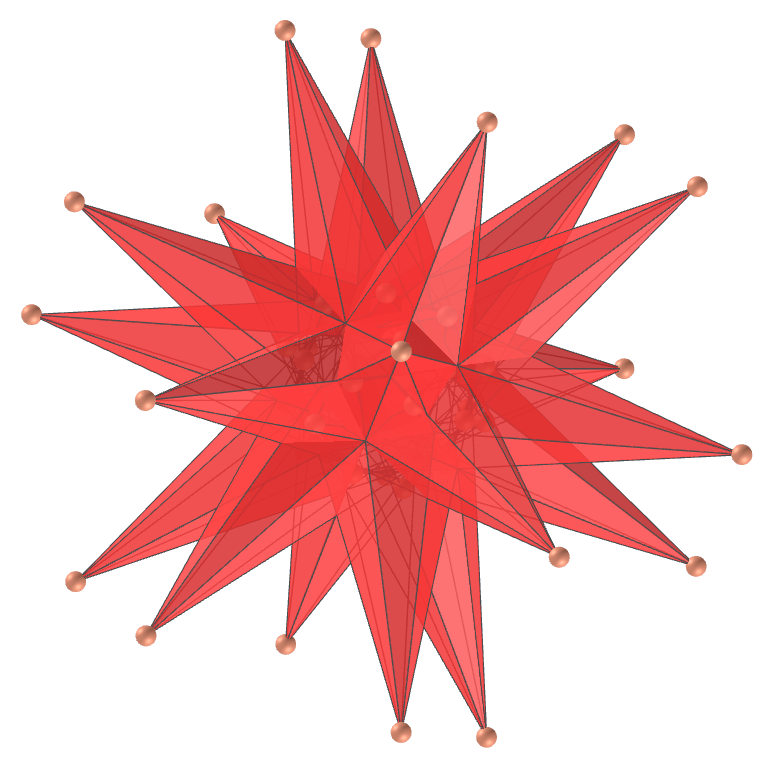

<link rel="stylesheet" href="../../scripts/style.css">
<link rel="shortcut icon" type="image/png" href="../vr/salas/imagens/icone.png">
<h2>Visualização de poliedros com Realidade Aumentada (RA) e Realidade Virtual (RV) em A-frame</h2>
<b>autor:</b> Paulo Henrique Siqueira - Universidade Federal do Paraná
 <b>contato:</b> <a href="#"> paulohscwb@gmail.com </a>
 <a href="https://paulohscwb.github.io/polyhedra/selfintersecttruncated/">english version</a>
<form style="margin: 0 auto; float:right; text-align:right; width:100%; margin-bottom:15px;">
	<a href="../../pt-br/">Página Inicial</a>
	 <select id="url" onchange="urlHandler(this.value)" style="color:royalblue;">
		<option disabled selected>Mais poliedros:</option>
		<option value="../../archimedes/pt-br/">Arquimedes</option>
		<option value="../../catalan/pt-br/">Catalan</option>
		<option value="../../nonconvex/pt-br/">Não convexos</option>
		<option value="../../platonic/pt-br/">Platão</option>
		<option value="../../polyhedron/pt-br/">Prismas e antiprismas</option>
		<option value="../../quasiregular/pt-br/">Quase regulares</option>
		<option value="../../selfintersect/pt-br/">Auto-interseção</option>
		<option value="../../selfintersectsnub/pt-br/">Auto-interseção snub</option>
		<option disabled value="../../selfintersecttruncated/pt-br/">Auto-interseção truncados</option>
		<option value="../../johnson1/pt-br/">Johnson: 1-32</option>
		<option value="../../johnson2/pt-br/">Johnson: 33-62</option>
		<option value="../../johnson3/pt-br/">Johnson: 63-92</option>
		<option value="../../infinity/pt-br/">Estrelação ao infinito</option>
	</select>
</form>

  <h2 align="center"> Poliedros truncados de auto-interseção</h2>
  Um poliedro é regular truncado se for transitivo de vértice com figuras de vértice triangulares isósceles. Transitividade de vértice significa que, para quaisquer dois vértices do poliedro, existe uma translação, rotação e/ou reflexão que deixa a aparência externa do poliedro inalterada, mas move um vértice para o outro. Uma figura de vértice é o polígono produzido pela conexão dos pontos médios das arestas que se encontram no vértice na mesma ordem em que as arestas aparecem ao redor do vértice.
  

  Para visualizar os poliedros truncados de auto-interseção em RA, visite a página:

<a href="../ra.html" target="_blank">https://paulohscwb.github.io/polyhedra/selfintersecttruncated/ra.html</a>
 
com qualquer navegador com um dispositivo de webcam (smartphone, tablet ou notebook).
 O acesso às páginas de RV é feito clicando no círculo azul que aparece em cima de cada marcador.

 

<h4>1. Hexaedro estrelado truncado</h4>

  U19 O hexaedro estrelado truncado é o poliedro uniforme também chamado de hexaedro quasitruncado, cujo poliedro dual é o grande octaedro triakis. O casco convexo do hexaedro truncado estrelado é o pequeno rombicuboctaedro arquimediano.
  <b>Faces:</b> 14 triângulos equiláteros e 6 octagramas regulares | <b>Arestas:</b> 36 | <b>Vértices:</b> 24 | <b>Ângulos diédricos:</b> 54.74° e 90°. <a href="https://mathworld.wolfram.com/StellatedTruncatedHexahedron.html" target="_blank">Mais sobre...</a>

<h4>2. Grande octaedro triakis</h4>

  O grande octaedro triakis é o dual do uniforme hexaedro truncado estrelado. Ele tem 24 faces de triângulos isósceles que se cruzam e parte de cada triângulo está dentro do sólido, portanto, é invisível em modelos sólidos.
  <b>Faces:</b> 24 triângulos isósceles | <b>Arestas:</b> 36 | <b>Vértices:</b> 14 | <b>Ângulo diédrico:</b> 60.72°. <a href="https://en.wikipedia.org/wiki/Great_triakis_octahedron" target="_blank">Mais sobre...</a>

<h4>3. Grande dodecaedro truncado</h4>

  U37 O grande dodecaedro truncado é o poliedro uniforme cujo dual é o pequeno dodecaedro stellapentakis. Ele compartilha seu arranjo de vértice com três outros poliedros uniformes: o grande rombicosidodecaedro não convexo, o grande dodecicosidodecaedro e o grande rombidodecaedro.
  <b>Faces:</b> 12 pentagramas regulares e 12 decágonos regulares | <b>Arestas:</b> 90 | <b>Vértices:</b> 60 | <b>Ângulos diédricos:</b> 63.43° e 116.57°. <a href="https://en.wikipedia.org/wiki/Truncated_great_dodecahedron" target="_blank">Mais sobre...</a>

<h4>4. Pequeno dodecaedro stellapentakis</h4>

  O pequeno dodecaedro stellapentakis é o poliedro cujo dual é o uniforme grande dodecaedro truncado. Ele tem 60 faces triangulares que se cruzam e parte de cada triângulo está dentro do sólido, portanto é invisível em modelos sólidos.
  <b>Faces:</b> 60 triângulos isósceles | <b>Arestas:</b> 90 | <b>Vértices:</b> 24 | <b>Ângulo diédrico:</b> 149.1°. <a href="https://en.wikipedia.org/wiki/Small_stellapentakis_dodecahedron" target="_blank">Mais sobre...</a>

<h4>5. Pequeno dodecaedro estrelado truncado</h4>

  U58 O pequeno dodecaedro estrelado truncado é o poliedro uniforme também chamado de pequeno dodecaedro estrelado quase truncado, cujo poliedro dual é o grande dodecaedro pentakis. Parte de cada face está dentro do sólido, portanto, é invisível em modelos sólidos.
  <b>Faces:</b> 12 pentágonos regulares e 12 decagramas regulares | <b>Arestas:</b> 90 | <b>Vértices:</b> 60 | <b>Ângulos diédricos:</b> 63.43° e 116.57°. <a href="https://mathworld.wolfram.com/SmallStellatedTruncatedDodecahedron.html" target="_blank">Mais sobre...</a>

<h4>6. Grande dodecaedro pentakis</h4>

  O grande dodecaedro pentakis é o poliedro cujo dual é o uniforme pequeno dodecaedro truncado estrelado. As faces pentagonais passam próximas ao centro no poliedro uniforme, fazendo com que esse dual seja muito pontiagudo e parte de cada triângulo fique dentro do sólido, portanto invisível em modelos sólidos.
  <b>Faces:</b> 60 triângulos isósceles | <b>Arestas:</b> 90 | <b>Vértices:</b> 24 | <b>Ângulo diédrico:</b> 108.22°. <a href="https://en.wikipedia.org/wiki/Great_pentakis_dodecahedron" target="_blank">Mais sobre...</a>

<h4>7. Grande dodecaedro estrelado truncado</h4>

  U66 O grande dodecaedro estrelado truncado é o poliedro uniforme também chamado de grande dodecaedro estrelado quase truncado, cujo dual é o grande icosaedro triakis. Parte de cada face está dentro do sólido, portanto, é invisível em modelos sólidos.
  <b>Faces:</b> 20 triângulos equiláteros e 12 decagramas regulares | <b>Arestas:</b> 90 | <b>Vértices:</b> 60 | <b>Ângulos diédricos:</b> 63.43° e 79.19°. <a href="https://mathworld.wolfram.com/GreatStellatedTruncatedDodecahedron.html" target="_blank">Mais sobre...</a>

<h4>8. Grande icosaedro triakis</h4>

  O grande icosaedro triakis é o poliedro cujo dual é o uniforme grande dodecaedro truncado estrelado. Suas faces são triângulos isósceles e parte de cada triângulo está dentro do sólido, portanto é invisível em modelos sólidos.
  <b>Faces:</b> 60 triângulos isósceles | <b>Arestas:</b> 90 | <b>Vértices:</b> 32 | <b>Ângulo diédrico:</b> 81°. <a href="https://en.wikipedia.org/wiki/Great_triakis_icosahedron" target="_blank">Mais sobre...</a>

<h4>9. Grande icosaedro truncado</h4>

  U55 O grande icosaedro truncado é o poliedro uniforme, também chamado de grande icosaedro truncado, cujo dual é o grande dodecaedro stellapentakis. Parte de cada face está dentro do sólido, portanto, é invisível em modelos sólidos.
  <b>Faces:</b> 20 hexágonos regulares e 12 pentagramas regulares | <b>Arestas:</b> 90 | <b>Vértices:</b> 60 | <b>Ângulos diédricos:</b> 41.81° e 100.81°. <a href="https://mathworld.wolfram.com/GreatTruncatedIcosahedron.html" target="_blank">Mais sobre...</a>

<h4>10. Grande dodecaedro stellapentakis</h4>

  O grande dodecaedro stellapentakis (ou grande dodecaedro astropentakis) é o poliedro cujo dual é o uniforme grande icosaedro truncado. Suas faces são triângulos isósceles e parte de cada triângulo está dentro do sólido, portanto é invisível em modelos sólidos.
  <b>Faces:</b> 60 triângulos isósceles | <b>Arestas:</b> 90 | <b>Vértices:</b> 32 | <b>Ângulo diédrico:</b> 123.32°. <a href="https://en.wikipedia.org/wiki/Great_stellapentakis_dodecahedron" target="_blank">Mais sobre...</a>

<a href="#p8" class="topo">voltar ao topo</a>

<h4>11. Cuboctaedro cubitruncado</h4>

  U16 O cuboctaedro cubitruncado (ou cuboctatruncado cuboctaedro) é o poliedro uniforme cujo dual é o hexaedro tetradyakis e é um octaedro facetado. Sua casca convexa é um cubectaedro truncado não uniforme.
  <b>Faces:</b> 8 hexágonos regulares, 6 octógonos regulares e 6 octagramas regulares | <b>Arestas:</b> 72 | <b>Vértices:</b> 48 | <b>Ângulos diédricos:</b> 54.74°, 90° e 125.26°. <a href="https://mathworld.wolfram.com/CubitruncatedCuboctahedron.html" target="_blank">Mais sobre...</a>

<h4>12. Hexaedro tetradyakis</h4>

  O hexaedro tetradyakis (ou grande dodecaedro disdyakis) é o poliedro cujo dual é o uniforme cuboctaedro cubitruncado. Suas faces são triângulos escalenos e parte de cada triângulo está dentro do sólido, portanto é invisível em modelos sólidos.
  <b>Faces:</b> 48 triângulos obtusângulos | <b>Arestas:</b> 72 | <b>Vértices:</b> 20 | <b>Ângulo diédrico:</b> 135.58°. <a href="https://en.wikipedia.org/wiki/Cubitruncated_cuboctahedron#Tetradyakis_hexahedron" target="_blank">Mais sobre...</a>

<h4>13. Grande cuboctaedro truncado</h4>

  U20 O grande cuboctaedro truncado (ou cuboctaedro quase truncado ou cuboctaedro estelar truncado) é o poliedro uniforme cujo dual é o grande disdyakis dodecaedro. Seu casco convexo é um cuboctaedro truncado não uniforme.
  <b>Faces:</b> 8 hexágonos regulares, 12 quadrados e 6 octagramas regulares | <b>Arestas:</b> 72 | <b>Vértices:</b> 48 | <b>Ângulos diédricos:</b> 35.26°, 54.73° e 135°. <a href="https://mathworld.wolfram.com/GreatTruncatedCuboctahedron.html" target="_blank">Mais sobre...</a>

<h4>14. Grande dodecaedro disdyakis</h4>

  O grande dodecaedro disdyakis é o poliedro cujo dual é o uniforme grande cuboctaedro truncado. O grande dodecaedro disdyakis é topologicamente idêntico ao sólido convexo de Catalan dodecaedro disdyakis, que é dual ao cuboctaedro truncado.
  <b>Faces:</b> 48 triângulos obtusângulos | <b>Arestas:</b> 72 | <b>Vértices:</b> 26 | <b>Ângulos diédricos:</b> 123.85° e 236.15°. <a href="https://en.wikipedia.org/wiki/Great_disdyakis_dodecahedron" target="_blank">Mais sobre...</a>

<h4>15. Dodecadodecaedro icositruncado</h4>

  U45 O dodecadodecaedro icositruncado (ou icosidodecaedro icosidodecatruncado) é o poliedro uniforme cujo dual é o icosaedro tridyakis. Seu casco convexo é um icosidodecaedro truncado não uniforme.
  <b>Faces:</b> 20 hexágonos regulares, 12 decágonos regulares e 12 decagramas regulares | <b>Arestas:</b> 180 | <b>Vértices:</b> 120 | <b>Ângulos diédricos:</b> 100.81°, 116.57° e 142.62°. <a href="https://mathworld.wolfram.com/IcositruncatedDodecadodecahedron.html" target="_blank">Mais sobre...</a>

<h4>16. Icosaedro tridyakis</h4>

  O icosaedro tridyakis é o poliedro cujo dual é o uniforme dodecadodecaedro icositruncado. Suas faces são triângulos escalenos e parte de cada triângulo está dentro do sólido, portanto é invisível em modelos sólidos.
    <b>Faces:</b> 120 triângulos obtusângulos | <b>Arestas:</b> 180 | <b>Vértices:</b> 44 | <b>Ângulo diédrico:</b> 151.04°. <a href="https://en.wikipedia.org/wiki/Tridyakis_icosahedron" target="_blank">Mais sobre...</a>

<h4>17. Dodecadodecaedro truncado</h4>

  U59 O dodecadodecaedro truncado (ou dodecadodecaedro quase truncado ou dodecadodecaedro stellatruncated) é o poliedro uniforme cujo dual é o disdyakis triacontahedron medial. A região central do poliedro está ligada ao exterior através de 20 pequenos orifícios triangulares.
  <b>Faces:</b> 30 quadrados, 12 decágonos regulares e 12 decagramas regulares | <b>Arestas:</b> 180 | <b>Vértices:</b> 120 | <b>Ângulos diédricos:</b> 58.28°, 63.43° e 148.28°. <a href="https://en.wikipedia.org/wiki/Truncated_dodecadodecahedron" target="_blank">Mais sobre...</a>

<h4>18. Triacontaedro disdyakis medial</h4>

  O triacontaedro disdyakis medial é o poliedro cujo dual é o uniforme dodecadodecaedro truncado. Suas faces são triângulos escalenos e parte de cada triângulo está dentro do sólido, portanto é invisível em modelos sólidos.
    <b>Faces:</b> 120 triângulos obtusângulos | <b>Arestas:</b> 180 | <b>Vértices:</b> 54 | <b>Ângulos diédricos:</b> 144.9° e 215.09°. <a href="https://en.wikipedia.org/wiki/Medial_disdyakis_triacontahedron" target="_blank">Mais sobre...</a>

<h4>19. Grande icosidodecaedro truncado</h4>

  U68 O grande icosidodecaedro truncado (ou grande icosidodecaedro quase truncado ou icosidodecaedro estrelado truncado) é o poliedro uniforme cujo dual é o grande triacontaedro disdyakis. Ele pode ser alternado no grande icosidodecaedro snub invertido após igualar os comprimentos das arestas.
  <b>Faces:</b> 30 quadrados, 20 hexágonos regulares e 12 decagramas regulares | <b>Arestas:</b> 180 | <b>Vértices:</b> 120 | <b>Ângulos diédricos:</b> 69.09°, 79.19° e 121.72°. <a href="https://mathworld.wolfram.com/GreatTruncatedIcosidodecahedron.html" target="_blank">Mais sobre...</a>

<h4>20. Grande triacontaedro disdyakis</h4>

  O grande triacontaedro disdyakis (ou icosaedro trisdyakis) é o poliedro cujo dual é o grande icosidodecaedro truncado uniforme. Suas faces são triângulos escalenos e parte de cada triângulo está dentro do sólido, portanto é invisível em modelos sólidos.
    <b>Faces:</b> 120 triângulos obtusângulos | <b>Arestas:</b> 180 | <b>Vértices:</b> 62 | <b>Ângulo diédrico:</b> 121.34°. <a href="https://en.wikipedia.org/wiki/Great_truncated_icosidodecahedron#Great_disdyakis_triacontahedron" target="_blank">Mais sobre...</a>

<a href="#p8" class="topo">voltar ao topo</a>

 
  Self-intersecting truncated polyhedra - Visualization of polyhedra with Augmented Reality and Virtual Reality de <a xmlns:cc="http://creativecommons.org/ns#" href="https://paulohscwb.github.io/polyhedra/selfintersecttruncated/" property="cc:attributionName" rel="cc:attributionURL">Paulo Henrique Siqueira</a> está licenciado com uma Licença <a rel="license" href="http://creativecommons.org/licenses/by-nc-nd/4.0/">Creative Commons Atribuição-NãoComercial-SemDerivações 4.0 Internacional</a>.

<h4>Como citar este trabalho:</h4> 

Siqueira, P.H., "Self-intersecting truncated polyhedra - Visualization of polyhedra with Augmented Reality and Virtual Reality". Disponível em: <https://paulohscwb.github.io/polyhedra/selfintersecttruncated/>, Janeiro de 2023.

 <b>Referências:</b>
 Weisstein, Eric W. "Archimedean Solid" From MathWorld-A Wolfram Web Resource. <a href="http://mathworld.wolfram.com/ArchimedeanSolid.html" target="_blank">http://mathworld.wolfram.com/ArchimedeanSolid.html</a>
 Weisstein, Eric W. "Platonic Solid" From MathWorld-A Wolfram Web Resource. <a href="http://mathworld.wolfram.com/PlatonicSolid.html" target="_blank">http://mathworld.wolfram.com/PlatonicSolid.html</a>
 Weisstein, Eric W. "Archimedean Dual" From MathWorld-A Wolfram Web Resource. <a href="https://mathworld.wolfram.com/ArchimedeanDual.html" target="_blank">https://mathworld.wolfram.com/ArchimedeanDual.html</a>
 Weisstein, Eric W. "Uniform Polyhedron." From MathWorld--A Wolfram Web Resource. <a href="https://mathworld.wolfram.com/UniformPolyhedron.html" target="_blank">https://mathworld.wolfram.com/UniformPolyhedron.html</a>
 Wikipedia <a href="https://en.wikipedia.org/wiki/Archimedean_solid" target="_blank">https://en.wikipedia.org/wiki/Archimedean_solid</a>
 Wikipedia <a href="https://en.wikipedia.org/wiki/en.wikipedia.org/wiki/Platonic_solid" target="_blank">https://en.wikipedia.org/wiki/Platonic_solid</a>
 McCooey, David I. "Visual Polyhedra". <a href="http://dmccooey.com/polyhedra/" target="_blank">http://dmccooey.com/polyhedra/</a>
