<link rel="stylesheet" href="../scripts/style.css">
<link rel="icon" type="image/png" href="../archimedes/vr/salas/imagens/icone.png">
<h2>Visualização de poliedros com Realidade Aumentada (RA) e Realidade Virtual (RV) em A-frame</h2>
 <b>autor:</b> Paulo Henrique Siqueira - Universidade Federal do Paraná
  <b>contato:</b> <a href="#">paulohscwb@gmail.com</a>
  <a href="../all/">english version</a>
  <a href="../pt-br/">Página Inicial</a>

<h2>Lista dos poliedros</h2>
<h3>Poliedros de Platão</h3>
<table align="center">
	<tr>
		<th colspan="2">Nome</th>
		<th>Modelo 3D</th>
		<th>Vídeo</th>
		<th>Dual</th>
		<th>Sala imersiva</th>
	</tr>
	<tr>
		<td>U1</td>
		<td class="titulo1"><a href="../platonic/pt-br/#m3d" target="_blank"> Tetraedro</a></td>
		<td><a href="../platonic/vr/tetrahedron.html" target="_blank">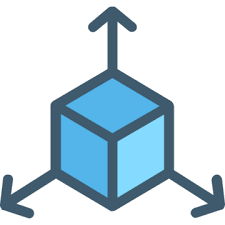</a></td>
		<td></td>
		<td></td>
		<td rowspan="5"></td>
	</tr>
	<tr>
		<td>U5</td>
		<td class="titulo1"><a href="../platonic/pt-br/#m3d" target="_blank"> Octaedro</a></td>
		<td></td>
		<td></td>
		<td rowspan="2"></td>
	</tr>
	<tr>
		<td>U6</td>
		<td class="titulo1"><a href="../platonic/pt-br/#m3d" target="_blank"> Cubo</a></td>
		<td></td>
		<td></td>
	</tr>
	<tr>
		<td>U22</td>
		<td class="titulo1"><a href="../platonic/pt-br/#m3d" target="_blank"> Icosaedro</a></td>
		<td></td>
		<td></td>
		<td rowspan="2"></td>
	</tr>
	<tr>
		<td>U23</td>
		<td class="titulo1"><a href="../platonic/pt-br/#m3d" target="_blank"> Dodecaedro</a></td>
		<td></td>
		<td></td>
	</tr>
	<tr>
		<td></td>
		<td class="titulo1"><a href="../platonic/pt-br/#m3d" target="_blank">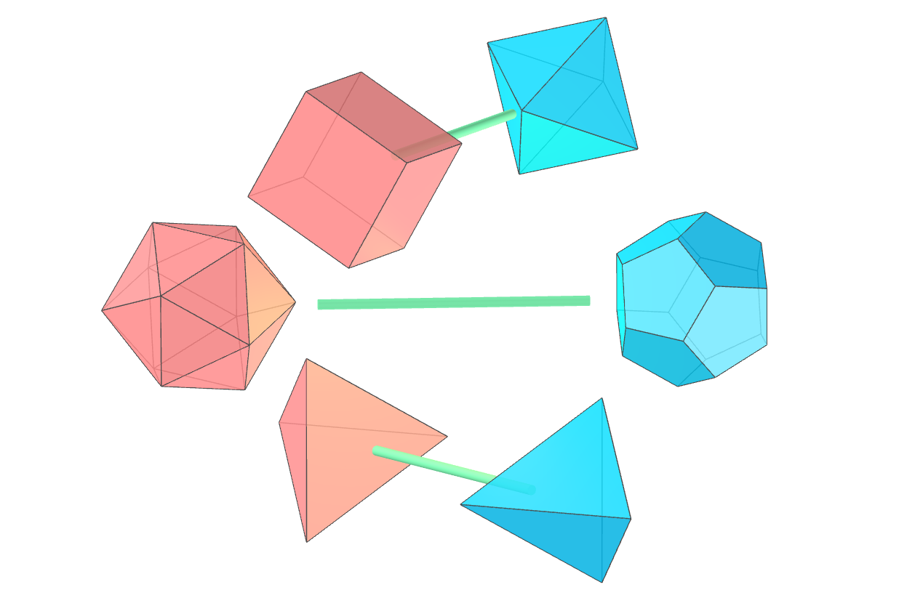 Dualidade</a></td>
		<td></td>
		<td></td>
		<td></td>
		<td></td>
	</tr>
</table>
<h3>Poliedros de Arquimedes e de Catalan</h3>
<table align="center">
	<tr>
		<th colspan="2">Nome</th>
		<th>Modelo 3D</th>
		<th>Vídeo</th>
		<th>Dual</th>
		<th>Salas imersivas</th>
	</tr>
	<tr>
		<td>U2</td>
		<td class="titulo1"><a href="../archimedes/pt-br/#m3d" target="_blank"> Tetraedro truncado</a></td>
		<td></td>
		<td></td>
		<td rowspan="2"></td>
		<td rowspan="26">Archimedes 
Catalan  </td>
	</tr>
	<tr>
		<td></td>
		<td class="titulo1"><a href="../catalan/pt-br/#m3d" target="_blank">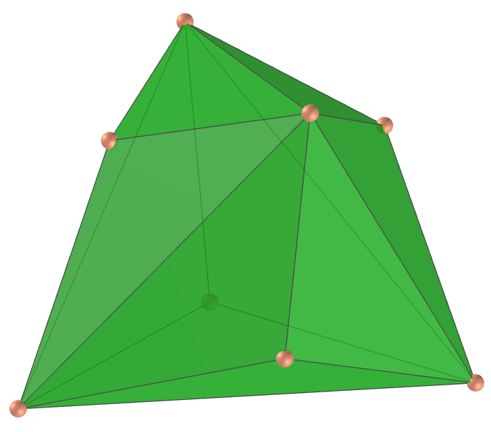 Tetraedro triakis</a></td>
		<td></td>
		<td></td>
	</tr>
	<tr>
		<td>U7</td>
		<td class="titulo1"><a href="../archimedes/pt-br/#m3d" target="_blank"> Cuboctaedro</a></td>
		<td></td>
		<td></td>
		<td rowspan="2"></td>
	</tr>
	<tr>
		<td></td>
		<td class="titulo1"><a href="../catalan/pt-br/#m3d" target="_blank"> Dodecaedro rômbico</a></td>
		<td></td>
		<td></td>
	</tr>
	<tr>
		<td>U8</td>
		<td class="titulo1"><a href="../archimedes/pt-br/#m3d" target="_blank"> Octaedro truncado</a></td>
		<td></td>
		<td></td>
		<td rowspan="2"></td>
	</tr>
	<tr>
		<td></td>
		<td class="titulo1"><a href="../catalan/pt-br/#m3d" target="_blank"> Hexaedro tetrakis</a></td>
		<td></td>
		<td></td>
	</tr>
	<tr>
		<td>U9</td>
		<td class="titulo1"><a href="../archimedes/pt-br/#m3d" target="_blank"> Cubo truncado</a></td>
		<td></td>
		<td></td>
		<td rowspan="2"></td>
	</tr>
	<tr>
		<td></td>
		<td class="titulo1"><a href="../catalan/pt-br/#m3d" target="_blank"> Octaedro triakis</a></td>
		<td></td>
		<td></td>
	</tr>
	<tr>
		<td>U10</td>
		<td class="titulo1"><a href="../archimedes/pt-br/#m3d" target="_blank"> Rombicuboctaedro</a></td>
		<td></td>
		<td></td>
		<td rowspan="2"></td>
	</tr>
	<tr>
		<td></td>
		<td class="titulo1"><a href="../catalan/pt-br/#m3d" target="_blank"> Icositetraedro deltoidal</a></td>
		<td></td>
		<td></td>
	</tr>
	<tr>
		<td>U11</td>
		<td class="titulo1"><a href="../archimedes/pt-br/#m3d" target="_blank"> Cuboctaedro truncado</a></td>
		<td></td>
		<td></td>
		<td rowspan="2"></td>
	</tr>
	<tr>
		<td></td>
		<td class="titulo1"><a href="../catalan/pt-br/#m3d" target="_blank"> Dodecaedro disdiakis</a></td>
		<td></td>
		<td></td>
	</tr>
	<tr>
		<td>U12</td>
		<td class="titulo1"><a href="../archimedes/pt-br/#m3d" target="_blank"> Cubo snub</a></td>
		<td></td>
		<td></td>
		<td rowspan="2"></td>
	</tr>
	<tr>
		<td></td>
		<td class="titulo1"><a href="../catalan/pt-br/#m3d" target="_blank"> Icositetraedro pentagonal</a></td>
		<td></td>
		<td></td>
	</tr>
	<tr>
		<td>U24</td>
		<td class="titulo1"><a href="../archimedes/pt-br/#m3d" target="_blank"> Icosidodecaedro</a></td>
		<td></td>
		<td></td>
		<td rowspan="2"></td>
	</tr>
	<tr>
		<td></td>
		<td class="titulo1"><a href="../catalan/pt-br/#m3d" target="_blank">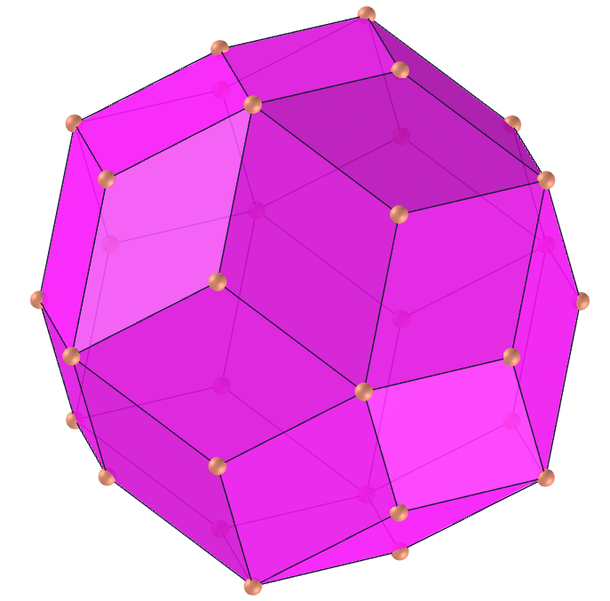 Triacontaedro rômbico</a></td>
		<td></td>
		<td></td>
	</tr>
	<tr>
		<td>U25</td>
		<td class="titulo1"><a href="../archimedes/pt-br/#m3d" target="_blank"> Icosaedro truncado</a></td>
		<td></td>
		<td></td>
		<td rowspan="2"></td>
	</tr>
	<tr>
		<td></td>
		<td class="titulo1"><a href="../catalan/pt-br/#m3d" target="_blank"> Dodecaedro pentakis</a></td>
		<td></td>
		<td></td>
	</tr>
	<tr>
		<td>U26</td>
		<td class="titulo1"><a href="../archimedes/pt-br/#m3d" target="_blank"> Dodecaedro truncado</a></td>
		<td></td>
		<td></td>
		<td rowspan="2"></td>
	</tr>
	<tr>
		<td></td>
		<td class="titulo1"><a href="../catalan/pt-br/#m3d" target="_blank"> Icosaedro triakis</a></td>
		<td></td>
		<td></td>
	</tr>
	<tr>
		<td>U27</td>
		<td class="titulo1"><a href="../archimedes/pt-br/#m3d" target="_blank">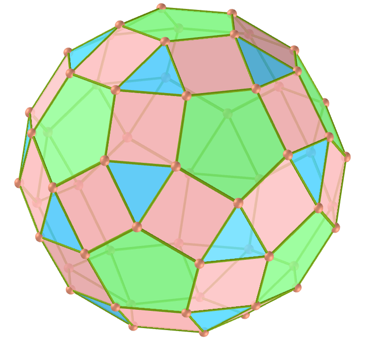 Rombicosidodecaedro</a></td>
		<td></td>
		<td></td>
		<td rowspan="2"></td>
	</tr>
	<tr>
		<td></td>
		<td class="titulo1"><a href="../catalan/pt-br/#m3d" target="_blank"> Hexecontaedro deltoidal</a></td>
		<td></td>
		<td></td>
	</tr>
	<tr>
		<td>U28</td>
		<td class="titulo1"><a href="../archimedes/pt-br/#m3d" target="_blank"> Icosidodecaedro truncado</a></td>
		<td></td>
		<td></td>
		<td rowspan="2"></td>
	</tr>
	<tr>
		<td></td>
		<td class="titulo1"><a href="../catalan/pt-br/#m3d" target="_blank"> Triacontaedro disdiakis</a></td>
		<td></td>
		<td></td>
	</tr>
	<tr>
		<td>U29</td>
		<td class="titulo1"><a href="../archimedes/pt-br/#m3d" target="_blank"> Dodecaedro snub</a></td>
		<td></td>
		<td></td>
		<td rowspan="2"></td>
	</tr>
	<tr>
		<td></td>
		<td class="titulo1"><a href="../catalan/pt-br/#m3d" target="_blank"> Hexecontaedro pentagonal</a></td>
		<td></td>
		<td></td>
	</tr>
	<tr>
		<td></td>
		<td class="titulo1"><a href="../archimedes/pt-br/#m3d" target="_blank">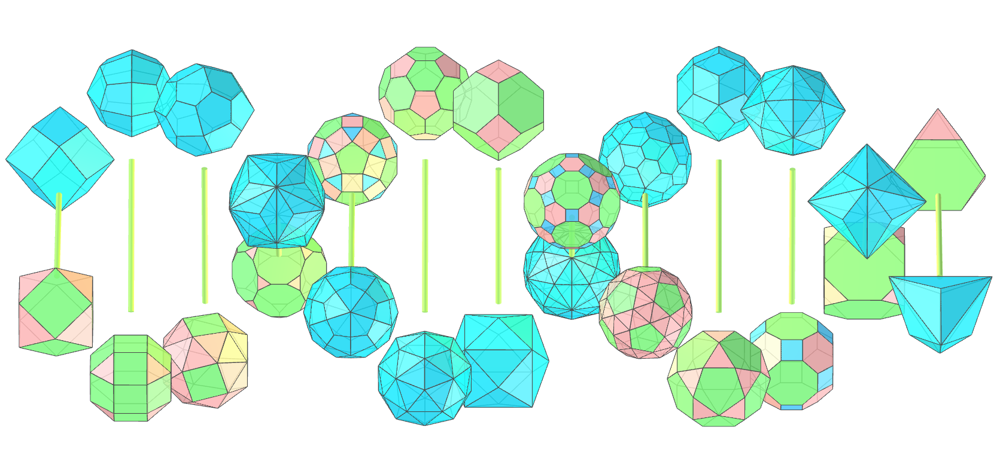 Dualidade</a></td>
		<td></td>
		<td></td>
		<td></td>
		<td></td>
	</tr>
</table>
<h3>Poliedros não convexos</h3>
<table align="center">
	<tr>
		<th colspan="2">Nome</th>
		<th>Modelo 3D</th>
		<th>Vídeo</th>
		<th>Dual</th>
		<th>Salas imersivas</th>
	</tr>
	<tr>
		<td>U3</td>
		<td class="titulo1"><a href="../nonconvex/pt-br/#m3d" target="_blank">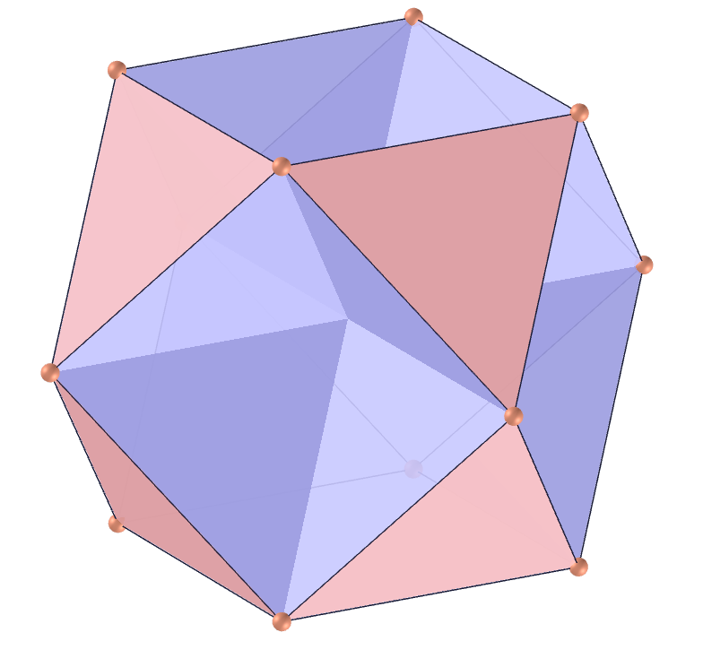 Octahemioctaedro</a></td>
		<td></td>
		<td></td>
		<td rowspan="2"></td>
		<td></td>
	</tr>
	<tr>
		<td></td>
		<td class="titulo1"><a href="../infinity/pt-br/#m3d" target="_blank">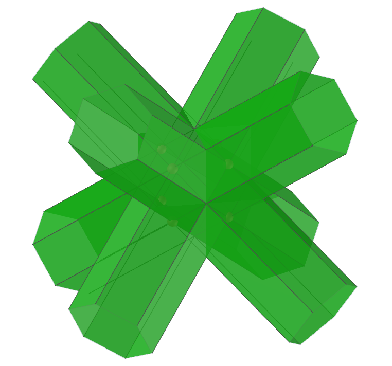 Octahemioctacron</a></td>
		<td></td>
		<td></td>
		<td></td>
	</tr>
	<tr>
		<td>U4</td>
		<td class="titulo1"><a href="../nonconvex/pt-br/#m3d" target="_blank"> Tetrahemihexaedro</a></td>
		<td></td>
		<td></td>
		<td rowspan="2"></td>
		<td></td>
	</tr>
	<tr>
		<td></td>
		<td class="titulo1"><a href="../infinity/pt-br/#m3d" target="_blank"> Tetrahemihexacron</a></td>
		<td></td>
		<td></td>
		<td></td>
	</tr>
	<tr>
		<td>U15</td>
		<td class="titulo1"><a href="../nonconvex/pt-br/#m3d" target="_blank">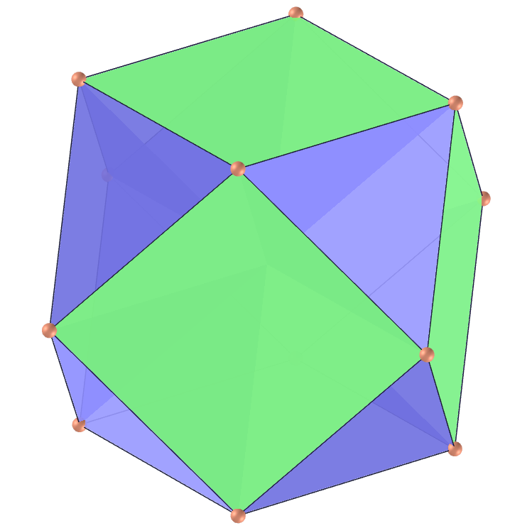 Cubohemioctaedro</a></td>
		<td></td>
		<td></td>
		<td rowspan="2"></td>
		<td></td>
	</tr>
	<tr>
		<td></td>
		<td class="titulo1"><a href="../infinity/pt-br/#m3d" target="_blank"> Hexahemioctacron</a></td>
		<td></td>
		<td></td>
		<td></td>
	</tr>
	<tr>
		<td>U34</td>
		<td class="titulo1"><a href="../nonconvex/pt-br/#m3d" target="_blank"> Pequeno dodecaedro estrelado</a></td>
		<td></td>
		<td></td>
		<td rowspan="2"></td>
		<td rowspan="2"></td>
	</tr>
	<tr>
		<td>U35</td>
		<td class="titulo1"><a href="../nonconvex/pt-br/#m3d" target="_blank">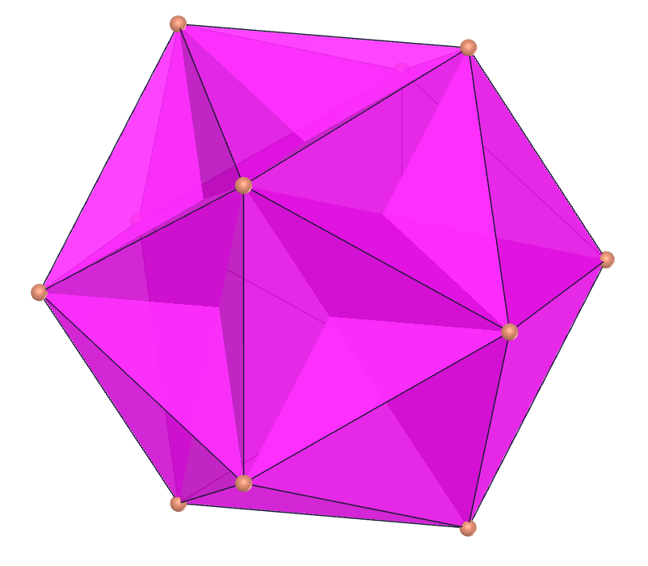 Grande dodecaedro</a></td>
		<td></td>
		<td></td>
	</tr>
	<tr>
		<td>U49</td>
		<td class="titulo1"><a href="../nonconvex/pt-br/#m3d" target="_blank"> Pequeno icosihemidodecaedro</a></td>
		<td></td>
		<td></td>
		<td rowspan="2"></td>
		<td></td>
	</tr>
	<tr>
		<td></td>
		<td class="titulo1"><a href="../infinity/pt-br/#m3d" target="_blank"> Pequeno icosihemidodecacron</a></td>
		<td></td>
		<td></td>
		<td></td>
	</tr>
	<tr>
		<td>U51</td>
		<td class="titulo1"><a href="../nonconvex/pt-br/#m3d" target="_blank">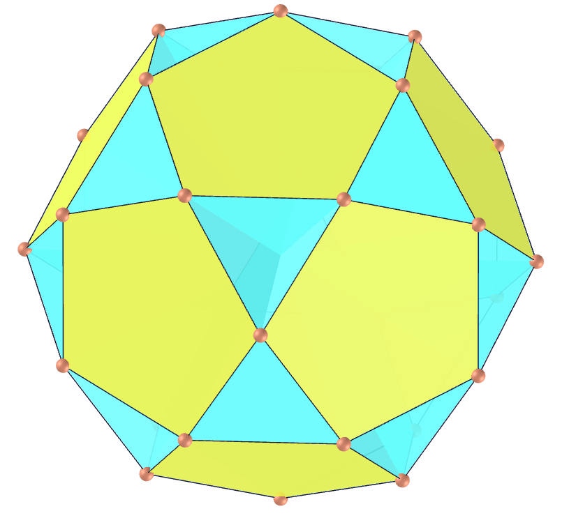 Pequeno dodecahemidodecaedro</a></td>
		<td></td>
		<td></td>
		<td rowspan="2"></td>
		<td></td>
	</tr>
	<tr>
		<td></td>
		<td class="titulo1"><a href="../infinity/pt-br/#m3d" target="_blank"> Pequeno dodecahemidodecacron</a></td>
		<td></td>
		<td></td>
		<td></td>
	</tr>
	<tr>
		<td>U52</td>
		<td class="titulo1"><a href="../nonconvex/pt-br/#m3d" target="_blank"> Grande dodecaedro estrelado</a></td>
		<td></td>
		<td></td>
		<td rowspan="2"></td>
		<td rowspan="2"></td>
	</tr>
	<tr>
		<td>U53</td>
		<td class="titulo1"><a href="../nonconvex/pt-br/#m3d" target="_blank"> Grande icosaedro</a></td>
		<td></td>
		<td></td>
	</tr>
	<tr>
		<td>U62</td>
		<td class="titulo1"><a href="../nonconvex/pt-br/#m3d" target="_blank"> Pequeno dodecahemicosaedro</a></td>
		<td></td>
		<td></td>
		<td rowspan="2"></td>
		<td></td>
	</tr>
	<tr>
		<td></td>
		<td class="titulo1"><a href="../infinity/pt-br/#m3d" target="_blank"> Pequeno dodecahemicosacron</a></td>
		<td></td>
		<td></td>
		<td></td>
	</tr>
	<tr>
		<td>U65</td>
		<td class="titulo1"><a href="../nonconvex/pt-br/#m3d" target="_blank">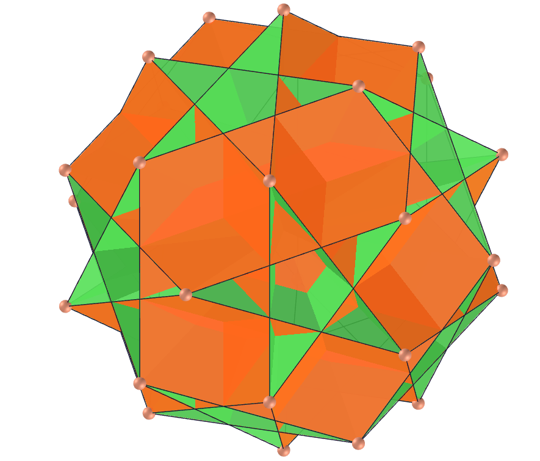 Grande dodecahemicosaedro</a></td>
		<td></td>
		<td></td>
		<td rowspan="2"></td>
		<td></td>
	</tr>
	<tr>
		<td></td>
		<td class="titulo1"><a href="../infinity/pt-br/#m3d" target="_blank"> Grande dodecahemicosacron</a></td>
		<td></td>
		<td></td>
		<td></td>
	</tr>
	<tr>
		<td>U70</td>
		<td class="titulo1"><a href="../nonconvex/pt-br/#m3d" target="_blank">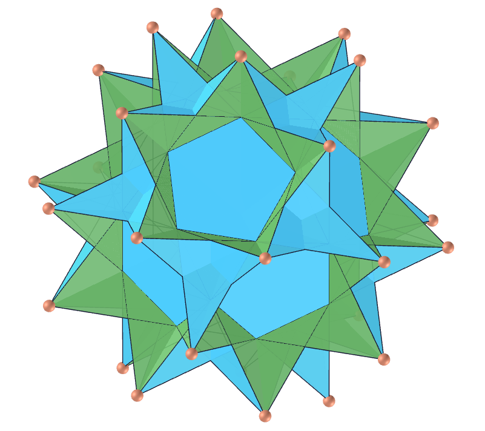 Grande dodecahemidodecaedro</a></td>
		<td></td>
		<td></td>
		<td rowspan="2"></td>
		<td></td>
	</tr>
	<tr>
		<td></td>
		<td class="titulo1"><a href="../infinity/pt-br/#m3d" target="_blank"> Grande dodecahemidodecacron</a></td>
		<td></td>
		<td></td>
		<td></td>
	</tr>
	<tr>
		<td>U71</td>
		<td class="titulo1"><a href="../nonconvex/pt-br/#m3d" target="_blank">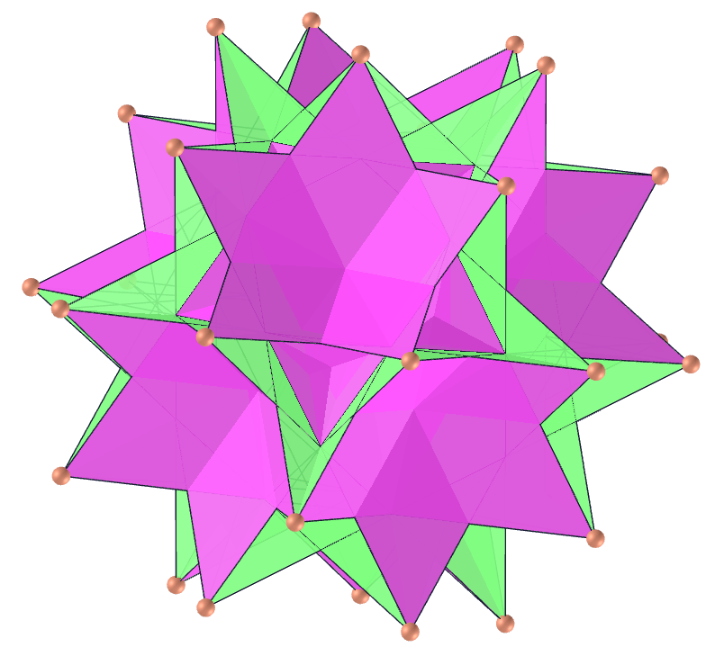 Grande icosihemidodecaedro</a></td>
		<td></td>
		<td></td>
		<td rowspan="2"></td>
		<td></td>
	</tr>
	<tr>
		<td></td>
		<td class="titulo1"><a href="../infinity/pt-br/#m3d" target="_blank"> Grande icosihemidodecacron</a></td>
		<td></td>
		<td></td>
		<td></td>
	</tr>
	<tr>
		<td></td>
		<td class="titulo1"><a href="../nonconvex/pt-br/#m3d" target="_blank"> Sólido de Escher</a></td>
		<td></td>
		<td></td>
		<td rowspan="2"></td>
		<td rowspan="6"></td>
	</tr>
	<tr>
		<td></td>
		<td class="titulo1"><a href="../nonconvex/pt-br/#m3d" target="_blank"> Dual do sólido de Escher</a></td>
		<td></td>
		<td></td>
	</tr>
	<tr>
		<td></td>
		<td class="titulo1"><a href="../nonconvex/pt-br/#m3d" target="_blank">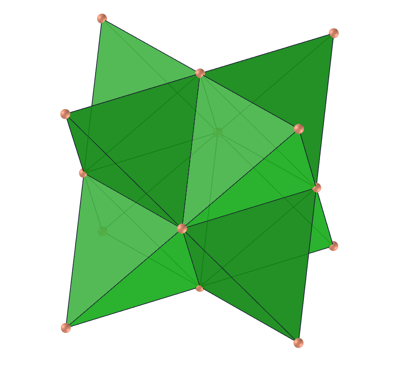 Octaedro estrelado</a></td>
		<td></td>
		<td></td>
		<td></td>
	</tr>
	<tr>
		<td></td>
		<td class="titulo1"><a href="../nonconvex/pt-br/#m3d" target="_blank"> Hexecontaedro rômbico</a></td>
		<td></td>
		<td></td>
		<td></td>
	</tr>
	<tr>
		<td></td>
		<td class="titulo1"><a href="../nonconvex/pt-br/#m3d" target="_blank"> Dodecaedro côncavo</a></td>
		<td></td>
		<td></td>
		<td></td>
	</tr>
	<tr>
		<td></td>
		<td class="titulo1"><a href="../nonconvex/pt-br/#m3d" target="_blank">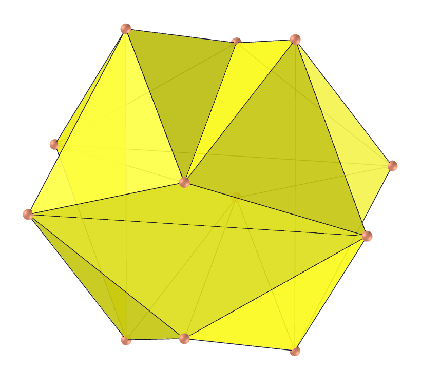 Icosaedro ortogonal de Jessen</a></td>
		<td></td>
		<td></td>
		<td></td>
	</tr>
	<tr>
		<td></td>
		<td class="titulo1"><a href="../nonconvex/pt-br/#m3d" target="_blank"> Deltaedro de Möbius de 24 faces</a></td>
		<td></td>
		<td></td>
		<td rowspan="2"></td>
		<td rowspan="7"></td>
	</tr>
	<tr>
		<td></td>
		<td class="titulo1"><a href="../nonconvex/pt-br/#m3d" target="_blank"> Dual do Deltaedro de Möbius</a></td>
		<td></td>
		<td></td>
	</tr>
	<tr>
		<td></td>
		<td class="titulo1"><a href="../nonconvex/pt-br/#m3d" target="_blank"> Hexaedro Octakis de Möbius</a></td>
		<td></td>
		<td></td>
		<td rowspan="2"></td>
	</tr>
	<tr>
		<td></td>
		<td class="titulo1"><a href="../nonconvex/pt-br/#m3d" target="_blank"> Dual do Hexaedro Octakis de Möbius</a></td>
		<td></td>
		<td></td>
	</tr>
	<tr>
		<td></td>
		<td class="titulo1"><a href="../nonconvex/pt-br/#m3d" target="_blank">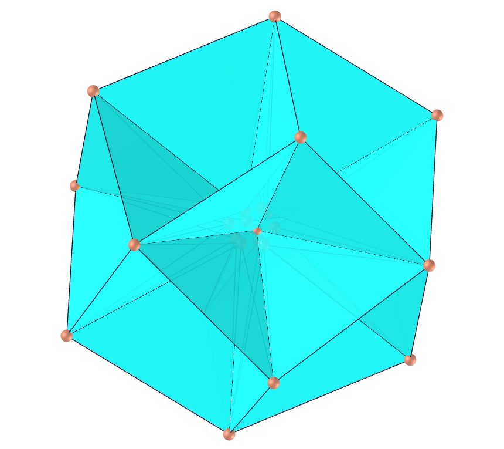 Octaedro Hexakis de Möbius</a></td>
		<td></td>
		<td></td>
		<td></td>
	</tr>
	<tr>
		<td></td>
		<td class="titulo1"><a href="../nonconvex/pt-br/#m3d" target="_blank"> Icosaedro Hexakis de Möbius</a></td>
		<td></td>
		<td></td>
		<td></td>
	</tr>
	<tr>
		<td></td>
		<td class="titulo1"><a href="../nonconvex/pt-br/#m3d" target="_blank"> Dodecaedro 10-akis de Möbius</a></td>
		<td></td>
		<td></td>
		<td></td>
	</tr>
</table>
<h3>Pirâmides, tetraedros, prismas e antiprismas</h3>
<table>	
	<tr>
		<th colspan="2">Nome</th>
		<th>Modelo 3D</th>
		<th>Vídeo</th>
		<th>Salas imersivas</th>
	</tr>
	<tr>
		<td>U76</td>
		<td class="titulo1"><a href="../polyhedron/pt-br/#m3d" target="_blank"> Prisma</a></td>
		<td></td>
		<td></td>
		<td rowspan="13"></td>
	</tr>
	<tr>
		<td>U77</td>
		<td class="titulo1"><a href="../polyhedron/pt-br/#m3d" target="_blank">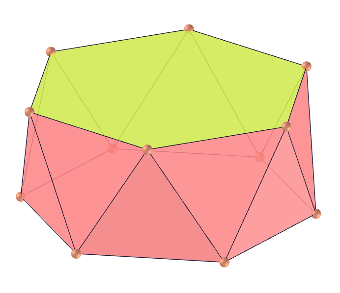 Antiprisma</a></td>
		<td></td>
		<td></td>
	</tr>
	<tr>
		<td>U78</td>
		<td class="titulo1"><a href="../polyhedron/pt-br/#m3d" target="_blank"> Prisma estrelado</a></td>
		<td></td>
		<td></td>
	</tr>
	<tr>
		<td>U79</td>
		<td class="titulo1"><a href="../polyhedron/pt-br/#m3d" target="_blank"> Antiprisma estrelado</a></td>
		<td></td>
		<td></td>
	</tr>
	<tr>
		<td>U80</td>
		<td class="titulo1"><a href="../polyhedron/pt-br/#m3d" target="_blank"> Antiprisma cruzado estrelado</a></td>
		<td></td>
		<td></td>
	</tr>
	<tr>
		<td></td>
		<td class="titulo1"><a href="../polyhedron/pt-br/#m3d" target="_blank"> Pirâmide</a></td>
		<td></td>
		<td></td>
	</tr>
	<tr>
		<td></td>
		<td class="titulo1"><a href="../polyhedron/pt-br/#m3d" target="_blank"> Pirâmide estrelada</a></td>
		<td></td>
		<td></td>
	</tr>
	<tr>
		<td></td>
		<td class="titulo1"><a href="../polyhedron/pt-br/#m3d" target="_blank"> Dipirâmide</a></td>
		<td></td>
		<td></td>
	</tr>
	<tr>
		<td></td>
		<td class="titulo1"><a href="../polyhedron/pt-br/#m3d" target="_blank">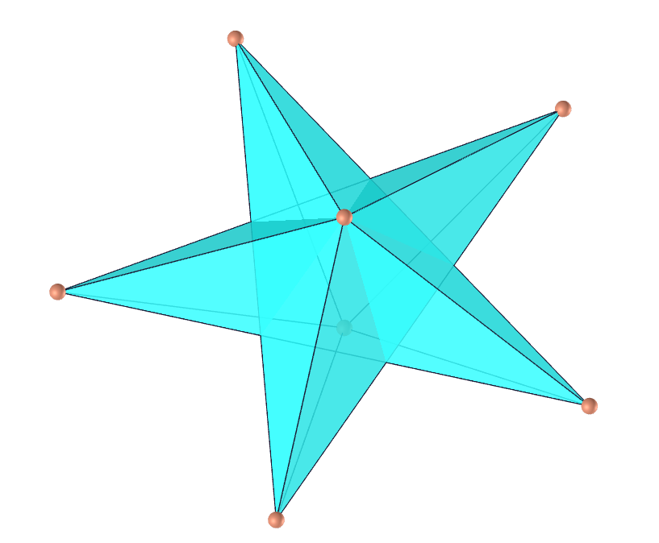 Dipirâmide estrelada</a></td>
		<td></td>
		<td></td>
	</tr>
	<tr>
		<td></td>
		<td class="titulo1"><a href="../polyhedron/pt-br/#m3d" target="_blank"> Trapezoedro</a></td>
		<td></td>
		<td></td>
	</tr>
	<tr>
		<td></td>
		<td class="titulo1"><a href="../polyhedron/pt-br/#m3d" target="_blank"> Trapezoedro estrelado</a></td>
		<td></td>
		<td></td>
	</tr>
	<tr>
		<td></td>
		<td class="titulo1"><a href="../polyhedron/pt-br/#m3d" target="_blank">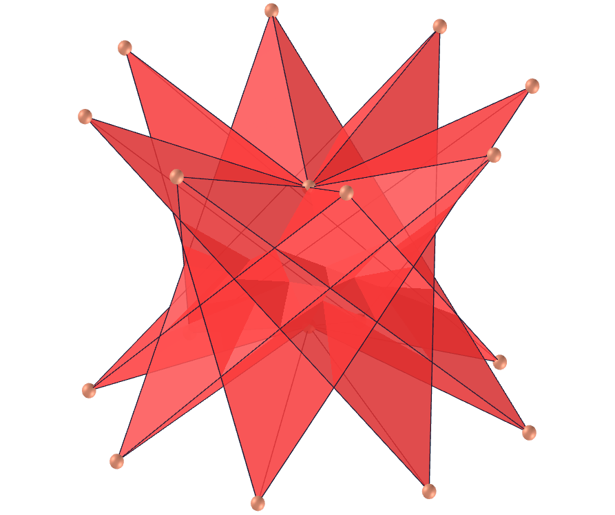 Trapezoedro estrelado côncavo</a></td>
		<td></td>
		<td></td>
	</tr>
	<tr>
		<td></td>
		<td class="titulo1"><a href="../polyhedron/pt-br/#m3d" target="_blank"> Tetraedro isósceles</a></td>
		<td></td>
		<td></td>
	</tr>
	<tr>
		<td></td>
		<td class="titulo1"><a href="../polyhedron/pt-br/#m3d" target="_blank"> Dodecaedro Trapezo-Rômbico</a></td>
		<td></td>
		<td></td>
		<td rowspan="13"></td>
	</tr>
	<tr>
		<td></td>
		<td class="titulo1"><a href="../polyhedron/pt-br/#m3d" target="_blank"> Dodecaedro pentagonal octaédrico</a></td>
		<td></td>
		<td></td>
	</tr>
	<tr>
		<td></td>
		<td class="titulo1"><a href="../polyhedron/pt-br/#m3d" target="_blank"> Dodecaedro dyakis côncavo</a></td>
		<td></td>
		<td></td>
	</tr>
	<tr>
		<td></td>
		<td class="titulo1"><a href="../polyhedron/pt-br/#m3d" target="_blank">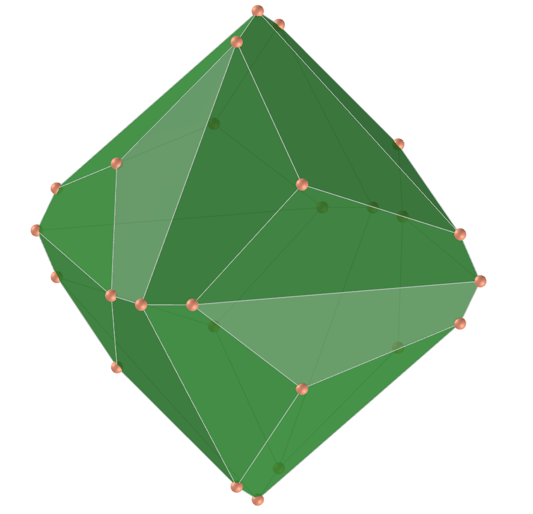 Dodecaedro dyakis</a></td>
		<td></td>
		<td></td>
	</tr>
	<tr>
		<td></td>
		<td class="titulo1"><a href="../polyhedron/pt-br/#m3d" target="_blank"> Dodecaedro pentagonal tetragonal</a></td>
		<td></td>
		<td></td>
	</tr>
	<tr>
		<td></td>
		<td class="titulo1"><a href="../polyhedron/pt-br/#m3d" target="_blank"> Tetraedro hexakis</a></td>
		<td></td>
		<td></td>
	</tr>
	<tr>
		<td></td>
		<td class="titulo1"><a href="../polyhedron/pt-br/#m3d" target="_blank"> Tristetraedro trapezoédrico</a></td>
		<td></td>
		<td></td>
	</tr>
	<tr>
		<td></td>
		<td class="titulo1"><a href="../polyhedron/pt-br/#m3d" target="_blank"> Toróide de íris</a></td>
		<td></td>
		<td></td>
	</tr>
	<tr>
		<td></td>
		<td class="titulo1"><a href="../polyhedron/pt-br/#m3d" target="_blank">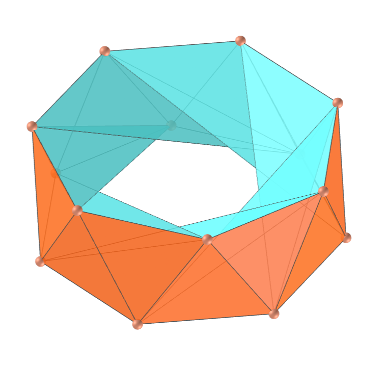 Antitoróide de íris</a></td>
		<td></td>
		<td></td>
	</tr>
	<tr>
		<td></td>
		<td class="titulo1"><a href="../polyhedron/pt-br/#m3d" target="_blank">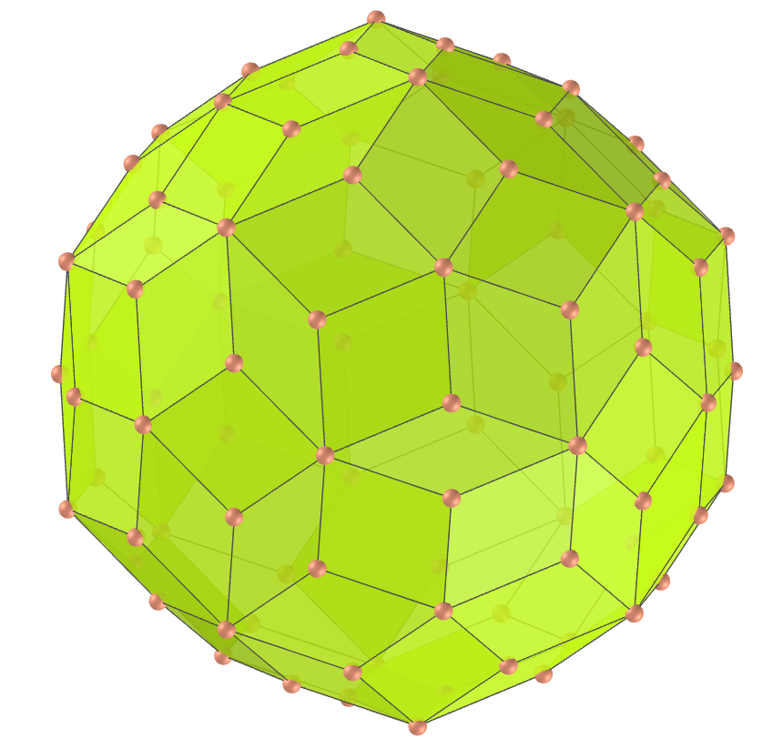 Eneacontaedro rômbico</a></td>
		<td></td>
		<td></td>
	</tr>
	<tr>
		<td></td>
		<td class="titulo1"><a href="../polyhedron/pt-br/#m3d" target="_blank"> Eneaedro de Goddard-Henning</a></td>
		<td></td>
		<td></td>
	</tr>
	<tr>
		<td></td>
		<td class="titulo1"><a href="../polyhedron/pt-br/#m3d" target="_blank"> Eneaedro de Herschel</a></td>
		<td></td>
		<td></td>
	</tr>
	<tr>
		<td></td>
		<td class="titulo1"><a href="../polyhedron/pt-br/#m3d" target="_blank"> Paralelepípedo</a></td>
		<td></td>
		<td></td>
	</tr>
</table>
<h3>Poliedros de auto-interseção</h3>
<table>	
	<tr>
		<th colspan="2">Nome</th>
		<th>Modelo 3D</th>
		<th>Vídeo</th>
		<th>Dual</th>
		<th>Salas imersivas</th>
	</tr>
	<tr>
		<td>U13</td>
		<td class="titulo1"><a href="../selfintersect/pt-br/#m3d" target="_blank"> Pequeno cubicuboctaedro</a></td>
		<td></td>
		<td></td>
		<td rowspan="2"></td>
		<td rowspan="2"></td>
	</tr>
	<tr>
		<td></td>
		<td class="titulo1"><a href="../selfintersect/pt-br/#m3d" target="_blank"> Pequeno icositetraedro hexacrônico</a></td>
		<td></td>
		<td></td>
	</tr>
	<tr>
		<td>U14</td>
		<td class="titulo1"><a href="../selfintersect/pt-br/#m3d" target="_blank"> Grande cubicuboctaedro</a></td>
		<td></td>
		<td></td>
		<td rowspan="2"></td>
		<td rowspan="4"></td>
	</tr>
	<tr>
		<td></td>
		<td class="titulo1"><a href="../selfintersect/pt-br/#m3d" target="_blank">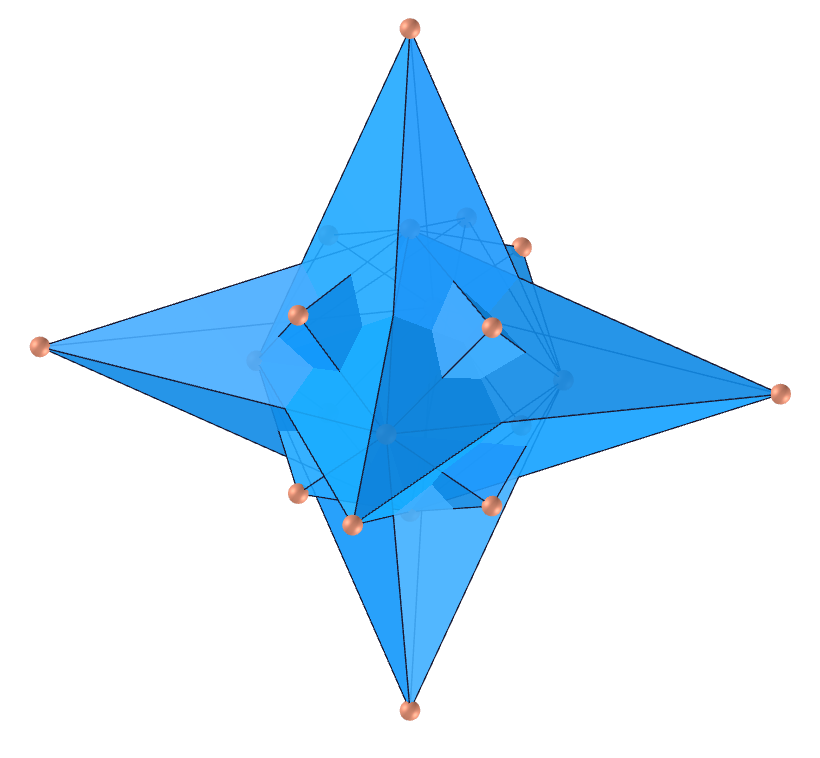 Grande icositetraedro hexacrônico</a></td>
		<td></td>
		<td></td>
	</tr>
	<tr>
		<td>U17</td>
		<td class="titulo1"><a href="../selfintersect/pt-br/#m3d" target="_blank">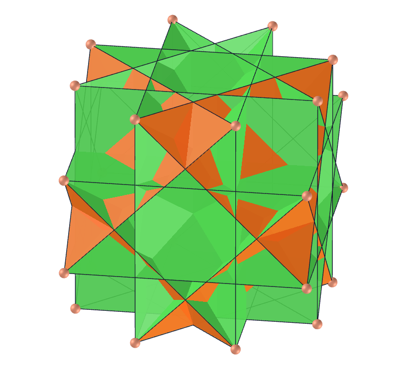 Grande rombicuboctaedro uniforme</a></td>
		<td></td>
		<td></td>
		<td rowspan="2"></td>
	</tr>
	<tr>
		<td></td>
		<td class="titulo1"><a href="../selfintersect/pt-br/#m3d" target="_blank"> Grande icositetraedro deltoide</a></td>
		<td></td>
		<td></td>
	</tr>
	<tr>
		<td>U30</td>
		<td class="titulo1"><a href="../selfintersect/pt-br/#m3d" target="_blank">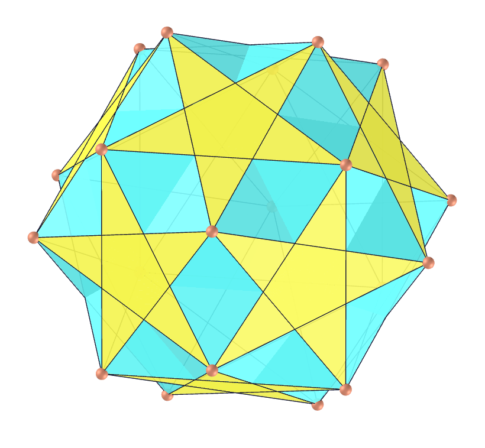 Pequeno icosidodecaedro ditrigonal</a></td>
		<td></td>
		<td></td>
		<td rowspan="2"></td>
		<td rowspan="2"></td>
	</tr>
	<tr>
		<td></td>
		<td class="titulo1"><a href="../selfintersect/pt-br/#m3d" target="_blank"> Pequeno icosaedro triâmbico</a></td>
		<td></td>
		<td></td>
	</tr>
	<tr>
		<td>U31</td>
		<td class="titulo1"><a href="../selfintersect/pt-br/#m3d" target="_blank">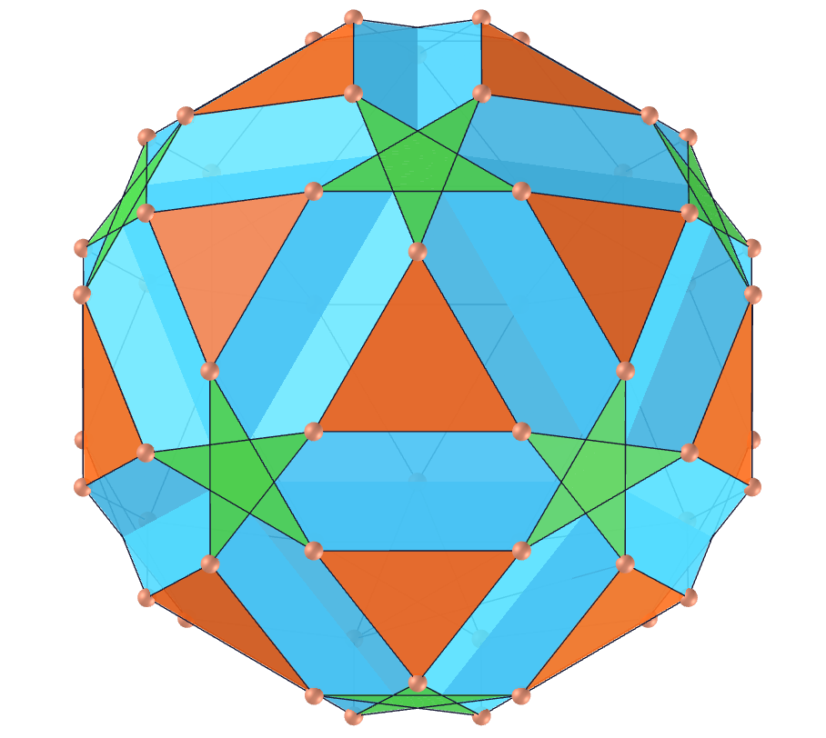 Pequeno icosicosidodecaedro</a></td>
		<td></td>
		<td></td>
		<td rowspan="2"></td>
		<td rowspan="2"></td>
	</tr>
	<tr>
		<td></td>
		<td class="titulo1"><a href="../selfintersect/pt-br/#m3d" target="_blank"> Pequeno hexecontaedro icosacrônico</a></td>
		<td></td>
		<td></td>
	</tr>
	<tr>
		<td>U33</td>
		<td class="titulo1"><a href="../selfintersect/pt-br/#m3d" target="_blank"> Pequeno dodecicosidodecaedro</a></td>
		<td></td>
		<td></td>
		<td rowspan="2"></td>
		<td rowspan="2"></td>
	</tr>
	<tr>
		<td></td>
		<td class="titulo1"><a href="../selfintersect/pt-br/#m3d" target="_blank"> Pequeno hexecontaedro dodecacrônico</a></td>
		<td></td>
		<td></td>
	</tr>
	<tr>
		<td>U36</td>
		<td class="titulo1"><a href="../selfintersect/pt-br/#m3d" target="_blank"> Dodecadodecaedro</a></td>
		<td></td>
		<td></td>
		<td rowspan="2"></td>
		<td rowspan="2"></td>
	</tr>
	<tr>
		<td></td>
		<td class="titulo1"><a href="../selfintersect/pt-br/#m3d" target="_blank"> Triacontaedro rômbico medial</a></td>
		<td></td>
		<td></td>
	</tr>
	<tr>
		<td>U38</td>
		<td class="titulo1"><a href="../selfintersect/pt-br/#m3d" target="_blank">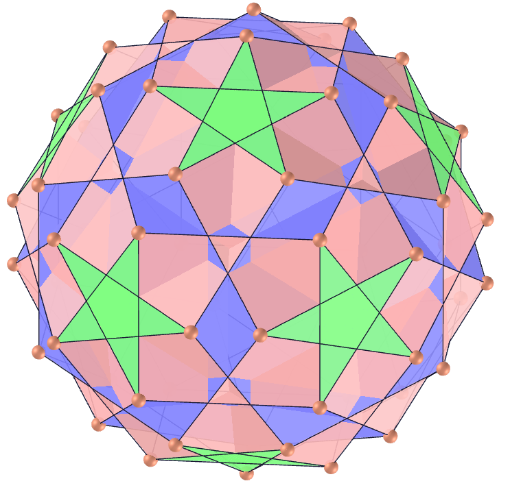 Rombidodecadodecaedro</a></td>
		<td></td>
		<td></td>
		<td rowspan="2"></td>
		<td rowspan="2"></td>
	</tr>
	<tr>
		<td></td>
		<td class="titulo1"><a href="../selfintersect/pt-br/#m3d" target="_blank"> Hexecontaedro deltoidal medial</a></td>
		<td></td>
		<td></td>
	</tr>
	<tr>
		<td>U41</td>
		<td class="titulo1"><a href="../selfintersect/pt-br/#m3d" target="_blank"> Dodecaedro ditrigonal</a></td>
		<td></td>
		<td></td>
		<td rowspan="2"></td>
		<td rowspan="2"></td>
	</tr>
	<tr>
		<td></td>
		<td class="titulo1"><a href="../selfintersect/pt-br/#m3d" target="_blank"> Icosaedro triâmbico medial</a></td>
		<td></td>
		<td></td>
	</tr>
	<tr>
		<td>U42</td>
		<td class="titulo1"><a href="../selfintersect/pt-br/#m3d" target="_blank">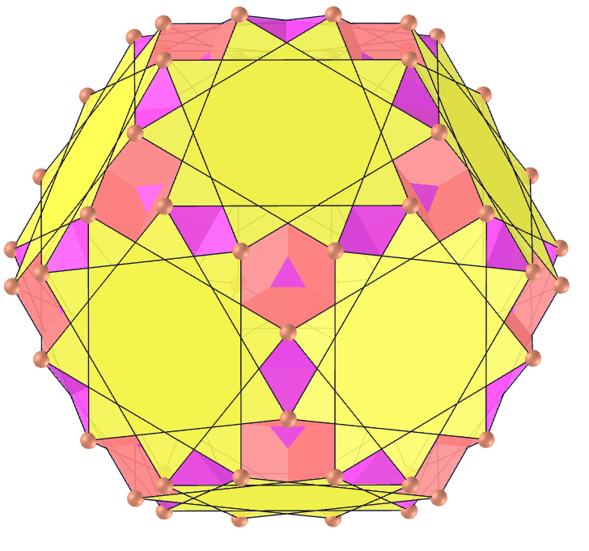 Grande dodecicosidodecaedro ditrigonal</a></td>
		<td></td>
		<td></td>
		<td rowspan="2"></td>
		<td rowspan="4"></td>
	</tr>
	<tr>
		<td></td>
		<td class="titulo1"><a href="../selfintersect/pt-br/#m3d" target="_blank">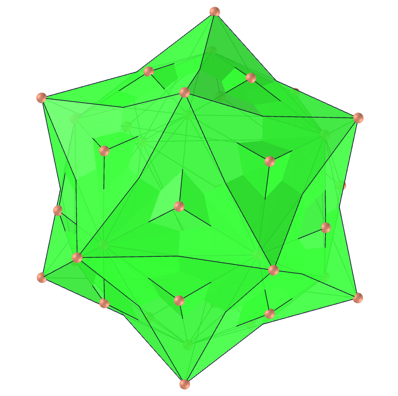 Grande hexecontaedro dodecacrônico ditrigonal</a></td>
		<td></td>
		<td></td>
	</tr>
	<tr>
		<td>U43</td>
		<td class="titulo1"><a href="../selfintersect/pt-br/#m3d" target="_blank"> Pequeno dodecicosidodecaedro ditrigonal</a></td>
		<td></td>
		<td></td>
		<td rowspan="2"></td>
	</tr>
	<tr>
		<td></td>
		<td class="titulo1"><a href="../selfintersect/pt-br/#m3d" target="_blank">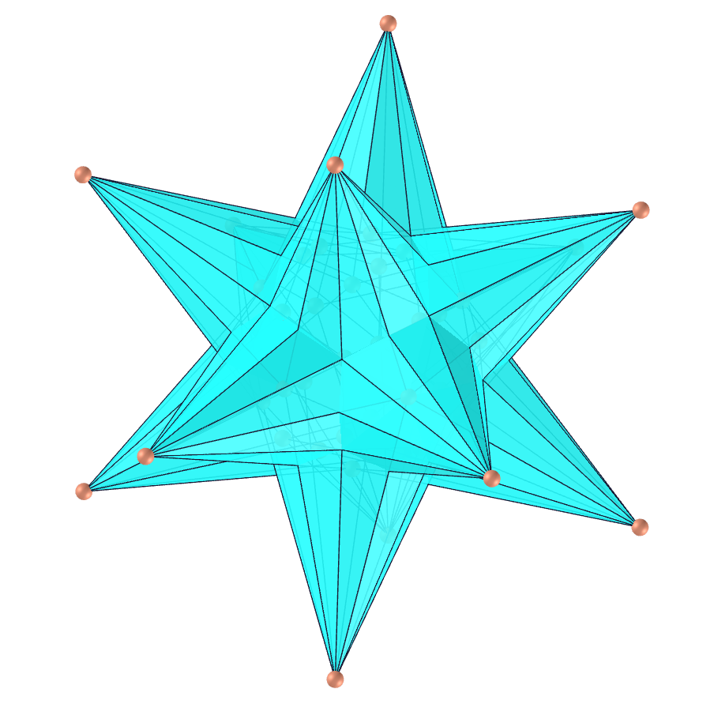 Pequeno hexecontaedro ditrigonal dodecacrônico</a></td>
		<td></td>
		<td></td>
	</tr>
	<tr>
		<td>U44</td>
		<td class="titulo1"><a href="../selfintersect/pt-br/#m3d" target="_blank"> Icosidodecadodecaedro</a></td>
		<td></td>
		<td></td>
		<td rowspan="2"></td>
		<td rowspan="2"></td>
	</tr>
	<tr>
		<td></td>
		<td class="titulo1"><a href="../selfintersect/pt-br/#m3d" target="_blank"> Hexecontaedro icosacrônico medial</a></td>
		<td></td>
		<td></td>
	</tr>
	<tr>
		<td>U47</td>
		<td class="titulo1"><a href="../selfintersect/pt-br/#m3d" target="_blank">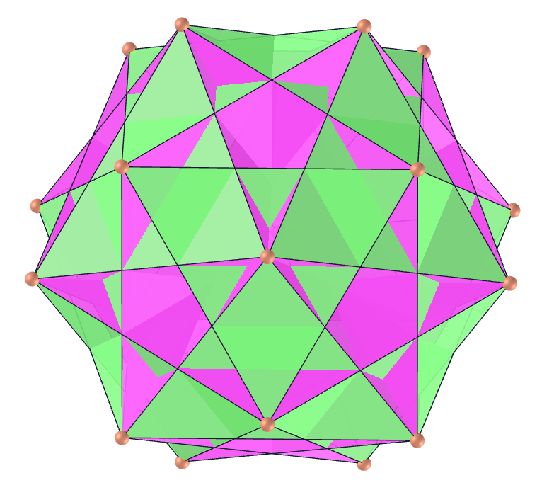 Grande icosidodecaedro ditrigonal</a></td>
		<td></td>
		<td></td>
		<td rowspan="2"></td>
		<td rowspan="2"></td>
	</tr>
	<tr>
		<td></td>
		<td class="titulo1"><a href="../selfintersect/pt-br/#m3d" target="_blank"> Grande icosaedro triâmbico</a></td>
		<td></td>
		<td></td>
	</tr>
	<tr>
		<td>U48</td>
		<td class="titulo1"><a href="../selfintersect/pt-br/#m3d" target="_blank"> Grande icosicosidodecaedro</a></td>
		<td></td>
		<td></td>
		<td rowspan="2"></td>
		<td rowspan="2"></td>
	</tr>
	<tr>
		<td></td>
		<td class="titulo1"><a href="../selfintersect/pt-br/#m3d" target="_blank"> Grande hexecontaedro icosacrônico</a></td>
		<td></td>
		<td></td>
	</tr>
	<tr>
		<td>U54</td>
		<td class="titulo1"><a href="../selfintersect/pt-br/#m3d" target="_blank"> Grande icosidodecaedro</a></td>
		<td></td>
		<td></td>
		<td rowspan="2"></td>
		<td rowspan="2"></td>
	</tr>
	<tr>
		<td></td>
		<td class="titulo1"><a href="../selfintersect/pt-br/#m3d" target="_blank">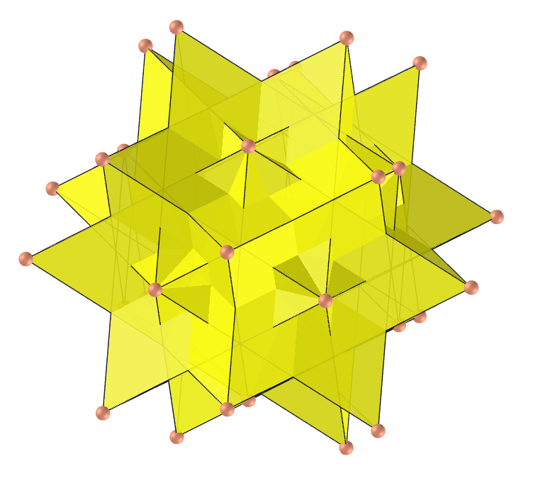 Grande triacontaedro rômbico</a></td>
		<td></td>
		<td></td>
	</tr>
	<tr>
		<td>U61</td>
		<td class="titulo1"><a href="../selfintersect/pt-br/#m3d" target="_blank"> Grande dodecicosidodecaedro</a></td>
		<td></td>
		<td></td>
		<td rowspan="2"></td>
		<td rowspan="2"></td>
	</tr>
	<tr>
		<td></td>
		<td class="titulo1"><a href="../selfintersect/pt-br/#m3d" target="_blank"> Grande hexecontaedro dodecacrônico</a></td>
		<td></td>
		<td></td>
	</tr>
	<tr>
		<td>U67</td>
		<td class="titulo1"><a href="../selfintersect/pt-br/#m3d" target="_blank">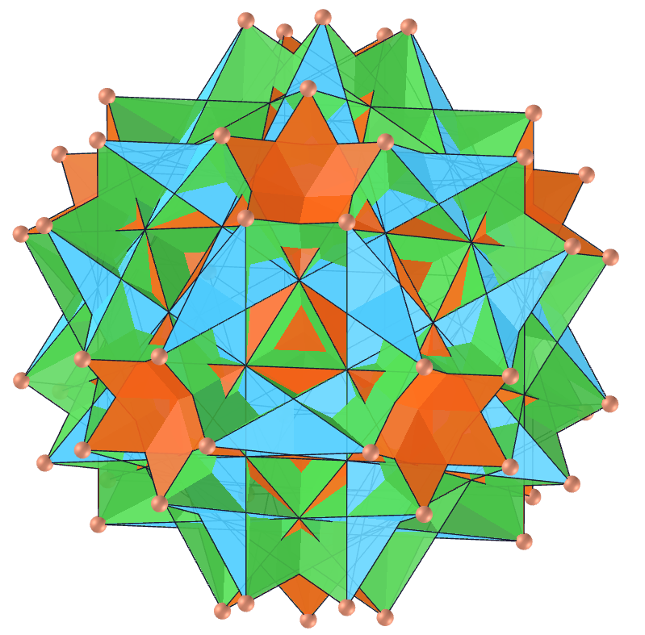 Grande rombicosidodecaedro uniforme</a></td>
		<td></td>
		<td></td>
		<td rowspan="2"></td>
		<td rowspan="3"></td>
	</tr>
	<tr>
		<td></td>
		<td class="titulo1"><a href="../selfintersect/pt-br/#m3d" target="_blank"> Grande hexecontaedro deltoidal</a></td>
		<td></td>
		<td></td>
	</tr>
	<tr>
		<td></td>
		<td class="titulo1"><a href="../selfintersect/pt-br/#m3d" target="_blank"> Equidnaedro</a></td>
		<td></td>
		<td></td>
		<td></td>
	</tr>
</table>
<h3>Poliedros quase regulares</h3>
<table>	
	<tr>
		<th colspan="2">Nome</th>
		<th>Modelo 3D</th>
		<th>Vídeo</th>
		<th>Dual</th>
		<th>Sala imersiva</th>
	</tr>
	<tr>
		<td>U18</td>
		<td class="titulo1"><a href="../quasiregular/pt-br/#m3d" target="_blank"> Pequeno rombihexaedro</a></td>
		<td></td>
		<td></td>
		<td rowspan="2"></td>
		<td rowspan="14"></td>
	</tr>
	<tr>
		<td></td>
		<td class="titulo1"><a href="../quasiregular/pt-br/#m3d" target="_blank"> Pequeno rombihexacro</a></td>
		<td></td>
		<td></td>
	</tr>
	<tr>
		<td>U21</td>
		<td class="titulo1"><a href="../quasiregular/pt-br/#m3d" target="_blank">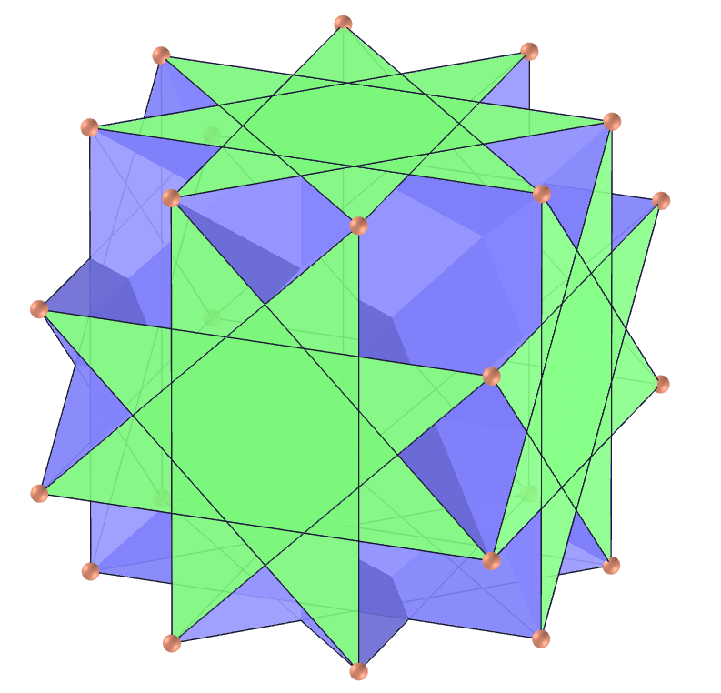 Grande rombihexaedro</a></td>
		<td></td>
		<td></td>
		<td rowspan="2"></td>
	</tr>
	<tr>
		<td></td>
		<td class="titulo1"><a href="../quasiregular/pt-br/#m3d" target="_blank"> Grande rombihexacro</a></td>
		<td></td>
		<td></td>
	</tr>
	<tr>
		<td>U39</td>
		<td class="titulo1"><a href="../quasiregular/pt-br/#m3d" target="_blank">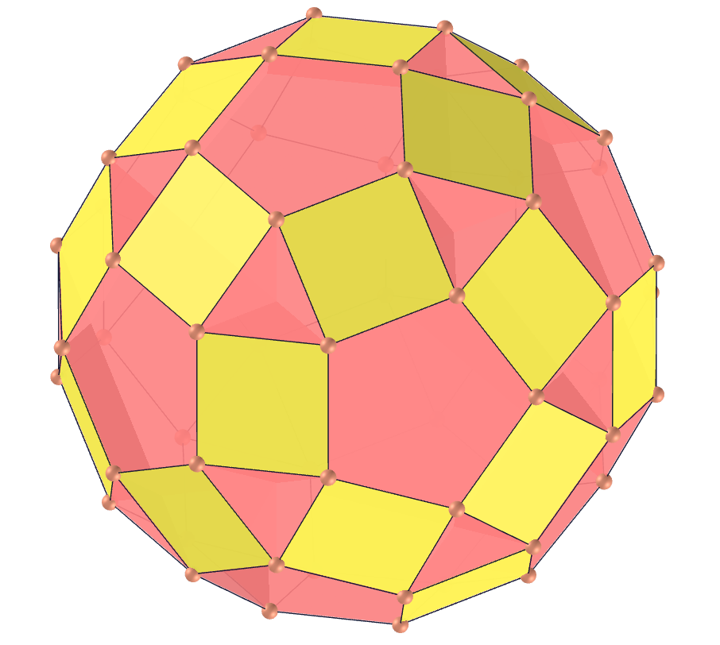 Pequeno rombidodecaedro</a></td>
		<td></td>
		<td></td>
		<td rowspan="2"></td>
	</tr>
	<tr>
		<td></td>
		<td class="titulo1"><a href="../quasiregular/pt-br/#m3d" target="_blank"> Pequeno rombidodecácrono</a></td>
		<td></td>
		<td></td>
	</tr>
	<tr>
		<td>U50</td>
		<td class="titulo1"><a href="../quasiregular/pt-br/#m3d" target="_blank"> Pequeno dodecicosaedro</a></td>
		<td></td>
		<td></td>
		<td rowspan="2"></td>
	</tr>
	<tr>
		<td></td>
		<td class="titulo1"><a href="../quasiregular/pt-br/#m3d" target="_blank"> Pequeno dodecicosacrono</a></td>
		<td></td>
		<td></td>
	</tr>
	<tr>
		<td>U56</td>
		<td class="titulo1"><a href="../quasiregular/pt-br/#m3d" target="_blank"> Rombicosaedro</a></td>
		<td></td>
		<td></td>
		<td rowspan="2"></td>
	</tr>
	<tr>
		<td></td>
		<td class="titulo1"><a href="../quasiregular/pt-br/#m3d" target="_blank"> Rombicosacro</a></td>
		<td></td>
		<td></td>
	</tr>
	<tr>
		<td>U63</td>
		<td class="titulo1"><a href="../quasiregular/pt-br/#m3d" target="_blank">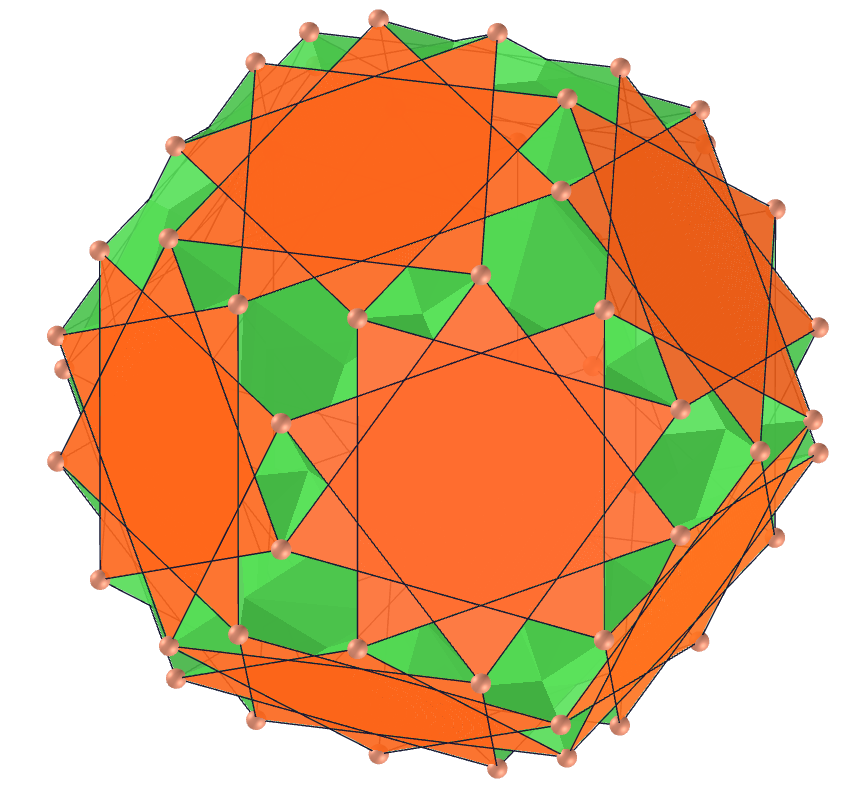 Grande dodecicosaedro</a></td>
		<td></td>
		<td></td>
		<td rowspan="2"></td>
	</tr>
	<tr>
		<td></td>
		<td class="titulo1"><a href="../quasiregular/pt-br/#m3d" target="_blank"> Grande dodecicosacrono</a></td>
		<td></td>
		<td></td>
	</tr>
	<tr>
		<td>U73</td>
		<td class="titulo1"><a href="../quasiregular/pt-br/#m3d" target="_blank">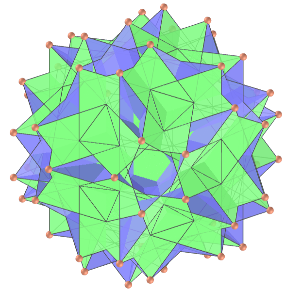 Grande rombidodecaedro</a></td>
		<td></td>
		<td></td>
		<td rowspan="2"></td>
	</tr>
	<tr>
		<td></td>
		<td class="titulo1"><a href="../quasiregular/pt-br/#m3d" target="_blank"> Grande rombidodecácrono</a></td>
		<td></td>
		<td></td>
	</tr>
</table>
<h3>Poliedros truncados de auto-interseção</h3>
<table>	
	<tr>
		<th colspan="2">Nome</th>
		<th>Modelo 3D</th>
		<th>Vídeo</th>
		<th>Dual</th>
		<th>Salas imersivas</th>
	</tr>
	<tr>
		<td>U16</td>
		<td class="titulo1"><a href="../selfintersecttruncated/pt-br/#m3d" target="_blank"> Cuboctaedro cubitruncado</a></td>
		<td></td>
		<td></td>
		<td rowspan="2"></td>
		<td rowspan="2"></td>
	</tr>
	<tr>
		<td></td>
		<td class="titulo1"><a href="../selfintersecttruncated/pt-br/#m3d" target="_blank"> Hexaedro tetradyakis</a></td>
		<td></td>
		<td></td>
	</tr>
	<tr>
		<td>U19</td>
		<td class="titulo1"><a href="../selfintersecttruncated/pt-br/#m3d" target="_blank"> Hexaedro estrelado truncado</a></td>
		<td></td>
		<td></td>
		<td rowspan="2"></td>
		<td rowspan="2"></td>
	</tr>
	<tr>
		<td></td>
		<td class="titulo1"><a href="../selfintersecttruncated/pt-br/#m3d" target="_blank"> Grande octaedro triakis</a></td>
		<td></td>
		<td></td>
	</tr>
	<tr>
		<td>U20</td>
		<td class="titulo1"><a href="../selfintersecttruncated/pt-br/#m3d" target="_blank">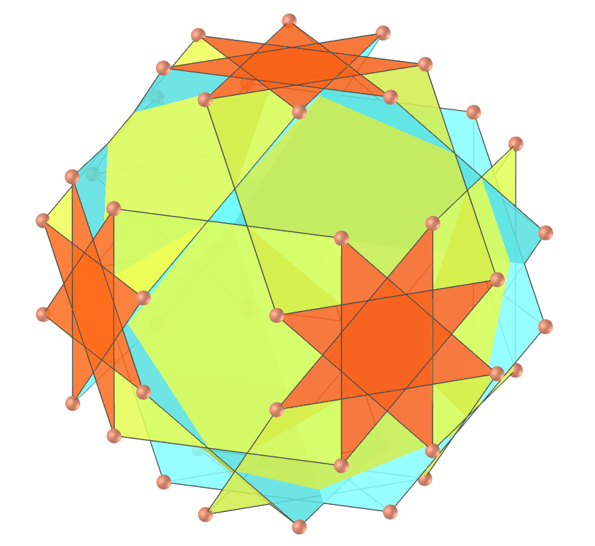 Grande cuboctaedro truncado</a></td>
		<td></td>
		<td></td>
		<td rowspan="2"></td>
		<td rowspan="2"></td>
	</tr>
	<tr>
		<td></td>
		<td class="titulo1"><a href="../selfintersecttruncated/pt-br/#m3d" target="_blank"> Grande dodecaedro disdyakis</a></td>
		<td></td>
		<td></td>
	</tr>
	<tr>
		<td>U37</td>
		<td class="titulo1"><a href="../selfintersecttruncated/pt-br/#m3d" target="_blank">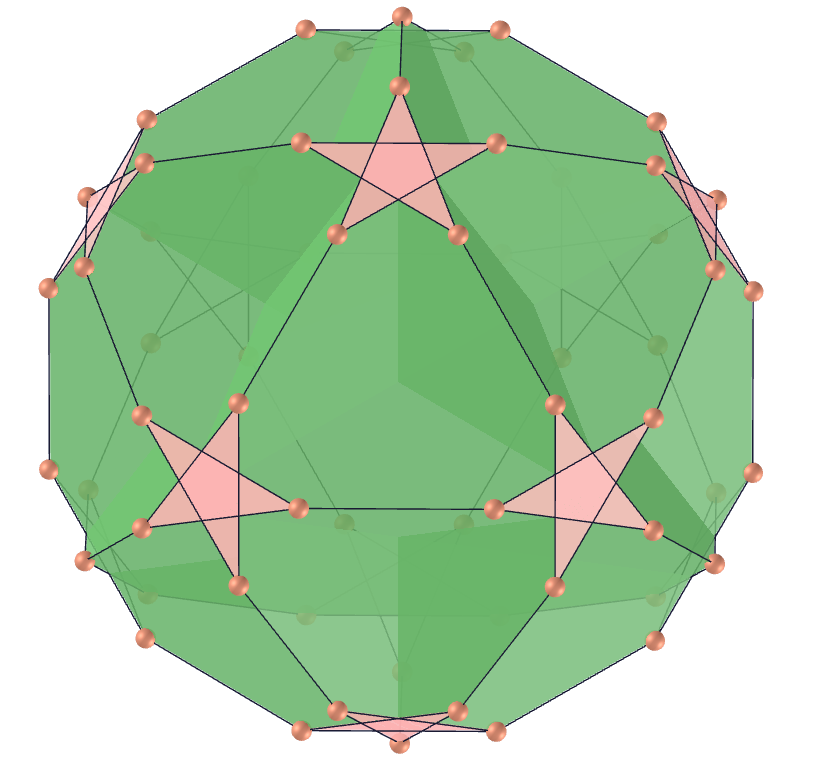 Grande dodecaedro truncado</a></td>
		<td></td>
		<td></td>
		<td rowspan="2"></td>
		<td rowspan="2"></td>
	</tr>
	<tr>
		<td></td>
		<td class="titulo1"><a href="../selfintersecttruncated/pt-br/#m3d" target="_blank"> Pequeno dodecaedro stellapentakis</a></td>
		<td></td>
		<td></td>
	</tr>
	<tr>
		<td>U45</td>
		<td class="titulo1"><a href="../selfintersecttruncated/pt-br/#m3d" target="_blank">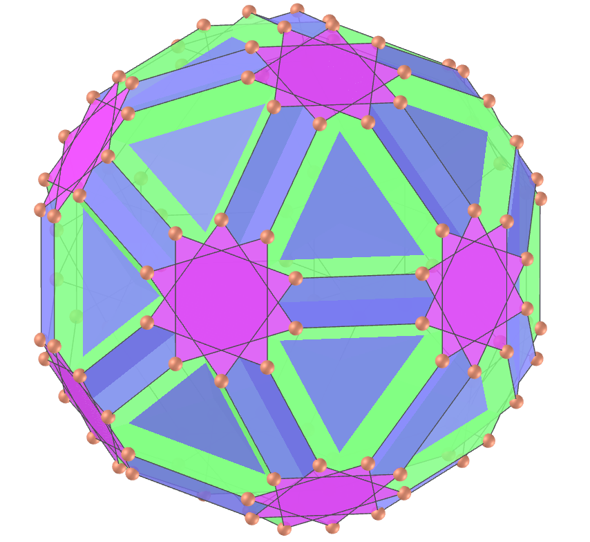 Dodecadodecaedro icositruncado</a></td>
		<td></td>
		<td></td>
		<td rowspan="2"></td>
		<td rowspan="2"></td>
	</tr>
	<tr>
		<td></td>
		<td class="titulo1"><a href="../selfintersecttruncated/pt-br/#m3d" target="_blank"> Icosaedro tridyakis</a></td>
		<td></td>
		<td></td>
	</tr>
	<tr>
		<td>U55</td>
		<td class="titulo1"><a href="../selfintersecttruncated/pt-br/#m3d" target="_blank"> Grande icosaedro truncado</a></td>
		<td></td>
		<td></td>
		<td rowspan="2"></td>
		<td rowspan="4"></td>
	</tr>
	<tr>
		<td></td>
		<td class="titulo1"><a href="../selfintersecttruncated/pt-br/#m3d" target="_blank"> Grande dodecaedro stellapentakis</a></td>
		<td></td>
		<td></td>
	</tr>
	<tr>
		<td>U58</td>
		<td class="titulo1"><a href="../selfintersecttruncated/pt-br/#m3d" target="_blank"> Pequeno dodecaedro estrelado truncado</a></td>
		<td></td>
		<td></td>
		<td rowspan="2"></td>
	</tr>
	<tr>
		<td></td>
		<td class="titulo1"><a href="../selfintersecttruncated/pt-br/#m3d" target="_blank"> Grande dodecaedro pentakis</a></td>
		<td></td>
		<td></td>
	</tr>
	<tr>
		<td>U59</td>
		<td class="titulo1"><a href="../selfintersecttruncated/pt-br/#m3d" target="_blank"> Dodecadodecaedro truncado</a></td>
		<td></td>
		<td></td>
		<td rowspan="2"></td>
		<td rowspan="2"></td>
	</tr>
	<tr>
		<td></td>
		<td class="titulo1"><a href="../selfintersecttruncated/pt-br/#m3d" target="_blank"> Triacontaedro disdyakis medial</a></td>
		<td></td>
		<td></td>
	</tr>
	<tr>
		<td>U66</td>
		<td class="titulo1"><a href="../selfintersecttruncated/pt-br/#m3d" target="_blank"> Grande dodecaedro estrelado truncado</a></td>
		<td></td>
		<td></td>
		<td rowspan="2"></td>
		<td rowspan="2"></td>
	</tr>
	<tr>
		<td></td>
		<td class="titulo1"><a href="../selfintersecttruncated/pt-br/#m3d" target="_blank">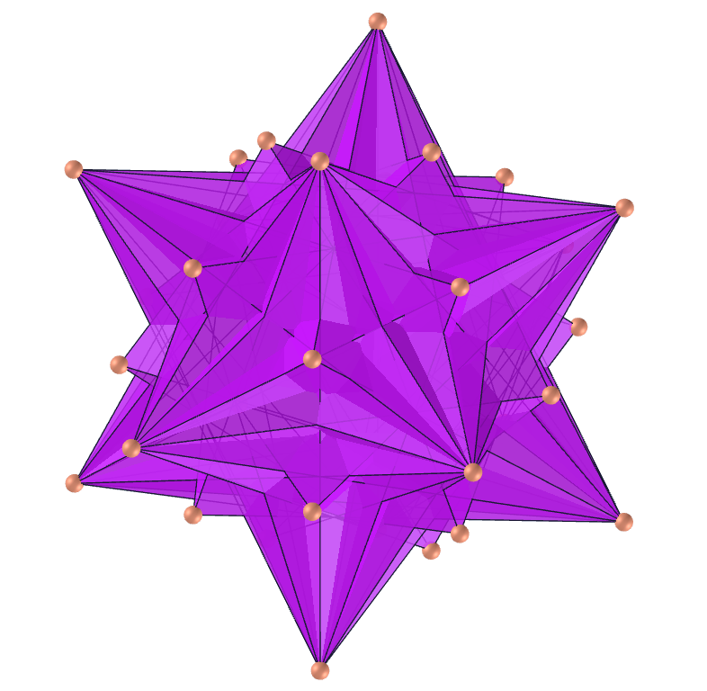 Grande icosaedro triakis</a></td>
		<td></td>
		<td></td>
	</tr>
	<tr>
		<td>U68</td>
		<td class="titulo1"><a href="../selfintersecttruncated/pt-br/#m3d" target="_blank"> Grande icosidodecaedro truncado</a></td>
		<td></td>
		<td></td>
		<td rowspan="2"></td>
		<td rowspan="2"></td>
	</tr>
	<tr>
		<td></td>
		<td class="titulo1"><a href="../selfintersecttruncated/pt-br/#m3d" target="_blank"> Grande triacontaedro disdyakis</a></td>
		<td></td>
		<td></td>
	</tr>
</table>
<h3>Poliedros truncados de auto-interseção snubficados</h3>
<table>	
	<tr>
		<th colspan="2">Nome</th>
		<th>Modelo 3D</th>
		<th>Vídeo</th>
		<th>Dual</th>
		<th>Salas imersivas</th>
	</tr>
	<tr>
		<td>U32</td>
		<td class="titulo1"><a href="../selfintersectsnub/pt-br/#m3d" target="_blank"> Pequeno icosicosidodecaedro snub</a></td>
		<td></td>
		<td></td>
		<td rowspan="2"></td>
		<td rowspan="2"></td>
	</tr>
	<tr>
		<td></td>
		<td class="titulo1"><a href="../selfintersectsnub/pt-br/#m3d" target="_blank"> Pequeno hexecontaedro hexagonal</a></td>
		<td></td>
		<td></td>
	</tr>
	<tr>
		<td>U40</td>
		<td class="titulo1"><a href="../selfintersectsnub/pt-br/#m3d" target="_blank"> Dodecadodecaedro snub</a></td>
		<td></td>
		<td></td>
		<td rowspan="2"></td>
		<td rowspan="2"></td>
	</tr>
	<tr>
		<td></td>
		<td class="titulo1"><a href="../selfintersectsnub/pt-br/#m3d" target="_blank"> Hexecontaedro pentagonal medial</a></td>
		<td></td>
		<td></td>
	</tr>
	<tr>
		<td>U46</td>
		<td class="titulo1"><a href="../selfintersectsnub/pt-br/#m3d" target="_blank">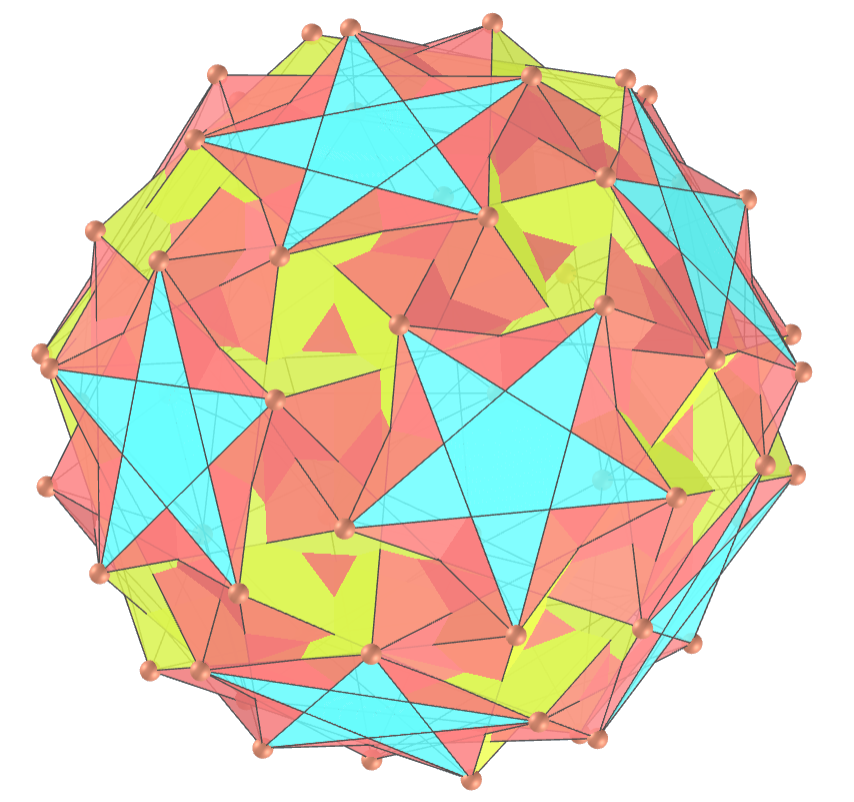 Icosidodecadodecaedro snub</a></td>
		<td></td>
		<td></td>
		<td rowspan="2"></td>
		<td rowspan="2"></td>
	</tr>
	<tr>
		<td></td>
		<td class="titulo1"><a href="../selfintersectsnub/pt-br/#m3d" target="_blank"> Hexecontaedro hexagonal medial</a></td>
		<td></td>
		<td></td>
	</tr>
	<tr>
		<td>U57</td>
		<td class="titulo1"><a href="../selfintersectsnub/pt-br/#m3d" target="_blank"> Grande icosidodecaedro snub</a></td>
		<td></td>
		<td></td>
		<td rowspan="2"></td>
		<td rowspan="4"></td>
	</tr>
	<tr>
		<td></td>
		<td class="titulo1"><a href="../selfintersectsnub/pt-br/#m3d" target="_blank"> Grande hexecontaedro pentagonal</a></td>
		<td></td>
		<td></td>
	</tr>
	<tr>
		<td>U60</td>
		<td class="titulo1"><a href="../selfintersectsnub/pt-br/#m3d" target="_blank">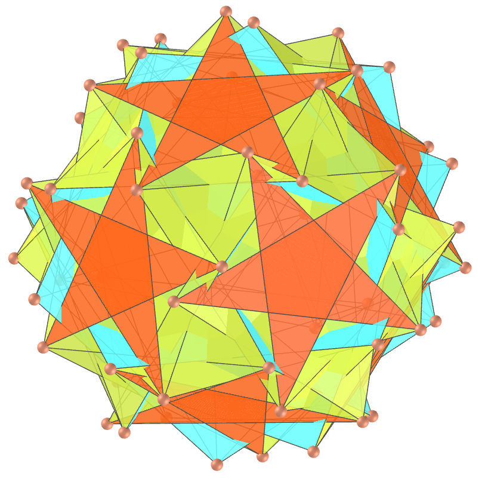 Dodecadodecaedro snub invertido</a></td>
		<td></td>
		<td></td>
		<td rowspan="2"></td>
	</tr>
	<tr>
		<td></td>
		<td class="titulo1"><a href="../selfintersectsnub/pt-br/#m3d" target="_blank"> Hexecontaedro pentagonal invertido medial</a></td>
		<td></td>
		<td></td>
	</tr>
	<tr>
		<td>U64</td>
		<td class="titulo1"><a href="../selfintersectsnub/pt-br/#m3d" target="_blank"> Grande dodecicosidodecaedro snub</a></td>
		<td></td>
		<td></td>
		<td rowspan="2"></td>
		<td rowspan="2"></td>
	</tr>
	<tr>
		<td></td>
		<td class="titulo1"><a href="../selfintersectsnub/pt-br/#m3d" target="_blank"> Grande hexecontaedro hexagonal</a></td>
		<td></td>
		<td></td>
	</tr>
	<tr>
		<td>U69</td>
		<td class="titulo1"><a href="../selfintersectsnub/pt-br/#m3d" target="_blank"> Grande icosidodecaedro snub invertido</a></td>
		<td></td>
		<td></td>
		<td rowspan="2"></td>
		<td rowspan="2"></td>
	</tr>
	<tr>
		<td></td>
		<td class="titulo1"><a href="../selfintersectsnub/pt-br/#m3d" target="_blank">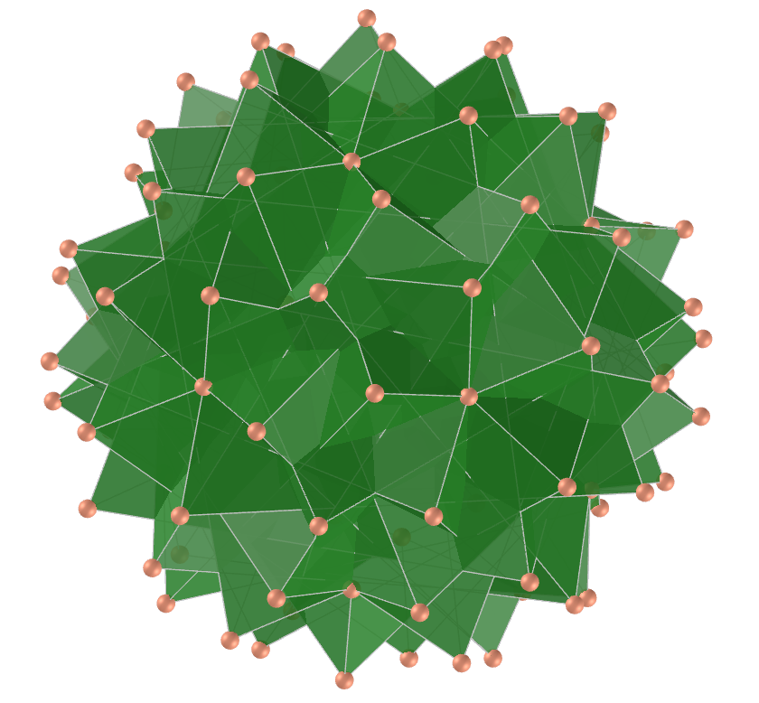 Grande hexecontaedro pentagonal invertido</a></td>
		<td></td>
		<td></td>
	</tr>
	<tr>
		<td>U72</td>
		<td class="titulo1"><a href="../selfintersectsnub/pt-br/#m3d" target="_blank"> Pequeno icosicosidodecaedro retrosnub</a></td>
		<td></td>
		<td></td>
		<td rowspan="2"></td>
		<td rowspan="2"></td>
	</tr>
	<tr>
		<td></td>
		<td class="titulo1"><a href="../selfintersectsnub/pt-br/#m3d" target="_blank"> Pequeno hexecontaedro hexagrâmico</a></td>
		<td></td>
		<td></td>
	</tr>
	<tr>
		<td>U74</td>
		<td class="titulo1"><a href="../selfintersectsnub/pt-br/#m3d" target="_blank"> Grande icosidodecaedro retrosnub</a></td>
		<td></td>
		<td></td>
		<td rowspan="2"></td>
		<td rowspan="2"></td>
	</tr>
	<tr>
		<td></td>
		<td class="titulo1"><a href="../selfintersectsnub/pt-br/#m3d" target="_blank"> Grande hexecontaedro pentagrâmico</a></td>
		<td></td>
		<td></td>
	</tr>
	<tr>
		<td>U75</td>
		<td class="titulo1"><a href="../selfintersectsnub/pt-br/#m3d" target="_blank"> Grande dirrombicosidodecaedro</a></td>
		<td></td>
		<td></td>
		<td rowspan="2"></td>
		<td></td>
	</tr>
	<tr>
		<td></td>
		<td class="titulo1"><a href="../infinity/pt-br/#m3d" target="_blank"> Grande dirrombicosidodecacron</a></td>
		<td></td>
		<td></td>
		<td></td>
	</tr>
	<tr>
		<td></td>
		<td class="titulo1"><a href="../selfintersectsnub/pt-br/#m3d" target="_blank">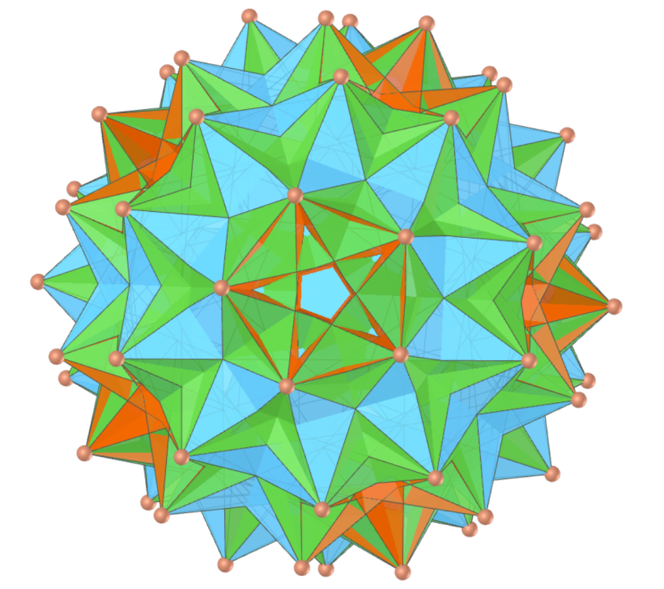 Grande dirrombidodecaedro disnub</a></td>
		<td></td>
		<td></td>
		<td></td>
		<td></td>
	</tr>
</table>
<h3>Sólidos de Johnson</h3>
<table>	
	<tr>
		<th colspan="2">Nome</th>
		<th>Modelo 3D</th>
		<th>Vídeo</th>
		<th>Salas imersivas</th>
	</tr>
	<tr>
		<td>J1</td>
		<td class="titulo1"><a href="../johnson1/pt-br/#m3d" target="_blank"> Pirâmide quadrada</a></td>
		<td></td>
		<td></td>
		<td rowspan="11"></td>
	</tr>
	<tr>
		<td>J2</td>
		<td class="titulo1"><a href="../johnson1/pt-br/#m3d" target="_blank">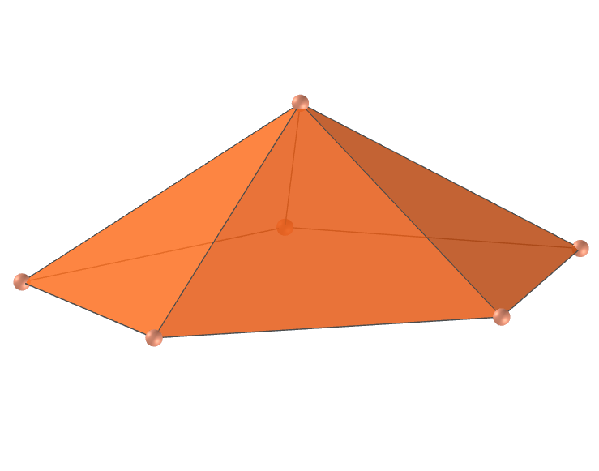 Pirâmide pentagonal</a></td>
		<td></td>
		<td></td>
	</tr>
	<tr>
		<td>J3</td>
		<td class="titulo1"><a href="../johnson1/pt-br/#m3d" target="_blank">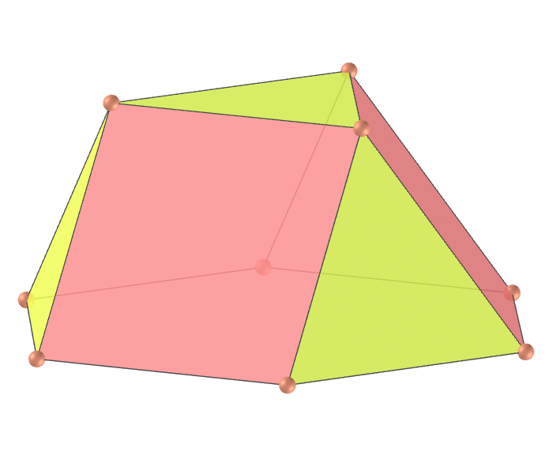 Cúpula triangular</a></td>
		<td></td>
		<td></td>
	</tr>
	<tr>
		<td>J4</td>
		<td class="titulo1"><a href="../johnson1/pt-br/#m3d" target="_blank">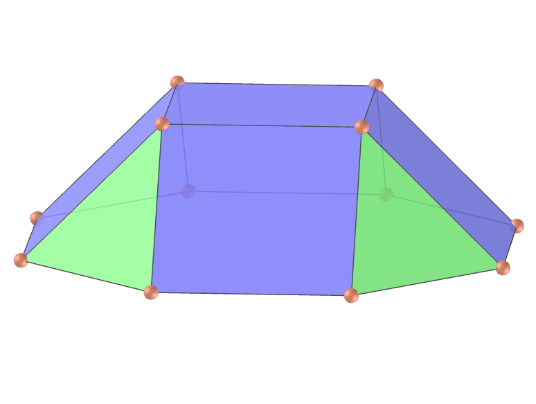 Cúpula quadrada</a></td>
		<td></td>
		<td></td>
	</tr>
	<tr>
		<td>J5</td>
		<td class="titulo1"><a href="../johnson1/pt-br/#m3d" target="_blank">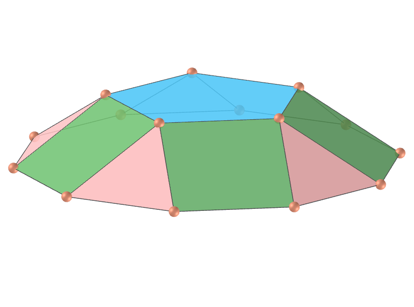 Cúpula pentagonal</a></td>
		<td></td>
		<td></td>
	</tr>
	<tr>
		<td>J6</td>
		<td class="titulo1"><a href="../johnson1/pt-br/#m3d" target="_blank"> Rotunda pentagonal</a></td>
		<td></td>
		<td></td>
	</tr>
	<tr>
		<td>J7</td>
		<td class="titulo1"><a href="../johnson1/pt-br/#m3d" target="_blank">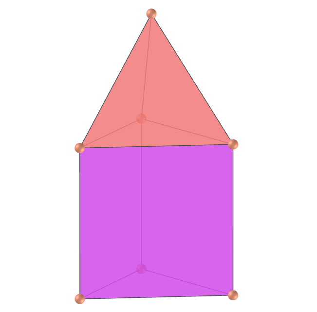 Pirâmide triangular alongada</a></td>
		<td></td>
		<td></td>
	</tr>
	<tr>
		<td>J8</td>
		<td class="titulo1"><a href="../johnson1/pt-br/#m3d" target="_blank">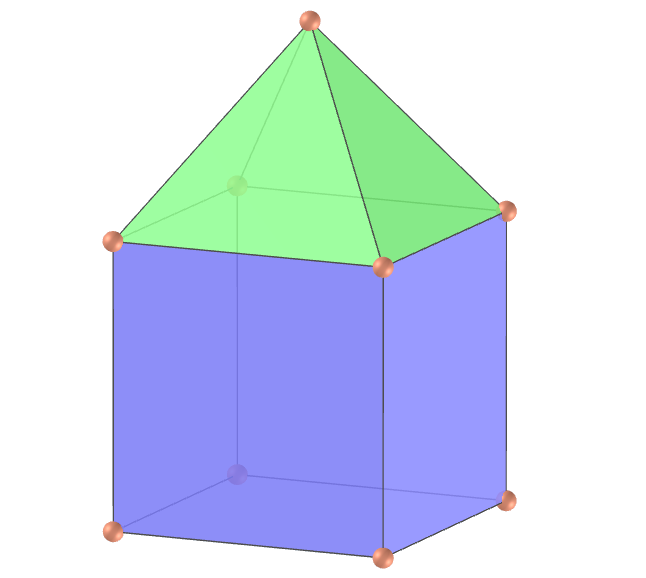 Pirâmide quadrada alongada</a></td>
		<td></td>
		<td></td>
	</tr>
	<tr>
		<td>J9</td>
		<td class="titulo1"><a href="../johnson1/pt-br/#m3d" target="_blank">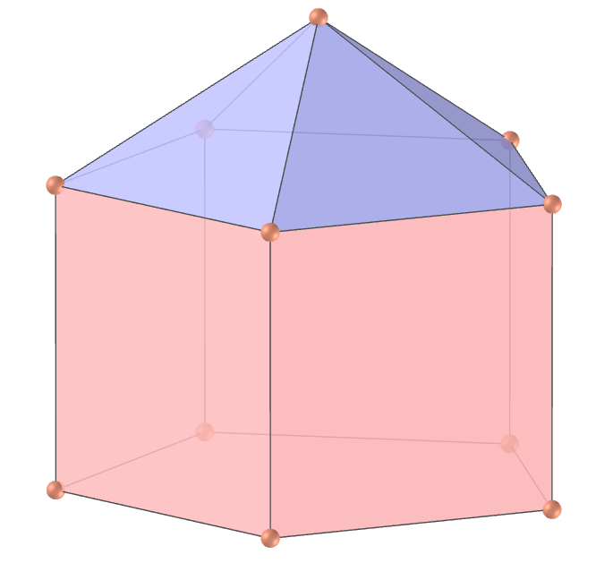 Pirâmide pentagonal alongada</a></td>
		<td></td>
		<td></td>
	</tr>
	<tr>
		<td>J10</td>
		<td class="titulo1"><a href="../johnson1/pt-br/#m3d" target="_blank"> Pirâmide quadrada giralongada</a></td>
		<td></td>
		<td></td>
	</tr>
	<tr>
		<td>J11</td>
		<td class="titulo1"><a href="../johnson1/pt-br/#m3d" target="_blank"> Pirâmide pentagonal giralongada</a></td>
		<td></td>
		<td></td>
	</tr>
	<tr>
		<td>J12</td>
		<td class="titulo1"><a href="../johnson1/pt-br/#m3d" target="_blank"> Dipirâmide triangular</a></td>
		<td></td>
		<td></td>
		<td rowspan="11"></td>
	</tr>
	<tr>
		<td>J13</td>
		<td class="titulo1"><a href="../johnson1/pt-br/#m3d" target="_blank">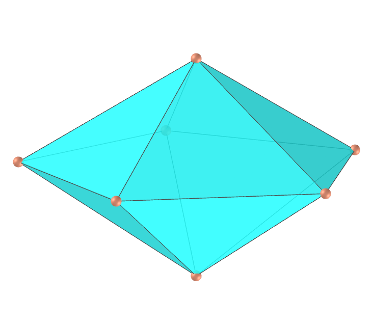 Dipirâmide pentagonal</a></td>
		<td></td>
		<td></td>
	</tr>
	<tr>
		<td>J14</td>
		<td class="titulo1"><a href="../johnson1/pt-br/#m3d" target="_blank"> Dipirâmide triangular alongada</a></td>
		<td></td>
		<td></td>
	</tr>
	<tr>
		<td>J15</td>
		<td class="titulo1"><a href="../johnson1/pt-br/#m3d" target="_blank"> Dipirâmide quadrada alongada</a></td>
		<td></td>
		<td></td>
	</tr>
	<tr>
		<td>J16</td>
		<td class="titulo1"><a href="../johnson1/pt-br/#m3d" target="_blank">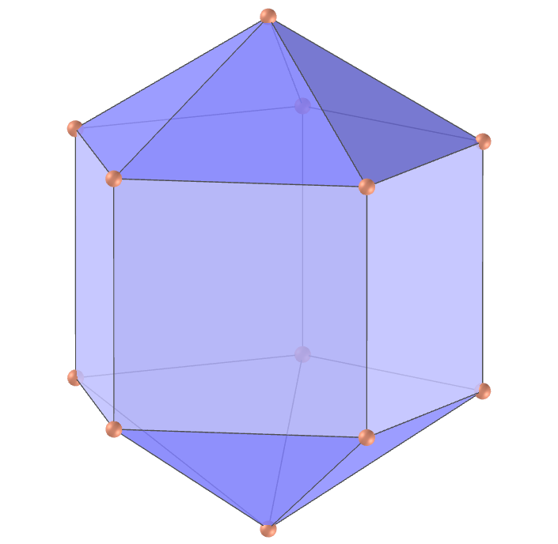 Dipirâmide pentagonal alongada</a></td>
		<td></td>
		<td></td>
	</tr>
	<tr>
		<td>J17</td>
		<td class="titulo1"><a href="../johnson1/pt-br/#m3d" target="_blank">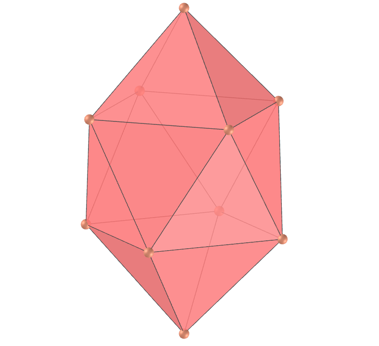 Dipirâmide quadrada giralongada</a></td>
		<td></td>
		<td></td>
	</tr>
	<tr>
		<td>J18</td>
		<td class="titulo1"><a href="../johnson1/pt-br/#m3d" target="_blank"> Cúpula triangular alongada</a></td>
		<td></td>
		<td></td>
	</tr>
	<tr>
		<td>J19</td>
		<td class="titulo1"><a href="../johnson1/pt-br/#m3d" target="_blank"> Cúpula quadrada alongada</a></td>
		<td></td>
		<td></td>
	</tr>
	<tr>
		<td>J20</td>
		<td class="titulo1"><a href="../johnson1/pt-br/#m3d" target="_blank"> Cúpula pentagonal alongada</a></td>
		<td></td>
		<td></td>
	</tr>
	<tr>
		<td>J21</td>
		<td class="titulo1"><a href="../johnson1/pt-br/#m3d" target="_blank"> Rotunda pentagonal alongada</a></td>
		<td></td>
		<td></td>
	</tr>
	<tr>
		<td>J22</td>
		<td class="titulo1"><a href="../johnson1/pt-br/#m3d" target="_blank"> Cúpula triangular giralongada</a></td>
		<td></td>
		<td></td>
	</tr>
	<tr>
		<td>J23</td>
		<td class="titulo1"><a href="../johnson1/pt-br/#m3d" target="_blank">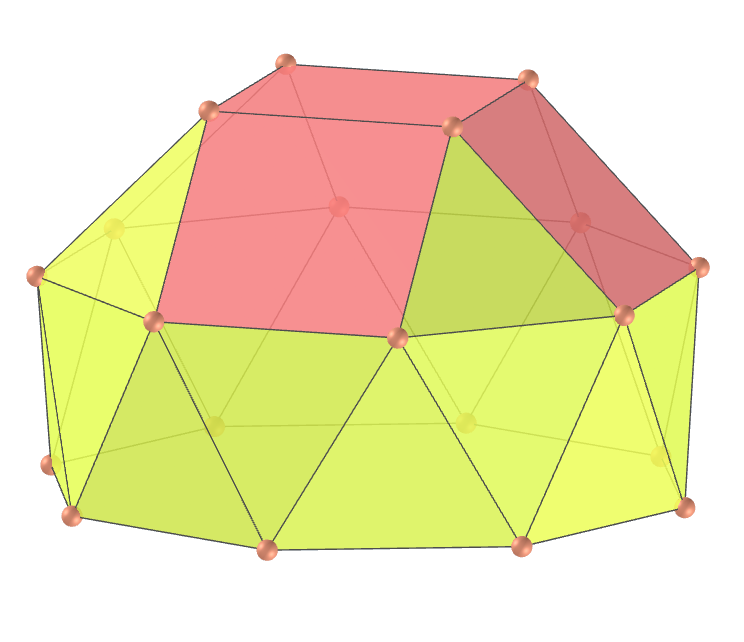 Cúpula quadrada giralongada</a></td>
		<td></td>
		<td></td>
		<td rowspan="10"></td>
	</tr>
	<tr>
		<td>J24</td>
		<td class="titulo1"><a href="../johnson1/pt-br/#m3d" target="_blank"> Cúpula pentagonal giralongada</a></td>
		<td></td>
		<td></td>
	</tr>
	<tr>
		<td>J25</td>
		<td class="titulo1"><a href="../johnson1/pt-br/#m3d" target="_blank"> Rotunda pentagonal giralongada</a></td>
		<td></td>
		<td></td>
	</tr>
	<tr>
		<td>J26</td>
		<td class="titulo1"><a href="../johnson1/pt-br/#m3d" target="_blank">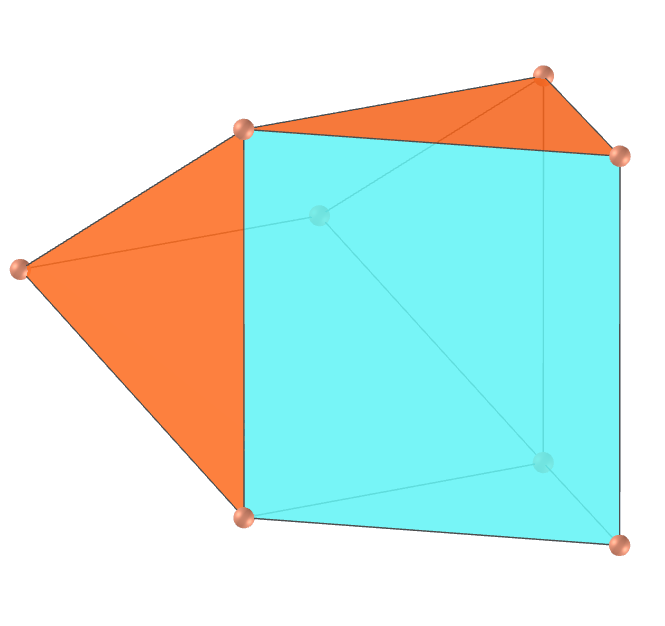 Girobiprisma</a></td>
		<td></td>
		<td></td>
	</tr>
	<tr>
		<td>J27</td>
		<td class="titulo1"><a href="../johnson1/pt-br/#m3d" target="_blank"> Ortobicúpula triangular</a></td>
		<td></td>
		<td></td>
	</tr>
	<tr>
		<td>J28</td>
		<td class="titulo1"><a href="../johnson1/pt-br/#m3d" target="_blank"> Ortobicúpula quadrada</a></td>
		<td></td>
		<td></td>
	</tr>
	<tr>
		<td>J29</td>
		<td class="titulo1"><a href="../johnson1/pt-br/#m3d" target="_blank"> Girobicúpula quadrada</a></td>
		<td></td>
		<td></td>
	</tr>
	<tr>
		<td>J30</td>
		<td class="titulo1"><a href="../johnson1/pt-br/#m3d" target="_blank">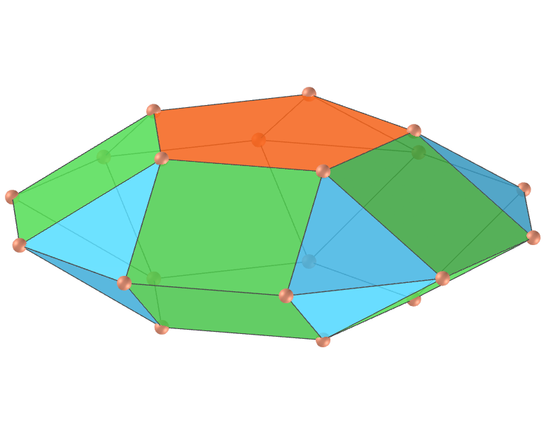 Ortobicúpula pentagonal</a></td>
		<td></td>
		<td></td>
	</tr>
	<tr>
		<td>J31</td>
		<td class="titulo1"><a href="../johnson1/pt-br/#m3d" target="_blank"> Girobicúpula pentagonal</a></td>
		<td></td>
		<td></td>
	</tr>
	<tr>
		<td>J32</td>
		<td class="titulo1"><a href="../johnson1/pt-br/#m3d" target="_blank"> Ortocúpula rotunda pentagonal</a></td>
		<td></td>
		<td></td>
	</tr>
	<tr>
		<td>J33</td>
		<td class="titulo1"><a href="../johnson2/pt-br/#m3d" target="_blank"> Girocúpula rotunda pentagonal</a></td>
		<td></td>
		<td></td>
		<td rowspan="10"></td>
	</tr>
	<tr>
		<td>J34</td>
		<td class="titulo1"><a href="../johnson2/pt-br/#m3d" target="_blank"> Ortobirotunda pentagonal</a></td>
		<td></td>
		<td></td>
	</tr>
	<tr>
		<td>J35</td>
		<td class="titulo1"><a href="../johnson2/pt-br/#m3d" target="_blank"> Ortobicúpula triangular alongada</a></td>
		<td></td>
		<td></td>
	</tr>
	<tr>
		<td>J36</td>
		<td class="titulo1"><a href="../johnson2/pt-br/#m3d" target="_blank">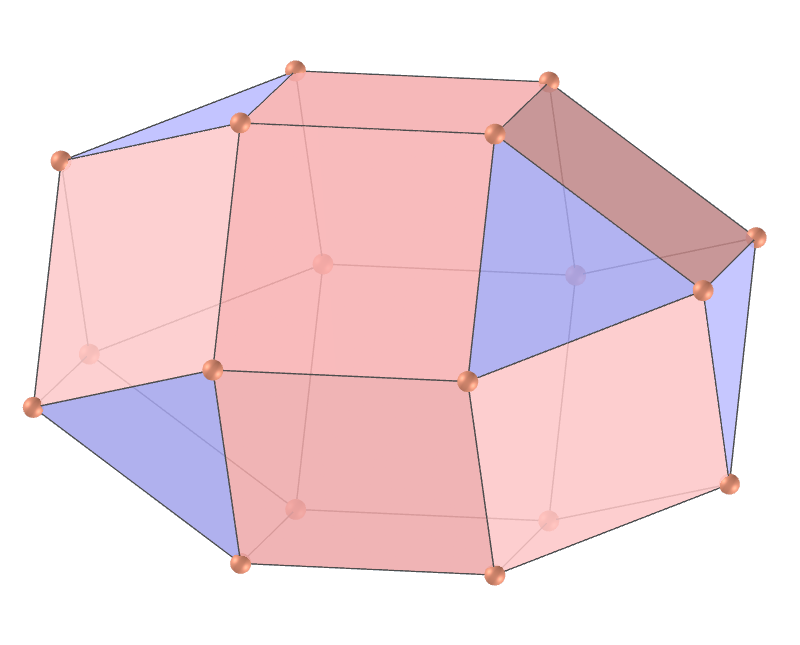 Girobicúpula triangular alongada</a></td>
		<td></td>
		<td></td>
	</tr>
	<tr>
		<td>J37</td>
		<td class="titulo1"><a href="../johnson2/pt-br/#m3d" target="_blank"> Girobicúpula quadrada alongada</a></td>
		<td></td>
		<td></td>
	</tr>
	<tr>
		<td>J38</td>
		<td class="titulo1"><a href="../johnson2/pt-br/#m3d" target="_blank">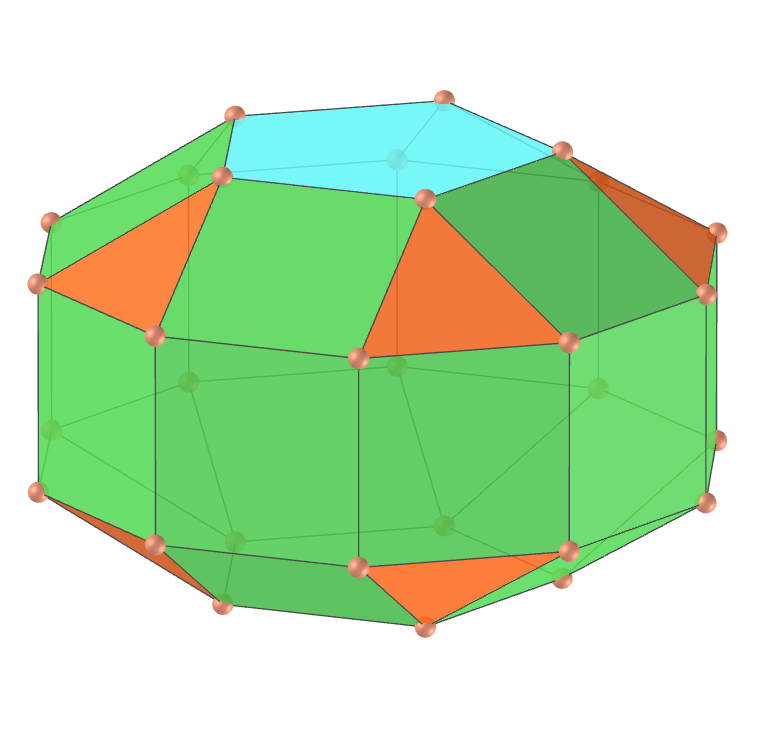 Ortobicúpula pentagonal alongada</a></td>
		<td></td>
		<td></td>
	</tr>
	<tr>
		<td>J39</td>
		<td class="titulo1"><a href="../johnson2/pt-br/#m3d" target="_blank"> Girobicúpula pentagonal alongada</a></td>
		<td></td>
		<td></td>
	</tr>
	<tr>
		<td>J40</td>
		<td class="titulo1"><a href="../johnson2/pt-br/#m3d" target="_blank">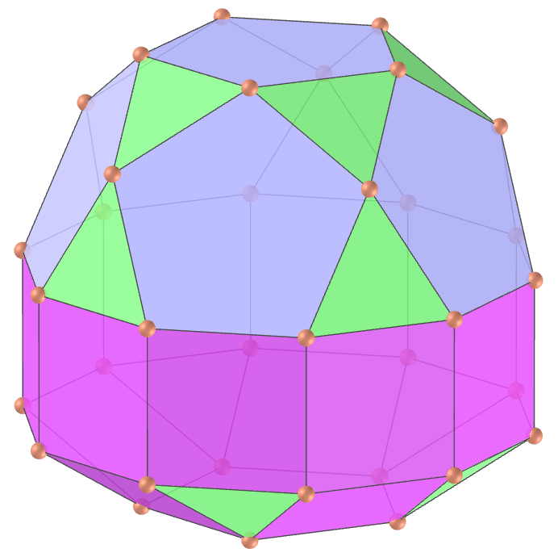 Ortocúpula rotunda pentagonal alongada</a></td>
		<td></td>
		<td></td>
	</tr>
	<tr>
		<td>J41</td>
		<td class="titulo1"><a href="../johnson2/pt-br/#m3d" target="_blank"> Girocúpula rotunda pentagonal alongada</a></td>
		<td></td>
		<td></td>
	</tr>
	<tr>
		<td>J42</td>
		<td class="titulo1"><a href="../johnson2/pt-br/#m3d" target="_blank">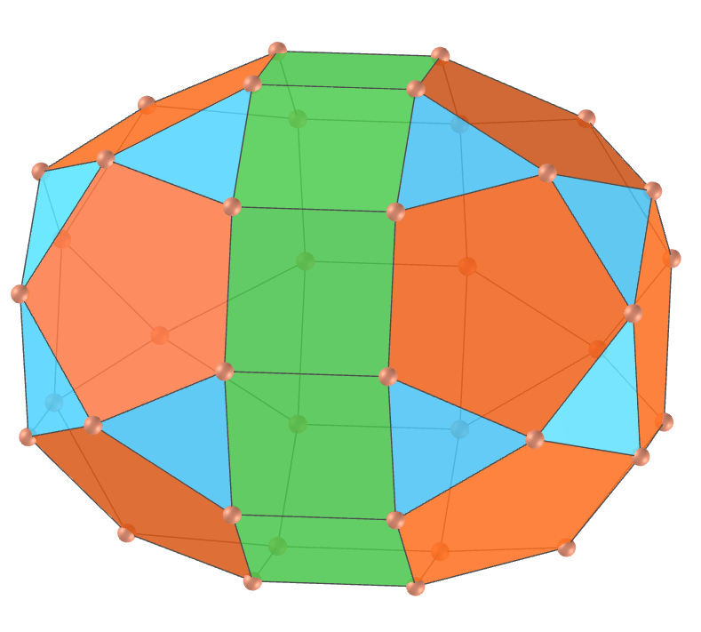 Ortobirotunda pentagonal alongada</a></td>
		<td></td>
		<td></td>
	</tr>
	<tr>
		<td>J43</td>
		<td class="titulo1"><a href="../johnson2/pt-br/#m3d" target="_blank">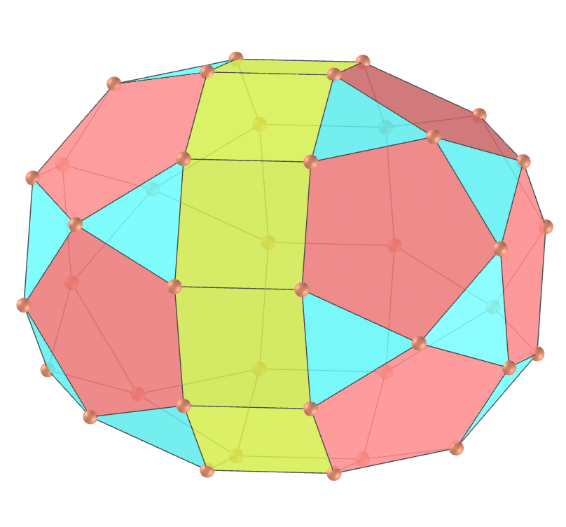 Girobirotunda pentagonal alongada</a></td>
		<td></td>
		<td></td>
		<td rowspan="10"></td>
	</tr>
	<tr>
		<td>J44</td>
		<td class="titulo1"><a href="../johnson2/pt-br/#m3d" target="_blank"> Bicúpula triangular giralongada</a></td>
		<td></td>
		<td></td>
	</tr>
	<tr>
		<td>J45</td>
		<td class="titulo1"><a href="../johnson2/pt-br/#m3d" target="_blank"> Bicúpula quadrada giralongada</a></td>
		<td></td>
		<td></td>
	</tr>
	<tr>
		<td>J46</td>
		<td class="titulo1"><a href="../johnson2/pt-br/#m3d" target="_blank"> Bicúpula pentagonal giralongada</a></td>
		<td></td>
		<td></td>
	</tr>
	<tr>
		<td>J47</td>
		<td class="titulo1"><a href="../johnson2/pt-br/#m3d" target="_blank">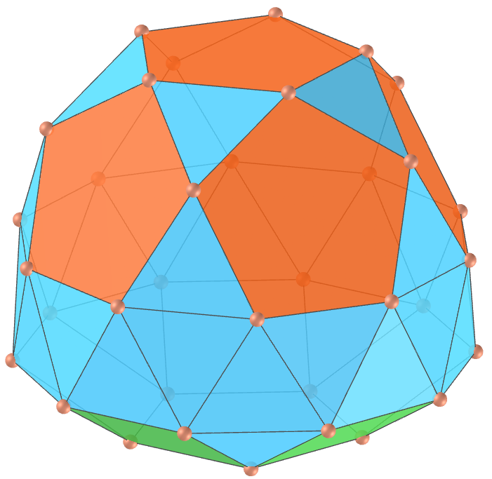 Cúpula rotunda pentagonal giralongada</a></td>
		<td></td>
		<td></td>
	</tr>
	<tr>
		<td>J48</td>
		<td class="titulo1"><a href="../johnson2/pt-br/#m3d" target="_blank">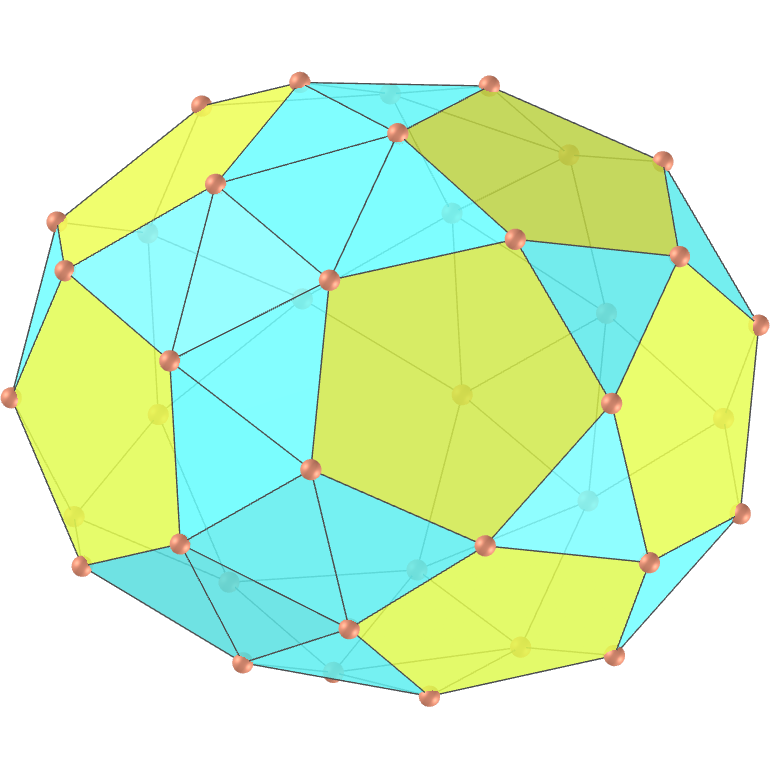 Birotunda pentagonal giralongada</a></td>
		<td></td>
		<td></td>
	</tr>
	<tr>
		<td>J49</td>
		<td class="titulo1"><a href="../johnson2/pt-br/#m3d" target="_blank"> Prisma triangular aumentado</a></td>
		<td></td>
		<td></td>
	</tr>
	<tr>
		<td>J50</td>
		<td class="titulo1"><a href="../johnson2/pt-br/#m3d" target="_blank"> Prisma triangular biaumentado</a></td>
		<td></td>
		<td></td>
	</tr>
	<tr>
		<td>J51</td>
		<td class="titulo1"><a href="../johnson2/pt-br/#m3d" target="_blank">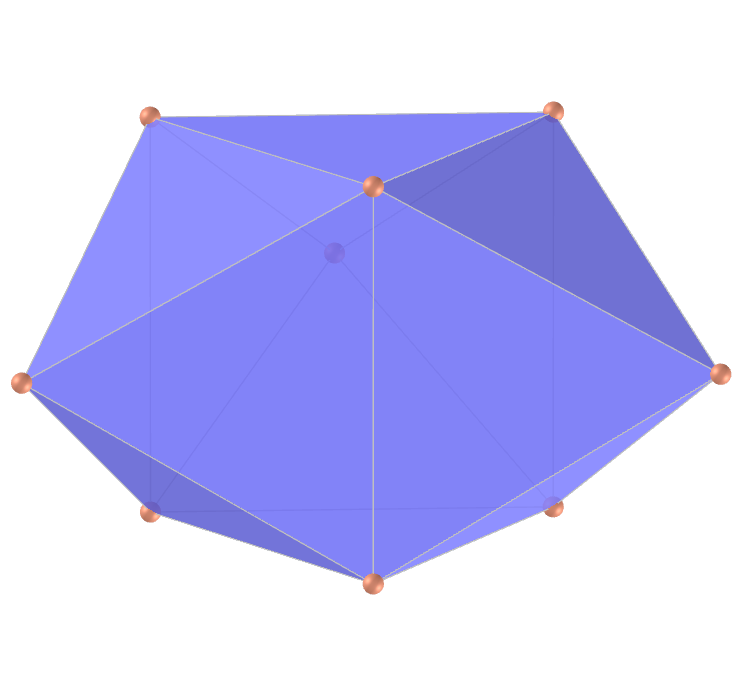 Prisma triangular triaumentado</a></td>
		<td></td>
		<td></td>
	</tr>
	<tr>
		<td>J52</td>
		<td class="titulo1"><a href="../johnson2/pt-br/#m3d" target="_blank">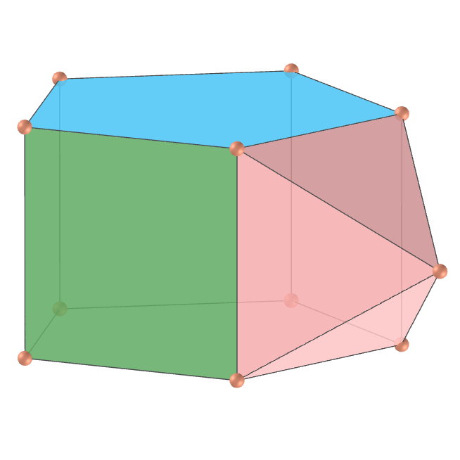 Prisma pentagonal aumentado</a></td>
		<td></td>
		<td></td>
	</tr>
	<tr>
		<td>J53</td>
		<td class="titulo1"><a href="../johnson2/pt-br/#m3d" target="_blank"> Prisma pentagonal biaumentado</a></td>
		<td></td>
		<td></td>
		<td rowspan="10"></td>
	</tr>
	<tr>
		<td>J54</td>
		<td class="titulo1"><a href="../johnson2/pt-br/#m3d" target="_blank"> Prisma hexagonal aumentado</a></td>
		<td></td>
		<td></td>
	</tr>
	<tr>
		<td>J55</td>
		<td class="titulo1"><a href="../johnson2/pt-br/#m3d" target="_blank">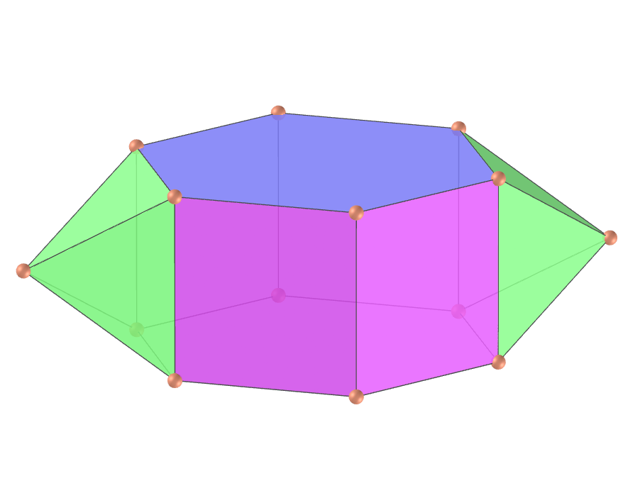 Prisma hexagonal parabiaumentado</a></td>
		<td></td>
		<td></td>
	</tr>
	<tr>
		<td>J56</td>
		<td class="titulo1"><a href="../johnson2/pt-br/#m3d" target="_blank">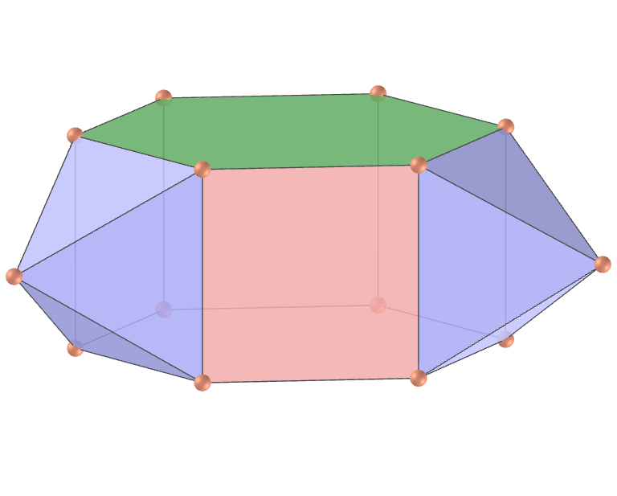 Prisma hexagonal metabiaumentado</a></td>
		<td></td>
		<td></td>
	</tr>
	<tr>
		<td>J57</td>
		<td class="titulo1"><a href="../johnson2/pt-br/#m3d" target="_blank"> Prisma hexagonal triaumentado</a></td>
		<td></td>
		<td></td>
	</tr>
	<tr>
		<td>J58</td>
		<td class="titulo1"><a href="../johnson2/pt-br/#m3d" target="_blank"> Dodecaedro aumentado</a></td>
		<td></td>
		<td></td>
	</tr>
	<tr>
		<td>J59</td>
		<td class="titulo1"><a href="../johnson2/pt-br/#m3d" target="_blank"> Dodecaedro parabiaumentado</a></td>
		<td></td>
		<td></td>
	</tr>
	<tr>
		<td>J60</td>
		<td class="titulo1"><a href="../johnson2/pt-br/#m3d" target="_blank">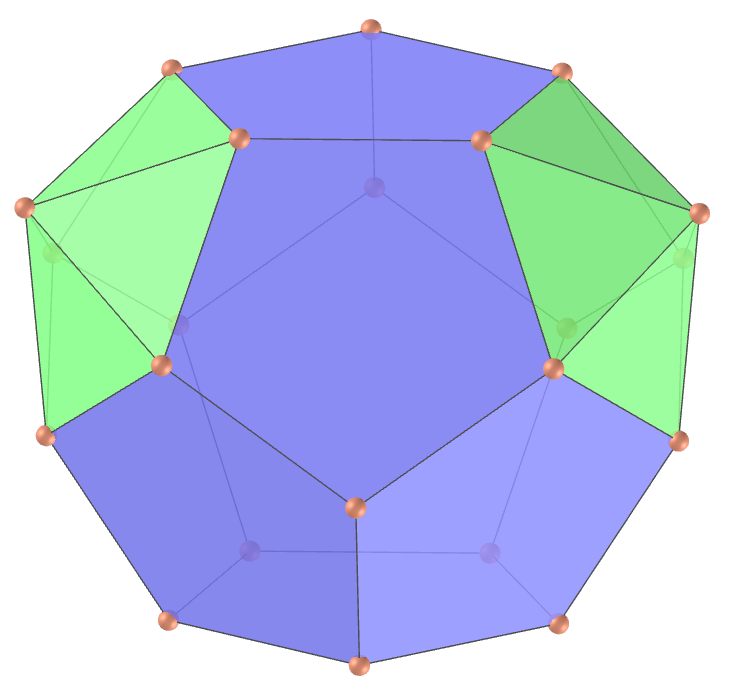 Dodecaedro metabiaumentado</a></td>
		<td></td>
		<td></td>
	</tr>
	<tr>
		<td>J61</td>
		<td class="titulo1"><a href="../johnson2/pt-br/#m3d" target="_blank"> Dodecaedro triaumentado</a></td>
		<td></td>
		<td></td>
	</tr>
	<tr>
		<td>J62</td>
		<td class="titulo1"><a href="../johnson2/pt-br/#m3d" target="_blank"> Icosaedro metabidiminuído</a></td>
		<td></td>
		<td></td>
	</tr>
	<tr>
		<td>J63</td>
		<td class="titulo1"><a href="../johnson3/pt-br/#m3d" target="_blank">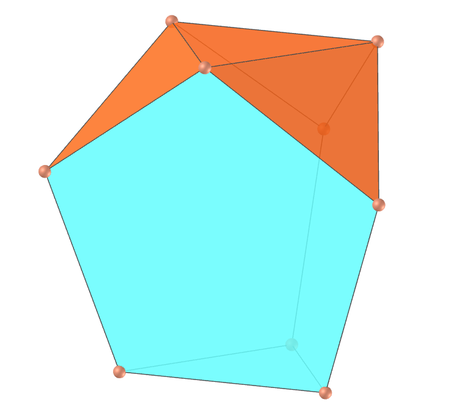 Icosaedro tridiminuído</a></td>
		<td></td>
		<td></td>
		<td rowspan="10"></td>
	</tr>
	<tr>
		<td>J64</td>
		<td class="titulo1"><a href="../johnson3/pt-br/#m3d" target="_blank">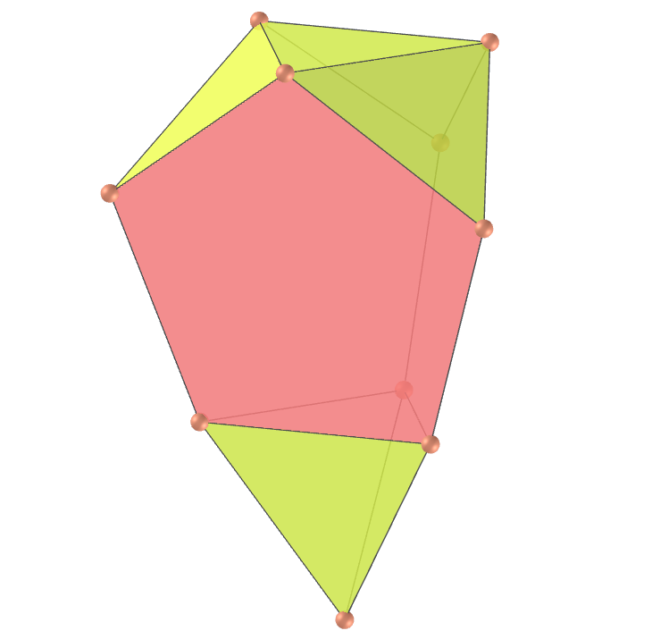 Icosaedro tridiminuído aumentado</a></td>
		<td></td>
		<td></td>
	</tr>
	<tr>
		<td>J65</td>
		<td class="titulo1"><a href="../johnson3/pt-br/#m3d" target="_blank">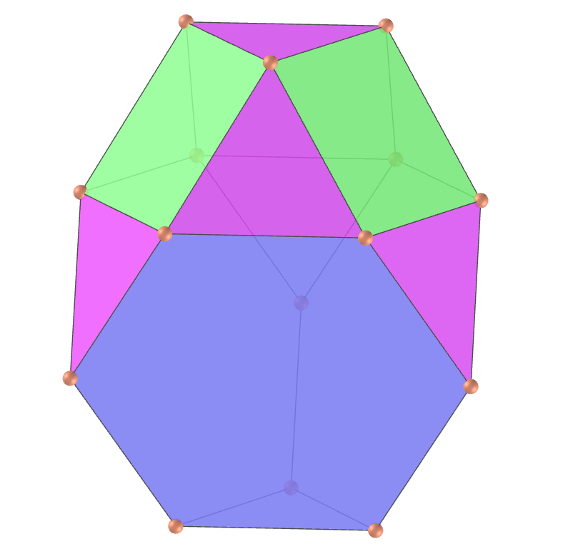 Tetraedro truncado aumentado</a></td>
		<td></td>
		<td></td>
	</tr>
	<tr>
		<td>J66</td>
		<td class="titulo1"><a href="../johnson3/pt-br/#m3d" target="_blank"> Cubo truncado aumentado</a></td>
		<td></td>
		<td></td>
	</tr>
	<tr>
		<td>J67</td>
		<td class="titulo1"><a href="../johnson3/pt-br/#m3d" target="_blank">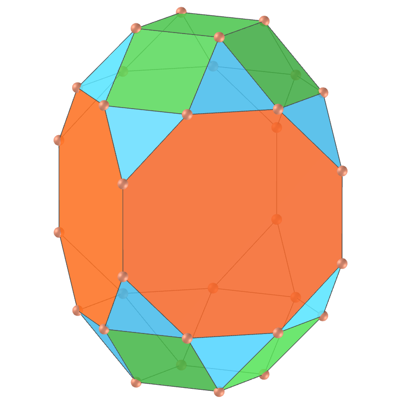 Cubo truncado biaumentado</a></td>
		<td></td>
		<td></td>
	</tr>
	<tr>
		<td>J68</td>
		<td class="titulo1"><a href="../johnson3/pt-br/#m3d" target="_blank">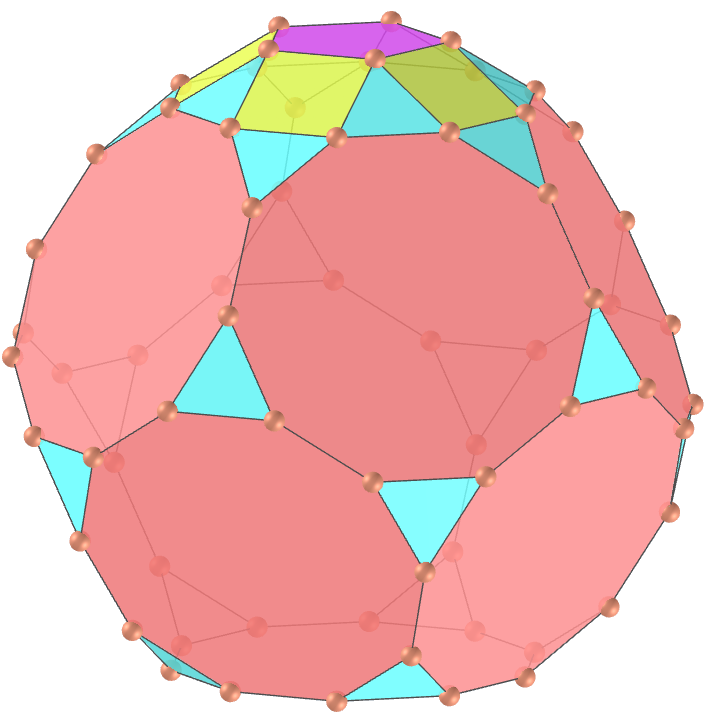 Dodecaedro truncado aumentado</a></td>
		<td></td>
		<td></td>
	</tr>
	<tr>
		<td>J69</td>
		<td class="titulo1"><a href="../johnson3/pt-br/#m3d" target="_blank">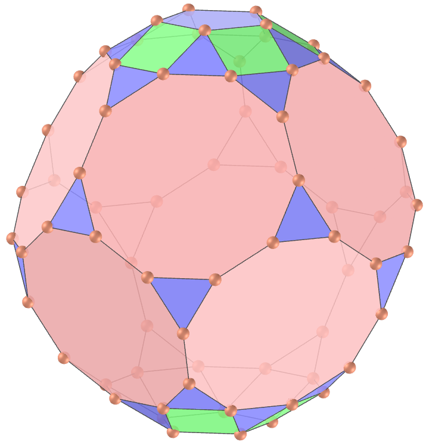 Dodecaedro truncado parabiaumentado</a></td>
		<td></td>
		<td></td>
	</tr>
	<tr>
		<td>J70</td>
		<td class="titulo1"><a href="../johnson3/pt-br/#m3d" target="_blank"> Dodecaedro truncado metabiaumentado</a></td>
		<td></td>
		<td></td>
	</tr>
	<tr>
		<td>J71</td>
		<td class="titulo1"><a href="../johnson3/pt-br/#m3d" target="_blank"> Dodecaedro truncado triaumentado</a></td>
		<td></td>
		<td></td>
	</tr>
	<tr>
		<td>J72</td>
		<td class="titulo1"><a href="../johnson3/pt-br/#m3d" target="_blank"> Rombicosidodecaedro girado</a></td>
		<td></td>
		<td></td>
	</tr>
	<tr>
		<td>J73</td>
		<td class="titulo1"><a href="../johnson3/pt-br/#m3d" target="_blank"> Rombicosidodecaedro parabigirado</a></td>
		<td></td>
		<td></td>
		<td rowspan="10"></td>
	</tr>
	<tr>
		<td>J74</td>
		<td class="titulo1"><a href="../johnson3/pt-br/#m3d" target="_blank">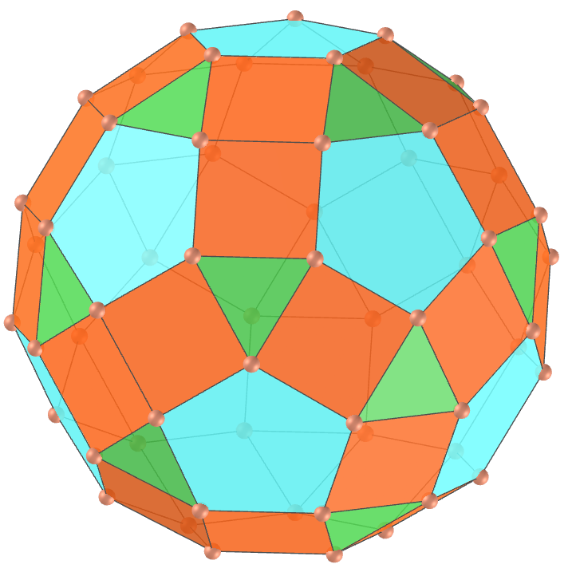 Rombicosidodecaedro metabigirado</a></td>
		<td></td>
		<td></td>
	</tr>
	<tr>
		<td>J75</td>
		<td class="titulo1"><a href="../johnson3/pt-br/#m3d" target="_blank"> Rombicosidodecaedro trigirado</a></td>
		<td></td>
		<td></td>
	</tr>
	<tr>
		<td>J76</td>
		<td class="titulo1"><a href="../johnson3/pt-br/#m3d" target="_blank">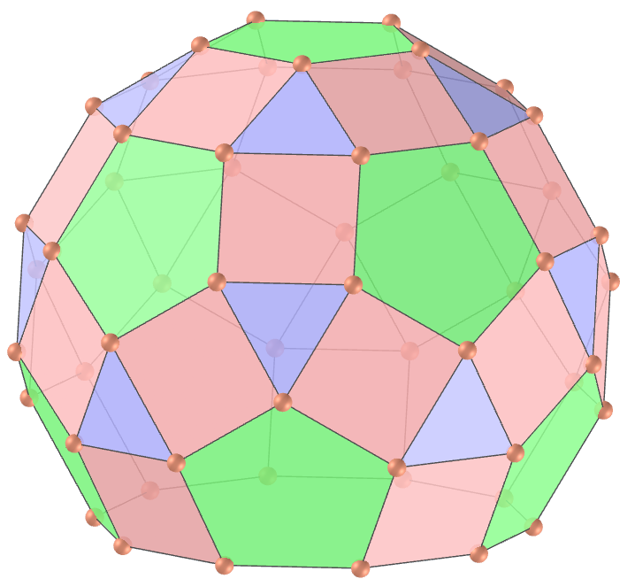 Rombicosidodecaedro diminuído</a></td>
		<td></td>
		<td></td>
	</tr>
	<tr>
		<td>J77</td>
		<td class="titulo1"><a href="../johnson3/pt-br/#m3d" target="_blank"> Rombicosidodecaedro diminuído paragirado</a></td>
		<td></td>
		<td></td>
	</tr>
	<tr>
		<td>J78</td>
		<td class="titulo1"><a href="../johnson3/pt-br/#m3d" target="_blank"> Rombicosidodecaedro diminuído metagirado</a></td>
		<td></td>
		<td></td>
	</tr>
	<tr>
		<td>J79</td>
		<td class="titulo1"><a href="../johnson3/pt-br/#m3d" target="_blank"> Rombicosidodecaedro diminuído bigirado</a></td>
		<td></td>
		<td></td>
	</tr>
	<tr>
		<td>J80</td>
		<td class="titulo1"><a href="../johnson3/pt-br/#m3d" target="_blank"> Rombicosidodecaedro parabidiminuído</a></td>
		<td></td>
		<td></td>
	</tr>
	<tr>
		<td>J81</td>
		<td class="titulo1"><a href="../johnson3/pt-br/#m3d" target="_blank">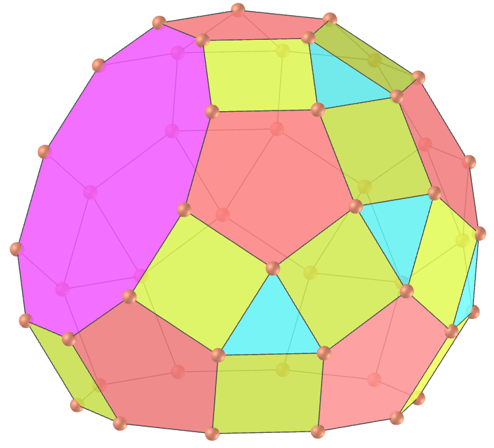 Rombicosidodecaedro metabidiminuído</a></td>
		<td></td>
		<td></td>
	</tr>
	<tr>
		<td>J82</td>
		<td class="titulo1"><a href="../johnson3/pt-br/#m3d" target="_blank"> Rombicosidodecaedro bidiminuído girado</a></td>
		<td></td>
		<td></td>
	</tr>
	<tr>
		<td>J83</td>
		<td class="titulo1"><a href="../johnson3/pt-br/#m3d" target="_blank">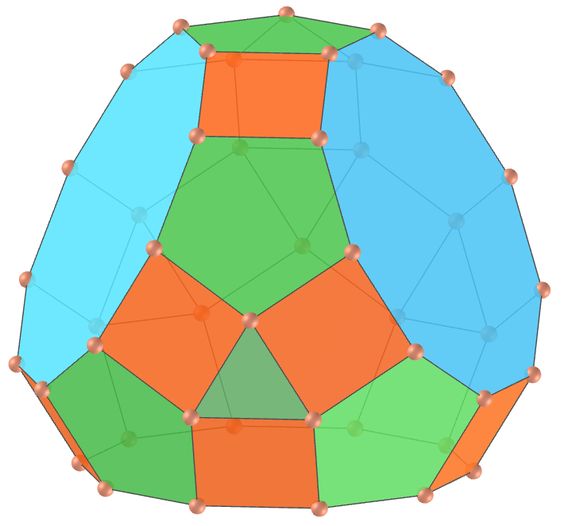 Rombicosidodecaedro tridiminuído</a></td>
		<td></td>
		<td></td>
		<td rowspan="10"></td>
	</tr>
	<tr>
		<td>J84</td>
		<td class="titulo1"><a href="../johnson3/pt-br/#m3d" target="_blank">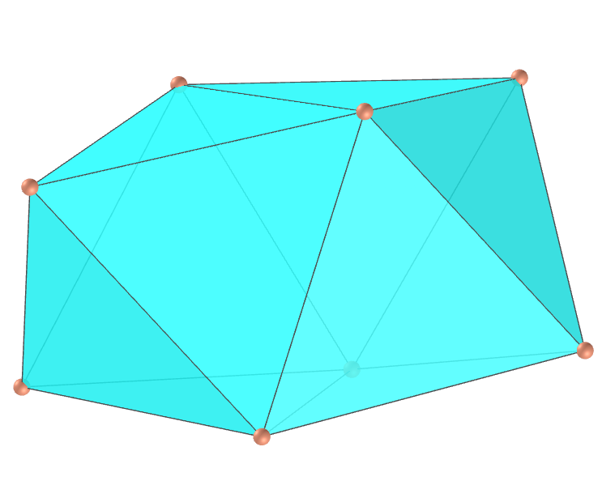 Disfenóide snub</a></td>
		<td></td>
		<td></td>
	</tr>
	<tr>
		<td>J85</td>
		<td class="titulo1"><a href="../johnson3/pt-br/#m3d" target="_blank"> Antiprisma quadrado snub</a></td>
		<td></td>
		<td></td>
	</tr>
	<tr>
		<td>J86</td>
		<td class="titulo1"><a href="../johnson3/pt-br/#m3d" target="_blank">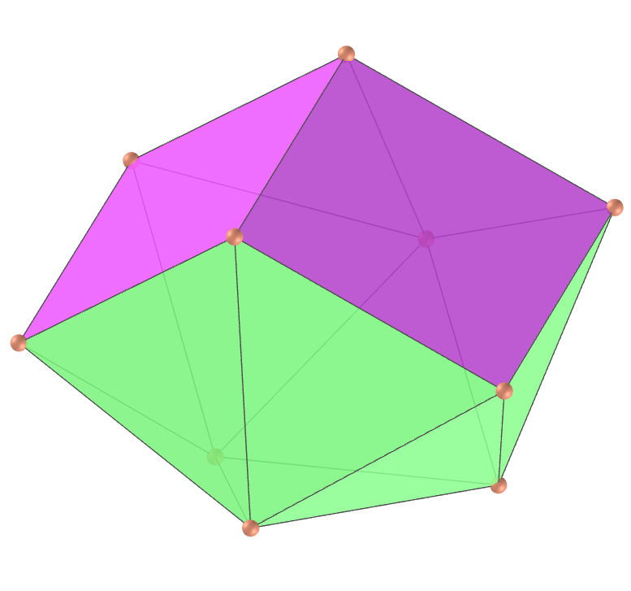 Esfenocorona</a></td>
		<td></td>
		<td></td>
	</tr>
	<tr>
		<td>J87</td>
		<td class="titulo1"><a href="../johnson3/pt-br/#m3d" target="_blank"> Esfenocorona aumentada</a></td>
		<td></td>
		<td></td>
	</tr>
	<tr>
		<td>J88</td>
		<td class="titulo1"><a href="../johnson3/pt-br/#m3d" target="_blank"> Esfenomegacorona</a></td>
		<td></td>
		<td></td>
	</tr>
	<tr>
		<td>J89</td>
		<td class="titulo1"><a href="../johnson3/pt-br/#m3d" target="_blank">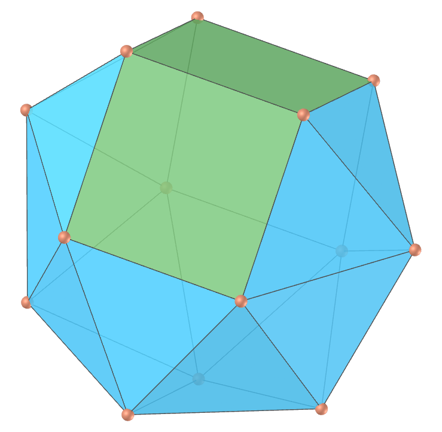 Hebesfenomegacorona</a></td>
		<td></td>
		<td></td>
	</tr>
	<tr>
		<td>J90</td>
		<td class="titulo1"><a href="../johnson3/pt-br/#m3d" target="_blank">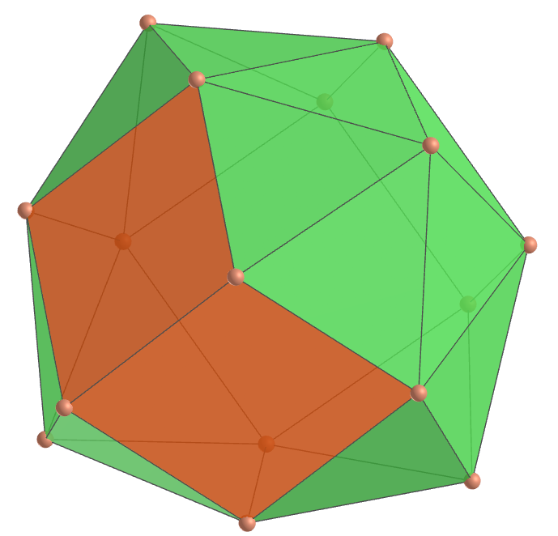 Disfenocingulum</a></td>
		<td></td>
		<td></td>
	</tr>
	<tr>
		<td>J91</td>
		<td class="titulo1"><a href="../johnson3/pt-br/#m3d" target="_blank"> Birotunda bilunar</a></td>
		<td></td>
		<td></td>
	</tr>
	<tr>
		<td>J92</td>
		<td class="titulo1"><a href="../johnson3/pt-br/#m3d" target="_blank"> Hebesfenorotunda triangular</a></td>
		<td></td>
		<td></td>
	</tr>
</table>

  Polyhedra: Visualization of polyhedra with Augmented Reality and Virtual Reality by <a xmlns:cc="http://creativecommons.org/ns#" href="https://paulohscwb.github.io/polyhedra/" property="cc:attributionName" rel="cc:attributionURL">Paulo Henrique Siqueira</a> está licenciado com uma Licença <a rel="license" href="http://creativecommons.org/licenses/by-nc-nd/4.0/">Creative Commons Attribution-NonCommercial-NoDerivatives 4.0 International</a>.

<h4>Como citar este trabalho:</h4> 

Siqueira, P.H., "Polyhedra: Visualization of polyhedra with Augmented Reality and Virtual Reality". Disponível em: <https://paulohscwb.github.io/polyhedra/>, Setembro de 2019.

 <b>Referências:</b>
 Weisstein, Eric W. "Archimedean Solid" From MathWorld-A Wolfram Web Resource. <a href="http://mathworld.wolfram.com/ArchimedeanSolid.html" target="_blank">http://mathworld.wolfram.com/ArchimedeanSolid.html</a>
 Weisstein, Eric W. "Platonic Solid" From MathWorld-A Wolfram Web Resource. <a href="http://mathworld.wolfram.com/PlatonicSolid.html" target="_blank">http://mathworld.wolfram.com/PlatonicSolid.html</a>
 Weisstein, Eric W. "Archimedean Dual" From MathWorld-A Wolfram Web Resource. <a href="https://mathworld.wolfram.com/ArchimedeanDual.html" target="_blank">https://mathworld.wolfram.com/ArchimedeanDual.html</a>
 Weisstein, Eric W. "Uniform Polyhedron." From MathWorld--A Wolfram Web Resource. <a href="https://mathworld.wolfram.com/UniformPolyhedron.html" target="_blank">https://mathworld.wolfram.com/UniformPolyhedron.html</a>
 Wikipedia <a href="https://en.wikipedia.org/wiki/Archimedean_solid" target="_blank">https://en.wikipedia.org/wiki/Archimedean_solid</a>
 Wikipedia <a href="https://en.wikipedia.org/wiki/en.wikipedia.org/wiki/Platonic_solid" target="_blank">https://en.wikipedia.org/wiki/Platonic_solid</a>
 McCooey, David I. "Visual Polyhedra". <a href="http://dmccooey.com/polyhedra/" target="_blank">http://dmccooey.com/polyhedra/</a>
